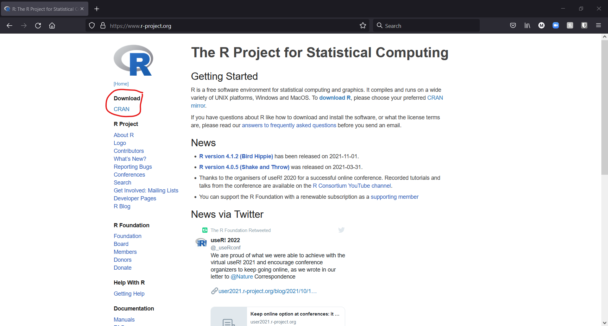
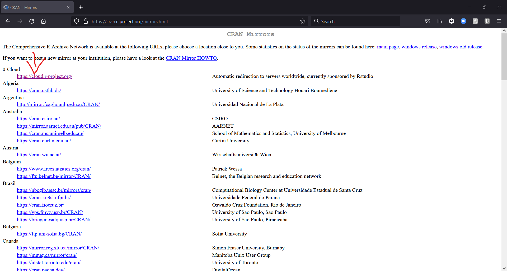
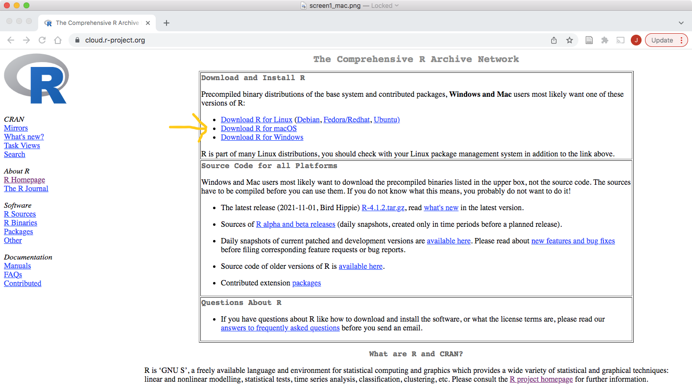
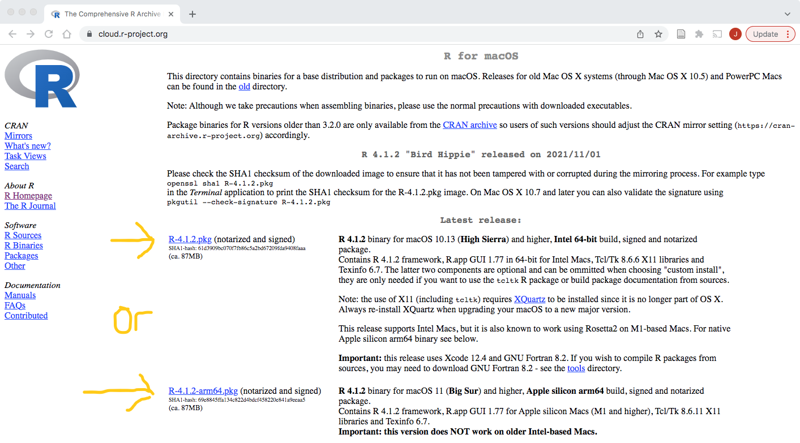
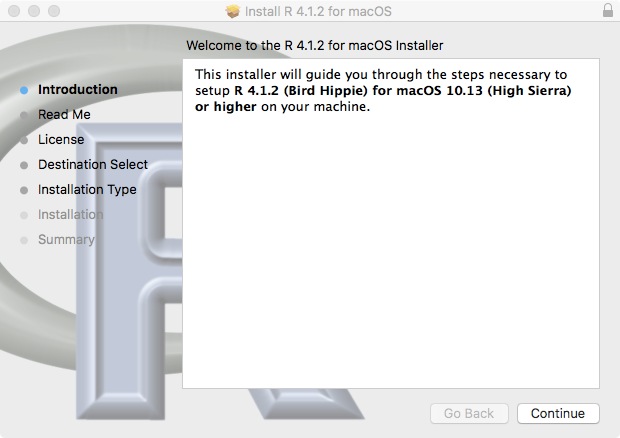
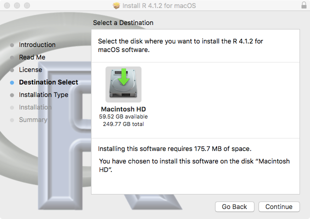
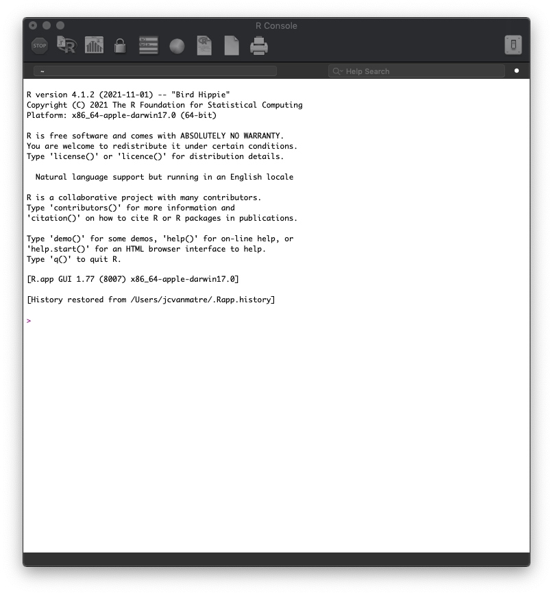
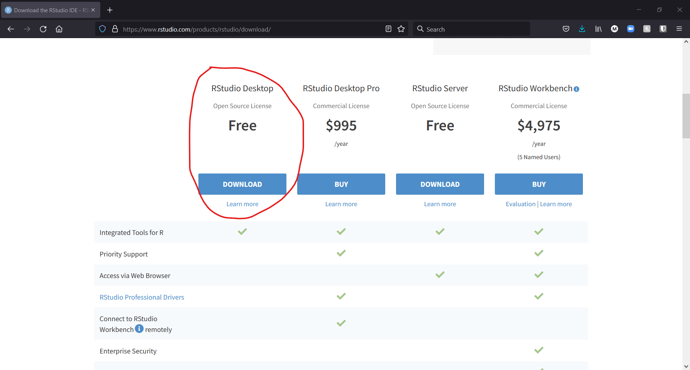
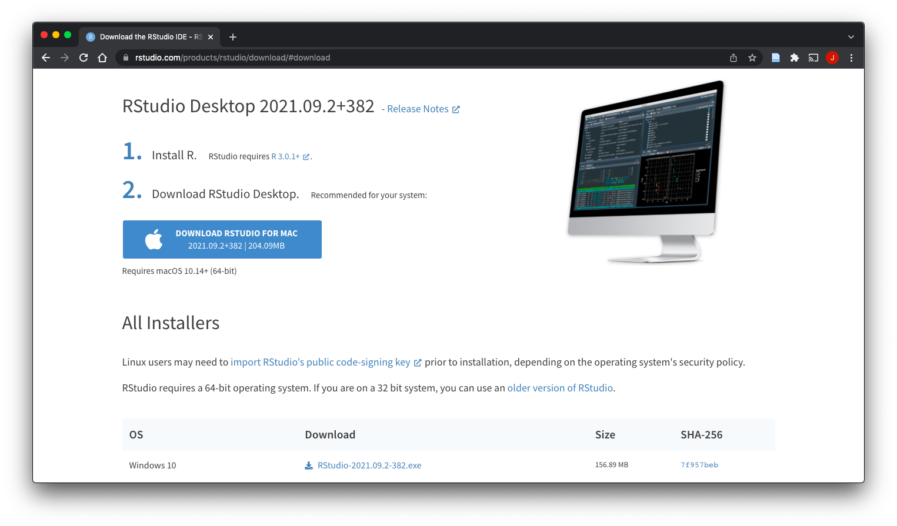
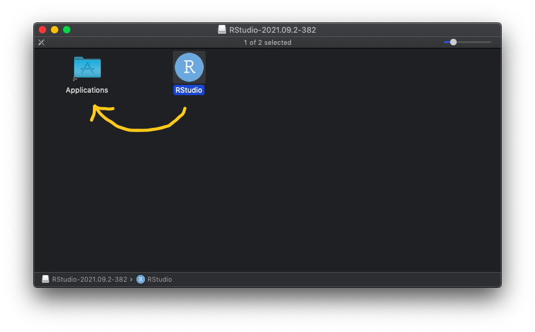

When learning new programs, we need to start from the beginning. And in this case it means to see the steps to install the programs we will be using. Here we will go over the steps to install [R](https://www.r-project.org/) and [RStudio](https://www.rstudio.com/) on Mac [R](https://www.r-project.org/) is the statistical software package that we will be using and [RStudio](https://www.rstudio.com/) is an interface that makes R easier and more convenient to use.

# Let's install R!

Firs we need to go R project site [https://www.r-project.org/](https://www.r-project.org/). From the home page we need to look for the **CRAN** link under **Download** on the left. The website format may change slightly, but the **CRAN** link will always be on the homepage.

After clicking on the **CRAN**, we find ourselves on the **CRAN Mirrors** selection page. Now, you might wonder, what are the mirrors? Are any of them magical? I think it's some kind of magic. The mirrors show all the validated sites that hold all the **R** files. So we can see how it is not centralized and the same information is hold and share from all over the globe. 

In this part just select any mirror from where you want to pull the files, can be any of them.

After you have choose a mirror, we get to chose for which Operating System (OS) we need **R**. In this case we are getting the one for **Mac**

Once we are here we need to select the operating system your Mac uses. If you don't know which operating system you have, click on the apple icon in the top left of the screen and choose "About this Mac." The operating system will be in bold at the top of the window.  

Click the package you need to download and save the .pkg file in your downloads folder. 

Now, go find the *.pkg* installer file in **Downloads** folder and double click it. You can install **R** as an administrator for all users in your computer, or you can install it without administrator rights only for the current user. (If you are not presented with this option, just move to the next step.) After that follow the steps of the installation as shown in the following screens.

Click **Continue** through the Read Me and the License terms page and agree to the License terms.

You now need to select where to save the program. There should only be one option as shown below. If there is more than one option, choose the Macintosh option and click **Continue**.

Finally, click **Install**. At the end of the instillation, you should see a green check mark. You can close the installation window when you see this. 

You may be asked if you wish to keep the installation package when you close out the instillation window. You should choose to move it to the **Trash**.

Horray! You have installed **R**!  

Now, when you Open **R** it looks like this, which is not very friendly to work with. So, we will use **RStudio** as our editor/interface to work with **R**. Think of **R** as the engine of a car, and **RStudio** as the chassis of the car so it is easier to handle it.

# Let's install RStudio!

First we need to go RStudio site [https://www.rstudio.com/](https://www.rstudio.com/). From there we will click on to **Download** link on the top right

In the next window we will scroll down, and select the **Download** link for the **RStudio Desktop Free**

In the next screen we will see that the site is recommending a version to download. For most users this is the best version to install. Now, you can download the **.dmg** installer from here.  

Next we can start the installation with **RStudio-2021.09.2-382.dmg**, or a more recent version. Start the installer and follow the setup steps.

Once the file is downloaded, open the **.dmg** in a folder. All you need to do is click and drag the RStudio icon into the **Applications** folder. 

You can now go to the Launchpad and find both R and RStudio.

The first time you open RStudio, it may ask if you wish to download a connection to **Git**. This is unnecessary for your courses in this department. 

When you open **RStudio** will look something like this. Congratulations! You have successfully downloaded **R** and **RStudio** We will look into how to work with it in the next tutorials.

