Installing R and RStudio on Windows
================
Mauricio Garnier-Villarreal, Joris M. Schröder & Joseph Charles Van
Matre
01 September, 2022

-   <a href="#lets-install-r" id="toc-lets-install-r">Let’s install R!</a>
-   <a href="#lets-install-rstudio" id="toc-lets-install-rstudio">Let’s
    install RStudio!</a>

When learning new programs, we need to start from the beginning. And in
this case it means to see the steps to install the programs we will be
using. Here we will go over the steps to install
[R](https://www.r-project.org/) and [RStudio](https://www.rstudio.com/)
on Windows. [R](https://www.r-project.org/) is the statistical software
package that we will be using and [RStudio](https://www.rstudio.com/) is
an interface that makes R easier and more convenient to use.

# Let’s install R!

Firs we need to go R project site <https://www.r-project.org/>. From the
home page we need to look for the **CRAN** link under **Download** on
the left. The website format may change slightly, but the **CRAN** link
will always be on the homepage.

After clicking on the **CRAN**, we find ourselves on the **CRAN
Mirrors** selection page. Now, you might wonder, what are the mirrors?
Are any of them magical? I think it’s some kind of magic. The mirrors
show all the validated sites that hold all the **R** files. So we can
see how it is not centralized and the same information is hold and share
from all over the globe.

In this part just select any mirror from where you want to pull the
files, can be any of them.

After you have choose a mirror, we get to chose for which Operating
System (OS) we need **R**. In this case we are getting the one for
**Windows**

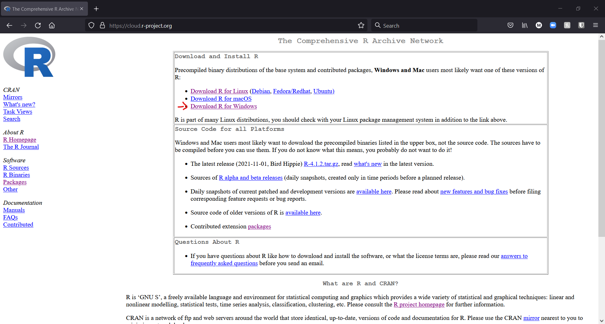

Once we are here we need to select the type of installation we are
looking for, in this case we are looking for **install R for the first
time**

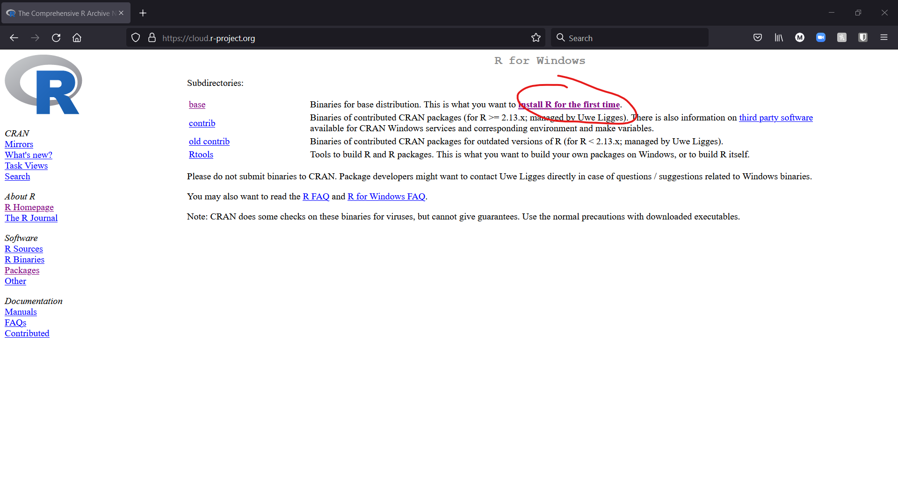

In the next step we will finally download the *.exe* installer for
**Windows**

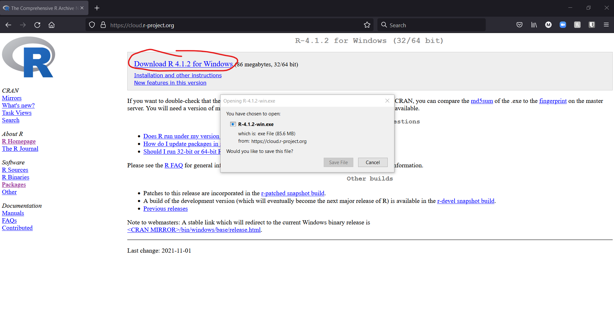

Now, go find the *.exe* installer file in your computer folder (most
likely the **Downloads** folder). For this version is the file
**R-4.1.2-win.exe**, and double click it. You can install **R** as an
administrator for all users in your computer, or you can install it
without administrator rights only for the current user. (If you are not
presented with this option, just move to the next step.) After that
follow the steps of the installation as shown in the following screens

Now we will start the installation, here you can chose the language for
**R**, in this case we will use English.

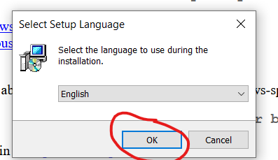

Next we are presented with the Public License information, after
carefully reading this you can continue (because I know all of you
always read the software license information)

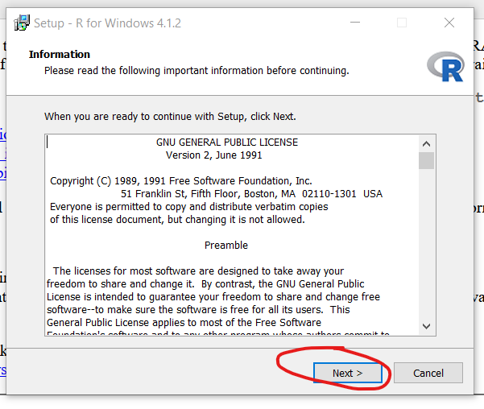

In the next screen we choose the folder where **R** will be, by default
it goes to the **C:** drive. You can let it be there, unless you don’t
have permission to write on the **C:** drive, then you would need to
choose another folder.

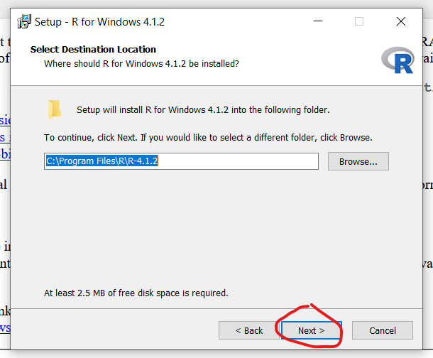

In the next step, we need to choose what components to install. The
general recommendation is to install all of them. If your computer only
works with 32-bit, then don’t install the 64-bit version. If you don’t
know if you have a 32- or 64-bit system, click the start button and type
“System Information”. Click on the System Information app and it will be
listed.

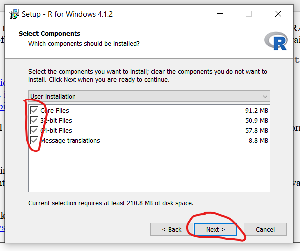

Next we can customize the **R** installation. The general recommendation
is to choose the default one.

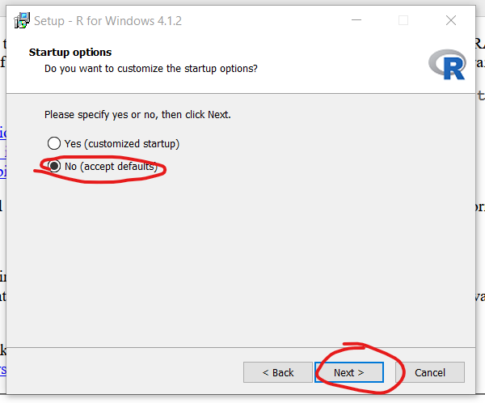

Following, the installer will ask you to select the **Start menu
folder**, my recommendation is to select **Don’t create a Start Menu
Folder**

Next, we have some other options to choose from. What I recommend is to
**Create a desktop shortcut**. But the next two options are more
important, **Save version number in registry**, so the **R** version are
saved and the computer knows about updated and new versions. And
**Associate R with .RData files** so the data formats **.RData** are
automatically open with **R**.

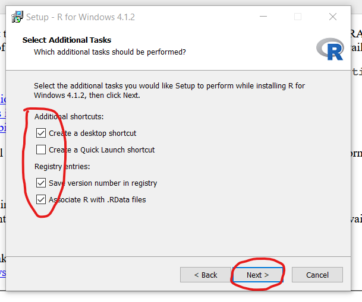

Finally, we are now installing **R**!!

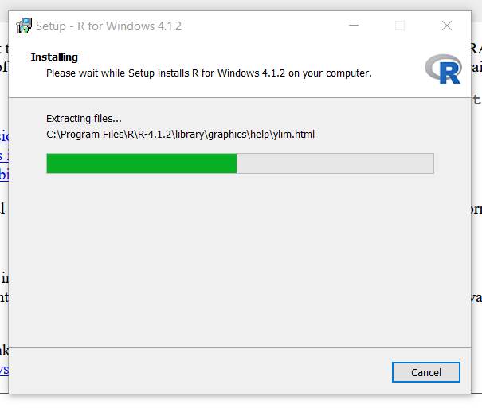

Congratulation! you have installed **R**

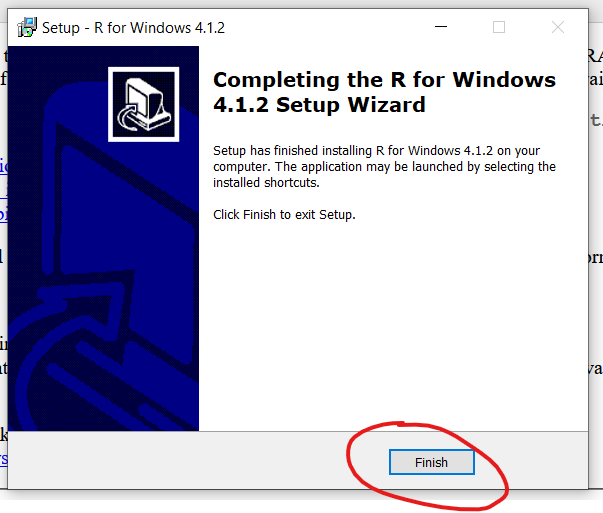

Now, when you Open **R** it looks like this, which is not very friendly
to work with. So, we will use **RStudio** as our editor/interface to
work with **R**. Think of **R** as the engine of a car, and **RStudio**
as the chassis of the car so it is easier to handle it.

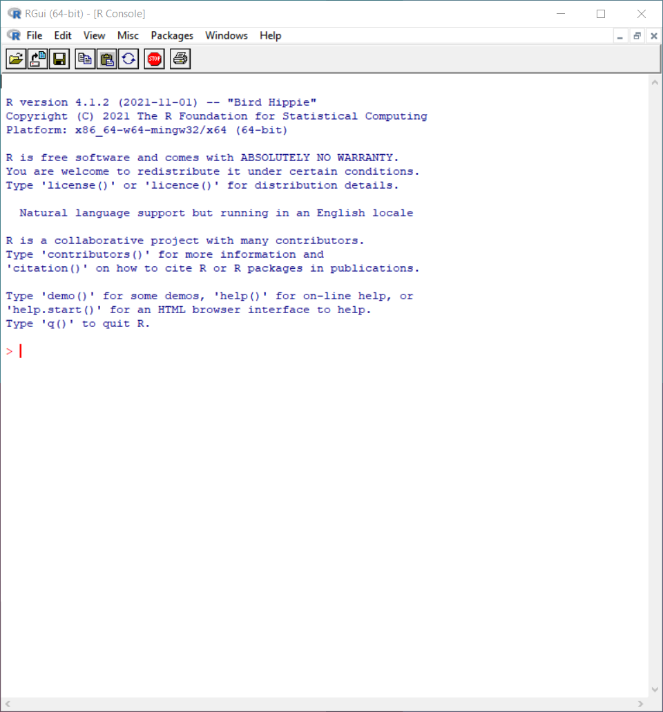

# Let’s install RStudio!

First we need to go RStudio site <https://www.rstudio.com/>. From there
we will click on to **Download** link on the top right

In the next window we will scroll down, and select the **Download** link
for the **RStudio Desktop Free**

In the next screen we will see that the site is recommending a version
to download. For most users this is the best version to install. Now,
you can download the **.exe** installer from here.

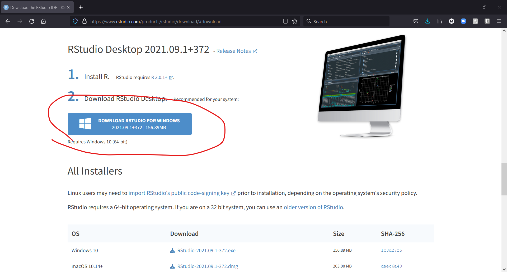

Next we can start the installation with **RStudio-2021.09.1-372.exe**,
or a more recent version. Start the installer and follow the setup
steps.

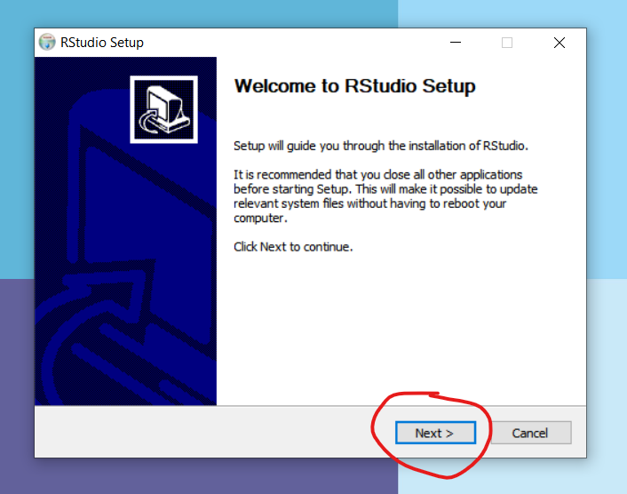

Next you will be asked to select the directory to save the program. By
default will be the **C:** drive. Unless you don’t have administrative
rights to write here, I recommend to keep this selection.

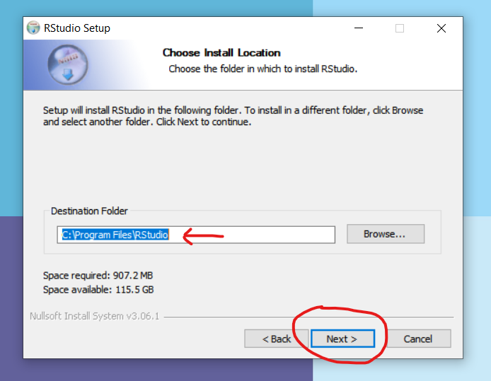

In the following step, we are asked to set the start menu shortcut. I
prefer to not have shortcut, but if you prefer to have one make sure to
tick the respective box.

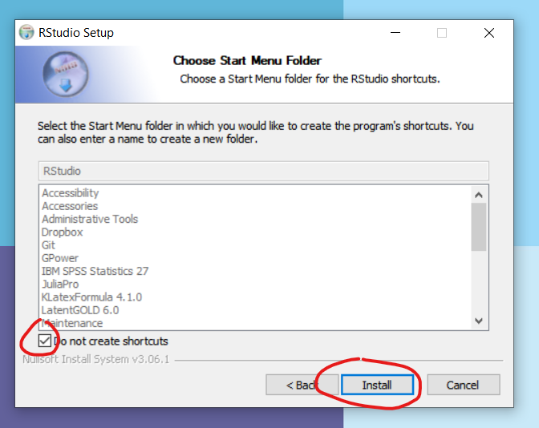

Now, we are finally installing. Let it go

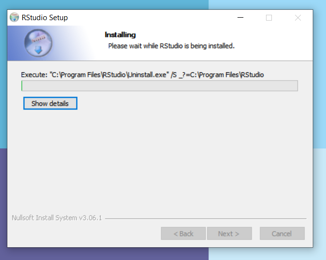

Finally, we are done with the installation. Now we can start working it.

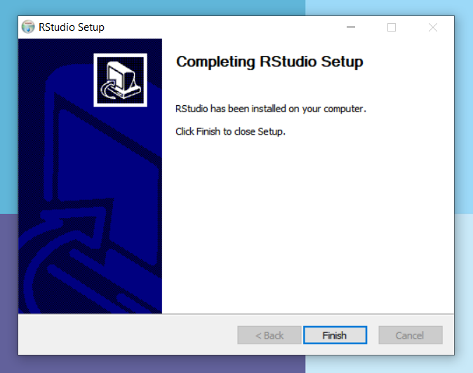

When you open **RStudio** will look something like this.
Congratulations! You have successfully downloaded **R** and **RStudio**
We will look into how to work with it in the next tutorials.

