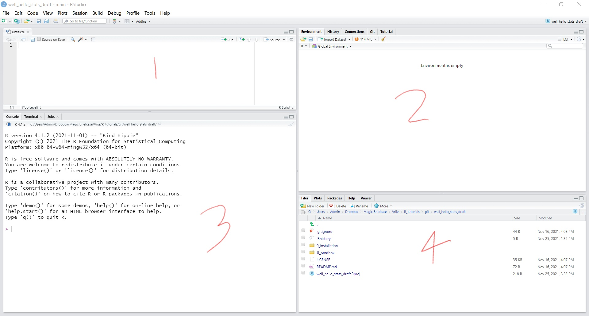
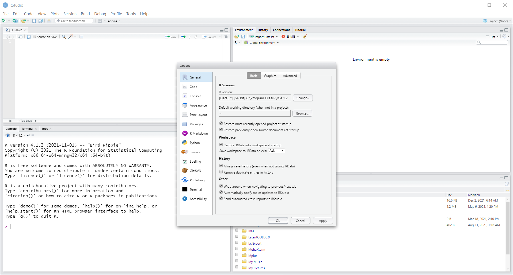
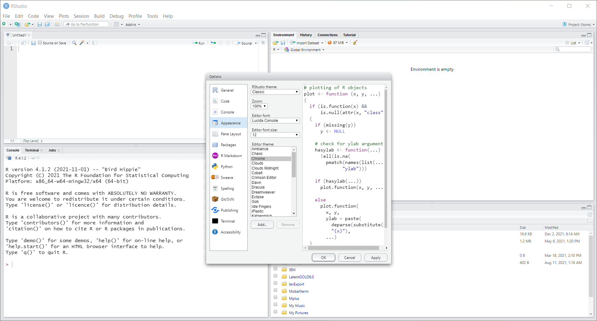
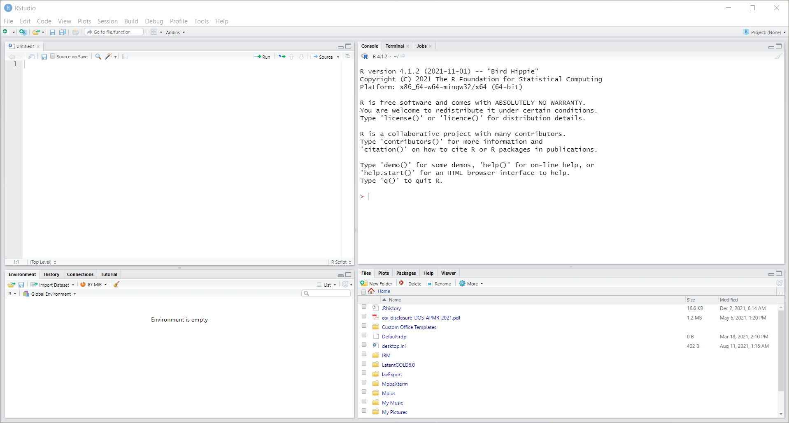
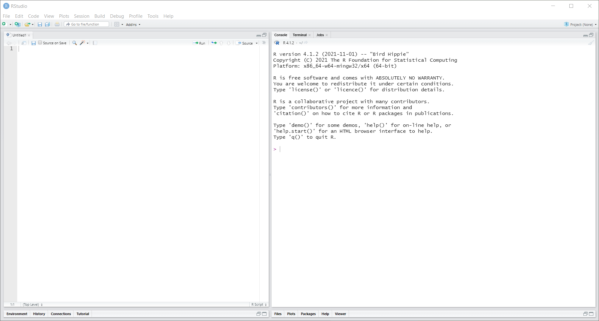
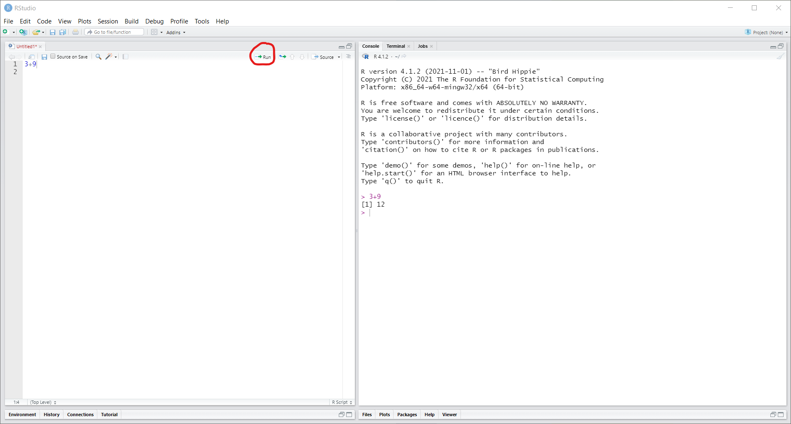

We recommend to work with **R** in an editor, there are several options, and we will use **RStudio**. So in this tutorial we will take a look at **RStudio** and how to use it.

# RStudio panes

This editor is organized in *panes*, these are the 4 mayor spaces and how we interact with **R**. We you open it it will look like this, I have  (poorly) label the panes with numbers. 

## Syntax use

**Pane 1** is the syntax, where we will be writing code and *send* it to run. **Pane 2** has several uses as you can see in tabs, the one that is used more is the *Environment* tab. This tab will show which objects are created and can be used in our analysis. **Pane 3** is the *Console*, which is actually **R**, where we run analysis and will see the results. You can see in here we can see the version we have installed and some information about **R**. Finally, **Pane 4** also has multiple uses as you can see on the tabs, but the ones we will use more are *Plots* and *Packages*.   

From this we can see that the 2 panes we will use the most are **1** and **3**. As these will have will have our syntax and results, even as the panes sizes can be adjusted I recommend to adjust the layout of these panes so we can have panes 1 and 3 next to each other. 

## Change apperance 

In general we can adjust how we want to interact and the aesthetic of **RStudio**. For this we will go to the top tabs: *Tools > Global Options*. When we get here, you can customize how you want **RStudio** to look. Here we will look at only two of these options

Firs you can go to the **Appearance** tab, here you can change the font size, zoom and theme, for example if you want dark screen. When I teach, I usually increase the font so students can see the screen easier in the classroom. 

The next one, we will look at **Pane layout** tab. Here you can adjust where do you can each of the 4 panes. My recommendation is to have the syntax and console next to each other. Once you do this can click **OK** to apply the changes you made

Once we do these changes, we will have the same panes with the new arrangement. Here we see the new layout, with the syntax and console next to each other. 

When working with larger projects, I find this useful to have these 2 panes take other the whole screen, allowing us to see the syntax and results easier

Now, lets see how to run a simple line of code from the syntax to the console (**R**). The most basic use is as a calculator, so lets make a calculation on the syntax pane. Lets write **3+9** on the syntax pane, then you have 2 ways to send it to *run* on the console. While having the mouse cursor on the same line as your code, click the **run** button on the top right of the syntax pane. The second is (while having the mouse cursor on the same line as your code), click **ctrl+enter** in your keyboard. After doing this you can see the calculation done in the console

With this we have seen how to set up and modify how we want to interact with **RStudio**, and run code to the console. 

