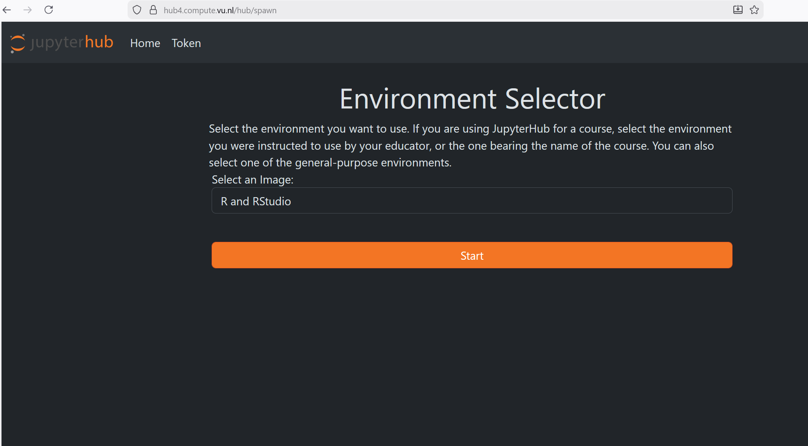
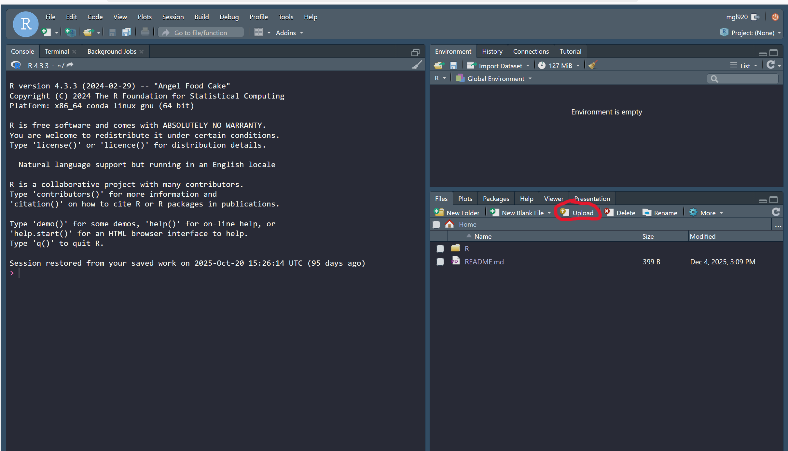
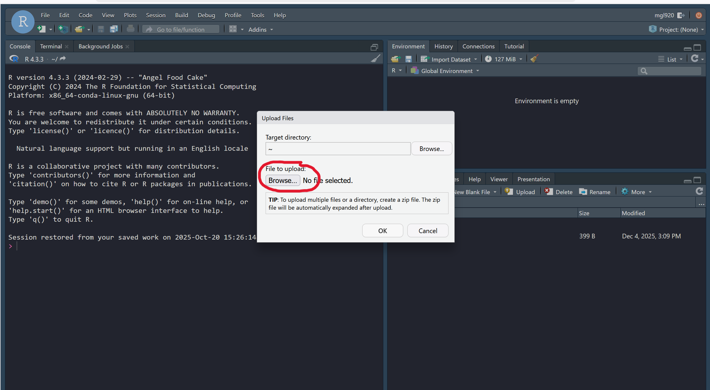

Using R in the cloud
================
Mauricio Garnier-Villarreal
24 January, 2026

- [JupyterHub VU](#jupyterhub-vu)
- [Posit cloud](#posit-cloud)
- [Using R in the cloud](#using-r-in-the-cloud)

When working with with R, in some cases it is better to use it in the
cloud instead of having everything locally installed. Here we will show
you 2 ways to work in R in the cloud

# JupyterHub VU

If you have a VU account you can access the
[JupyterHub](https://hub.compute.vu.nl/), here are the steps neccesary

- Go to the JupyterHubVU site <https://hub.compute.vu.nl/>
- Select one of the **hubs**, we recommend the one with lower CPU usage
  and click on **Launch**
- Login with your VUnetID and password.
- In the new window that appears you can find **R and RStudio** in the
  menu **Select an Image** (see screenshot below) and click **start**
- Click on the RStudio icon.

After this you will have a **RStudio** session on the VU cloud.

# Posit cloud

The second option is to use the cloud of the company **Posit**, this is
the same company from RStudio

- Go to the Posit cloud site <https://posit.co/products/cloud/cloud/>
- create a free account: this will open a Posit cloud session
- create “new project” -\> RStudo : this will open an RStudio session on
  the cloud

# Using R in the cloud

While using RStudio on the JypyterHub, there is only one more step you
need to follow before starting. You need to **upload** all the relevant
files .

For this first click on the **Upload** button as shown in the next
screenshot

Then click on the second **Browse** button (as shown in the next
screenshot), find and import all the relavnt files for this session
(syntax, data sets, etc)

After this, you will use R as usual
