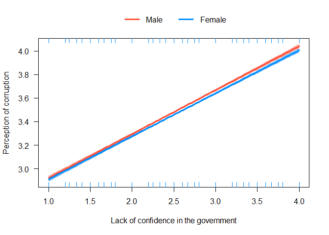
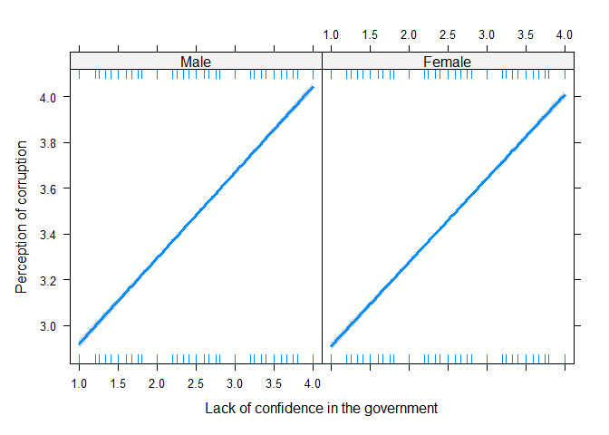
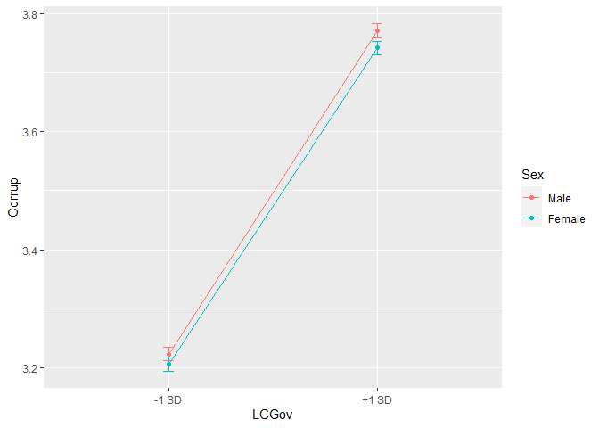
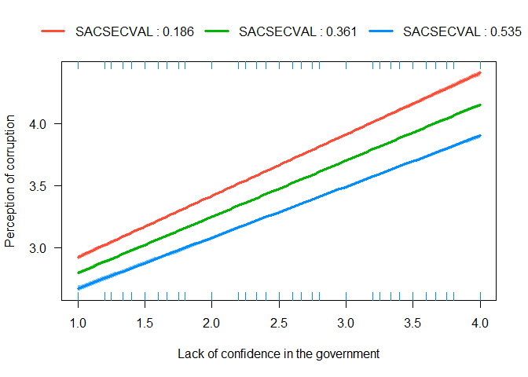
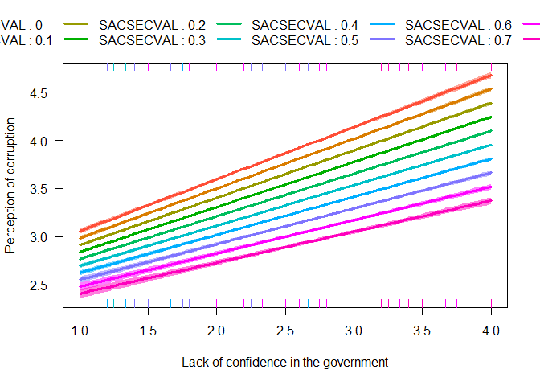

Moderation with lm()
================
Mauricio Garnier-Villarreal, Joris M. Schröder & Joseph Charles Van
Matre
26 September, 2023

- [What is moderation analysis?](#what-is-moderation-analysis)
- [Setup the R session](#setup-the-r-session)
- [Import the data set](#import-the-data-set)
  - [Prepare the data set](#prepare-the-data-set)
    - [Create composite scores](#create-composite-scores)
    - [Transform categorical variables to
      `factor()`](#transform-categorical-variables-to-factor)
    - [Set variables for analysis](#set-variables-for-analysis)
- [Moderation analysis steps](#moderation-analysis-steps)
- [Categorical moderator](#categorical-moderator)
  - [Main effects](#main-effects)
    - [Interpretation](#interpretation)
  - [Interaction model](#interaction-model)
    - [Compare models](#compare-models)
    - [Effect size](#effect-size)
    - [Probing](#probing)
    - [Plotting](#plotting)
    - [Interpretation](#interpretation-1)
- [Continuous moderator](#continuous-moderator)
  - [Main effects](#main-effects-1)
    - [Interpretation](#interpretation-2)
  - [Interaction model](#interaction-model-1)
    - [Compare models](#compare-models-1)
    - [Effect size](#effect-size-1)
    - [Probing](#probing-1)
    - [Plotting](#plotting-1)
    - [Interpretation](#interpretation-3)
- [References](#references)

# What is moderation analysis?

With moderation analysis, we are trying to find out whether the effect
or association between two variables depends on another variable. Let’s
say that we are interested in the association between *Lack of
confidence in the government* and *Perception of corruption*, but we
specifically want to know whether the association depends on the *Sex*
or the *Secular Values* of individuals. The latter two variables are
called *moderators* of the association between *Lack of confidence in
the government* and *Perception of corruption*.

# Setup the R session

When we start working in R, we always need to setup our session. For
this we need to set our working directory, in this case I am doing that
for the folder that holds the downloaded [World Values Survey
(WVS)](https://www.worldvaluessurvey.org/) `SPSS` data set

``` r
setwd("~path_to_your_file")
```

The next step for setting up our session will be to load the packages
that we will be using

``` r
library(rio)
library(effectsize)
library(visreg)
library(reghelper)
```

# Import the data set

Here we will be importing the `.sav` WVS data set

``` r
dat <- import("WVS_Cross-National_Wave_7_sav_v2_0.sav")
dim(dat)
```

    ## [1] 76897   548

Here we are calling our data set **dat** and asking to see the dimension
of it. We see that the data set has 76897 subjects, and 548 columns.

## Prepare the data set

In cases with large data sets like this we might want to select a subset
of variables that we want to work with. Since it is not easy to see 548
variables.

``` r
vars <- c("Q260","Q262", "Y001", "SACSECVAL", "Q112", "Q113", "Q114", "Q115", "Q116", "Q117", "Q118", "Q119", "Q120", "Q65", "Q69", "Q71", "Q72", "Q73")
dat2 <- dat[,vars]
dim(dat2)
```

    ## [1] 76897    18

``` r
head(dat2)
```

    ##   Q260 Q262 Y001 SACSECVAL Q112 Q113 Q114 Q115 Q116 Q117 Q118 Q119 Q120 Q65 Q69
    ## 1    2   60    0  0.287062    2   NA   NA   NA   NA   NA    1    2    6  NA   1
    ## 2    1   47    2  0.467525   10    3    3    3    3    3    1    3    2  NA   3
    ## 3    1   48    4  0.425304    7    2    2    2    2    2    1    2    7  NA   2
    ## 4    2   62    2  0.556170    5    3    3    3    3    2    1    4    7  NA   3
    ## 5    1   49    1  0.458949    5    2    2    2    2    1    1    3    7  NA   2
    ## 6    2   51    3  0.210111    6    2    2    2    2    2    1    4    2  NA   1
    ##   Q71 Q72 Q73
    ## 1   1   1   1
    ## 2   4   4   4
    ## 3   3   3   3
    ## 4   3   3   3
    ## 5   2   3   2
    ## 6   2   2   2

Here we are first creating a vector with the variable names for the ones
I want to keep. You can see all variable names for the full data set as
well:

``` r
colnames(dat)
```

After identifying which variables we will work with, we create a new
data set **dat2** with only these 17 variables, and make sure we did it
correctly by looking at the the dimension of the data **dim(dat2)**. We
also look at the first 6 rows: **head(dat2)**. These are quick checks
that we have created the new data correctly.

The variables we will use here are:

- Q260: sex, 1 = Male, 2 = Female
- Q262: age in years
- Y001: post-materialism index
- SACSECVAL: secular values
- Q112-Q120: Corruption Perception Index
- Q65-Q73: Lack of Confidence in the government

### Create composite scores

We will be using the composite scores for *Corruption Perception Index*
and *Lack of Confidence in the government* instead of their single
items. So, we first need to compute them, we will use the mean across
all items for each composite

``` r
dat2$Corrup <- rowMeans(dat2[,c("Q112", "Q113", "Q114", "Q115", "Q116", "Q117", "Q118", "Q119", "Q120")], na.rm=T)
dat2$LCGov <- rowMeans(dat2[,c("Q65", "Q69", "Q71", "Q72", "Q73")], na.rm=T)
head(dat2)
```

    ##   Q260 Q262 Y001 SACSECVAL Q112 Q113 Q114 Q115 Q116 Q117 Q118 Q119 Q120 Q65 Q69
    ## 1    2   60    0  0.287062    2   NA   NA   NA   NA   NA    1    2    6  NA   1
    ## 2    1   47    2  0.467525   10    3    3    3    3    3    1    3    2  NA   3
    ## 3    1   48    4  0.425304    7    2    2    2    2    2    1    2    7  NA   2
    ## 4    2   62    2  0.556170    5    3    3    3    3    2    1    4    7  NA   3
    ## 5    1   49    1  0.458949    5    2    2    2    2    1    1    3    7  NA   2
    ## 6    2   51    3  0.210111    6    2    2    2    2    2    1    4    2  NA   1
    ##   Q71 Q72 Q73   Corrup LCGov
    ## 1   1   1   1 2.750000  1.00
    ## 2   4   4   4 3.444444  3.75
    ## 3   3   3   3 3.000000  2.75
    ## 4   3   3   3 3.444444  3.00
    ## 5   2   3   2 2.777778  2.25
    ## 6   2   2   2 2.555556  1.75

With the `rowmeans()` we compute the mean across the specified
variables, for each subject. Remember to include the `na.rm=T` argument,
so the missing values are properly ignored.

### Transform categorical variables to `factor()`

when we want to use categorical variables as predictors, it is
recommended to transformed them as `factor` type in `R`. In this case we
will use the *Sex* variable `Q260`, which is coded as 1 and 2 right now.

With the `factor()` function we an transform it, and change the numbers
to meaningful labels.

``` r
dat2$Sex <- factor(dat2$Q260, 
                       levels = 1:2,
                       labels = c("Male","Female") )
```

### Set variables for analysis

Now, we will select only the variables of interest in a separate data
set.

``` r
dat2 <- na.omit(dat2[,c("Sex", "Q262", "Y001", "SACSECVAL", "Corrup", "LCGov")])
head(dat2)
```

    ##      Sex Q262 Y001 SACSECVAL   Corrup LCGov
    ## 1 Female   60    0  0.287062 2.750000  1.00
    ## 2   Male   47    2  0.467525 3.444444  3.75
    ## 3   Male   48    4  0.425304 3.000000  2.75
    ## 4 Female   62    2  0.556170 3.444444  3.00
    ## 5   Male   49    1  0.458949 2.777778  2.25
    ## 6 Female   51    3  0.210111 2.555556  1.75

``` r
dim(dat2)
```

    ## [1] 71633     6

The new `dat2` data set only include the 6 continuous variables of
interest, and 1 binary variable. With the `na.omit()` function we are
excluding all cases with some missing values.

# Moderation analysis steps

Moderation is split into multiple steps, (a)

- Estimate the *main effects* model that includes only the predictors as
  a *normal* multiple regression.
- Estimate the *interaction* model that now also includes the
  interactions between predictors.
- Compare the models: the *p-value* test the Null hypothesis of the two
  predictors being independent, and the change in $R^2$ represents the
  effect size magnitude of the interaction
- Probe: estimate the simple slopes, the slope for the focal predictor
  at fixed values of the moderator predictor.
- Plot the simple slopes

The first three steps test the Null Hypothesis of the interaction (with
the respective effect size), while the last two steps seek to explain
*how does the moderator affects the focal relation?*, and help interpret
these conditional relations.

We will see how to implement these steps for two common interaction
scenarios, with categorical and continuous moderators

# Categorical moderator

For the categorical predictor model, we will have *Lack of confidence in
the government* as the focal predictor, and *Sex* as the categorical
moderator. Having them predict the *Perception of corruption*

## Main effects

The main effects model presents both the effects of each predictor on
the outcome. When the moderator is categorical, we strongly recommend to
set the moderator as `factor()`, as `R` will automatically know it is
categorical and make the correct plots and conditional values.

``` r
main_cat <- lm(Corrup ~ LCGov + Sex, data=dat2)
summary(main_cat)
```

    ## 
    ## Call:
    ## lm(formula = Corrup ~ LCGov + Sex, data = dat2)
    ## 
    ## Residuals:
    ##     Min      1Q  Median      3Q     Max 
    ## -3.8269 -0.4807 -0.0487  0.4309  7.0961 
    ## 
    ## Coefficients:
    ##              Estimate Std. Error t value Pr(>|t|)    
    ## (Intercept)  2.558014   0.010946 233.704  < 2e-16 ***
    ## LCGov        0.369207   0.003967  93.072  < 2e-16 ***
    ## SexFemale   -0.023369   0.005824  -4.013 6.01e-05 ***
    ## ---
    ## Signif. codes:  0 '***' 0.001 '**' 0.01 '*' 0.05 '.' 0.1 ' ' 1
    ## 
    ## Residual standard error: 0.7787 on 71630 degrees of freedom
    ## Multiple R-squared:  0.1081, Adjusted R-squared:  0.1081 
    ## F-statistic:  4341 on 2 and 71630 DF,  p-value: < 2.2e-16

### Interpretation

- We reject the null hypothesis of both predictors being equally good
  predictors as the mean model, $F(2, 71630) = 4341, p < .001$.
- Both predictors explained 11% of the variance in the outcome
  ($R^2 = 0.108$).
- The average outcome score for *Male* with 0 *Lack of confidence in the
  government* is 2.55 ($b_0 = 2.55, SE = 0.01, p < .001$)
- As *Lack of confidence in the government* increase by 1 unit,
  *Perception of corruption* increases by 0.36
  ($b_1 = 0.36, SE = 0.004, p < .001$), holding *Sex* constant.
- As *Sex* changes, *Perception of corruption* decreases by 0.023 for
  *Female* ($b_2 = -0.023, SE = 0.006, p < .001$), holding *Lack of
  confidence in the government* constant.

## Interaction model

The interaction model is an extension from the main effects, we can add
the interaction between predictors as a new term in the formula as
`predictor1*predictor2`

``` r
int_cat <- lm(Corrup ~ LCGov + Sex + LCGov*Sex, data=dat2)
summary(int_cat)
```

    ## 
    ## Call:
    ## lm(formula = Corrup ~ LCGov + Sex + LCGov * Sex, data = dat2)
    ## 
    ## Residuals:
    ##     Min      1Q  Median      3Q     Max 
    ## -3.8231 -0.4817 -0.0442  0.4295  7.0901 
    ## 
    ## Coefficients:
    ##                  Estimate Std. Error t value Pr(>|t|)    
    ## (Intercept)      2.547596   0.015044 169.346   <2e-16 ***
    ## LCGov            0.373295   0.005669  65.847   <2e-16 ***
    ## SexFemale       -0.002988   0.021014  -0.142    0.887    
    ## LCGov:SexFemale -0.008010   0.007936  -1.009    0.313    
    ## ---
    ## Signif. codes:  0 '***' 0.001 '**' 0.01 '*' 0.05 '.' 0.1 ' ' 1
    ## 
    ## Residual standard error: 0.7787 on 71629 degrees of freedom
    ## Multiple R-squared:  0.1081, Adjusted R-squared:  0.1081 
    ## F-statistic:  2895 on 3 and 71629 DF,  p-value: < 2.2e-16

We see the interaction term `LCGov:SexFemale`. The *p-value* for this
terms tests of the Null Hypothesis of the 2 predictors being
independent.

### Compare models

When comparing models, the first step is to test the equivalence. For
this we can do it as well with the `anova()` method. Notice, that when
the interaction only adds one more parameter, this null hypothesis test
will be equal to the test in the regression table.

``` r
anova(main_cat,int_cat)
```

    ## Analysis of Variance Table
    ## 
    ## Model 1: Corrup ~ LCGov + Sex
    ## Model 2: Corrup ~ LCGov + Sex + LCGov * Sex
    ##   Res.Df   RSS Df Sum of Sq     F Pr(>F)
    ## 1  71630 43440                          
    ## 2  71629 43439  1   0.61795 1.019 0.3128

In this case, we would fail to reject the null hypothesis of the 2
predictors being independent.

### Effect size

The next way to compare the models relates to the effect size of the
interaction, we can look at this as the change in $R^2$ when the
interaction is added

``` r
summary(int_cat)$r.squared - summary(main_cat)$r.squared
```

    ## [1] 1.268749e-05

We see that in this case the change in the explained variance is down to
the fifth decimal, so a negligible effect size. We can see this effect
size also as the $\eta^2$ of the interaction term, as this is the
proportion of explained variance uniquely by the interaction. We can get
this with `eta_squared()` function, make sure to set the argument
`partial = F` as this will ask for the full $\eta^2$ instead of the
partial.

``` r
eta_squared(int_cat, partial = F)
```

    ## # Effect Size for ANOVA (Type I)
    ## 
    ## Parameter |     Eta2 |       95% CI
    ## -----------------------------------
    ## LCGov     |     0.11 | [0.09, 1.00]
    ## Sex       | 2.00e-04 | [0.00, 1.00]
    ## LCGov:Sex | 1.27e-05 | [0.00, 1.00]
    ## 
    ## - One-sided CIs: upper bound fixed at [1.00].

### Probing

Probing the interaction means to estimate the dependent focal
regressions at specific levels of the moderator. To see and test the
respective regressions. Before here we can talk about the 2 predictors
being independent without stating which is the moderator and which is
the focal predictor. When we probing and plotting the interactions, we
need to choose a moderator and focal predictor. Notice that the model
does not know which predictor is which, you have to decide this.

When including a categorical variable, most likely this one will be the
moderator, so in our case *Sex* will be treated as the moderator.

We can test this with the `simple_slopes` function from the `reghelper`
package. Here we first need to specify the `lm()` model that includes
the interaction, then we can ask for the confidence interval, and lastly
we need to define our moderator predictor in the `levels` argument (with
the respective values of interest to test). With categorical moderators
we will ask for the regression of interest for each category.

``` r
simp_sl_cat <- simple_slopes(int_cat, confint = T,ci.width = 0.95,
                             levels=list(Sex=c("Male","Female"))) 
simp_sl_cat
```

    ##    LCGov    Sex Test Estimate Std. Error   2.5%  97.5% t value    df  Pr(>|t|)
    ## 1 sstest   Male        0.3733     0.0057 0.3622 0.3844 65.8471 71629 < 2.2e-16
    ## 2 sstest Female        0.3653     0.0056 0.3544 0.3762 65.7842 71629 < 2.2e-16
    ##   Sig.
    ## 1  ***
    ## 2  ***

Here we see that for the *Male* participants, the slope between *lack of
confidence in the government* and *Perception of corruption* is 0.373
($b_{1M} = 0.373, SE = 0.006, p < .001$), and for the *Female*
participants it is 0.365 ($b_{1F} = 0.365, SE = 0.006, p < .001$)

If we back to the `summary()` output, you will see that the slope for
the interaction term `LCGov:SexFemale` is -0.008, which is the slope
difference between mean and women (0.3733 - 0.3653), this is an ease of
interpretation when the moderator is categorical.

``` r
summary(int_cat)
```

### Plotting

A last part is to plot the interactions, here we will show a couple of
ways on how to plot these interactions. first with the `visreg` package

In the `visreg` package, we have to first specify on `lm()` model that
includes the interaction, we are plotting the *conditional* relation,
and the same scale as the outcome variable in the *y-axis*. Then we need
to specify our focal predictor with `xvar`, and our moderator with `by`.
lastly, with the `overlay=T` argument you specify that we want the
multiple regression lines in the same figure. We can make our prettier
by putting some meaningful labels to the axes with `ylab` and `xlab`.

``` r
visreg(int_cat,type="conditional",scale="response",
       xvar = "LCGov",by="Sex",overlay=T,
       ylab="Perception of corruption", 
       xlab="Lack of confidence in the government")
```

<!-- -->

So, you can also ask to have each regression line on separate plots by
modifying the `ovarlay` argument.

``` r
visreg(int_cat,type="conditional",scale="response",
       xvar = "LCGov",by="Sex",overlay=F,
       ylab="Perception of corruption", 
       xlab="Lack of confidence in the government")
```

<!-- -->

Notice that when the moderator is a `factor()` type variable, `visreg`
will automatically plot the focal regression for all categories, and set
the respective labels.

The second method for plotting that we will show is with the
`graph_model()` function from the `reghelper` package. Here we have to
specify the `lm()` model that includes the interaction, with is the
outcome variable `y`, which is the focal predictor `x`, and which is the
moderator `lines`.

``` r
graph_model(int_cat, y = Corrup, x = LCGov, lines = Sex, errorbars = "CI")
```

<!-- -->

So, we see this is equivalent to the first plot with `visreg`.
Presenting the same 2 regression lines. We are showing these 2 methods
so you can choose which one you preferred.

### Interpretation

- We fail fail to reject the null hypothesis of the interaction and main
  effects model being equally good at predicting the outcome. Or, fail
  to reject the null hypothesis of the 2 predictors being independent
  ($F(1, 71629)=1.019, p = .313$).
- Female participants have in average a focal slope (`Corrup ~ LCGov`)
  0.008 points lower than the male participants
  ($b_{*} = -0.008, SE = 0.008, p = 0.313$).
- For *Male* participants, the slope between *lack of confidence in the
  government* and *Perception of corruption* is 0.373
  ($b_{1M} = 0.373, SE = 0.006, p < .001$).
- For *Female* participants, the slope between *lack of confidence in
  the government* and *Perception of corruption* is 0.365
  ($b_{1F} = 0.365, SE = 0.006, p < .001$).
- The addition of the interaction increases the model’s predictive
  accuracy by 0.0013% ($\eta^2 = 0.000013$).
- In the plots, we see that both groups slopes are close to each other.

# Continuous moderator

For the continuous predictor model, we will have *Lack of confidence in
the government* as the focal predictor, and *Secular Values* as the
continuous moderator. Having them predict the *Perception of corruption*

## Main effects

The main effects model presents both the effects of each predictor on
the outcome. With a continuous predictor, the main effects model is just
a multiple regression model, nothing special yet

``` r
main_cont <- lm(Corrup ~ LCGov + SACSECVAL, data=dat2)
summary(main_cont)
```

    ## 
    ## Call:
    ## lm(formula = Corrup ~ LCGov + SACSECVAL, data = dat2)
    ## 
    ## Residuals:
    ##     Min      1Q  Median      3Q     Max 
    ## -3.8443 -0.4577 -0.0257  0.4175  6.9258 
    ## 
    ## Coefficients:
    ##              Estimate Std. Error t value Pr(>|t|)    
    ## (Intercept)  2.725457   0.010578  257.65   <2e-16 ***
    ## LCGov        0.456142   0.004081  111.76   <2e-16 ***
    ## SACSECVAL   -1.111479   0.017134  -64.87   <2e-16 ***
    ## ---
    ## Signif. codes:  0 '***' 0.001 '**' 0.01 '*' 0.05 '.' 0.1 ' ' 1
    ## 
    ## Residual standard error: 0.7569 on 71630 degrees of freedom
    ## Multiple R-squared:  0.1574, Adjusted R-squared:  0.1574 
    ## F-statistic:  6691 on 2 and 71630 DF,  p-value: < 2.2e-16

### Interpretation

- We reject the null hypothesis of both predictors being equally good
  predictors as the mean model, $F(2, 71630) = 6691, p < .001$.
- Both predictors explained 16% of the variance in the outcome
  ($R^2 = 0.157$).
- The average outcome score for *Perception of corruption*, when both
  predictors are equal to 0 is 2.73 ($b_0 = 2.73, SE = 0.01, p < .001$)
- As *Lack of confidence in the government* increase by 1 unit,
  *Perception of corruption* increases by 0.46 points
  ($b_1 = 0.46, SE = 0.004, p < .001$), holding *Secular Values*
  constant.
- As *Secular Value* increases by 1 unit, *Perception of corruption*
  decreases by -1.11 points ($b_2 = -1.11, SE = 0.017, p < .001$),
  holding *Lack of confidence in the government* constant.

## Interaction model

The interaction model is an extension from the main effects, we can add
the interaction between predictors as a new term in the formula as
`predictor1*predictor2`

``` r
int_cont <- lm(Corrup ~ LCGov + SACSECVAL + LCGov*SACSECVAL, data=dat2)
summary(int_cont)
```

    ## 
    ## Call:
    ## lm(formula = Corrup ~ LCGov + SACSECVAL + LCGov * SACSECVAL, 
    ##     data = dat2)
    ## 
    ## Residuals:
    ##     Min      1Q  Median      3Q     Max 
    ## -3.8362 -0.4573 -0.0270  0.4190  7.0134 
    ## 
    ## Coefficients:
    ##                 Estimate Std. Error t value Pr(>|t|)    
    ## (Intercept)      2.51613    0.02121 118.631  < 2e-16 ***
    ## LCGov            0.54013    0.00843  64.071  < 2e-16 ***
    ## SACSECVAL       -0.47776    0.05824  -8.203 2.38e-16 ***
    ## LCGov:SACSECVAL -0.24271    0.02132 -11.383  < 2e-16 ***
    ## ---
    ## Signif. codes:  0 '***' 0.001 '**' 0.01 '*' 0.05 '.' 0.1 ' ' 1
    ## 
    ## Residual standard error: 0.7562 on 71629 degrees of freedom
    ## Multiple R-squared:  0.1589, Adjusted R-squared:  0.1589 
    ## F-statistic:  4512 on 3 and 71629 DF,  p-value: < 2.2e-16

We see the interaction term `LCGov:SACSECVAL`. The *p-value* for this
terms tests of the Null Hypothesis of the 2 predictors being
independent.

### Compare models

When comparing models, the first step is to test the equivalence. For
this we can do it as well with the `anova()` method. Notice, that when
the interaction only adds one more parameter, this null hypothesis test
will be equal to the test in the regression table.

``` r
anova(main_cont,int_cont)
```

    ## Analysis of Variance Table
    ## 
    ## Model 1: Corrup ~ LCGov + SACSECVAL
    ## Model 2: Corrup ~ LCGov + SACSECVAL + LCGov * SACSECVAL
    ##   Res.Df   RSS Df Sum of Sq      F    Pr(>F)    
    ## 1  71630 41039                                  
    ## 2  71629 40965  1    74.107 129.58 < 2.2e-16 ***
    ## ---
    ## Signif. codes:  0 '***' 0.001 '**' 0.01 '*' 0.05 '.' 0.1 ' ' 1

In this case, we would reject the null hypothesis of the 2 predictors
being independent.

### Effect size

The next way to compare the models relates to the effect size of the
interaction, we can look at this as the change in $R^2$ when the
interaction is added

``` r
summary(int_cont)$r.squared - summary(main_cont)$r.squared
```

    ## [1] 0.001521532

We see that in this case the change in the explained variance is
$\Delta R^2 = 0.0015$. We can see this effect size also as the $\eta^2$
of the interaction term, as this is the proportion of explained variance
uniquely by the interaction. We can get this with `eta_squared()`
function, make sure to set the argument `partial = F` as this will ask
for the full $\eta^2$ instead of the partial.

``` r
eta_squared(int_cont, partial = F)
```

    ## # Effect Size for ANOVA (Type I)
    ## 
    ## Parameter       |     Eta2 |       95% CI
    ## -----------------------------------------
    ## LCGov           |     0.11 | [0.09, 1.00]
    ## SACSECVAL       |     0.05 | [0.05, 1.00]
    ## LCGov:SACSECVAL | 1.52e-03 | [0.00, 1.00]
    ## 
    ## - One-sided CIs: upper bound fixed at [1.00].

### Probing

Probing the interaction means to estimate the dependent focal
regressions at specific levels of the moderator. To see and test the
respective regressions. Before here we can talk about the 2 predictors
being independent without stating which is the moderator and which is
the focal predictor. When we probing and plotting the interactions, we
need to choose a moderator and focal predictor. Notice that the model
does not know which predictor is which, you have to decide this.

Here we are choosing to treat *Secular Values* as the moderator variable

We can test this with the `simple_slopes` function from the `reghelper`
package. Here we first need to specify the `lm()` model that includes
the interaction, then we can ask for the confidence interval, and lastly
we need to define our moderator predictor in the `levels` argument (with
the respective values of interest to test).

With a continuous moderator we need to choose values of interest of the
moderator to estimate the simple slopes. Ideally, there are meaningful
values for you to choose. Otherwise, the most common is to use the mean,
mean minus 1 SD, and mean + 1 SD. This represents average, low, and
high.

Here is an example on how to save the needed values for simple slopes

``` r
vals <- c(mean(dat2$SACSECVAL, na.rm=T)-sd(dat2$SACSECVAL, na.rm=T),
          mean(dat2$SACSECVAL, na.rm=T),
          mean(dat2$SACSECVAL, na.rm=T)+sd(dat2$SACSECVAL, na.rm=T))
vals <- round(vals, 3)
vals
```

    ## [1] 0.186 0.361 0.535

Then we can provide the saved values as the levels for the moderator

``` r
simp_sl_cont <- simple_slopes(int_cont, confint = T,ci.width = 0.95,
                             levels=list(SACSECVAL = vals )) 
simp_sl_cont
```

    ##    LCGov SACSECVAL Test Estimate Std. Error   2.5%  97.5%  t value    df
    ## 1 sstest     0.186        0.4950     0.0053 0.4846 0.5054  93.0904 71629
    ## 2 sstest     0.361        0.4525     0.0041 0.4445 0.4605 110.6313 71629
    ## 3 sstest     0.535        0.4103     0.0057 0.3990 0.4215  71.5725 71629
    ##    Pr(>|t|) Sig.
    ## 1 < 2.2e-16  ***
    ## 2 < 2.2e-16  ***
    ## 3 < 2.2e-16  ***

Here we see that for the low *Secular Values*, the slope between *lack
of confidence in the government* and *Perception of corruption* is 0.495
($b_{LSV} = 0.495, SE = 0.005, p < .001$), for average *Secular Values*
it is 0.453 ($b_{MSV} = 0.453, SE = 0.004, p < .001$), and for high
*Secular Values* it is 0.410 ($b_{HSV} = 0.410, SE = 0.006, p < .001$).

This way we see a a general trend, as *Secular Values* increases, the
focal regression decreases strength.

If we back to the `summary()` output, you will see that the slope for
the interaction term `LCGov:SACSECVAL` is -0.243, which is the change in
the slope when the moderator increases by 1 unit. This is a harder
parameter to interpret, unless you have very clear metric of the
moderator, otherwise it is easier to interpret that change with simple
slopes

``` r
summary(int_cont)
```

Another option with a continuous moderator is to estimate simple slopes
for a long array of moderator values. A recommendation would be to test
across a large number of possible values, get the minimum and maximum of
values for the moderator

``` r
c(min(dat2$SACSECVAL, na.rm=T), max(dat2$SACSECVAL, na.rm=T))
```

    ## [1] 0.000000 0.971667

Then create a sequence of values going from the minimum, to the maximum,
increasing by a small value (choose something that make sense for the
metric of the moderator). In this case an increase every 0.1 points
makes sense.

``` r
vals2 <- seq(from=min(dat2$SACSECVAL, na.rm=T), to=max(dat2$SACSECVAL, na.rm=T), by=.1)
vals2
```

    ##  [1] 0.0 0.1 0.2 0.3 0.4 0.5 0.6 0.7 0.8 0.9

Now we can add the new set of testing values to the simple slopes
function. This way we can see the change in the slope of interest at
smaller steps of change of the moderator.

``` r
simp_sl_cont2 <- simple_slopes(int_cont, confint = T,ci.width = 0.95,
                             levels=list(SACSECVAL = vals2 )) 
simp_sl_cont2
```

    ##     LCGov SACSECVAL Test Estimate Std. Error   2.5%  97.5%  t value    df
    ## 1  sstest         0        0.5401     0.0084 0.5236 0.5567  64.0714 71629
    ## 2  sstest       0.1        0.5159     0.0066 0.5028 0.5289  77.6364 71629
    ## 3  sstest       0.2        0.4916     0.0051 0.4815 0.5016  95.8111 71629
    ## 4  sstest       0.3        0.4673     0.0042 0.4591 0.4755 111.4161 71629
    ## 5  sstest       0.4        0.4430     0.0042 0.4347 0.4514 104.5663 71629
    ## 6  sstest       0.5        0.4188     0.0052 0.4085 0.4290  79.9972 71629
    ## 7  sstest       0.6        0.3945     0.0068 0.3812 0.4078  58.1994 71629
    ## 8  sstest       0.7        0.3702     0.0086 0.3534 0.3870  43.1601 71629
    ## 9  sstest       0.8        0.3460     0.0105 0.3254 0.3665  32.9393 71629
    ## 10 sstest       0.9        0.3217     0.0125 0.2972 0.3462  25.7448 71629
    ##     Pr(>|t|) Sig.
    ## 1  < 2.2e-16  ***
    ## 2  < 2.2e-16  ***
    ## 3  < 2.2e-16  ***
    ## 4  < 2.2e-16  ***
    ## 5  < 2.2e-16  ***
    ## 6  < 2.2e-16  ***
    ## 7  < 2.2e-16  ***
    ## 8  < 2.2e-16  ***
    ## 9  < 2.2e-16  ***
    ## 10 < 2.2e-16  ***

Here we see that the slope of interest changes from 0.54 to 0.32 from
the lowest and highest values. And for every one of them we reject the
null hypothesis of each simple slope being equal to 0

### Plotting

In this section we will only show the plots with the `visreg` package,
but any of them can be also done with the `graph_model` function.

The only new argument we need to add is `breaks`, where we define which
values of the moderator do we wish to plot. We already have same these
from probing simple slopes

``` r
visreg(int_cont,type="conditional",scale="response",
       xvar = "LCGov",by="SACSECVAL",overlay=T,
       breaks=vals,
       ylab="Perception of corruption", 
       xlab="Lack of confidence in the government")
```

<!-- -->

We can also plot the simple slopes for a larger number of of test
values, like the larger sequence set we created. For that we simply use
the larger values we created before. This plot allow us to see the
changes in greater detail.

``` r
visreg(int_cont,type="conditional",scale="response",
       xvar = "LCGov",by="SACSECVAL",overlay=T,
       breaks=vals2,
       ylab="Perception of corruption", 
       xlab="Lack of confidence in the government")
```

<!-- -->

### Interpretation

- We reject the null hypothesis of the interaction and main effects
  model being equally good at predicting the outcome. Or, reject the
  null hypothesis of the 2 predictors being independent
  ($F(1, 71629)= 74.107, p < .001$).
- As the moderator *Secular Values* increase by 1 unit, the focal
  regression (`Corrup ~ LCGov`) decreases by 0.243 points
  ($b_{*} = -0.243, SE = 0.021, p < .001$)
- For low *Secular Values*, the slope between *lack of confidence in the
  government* and *Perception of corruption* is 0.495
  ($b_{LSV} = 0.495, SE = 0.005, p < .001$)
- For average *Secular Values* it is 0.453
  ($b_{MSV} = 0.453, SE = 0.004, p < .001$)
- For high *Secular Values* it is 0.410
  ($b_{HSV} = 0.410, SE = 0.006, p < .001$).
- In the general trend we see that the focal slope goes from 0.54 at the
  minimum observed *Secular Values* to 0.32 at the maximum observed
  *Secular values* score.
- The addition of the interaction increases the model’s predictive
  accuracy by 0.15% ($\eta^2 = 0.0015$).
- In the plots, we see the decrease of the slopes across a range of
  possible moderator values.

# References

Hayes, Andrew F. (2022). Introduction to mediation, moderation, and
conditional process analysis: A regression-based approach (Third
edition, Vol. 1–1 online resource (xx, 732 pages) : illustrations.). The
Guilford Press.
