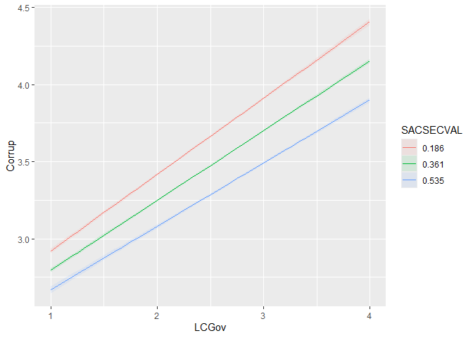
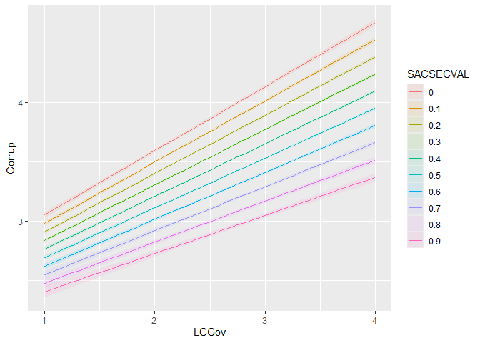

Moderation with bruceR
================
Mauricio Garnier-Villarreal
28 January, 2026

- [What is moderation analysis?](#what-is-moderation-analysis)
- [Setup the R session](#setup-the-r-session)
- [Import the data set](#import-the-data-set)
  - [Prepare the data set](#prepare-the-data-set)
    - [Create composite scores](#create-composite-scores)
    - [Transform categorical variables to
      `factor()`](#transform-categorical-variables-to-factor)
    - [Set variables for analysis](#set-variables-for-analysis)
- [Moderation analysis steps](#moderation-analysis-steps)
- [Categorical moderator](#categorical-moderator)
  - [PROCESS function](#process-function)
    - [Probing](#probing)
    - [Plotting](#plotting)
    - [Effect size](#effect-size)
    - [Interpretation](#interpretation)
- [Continuous moderator](#continuous-moderator)
  - [PROCESS function](#process-function-1)
    - [Probing](#probing-1)
    - [Plotting](#plotting-1)
    - [Effect size](#effect-size-1)
    - [Interpretation](#interpretation-1)
- [References](#references)

# What is moderation analysis?

With moderation analysis, we are trying to find out whether the effect
or association between two variables depends on another variable. Let’s
say that we are interested in the association between *Lack of
confidence in the government* and *Perception of corruption*, but we
specifically want to know whether the association depends on the *Sex*
or the *Secular Values* of individuals. The latter two variables are
called *moderators* of the association between *Lack of confidence in
the government* and *Perception of corruption*.

# Setup the R session

When we start working in R, we always need to setup our session. For
this we need to set our working directory, in this case I am doing that
for the folder that holds the downloaded [World Values Survey
(WVS)](https://www.worldvaluessurvey.org/) `SPSS` data set

``` r
setwd("~path_to_your_file")
```

The next step for setting up our session will be to load the packages
that we will be using

``` r
library(rio)
library(effectsize)
library(marginaleffects)
library(ggplot2)
library(parameters)
library(car)
library(bruceR)
library(tidyr)
```

# Import the data set

Here we will be importing the `.sav` WVS data set

``` r
dat <- import("WVS_Cross-National_Wave_7_sav_v2_0.sav")
dim(dat)
```

    ## [1] 76897   548

Here we are calling our data set **dat** and asking to see the dimension
of it. We see that the data set has 76897 subjects, and 548 columns.

## Prepare the data set

In cases with large data sets like this we might want to select a subset
of variables that we want to work with. Since it is not easy to see 548
variables.

``` r
vars <- c("Q260","Q262", "Y001", "SACSECVAL", "Q112", "Q113", "Q114", "Q115", "Q116", "Q117", "Q118", "Q119", "Q120", "Q65", "Q69", "Q71", "Q72", "Q73")
dat2 <- dat[,vars]
dim(dat2)
```

    ## [1] 76897    18

``` r
head(dat2)
```

    ##   Q260 Q262 Y001 SACSECVAL Q112 Q113 Q114 Q115 Q116 Q117 Q118 Q119 Q120 Q65 Q69
    ## 1    2   60    0  0.287062    2   NA   NA   NA   NA   NA    1    2    6  NA   1
    ## 2    1   47    2  0.467525   10    3    3    3    3    3    1    3    2  NA   3
    ## 3    1   48    4  0.425304    7    2    2    2    2    2    1    2    7  NA   2
    ## 4    2   62    2  0.556170    5    3    3    3    3    2    1    4    7  NA   3
    ## 5    1   49    1  0.458949    5    2    2    2    2    1    1    3    7  NA   2
    ## 6    2   51    3  0.210111    6    2    2    2    2    2    1    4    2  NA   1
    ##   Q71 Q72 Q73
    ## 1   1   1   1
    ## 2   4   4   4
    ## 3   3   3   3
    ## 4   3   3   3
    ## 5   2   3   2
    ## 6   2   2   2

Here we are first creating a vector with the variable names for the ones
I want to keep. You can see all variable names for the full data set as
well:

``` r
colnames(dat)
```

After identifying which variables we will work with, we create a new
data set **dat2** with only these 17 variables, and make sure we did it
correctly by looking at the the dimension of the data **dim(dat2)**. We
also look at the first 6 rows: **head(dat2)**. These are quick checks
that we have created the new data correctly.

The variables we will use here are:

- Q260: sex, 1 = Male, 2 = Female
- Q262: age in years
- Y001: post-materialism index
- SACSECVAL: secular values
- Q112-Q120: Corruption Perception Index
- Q65-Q73: Lack of Confidence in the government

### Create composite scores

We will be using the composite scores for *Corruption Perception Index*
and *Lack of Confidence in the government* instead of their single
items. So, we first need to compute them, we will use the mean across
all items for each composite

``` r
dat2$Corrup <- rowMeans(dat2[,c("Q112", "Q113", "Q114", "Q115", "Q116", "Q117", "Q118", "Q119", "Q120")], na.rm=T)
dat2$LCGov <- rowMeans(dat2[,c("Q65", "Q69", "Q71", "Q72", "Q73")], na.rm=T)
head(dat2)
```

    ##   Q260 Q262 Y001 SACSECVAL Q112 Q113 Q114 Q115 Q116 Q117 Q118 Q119 Q120 Q65 Q69
    ## 1    2   60    0  0.287062    2   NA   NA   NA   NA   NA    1    2    6  NA   1
    ## 2    1   47    2  0.467525   10    3    3    3    3    3    1    3    2  NA   3
    ## 3    1   48    4  0.425304    7    2    2    2    2    2    1    2    7  NA   2
    ## 4    2   62    2  0.556170    5    3    3    3    3    2    1    4    7  NA   3
    ## 5    1   49    1  0.458949    5    2    2    2    2    1    1    3    7  NA   2
    ## 6    2   51    3  0.210111    6    2    2    2    2    2    1    4    2  NA   1
    ##   Q71 Q72 Q73   Corrup LCGov
    ## 1   1   1   1 2.750000  1.00
    ## 2   4   4   4 3.444444  3.75
    ## 3   3   3   3 3.000000  2.75
    ## 4   3   3   3 3.444444  3.00
    ## 5   2   3   2 2.777778  2.25
    ## 6   2   2   2 2.555556  1.75

With the `rowmeans()` we compute the mean across the specified
variables, for each subject. Remember to include the `na.rm=T` argument,
so the missing values are properly ignored.

### Transform categorical variables to `factor()`

when we want to use categorical variables as predictors, it is
recommended to transformed them as `factor` type in `R`. In this case we
will use the *Sex* variable `Q260`, which is coded as 1 and 2 right now.

With the `factor()` function we an transform it, and change the numbers
to meaningful labels.

``` r
dat2$Sex <- factor(dat2$Q260, 
                       levels = 1:2,
                       labels = c("Male","Female") )
```

### Set variables for analysis

Now, we will select only the variables of interest in a separate data
set.

``` r
dat2 <- drop_na(dat2[,c("Sex", "Q262", "Y001", 
                        "SACSECVAL", "Corrup", "LCGov")])
head(dat2)
```

    ##      Sex Q262 Y001 SACSECVAL   Corrup LCGov
    ## 1 Female   60    0  0.287062 2.750000  1.00
    ## 2   Male   47    2  0.467525 3.444444  3.75
    ## 3   Male   48    4  0.425304 3.000000  2.75
    ## 4 Female   62    2  0.556170 3.444444  3.00
    ## 5   Male   49    1  0.458949 2.777778  2.25
    ## 6 Female   51    3  0.210111 2.555556  1.75

``` r
dim(dat2)
```

    ## [1] 71633     6

The new `dat2` data set only include the 6 continuous variables of
interest, and 1 binary variable. With the `drop_na()` function we are
excluding all cases with some missing values.

# Moderation analysis steps

Moderation is split into multiple steps, (a)

- Estimate the *main effects* model that includes only the predictors as
  a *normal* multiple regression.
- Estimate the *interaction* model that now also includes the
  interactions between predictors.
- Compare the models: the *p-value* test the Null hypothesis of the two
  predictors being independent, and the change in $R^2$ represents the
  effect size magnitude of the interaction
- Probe: estimate the simple slopes, the slope for the focal predictor
  at fixed values of the moderator predictor.
- Plot the simple slopes

The first three steps test the Null Hypothesis of the interaction (with
the respective effect size), while the last two steps seek to explain
*how does the moderator affects the focal relation?*, and help interpret
these conditional relations.

We will see how to implement these steps for two common interaction
scenarios, with categorical and continuous moderators

# Categorical moderator

For the categorical predictor model, we will have *Lack of confidence in
the government* as the focal predictor, and *Sex* as the categorical
moderator. Having them predict the *Perception of corruption*

## PROCESS function

Here we will show the use of the function `PROCESS()` from the `bruceR`
package. This function follows the
[process](https://www.processmacro.org/) approach by Andrew Hayes.

For basic moderation we need to specify the arguments `data`, which is
the outcome variable `y`, which is the focal predictor `x`, and which is
the moderator predictor `mods`, and if we wish to center the variables
`center`.

``` r
mp1 <- PROCESS(data = dat2, 
               y = "Corrup", 
               x = "LCGov", 
               mods ="Sex", 
               center = FALSE)
```

    ## 
    ## ****************** PART 1. Regression Model Summary ******************
    ## 
    ## PROCESS Model ID : 1
    ## Model Type : Simple Moderation
    ## -    Outcome (Y) : Corrup
    ## -  Predictor (X) : LCGov
    ## -  Mediators (M) : -
    ## - Moderators (W) : Sex
    ## - Covariates (C) : -
    ## -   HLM Clusters : -
    ## 
    ## Formula of Outcome:
    ## -    Corrup ~ LCGov*Sex
    ## 
    ## CAUTION:
    ##   Fixed effect (coef.) of a predictor involved in an interaction
    ##   denotes its "simple effect/slope" at the other predictor = 0.
    ##   Only when all predictors in an interaction are mean-centered
    ##   can the fixed effect be interpreted as "main effect"!
    ##   
    ## Model Summary
    ## 
    ## ─────────────────────────────────────────────
    ##                  (1) Corrup     (2) Corrup   
    ## ─────────────────────────────────────────────
    ## (Intercept)          2.546 ***      2.548 ***
    ##                     (0.011)        (0.015)   
    ## LCGov                0.369 ***      0.373 ***
    ##                     (0.004)        (0.006)   
    ## SexFemale                          -0.003    
    ##                                    (0.021)   
    ## LCGov:SexFemale                    -0.008    
    ##                                    (0.008)   
    ## ─────────────────────────────────────────────
    ## R^2                  0.108          0.108    
    ## Adj. R^2             0.108          0.108    
    ## Num. obs.        71633          71633        
    ## ─────────────────────────────────────────────
    ## Note. * p < .05, ** p < .01, *** p < .001.
    ## 
    ## ************ PART 2. Mediation/Moderation Effect Estimate ************
    ## 
    ## Package Use : ‘interactions’ (v1.2.0)
    ## Effect Type : Simple Moderation (Model 1)
    ## Sample Size : 71633
    ## Random Seed : -
    ## Simulations : -
    ## 
    ## Interaction Effect on "Corrup" (Y)
    ## ─────────────────────────────────────
    ##                 F df1   df2     p    
    ## ─────────────────────────────────────
    ## LCGov * Sex  1.02   1 71629  .313    
    ## ─────────────────────────────────────
    ## 
    ## Simple Slopes: "LCGov" (X) ==> "Corrup" (Y)
    ## ──────────────────────────────────────────────────────
    ##  "Sex"  Effect    S.E.      t     p           [95% CI]
    ## ──────────────────────────────────────────────────────
    ##  Female  0.365 (0.006) 65.784 <.001 *** [0.354, 0.376]
    ##  Male    0.373 (0.006) 65.847 <.001 *** [0.362, 0.384]
    ## ──────────────────────────────────────────────────────

The first section of the output presents the two models estimated, first
the model with only the focal predictor (notice this is not the full
main effects model), and then the model with the interaction.

In the second part, the specific elements of the interaction are shown.
First we see the *F* test comparing the main effects model and the
interaction model. This is the Null Hypothesis Significance test (NHST)
of the moderation. Here we fail to reject the null hypothesis of no
interaction $F(1, 71629) = 1.02, p = .313$

### Probing

Probing the interaction means to estimate the dependent focal
regressions at specific levels of the moderator. To see and test the
respective regressions. Before here we can talk about the 2 predictors
being independent without stating which is the moderator and which is
the focal predictor. When we probing and plotting the interactions, we
need to choose a moderator and focal predictor. Notice that the model
does not know which predictor is which, you have to decide this.

When including a categorical variable, most likely this one will be the
moderator, so in our case *Sex* will be treated as the moderator.

This is shown at the end of the output, the slopes for all groups in the
categorical moderator, in this case `Sex`. We can also extract these
simple slopes

``` r
print(mp1$results[[1]]$simple.slopes, digits=3)
```

    ##   "Sex"  Effect    S.E.  LLCI  ULCI    t pval       [95% CI]
    ## 2 Female  0.365 0.00555 0.354 0.376 65.8    0 [0.354, 0.376]
    ## 1 Male    0.373 0.00567 0.362 0.384 65.8    0 [0.362, 0.384]

Here we see that for the *Male* participants, the slope between *lack of
confidence in the government* and *Perception of corruption* is 0.373
($b_{1M} = 0.373, SE = 0.006, p < .001$), and for the *Female*
participants it is 0.365 ($b_{1F} = 0.365, SE = 0.006, p < .001$)

If we look back at the interaction regression output, you will see that
the slope for the interaction term `LCGov:SexFemale` is -0.008, which is
the slope difference between mean and women (0.3733 - 0.3653), this is
an ease of interpretation when the moderator is categorical.

### Plotting

A last part is to plot the interactions, here we will show how to plot
the interactions with the `marginaleffects` package

In the `marginaleffects` package, we have to first specify on `lm()`
model that includes the interaction, we are plotting the *conditional*
relation, and the same scale as the outcome variable in the *y-axis*.
Then we need to specify our focal and moderator predictor in the `by`
argument, the function will see the first variable as the focal one and
the second one as the moderator. We will need to provide the interaction
model from the output of the `POCESS`function as `mp1$model.y`

``` r
plot_predictions(mp1$model.y,
                 by = c("LCGov", "Sex") )
```

<!-- -->

Notice that when the moderator is a `factor()` type variable,
`plot_predictions` will automatically plot the focal regression for all
categories, and set the respective labels.

### Effect size

The next way to compare the models relates to the effect size of the
interaction, we can look at this as the change in $R^2$ when the
interaction is added, or the proportion of variance explained uniquely
by the interaction

Which can be estimated the $\eta^2$ of the interaction term, as this is
the proportion of explained variance uniquely by the interaction. We can
get this with `eta_squared()` function, make sure to set the argument
`partial = F` as this will ask for the full $\eta^2$ instead of the
partial. And we use the `Anova()` function to use the type 2 sum of of
squares

``` r
print(eta_squared(Anova(mp1$model.y, type=2), partial = F), digits=6)
```

    ## # Effect Size for ANOVA (Type II)
    ## 
    ## Parameter |     Eta2 |               95% CI
    ## -------------------------------------------
    ## LCGov     | 0.107864 | [0.104378, 1.000000]
    ## Sex       | 0.000200 | [0.000064, 1.000000]
    ## LCGov:Sex | 0.000013 | [0.000000, 1.000000]
    ## 
    ## - One-sided CIs: upper bound fixed at [1.000000].

### Interpretation

- We fail fail to reject the null hypothesis of the interaction and main
  effects model being equally good at predicting the outcome. Or, fail
  to reject the null hypothesis of the 2 predictors being independent
  ($F(1, 71629)=1.019, p = .313$).
- Female participants have in average a focal slope (`Corrup ~ LCGov`)
  0.008 points lower than the male participants
  ($b_{*} = -0.008, SE = 0.008, p = 0.313$).
- For *Male* participants, the slope between *lack of confidence in the
  government* and *Perception of corruption* is 0.373
  ($b_{1M} = 0.373, SE = 0.006, p < .001$).
- For *Female* participants, the slope between *lack of confidence in
  the government* and *Perception of corruption* is 0.365
  ($b_{1F} = 0.365, SE = 0.006, p < .001$).
- The addition of the interaction increases the model’s predictive
  accuracy by 0.0013% ($\eta^2 = 0.000013$).
- In the plots, we see that both groups slopes are close to each other.

# Continuous moderator

For the continuous predictor model, we will have *Lack of confidence in
the government* as the focal predictor, and *Secular Values* as the
continuous moderator. Having them predict the *Perception of corruption*

## PROCESS function

When the moderator is continuous the `PROCESS()` function works the same
way, you just provide the continuous predictor in the `mods`argument.
For basic moderation we need to specify the arguments `data`, which is
the outcome variable `y`, which is the focal predictor `x`, and which is
the moderator predictor `mods`, and if we wish to center the variables
`center`.

``` r
mp2 <- PROCESS(data = dat2, 
               y = "Corrup", 
               x = "LCGov", 
               mods ="SACSECVAL", 
               center = FALSE)
```

    ## 
    ## ****************** PART 1. Regression Model Summary ******************
    ## 
    ## PROCESS Model ID : 1
    ## Model Type : Simple Moderation
    ## -    Outcome (Y) : Corrup
    ## -  Predictor (X) : LCGov
    ## -  Mediators (M) : -
    ## - Moderators (W) : SACSECVAL
    ## - Covariates (C) : -
    ## -   HLM Clusters : -
    ## 
    ## Formula of Outcome:
    ## -    Corrup ~ LCGov*SACSECVAL
    ## 
    ## CAUTION:
    ##   Fixed effect (coef.) of a predictor involved in an interaction
    ##   denotes its "simple effect/slope" at the other predictor = 0.
    ##   Only when all predictors in an interaction are mean-centered
    ##   can the fixed effect be interpreted as "main effect"!
    ##   
    ## Model Summary
    ## 
    ## ─────────────────────────────────────────────
    ##                  (1) Corrup     (2) Corrup   
    ## ─────────────────────────────────────────────
    ## (Intercept)          2.546 ***      2.516 ***
    ##                     (0.011)        (0.021)   
    ## LCGov                0.369 ***      0.540 ***
    ##                     (0.004)        (0.008)   
    ## SACSECVAL                          -0.478 ***
    ##                                    (0.058)   
    ## LCGov:SACSECVAL                    -0.243 ***
    ##                                    (0.021)   
    ## ─────────────────────────────────────────────
    ## R^2                  0.108          0.159    
    ## Adj. R^2             0.108          0.159    
    ## Num. obs.        71633          71633        
    ## ─────────────────────────────────────────────
    ## Note. * p < .05, ** p < .01, *** p < .001.
    ## 
    ## ************ PART 2. Mediation/Moderation Effect Estimate ************
    ## 
    ## Package Use : ‘interactions’ (v1.2.0)
    ## Effect Type : Simple Moderation (Model 1)
    ## Sample Size : 71633
    ## Random Seed : -
    ## Simulations : -
    ## 
    ## Interaction Effect on "Corrup" (Y)
    ## ─────────────────────────────────────────────
    ##                         F df1   df2     p    
    ## ─────────────────────────────────────────────
    ## LCGov * SACSECVAL  129.58   1 71629 <.001 ***
    ## ─────────────────────────────────────────────
    ## 
    ## Simple Slopes: "LCGov" (X) ==> "Corrup" (Y)
    ## ─────────────────────────────────────────────────────────────
    ##  "SACSECVAL"  Effect    S.E.       t     p           [95% CI]
    ## ─────────────────────────────────────────────────────────────
    ##  0.186 (- SD)  0.495 (0.005)  93.059 <.001 *** [0.485, 0.505]
    ##  0.361 (Mean)  0.453 (0.004) 110.677 <.001 *** [0.445, 0.461]
    ##  0.535 (+ SD)  0.410 (0.006)  71.507 <.001 *** [0.399, 0.421]
    ## ─────────────────────────────────────────────────────────────

The first section of the output presents the two models estimated, first
the model with only the focal predictor (notice this is not the full
main effects model), and then the model with the interaction.

In the second part, the specific elements of the interaction are shown.
First we see the *F* test comparing the main effects model and the
interaction model. This is the Null Hypothesis Significance test (NHST)
of the moderation. Here we reject the null hypothesis of no interaction
$F(1, 71629) = 129.58, p < .001$

### Probing

Probing the interaction means to estimate the dependent focal
regressions at specific levels of the moderator. To see and test the
respective regressions. Before here we can talk about the 2 predictors
being independent without stating which is the moderator and which is
the focal predictor. When we probing and plotting the interactions, we
need to choose a moderator and focal predictor. Notice that the model
does not know which predictor is which, you have to decide this.

Here we are choosing to treat *Secular Values* as the moderator variable

The last section of the output presents the simple slopes. If the
moderator is continuous and no test values are given, by default the
function will estimate the simple slopes for the mean - 1SD, mean and
mean + 1SD (low, medium, high).

Here we see that for the low *Secular Values*, the slope between *lack
of confidence in the government* and *Perception of corruption* is 0.495
($b_{LSV} = 0.495, SE = 0.005, p < .001$), for average *Secular Values*
it is 0.453 ($b_{MSV} = 0.453, SE = 0.004, p < .001$), and for high
*Secular Values* it is 0.410 ($b_{HSV} = 0.410, SE = 0.006, p < .001$).

This way we see a a general trend, as *Secular Values* increases, the
focal regression decreases strength.

If we look back at the regression table for the interaction model, you
will see that the slope for the interaction term `LCGov:SACSECVAL` is
-0.243, which is the change in the slope when the moderator increases by
1 unit. This is a harder parameter to interpret, unless you have very
clear metric of the moderator, otherwise it is easier to interpret that
change with simple slopes

Another option with a continuous moderator is to estimate simple slopes
for a long array of moderator values. A recommendation would be to test
across a large number of possible values, get the minimum and maximum of
values for the moderator

``` r
c(min(dat2$SACSECVAL, na.rm=T), max(dat2$SACSECVAL, na.rm=T))
```

    ## <labelled<double>[2]>: SACSECVAL.- Welzel Overall Secular Values
    ## [1] 0.000000 0.971667
    ## 
    ## Labels:
    ##  value   label
    ##    -99 Missing

Then create a sequence of values going from the minimum, to the maximum,
increasing by a small value (choose something that make sense for the
metric of the moderator). In this case an increase every 0.1 points
makes sense.

``` r
vals2 <- seq(from=min(dat2$SACSECVAL, na.rm=T), to=max(dat2$SACSECVAL, na.rm=T), by=.1)
vals2
```

    ##  [1] 0.0 0.1 0.2 0.3 0.4 0.5 0.6 0.7 0.8 0.9

Now we can add the new set of testing values to the `mod1.val` argument.
This way we can see the change in the slope of interest at smaller steps
of change of the moderator. Everything esle stays the same.

``` r
mp3 <- PROCESS(data = dat2, 
               y = "Corrup", 
               x = "LCGov", 
               mods ="SACSECVAL", 
               center = FALSE, 
               mod1.val = vals2)
```

    ## 
    ## ****************** PART 1. Regression Model Summary ******************
    ## 
    ## PROCESS Model ID : 1
    ## Model Type : Simple Moderation
    ## -    Outcome (Y) : Corrup
    ## -  Predictor (X) : LCGov
    ## -  Mediators (M) : -
    ## - Moderators (W) : SACSECVAL
    ## - Covariates (C) : -
    ## -   HLM Clusters : -
    ## 
    ## Formula of Outcome:
    ## -    Corrup ~ LCGov*SACSECVAL
    ## 
    ## CAUTION:
    ##   Fixed effect (coef.) of a predictor involved in an interaction
    ##   denotes its "simple effect/slope" at the other predictor = 0.
    ##   Only when all predictors in an interaction are mean-centered
    ##   can the fixed effect be interpreted as "main effect"!
    ##   
    ## Model Summary
    ## 
    ## ─────────────────────────────────────────────
    ##                  (1) Corrup     (2) Corrup   
    ## ─────────────────────────────────────────────
    ## (Intercept)          2.546 ***      2.516 ***
    ##                     (0.011)        (0.021)   
    ## LCGov                0.369 ***      0.540 ***
    ##                     (0.004)        (0.008)   
    ## SACSECVAL                          -0.478 ***
    ##                                    (0.058)   
    ## LCGov:SACSECVAL                    -0.243 ***
    ##                                    (0.021)   
    ## ─────────────────────────────────────────────
    ## R^2                  0.108          0.159    
    ## Adj. R^2             0.108          0.159    
    ## Num. obs.        71633          71633        
    ## ─────────────────────────────────────────────
    ## Note. * p < .05, ** p < .01, *** p < .001.
    ## 
    ## ************ PART 2. Mediation/Moderation Effect Estimate ************
    ## 
    ## Package Use : ‘interactions’ (v1.2.0)
    ## Effect Type : Simple Moderation (Model 1)
    ## Sample Size : 71633
    ## Random Seed : -
    ## Simulations : -
    ## 
    ## Interaction Effect on "Corrup" (Y)
    ## ─────────────────────────────────────────────
    ##                         F df1   df2     p    
    ## ─────────────────────────────────────────────
    ## LCGov * SACSECVAL  129.58   1 71629 <.001 ***
    ## ─────────────────────────────────────────────
    ## 
    ## Simple Slopes: "LCGov" (X) ==> "Corrup" (Y)
    ## ────────────────────────────────────────────────────────────
    ##  "SACSECVAL" Effect    S.E.       t     p           [95% CI]
    ## ────────────────────────────────────────────────────────────
    ##  0.000        0.540 (0.008)  64.071 <.001 *** [0.524, 0.557]
    ##  0.100        0.516 (0.007)  77.636 <.001 *** [0.503, 0.529]
    ##  0.200        0.492 (0.005)  95.811 <.001 *** [0.482, 0.502]
    ##  0.300        0.467 (0.004) 111.416 <.001 *** [0.459, 0.476]
    ##  0.400        0.443 (0.004) 104.566 <.001 *** [0.435, 0.451]
    ##  0.500        0.419 (0.005)  79.997 <.001 *** [0.409, 0.429]
    ##  0.600        0.395 (0.007)  58.199 <.001 *** [0.381, 0.408]
    ##  0.700        0.370 (0.009)  43.160 <.001 *** [0.353, 0.387]
    ##  0.800        0.346 (0.011)  32.939 <.001 *** [0.325, 0.367]
    ##  0.900        0.322 (0.012)  25.745 <.001 *** [0.297, 0.346]
    ## ────────────────────────────────────────────────────────────

Here we see that the slope of interest changes from 0.54 to 0.32 from
the lowest and highest values. And for every one of them we reject the
null hypothesis of each simple slope being equal to 0.

### Plotting

A last part is to plot the interactions, here we will show how to plot
the interactions with the `marginaleffects` package

In the `marginaleffects` package, we have to first specify on `lm()`
model that includes the interaction, we are plotting the *conditional*
relation, and the same scale as the outcome variable in the *y-axis*.
Then we need to specify our focal and moderator predictor in the `by`
argument, the function will see the first variable as the focal one and
the second one as the moderator. We will need to provide the interaction
model from the output of the `POCESS`function as `mp3$model.y`

The only new argument we need to add is `newdata`, where we define which
values of the moderator do we wish to plot, and all observed values for
the focal predictor. We already have same these from probing simple
slopes

``` r
plot_predictions(mp3$model.y,
                 newdata = datagrid(LCGov=unique(dat2$LCGov),
                                    SACSECVAL = c(.186, .361, .535) ),
                 by = c("LCGov", "SACSECVAL") )
```

<!-- -->

We can also plot the simple slopes for a larger number of of test
values, like the larger sequence set we created. For that we simply use
the larger values we created before. This plot allow us to see the
changes in greater detail.

``` r
plot_predictions(mp3$model.y, 
                 newdata = datagrid(LCGov=unique(dat2$LCGov),
                                    SACSECVAL = vals2),
                 by = c("LCGov", "SACSECVAL"))
```

<!-- -->

### Effect size

The next way to compare the models relates to the effect size of the
interaction, we can look at this as the change in $R^2$ when the
interaction is added, or the proportion of variance explained uniquely
by the interaction

Which can be estimated the $\eta^2$ of the interaction term, as this is
the proportion of explained variance uniquely by the interaction. We can
get this with `eta_squared()` function, make sure to set the argument
`partial = F` as this will ask for the full $\eta^2$ instead of the
partial. And we use the `Anova()` function to use the type 2 sum of of
squares

``` r
print(eta_squared(Anova(mp3$model.y, type=2), partial = F), digits=4)
```

    ## # Effect Size for ANOVA (Type II)
    ## 
    ## Parameter       |   Eta2 |           95% CI
    ## -------------------------------------------
    ## LCGov           | 0.1414 | [0.1376, 1.0000]
    ## SACSECVAL       | 0.0476 | [0.0451, 1.0000]
    ## LCGov:SACSECVAL | 0.0015 | [0.0010, 1.0000]
    ## 
    ## - One-sided CIs: upper bound fixed at [1.0000].

### Interpretation

- We reject the null hypothesis of the interaction and main effects
  model being equally good at predicting the outcome. Or, reject the
  null hypothesis of the 2 predictors being independent
  ($F(1, 71629)= 74.107, p < .001$).
- As the moderator *Secular Values* increase by 1 unit, the focal
  regression (`Corrup ~ LCGov`) decreases by 0.243 points
  ($b_{*} = -0.243, SE = 0.021, p < .001$)
- For low *Secular Values*, the slope between *lack of confidence in the
  government* and *Perception of corruption* is 0.495
  ($b_{LSV} = 0.495, SE = 0.005, p < .001$)
- For average *Secular Values* it is 0.453
  ($b_{MSV} = 0.453, SE = 0.004, p < .001$)
- For high *Secular Values* it is 0.410
  ($b_{HSV} = 0.410, SE = 0.006, p < .001$).
- In the general trend we see that the focal slope goes from 0.54 at the
  minimum observed *Secular Values* to 0.32 at the maximum observed
  *Secular values* score.
- The addition of the interaction increases the model’s predictive
  accuracy by 0.15% ($\eta^2 = 0.0015$).
- In the plots, we see the decrease of the slopes across a range of
  possible moderator values.

# References

Hayes, A.F. (2022). Introduction to mediation, moderation, and
conditional process analysis: A regression-based approach (Third
edition, Vol. 1–1 online resource (xx, 732 pages) : illustrations.). The
Guilford Press.
