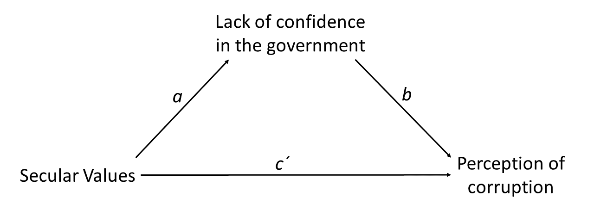
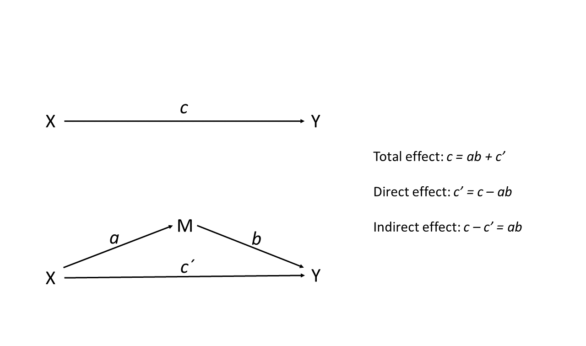

# Mediation with path
Mauricio Garnier-Villarreal, Joris M. Schröder & Joseph Charles Van
Matre
2023-09-26

- [What is mediation analysis?](#what-is-mediation-analysis)
- [Setup the R session](#setup-the-r-session)
- [Import the data set](#import-the-data-set)
  - [Prepare the data set](#prepare-the-data-set)
    - [Create composite scores](#create-composite-scores)
    - [Select variables for analysis](#select-variables-for-analysis)
- [Mediation analysis steps](#mediation-analysis-steps)
- [Mediation analysis](#mediation-analysis)
  - [Path analysis](#path-analysis)
    - [Total effect](#total-effect)
    - [Indirect effect](#indirect-effect)
      - [Sobel NHST](#sobel-nhst)
      - [Bootstrap NHST](#bootstrap-nhst)
      - [Monte-Carlo NHST](#monte-carlo-nhst)
    - [Final recommendations](#final-recommendations)
  - [Interpretation](#interpretation)
- [References](#references)

# What is mediation analysis?

With mediation analysis, we are trying to find out whether the effect or
association between an independent and a dependent variable is due to an
indirect effect through another variable (called the mediator variable).
Let’s say that we are interested in the association between *Secular
Values* and *Perception of corruption*, but we specifically want to know
whether the association works through the mediator variable *Lack of
confidence in the government* of individuals (see the figure below). In
this example, *Lack of confidence in the government* is therefore our
(potential) *mediator* of the association between *Secular Values* and
*Perception of corruption*.



# Setup the R session

When we start working in R, we always need to setup our session. For
this we need to set our working directory, in this case I am doing that
for the folder that holds the downloaded [World Values Survey
(WVS)](https://www.worldvaluessurvey.org/) `SPSS` data set

``` r
setwd("~path_to_your_file")
```

The next step for setting up our session will be to load the packages
that we will be using `rio` to import the data, `lavaan` to estimate the
model with path analysis, and `semTools` for useful functions for
inference of the mediation effect.

``` r
library(rio)
library(lavaan)
library(semTools)
```

# Import the data set

Here we will be importing the `.sav` WVS data set

``` r
dat <- import("WVS_Cross-National_Wave_7_sav_v2_0.sav")
dim(dat)
```

    [1] 76897   548

Here we are calling our data set **dat** and asking to see the dimension
of it. We see that the data set has 76897 subjects, and 548 columns.

## Prepare the data set

In cases with large data sets like this we might want to select a subset
of variables that we want to work with. Since it is not easy to see 548
variables.

``` r
vars <- c("Q262", "Y001", "SACSECVAL", "Q112", "Q113", "Q114", "Q115", "Q116", "Q117", "Q118", "Q119", "Q120", "Q65", "Q69", "Q71", "Q72", "Q73")
dat2 <- dat[,vars]
dim(dat2)
```

    [1] 76897    17

``` r
head(dat2)
```

      Q262 Y001 SACSECVAL Q112 Q113 Q114 Q115 Q116 Q117 Q118 Q119 Q120 Q65 Q69 Q71
    1   60    0  0.287062    2   NA   NA   NA   NA   NA    1    2    6  NA   1   1
    2   47    2  0.467525   10    3    3    3    3    3    1    3    2  NA   3   4
    3   48    4  0.425304    7    2    2    2    2    2    1    2    7  NA   2   3
    4   62    2  0.556170    5    3    3    3    3    2    1    4    7  NA   3   3
    5   49    1  0.458949    5    2    2    2    2    1    1    3    7  NA   2   2
    6   51    3  0.210111    6    2    2    2    2    2    1    4    2  NA   1   2
      Q72 Q73
    1   1   1
    2   4   4
    3   3   3
    4   3   3
    5   3   2
    6   2   2

Here we are first creating a vector with the variable names for the ones
I want to keep. You can see all variable names for the full data set as
well:

``` r
colnames(dat)
```

After identifying which variables we will work with, we create a new
data set **dat2** with only these 17 variables, and make sure we did it
correctly by looking at the the dimension of the data **dim(dat2)**. We
also look at the first 6 rows: **head(dat2)**. These are quick checks
that we have created the new data correctly.

The variables we will use here are:

- Q262: age in years
- Y001: post-materialism index
- SACSECVAL: secular values
- Q112-Q120: Corruption Perception Index
- Q65-Q73: Lack of Confidence in the government

### Create composite scores

We will be using the composite scores for *Corruption Perception Index*
and *Lack of Confidence in the government* instead of their single
items. So, we first need to compute them, we will use the mean across
all items for each composite

``` r
dat2$Corrup <- rowMeans(dat2[,c("Q112", "Q113", "Q114", "Q115", "Q116", "Q117", "Q118", "Q119", "Q120")], na.rm=T)
dat2$LCGov <- rowMeans(dat2[,c("Q65", "Q69", "Q71", "Q72", "Q73")], na.rm=T)
head(dat2)
```

      Q262 Y001 SACSECVAL Q112 Q113 Q114 Q115 Q116 Q117 Q118 Q119 Q120 Q65 Q69 Q71
    1   60    0  0.287062    2   NA   NA   NA   NA   NA    1    2    6  NA   1   1
    2   47    2  0.467525   10    3    3    3    3    3    1    3    2  NA   3   4
    3   48    4  0.425304    7    2    2    2    2    2    1    2    7  NA   2   3
    4   62    2  0.556170    5    3    3    3    3    2    1    4    7  NA   3   3
    5   49    1  0.458949    5    2    2    2    2    1    1    3    7  NA   2   2
    6   51    3  0.210111    6    2    2    2    2    2    1    4    2  NA   1   2
      Q72 Q73   Corrup LCGov
    1   1   1 2.750000  1.00
    2   4   4 3.444444  3.75
    3   3   3 3.000000  2.75
    4   3   3 3.444444  3.00
    5   3   2 2.777778  2.25
    6   2   2 2.555556  1.75

With the `rowmeans()` we compute the mean across the specified
variables, for each subject. Remember to include the `na.rm=T` argument,
so the missing values are properly ignored.

### Select variables for analysis

Now, we will select only the variables of interest in a separate data
set.

``` r
dat2 <- na.omit(dat2[,c("Q262", "Y001", "SACSECVAL", "Corrup", "LCGov")])
head(dat2)
```

      Q262 Y001 SACSECVAL   Corrup LCGov
    1   60    0  0.287062 2.750000  1.00
    2   47    2  0.467525 3.444444  3.75
    3   48    4  0.425304 3.000000  2.75
    4   62    2  0.556170 3.444444  3.00
    5   49    1  0.458949 2.777778  2.25
    6   51    3  0.210111 2.555556  1.75

``` r
dim(dat2)
```

    [1] 71648     5

The new `dat2` data set only include the 6 continuous variables of
interest, and 1 binary variable. With the `na.omit()` function we are
excluding all cases with some missing values.

# Mediation analysis steps

Mediation analysis can be split into a few steps

- Estimate the *total effect* model, that includes the outcome and main
  predictor variables
- Estimate the *mediation* model, including the 2 regressions that are
  involved (will explain this next)
- Use either *bootstraps* or *Monte-Carlo* to make an inference about
  the mediation/indirect effect

# Mediation analysis

In mediation analysis involves several regressions, in the sense that we
have multiple outcomes, so it is not multiple regressions. Here we have
all predictor(s) and mediator(s) predicting the outcome variable, and
all (main) predictor(s) predicting the mediator(s).

In the simple mediation model with one independent variable (X), one
dependent variable (Y), and one mediator variable (M), we have the
following paths (see the figure below):

- the *direct effect* of X on Y, denoted c’
- the *direct effect* of X on M, denoted a
- the *direct effect* of M on Y, denoted b

In addition, we have the *total effect*, denoted c, which is the overall
effect of X on Y. The total effect includes the direct effect and the
indirect effect through all (potential) mediators. With mediation
analysis, we are trying to partition the total effect into direct and
indirect effects.



Now lets explain it with the simple mediation example here, in this case
we are mainly interested in the effect of *Secular values* on
*Perception of corruption*. So, the *total* effect of it can be express
by the simple regression

Here we can see that it is a simple concept, the *full/maximum* effect
that *Secular Values* has on *Perception of corruption* is $c$ (in your
data set).

Now, with mediation we will partition this effect $c$ into a *direct*
effect, and an *indirect* effect. We can do this with 2 regressions, the
first one by adding also *Lack of confidence in the government* as a
second predictor/mediator

And a second regression where the main predictor also predicts the
mediator. This way we see that the mediator is both a predictor and an
outcome at the same time

Now, from these 2 new regressions where do the *direct* and *indirect*
effects come from? The *direct* effect is simple, it is the $c`$ slope,
or the effect of the main predictor on the outcome when the mediator is
included.

While for the *indirect* we need to use both equations, as it is defined
as the product of $a$ and $b$ parameters from the previous regressions
$a*b$.

## Path analysis

### Total effect

With path analysis we can estimate the 2 equations simultaneously. But
first lets estimate the *total* effect regression

``` r
tot_mod <- '
Corrup ~ c*SACSECVAL
'
tot_fit <- sem(tot_mod, data = dat2, meanstructure=T)
```

Here we have to estimate the model in 2 steps, first write the model
syntax in a `string` object in `R`, which we can do by writing in
between quotes `''`. The model is written just like a regression in `R`
with the oycome to the left, using the `~` to define the regression,
follow by the predictor. A final thing to noticed, we have added a
*label* to the regression slope, by including `c*` before the predictor,
this will be useful in the next steps. You can make the label whatever
you want it be, but it has to start with a letter.

Then we can use the function `sem` from `lavaan` to estimate the model.
This function needs the argument of the model syntax, data object, and
specify the `meanstructure=T`.

Then we can see the results from the summary, notice that we will also
ask for the standardized parameters as well. These can be interpret as
effect sizes (standardized slopes). And finally, we have also ask for th
$R^2$ to see the proportion of explained variance.

``` r
summary(tot_fit, standardized=T)
```

    lavaan 0.6.16 ended normally after 1 iteration

      Estimator                                         ML
      Optimization method                           NLMINB
      Number of model parameters                         3

      Number of observations                         71648

    Model Test User Model:
                                                          
      Test statistic                                 0.000
      Degrees of freedom                                 0

    Parameter Estimates:

      Standard errors                             Standard
      Information                                 Expected
      Information saturated (h1) model          Structured

    Regressions:
                       Estimate  Std.Err  z-value  P(>|z|)   Std.lv  Std.all
      Corrup ~                                                              
        SACSECVAL  (c)   -0.483    0.018  -27.554    0.000   -0.483   -0.102

    Intercepts:
                       Estimate  Std.Err  z-value  P(>|z|)   Std.lv  Std.all
       .Corrup            3.659    0.007  520.794    0.000    3.659    4.438

    Variances:
                       Estimate  Std.Err  z-value  P(>|z|)   Std.lv  Std.all
       .Corrup            0.673    0.004  189.272    0.000    0.673    0.990

``` r
lavInspect(tot_fit, "rsquare")
```

    Corrup 
      0.01 

Here we see that the *total* effect is
$c = -0.483, SE = 0.018, p < .001$, we see that this is a small effect
as the standardized slope is $\beta = -0.102$ (`Std.all` column), and
only 1% of the variance is explained by *Secular Values* ($R^2 = .01$).

### Indirect effect

Now we can estimate the mediation/indirect effect model, here we need to
include the 2 previous regressions

``` r
ind_mod <- '
Corrup ~ cp*SACSECVAL + b*LCGov
LCGov ~ a*SACSECVAL
'
```

Here we change our model syntax, now we have one line (regression) per
outcome in the model. One for the main outcome (*Perception of
corruption*), and a second one for the mediator (*Lack of confidence in
the government*). You might have noticed that from this we already have
the *direct* effects $cp$, $a$, and $b$. But we don’t have the
*indirect* effect yet. We calculate the product of the slopes $ab$ with
the `:=` operator in `lavaan`, and for his we use the labels

``` r
ind_mod <- '
Corrup ~ cp*SACSECVAL + b*LCGov
LCGov ~ a*SACSECVAL

ab := a*b
tot := (a*b)+cp
'
ind_fit <- sem(ind_mod, data = dat2, meanstructure=T)
```

So, in this new model syntax we create the indirect effect parameter
$ab$, and the total effect $tot$. The total effect will be equivalent to
the total effect model.

#### Sobel NHST

``` r
summary(ind_fit, standardized=T, rsquare=T)
```

    lavaan 0.6.16 ended normally after 1 iteration

      Estimator                                         ML
      Optimization method                           NLMINB
      Number of model parameters                         7

      Number of observations                         71648

    Model Test User Model:
                                                          
      Test statistic                                 0.000
      Degrees of freedom                                 0

    Parameter Estimates:

      Standard errors                             Standard
      Information                                 Expected
      Information saturated (h1) model          Structured

    Regressions:
                       Estimate  Std.Err  z-value  P(>|z|)   Std.lv  Std.all
      Corrup ~                                                              
        SACSECVAL (cp)   -1.111    0.017  -64.885    0.000   -1.111   -0.236
        LCGov      (b)    0.456    0.004  111.784    0.000    0.456    0.406
      LCGov ~                                                               
        SACSECVAL  (a)    1.377    0.015   92.974    0.000    1.377    0.328

    Intercepts:
                       Estimate  Std.Err  z-value  P(>|z|)   Std.lv  Std.all
       .Corrup            2.725    0.011  257.689    0.000    2.725    3.305
       .LCGov             2.047    0.006  344.940    0.000    2.047    2.791

    Variances:
                       Estimate  Std.Err  z-value  P(>|z|)   Std.lv  Std.all
       .Corrup            0.573    0.003  189.272    0.000    0.573    0.843
       .LCGov             0.480    0.003  189.272    0.000    0.480    0.892

    R-Square:
                       Estimate
        Corrup            0.157
        LCGov             0.108

    Defined Parameters:
                       Estimate  Std.Err  z-value  P(>|z|)   Std.lv  Std.all
        ab                0.628    0.009   71.481    0.000    0.628    0.133
        tot              -0.483    0.018  -27.554    0.000   -0.483   -0.102

See that the new parameters show at the end of the summary as
`Defined parameters`. And now we have the *direct* and *indirect*
effects. The Null Hypothesis Significance Test (NHST) done with the
respective *p-value* has the fundamental assumption that the parameter
follows a normal distribution. This is a general assumption of
regressions, and can be held for the direct effects $cp$, $a$, $b$ and
$tot$. But It is not reasonable for the *indirect* effect $ab$ (Hayes,
2022).

So when we have this test assuming normality is called the *Sobel* test,
in this case we would say that
$ab = 0.628, SE = 0.009, p < .001, \beta = 0.133$. We reject the null
hypothesis of *Lack of confidence in the government* having no mediating
effect between *Secular values* and *Perception of Corruption*. With a
small standardized effect. As *Secular values* increases by one unit,
*Perception of corruption* increases by 0.628 units, through the effect
on *Lack of confidence in the government*.

#### Bootstrap NHST

Since we don’t want to assume the $ab$ parameter is normally
distributed, we will discussed two possible solutions in the family of
*non-parametric* tests. The first one will be Bootstrap, from which we
make inferences based on the Confidence Intervals build based on
empirical parameter distributions.

For this we will run the `lavaan` model again, asking it run bootstraps.
We do this using the `se="bootstrap"` to ask for corrected standard
errors based on bootstraps, and `bootstrap=2000` to specify how many
bootstrap you want, and finally with the `verbose` argument we ask if we
want to see the progress of 2000 bootstraps, if you want to see the
progress change it to `verbose=T`

``` r
ind_fit_boot <- sem(ind_mod, data = dat2, meanstructure=T,
                    se="bootstrap", bootstrap=2000, verbose=F)
```

    Warning in lav_model_nvcov_bootstrap(lavmodel = lavmodel, lavsamplestats =
    lavsamplestats, : lavaan WARNING: 11 bootstrap runs failed or did not converge.

We can look at the standard output from the summary function, but here
we can only ask for the default type of interval.

``` r
summary(ind_fit_boot, standardized=T, rsquare=T, ci=T)
```

    lavaan 0.6.16 ended normally after 1 iteration

      Estimator                                         ML
      Optimization method                           NLMINB
      Number of model parameters                         7

      Number of observations                         71648

    Model Test User Model:
                                                          
      Test statistic                                 0.000
      Degrees of freedom                                 0

    Parameter Estimates:

      Standard errors                            Bootstrap
      Number of requested bootstrap draws             2000
      Number of successful bootstrap draws            1989

    Regressions:
                       Estimate  Std.Err  z-value  P(>|z|) ci.lower ci.upper
      Corrup ~                                                              
        SACSECVAL (cp)   -1.111    0.019  -58.467    0.000   -1.148   -1.075
        LCGov      (b)    0.456    0.005   92.246    0.000    0.447    0.466
      LCGov ~                                                               
        SACSECVAL  (a)    1.377    0.014   95.765    0.000    1.348    1.405
       Std.lv  Std.all
                      
       -1.111   -0.236
        0.456    0.406
                      
        1.377    0.328

    Intercepts:
                       Estimate  Std.Err  z-value  P(>|z|) ci.lower ci.upper
       .Corrup            2.725    0.012  228.400    0.000    2.701    2.748
       .LCGov             2.047    0.006  343.389    0.000    2.036    2.059
       Std.lv  Std.all
        2.725    3.305
        2.047    2.791

    Variances:
                       Estimate  Std.Err  z-value  P(>|z|) ci.lower ci.upper
       .Corrup            0.573    0.006   99.037    0.000    0.562    0.584
       .LCGov             0.480    0.002  214.013    0.000    0.476    0.484
       Std.lv  Std.all
        0.573    0.843
        0.480    0.892

    R-Square:
                       Estimate
        Corrup            0.157
        LCGov             0.108

    Defined Parameters:
                       Estimate  Std.Err  z-value  P(>|z|) ci.lower ci.upper
        ab                0.628    0.009   71.554    0.000    0.612    0.645
        tot              -0.483    0.019  -25.375    0.000   -0.519   -0.446
       Std.lv  Std.all
        0.628    0.133
       -0.483   -0.102

So we will use the `parameterestimates` function to ask for the
*adjusted bootstrap percentile* interval type. So, we are providing the
`lavaan` object, follow by the type of interval we want, the level of
the interval, that we want to see the standardized estimates, and we
dont want to see the *z-statistic* and the *p-value*

``` r
parameterestimates(ind_fit_boot, boot.ci.type="bca.simple", 
                   level=0.95, standardize=T,
                   zstat = F, pvalue = F)
```

             lhs op       rhs label    est    se ci.lower ci.upper std.lv std.all
    1     Corrup  ~ SACSECVAL    cp -1.111 0.019   -1.149   -1.075 -1.111  -0.236
    2     Corrup  ~     LCGov     b  0.456 0.005    0.447    0.466  0.456   0.406
    3      LCGov  ~ SACSECVAL     a  1.377 0.014    1.349    1.406  1.377   0.328
    4     Corrup ~~    Corrup        0.573 0.006    0.562    0.585  0.573   0.843
    5      LCGov ~~     LCGov        0.480 0.002    0.476    0.485  0.480   0.892
    6  SACSECVAL ~~ SACSECVAL        0.031 0.000    0.031    0.031  0.031   1.000
    7     Corrup ~1                  2.725 0.012    2.702    2.748  2.725   3.305
    8      LCGov ~1                  2.047 0.006    2.036    2.060  2.047   2.791
    9  SACSECVAL ~1                  0.361 0.000    0.361    0.361  0.361   2.064
    10        ab :=       a*b    ab  0.628 0.009    0.612    0.645  0.628   0.133
    11       tot :=  (a*b)+cp   tot -0.483 0.019   -0.520   -0.447 -0.483  -0.102
       std.nox
    1   -1.348
    2    0.406
    3    1.878
    4    0.843
    5    0.892
    6    0.031
    7    3.305
    8    2.791
    9    0.361
    10   0.762
    11  -0.586

Here we find that $ab = 0.628, 95\% CI = [0.611, 0.646], \beta = 0.133$.
We reject the null hypothesis of *Lack of confidence in the government*
having no mediating effect between *Secular values* and *Perception of
Corruption*. With a small standardized effect. As *Secular values*
increases by one unit, *Perception of corruption* increases by 0.628
units, through the effect on *Lack of confidence in the government*.

Notice that the main difference is that now we are making the inference
based on the boostrap Confidence Interval, instead of the *p-value*.

#### Monte-Carlo NHST

The second alternative we will present is Monte-Carlo simulation. In the
approach we simulate several thousands of values for the parameters $a$,
$b$, and $cp$, and calculate the respective new parameters. These
parameters are simulated based on the estimates, and parameters
covariances. Similar to bootstrap this creates an empirical parameter
distribution, from which we will calculate Confidence Intervals to make
inferences.

For this methods, we will use the function `monteCarloCI` from the
`semTools` package. For this we need to provide the `lavaan` object
(Sobel test), and the level of the confidence interval. The function
will only build the intervals for the parameters defined with the
argument `:=` in the model

``` r
monteCarloCI(ind_fit, level=0.95)
```

           est ci.lower ci.upper
    ab   0.628    0.611    0.645
    tot -0.483   -0.518   -0.449

Here we find that $ab = 0.628, 95\% CI = [0.611, 0.646], \beta = 0.133$.
We reject the null hypothesis of *Lack of confidence in the government*
having no mediating effect between *Secular values* and *Perception of
Corruption*. With a small standardized effect. As *Secular values*
increases by one unit, *Perception of corruption* increases by 0.628
units, through the effect on *Lack of confidence in the government*.

The inference is done in the same method as with the Bootstrap interval,
what changes is how we build the empirical distribution.

### Final recommendations

As we discussed, there are several ways to test for the indirect
effects.You should not consider the indirect effect to follow a normal
distribution. So, make an inference based on either Bootstrap or
Monte-Carlo empirical distributions. In most cases they will get to
equivalent inferences, a major difference is the computing time as
Monte-Carlo is much faster. Monte-Carlo has less assumptions, as they
are in function of the parameters, while the Bootsrtrap assumption is
that your sample is large enough to be representative of the population
of interest.

## Interpretation

For the final interpretation, we will use the **Sobel** test for the
direct effects, and the **Monte-Carlo** for the indirect effect

``` r
summary(ind_fit, standardized=T, rsquare=T, ci=T)
monteCarloCI(ind_fit, level=0.95)
```

We see that the *total* effect of **Secular values (SV)** on
**Perception of corruption (PC)** is
$`c = -0.483, SE = 0.018, p < .001, 95\% CI = [-0.518, -0.449], \beta = -0.102`$.
Indicating that as **SV** increase by 1 unit, **PC** decreases by 0.483
units. When we include the mediator of **Lack of confidence in the
government (LCG)**, we see that the *indirect* effect of **SV** on
**PC** through **LCG** is
$`ab = 0.628, SE = 0.009, 95\% CI = [0.611, 0.649], \beta = 0.133`$.
Indicating that as **SV** increase by 1 unit, **PC** increases by 0.628
units through its effect on **LCG**. In further detail, the *direct*
effect of **SV** on PC is
$`cp = -1.111, SE = 0.017, p < .001, 95\% CI = [-1.145, -1.078], \beta = -0.236`$,
and the *direct* effect of **SV** on **LCG** is
$`a = 1.377, SE = 0.015, p < .001, 95\% CI = [1.348, 1.406], \beta = 0.328`$,
and the *direct* effect of **LCG** on **PC** is
$`b = 0.456, SE = 0.004, p < .001, 95\% CI = [0.448, 0.464], \beta = 0.406`$.
With these pattern of results, we see that as **SV** increases **LCG**
increases, and as **LCG** increases **PC** increases. While the direct
effect of **SV** on **PC** presents a negative effect.

# References

Hayes, Andrew F. (2022). Introduction to mediation, moderation, and
conditional process analysis: A regression-based approach (Third
edition, Vol. 1–1 online resource (xx, 732 pages) : illustrations.). The
Guilford Press.
