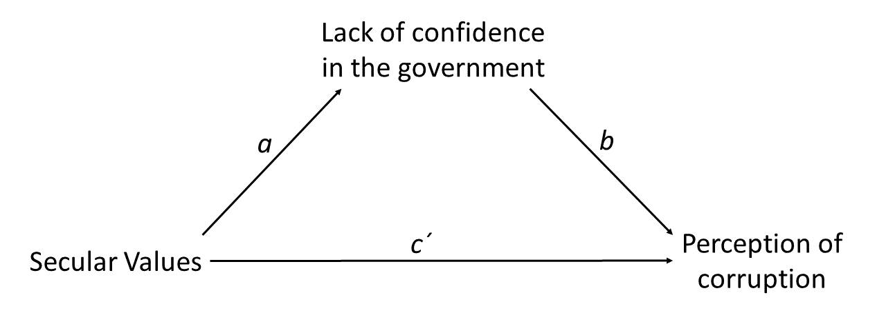
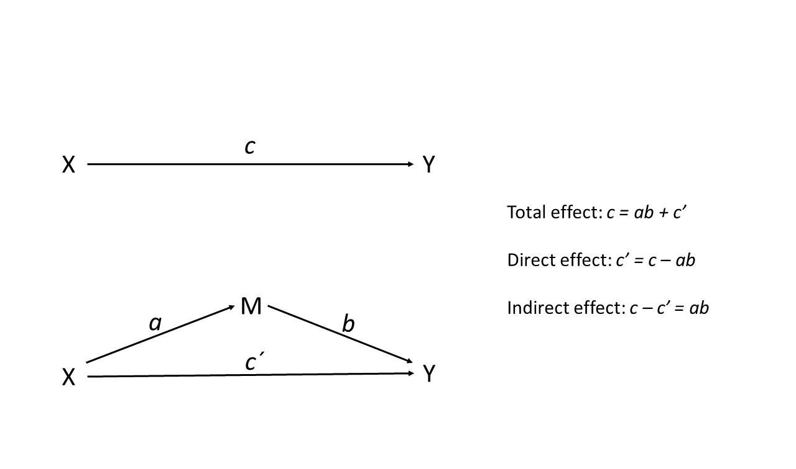
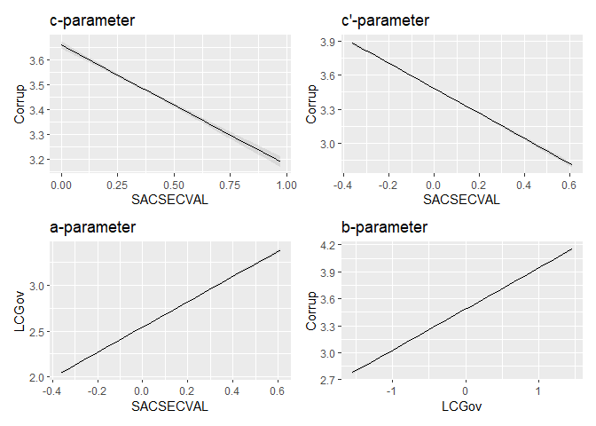

Mediation analysis with bruceR
================
Mauricio Garnier-Villarreal
29 January, 2026

- [What is mediation analysis?](#what-is-mediation-analysis)
- [Setup the R session](#setup-the-r-session)
- [Import the data set](#import-the-data-set)
  - [Prepare the data set](#prepare-the-data-set)
    - [Create composite scores](#create-composite-scores)
    - [Select variables for analysis](#select-variables-for-analysis)
- [Mediation analysis steps](#mediation-analysis-steps)
- [Mediation analysis](#mediation-analysis)
  - [Mediation analysis with bruceR](#mediation-analysis-with-brucer)
    - [Total effect](#total-effect)
    - [Indirect effect](#indirect-effect)
      - [Inference for the indirect
        effect](#inference-for-the-indirect-effect)
        - [Bootstrap NHST](#bootstrap-nhst)
      - [Direct effect](#direct-effect)
    - [Final recommendations](#final-recommendations)
  - [Effect sizes](#effect-sizes)
  - [Visualizations](#visualizations)
  - [Interpretation](#interpretation)
- [References](#references)

# What is mediation analysis?

With mediation analysis, we are trying to find out whether the effect or
association between an independent and a dependent variable is due to an
indirect effect through another variable (called the mediator variable).
Let’s say that we are interested in the association between *Secular
values* and *Perception of corruption*, but we specifically want to know
whether the association works through the mediator variable *Lack of
confidence in the government* of individuals (see the figure below). In
this example, *Lack of confidence in the government* is therefore our
(potential) *mediator* of the association between *Secular values* and
*Perception of corruption*.



# Setup the R session

When we start working in R, we always need to setup our session. For
this we need to set our working directory, in this case I am doing that
for the folder that holds the downloaded [World Values Survey
(WVS)](https://www.worldvaluessurvey.org/) `SPSS` data set.

``` r
setwd("~path_to_your_file")
```

The next step for setting up our session will be to load the packages
that we will be using.

``` r
library(rio)
library(effectsize)
library(marginaleffects)
library(ggplot2)
library(parameters)
library(car)
library(bruceR)
library(tidyr)
library(patchwork)
```

# Import the data set

We now import the WVS data set in `.sav` format.

``` r
dat <- import("WVS_Cross-National_Wave_7_sav_v2_0.sav")
dim(dat)
```

    ## [1] 76897   548

We are calling the data set **dat** and asking to see the dimension of
it. We see that the data set has 76897 subjects, and 548 columns.

## Prepare the data set

In cases with large data sets like this it is easy to loose track of all
548 variables. We therefore might want to select a subset of variables
that we want to work with. You can see all variable names for the full
data set by using:

``` r
colnames(dat)
```

To select a subset of variables, we first create a vector **vars** with
the variable names for the variables we want to keep. After identifying
which variables we will work with, we create a new data set **dat2**
with only these 17 variables, and make sure we did it correctly by
looking at the the dimension of the data `dim(dat2)`. We also look at
the first 6 rows: `head(dat2)`. These are quick checks that we have
created the new data correctly.

``` r
vars <- c("Q262", "Y001", "SACSECVAL", "Q112", "Q113", "Q114", "Q115", "Q116", "Q117", "Q118", "Q119", "Q120", "Q65", "Q69", "Q71", "Q72", "Q73")
dat2 <- dat[,vars]
dim(dat2)
```

    ## [1] 76897    17

``` r
head(dat2)
```

    ##   Q262 Y001 SACSECVAL Q112 Q113 Q114 Q115 Q116 Q117 Q118 Q119 Q120 Q65 Q69 Q71
    ## 1   60    0  0.287062    2   NA   NA   NA   NA   NA    1    2    6  NA   1   1
    ## 2   47    2  0.467525   10    3    3    3    3    3    1    3    2  NA   3   4
    ## 3   48    4  0.425304    7    2    2    2    2    2    1    2    7  NA   2   3
    ## 4   62    2  0.556170    5    3    3    3    3    2    1    4    7  NA   3   3
    ## 5   49    1  0.458949    5    2    2    2    2    1    1    3    7  NA   2   2
    ## 6   51    3  0.210111    6    2    2    2    2    2    1    4    2  NA   1   2
    ##   Q72 Q73
    ## 1   1   1
    ## 2   4   4
    ## 3   3   3
    ## 4   3   3
    ## 5   3   2
    ## 6   2   2

The variables we will use here are:

- Q262: age in years
- Y001: post-materialism index
- SACSECVAL: secular values
- Q112-Q120: Corruption Perception Index
- Q65-Q73: Lack of Confidence in the government

### Create composite scores

We will be using the composite scores for *Corruption Perception Index*
and *Lack of Confidence in the government* instead of their single
items. So, we first need to compute them. We will use the mean across
all items to form a composite score for each construct.

``` r
dat2$Corrup <- rowMeans(dat2[,c("Q112", "Q113", "Q114", "Q115", "Q116", "Q117", "Q118", "Q119", "Q120")], na.rm=T)
dat2$LCGov <- rowMeans(dat2[,c("Q65", "Q69", "Q71", "Q72", "Q73")], na.rm=T)
head(dat2)
```

    ##   Q262 Y001 SACSECVAL Q112 Q113 Q114 Q115 Q116 Q117 Q118 Q119 Q120 Q65 Q69 Q71
    ## 1   60    0  0.287062    2   NA   NA   NA   NA   NA    1    2    6  NA   1   1
    ## 2   47    2  0.467525   10    3    3    3    3    3    1    3    2  NA   3   4
    ## 3   48    4  0.425304    7    2    2    2    2    2    1    2    7  NA   2   3
    ## 4   62    2  0.556170    5    3    3    3    3    2    1    4    7  NA   3   3
    ## 5   49    1  0.458949    5    2    2    2    2    1    1    3    7  NA   2   2
    ## 6   51    3  0.210111    6    2    2    2    2    2    1    4    2  NA   1   2
    ##   Q72 Q73   Corrup LCGov
    ## 1   1   1 2.750000  1.00
    ## 2   4   4 3.444444  3.75
    ## 3   3   3 3.000000  2.75
    ## 4   3   3 3.444444  3.00
    ## 5   3   2 2.777778  2.25
    ## 6   2   2 2.555556  1.75

With the `rowmeans()` we compute the mean across the specified
variables, subject by subject. Remember to include the `na.rm=T`
argument, so the missing values are ignored. In this way, the mean score
represents the mean for all of the items that the respondents did
answer. Otherwise, you get a missing value for every individual that has
a missing value on at least *one* of the items.

Note that the PROCESS macro does not work with variables that are
designated as factors. Categorical variables should therefore not be
designated as factor variables when you are working with the PROCESS
macro. In our data set this is not the case, so we can proceed.

### Select variables for analysis

Now, we will again create a new data set (**dat2**) that only contains
the variables we want to work with:

``` r
dat2 <- drop_na(dat2[,c("Q262", "Y001", "SACSECVAL", "Corrup", "LCGov")])
head(dat2)
```

    ##   Q262 Y001 SACSECVAL   Corrup LCGov
    ## 1   60    0  0.287062 2.750000  1.00
    ## 2   47    2  0.467525 3.444444  3.75
    ## 3   48    4  0.425304 3.000000  2.75
    ## 4   62    2  0.556170 3.444444  3.00
    ## 5   49    1  0.458949 2.777778  2.25
    ## 6   51    3  0.210111 2.555556  1.75

``` r
dim(dat2)
```

    ## [1] 71648     5

The new `dat2` data set only include the 6 continuous variables of
interest, and 1 binary variable. With the `drop_na()` function we are
excluding all cases with some missing values.

# Mediation analysis steps

Mediation analysis can be split into a few steps

- Estimate the *total effect* model, that includes only the outcome and
  main predictor variables
- Estimate the *mediation* model, including the 2 regressions that are
  involved (will explain this next)
- Use either *bootstraps* or *Monte-Carlo* to make an inference about
  the mediation/indirect effect

# Mediation analysis

Mediation analysis involves several regressions in the sense that we
have multiple outcomes. Here we have all predictor(s) and mediator(s)
predicting the outcome variable, and all (main) predictor(s) predicting
the mediator(s).

In the simple mediation model with one independent variable (X), one
dependent variable (Y), and one mediator variable (M), we have the
following paths (see the figure below):

- the *direct effect* of X on Y, denoted c’
- the *direct effect* of X on M, denoted a
- the *direct effect* of M on Y, denoted b

In addition, we have the *total effect*, denoted c, which is the overall
effect of X on Y. The total effect includes the direct effect and the
indirect effect through all (potential) mediators. With mediation
analysis, we are trying to partition the total effect into direct and
indirect effects.



Now lets explain it with the simple mediation example from above. In
this case we are mainly interested in the effect of *Secular values* on
*Perception of corruption*. So, the *total* effect of it can be express
by the simple regression

Here we can see that it is a simple concept: the *full/maximum/total*
effect that *Secular values* has on *Perception of corruption* is $c$
(in your data set).

With mediation analysis, we will partition this effect $c$ into a
*direct* effect $c'$, and an *indirect* effect $ab$ or $c-c'$. We can do
this with 2 regressions, the first one by adding also *Lack of
confidence in the government* as a second predictor/mediator

And a second regression where the main predictor also predicts the
mediator. This way we see that the mediator is both a predictor and an
outcome at the same time

Now, from these 2 new regressions where do the *direct* and *indirect*
effects come from? The *direct* effect is simple, it is the $c`$ slope,
or the effect of the main predictor on the outcome when the mediator is
included.

While for the *indirect effect* we need to use both equations, as it is
defined as the product of $a$ and $b$ parameters from the previous
regressions $ab$, which is equal to $c-c'$ (in the case of linear
regression).

## Mediation analysis with bruceR

The general code for a simple moderation model using the PROCESS
function. In the command, the inputs for `data`, `y`, `x`, and `meds`
are placeholders, which we have to replace with the names for the data
set and the variable names from our data set. Provide the data object,
the outcome variable (`y`), the predictor (`x`), and the mediator
(`meds`). Then we can ask for the mediation analysis to be done and
reported as fully standardized (`std = T`) or un-standardized
(`std = F`). When we use bootstrap for the hypothesis test in mediation
is recommended to set a `seed` so that the bootstraps are reproducible.
We also need to specify the number of bootstraps to use, in this case we
ask for `nsim = 1000` (this will take a bit as it it is running the
analysis 1000 times). Lastly we specify `ci = "bca.boot"` so that we get
Bias-Corrected and Accelerated (BCa) Percentile Bootstrap Confidence
Intervals, this is generally recommended for mediation

``` r
med1 <- PROCESS(data = dat2, 
                y = "Corrup", 
                x = "SACSECVAL", 
                meds = "LCGov", 
                std = F, 
                seed = 1987,
                nsim = 1000,
                ci = "bca.boot")
```

    ## 
    ## ****************** PART 1. Regression Model Summary ******************
    ## 
    ## PROCESS Model ID : 4
    ## Model Type : Simple Mediation
    ## -    Outcome (Y) : Corrup
    ## -  Predictor (X) : SACSECVAL
    ## -  Mediators (M) : LCGov
    ## - Moderators (W) : -
    ## - Covariates (C) : -
    ## -   HLM Clusters : -
    ## 
    ## All numeric predictors have been grand-mean centered.
    ## (For details, please see the help page of PROCESS.)
    ## 
    ## Formula of Mediator:
    ## -    LCGov ~ SACSECVAL
    ## Formula of Outcome:
    ## -    Corrup ~ SACSECVAL + LCGov
    ## 
    ## CAUTION:
    ##   Fixed effect (coef.) of a predictor involved in an interaction
    ##   denotes its "simple effect/slope" at the other predictor = 0.
    ##   Only when all predictors in an interaction are mean-centered
    ##   can the fixed effect be interpreted as "main effect"!
    ##   
    ## Model Summary
    ## 
    ## ────────────────────────────────────────────────────────
    ##              (1) Corrup     (2) LCGov      (3) Corrup   
    ## ────────────────────────────────────────────────────────
    ## (Intercept)      3.485 ***      2.544 ***      3.485 ***
    ##                 (0.003)        (0.003)        (0.003)   
    ## SACSECVAL       -0.483 ***      1.377 ***     -1.111 ***
    ##                 (0.018)        (0.015)        (0.017)   
    ## LCGov                                          0.456 ***
    ##                                               (0.004)   
    ## ────────────────────────────────────────────────────────
    ## R^2              0.010          0.108          0.157    
    ## Adj. R^2         0.010          0.108          0.157    
    ## Num. obs.    71648          71648          71648        
    ## ────────────────────────────────────────────────────────
    ## Note. * p < .05, ** p < .01, *** p < .001.
    ## 
    ## ************ PART 2. Mediation/Moderation Effect Estimate ************
    ## 
    ## Package Use : ‘mediation’ (v4.5.1)
    ## Effect Type : Simple Mediation (Model 4)
    ## Sample Size : 71648
    ## Random Seed : set.seed(1987)
    ## Simulations : 1000 (Bootstrap)
    ## 
    ## Running 1000 simulations...
    ## Indirect Path: "SACSECVAL" (X) ==> "LCGov" (M) ==> "Corrup" (Y)
    ## ────────────────────────────────────────────────────────────────
    ##                Effect    S.E.       z     p        [Boot 95% CI]
    ## ────────────────────────────────────────────────────────────────
    ## Indirect (ab)   0.628 (0.009)  71.120 <.001 *** [ 0.611,  0.645]
    ## Direct (c')    -1.111 (0.019) -57.974 <.001 *** [-1.149, -1.076]
    ## Total (c)      -0.483 (0.019) -25.498 <.001 *** [-0.522, -0.449]
    ## ────────────────────────────────────────────────────────────────
    ## Bias-Corrected and Accelerated (BCa) Percentile Bootstrap Confidence Interval
    ## (SE and CI are estimated based on 1000 Bootstrap samples.)
    ## 
    ## Note. The results based on bootstrapping or other random processes
    ## are unlikely identical to other statistical software (e.g., SPSS).
    ## To make results reproducible, you need to set a seed (any number).
    ## Please see the help page for details: help(PROCESS)
    ## Ignore this note if you have already set a seed. :)

This function provides output for each of the models described above.
One model where *Perception of corruption* is the outcome variable, and
one model where *Lack of confidence in the government* is the outcome
variable.

We will also run the model with `std = T`, so that we have the
standardized parameters as measure of effect size, everything else stays
the same

``` r
med1_std <- PROCESS(data = dat2, 
                y = "Corrup", 
                x = "SACSECVAL", 
                meds = "LCGov", 
                std = T, 
                seed = 1987,
                nsim = 1000,
                ci = "bca.boot")
```

    ## 
    ## ****************** PART 1. Regression Model Summary ******************
    ## 
    ## PROCESS Model ID : 4
    ## Model Type : Simple Mediation
    ## -    Outcome (Y) : Corrup
    ## -  Predictor (X) : SACSECVAL
    ## -  Mediators (M) : LCGov
    ## - Moderators (W) : -
    ## - Covariates (C) : -
    ## -   HLM Clusters : -
    ## 
    ## All numeric predictors have been standardized.
    ## (For details, please see the help page of PROCESS.)
    ## 
    ## Formula of Mediator:
    ## -    LCGov ~ SACSECVAL
    ## Formula of Outcome:
    ## -    Corrup ~ SACSECVAL + LCGov
    ## 
    ## CAUTION:
    ##   Fixed effect (coef.) of a predictor involved in an interaction
    ##   denotes its "simple effect/slope" at the other predictor = 0.
    ##   Only when all predictors in an interaction are mean-centered
    ##   can the fixed effect be interpreted as "main effect"!
    ## 

    ## Registered S3 methods overwritten by 'MuMIn':
    ##   method        from 
    ##   nobs.multinom broom
    ##   nobs.fitdistr broom

    ## 
    ## Model Summary
    ## 
    ## ──────────────────────────────────────────────────────
    ##            (1) Corrup     (2) LCGov      (3) Corrup   
    ## ──────────────────────────────────────────────────────
    ## SACSECVAL      -.102 ***       .328 ***      -.236 ***
    ##                (.004)         (.004)         (.004)   
    ## LCGov                                         .406 ***
    ##                                              (.004)   
    ## ──────────────────────────────────────────────────────
    ## R^2             .010           .108           .157    
    ## Adj. R^2        .010           .108           .157    
    ## Num. obs.  71648          71648          71648        
    ## ──────────────────────────────────────────────────────
    ## Note. * p < .05, ** p < .01, *** p < .001.
    ## 
    ## ************ PART 2. Mediation/Moderation Effect Estimate ************
    ## 
    ## Package Use : ‘mediation’ (v4.5.1)
    ## Effect Type : Simple Mediation (Model 4)
    ## Sample Size : 71648
    ## Random Seed : set.seed(1987)
    ## Simulations : 1000 (Bootstrap)
    ## 
    ## Running 1000 simulations...
    ## Indirect Path: "SACSECVAL" (X) ==> "LCGov" (M) ==> "Corrup" (Y)
    ## ────────────────────────────────────────────────────────────────
    ##                Effect    S.E.       z     p        [Boot 95% CI]
    ## ────────────────────────────────────────────────────────────────
    ## Indirect (ab)   0.133 (0.002)  71.120 <.001 *** [ 0.130,  0.137]
    ## Direct (c')    -0.236 (0.004) -57.974 <.001 *** [-0.244, -0.228]
    ## Total (c)      -0.102 (0.004) -25.498 <.001 *** [-0.111, -0.095]
    ## ────────────────────────────────────────────────────────────────
    ## Bias-Corrected and Accelerated (BCa) Percentile Bootstrap Confidence Interval
    ## (SE and CI are estimated based on 1000 Bootstrap samples.)
    ## 
    ## Note. The results based on bootstrapping or other random processes
    ## are unlikely identical to other statistical software (e.g., SPSS).
    ## To make results reproducible, you need to set a seed (any number).
    ## Please see the help page for details: help(PROCESS)
    ## Ignore this note if you have already set a seed. :)

### Total effect

Lets first look at the total effect model. The output is given in the
model summary for model (1), where *Perception of corruption* is the
outcome and *Secular Values* is the only predictor. This is also shown
in the last table in the *Total (c)* row. Here we see that the *total*
effect of *Secular values* on *Perception of corruption* is
$c = -0.483, SE = 0.018, p < .001$. This can be considered a small
effect as the standardized slope is $\beta = -0.102$ (given under the
*Standardized coefficients* subheading), and only 1% of the variance is
explained by *Secular values* ($R^2 = .01$, given as *R-sq* under the
subheading *Model Summary*).

### Indirect effect

The output for the indirect effect is given all the way at the bottom of
the output, in the last table with the indirect, direct and total
effects.

We can see that the indirect effect of *Secular values* on *Perception
of corruption* through *Lack of confidence in the government* is
$ab = 0.628, 95\% CI = [0.611, 0.645], \beta = 0.133$. We reject the
null hypothesis that *Lack of confidence in the government* has no
mediating effect between *Secular values* and *Perception of
Corruption*. Instead, we find a small positive standardized indirect
effect of 0.133. As *Secular values* increases by one unit, *Perception
of corruption* increases by 0.628 units, through the effect on *Lack of
confidence in the government*. And as *Secular values* increases by one
standard deviation, *Perception of corruption* increases by 0.133 units,
through the effect on *Lack of confidence in the government*.

#### Inference for the indirect effect

There are several ways to do inference about the statistical
significance of the indirect effect. Below, we outline three options for
Null Hypothesis Significance Testing (NHST).

The first option is the Sobel NHST. The Sobel NHST has the fundamental
assumption that the estimated parameter for the indirect effect follows
a normal distribution. This is a general assumption of regressions, and
it can be held for the direct effects $c$, $a$, $b$ and $tot$. But It is
not reasonable for the *indirect* effect $ab$ (Hayes, 2022).

Two **better options** are the *Bootstrap NHST*, and *Monte-Carlo NHST*.
Both of these fall in the family of *non-parametric* tests. They work by
simulating empirical parameter distribution for the indirect effect, and
we can use these distributions to construct confidence intervals (CI)
for the indirect effect. Because these tests rely on simulated empirical
distributions, we do not have to assume that the $ab$ parameter is
normally distributed.

In short, bootstrapping works by resampling repeatedly and randomly from
an original, initial sample, and estimating a statistic (e.g. the
indirect effect) based on this sample. All of these estimated statistics
are then used do construct an empirical parameter distribution for the
indirect effect. Ideally, we want thousands of resamples to get a
reliable parameter distribution. PROCESS uses a default of 5000
bootstrap samples (Hayes, 2022), which is fine.

Monte-Carlo NHST works by simulating several thousands of values for the
parameters $a$, $b$, and $c$ based on the estimates and their
covariance, and calculating the respective new parameters of interest
(e.g., the indirect effect $ab$). Similar to bootstrap this creates an
empirical parameter distribution, from which we will calculate
confidence intervals to make inferences.

##### Bootstrap NHST

By default, the PROCESS function provides bootstrapped confidence
intervals. This is what we have already done above: The estimate for the
indirect effect is
$ab = 0.628, 95\% CI = [0.611, 0.645], \beta = 0.133$. We recommend to
use the Bootstrap method for inferences, with `nsim = 1000` or higher

#### Direct effect

We always get output for the direct effect as well, which is estimated
to be $c` = -1.111, 95\% CI = [-1.145, -1.078], \beta = -0.236$.

### Final recommendations

As we discussed, there are several ways to test for the indirect
effects. You should not consider the indirect effect to follow a normal
distribution. So, make an inference based on either Bootstrap or
Monte-Carlo empirical distributions. In most cases they will get to
equivalent inferences, a major difference is the computing time as
Monte-Carlo is much faster. In addition, Monte-Carlo has less
assumptions, because it uses functions of the parameters, while the
Bootstrap assumption is that your sample is large enough to be
representative of the population of interest.

## Effect sizes

The PROCESS function provides effect size measure for the overall model,
such as the $R^2$, and can use the standardize coefficients as a measure
of effect size (`std = T`).

But we can also extract the models and estimate other effect sizes, such
as $\eta^2$. This way we can see that *lack of confidence in the
government* uniquely explains 14% of the variance in *Perception of
corruption*, while *Secular values* uniquely explains 5%.

When using this function, remember to use the `Anova()` function to
specify type 2 sum of squares

``` r
eta_squared(Anova(med1$model.y, type=2), partial=F)
```

    ## # Effect Size for ANOVA (Type II)
    ## 
    ## Parameter | Eta2 |       95% CI
    ## -------------------------------
    ## SACSECVAL | 0.05 | [0.05, 1.00]
    ## LCGov     | 0.14 | [0.14, 1.00]
    ## 
    ## - One-sided CIs: upper bound fixed at [1.00].

## Visualizations

We can also generate plots for the different parameters of interest,
$c$, $c'$, $a$, and $b$. The direct effects plots can help us describe
the process of mediation.

For this first we will estimate the *total effect* model, as the
function `PROCESS` does not saved it. And then save the conditional
prediction plot from it, with the `marginaleffects` package function
`plot_predictions()`

``` r
## total effect model
mod_tot <- lm(Corrup ~ SACSECVAL, data=dat2)

# plot the c - parameter
pc <- plot_predictions(mod_tot, 
                        condition = "SACSECVAL")+
  labs(title = "c-parameter")
```

Then we can plot the other parameters from the models saved in the
`med1` object, such as mediator model (`med1$model.m[[1]]`) where the
mediator is the outcome, and the model with both predictors
(`med1$model.y`)

``` r
## plot the a - parameter from the mediation model
pa <- plot_predictions(med1$model.m[[1]], 
                       condition = "SACSECVAL")+
  labs(title = "a-parameter")

## plots the c' - parameter from the outcome model
pcp <- plot_predictions(med1$model.y, 
                       condition = "SACSECVAL")+
  labs(title = "c'-parameter")

## plots the b - parameter from the outcome model
pb <- plot_predictions(med1$model.y, 
                       condition = "LCGov")+
  labs(title = "b-parameter")
```

Lastly, we can arrange the four plots into a grid of plots with the
functionality from the `patchwork` package

``` r
### put all the plots together with patchwork
(pc + pcp)/(pa + pb)
```

<!-- -->

## Interpretation

For the final interpretation, we will use the **Sobel test** for the
direct effects, and the **Bootstrap** for the indirect effect.

We see that the *total* effect of Secular values (SV) on Perception of
corruption (PC) is
$c = -0.483, SE = 0.018, p < .001, 95\% CI = [-0.518, -0.449], \beta = -0.102$.
Indicating that as SV increases by 1 unit, PC decreases by 0.483 units.
When we include the mediator of Lack of confidence in the government
(LCG), we see that the *indirect* effect of SV on PC through LCG is
$ab = 0.628, SE = 0.009, 95\% CI = [0.611, 0.645], \beta = 0.133$.
Indicating that as SV increase by 1 unit, PC increases by 0.628 units
through its effect on LCG. The *direct* effect of SV on PC is
$cp = -1.111, SE = 0.017, p < .001, 95\% CI = [-1.145, -1.078], \beta = -0.236$,
and the *direct* effect of SV on LCG is
$a = 1.377, SE = 0.015, p < .001, 95\% CI = [1.348, 1.406], \beta = 0.328$,
and the *direct* effect of LCG on PC is
$b = 0.456, SE = 0.004, p < .001, 95\% CI = [0.448, 0.464], \beta = 0.406$.
With these pattern of results, we see that as SV increases LCG
increases, and as LCG increases PC increases. While the direct effect of
SV on PC presents a negative effect.

# References

Hayes, Andrew F. (2022). Introduction to mediation, moderation, and
conditional process analysis: A regression-based approach (Third
edition, Vol. 1–1 online resource (xx, 732 pages) : illustrations.). The
Guilford Press.
