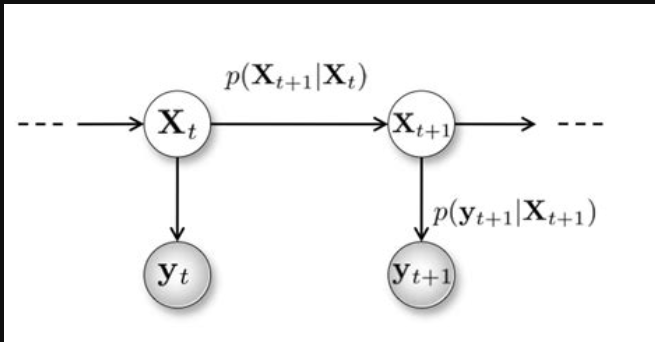
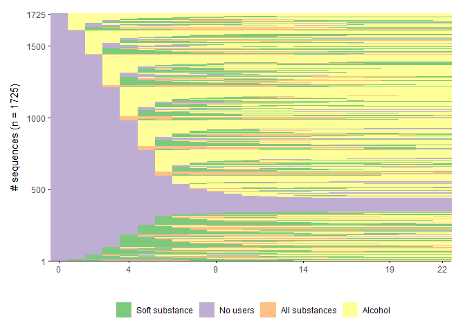
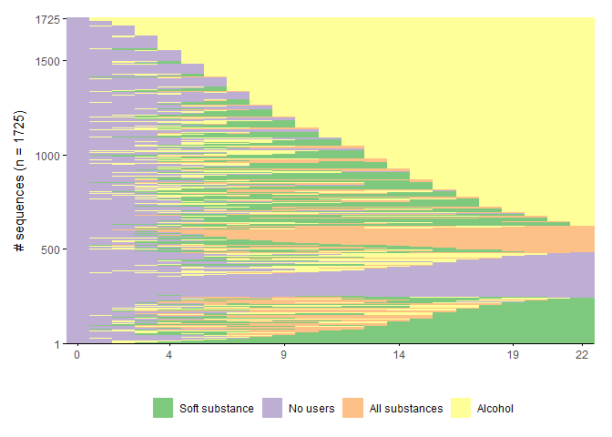
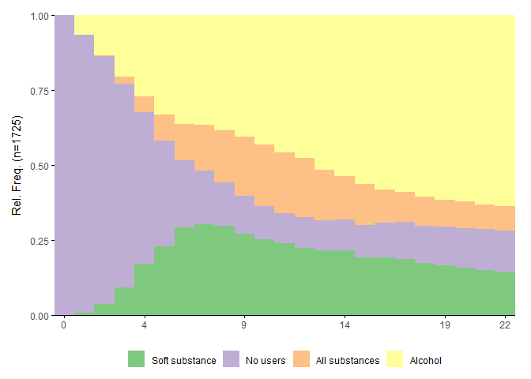
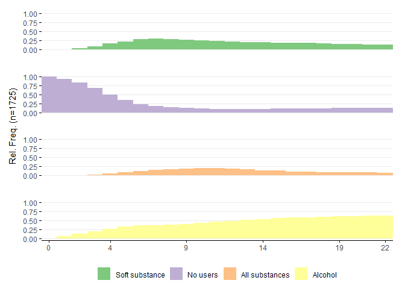
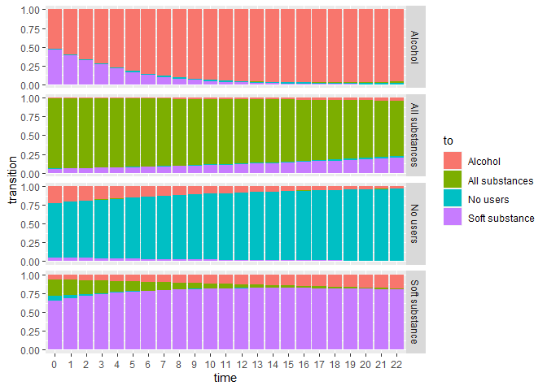

HMM with depmixS4 (categorical indicators)
================
Mauricio Garnier-Villarreal
1/19/23

- <a href="#hidden-markov-models-hmm"
  id="toc-hidden-markov-models-hmm">Hidden Markov Models (HMM)</a>
  - <a href="#markov-assumption" id="toc-markov-assumption">Markov
    assumption</a>
  - <a href="#measurement-model" id="toc-measurement-model">Measurement
    model</a>
  - <a href="#structural-model" id="toc-structural-model">Structural
    model</a>
- <a href="#depmixs4" id="toc-depmixs4"><code>depmixS4</code></a>
- <a href="#dichotomous-indicator-example"
  id="toc-dichotomous-indicator-example">Dichotomous indicator example</a>
  - <a href="#depmixs4-syntax"
    id="toc-depmixs4-syntax"><code>depmixS4</code> syntax</a>
    - <a href="#time-variant-hmm" id="toc-time-variant-hmm">Time variant
      HMM</a>
  - <a href="#class-enumeration" id="toc-class-enumeration">Class
    enumeration</a>
    - <a href="#model-fit-indices" id="toc-model-fit-indices">Model Fit
      Indices</a>
  - <a href="#time-varying-hmm" id="toc-time-varying-hmm">Time varying
    HMM</a>
    - <a href="#classification-diagnostics"
      id="toc-classification-diagnostics">Classification Diagnostics</a>
    - <a href="#conditional-transition-matrices"
      id="toc-conditional-transition-matrices">Conditional transition
      matrices</a>
    - <a href="#plotting-hmm" id="toc-plotting-hmm">Plotting HMM</a>
      - <a href="#index-plot" id="toc-index-plot">Index plot</a>
      - <a href="#density-plot" id="toc-density-plot">Density plot</a>
      - <a href="#transition-probabilities"
        id="toc-transition-probabilities">Transition probabilities</a>
- <a href="#references" id="toc-references">References</a>

# Hidden Markov Models (HMM)

Here we present Hidden Markov Models (HMM) as a longitudinal extension
of Latent Class Analysis (LCA). Where we have an LCA at multiple time
points, representing the relationship between the latent variable and
the observed indicators (measurement part), and the relation of states
across time (structural part).

A HMM is a mixture model with a dynamic categorical latent variable. One
of the key elements of this model is that latent-state transitions
occurring over time are modeled using a first-order Markov structure.
The second key element is that the latent states are connected to one or
more observed response variables via a latent class structure with
conditional densities (Vermunt, 2010).

Besides the Markov assumption for the latent states and the local
independence assumption for the responses within occasions, the latent
Markov model assumes that responses are independent across occasions
conditional on the latent states. The latter implies that the observed
associations across time points are assumed to be explained by the
autocorrelation structure for the latent states.

When used with multiple indicators, the model is a longitudinal data
extension of the standard latent class model (Hagenaars, 1990). The
time-specific latent states can be seen as clusters or types which
differ in their responses on the J indicators, and the Markovian
transition structure is used to describe and predict changes that may
occur across adjacent measurement occasions.

## Markov assumption

The markov assumptions is the basis of the structural part of the model.
Representing that the latent states at time $t$ is only affected by the
latent states at time $t-1$ . Meaning that the change of time is a *lag
1* model, where each time point is only has a direct effect by the
previous time point, and the time points before it have indirect
effects.



Here we see that the probability of being in any given state at $t+1$ is
only conditional on time $t$. While the response probabilities of the
observed indicators are independent of previous time points, conditional
on the latent states.

## Measurement model

The measurement model is a time invariant (constant) LCA. Where latent
states are defined by some observed indicators, and the differences in
response patterns (Masyn, 2013; Collins & Lanza, 2010).

Here we will not extend on LCA, as that is cover in other readings and
tutorials.

## Structural model

The structural model of an HMM is comprise of two sets of parameters,
(i) initial states, and (ii) transition matrices. The initial states are
the proportion of the sample in each state at the first time point, the
posterior predictive probability for each class in LCA but at a specific
time point. The transition probabilities present the probability of
someone in each state to move to any other state between time $t-1$ to
time $t$.

The default model assumes that the transition matrix is time invariant.
Meaning that the probability to transition is the same between at time 1
and at time 100. So, it will only present one transition matrix across
all time points. This assumption can be relax, by adding *time* as a
predictor of the transition matrix, this way we would have a time
variant HMM, with different transition matrices at every time point.

The transition matrix is model as a multinomial logistic regression from
$k$ states across time.

# `depmixS4`

For this tutorial we will use the package `depmixS4`. Which has the
ability to estimate LCAs, with categorical and continuous indicators,
their longitudinal extension of Hidden Markov Models (HMM), and allows
to include covariates. Depending on the *R* package you use, you might
have some of these features, but so far this is the package that we have
found to have more features.

A disadvantage is that it lacks some nice summary functions, like to
generate plots, tables, etc. For this I have written some functions,
which build on the presentations functions from the package *tidySEM*.
In the future I will collaborate to have this functions included in the
package (will update the tutorials when this happens).

For now, you will need to run as source the `demixs4_helper_functions.R`
code. This will load a series of helper functions to create plots and
summarize the results. Then we will load the package `depmixS4` for LCA,
`rio` to import the data set.

``` r
source("demixs4_helper_functions.R")
library(depmixS4)
library(rio)
library(sjlabelled)
library(summarytools)
library(ggplot2)
library(ggseqplot)
library(tidyr)
library(TraMineR)
```

If you want to load the helper functions directly from this GitHub
repository, you can do it with this URL

``` r
source("https://raw.githubusercontent.com/maugavilla/well_hello_stats/main/tutorials/demixs4_helper_functions.R")
```

# Dichotomous indicator example

Then we will import the **vermunt_tran_magidson.sav** example data set
for analysis.

``` r
dat <- import("vermunt_tran_magidson.sav")
head(dat)
```

      id age11 psu1976 male ethn2 ethn3 ethn4 alc mrj drugs faslt ftheft age11_2
    1  1     0       1    1     1     1     1  NA  NA    NA    NA     NA       0
    2  1     1       1    1     1     1     1  NA  NA    NA    NA     NA       1
    3  1     2       1    1     1     1     1   1   0     0     0      0       4
    4  1     3       1    1     1     1     1   1   0     0     0      0       9
    5  1     4       1    1     1     1     1   1   0     0     0      0      16
    6  1     5       1    1     1     1     1   1   0     0     1      1      25

``` r
dim(dat)
```

    [1] 39675    13

With the function `get_label()` we see the label attribute extracted
from the SPSS data set. And with the function `get_labels()` we see the
values for each variable. This data set doesn’t provide much information
from their variables, except for the demographic variables

``` r
get_label(dat)
```

         id   age11 psu1976    male   ethn2   ethn3   ethn4     alc     mrj   drugs 
         ""      ""      ""      ""      ""      ""      ""      ""      ""      "" 
      faslt  ftheft age11_2 
         ""      ""      "" 

``` r
get_labels(dat)
```

    $id
    NULL

    $age11
    NULL

    $psu1976
    NULL

    $male
    [1] "female" "male"  

    $ethn2
    [1] "majority" "minority"

    $ethn3
    [1] "white" "black" "other"

    $ethn4
    [1] "white"    "black"    "hispanic" "other"   

    $alc
    NULL

    $mrj
    NULL

    $drugs
    NULL

    $faslt
    NULL

    $ftheft
    NULL

    $age11_2
    NULL

Looking at the frequency distribution of the 3 indicators of substance
use, we see that harder drugs presents the lower proportion of use (13%)

``` r
freq(dat[,c("alc","mrj","drugs")])
```

    Frequencies  
    dat$alc  
    Type: Numeric  

                   Freq   % Valid   % Valid Cum.   % Total   % Total Cum.
    ----------- ------- --------- -------------- --------- --------------
              0    3418     24.98          24.98      8.61           8.61
              1   10263     75.02         100.00     25.87          34.48
           <NA>   25994                              65.52         100.00
          Total   39675    100.00         100.00    100.00         100.00

    dat$mrj  
    Type: Numeric  

                   Freq   % Valid   % Valid Cum.   % Total   % Total Cum.
    ----------- ------- --------- -------------- --------- --------------
              0    9232     67.47          67.47     23.27          23.27
              1    4451     32.53         100.00     11.22          34.49
           <NA>   25992                              65.51         100.00
          Total   39675    100.00         100.00    100.00         100.00

    dat$drugs  
    Type: Numeric  

                   Freq   % Valid   % Valid Cum.   % Total   % Total Cum.
    ----------- ------- --------- -------------- --------- --------------
              0   11874     86.82          86.82     29.93          29.93
              1    1803     13.18         100.00      4.54          34.47
           <NA>   25998                              65.53         100.00
          Total   39675    100.00         100.00    100.00         100.00

From this example, we will work with the variables about use of alcohol
(`alc`), marijuana (`mrj`), and heavier drugs (`drugs`), thesea re coded
0 for no use, and 1 for use. Other than the observed indicators we will
keep the `id`, time (`age11`), and sex (`male`) variables.

``` r
dat2 <- dat[,c("id","age11","male","alc","mrj","drugs")]
dat2$alc <- as.factor(dat2$alc)
dat2$mrj <- as.factor(dat2$mrj)
dat2$drugs <- as.factor(dat2$drugs)
head(dat2)
```

      id age11 male  alc  mrj drugs
    1  1     0    1 <NA> <NA>  <NA>
    2  1     1    1 <NA> <NA>  <NA>
    3  1     2    1    1    0     0
    4  1     3    1    1    0     0
    5  1     4    1    1    0     0
    6  1     5    1    1    0     0

``` r
summary(dat2)
```

           id           age11         male          alc          mrj       
     Min.   :   1   Min.   : 0   Min.   :0.0000   0   : 3418   0   : 9232  
     1st Qu.: 432   1st Qu.: 5   1st Qu.:0.0000   1   :10263   1   : 4451  
     Median : 863   Median :11   Median :1.0000   NA's:25994   NA's:25992  
     Mean   : 863   Mean   :11   Mean   :0.5322                            
     3rd Qu.:1294   3rd Qu.:17   3rd Qu.:1.0000                            
     Max.   :1725   Max.   :22   Max.   :1.0000                            
      drugs      
     0   :11874  
     1   : 1803  
     NA's:25998  
                 
                 
                 

For this analysis we need the longitudinal data set to be structure in
the *long* format, where each time point is a row, so each subject has
as many rows as time points they have. We can see how many time points
are observed for each subjects with the table function, here we are
showing the range as we dont want to print the output for so many
subjects

``` r
length(unique(dat2$id)) ## number of subjects
```

    [1] 1725

``` r
range(table(dat2$id)) ## range of number of time points
```

    [1] 23 23

Here we see that we have 1725 subjects, with 23 time points each.

## `depmixS4` syntax

When working with `depmixS4`, we will use the dep`mix()` function for
LCA. If we look at its helps page `?depmix`. The main necessary
arguments are `response`, which needs a list of the regression model for
each indicator variable. The basic regression will an intercept only
model, for example `reponse~1`, for a categorical variable this will
estimate the probability of answering the highest value. Then we have
the `data` argument, where we provide or data frame. Next, we need to
specify the number of states to estimate in our LCA, in our first
example `nstates=2` es ask for a 2 class LCA, then we need to specify
how many time points are observed for each subject, we do this in the
argument `ntimes` and we extract this information with the `table`
function. Last, we need to specify the `family` argument, here we define
how we want to treat each indicator, with `multinomial("identity")` we
specify that the indicators are categorical and estimate the model with
the identity link function.

``` r
hmm1_mod <- depmix(response = list(alc~1, mrj~1, drugs~1),
                data=dat2,
                nstates = 2,
                ntimes = as.numeric(table(dat2$id)),
                family = list(multinomial("identity"),multinomial("identity"),multinomial("identity")))
summary(hmm1_mod)
```

    Initial state probabilities model 
    pr1 pr2 
    0.5 0.5 

    Transition matrix 
           toS1 toS2
    fromS1  0.5  0.5
    fromS2  0.5  0.5

    Response parameters 
    Resp 1 : multinomial 
    Resp 2 : multinomial 
    Resp 3 : multinomial 
        Re1.0 Re1.1 Re2.0 Re2.1 Re3.0 Re3.1
    St1   0.5   0.5   0.5   0.5   0.5   0.5
    St2   0.5   0.5   0.5   0.5   0.5   0.5

From the summary function we see that with 2 states, we have the equal
starting values for the Initial state probabilities, transition matrix,
and response parameters.

With the `depmix` function we build the `depmixS4` model, we can see the
model definition, and the starting values with the `summary()` function.
To estimate the model, we give the built model to the `fit()` function,
and with the `summary()` we can see the results.

``` r
set.seed(1987)

hmm1_fit <- fit(hmm1_mod,
                emcontrol=em.control(maxit=50000,random.start = TRUE))
```

    converged at iteration 64 with logLik: -16481.7 

``` r
summary(hmm1_fit)
```

    Initial state probabilities model 
    pr1 pr2 
      1   0 

    Transition matrix 
            toS1  toS2
    fromS1 0.930 0.070
    fromS2 0.081 0.919

    Response parameters 
    Resp 1 : multinomial 
    Resp 2 : multinomial 
    Resp 3 : multinomial 
        Re1.0 Re1.1 Re2.0 Re2.1 Re3.0 Re3.1
    St1 0.381 0.619 0.974 0.026 0.994 0.006
    St2 0.010 0.990 0.126 0.874 0.638 0.362

Congratulation! you have run your first HMM. We see that in a 2 state
model, all the sample starts in state 1 (initial states), for those in
states 1 there is 0.93 probability of staying in states one, and there
is 0.07 probability of moving to state 2. For those in state 2, there is
0.919 probability of staying, and 0.081 probability of moving to state
1.

In the response parameters we can see the probabilities for each answer
in each state. So, state 1 has 61.9% chance of drinking alcohol, 2.6%
chance of using marijuana, and 0.6% chance of using harder drugs. In
state 2, has 99% chance of drinking alcohol, 87.4% chance of using
marijuana, and 36.2% chance of using harder drugs. We can see that state
1 is of no users, and state 2 of users.

### Time variant HMM

This data comes from data of teenagers, starting at age 11. So, it makes
sens to think that the transition matrices are time varying. We can
estimate the time varying HMM by adding our time variable as a predictor
of the transitions, for this we now add the argument
`transition = ~age11` , indicating that the variable age will be a
prediction of the transition matrix

``` r
hmm2_mod <- depmix(response = list(alc~1, mrj~1, drugs~1),
                data=dat2,
                nstates = 2,
                transition = ~ age11,
                ntimes = as.numeric(table(dat2$id)),
                family = list(multinomial("identity"),multinomial("identity"),multinomial("identity")))
summary(hmm2_mod)
```

    Initial state probabilities model 
    pr1 pr2 
    0.5 0.5 

    Transition model for state (component) 1 
    Model of type multinomial (mlogit), formula: ~age11
    Coefficients: 
                St1 St2
    (Intercept)   0   0
    age11         0   0
    Probalities at zero values of the covariates.
    0.5 0.5 

    Transition model for state (component) 2 
    Model of type multinomial (mlogit), formula: ~age11
    Coefficients: 
                St1 St2
    (Intercept)   0   0
    age11         0   0
    Probalities at zero values of the covariates.
    0.5 0.5 


    Response parameters 
    Resp 1 : multinomial 
    Resp 2 : multinomial 
    Resp 3 : multinomial 
        Re1.0 Re1.1 Re2.0 Re2.1 Re3.0 Re3.1
    St1   0.5   0.5   0.5   0.5   0.5   0.5
    St2   0.5   0.5   0.5   0.5   0.5   0.5

See that for initial state and response probabilities nothing has
changed. But for the transition matrix, we have a multinomial logistic
regression for each component. In each one the first state is used as
the baseline state. So, for St1 regression, the column St1 is the
regression for the probability of staying in St1, and column St2 is the
probability of switching from St1 to St2. And the regression from St2,
the column St1 is the probability of switching from St2 to St1, and the
column St2 is the probability of staying in St2.

Then we can estimate the time varying HMM with the `fit` function

``` r
hmm2_fit <- fit(hmm2_mod,
                emcontrol=em.control(maxit=50000,random.start = TRUE))
```

    converged at iteration 72 with logLik: -16288.15 

``` r
summary(hmm2_fit)
```

    Initial state probabilities model 
    pr1 pr2 
      1   0 

    Transition model for state (component) 1 
    Model of type multinomial (mlogit), formula: ~age11
    Coefficients: 
                St1        St2
    (Intercept)   0 -1.9262831
    age11         0 -0.1246257
    Probalities at zero values of the covariates.
    0.8728374 0.1271626 

    Transition model for state (component) 2 
    Model of type multinomial (mlogit), formula: ~age11
    Coefficients: 
                St1         St2
    (Intercept)   0  3.44337713
    age11         0 -0.07611636
    Probalities at zero values of the covariates.
    0.03096698 0.969033 


    Response parameters 
    Resp 1 : multinomial 
    Resp 2 : multinomial 
    Resp 3 : multinomial 
        Re1.0 Re1.1 Re2.0 Re2.1 Re3.0 Re3.1
    St1 0.383 0.617 0.973 0.027 0.993 0.007
    St2 0.011 0.989 0.139 0.861 0.645 0.355

We will evaluate the relevance of the predictor in two ways, first by
looking at the NHST of the respective multinomial logistic regressions.
For this we will first calculate the standard errors with the
`standardError()` function, and then calculate the Wald test

``` r
nhst <- standardError(hmm2_fit)
nhst$wald <- nhst$par/nhst$se
nhst$pvalue <- 1-pnorm(abs(nhst$wald))
nhst
```

                par constr          se       wald       pvalue
    1   1.000000000    bnd          NA         NA           NA
    2   0.000000000    bnd          NA         NA           NA
    3   0.000000000    fix          NA         NA           NA
    4  -1.926283119    inc 0.051339177 -37.520725 0.000000e+00
    5   0.000000000    fix          NA         NA           NA
    6  -0.124625743    inc 0.008724909 -14.283901 0.000000e+00
    7   0.000000000    fix          NA         NA           NA
    8   3.443377131    inc 0.162766908  21.155265 0.000000e+00
    9   0.000000000    fix          NA         NA           NA
    10 -0.076116362    inc 0.013033394  -5.840103 2.608431e-09
    11  0.382877586    inc 0.005552348  68.957784 0.000000e+00
    12  0.617122414    inc 0.005552348 111.146214 0.000000e+00
    13  0.972641011    inc 0.002879059 337.832997 0.000000e+00
    14  0.027358989    inc 0.002879059   9.502755 0.000000e+00
    15  0.992558371    inc 0.001188227 835.327226 0.000000e+00
    16  0.007441629    inc 0.001188227   6.262800 1.890621e-10
    17  0.010708284    inc 0.002014337   5.316034 5.302678e-08
    18  0.989291716    inc 0.002014337 491.125203 0.000000e+00
    19  0.138953158    inc 0.008192797  16.960406 0.000000e+00
    20  0.861046842    inc 0.008192797 105.098034 0.000000e+00
    21  0.644585998    inc 0.007569852  85.151732 0.000000e+00
    22  0.355414002    inc 0.007569852  46.951249 0.000000e+00

Right now we care about the parameters in rows 4 to 10, here we see that
we reject the null hypothesis of the multonomial logistic regression
parameters being equal to 0 $p < .001$

The second way that we will evaluate the relevance of the predictor is
by comparing the model fit. We can use the `get_fits()` function to get
the fit indices to compare the models

``` r
fits <- sapply(list(hmm1_fit, hmm2_fit), get_fits)
colnames(fits) <- c("Time Invariant", "Time Varying")
round(fits, 3)
```

               Time Invariant Time Varying
    LogLik         -16481.703   -16288.147
    parameters         18.000       22.000
    n               39675.000    39675.000
    AIC             32999.405    32620.295
    BIC             33153.998    32809.241
    CAIC            33171.998    32831.241
    KIC             33020.405    32645.295
    SABIC           33096.794    32739.325
    ICL            -41185.004   -40609.249
    Entropy             0.652        0.679
    prob_min            0.888        0.884
    prob_max            0.923        0.930
    n_min               0.354        0.339
    n_max               0.646        0.661

Here we see that all IC presents better fit for the time varying model.
finally we can do the likelihood ratio test between them with the
following code. Which rejects the null hypothesis of both models
representing the data equally well.

``` r
1-pchisq((-2*-16481.703  - -2*-16288.147), 
         df = (22 - 18) )
```

    [1] 0

Based on these information we would argue that the HMM in this case
should be time varying. So, in the following steps we will work with the
time varying HMM. Note that here we are testing the relevance of time
varying model before the class enumeration, but will do the class
enumeration selection without the time constant HMM and then add the
time predictor, this mainly because the models take longer to run. It
depends if you want to account for it in the class enumeration, or
after.

Also, we will present how to translate the regression parameters into
transition matrices conditional on the predictor later

## Class enumeration

In exploratory HMM, a sequence of models is fitted to the data with each
additional model estimating one more class than the previous model.
These models are then compared and the best solution is selected as the
final class solution. In some cases, prior theory can inform the
researcher about the number of classes to expect.

From a sequence of models, the final class solution is chosen based on
both theoretical and statistical criteria. Theory should drive the
selection of indicator variables, inform the expectations and reflect on
the findings. In addition to this, there are several statistical
criteria to consider in model selection. These include but are not
limited to likelihood ratio tests, information criteria, and the Bayes
factor (Masyn, 2013).

Relative model fit can be examined using the likelihood ratio test. This
is only appropriate when the two models we wish to compare are nested.
The likelihood ratio test statistic is computed as the difference in
maximum log-likelihoods of the two models, with the test degrees of
freedom being the difference in the degrees of freedom of the two
compared models. The test statistic follows the $\chi^2$ distribution,
and we want it to be non-significant in order to give support to the
simpler model. The likelihood ratio test can only compare two nested
models at a time (Collins & Lanza, 2010).

Here we show how to use a loop in *R* to run the model for a sequence of
HMM’s, with increasing number of classes, from 1 to 6, if you were to
add the predictor to the transition matrix you would need to test for 2
to 6 classes as the conditional transitions cannot be estimated for 1
class HMMs.

``` r
n_states <- 1:6
hmm_res <- list()
for(i in 1:length(n_states)){
  
  print(n_states[i])
  
  mod <- depmix(response = list(alc~1, mrj~1, drugs~1),
                data=dat2,
                nstates = n_states[i],
                ntimes = as.numeric(table(dat2$id)),
                family = list(multinomial("identity"),multinomial("identity"),multinomial("identity")))
  
  hmm_res[[i]] <- multistart(mod, nstart=5, initIters=50000)
}
```

    [1] 1
    converged at iteration 1 with logLik: -21653.93 
    converged at iteration 1 with logLik: -21653.93 
    converged at iteration 1 with logLik: -21653.93 
    converged at iteration 1 with logLik: -21653.93 
    converged at iteration 1 with logLik: -21653.93 
    converged at iteration 1 with logLik: -21653.93 
    [1] 2
    converged at iteration 65 with logLik: -16481.7 
    converged at iteration 65 with logLik: -16481.7 
    converged at iteration 65 with logLik: -16481.7 
    converged at iteration 72 with logLik: -16481.7 
    converged at iteration 66 with logLik: -16481.7 
    converged at iteration 1 with logLik: -16481.7 
    [1] 3
    converged at iteration 172 with logLik: -14693 
    converged at iteration 155 with logLik: -14693 
    converged at iteration 181 with logLik: -14693 
    converged at iteration 172 with logLik: -14693 
    converged at iteration 184 with logLik: -14693 
    converged at iteration 1 with logLik: -14693 
    [1] 4
    converged at iteration 246 with logLik: -14409.77 
    converged at iteration 329 with logLik: -14409.72 
    converged at iteration 449 with logLik: -14267.35 
    converged at iteration 392 with logLik: -14409.71 
    converged at iteration 425 with logLik: -14409.71 
    converged at iteration 1 with logLik: -14267.35 
    [1] 5
    converged at iteration 503 with logLik: -13980.16 
    converged at iteration 280 with logLik: -13980.16 
    converged at iteration 328 with logLik: -13980.16 
    converged at iteration 412 with logLik: -13980.16 
    converged at iteration 469 with logLik: -13980.16 
    converged at iteration 1 with logLik: -13980.16 
    [1] 6
    converged at iteration 1000 with logLik: -13924.24 
    converged at iteration 897 with logLik: -13924.24 
    converged at iteration 1040 with logLik: -13924.24 
    converged at iteration 817 with logLik: -13895.15 
    converged at iteration 759 with logLik: -13894.99 
    converged at iteration 1 with logLik: -13894.99 

See, that we first create a vector with the number of states we want to
estimate, then we create an empty `list` object where we will save all
our HMM’s. In the loop you will see that the model defined with the
`depmix` function is the same, and the only difference is that we loop
over the number of states. Then we use the `multistart` function to
estimate each model and save it into the empty list object. With the
`multistart` function, we can estimate the model multiple times, with
different starting values each time. This is useful to be more certain
that the results are not a local maxima but correct convergence. With
the `nstart` argument we specify how many starting values we want to
use, and with the `initIters` argument we specify how many iterations
use for each run.

You should see the message for each model that it converged, if it
doesnt show up, you can check each model by looking into the list of
models, like looking at the 5th model

``` r
hmm_res[[5]]
```

    Convergence info: Log likelihood converged to within tol. (relative change) 
    'log Lik.' -13980.16 (df=39)
    AIC:  28038.32 
    BIC:  28331.7 

### Model Fit Indices

Fit indices typically used for determining the optimal number of classes
include the Akaike Information Criterion (AIC) and the Bayesian
Information Criterion (BIC). Both information criteria are based on the
-2\*log-likelihood (which is lower for better fitting models), and add a
penalty for the number of parameters (thus incentivizing simpler
models). This helps balance model fit and model complexity. The lower
the value of an information criterion, the better the overall fit of the
model.

The general objective of the Information Criteria (IC) is to evaluate
the model’s out-of-sample predictive accuracy, so adjusting for over
fitting. Fit measures like $R^2$ evaluate the in-sample predictive
accuracy, meaning that they evaluate the models ability to predict the
observed outcomes based on the same data that was use to build up the
model. These metrics are positively bias, meaning that will present
better model fit than it has in reality. While IC corrects for this
positive bias by evaluating the models accuracy approximating the
out-of-sample predictive accuracy, meaning that it is the ability to
predict the outcome for observations that are not part of the training
model. Ideally we would estimate the model a lot of time with less
observations and predict their scores, but IC’s approximate this by
their different penalty metrics. For example $R^2$ will increase even if
an added predictors are unnecessary, while IC’s will show worst fit when
a predictor (complexity) is unnecessary (McElreath, 2020)

The BIC applies a stronger penalty for model complexity that scales
logarithmically with the sample size. The literature suggests the BIC
may be the most appropriate information criterion to use for model
comparison (Nylund-Gibson & Choi, 2018; Masyn, 2013)

Information criteria may occasionally contradict each other, so it is
important to identify a suitable strategy to reconcile them. One option
is to select a specific fit index before analyzing the data. Another
option is to always prefer the most parsimonious model that has best fit
according to any of the available fit indices. Yet another option is to
incorporate information from multiple fit indices using the analytic
hierarchy process. Finally, one might make an elbow plot and compare
multiple information criteria (Nylund-Gibson & Choi, 2018).

A disadvantage of the IC’s is that we do not have standard errors for
them, so we only have the absolute values without a measure of their
variability. So, the difference between models IC can be very small.
Still indicating that the model with the lower value is “better”, but if
this difference is very small can considered them “functionally equal”,
and you should take into consideration the interpretability of the
model.

LCA studies commonly report -2\*log likelihood of the final class
solution. This is a basic fit measure used to compute most information
criteria. However, since log likelihood is not penalized for model
complexity, it will continuously fall with the addition of more classes.

We have created a helper function to estimate a series of fit indices
for an LCA from `depmixS4`, that can be use to get the fit indices from
a model from the list

``` r
get_fits(hmm_res[[2]])
```

           LogLik    parameters             n           AIC           BIC 
    -1.648170e+04  1.800000e+01  3.967500e+04  3.299940e+04  3.315400e+04 
             CAIC           KIC         SABIC           ICL       Entropy 
     3.317200e+04  3.302040e+04  3.309679e+04 -4.118501e+04  6.524179e-01 
         prob_min      prob_max         n_min         n_max 
     8.879414e-01  9.233032e-01  3.544802e-01  6.455198e-01 

But we can apply it to all the objects in the list and return a
`data.frame`, we are creating a data with the number of states and the
fit indices, such as log-likelihood, AIC, BIC, SABIC.

``` r
fit_ind <- data.frame(n_states=n_states,
                      t(sapply(hmm_res, get_fits)))
fit_ind
```

      n_states    LogLik parameters     n      AIC      BIC     CAIC      KIC
    1        1 -21653.93          8 39675 43323.86 43392.56 43400.56 43334.86
    2        2 -16481.70         18 39675 32999.40 33154.00 33172.00 33020.40
    3        3 -14693.00         30 39675 29446.00 29703.65 29733.65 29479.00
    4        4 -14267.35         44 39675 28622.69 29000.59 29044.59 28669.69
    5        5 -13980.16         60 39675 28080.32 28595.62 28655.62 28143.32
    6        6 -13894.99         78 39675 27945.98 28615.89 28693.89 28026.98
         SABIC       ICL   Entropy  prob_min  prob_max      n_min     n_max
    1 43367.14 -43392.56 1.0000000 1.0000000 1.0000000 1.00000000 1.0000000
    2 33096.79 -41185.01 0.6524179 0.8879414 0.9233032 0.35448015 0.6455198
    3 29608.31 -43427.63 0.6476132 0.8254878 0.8682911 0.25973535 0.4609956
    4 28860.75 -47587.87 0.6334022 0.6657006 0.8825438 0.12166352 0.4096534
    5 28404.94 -50712.01 0.6099331 0.4564093 0.9154433 0.10311279 0.3304096
    6 28368.00 -52243.91 0.6211506 0.4380081 0.9193691 0.03321991 0.3162445

Looking at AIC and BIC, we see that the model improves (smaller) as the
number of classes increases between 1 and 3, and from 4 and above the
fit worsen. Then we create the elbow plot. We first structure the fit
indices into long format with `pivot_longer` function, and then we use
`ggplot2` to create the elbow plot.

``` r
elbow_plot <- fit_ind[ , c("n_states","AIC","BIC","CAIC","KIC","SABIC")] # extract ICs
elbow_plot <- pivot_longer(elbow_plot, cols = c("AIC","BIC","CAIC","KIC","SABIC"), names_to = "IC", values_to = "Value") # to long format

ggplot(elbow_plot, aes(x = n_states, y = Value, group = IC))+
  geom_point(aes(color = IC))+
  geom_line(aes(color = IC))+
  labs(title="Elbow Plot of Information Criteria per Class Solution", 
       x = "Class Solution", y = " Value")+
  theme_minimal()
```


From these results we see a meaningful improvement at least up to 3
classes, and relatively flat change after 4 classes. In practice you
should get the results for the 3, 4 and 5 class solution, and evaluate
which is more theoretically relevant. Here for tutorial purposes, we
will choose the 4 class solution

``` r
summary(hmm_res[[4]])
```

    Initial state probabilities model 
    pr1 pr2 pr3 pr4 
      1   0   0   0 

    Transition matrix 
            toS1  toS2  toS3  toS4
    fromS1 0.799 0.110 0.012 0.078
    fromS2 0.020 0.925 0.003 0.052
    fromS3 0.011 0.028 0.810 0.151
    fromS4 0.008 0.108 0.139 0.745

    Response parameters 
    Resp 1 : multinomial 
    Resp 2 : multinomial 
    Resp 3 : multinomial 
        Re1.0 Re1.1 Re2.0 Re2.1 Re3.0 Re3.1
    St1 0.866 0.134 0.991 0.009 0.995 0.005
    St2 0.023 0.977 0.970 0.030 0.980 0.020
    St3 0.008 0.992 0.068 0.932 0.115 0.885
    St4 0.027 0.973 0.182 0.818 1.000 0.000

Here we see the interpretation of the state response patterns

1.  State 1 (All substances): users of all 3 substances, over 90% chance
    of using them

2.  State 2 (Soft substances): users of alcohol and marijuana, but not
    users of harder drugs

3.  State 3 (No users): low probability of using any substance

4.  State 4 (Alcohol users): high probability of drinking alcohol,bu low
    probability of using any other substance

We also see that all the sample starts in State 3 (No users), from the
initial state probabilities.

From the time constant transition matrix, we see:

1.  The no users (state 3), have 8% chance of moving to the soft
    substance state (state 2), and 12% chance of moving to the alcohol
    use state (4). And 80% chance of stayin in the no users state.

2.  The all substance state (1) have 83% chance of staying in the same
    state. Ans 14% chance of moving to the soft substance state (2).

3.  The soft substance state (2) has 78% chance of staying in that
    state. and 10% chance of moving to the all substance state, or the
    alcohol user state.

4.  The alcohol users state (4) have 92% chance of staying in that
    state. And 5% chance of moving to the soft substance state (2).

## Time varying HMM

As we show before, in this case a time varying HMM makes more
theoretical sense, and in our first test (with 2 states) is presents
better fit. So, fort lets estimate the time varying HMM with 4 classes,
estimating it multiple starting values (you will notice these ones take
longer)

``` r
hmm4c_tv <- depmix(response = list(alc~1, mrj~1, drugs~1),
                data=dat2,
                nstates = 4,
                transition = ~ age11,
                ntimes = as.numeric(table(dat2$id)),
                family = list(multinomial("identity"),multinomial("identity"),multinomial("identity")))
summary(hmm4c_tv)
```

    Initial state probabilities model 
     pr1  pr2  pr3  pr4 
    0.25 0.25 0.25 0.25 

    Transition model for state (component) 1 
    Model of type multinomial (mlogit), formula: ~age11
    Coefficients: 
                St1 St2 St3 St4
    (Intercept)   0   0   0   0
    age11         0   0   0   0
    Probalities at zero values of the covariates.
    0.25 0.25 0.25 0.25 

    Transition model for state (component) 2 
    Model of type multinomial (mlogit), formula: ~age11
    Coefficients: 
                St1 St2 St3 St4
    (Intercept)   0   0   0   0
    age11         0   0   0   0
    Probalities at zero values of the covariates.
    0.25 0.25 0.25 0.25 

    Transition model for state (component) 3 
    Model of type multinomial (mlogit), formula: ~age11
    Coefficients: 
                St1 St2 St3 St4
    (Intercept)   0   0   0   0
    age11         0   0   0   0
    Probalities at zero values of the covariates.
    0.25 0.25 0.25 0.25 

    Transition model for state (component) 4 
    Model of type multinomial (mlogit), formula: ~age11
    Coefficients: 
                St1 St2 St3 St4
    (Intercept)   0   0   0   0
    age11         0   0   0   0
    Probalities at zero values of the covariates.
    0.25 0.25 0.25 0.25 


    Response parameters 
    Resp 1 : multinomial 
    Resp 2 : multinomial 
    Resp 3 : multinomial 
        Re1.0 Re1.1 Re2.0 Re2.1 Re3.0 Re3.1
    St1   0.5   0.5   0.5   0.5   0.5   0.5
    St2   0.5   0.5   0.5   0.5   0.5   0.5
    St3   0.5   0.5   0.5   0.5   0.5   0.5
    St4   0.5   0.5   0.5   0.5   0.5   0.5

``` r
hmm4c_tv_fit <- multistart(hmm4c_tv, nstart=5, initIters=50000)
```

    converged at iteration 291 with logLik: -13813.96 
    converged at iteration 352 with logLik: -13836.46 
    converged at iteration 176 with logLik: -13802.46 
    converged at iteration 285 with logLik: -13813.97 
    converged at iteration 254 with logLik: -13802.69 
    converged at iteration 4 with logLik: -13802.44 

We can see the overall model here

``` r
summary(hmm4c_tv_fit)
```

    Initial state probabilities model 
    pr1 pr2 pr3 pr4 
      0   1   0   0 

    Transition model for state (component) 1 
    Model of type multinomial (mlogit), formula: ~age11
    Coefficients: 
                St1        St2        St3        St4
    (Intercept)   0 -2.2509684 -1.0726376 -2.3668872
    age11         0 -0.5026629 -0.1378245  0.0400265
    Probalities at zero values of the covariates.
    0.6488558 0.06832271 0.2219768 0.06084462 

    Transition model for state (component) 2 
    Model of type multinomial (mlogit), formula: ~age11
    Coefficients: 
                St1       St2         St3          St4
    (Intercept)   0 2.6618308 -2.36387203 1.4731902568
    age11         0 0.1004676 -0.01341118 0.0009389533
    Probalities at zero values of the covariates.
    0.05055695 0.7241012 0.00475515 0.2205867 

    Transition model for state (component) 3 
    Model of type multinomial (mlogit), formula: ~age11
    Coefficients: 
                St1         St2         St3         St4
    (Intercept)   0 -3.17259174  2.83517349 -2.07899307
    age11         0  0.05281794 -0.06917918  0.02091314
    Probalities at zero values of the covariates.
    0.05494413 0.002301878 0.9358829 0.006871097 

    Transition model for state (component) 4 
    Model of type multinomial (mlogit), formula: ~age11
    Coefficients: 
                St1        St2         St3       St4
    (Intercept)   0 -3.9770109 -13.8060432 0.1264934
    age11         0  0.2998019   0.7562218 0.2954717
    Probalities at zero values of the covariates.
    0.4643421 0.008702503 4.687591e-07 0.5269549 


    Response parameters 
    Resp 1 : multinomial 
    Resp 2 : multinomial 
    Resp 3 : multinomial 
        Re1.0 Re1.1 Re2.0 Re2.1 Re3.0 Re3.1
    St1 0.029 0.971 0.136 0.864 0.916 0.084
    St2 0.897 0.103 0.990 0.010 0.995 0.005
    St3 0.004 0.996 0.052 0.948 0.097 0.903
    St4 0.036 0.964 0.972 0.028 0.979 0.021

From the response patterns, we see that the no users states is state 2
now, the soft substance is state 1, state 3 is the all substances, and
state 4 is the alcohol users. So, we see label switching, but the same
profiles and response patterns overall

When we look at the 4 class solutions, we see that the time varying one
has better model fit. So, we will choose to keep the time varying HMM

``` r
fits <- sapply(list(hmm_res[[4]], hmm4c_tv_fit), get_fits)
colnames(fits) <- c("Time Invariant", "Time Varying")
round(fits, 3)
```

               Time Invariant Time Varying
    LogLik         -14267.347   -13802.439
    parameters         44.000       60.000
    n               39675.000    39675.000
    AIC             28622.694    27724.878
    BIC             29000.587    28240.186
    CAIC            29044.587    28300.186
    KIC             28669.694    27787.878
    SABIC           28860.755    28049.506
    ICL            -47587.867   -44754.056
    Entropy             0.633        0.669
    prob_min            0.666        0.701
    prob_max            0.883        0.881
    n_min               0.122        0.110
    n_max               0.410        0.425

### Classification Diagnostics

Best models will divide the sample into subgroups which are internally
homogeneous and externally distinct. Classification diagnostics give us
a way to assess the degree to which this is the case. They are separate
from model fit indices as a model can fit the data well but show poor
latent class separation (Masyn, 2013). Classification diagnostics should
not be used for model selection, but they can be used to disqualify
certain solutions because they are uninterpretable. Interpretability
should always be a consideration when considering different class
solutions (Nylund-Gibson & Choi, 2018)

Four important classification diagnostics are shown here: (1) the
*minimum* and *maximum* percentage of the sample assigned to a
particular *class*, (2) the *range of the posterior class probabilities*
by most likely class membership, (3) *entropy*, and (4) *AvePP* average
posterior class probability. All three are based on posterior class
probabilities.

The posterior class probability is a measure of classification
uncertainty which can be computed for each individual, or averaged for
each latent class. When the posterior class probability is computed for
each individual in the dataset, it represents each person’s probability
of belonging to each latent class. For each person, the highest
posterior class probability is then determined and the individual is
assigned to the corresponding class. We want each individual’s posterior
class probabilities to be high for one and low for the remaining latent
classes. This is considered a high classification accuracy and means
that the classes are distinct. To obtain posterior class probabilities,
run the custom function`class_prob_dm()`. This function produces output
comprised of several elements:

``` r
cl_diag <- class_prob_dm(hmm4c_tv_fit)
```

`$sum.posterior` is a summary table of the posterior class probabilities
indicating what proportion of the data contributes to each class at the
initial time point.

``` r
cl_diag$sum.posterior
```

      class        count   proportion
    1    S1 0.000000e+00 0.000000e+00
    2    S2 3.967492e+04 9.999981e-01
    3    S3 0.000000e+00 0.000000e+00
    4    S4 7.720364e-02 1.945901e-06

`$sum.mostlikely` is a summary table of the most likely class membership
based on the highest posterior class probability. From this table, we
compute the minimum and maximum percentage of the sample assigned to a
particular class, , i.e. **n_min** (the smallest class proportion based
on the posterior class probabilities) and **n_max** (the largest class
proportion based on the posterior class probabilities). We are
especially interested in **n_min** as if it is very small and comprised
of few observations, the model for that group might not be locally
identified. It may be impossible to calculate descriptive statistics for
such a small class. Estimating HMM parameters on small subsamples might
lead to bias in the results. Therefore, we advise caution when dealing
with small classes. It is important to note that these are in function
of the row predicted states across all subjects and time points.

``` r
cl_diag$sum.mostlikely
```

      class count proportion
    1    S1  7265  0.1831128
    2    S2 11200  0.2822936
    3    S3  4351  0.1096660
    4    S4 16859  0.4249275

`$mostlikely.class` is a table with rows representing the class the
person was assigned to, and the columns indicating the average posterior
probability. The diagonal represents the probability that observations
in each class will be correctly classified. If any of the values on the
diagonal of this table is low, we might consider not to interpret that
solution. We use the diagonal to compute the range of the posterior
class probabilities by most likely class membership which consists of
the lowest class posterior probability (**prob_min**), and the highest
posterior probability (**prob_max**). Both **prob_min** and **prob_max**
can be used to disqualify certain class solutions, and are a convenient
way to summarize class separation in LCA. We want both **prob_min** and
**prob_max** to be high as that means that for all classes the people
who were assigned to that class have a high probability of being there.
**prob_min** is especially important as it can diagnose if there is a
class with low posterior probabilities which could make one reconsider
that class solution.

``` r
cl_diag$mostlikely.class
```

                [,1]       [,2]        [,3]       [,4]
    [1,] 0.700761892 0.04128222 0.099032870 0.15892302
    [2,] 0.003830002 0.88120768 0.003324670 0.11163764
    [3,] 0.154776044 0.01271784 0.797868447 0.03463767
    [4,] 0.059349971 0.07264743 0.007841619 0.86016098

`$avg.mostlikely` contains the average posterior probabilities for each
class, for the subset of observations with most likely class of 1:k,
where k is the number of classes.

``` r
cl_diag$avg.mostlikely
```

                 S1          S2          S3        S4
    [1,] 0.76844473 0.005752430 0.090680029 0.1351228
    [2,] 0.02936451 0.858515516 0.004833246 0.1072867
    [3,] 0.18132933 0.008337722 0.780523052 0.0298099
    [4,] 0.07509876 0.072254807 0.008745011 0.8439014

`AvePP` is presented as diagonal of `$avg.mostlikely`, the average
posterior class probability (mean) for the subjects classified in the
respective class.

``` r
diag(cl_diag$avg.mostlikely)
```

    [1] 0.7684447 0.8585155 0.7805231 0.8439014

`$individual` is the individual posterior probability matrix, with
dimensions n (number of cases in the data) x k (number of classes).
Additionally it includes the `predicted` class in function of the
highest predicted probability. Individual class probabilities and/or
predicted class are often useful for researchers who wish to do follow
up analyses.

``` r
head(cl_diag$individual)
```

              S1          S2           S3           S4 predicted
    1 0.00000000 0.999998054 0.000000e+00 1.945901e-06         2
    2 0.04695666 0.743615056 4.357689e-03 2.050706e-01         2
    3 0.04130177 0.294232961 2.226391e-04 6.642426e-01         4
    4 0.04363990 0.047883968 7.083863e-05 9.084053e-01         4
    5 0.03431688 0.005736230 4.820777e-05 9.598987e-01         4
    6 0.02586755 0.001814527 3.057315e-05 9.722874e-01         4

Entropy is a summary measure of posterior class probabilities across
classes and individuals. It ranges from 0 (model classification no
better than random chance) to 1 (perfect classification). As a rule of
thumb, values above .80 are deemed acceptable and those approaching 1
are considered ideal. An appropriate use of entropy is that it can
disqualify certain solutions if class separability is too low. Entropy
was not built for nor should it be used for model selection during class
enumeration (Masyn, 2013). **n_min**, **n_max**, **prob_min**,
**prob_max**, and **entropy** and can be obtained using `get_fits()`.

``` r
round(get_fits(hmm4c_tv_fit), 4)
```

         LogLik  parameters           n         AIC         BIC        CAIC 
    -13802.4389     60.0000  39675.0000  27724.8778  28240.1864  28300.1864 
            KIC       SABIC         ICL     Entropy    prob_min    prob_max 
     27787.8778  28049.5062 -44754.0561      0.6687      0.7008      0.8812 
          n_min       n_max 
         0.1097      0.4249 

### Conditional transition matrices

Now we have a series of multinomial logistic regressions that represent
the change in probabilities in the transition matrices. But we need the
transition matrices at different values of time (`age11`).

We can extract the necessary information from the output of the
`predict` function of the transition matrix *mlogit* regressions. First,
we will extract the predictions from the transitions regressions, this
will give us a list object of length 4 (dimension of the transition
matrix). So, the first object present the transitions from State 1 to
all other states, the second presents the transitions from State 2 to
all other, and so on.

``` r
pred_trans <- lapply(hmm4c_tv_fit@transition, predict)
is(pred_trans)
```

    [1] "list"         "vector"       "MxCharOrList" "MxListOrNull"

``` r
length(pred_trans)
```

    [1] 4

Then we can select within each object the rows for a specific time
point, and build a transition matrix, for example for `age11=5`

``` r
tm <- t(sapply(pred_trans, function(x){colMeans(x[dat2$age11 == 5,])}))
round(tm,4)
```

           [,1]   [,2]   [,3]   [,4]
    [1,] 0.7723 0.0066 0.1326 0.0885
    [2,] 0.0343 0.8122 0.0030 0.1504
    [3,] 0.0755 0.0041 0.9099 0.0105
    [4,] 0.1651 0.0139 0.0000 0.8210

With this function, we just need to change the desired age in
`dat2$age11 == 5` to change the conditional transition matrix for a
specific time point. As a next step you would want to have the matrices
for all time points.

We can do this by running the previous code for every observed value in
the time variable, we can do this with the following code. First we save
all the unique observed time points. Then we calculate all transition
matrices for each time point in a loop.

``` r
times <- unique(dat2$age11)
times
```

     [1]  0  1  2  3  4  5  6  7  8  9 10 11 12 13 14 15 16 17 18 19 20 21 22

``` r
tm_all <- NULL
for(j in 1:length(times)){
  temp <- t(sapply(pred_trans, function(x){colMeans(x[dat2$age11 == times[j],])}))
  temp <- cbind(rep(times[j], ncol(temp)), 
                1:nrow(temp),
                temp)
  tm_all <- do.call(rbind, list(tm_all, temp))
}
colnames(tm_all) <- c("time","from", 1:4)
round(tm_all, 4)
```

          time from      1      2      3      4
     [1,]    0    1 0.6489 0.0683 0.2220 0.0608
     [2,]    0    2 0.0506 0.7241 0.0048 0.2206
     [3,]    0    3 0.0549 0.0023 0.9359 0.0069
     [4,]    0    4 0.4643 0.0087 0.0000 0.5270
     [5,]    1    1 0.6852 0.0436 0.2042 0.0669
     [6,]    1    2 0.0470 0.7436 0.0044 0.2051
     [7,]    1    3 0.0586 0.0026 0.9313 0.0075
     [8,]    1    4 0.3921 0.0099 0.0000 0.5980
     [9,]    2    1 0.7144 0.0275 0.1855 0.0726
    [10,]    2    2 0.0435 0.7622 0.0040 0.1903
    [11,]    2    3 0.0625 0.0029 0.9265 0.0081
    [12,]    2    4 0.3243 0.0111 0.0000 0.6646
    [13,]    3    1 0.7378 0.0172 0.1669 0.0780
    [14,]    3    2 0.0403 0.7798 0.0036 0.1762
    [15,]    3    3 0.0666 0.0033 0.9213 0.0089
    [16,]    3    4 0.2632 0.0121 0.0000 0.7247
    [17,]    4    1 0.7568 0.0107 0.1492 0.0833
    [18,]    4    2 0.0372 0.7965 0.0033 0.1630
    [19,]    4    3 0.0709 0.0037 0.9158 0.0096
    [20,]    4    4 0.2100 0.0131 0.0000 0.7770
    [21,]    5    1 0.7723 0.0066 0.1326 0.0885
    [22,]    5    2 0.0343 0.8122 0.0030 0.1504
    [23,]    5    3 0.0755 0.0041 0.9099 0.0105
    [24,]    5    4 0.1651 0.0139 0.0000 0.8210
    [25,]    6    1 0.7849 0.0040 0.1174 0.0936
    [26,]    6    2 0.0316 0.8270 0.0027 0.1387
    [27,]    6    3 0.0803 0.0046 0.9036 0.0114
    [28,]    6    4 0.1283 0.0145 0.0000 0.8572
    [29,]    7    1 0.7952 0.0025 0.1037 0.0987
    [30,]    7    2 0.0291 0.8408 0.0025 0.1276
    [31,]    7    3 0.0855 0.0052 0.8970 0.0124
    [32,]    7    4 0.0987 0.0151 0.0000 0.8862
    [33,]    8    1 0.8034 0.0015 0.0913 0.1038
    [34,]    8    2 0.0267 0.8538 0.0023 0.1173
    [35,]    8    3 0.0909 0.0058 0.8899 0.0134
    [36,]    8    4 0.0754 0.0155 0.0000 0.9091
    [37,]    9    1 0.8100 0.0009 0.0802 0.1089
    [38,]    9    2 0.0245 0.8658 0.0020 0.1077
    [39,]    9    3 0.0965 0.0065 0.8824 0.0146
    [40,]    9    4 0.0572 0.0159 0.0001 0.9269
    [41,]   10    1 0.8151 0.0006 0.0703 0.1141
    [42,]   10    2 0.0224 0.8770 0.0018 0.0987
    [43,]   10    3 0.1025 0.0073 0.8744 0.0158
    [44,]   10    4 0.0432 0.0162 0.0001 0.9405
    [45,]   11    1 0.8189 0.0003 0.0615 0.1193
    [46,]   11    2 0.0205 0.8874 0.0017 0.0905
    [47,]   11    3 0.1088 0.0081 0.8659 0.0171
    [48,]   11    4 0.0325 0.0165 0.0001 0.9509
    [49,]   12    1 0.8215 0.0002 0.0538 0.1245
    [50,]   12    2 0.0188 0.8970 0.0015 0.0828
    [51,]   12    3 0.1154 0.0091 0.8569 0.0185
    [52,]   12    4 0.0244 0.0167 0.0002 0.9587
    [53,]   13    1 0.8231 0.0001 0.0469 0.1299
    [54,]   13    2 0.0171 0.9058 0.0014 0.0757
    [55,]   13    3 0.1223 0.0102 0.8475 0.0201
    [56,]   13    4 0.0182 0.0169 0.0003 0.9646
    [57,]   14    1 0.8237 0.0001 0.0409 0.1353
    [58,]   14    2 0.0156 0.9140 0.0012 0.0691
    [59,]   14    3 0.1295 0.0114 0.8374 0.0217
    [60,]   14    4 0.0136 0.0170 0.0005 0.9688
    [61,]   15    1 0.8235 0.0000 0.0356 0.1408
    [62,]   15    2 0.0143 0.9216 0.0011 0.0631
    [63,]   15    3 0.1370 0.0127 0.8269 0.0234
    [64,]   15    4 0.0102 0.0171 0.0009 0.9718
    [65,]   16    1 0.8226 0.0000 0.0310 0.1464
    [66,]   16    2 0.0130 0.9285 0.0010 0.0575
    [67,]   16    3 0.1449 0.0141 0.8157 0.0253
    [68,]   16    4 0.0076 0.0172 0.0014 0.9738
    [69,]   17    1 0.8210 0.0000 0.0270 0.1520
    [70,]   17    2 0.0118 0.9348 0.0009 0.0524
    [71,]   17    3 0.1530 0.0157 0.8040 0.0273
    [72,]   17    4 0.0057 0.0173 0.0022 0.9748
    [73,]   18    1 0.8187 0.0000 0.0234 0.1578
    [74,]   18    2 0.0108 0.9407 0.0008 0.0478
    [75,]   18    3 0.1614 0.0175 0.7916 0.0294
    [76,]   18    4 0.0042 0.0174 0.0035 0.9749
    [77,]   19    1 0.8160 0.0000 0.0203 0.1637
    [78,]   19    2 0.0098 0.9460 0.0007 0.0435
    [79,]   19    3 0.1702 0.0194 0.7787 0.0317
    [80,]   19    4 0.0031 0.0175 0.0055 0.9739
    [81,]   20    1 0.8127 0.0000 0.0177 0.1697
    [82,]   20    2 0.0089 0.9509 0.0006 0.0396
    [83,]   20    3 0.1792 0.0216 0.7652 0.0340
    [84,]   20    4 0.0023 0.0175 0.0087 0.9715
    [85,]   21    1 0.8089 0.0000 0.0153 0.1758
    [86,]   21    2 0.0081 0.9553 0.0006 0.0360
    [87,]   21    3 0.1885 0.0239 0.7510 0.0366
    [88,]   21    4 0.0017 0.0175 0.0137 0.9671
    [89,]   22    1 0.8047 0.0000 0.0133 0.1820
    [90,]   22    2 0.0073 0.9594 0.0005 0.0327
    [91,]   22    3 0.1980 0.0265 0.7362 0.0392
    [92,]   22    4 0.0013 0.0174 0.0216 0.9597

Now, we have all transition matrices over time

### Plotting HMM

Here we will present a couple of ways to plot the results from HMM. The
first would be use the predicted classes from HMM to do index plots from
Sequence Analysis, this with the packages `TraMineR` and `ggseqplot`

#### Index plot

First, we need to take the subjects ids, time, and predicted classes
into a data frame. This will be in the long format (as we have use it so
far), and now we need to switch it to wide format

``` r
dat3 <- data.frame(dat2[,c("id","age11")], pred=cl_diag$individual$predicted)
#colnames(dat2) <- c("persnr","maand1","Class2","Cluster")
#dat2$maand <- paste0("m",dat2$maand)
head(dat3)
```

      id age11 pred
    1  1     0    2
    2  1     1    2
    3  1     2    4
    4  1     3    4
    5  1     4    4
    6  1     5    4

``` r
summary(dat3)
```

           id           age11         pred      
     Min.   :   1   Min.   : 0   Min.   :1.000  
     1st Qu.: 432   1st Qu.: 5   1st Qu.:2.000  
     Median : 863   Median :11   Median :3.000  
     Mean   : 863   Mean   :11   Mean   :2.776  
     3rd Qu.:1294   3rd Qu.:17   3rd Qu.:4.000  
     Max.   :1725   Max.   :22   Max.   :4.000  

``` r
dat3 <- pivot_wider(dat3, id_cols = c(id), 
                    names_from = age11, 
                    values_from = pred)
head(dat3)
```

    # A tibble: 6 x 24
         id   `0`   `1`   `2`   `3`   `4`   `5`   `6`   `7`   `8`   `9`  `10`  `11`
      <dbl> <int> <int> <int> <int> <int> <int> <int> <int> <int> <int> <int> <int>
    1     1     2     2     4     4     4     4     1     1     1     3     3     3
    2     2     2     2     2     2     4     4     4     4     4     4     4     4
    3     3     2     2     2     2     2     2     2     4     4     4     4     4
    4     4     2     2     2     2     2     1     1     3     3     3     3     3
    5     5     2     2     2     4     4     1     1     3     3     3     1     1
    6     6     2     2     1     1     3     3     3     1     1     1     1     1
    # ... with 11 more variables: `12` <int>, `13` <int>, `14` <int>, `15` <int>,
    #   `16` <int>, `17` <int>, `18` <int>, `19` <int>, `20` <int>, `21` <int>,
    #   `22` <int>

Now we have a wide data set, with the id and predicted states at each of
the 23 time points. Then we need to translate this into a sequence
object with the `seqdef` function. Here we need to provide only the
predicted classes (exclude the id variable), and can add labels to the
states

``` r
alphabet <- 1:4
labs <- c('Soft substance', 
          'No users',
          'All substances',
          'Alcohol')
scodes <- c("SS","NU","AS","AL")

seq_pred <- seqdef(dat3, 2:ncol(dat3), 
                   alphabet = alphabet,
                   labels = labs, 
                   states = scodes)
```

Then we can use the `ggseqiplot` function to create the index plot. Here
we see the process over time in their predicted states. Everyone starts
as a non user, but then we see the switch to alcohol users, and some go
to soft or all substances.

``` r
ggseqiplot(seq_pred, 
          sortv="from.start")
```



This plots is sorted by the states at the beginning, we can also sorted
by the end. Now, we see that most subjects end up as alcohol users, some
in the other states, and all substances is the smaller state at the end.

``` r
ggseqiplot(seq_pred, 
           sortv="from.end")
```



You can sort the index plot in function on how you want to describe the
results

#### Density plot

Another plots from Sequence Analysis, is the density plot. This one
presents the proportion of the sample at each time point that is
predicted to be in each state

``` r
ggseqdplot(seq_pred)
```



We can also separate each state, and present each in separate rows or
columns, with the `dissect` argument

``` r
ggseqdplot(seq_pred,
           dissect = "col")
```



#### Transition probabilities

Specially in the case of time varying HMMs, we have too many numbers to
describe the transitions over time. For this we think visualization can
help. First we need to take all full table of transition matrices, and
transform it into a long format table, where each row will be a single
transition probability at a single time point, with the following code

Note that I an recoding the state numbers for the names we have given
them, for nicer plots and easier interpretation

``` r
tm_all <- as.data.frame(tm_all)

tm_all$time <- as.factor(tm_all$time)
tm_all$from <- as.factor(tm_all$from)

dat4 <- pivot_longer(tm_all, 
                     cols = as.character(1:4), 
                     names_to = "to",
                     values_to = "transition")
dat4$from <- car::recode(dat4$from, 
                         "1='Soft substance';
                         2='No users';
                         3='All substances';
                         4='Alcohol' ")
dat4$to <- car::recode(dat4$to, 
                         "1='Soft substance';
                         2='No users';
                         3='All substances';
                         4='Alcohol' ")
dat4
```

    # A tibble: 368 x 4
       time  from           to             transition
       <fct> <fct>          <chr>               <dbl>
     1 0     Soft substance Soft substance    0.649  
     2 0     Soft substance No users          0.0683 
     3 0     Soft substance All substances    0.222  
     4 0     Soft substance Alcohol           0.0608 
     5 0     No users       Soft substance    0.0506 
     6 0     No users       No users          0.724  
     7 0     No users       All substances    0.00476
     8 0     No users       Alcohol           0.221  
     9 0     All substances Soft substance    0.0549 
    10 0     All substances No users          0.00230
    # ... with 358 more rows

Now, we can plot the transitions from each starting state (column
`from`), to each outgoing state (column `to`), with this `ggplot2`
syntax

``` r
q <- ggplot(data=dat4, 
            aes(x=time,y=transition, fill=to))
q + geom_bar(stat="identity") + 
  facet_grid(rows=vars(from))+
  scale_color_gradient()
```



Not surprisingly, most subjects tend to stay in the state that they are,
and if the transition probability to other state is low can be hard to
see. For this reason, we can also make the same plot, but excluding the
probability to stay in the same state, by subsetting the table excluding
rows where the `from` and `to` table are the same

``` r
q2 <- ggplot(data=dat4[dat4$from != dat4$to,], 
            aes(x=time,y=transition, fill=to))
q2 + geom_bar(stat="identity") + 
  facet_grid(rows=vars(from))+
  scale_color_gradient()
```


Now its easier to read the transition probabilities to move to another
state

# References

Vermunt, J. K. (2010). Longitudinal Research Using Mixture Models. In K.
Montfort, J. H. Oud, & A. Satorra (Eds.), *Longitudinal Research with
Latent Variables* (pp. 119–152). Springer.
<https://doi.org/10.1007/978-3-642-11760-2_4>

Hagenaars, J. A. (1990). Categorical longitudinal data: Loglinear
analysis of panel, trend and cohort data. Newbury Park: Sage

Masyn, K. E. (2013). Latent Class Analysis and Finite Mixture Modeling.
In P. E. Nathan & T. D. Little (Eds.), The Oxford Handbook of
Quantitative Methods: Vol. Volume 2: Statistical Analysis (p. 63).
Oxford University Press.

Collins, L. M., & Lanza, S. T. (2010). Latent Class and Latent
Transition Analysis: With Applications in the Social, Behavioral, and
Health Science. John Wiley & Sons, Inc.

Visser, I., & Speekenbrink, M. (2022). *Mixture and Hidden Markov Models
with R*. Springer International Publishing.
<https://doi.org/10.1007/978-3-031-01440-6>

McElreath, R. (2020). Statistical rethinking: A Bayesian course with
examples in R and Stan (2nd ed.). Taylor and Francis, CRC Press.

Nylund-Gibson, K., & Choi, A. Y. (2018). Ten frequently asked questions
about latent class analysis. Translational Issues in Psychological
Science, 4(4), 440–461. https://doi.org/10.1037/tps0000176
