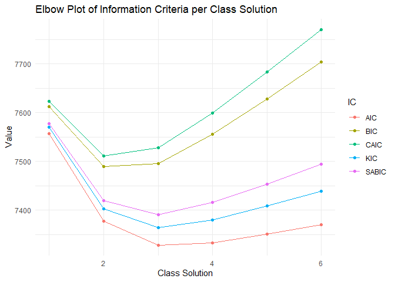
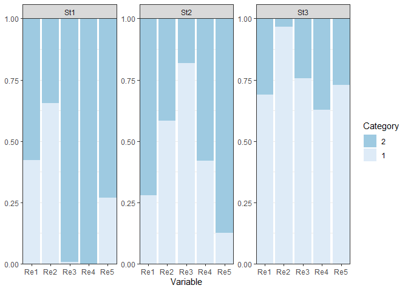

LCA with depmixS4 (categorical indicators)
================
Mauricio Garnier-Villarreal
1/19/23

- <a href="#latent-class-analysis-lca"
  id="toc-latent-class-analysis-lca">Latent Class Analysis (LCA)</a>
  - <a href="#person-centered-vs-variable-centered"
    id="toc-person-centered-vs-variable-centered">Person-centered vs
    Variable-centered</a>
  - <a href="#terminology" id="toc-terminology">Terminology</a>
- <a href="#depmixs4" id="toc-depmixs4"><code>depmixS4</code></a>
- <a href="#dichotomous-indicator-example"
  id="toc-dichotomous-indicator-example">Dichotomous indicator example</a>
  - <a href="#depmixs4-syntax"
    id="toc-depmixs4-syntax"><code>depmixS4</code> syntax</a>
  - <a href="#class-enumeration" id="toc-class-enumeration">Class
    enumeration</a>
    - <a href="#model-fit-indices" id="toc-model-fit-indices">Model Fit
      Indices</a>
    - <a href="#classification-diagnostics"
      id="toc-classification-diagnostics">Classification Diagnostics</a>
    - <a href="#interpreting-the-final-class-solution"
      id="toc-interpreting-the-final-class-solution">Interpreting the Final
      Class Solution</a>
- <a href="#references" id="toc-references">References</a>

# Latent Class Analysis (LCA)

Latent class analysis (LCA) is an umbrella term that refers to a number
of techniques for estimating unobserved group membership based on a
parametric model of one or more observed indicators of group membership.
The types of LCA have become quite popular across scientific fields,
most notably finite Gaussian mixture modeling and latent profile
analysis. Vermunt & Magidson (2004) defined LCA more generally as
virtually any statistical model where “some of the parameters \[…\]
differ across unobserved subgroups”.

In general terms, we can think of LCA as an **unknown group** analysis,
where you think that there is heterogeneity in the data due to
differences from these **unknown group**, and we want to first identify
these groups, and describe how they are different between each other.
This way defining the most homogeneous groups, and heterogeneous between
them.

## Person-centered vs Variable-centered

LCA is part of person-centered methods. Person-centered approaches
describe similarities and differences among individuals with respect to
how variables relate with each other and are predicated on the
assumption that the population is heterogeneous with respect with the
relationships between variables. Statistical techniques oriented toward
categorizing individuals by patterns of associations among variables,
such as LCA and cluster analysis, are person-centered. Variable-centered
approaches describe associations among variables and are predicated on
the assumption that the population is homogeneous with respect to the
relationships between variables. In other words, each association
between one variable and another in a variable-centered approach is
assumed to hold for all individuals within the population. Statistical
techniques oriented toward evaluating the relative importance of
predictor variables, such as multivariate regression and structural
equation modeling, are variable-centered (Masyn, 2013).

An interesting extension of this, is that any variable-centered approach
can be made into a person-centered by defining a model that differs in
function of their parameters. For example, we can have a multivariate
regression (variable-centered), and we can have a mixture multivariate
regression (person-centered). Where for the second we assume that the
regression parameters differ across **unknown groups**.

## Terminology

As you might have seen already, there are several terms related to these
types of models. Here we have a short list of terms to keep in mind when
talking about these models

- Mixture: general terms to denote models that identify **unknown
  groups** defined by some probabilistic model.
- LCA: latent class analysis, mixture model that defines a categorical
  latent variable that describes the heterogeneity between groups.
  Ususally applied only with categorical indicators
- LPA: latent profile analysis, same as LCA, but usually applied with
  continuous indicators
- Latent variable: an unobserved variable, that cannot be measured with
  direct items. This variable is the reason people answer in a certain
  the way the observed indicators. Corrected for (some) measuremet error
- Indicator: observed item that helps approximate the latent variable

You see that there is a distinction between LCA and LPA, but this is
historical to the time when software could only estimate models with all
indicators being categorical or continuous. Now we can estimate
categorical latent variables with categorical, continuous, or a mix of
these indicators. For this reason we will use the general term LCA for
categorical latent variable model, independent of the type of indicator.

# `depmixS4`

For this tutorial we will use the package `depmixS4`. Which has the
ability to estimate LCAs, with categorical and continuous indicators,
their longitudinal extension of Hidden Markov Models (HMM), and allows
to include covariates. Depending on the *R* package you use, you might
have some of these features, but so far this is the package that we have
found to have more features.

A disadvantage is that it lacks some nice summary functions, like to
generate plots, tables, etc. For this I have written some functions,
which build on the presentations functions from the package *tidySEM*.
In the future I will collaborate to have this functions included in the
package (will update the tutorials when this happens).

For now, you will need to run as source the `demixs4_helper_functions.R`
code. This will load a series of helper functions to create plots and
summarize the results. Then we will load the package `depmixS4` for LCA,
`rio` to import the data set.

``` r
source("demixs4_helper_functions.R")
library(depmixS4)
library(rio)
library(sjlabelled)
library(summarytools)
library(ggplot2)
```

If you want to load the helper functions directly from this GitHub
repository, you can do it with this URL

``` r
source("https://raw.githubusercontent.com/maugavilla/well_hello_stats/main/tutorials/demixs4_helper_functions.R")
```

# Dichotomous indicator example

Then we will import the **political.sav** example data set for analysis.

``` r
dat <- import("political.sav")
head(dat)
```

      SYS_RESP IDEO_LEV REP_POT PROT_APP CONV_PAR SEX EDUC AGE
    1        1        2       2        1        1   1    2   3
    2        1        2       2        1        1   2    1   3
    3        1        2       2        1        1   2    2   2
    4        1        2       2        1        2   1    1   2
    5        1        2       2        1        2   1    2   2
    6        1        2       2        1        2   2    2   2

``` r
dim(dat)
```

    [1] 1156    8

Looking into the data attributes, we see that the first 5 items are
related to their political views, and the following are participant
characteristics. With the function `get_label()` we see the label
attribute extracted from the SPSS data set. And with the function
`get_labels()` we see the values for each variable

``` r
get_label(dat)
```

                      SYS_RESP                   IDEO_LEV 
       "System Responsiveness"        "Ideological Level" 
                       REP_POT                   PROT_APP 
        "Repression Potential"         "Protest Approval" 
                      CONV_PAR                        SEX 
    "Convential Participation"                      "Sex" 
                          EDUC                        AGE 
        "Education (training)"         "Age (generation)" 

``` r
get_labels(dat)
```

    $SYS_RESP
    [1] "Low"  "High"

    $IDEO_LEV
    [1] "Nonideologues" "Ideologues"   

    $REP_POT
    [1] "High" "Low" 

    $PROT_APP
    [1] "Low"  "High"

    $CONV_PAR
    [1] "Low"  "High"

    $SEX
    [1] "Men"   "Women"

    $EDUC
    [1] "some_college"      "Less_than_college"

    $AGE
    [1] "16-34" "35-57" "58-91"

So, here we have a data set about political views from $N=1156$, and
with some individual characteristics that can be use as predictors.

``` r
freq(dat[,1:5])
```

    Frequencies  
    dat$SYS_RESP  
    Label: System Responsiveness  
    Type: Numeric  

                  Freq   % Valid   % Valid Cum.   % Total   % Total Cum.
    ----------- ------ --------- -------------- --------- --------------
              1    532     46.02          46.02     46.02          46.02
              2    624     53.98         100.00     53.98         100.00
           <NA>      0                               0.00         100.00
          Total   1156    100.00         100.00    100.00         100.00

    dat$IDEO_LEV  
    Label: Ideological Level  
    Type: Numeric  

                  Freq   % Valid   % Valid Cum.   % Total   % Total Cum.
    ----------- ------ --------- -------------- --------- --------------
              1    856     74.05          74.05     74.05          74.05
              2    300     25.95         100.00     25.95         100.00
           <NA>      0                               0.00         100.00
          Total   1156    100.00         100.00    100.00         100.00

    dat$REP_POT  
    Label: Repression Potential  
    Type: Numeric  

                  Freq   % Valid   % Valid Cum.   % Total   % Total Cum.
    ----------- ------ --------- -------------- --------- --------------
              1    743     64.27          64.27     64.27          64.27
              2    413     35.73         100.00     35.73         100.00
           <NA>      0                               0.00         100.00
          Total   1156    100.00         100.00    100.00         100.00

    dat$PROT_APP  
    Label: Protest Approval  
    Type: Numeric  

                  Freq   % Valid   % Valid Cum.   % Total   % Total Cum.
    ----------- ------ --------- -------------- --------- --------------
              1    485     41.96          41.96     41.96          41.96
              2    671     58.04         100.00     58.04         100.00
           <NA>      0                               0.00         100.00
          Total   1156    100.00         100.00    100.00         100.00

    dat$CONV_PAR  
    Label: Convential Participation  
    Type: Numeric  

                  Freq   % Valid   % Valid Cum.   % Total   % Total Cum.
    ----------- ------ --------- -------------- --------- --------------
              1    440     38.06          38.06     38.06          38.06
              2    716     61.94         100.00     61.94         100.00
           <NA>      0                               0.00         100.00
          Total   1156    100.00         100.00    100.00         100.00

Looking at the frequency distribution of the 5 indicators of political
views, we see that no variable present a major preference for one answer
over another.

## `depmixS4` syntax

When working with `depmixS4`, we will use the `mix()` function for LCA.
If we look at its helps page `?mix`. The main necessary arguments are
`response`, which needs a list of the regression model for each
indicator variable. The basic regression will an intercept only model,
for example `reponse~1`, for a categorical variable this will estimate
the probability of answering the highest value. Then we have the `data`
argument, where we provide or data frame. Next, we need to specify the
number of states to estimate in our LCA, in our first example
`nstates=2` es ask for a 2 class LCA. Last, we need to specify the
`family` argument, here we define how we want to treat each indicator,
with `multinomial("identity")` we specify that the indicators are
categorical and estimate the model with the identity link function.

``` r
lca1_mod <- mix(response = list(SYS_RESP~1, IDEO_LEV~1, REP_POT~1, PROT_APP~1, CONV_PAR~1),
                data=dat,
                nstates = 2,
                family = list(multinomial("identity"),multinomial("identity"),
                          multinomial("identity"),multinomial("identity"),
                          multinomial("identity"))
            )
summary(lca1_mod)
```

    Mixture probabilities model 
    pr1 pr2 
    0.5 0.5 

    Response parameters 
    Resp 1 : multinomial 
    Resp 2 : multinomial 
    Resp 3 : multinomial 
    Resp 4 : multinomial 
    Resp 5 : multinomial 
        Re1.1 Re1.2 Re2.1 Re2.2 Re3.1 Re3.2 Re4.1 Re4.2 Re5.1 Re5.2
    St1   0.5   0.5   0.5   0.5   0.5   0.5   0.5   0.5   0.5   0.5
    St2   0.5   0.5   0.5   0.5   0.5   0.5   0.5   0.5   0.5   0.5

With the `mix`function we build the `depmixS4` model, we can see the
model definition, and the starting values with the `summary()` function.
To estimate the model, we give the built model to the `fit()` function,
and with the `summary()` we can see the results. Within the `fit`
function we are adding the argument `emcontrol` to increase the maximum
number of iterations while estimating each model up to $maxit=50000$ in
this case.

``` r
lca1_fit <- fit(lca1_mod,
                emcontrol=em.control(maxit=50000,random.start = TRUE))
```

    converged at iteration 138 with logLik: -3666.872 

``` r
summary(lca1_fit)
```

    Mixture probabilities model 
          pr1       pr2 
    0.4012439 0.5987561 

    Response parameters 
    Resp 1 : multinomial 
    Resp 2 : multinomial 
    Resp 3 : multinomial 
    Resp 4 : multinomial 
    Resp 5 : multinomial 
            Re1.1     Re1.2     Re2.1      Re2.2     Re3.1     Re3.2     Re4.1
    St1 0.6771718 0.3228282 0.9784997 0.02150025 0.7343746 0.2656254 0.6094626
    St2 0.3148135 0.6851865 0.5809834 0.41901660 0.5813222 0.4186778 0.2922843
            Re4.2     Re5.1     Re5.2
    St1 0.3905374 0.6936967 0.3063033
    St2 0.7077157 0.1708229 0.8291771

Congratulation! you have run your first LCA. Here we see that 40% and
59% of the sample falls into each of the 2 classes. And for the first
indicator we have 67% chance of answering 1 in class 1 and 31% in class
2.

## Class enumeration

In exploratory LCA, a sequence of models is fitted to the data with each
additional model estimating one more class than the previous model.
These models are then compared and the best solution is selected as the
final class solution. In some cases, prior theory can inform the
researcher about the number of classes to expect.

From a sequence of models, the final class solution is chosen based on
both theoretical and statistical criteria. Theory should drive the
selection of indicator variables, inform the expectations and reflect on
the findings. In addition to this, there are several statistical
criteria to consider in model selection. These include but are not
limited to likelihood ratio tests, information criteria, and the Bayes
factor (Masyn, 2013).

Relative model fit can be examined using the likelihood ratio test. This
is only appropriate when the two models we wish to compare are nested.
The likelihood ratio test statistic is computed as the difference in
maximum log-likelihoods of the two models, with the test degrees of
freedom being the difference in the degrees of freedom of the two
compared models. The test statistic follows the $\chi^2$ distribution,
and we want it to be non-significant in order to give support to the
simpler model. The likelihood ratio test can only compare two nested
models at a time (Collins & Lanza, 2010).

Here we show how to use a loop in *R* to run the model for a sequence of
LCA’s, with increasing number of classes, from 1 to 6

``` r
set.seed(1987)

n_states <- 1:6
lca_res <- list()
for(i in 1:length(n_states)){
  
  print(i)
  
  mod <- mix(response = list(SYS_RESP~1, IDEO_LEV~1, REP_POT~1, PROT_APP~1, CONV_PAR~1),
                data=dat,
                nstates = n_states[i],
                family = list(multinomial("identity"),multinomial("identity"),
                          multinomial("identity"),multinomial("identity"),
                          multinomial("identity"))
            )
  lca_res[[i]] <- multistart(mod, nstart=10, initIters=50000)
}
```

    [1] 1
    converged at iteration 1 with logLik: -3767.254 
    converged at iteration 1 with logLik: -3767.254 
    converged at iteration 1 with logLik: -3767.254 
    converged at iteration 1 with logLik: -3767.254 
    converged at iteration 1 with logLik: -3767.254 
    converged at iteration 1 with logLik: -3767.254 
    converged at iteration 1 with logLik: -3767.254 
    converged at iteration 1 with logLik: -3767.254 
    converged at iteration 1 with logLik: -3767.254 
    converged at iteration 1 with logLik: -3767.254 
    converged at iteration 1 with logLik: -3767.254 
    [1] 2
    converged at iteration 137 with logLik: -3666.872 
    converged at iteration 146 with logLik: -3666.872 
    converged at iteration 143 with logLik: -3666.872 
    converged at iteration 137 with logLik: -3666.872 
    converged at iteration 142 with logLik: -3666.872 
    converged at iteration 138 with logLik: -3666.872 
    converged at iteration 143 with logLik: -3666.872 
    converged at iteration 139 with logLik: -3666.872 
    converged at iteration 145 with logLik: -3666.872 
    converged at iteration 140 with logLik: -3666.872 
    converged at iteration 1 with logLik: -3666.872 
    [1] 3
    converged at iteration 940 with logLik: -3631.122 
    converged at iteration 572 with logLik: -3631.45 
    converged at iteration 658 with logLik: -3631.449 
    converged at iteration 251 with logLik: -3631.446 
    converged at iteration 794 with logLik: -3631.122 
    converged at iteration 894 with logLik: -3631.122 
    converged at iteration 405 with logLik: -3631.449 
    converged at iteration 761 with logLik: -3631.122 
    converged at iteration 989 with logLik: -3631.122 
    converged at iteration 926 with logLik: -3631.122 
    converged at iteration 1 with logLik: -3631.122 
    [1] 4
    converged at iteration 1741 with logLik: -3622.448 
    converged at iteration 574 with logLik: -3622.805 
    converged at iteration 904 with logLik: -3622.81 
    converged at iteration 808 with logLik: -3622.812 
    converged at iteration 637 with logLik: -3622.802 
    converged at iteration 811 with logLik: -3622.81 
    converged at iteration 1380 with logLik: -3622.447 
    converged at iteration 629 with logLik: -3622.806 
    converged at iteration 709 with logLik: -3622.808 
    converged at iteration 1663 with logLik: -3622.448 
    converged at iteration 1 with logLik: -3622.447 
    [1] 5
    converged at iteration 1590 with logLik: -3620.348 
    converged at iteration 1231 with logLik: -3620.19 
    converged at iteration 2098 with logLik: -3620.343 
    converged at iteration 2208 with logLik: -3620.349 
    converged at iteration 943 with logLik: -3621.433 
    converged at iteration 792 with logLik: -3620.454 
    converged at iteration 926 with logLik: -3620.177 
    converged at iteration 1489 with logLik: -3620.172 
    converged at iteration 777 with logLik: -3620.89 
    converged at iteration 1716 with logLik: -3620.345 
    converged at iteration 1 with logLik: -3620.172 
    [1] 6
    converged at iteration 1135 with logLik: -3619.731 
    converged at iteration 2137 with logLik: -3619.26 
    converged at iteration 3134 with logLik: -3619.261 
    converged at iteration 1371 with logLik: -3620.122 
    converged at iteration 1016 with logLik: -3619.252 
    converged at iteration 2558 with logLik: -3619.92 
    converged at iteration 1637 with logLik: -3619.92 
    converged at iteration 1505 with logLik: -3619.25 
    converged at iteration 1202 with logLik: -3619.999 
    converged at iteration 1527 with logLik: -3619.065 
    converged at iteration 1 with logLik: -3619.065 

See, that we first create a vector with the number of states we want to
estimate, then we create an empty `list` object where we will save all
our LCA’s. In the loop you will see that the model defined with the
`mix`function is the same, and the only difference is that we loop over
the number of states. Then we use the `multistart` function to estimate
each model and save it into the empty list object. With the `multistart`
function, we can estimate the model multiple times, with different
starting values each time. This is useful to be more certain that the
results are not a local maxima but correct convergence. With the
`nstart` argument we specify how many starting values we want to use,
and with the `initIters` argument we specify how many iterations use for
each run.

You should see the message for each model that it converged, if it
doesnt show up, you can check each model by looking into the list of
models, like looking at the 5th model

``` r
lca_res[[5]]
```

    Convergence info: Log likelihood converged to within tol. (relative change) 
    'log Lik.' -3620.172 (df=29)
    AIC:  7298.344 
    BIC:  7444.873 

### Model Fit Indices

Fit indices typically used for determining the optimal number of classes
include the Akaike Information Criterion (AIC) and the Bayesian
Information Criterion (BIC). Both information criteria are based on the
-2\*log-likelihood (which is lower for better fitting models), and add a
penalty for the number of parameters (thus incentivizing simpler
models). This helps balance model fit and model complexity. The lower
the value of an information criterion, the better the overall fit of the
model.

The general objective of the Information Criteria (IC) is to evaluate
the model’s out-of-sample predictive accuracy, so adjusting for over
fitting. Fit measures like $R^2$ evaluate the in-sample predictive
accuracy, meaning that they evaluate the models ability to predict the
observed outcomes based on the same data that was use to build up the
model. These metrics are positively bias, meaning that will present
better model fit than it has in reality. While IC corrects for this
positive bias by evaluating the models accuracy approximating the
out-of-sample predictive accuracy, meaning that it is the ability to
predict the outcome for observations that are not part of the training
model. Ideally we would estimate the model a lot of time with less
observations and predict their scores, but IC’s approximate this by
their different penalty metrics. For example $R^2$ will increase even if
an added predictors are unnecessary, while IC’s will show worst fit when
a predictor (complexity) is unnecessary (McElreath, 2020)

The BIC applies a stronger penalty for model complexity that scales
logarithmically with the sample size. The literature suggests the BIC
may be the most appropriate information criterion to use for model
comparison (Nylund-Gibson & Choi, 2018; Masyn, 2013)

Information criteria may occasionally contradict each other, so it is
important to identify a suitable strategy to reconcile them. One option
is to select a specific fit index before analyzing the data. Another
option is to always prefer the most parsimonious model that has best fit
according to any of the available fit indices. Yet another option is to
incorporate information from multiple fit indices using the analytic
hierarchy process. Finally, one might make an elbow plot and compare
multiple information criteria (Nylund-Gibson & Choi, 2018).

A disadvantage of the IC’s is that we do not have standard errors for
them, so we only have the absolute values without a measure of their
variability. So, the difference between models IC can be very small.
Still indicating that the model with the lower value is “better”, but if
this difference is very small can considered them “functionally equal”,
and you should take into consideration the interpretability of the
model.

LCA studies commonly report -2\*log likelihood of the final class
solution. This is a basic fit measure used to compute most information
criteria. However, since log likelihood is not penalized for model
complexity, it will continuously fall with the addition of more classes.

We have created a helper function to estimate a series of fit indices
for an LCA from `depmixS4`, that can be use to get the fit indices from
a model from the list

``` r
get_fits(lca_res[[2]])
```

           LogLik    parameters             n           AIC           BIC 
    -3666.8723683    22.0000000  1156.0000000  7377.7447366  7488.9045997 
             CAIC           KIC         SABIC           ICL       Entropy 
     7510.9045997  7402.7447366  7419.0254448 -7934.8240340     0.4719464 
         prob_min      prob_max         n_min         n_max 
        0.7728793     0.8806222     0.3814879     0.6185121 

But we can apply it to all the objects in the list and return a
`data.frame`, we are creating a data with the number of states and the
fit indices, such as log-likelihood, AIC, BIC, SABIC.

``` r
fit_ind <- data.frame(n_states=n_states,
                      t(sapply(lca_res, get_fits)))
fit_ind
```

      n_states    LogLik parameters    n      AIC      BIC     CAIC      KIC
    1        1 -3767.254         11 1156 7556.508 7612.088 7623.088 7570.508
    2        2 -3666.872         22 1156 7377.745 7488.905 7510.905 7402.745
    3        3 -3631.122         33 1156 7328.244 7494.984 7527.984 7364.244
    4        4 -3622.447         44 1156 7332.893 7555.213 7599.213 7379.893
    5        5 -3620.172         55 1156 7350.344 7628.244 7683.244 7408.344
    6        6 -3619.065         66 1156 7370.130 7703.609 7769.609 7439.130
         SABIC       ICL   Entropy  prob_min  prob_max      n_min     n_max
    1 7577.149 -7612.088 1.0000000 1.0000000 1.0000000 1.00000000 1.0000000
    2 7419.025 -7934.824 0.4719464 0.7728793 0.8806222 0.38148789 0.6185121
    3 7390.165 -8033.222 0.5829747 0.7553726 0.8956258 0.23010381 0.3875433
    4 7415.455 -8091.183 0.6337204 0.6472895 0.9251844 0.13494810 0.4403114
    5 7453.546 -8372.629 0.5536229 0.5043042 0.9103525 0.14446367 0.2448097
    6 7493.972 -8409.587 0.6178753 0.5896776 0.8746908 0.09429066 0.2785467

Looking at AIC and BIC, we see that the model improves (smaller) as the
number of classes increases between 1 and 3, and from 4 and above the
fit worsen. Then we create the elbow plot. We first structure the fit
indices into long format with `pivot_longer` function, and then we use
`ggplot2` to create the elbow plot.

``` r
elbow_plot <- fit_ind[ , c("n_states","AIC","BIC","CAIC","KIC","SABIC")] # extract ICs
elbow_plot <- pivot_longer(elbow_plot, cols = c("AIC","BIC","CAIC","KIC","SABIC"), names_to = "IC", values_to = "Value") # to long format

ggplot(elbow_plot, aes(x = n_states, y = Value, group = IC))+
  geom_point(aes(color = IC))+
  geom_line(aes(color = IC))+
  labs(title="Elbow Plot of Information Criteria per Class Solution", 
       x = "Class Solution", y = " Value")+
  theme_minimal()
```



Here we see that a meaningful decrease from 1 to 2 for all indices, them
from 2 to 3 we see a decrease in 3 indices and basically equal for BIC.
For this we would choose the 3 class solution in this case.

### Classification Diagnostics

Best models will divide the sample into subgroups which are internally
homogeneous and externally distinct. Classification diagnostics give us
a way to assess the degree to which this is the case. They are separate
from model fit indices as a model can fit the data well but show poor
latent class separation (Masyn, 2013). Classification diagnostics should
not be used for model selection, but they can be used to disqualify
certain solutions because they are uninterpretable. Interpretability
should always be a consideration when considering different class
solutions (Nylund-Gibson & Choi, 2018)

Four important classification diagnostics are shown here: (1) the
*minimum* and *maximum* percentage of the sample assigned to a
particular *class*, (2) the *range of the posterior class probabilities*
by most likely class membership, (3) *entropy*, and (4) *AvePP* average
posterior class probability. All three are based on posterior class
probabilities.

The posterior class probability is a measure of classification
uncertainty which can be computed for each individual, or averaged for
each latent class. When the posterior class probability is computed for
each individual in the dataset, it represents each person’s probability
of belonging to each latent class. For each person, the highest
posterior class probability is then determined and the individual is
assigned to the corresponding class. We want each individual’s posterior
class probabilities to be high for one and low for the remaining latent
classes. This is considered a high classification accuracy and means
that the classes are distinct. To obtain posterior class probabilities,
run the custom function`class_prob_dm()`. This function produces output
comprised of several elements:

``` r
cl_diag <- class_prob_dm(lca_res[[3]])
```

`$sum.posterior` is a summary table of the posterior class probabilities
indicating what proportion of the data contributes to each class.

``` r
cl_diag$sum.posterior
```

      class    count proportion
    1    S1 216.6236  0.1873907
    2    S2 504.4089  0.4363399
    3    S3 434.9674  0.3762694

`$sum.mostlikely` is a summary table of the most likely class membership
based on the highest posterior class probability. From this table, we
compute the minimum and maximum percentage of the sample assigned to a
particular class, , i.e. **n_min** (the smallest class proportion based
on the posterior class probabilities) and **n_max** (the largest class
proportion based on the posterior class probabilities). We are
especially interested in **n_min** as if it is very small and comprised
of few observations, the model for that group might not be locally
identified. It may be impossible to calculate descriptive statistics for
such a small class. Estimating LCA parameters on small subsamples might
lead to bias in the results. Therefore, we advise caution when dealing
with small classes.

``` r
cl_diag$sum.mostlikely
```

      class count proportion
    1    S1   266  0.2301038
    2    S2   442  0.3823529
    3    S3   448  0.3875433

`$mostlikely.class` is a table with rows representing the class the
person was assigned to, and the columns indicating the average posterior
probability. The diagonal represents the probability that observations
in each class will be correctly classified. If any of the values on the
diagonal of this table is low, we might consider not to interpret that
solution. We use the diagonal to compute the range of the posterior
class probabilities by most likely class membership which consists of
the lowest class posterior probability (**prob_min**), and the highest
posterior probability (**prob_max**). Both **prob_min** and **prob_max**
can be used to disqualify certain class solutions, and are a convenient
way to summarize class separation in LCA. We want both **prob_min** and
**prob_max** to be high as that means that for all classes the people
who were assigned to that class have a high probability of being there.
**prob_min** is especially important as it can diagnose if there is a
class with low posterior probabilities which could make one reconsider
that class solution.

``` r
cl_diag$mostlikely.class
```

               [,1]        [,2]       [,3]
    [1,] 0.89562584 0.005255304 0.09911885
    [2,] 0.10400296 0.755372585 0.14062446
    [3,] 0.04490748 0.137569462 0.81752306

`$avg.mostlikely` contains the average posterior probabilities for each
class, for the subset of observations with most likely class of 1:k,
where k is the number of classes.

``` r
cl_diag$avg.mostlikely
```

                  S1        S2         S3
    [1,] 0.729344973 0.1972216 0.07343343
    [2,] 0.002575512 0.8620439 0.13538063
    [3,] 0.047925456 0.1583337 0.79374088

`AvePP` is presented as diagonal of `$avg.mostlikely`, the average
posterior class probability (mean) for the subjects classified in the
respective class.

``` r
diag(cl_diag$avg.mostlikely)
```

    [1] 0.7293450 0.8620439 0.7937409

`$individual` is the individual posterior probability matrix, with
dimensions n (number of cases in the data) x k (number of classes).
Additionally it includes the `predicted` class in function of the
highest predicted probability. Individual class probabilities and/or
predicted class are often useful for researchers who wish to do follow
up analyses.

``` r
head(cl_diag$individual)
```

                S1        S2         S3 predicted
    1 0.0004517418 0.3316152 0.66793306         3
    2 0.0004517418 0.3316152 0.66793306         3
    3 0.0004517418 0.3316152 0.66793306         3
    4 0.0004844378 0.9014686 0.09804693         2
    5 0.0004844378 0.9014686 0.09804693         2
    6 0.0004844378 0.9014686 0.09804693         2

Entropy is a summary measure of posterior class probabilities across
classes and individuals. It ranges from 0 (model classification no
better than random chance) to 1 (perfect classification). As a rule of
thumb, values above .80 are deemed acceptable and those approaching 1
are considered ideal. An appropriate use of entropy is that it can
disqualify certain solutions if class separability is too low. Entropy
was not built for nor should it be used for model selection during class
enumeration \[@masyn_latent_2013\].

**n_min**, **n_max**, **prob_min**, **prob_max**, and **entropy** and
can be obtained using `get_fits()`.

``` r
get_fits(lca_res[[3]])
```

           LogLik    parameters             n           AIC           BIC 
    -3631.1221161    33.0000000  1156.0000000  7328.2442323  7494.9840269 
             CAIC           KIC         SABIC           ICL       Entropy 
     7527.9840269  7364.2442323  7390.1652946 -8033.2215211     0.5829747 
         prob_min      prob_max         n_min         n_max 
        0.7553726     0.8956258     0.2301038     0.3875433 

### Interpreting the Final Class Solution

We can see the default from the `summary` function

``` r
summary(lca_res[[3]])
```

    Mixture probabilities model 
          pr1       pr2       pr3 
    0.1873907 0.4363399 0.3762694 

    Response parameters 
    Resp 1 : multinomial 
    Resp 2 : multinomial 
    Resp 3 : multinomial 
    Resp 4 : multinomial 
    Resp 5 : multinomial 
            Re1.1     Re1.2     Re2.1      Re2.2      Re3.1     Re3.2        Re4.1
    St1 0.4228199 0.5771801 0.6560660 0.34393397 0.00643779 0.9935622 9.179686e-05
    St2 0.2785979 0.7214021 0.5824009 0.41759915 0.81878168 0.1812183 4.206142e-01
    St3 0.6894308 0.3105692 0.9658479 0.03415205 0.75546953 0.2445305 6.272161e-01
            Re4.2     Re5.1     Re5.2
    St1 0.9999082 0.2698010 0.7301990
    St2 0.5793858 0.1272157 0.8727843
    St3 0.3727839 0.7296776 0.2703224

Showing the mixture probabilities, and the response probabilities for
each class and indicator. We can also use our `sum_list()` function,
which requires the choosen model, and data set.

``` r
sum_list(lca_res[[3]], dat[,1:5])
```

    $Mix_probs
    Model of type multinomial (identity), formula: ~1
    <environment: 0x0000000043a3af38>
    Coefficients: 
          pr1       pr2       pr3 
    0.1873907 0.4363399 0.3762694 

    $Pobrabilities
    $Pobrabilities$SYS_RESP
            Re1.1     Re1.2
    St1 0.4228199 0.5771801
    St2 0.2785979 0.7214021
    St3 0.6894308 0.3105692

    $Pobrabilities$IDEO_LEV
            Re2.1      Re2.2
    St1 0.6560660 0.34393397
    St2 0.5824009 0.41759915
    St3 0.9658479 0.03415205

    $Pobrabilities$REP_POT
             Re3.1     Re3.2
    St1 0.00643779 0.9935622
    St2 0.81878168 0.1812183
    St3 0.75546953 0.2445305

    $Pobrabilities$PROT_APP
               Re4.1     Re4.2
    St1 9.179686e-05 0.9999082
    St2 4.206142e-01 0.5793858
    St3 6.272161e-01 0.3727839

    $Pobrabilities$CONV_PAR
            Re5.1     Re5.2
    St1 0.2698010 0.7301990
    St2 0.1272157 0.8727843
    St3 0.7296776 0.2703224

Here we have the same information, but with different presentation, that
we consider more friendly to read. We see that each class has between
18% and 44% of the sample. We also have the response probabilities for
each indicator option for each class.

We can also plot these response probabilities, with our custom functions
we can create a data frame with the response probabilities, that can be
pass to the `plot_prob()` function from `tidySEM`.

``` r
df <- df_probs(lca_res[[3]]) 

plot_prob(df,
          bars="Variable",
          facet = "class")
```



With this information we would *name* each class and describe the
theoretical interpretation of what they mean and what characterize each
class.

# References

Vermunt, J. K., & Magidson, J. (2004). Latent class analysis. In M.
Lewis-Beck, A. Bryman, & T. F. Liao (Eds.), The Sage encyclopedia of
social sciences research methods (pp. 549-553). Sage.

Masyn, K. E. (2013). Latent Class Analysis and Finite Mixture Modeling.
In P. E. Nathan & T. D. Little (Eds.), The Oxford Handbook of
Quantitative Methods: Vol. Volume 2: Statistical Analysis (p. 63).
Oxford University Press.

Collins, L. M., & Lanza, S. T. (2010). Latent Class and Latent
Transition Analysis: With Applications in the Social, Behavioral, and
Health Science. John Wiley & Sons, Inc.

McElreath, R. (2020). Statistical rethinking: A Bayesian course with
examples in R and Stan (2nd ed.). Taylor and Francis, CRC Press.

Nylund-Gibson, K., & Choi, A. Y. (2018). Ten frequently asked questions
about latent class analysis. Translational Issues in Psychological
Science, 4(4), 440–461. https://doi.org/10.1037/tps0000176

Visser, I., & Speekenbrink, M. (2022). *Mixture and Hidden Markov Models
with R*. Springer International Publishing.
<https://doi.org/10.1007/978-3-031-01440-6>
