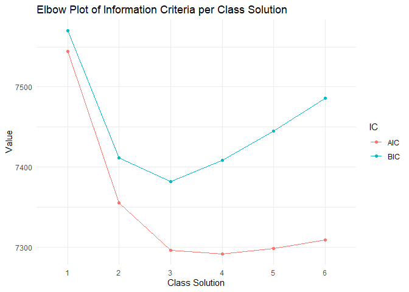
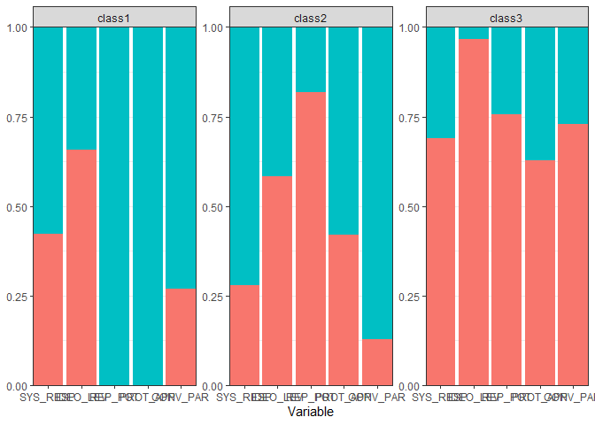

LCA with tidySEM (categorical indicators)
================
Mauricio Garnier-Villarreal
08 December, 2022

- <a href="#latent-class-analysis-lca"
  id="toc-latent-class-analysis-lca">Latent Class Analysis (LCA)</a>
  - <a href="#person-centered-vs-variable-centered"
    id="toc-person-centered-vs-variable-centered">Person-centered vs
    Variable-centered</a>
  - <a href="#terminology" id="toc-terminology">Terminology</a>
- <a href="#tidysem" id="toc-tidysem"><code>tidySEM</code></a>
- <a href="#dichotomous-indicator-example"
  id="toc-dichotomous-indicator-example">Dichotomous indicator example</a>
  - <a href="#tidysem-1" id="toc-tidysem-1"><code>tidySEM</code></a>
  - <a href="#class-enumeration" id="toc-class-enumeration">Class
    enumeration</a>
    - <a href="#model-fit-indices" id="toc-model-fit-indices">Model Fit
      Indices</a>
    - <a href="#classification-diagnostics"
      id="toc-classification-diagnostics">Classification Diagnostics</a>
    - <a href="#interpreting-the-final-class-solution"
      id="toc-interpreting-the-final-class-solution">Interpreting the Final
      Class Solution</a>
- <a href="#references" id="toc-references">References</a>

# Latent Class Analysis (LCA)

Latent class analysis (LCA) is an umbrella term that refers to a number
of techniques for estimating unobserved group membership based on a
parametric model of one or more observed indicators of group membership.
The types of LCA have become quite popular across scientific fields,
most notably finite Gaussian mixture modeling and latent profile
analysis. Vermunt & Magidson (2004) defined LCA more generally as
virtually any statistical model where “some of the parameters \[…\]
differ across unobserved subgroups”.

In general terms, we can think of LCA as an **unknown group** analysis,
where you think that there is heterogeneity in the data due to
differences from these **unknown group**, and we want to first identify
these groups, and describe how they are different between each other.
This way defining the most homogeneous groups, and heterogeneous between
them.

## Person-centered vs Variable-centered

LCA is part of person-centered methods. Person-centered approaches
describe similarities and differences among individuals with respect to
how variables relate with each other and are predicated on the
assumption that the population is heterogeneous with respect with the
relationships between variables. Statistical techniques oriented toward
categorizing individuals by patterns of associations among variables,
such as LCA and cluster analysis, are person-centered. Variable-centered
approaches describe associations among variables and are predicated on
the assumption that the population is homogeneous with respect to the
relationships between variables. In other words, each association
between one variable and another in a variable-centered approach is
assumed to hold for all individuals within the population. Statistical
techniques oriented toward evaluating the relative importance of
predictor variables, such as multivariate regression and structural
equation modeling, are variable-centered (Masyn, 2013).

An interesting extension of this, is that any variable-centered approach
can be made into a person-centered by defining a model that differs in
function of their parameters. For example, we can have a multivariate
regression (variable-centered), and we can have a mixture multivariate
regression (person-centered). Where for the second we assume that the
regression parameters differ across **unknown groups**.

## Terminology

As you might have seen already, there are several terms related to these
types of models. Here we have a short list of terms to keep in mind when
talking about these models

- Mixture: general terms to denote models that identify **unknown
  groups** defined by some probabilistic model.
- LCA: latent class analysis, mixture model that defines a categorical
  latent variable that describes the heterogeneity between groups.
  Ususally applied only with categorical indicators
- LPA: latent profile analysis, same as LCA, but usually applied with
  continuous indicators
- Latent variable: an unobserved variable, that cannot be measured with
  direct items. This variable is the reason people answer in a certain
  the way the observed indicators. Corrected for (some) measuremet error
- Indicator: observed item that helps approximate the latent variable

You see that there is a distinction between LCA and LPA, but this is
historical to the time when software could only estimate models with all
indicators being categorical or continuous. Now we can estimate
categorical latent variables with categorical, continuous, or a mix of
these indicators. For this reason we will use the general term LCA for
categorical latent variable model, independent of the type of indicator.

# `tidySEM`

For this tutorial we will use the package `tidySEM`. Which has the
ability to estimate LCAs, with categorical and continuous indicators.
This uses `OpenMx` as the back engine that estimates the models. But it
provides user friendly functions to estimate, and summarize the models.

Here we first load the packages that we will use, to work with the data,
estimate models, and summarize results.

``` r
library(tidySEM)
library(rio)
library(sjlabelled)
library(summarytools)
library(ggplot2)
library(tidyr)
```

# Dichotomous indicator example

Then we will import the **political.sav** example data set for analysis.

``` r
dat <- import("political.sav")
head(dat)
```

      SYS_RESP IDEO_LEV REP_POT PROT_APP CONV_PAR SEX EDUC AGE
    1        1        2       2        1        1   1    2   3
    2        1        2       2        1        1   2    1   3
    3        1        2       2        1        1   2    2   2
    4        1        2       2        1        2   1    1   2
    5        1        2       2        1        2   1    2   2
    6        1        2       2        1        2   2    2   2

``` r
dim(dat)
```

    [1] 1156    8

Looking into the data attributes, we see that the first 5 items are
related to their political views, and the following are participant
characteristics. with the function `get_label()` we see the label
attribute extracted from the SPSS data set. And with the function
`get_labels()` we see the values for each variable

``` r
get_label(dat)
```

                      SYS_RESP                   IDEO_LEV 
       "System Responsiveness"        "Ideological Level" 
                       REP_POT                   PROT_APP 
        "Repression Potential"         "Protest Approval" 
                      CONV_PAR                        SEX 
    "Convential Participation"                      "Sex" 
                          EDUC                        AGE 
        "Education (training)"         "Age (generation)" 

``` r
get_labels(dat)
```

    $SYS_RESP
    [1] "Low"  "High"

    $IDEO_LEV
    [1] "Nonideologues" "Ideologues"   

    $REP_POT
    [1] "High" "Low" 

    $PROT_APP
    [1] "Low"  "High"

    $CONV_PAR
    [1] "Low"  "High"

    $SEX
    [1] "Men"   "Women"

    $EDUC
    [1] "some_college"      "Less_than_college"

    $AGE
    [1] "16-34" "35-57" "58-91"

So, here we have a data set about political views from $N=1156$, and
with some individual characteristics that can be use as predictors.

``` r
freq(dat[,1:5])
```

    Frequencies  
    dat$SYS_RESP  
    Label: System Responsiveness  
    Type: Numeric  

                  Freq   % Valid   % Valid Cum.   % Total   % Total Cum.
    ----------- ------ --------- -------------- --------- --------------
              1    532     46.02          46.02     46.02          46.02
              2    624     53.98         100.00     53.98         100.00
           <NA>      0                               0.00         100.00
          Total   1156    100.00         100.00    100.00         100.00

    dat$IDEO_LEV  
    Label: Ideological Level  
    Type: Numeric  

                  Freq   % Valid   % Valid Cum.   % Total   % Total Cum.
    ----------- ------ --------- -------------- --------- --------------
              1    856     74.05          74.05     74.05          74.05
              2    300     25.95         100.00     25.95         100.00
           <NA>      0                               0.00         100.00
          Total   1156    100.00         100.00    100.00         100.00

    dat$REP_POT  
    Label: Repression Potential  
    Type: Numeric  

                  Freq   % Valid   % Valid Cum.   % Total   % Total Cum.
    ----------- ------ --------- -------------- --------- --------------
              1    743     64.27          64.27     64.27          64.27
              2    413     35.73         100.00     35.73         100.00
           <NA>      0                               0.00         100.00
          Total   1156    100.00         100.00    100.00         100.00

    dat$PROT_APP  
    Label: Protest Approval  
    Type: Numeric  

                  Freq   % Valid   % Valid Cum.   % Total   % Total Cum.
    ----------- ------ --------- -------------- --------- --------------
              1    485     41.96          41.96     41.96          41.96
              2    671     58.04         100.00     58.04         100.00
           <NA>      0                               0.00         100.00
          Total   1156    100.00         100.00    100.00         100.00

    dat$CONV_PAR  
    Label: Convential Participation  
    Type: Numeric  

                  Freq   % Valid   % Valid Cum.   % Total   % Total Cum.
    ----------- ------ --------- -------------- --------- --------------
              1    440     38.06          38.06     38.06          38.06
              2    716     61.94         100.00     61.94         100.00
           <NA>      0                               0.00         100.00
          Total   1156    100.00         100.00    100.00         100.00

Looking at the frequency distribution of the 5 indicators of political
views, we see that no variable present a major preference for one answer
over another.

## `tidySEM`

Within `tidySEM` we have functions that will run LCA for a range of $K$
number of classes. But first we need to prepare the data for it, for LCA
we need to specify that each variable is of the `ordered` type

``` r
dat2 <- data.frame(lapply(dat[,1:5], ordered))
descriptives(dat2)
```

          name            type    n missing unique mean median mode mode_value sd
    1 SYS_RESP ordered, factor 1156       0      3   NA     NA  624          2 NA
    2 IDEO_LEV ordered, factor 1156       0      3   NA     NA  856          1 NA
    3  REP_POT ordered, factor 1156       0      3   NA     NA  743          1 NA
    4 PROT_APP ordered, factor 1156       0      3   NA     NA  671          2 NA
    5 CONV_PAR ordered, factor 1156       0      3   NA     NA  716          2 NA
              v min max range skew skew_2se kurt kurt_2se
    1 0.4968331  NA  NA    NA   NA       NA   NA       NA
    2 0.3843345  NA  NA    NA   NA       NA   NA       NA
    3 0.4592543  NA  NA    NA   NA       NA   NA       NA
    4 0.4870557  NA  NA    NA   NA       NA   NA       NA
    5 0.4714982  NA  NA    NA   NA       NA   NA       NA

Once we have the data in the desired format, we can run the LCA with the
`mx_lca()` function, for this function we need to provide the data set
(with only categorical indicators), and the number of $K$ classes to
estimate, you can also estimate a range of classes like `1:6` to
estimate models from 1 to 6 classes. We are also setting a seed so we
can better replicate the results.

``` r
set.seed(1987) # setting seed 
res1 <- mx_lca(data = dat2, classes = 2)
```

Congratulation! you have run your first LCA. We will look into how to
interpret the results in the next sections.

## Class enumeration

In exploratory LCA, a sequence of models is fitted to the data with each
additional model estimating one more class than the previous model.
These models are then compared and the best solution is selected as the
final class solution. In some cases, prior theory can inform the
researcher about the number of classes to expect.

From a sequence of models, the final class solution is chosen based on
both theoretical and statistical criteria. Theory should drive the
selection of indicator variables, inform the expectations and reflect on
the findings. In addition to this, there are several statistical
criteria to consider in model selection. These include but are not
limited to likelihood ratio tests, information criteria, and the Bayes
factor (Masyn, 2013).

Relative model fit can be examined using the likelihood ratio test. This
is only appropriate when the two models we wish to compare are nested.
The likelihood ratio test statistic is computed as the difference in
maximum log-likelihoods of the two models, with the test degrees of
freedom being the difference in the degrees of freedom of the two
compared models. The test statistic follows the $\chi^2$ distribution,
and we want it to be non-significant in order to give support to the
simpler model. The likelihood ratio test can only compare two nested
models at a time (Collins & Lanza, 2010).

We can provide a range to the `classes` argument to estimate LCAs from 1
to 6 classes

``` r
res <- mx_lca(data = dat2, classes = 1:6)
```

``` r
is(res)
```

    [1] "mixture_list"

See that we get a convergence message for each model, also it specifies
how many errors where there from the 11 times the model was run. Each
model is run multiple times with different starting values, this helps
to prevent the model to converged on a **local maxima** solution,
instead of a **global maxima** solution.

This provides a list of `Mx` models, so you can access the 5th model
like a list in *R*

``` r
res[[5]]
```

    MxModel 'mix5' 
    type : default 
    $matrices : 'weights' 
    $algebras : NULL 
    $penalties : NULL 
    $constraints : NULL 
    $intervals : NULL 
    $latentVars : none
    $manifestVars : none
    $data : 1156 x 5 
    $data means : NA
    $data type: 'raw' 
    $submodels : 'class1', 'class2', 'class3', 'class4', and 'class5' 
    $expectation : MxExpectationMixture 
    $fitfunction : MxFitFunctionML 
    $compute : MxComputeSequence 
    $independent : FALSE 
    $options :  
    $output : TRUE 

### Model Fit Indices

Fit indices typically used for determining the optimal number of classes
include the Akaike Information Criterion (AIC) and the Bayesian
Information Criterion (BIC). Both information criteria are based on the
-2\*log-likelihood (which is lower for better fitting models), and add a
penalty for the number of parameters (thus incentivizing simpler
models). This helps balance model fit and model complexity. The lower
the value of an information criterion, the better the overall fit of the
model.

The general objective of the Information Criteria (IC) is to evaluate
the model’s out-of-sample predictive accuracy, so adjusting for over
fitting. Fit measures like $R^2$ evaluate the in-sample predictive
accuracy, meaning that they evaluate the models ability to predict the
observed outcomes based on the same data that was use to build up the
model. These metrics are positively bias, meaning that will present
better model fit than it has in reality. While IC corrects for this
positive bias by evaluating the models accuracy approximating the
out-of-sample predictive accuracy, meaning that it is the ability to
predict the outcome for observations that are not part of the training
model. Ideally we would estimate the model a lot of time with less
observations and predict their scores, but IC’s approximate this by
their different penalty metrics. For example $R^2$ will increase even if
an added predictors are unnecessary, while IC’s will show worst fit when
a predictor (complexity) is unnecessary (McElreath, 2020)

The BIC applies a stronger penalty for model complexity that scales
logarithmically with the sample size. The literature suggests the BIC
may be the most appropriate information criterion to use for model
comparison (Nylund-Gibson & Choi, 2018; Masyn, 2013)

Information criteria may occasionally contradict each other, so it is
important to identify a suitable strategy to reconcile them. One option
is to select a specific fit index before analyzing the data. Another
option is to always prefer the most parsimonious model that has best fit
according to any of the available fit indices. Yet another option is to
incorporate information from multiple fit indices using the analytic
hierarchy process. Finally, one might make an elbow plot and compare
multiple information criteria (Nylund-Gibson & Choi, 2018).

A disadvantage of the IC’s is that we do not have standard errors for
them, so we only have the absolute values without a measure of their
variability. So, the difference between models IC can be very small.
Still indicating that the model with the lower value is “better”, but if
this difference is very small can considered them “functionally equal”,
and you should take into consideration the interpretability of the
model.

LCA studies commonly report -2\*log likelihood of the final class
solution. This is a basic fit measure used to compute most information
criteria. However, since log likelihood is not penalized for model
complexity, it will continuously fall with the addition of more classes.

We can use the `table_fit()` function to calculate a variety of fit
indices, for example for the 2 class model

``` r
table_fit(res[[2]])
```

      Minus2LogLikelihood    n Parameters observedStatistics    df TLI RMSEA
    1            7333.744 1156         11              11570 11559   1     0
      RMSEASquared RMSEANull modelName      AIC      BIC   saBIC   Entropy
    1            0      0.05      mix2 7355.744 7411.324 7337.62 0.4729969
       prob_min  prob_max     n_min     n_max        LL
    1 0.7744613 0.8799195 0.3814879 0.6185121 -3666.872

But we can use the same function to calculate these indices for all
models in the list we are creating a data with the number of states and
the fit indices, such as log-likelihood, AIC, BIC.

``` r
fit_ind <- table_fit(res)
fit_ind
```

      Name Minus2LogLikelihood    n Parameters observedStatistics    df
    1    1            7534.508 1156          5               5785  5780
    2    2            7333.744 1156         11              11570 11559
    3    3            7262.230 1156         17              17355 17338
    4    4            7246.168 1156         23              23140 23117
    5    5            7240.577 1156         29              28925 28896
    6    6            7239.131 1156         35              34710 34675
      saturatedDoF independenceDoF saturatedParameters independenceParameters
    1         5765            5775                  20                     10
    2           NA              NA                  NA                     NA
    3           NA              NA                  NA                     NA
    4           NA              NA                  NA                     NA
    5           NA              NA                  NA                     NA
    6           NA              NA                  NA                     NA
      ChiDoF satDoF indDoF RMSEANull modelName      AIC      BIC    saBIC   Entropy
    1     15   5765   5775      0.05      mix1 7544.508 7569.772 7538.385 1.0000000
    2     NA     NA     NA      0.05      mix2 7355.744 7411.324 7337.620 0.4729969
    3     NA     NA     NA      0.05      mix3 7296.230 7382.127 7266.107 0.5892915
    4     NA     NA     NA      0.05      mix4 7292.168 7408.380 7250.044 0.5841009
    5     NA     NA     NA      0.05      mix5 7298.577 7445.106 7244.453 0.6421219
    6     NA     NA     NA      0.05      mix6 7309.131 7485.977 7243.008 0.7129370
       prob_min  prob_max      n_min     n_max        LL TLI RMSEA RMSEASquared
    1 1.0000000 1.0000000 1.00000000 1.0000000 -3767.254  NA    NA           NA
    2 0.7744613 0.8799195 0.38148789 0.6185121 -3666.872   1     0            0
    3 0.7549166 0.9014420 0.23010381 0.3875433 -3631.115   1     0            0
    4 0.6009185 0.9107875 0.16089965 0.4160900 -3623.084   1     0            0
    5 0.5974707 0.9014084 0.09688581 0.4247405 -3620.288   1     0            0
    6 0.4994726 1.0000000 0.02076125 0.2448097 -3619.566   1     0            0

Looking at AIC and BIC, we see that the model improves (smaller) as the
number of classes increases between 1 and 3, and from 4 and above the
fit worsen. Then we create the elbow plot. We first structure the fit
indices into long format with `pivot_longer` function, and then we use
`ggplot2` to create the elbow plot.

``` r
elbow_plot <- fit_ind[ , c("Name","AIC","BIC")] # extract ICs
elbow_plot <- pivot_longer(elbow_plot, cols = c("AIC","BIC"), names_to = "IC", values_to = "Value") # to long format

ggplot(elbow_plot, aes(x = Name, y = Value, group = IC))+
  geom_point(aes(color = IC))+
  geom_line(aes(color = IC))+
  labs(title="Elbow Plot of Information Criteria per Class Solution", 
       x = "Class Solution", y = " Value")+
  theme_minimal()
```



Here we see that a meaningful decrease from 1 to 2 for all indices, them
from 2 to 3 it decreases stepper for AIC. For this we would choose the 3
class solution in this case.

### Classification Diagnostics

Best models will divide the sample into subgroups which are internally
homogeneous and externally distinct. Classification diagnostics give us
a way to assess the degree to which this is the case. They are separate
from model fit indices as a model can fit the data well but show poor
latent class separation (Masyn, 2013). Classification diagnostics should
not be used for model selection, but they can be used to disqualify
certain solutions because they are uninterpretable. Interpretability
should always be a consideration when considering different class
solutions (Nylund-Gibson & Choi, 2018)

Four important classification diagnostics are shown here: (1) the
*minimum* and *maximum* percentage of the sample assigned to a
particular *class*, (2) the *range of the posterior class probabilities*
by most likely class membership, (3) *entropy*, and (4) *AvePP* average
posterior class probability. All three are based on posterior class
probabilities.

The posterior class probability is a measure of classification
uncertainty which can be computed for each individual, or averaged for
each latent class. When the posterior class probability is computed for
each individual in the dataset, it represents each person’s probability
of belonging to each latent class. For each person, the highest
posterior class probability is then determined and the individual is
assigned to the corresponding class. We want each individual’s posterior
class probabilities to be high for one and low for the remaining latent
classes. This is considered a high classification accuracy and means
that the classes are distinct. To obtain posterior class probabilities,
run the `tidySEM` function`class_prob()`. This function produces output
comprised of several elements:

``` r
cl_diag <- class_prob(res[[3]])
```

`$sum.posterior` is a summary table of the posterior class probabilities
indicating what proportion of the data contributes to each class.

``` r
cl_diag$sum.posterior
```

       class    count proportion
    1 class1 214.8439  0.1858511
    2 class2 506.2240  0.4379100
    3 class3 434.9321  0.3762389

`$sum.mostlikely` is a summary table of the most likely class membership
based on the highest posterior class probability. From this table, we
compute the minimum and maximum percentage of the sample assigned to a
particular class, , i.e. **n_min** (the smallest class proportion based
on the posterior class probabilities) and **n_max** (the largest class
proportion based on the posterior class probabilities). We are
especially interested in **n_min** as if it is very small and comprised
of few observations, the model for that group might not be locally
identified. It may be impossible to calculate descriptive statistics for
such a small class. Estimating LCA parameters on small subsamples might
lead to bias in the results. Therefore, we advise caution when dealing
with small classes.

``` r
cl_diag$sum.mostlikely
```

       class count proportion
    1 class1   266  0.2301038
    2 class2   442  0.3823529
    3 class3   448  0.3875433

`$mostlikely.class` is a table with rows representing the class the
person was assigned to, and the columns indicating the average posterior
probability. The diagonal represents the probability that observations
in each class will be correctly classified. If any of the values on the
diagonal of this table is low, we might consider not to interpret that
solution. We use the diagonal to compute the range of the posterior
class probabilities by most likely class membership which consists of
the lowest class posterior probability (**prob_min**), and the highest
posterior probability (**prob_max**). Both **prob_min** and **prob_max**
can be used to disqualify certain class solutions, and are a convenient
way to summarize class separation in LCA. We want both **prob_min** and
**prob_max** to be high as that means that for all classes the people
who were assigned to that class have a high probability of being there.
**prob_min** is especially important as it can diagnose if there is a
class with low posterior probabilities which could make one reconsider
that class solution.

``` r
cl_diag$mostlikely.class
```

               [,1]         [,2]       [,3]
    [1,] 0.90144198 1.276971e-09 0.09855801
    [2,] 0.10428496 7.549166e-01 0.14079839
    [3,] 0.04492459 1.375918e-01 0.81748365

`$avg.mostlikely` contains the average posterior probabilities for each
class, for the subset of observations with most likely class of 1:k,
where k is the number of classes.

``` r
cl_diag$avg.mostlikely
```

               class1    class2     class3
    [1,] 7.280801e-01 0.1984645 0.07345545
    [2,] 6.207000e-10 0.8646084 0.13539157
    [3,] 4.726470e-02 0.1590972 0.79363815

`AvePP` is presented as diagonal of `$avg.mostlikely`, the average
posterior class probability (mean) for the subjects classified in the
respective class.

``` r
diag(cl_diag$avg.mostlikely)
```

    [1] 0.7280801 0.8646084 0.7936381

`$individual` is the individual posterior probability matrix, with
dimensions n (number of cases in the data) x k (number of classes).
Additionally it includes the `predicted` class in function of the
highest predicted probability. Individual class probabilities and/or
predicted class are often useful for researchers who wish to do follow
up analyses.

``` r
head(cl_diag$individual)
```

               class1    class2     class3 predicted
    [1,] 1.141239e-08 0.3339986 0.66600136         3
    [2,] 1.141239e-08 0.3339986 0.66600136         3
    [3,] 1.141239e-08 0.3339986 0.66600136         3
    [4,] 1.222529e-08 0.9024075 0.09759252         2
    [5,] 1.222529e-08 0.9024075 0.09759252         2
    [6,] 1.222529e-08 0.9024075 0.09759252         2

Entropy is a summary measure of posterior class probabilities across
classes and individuals. It ranges from 0 (model classification no
better than random chance) to 1 (perfect classification). As a rule of
thumb, values above .80 are deemed acceptable and those approaching 1
are considered ideal. An appropriate use of entropy is that it can
disqualify certain solutions if class separability is too low. Entropy
was not built for nor should it be used for model selection during class
enumeration \[@masyn_latent_2013\].

**n_min**, **n_max**, **prob_min**, **prob_max**, and **entropy** and
can be obtained using `get_fits()`.

``` r
table_fit(res[[3]])
```

      Minus2LogLikelihood    n Parameters observedStatistics    df TLI RMSEA
    1             7262.23 1156         17              17355 17338   1     0
      RMSEASquared RMSEANull modelName     AIC      BIC    saBIC   Entropy
    1            0      0.05      mix3 7296.23 7382.127 7266.107 0.5892915
       prob_min prob_max     n_min     n_max        LL
    1 0.7549166 0.901442 0.2301038 0.3875433 -3631.115

### Interpreting the Final Class Solution

With the `table_prob()` function we can see the estimated probability of
answering each option for each item, across classes.

``` r
table_prob(res[[3]])
```

       Variable Category  Probability  group
    1  SYS_RESP        1 4.230451e-01 class1
    2  SYS_RESP        2 5.769549e-01 class1
    3  IDEO_LEV        1 6.564699e-01 class1
    4  IDEO_LEV        2 3.435301e-01 class1
    5   REP_POT        1 2.197948e-16 class1
    6   REP_POT        2 1.000000e+00 class1
    7  PROT_APP        1 2.325413e-09 class1
    8  PROT_APP        2 1.000000e+00 class1
    9  CONV_PAR        1 2.697291e-01 class1
    10 CONV_PAR        2 7.302709e-01 class1
    11 SYS_RESP        1 2.790109e-01 class2
    12 SYS_RESP        2 7.209891e-01 class2
    13 IDEO_LEV        1 5.824491e-01 class2
    14 IDEO_LEV        2 4.175509e-01 class2
    15  REP_POT        1 8.186234e-01 class2
    16  REP_POT        2 1.813766e-01 class2
    17 PROT_APP        1 4.194693e-01 class2
    18 PROT_APP        2 5.805307e-01 class2
    19 CONV_PAR        1 1.277367e-01 class2
    20 CONV_PAR        2 8.722633e-01 class2
    21 SYS_RESP        1 6.894624e-01 class3
    22 SYS_RESP        2 3.105376e-01 class3
    23 IDEO_LEV        1 9.659248e-01 class3
    24 IDEO_LEV        2 3.407522e-02 class3
    25  REP_POT        1 7.555045e-01 class3
    26  REP_POT        2 2.444955e-01 class3
    27 PROT_APP        1 6.268900e-01 class3
    28 PROT_APP        2 3.731100e-01 class3
    29 CONV_PAR        1 7.297392e-01 class3
    30 CONV_PAR        2 2.702608e-01 class3

Remember we have the mixture probabilities from the classification
diagnostics. We see that each class has between 18% and 44% of the
sample.

``` r
cl_diag$sum.posterior
```

       class    count proportion
    1 class1 214.8439  0.1858511
    2 class2 506.2240  0.4379100
    3 class3 434.9321  0.3762389

We can also plot these response probabilities across classes, by
providing our chosen model to the `plot_prob()` function from `tidySEM`.

``` r
plot_prob(res[[3]])
```



With this information we would *name* each class and describe the
theoretical interpretation of what they mean and what characterize each
class.

# References

Vermunt, J. K., & Magidson, J. (2004). Latent class analysis. In M.
Lewis-Beck, A. Bryman, & T. F. Liao (Eds.), The Sage encyclopedia of
social sciences research methods (pp. 549-553). Sage.

Masyn, K. E. (2013). Latent Class Analysis and Finite Mixture Modeling.
In P. E. Nathan & T. D. Little (Eds.), The Oxford Handbook of
Quantitative Methods: Vol. Volume 2: Statistical Analysis (p. 63).
Oxford University Press.

Collins, L. M., & Lanza, S. T. (2010). Latent Class and Latent
Transition Analysis: With Applications in the Social, Behavioral, and
Health Science. John Wiley & Sons, Inc.

McElreath, R. (2020). Statistical rethinking: A Bayesian course with
examples in R and Stan (2nd ed.). Taylor and Francis, CRC Press.

Nylund-Gibson, K., & Choi, A. Y. (2018). Ten frequently asked questions
about latent class analysis. Translational Issues in Psychological
Science, 4(4), 440–461. https://doi.org/10.1037/tps0000176
