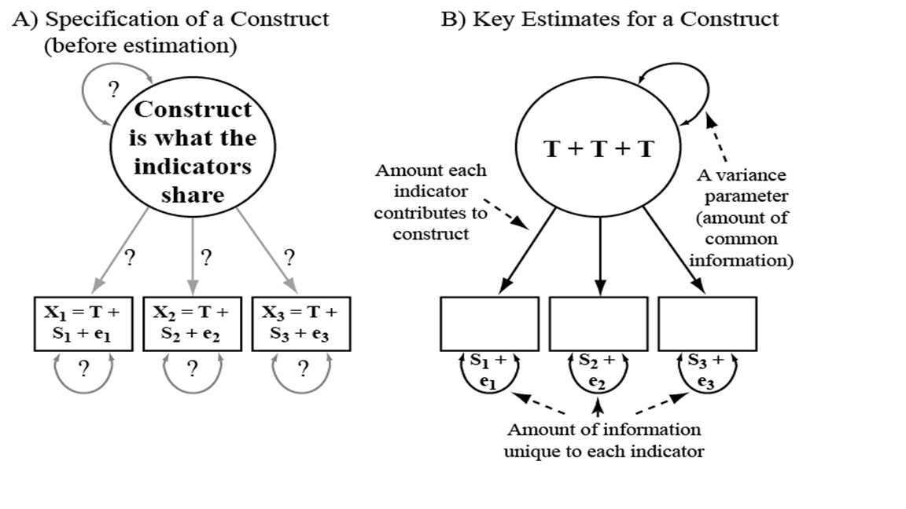
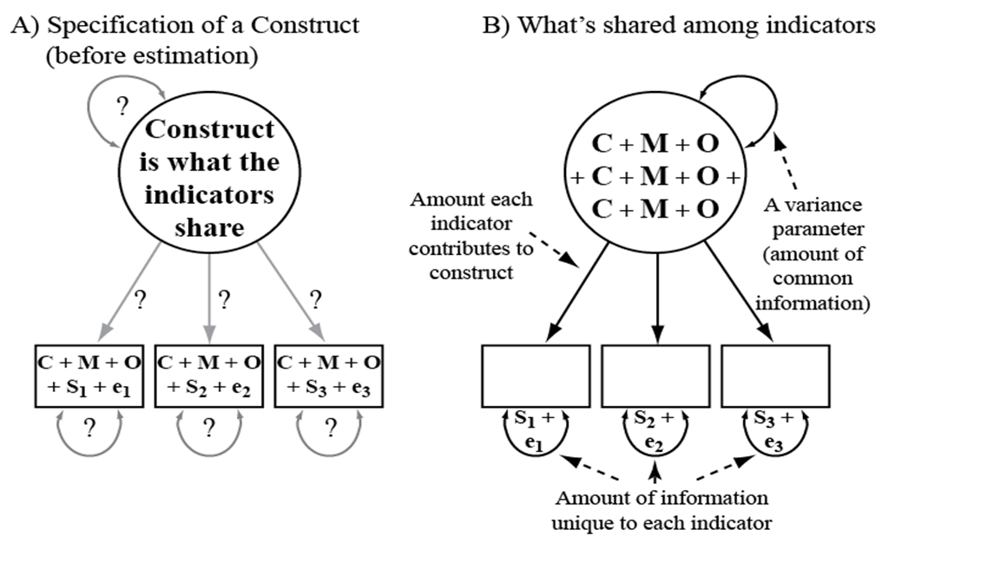

Confirmatory Factor Analysis
================
Mauricio Garnier-Villarreal
1/3/23

- <a href="#introduction" id="toc-introduction">Introduction</a>
  - <a href="#test-theory" id="toc-test-theory">Test theory</a>
- <a href="#measurement-model" id="toc-measurement-model">Measurement
  model</a>
  - <a href="#illustrations" id="toc-illustrations">Illustrations</a>
- <a href="#preparation" id="toc-preparation">Preparation</a>
  - <a href="#getting-some-data" id="toc-getting-some-data">Getting some
    data</a>
  - <a href="#descriptive-statistics"
    id="toc-descriptive-statistics">Descriptive statistics</a>
- <a href="#confirmatory-factor-analysis"
  id="toc-confirmatory-factor-analysis">Confirmatory Factor Analysis</a>
  - <a href="#lavaan" id="toc-lavaan"><code>lavaan</code></a>
  - <a href="#lavaan-syntax" id="toc-lavaan-syntax"><code>lavaan</code>
    syntax</a>
  - <a href="#estimating-the-model" id="toc-estimating-the-model">Estimating
    the model</a>
  - <a href="#model-parameters" id="toc-model-parameters">Model
    parameters</a>
  - <a href="#overall-model-fit" id="toc-overall-model-fit">Overall model
    fit</a>
    - <a href="#exact-fit" id="toc-exact-fit">Exact fit</a>
    - <a href="#approximate-fit" id="toc-approximate-fit">Approximate fit</a>
  - <a href="#local-model-fit" id="toc-local-model-fit">Local model fit</a>
  - <a href="#model-modifications" id="toc-model-modifications">Model
    modifications</a>
  - <a href="#reliability" id="toc-reliability">Reliability</a>
  - <a href="#presenting-the-results"
    id="toc-presenting-the-results">Presenting the results</a>
- <a href="#references" id="toc-references">References</a>

# Introduction

## Test theory

In the social sciences, we are often interested in somewhat ‘abstract’
concepts (e.g., emotions, attitudes, literacy, personality,…). These
concept cannot be measured *directly*, but have to be assessed
*indirectly* using observable indicators (e.g., items in a
questionnaire). We therefore create several items that are meant to
provide information about the underlying trait.

Test theory explains the relationships between the “latent variable”
(e.g., a personality trait such as “extraversion”) and the responses to
several items (e.g., “I make friends easily”, “I know how to captivate
people”…). It defines the statistical relation between a measurement and
the actual characteristic of interest.

Test theory states that there is a measurement model, that describes the
relation between indicators and latent variable. This allow us to test
the strength of association between indicators and latent variable.
While when working with composite scores (e.g., sum or mean scores
across items) still assumes that there is an underlying latent variable,
but it ignores the measurement model and assume all indicators are
equally good.

# Measurement model

A basic assumption of test theory is thus that the trait explains
response patterns in items. To investigate this relationship further, we
need to differentiate the following concepts:

<br>

*Table 1: Important concepts in test theory*

| Name                | Definition                                                                                                                                                                 |
|---------------------|----------------------------------------------------------------------------------------------------------------------------------------------------------------------------|
| Latent variables    | Not directly observable concepts - later also called ‘factors’ - that we are interested in estimating (e.g., emotions, attitudes, personality, literacy, concerns…)        |
| Manifest indicators | Measureable aspects that should be influenced by the latent variable (e.g., items in a questionnaire, but we can also think of other indicators)                           |
| True score          | The share of the variance in the measurement of a manifest indicator that is directly linked to the latent variable; what we want to estimate to the best of our abilities |
| Measurement error   | Share of the measurement variance that is not linked to the latent variable (includes item-specific variance, systematic errors, and random errors)                        |

<br>

In test theory, we decompose the variance of each measurement of an
manifest indicator: Every observable measurement $Y$ (e.g., an item) is
composed of variance explained by the latent variable (true score:
$\tau_a$) ), and the measurement error ($\epsilon$):

$Y_i = \tau_{a,i} + \epsilon_i$

Further, the measurement error represents all information that is not
related to the latent variable. It can include *random error*
variability ($\gamma_{a}$), method specific variance ($\gamma_{b}$) like
how the items were asked, a second trait specific variance
($\gamma_{c}$) which can be information related to other factors (like
anxiety when evaluating depression)

$\epsilon_i = \gamma_{a,i} + \gamma_{b,i} + \gamma_{c,i}$

The measurement error is thereby independent of the true score and
varies randomly across persons and measurement occasions:

$\rho(\tau_i, \epsilon_i) = 0$

Measurement errors can be divided into components like: *random error*
and *systematic error.* Random errors are errors in measurement that
lead to measurable values being inconsistent when repeated measurements
of a constant attribute or quantity are taken. Systematic errors are
errors that are not determined by chance but are introduced by an
inaccuracy (involving either the observation or measurement process).
Systematic errors can be imperfect calibration of the instrument or
interference of the environment.

Not all measurement error is *bad* information, as the specific
variances are true information in the indicators ($\gamma_{b}$,
$\gamma_{c}$), but the error means that is not related to the latent
variable of interest.

## Illustrations

In the first image, we see an example of a measurement model, when the
indicators have true (*T*) latent variable information, item specific
(*S*) information, and random error (*e*). As the only information in
common is the true variance, that is what is pulled as the shared
variance between indicators (defining the latent variable), while the
specific and error are pull by the residual variance.



In the second image, we see an example of a measurement model, when the
indicators have common (*C*) latent variable information, method shared
(*M*) variance, other common (*O*) variance, item specific (*S*)
information, and random error (*e*). As the indicators have in comon
*C*, *M*, and *O*, that is what is pulled as the shared variance between
indicators (defining the latent variable), while the specific and error
are pull by the residual variance.



# Preparation

We will use the package `psych` to get an example data set, `lavaan` to
run the CFA models, and `semTools` to do some added calculations, the
other packages are used for data management or descriptive plots

``` r
library(psych)
library(lavaan)
library(semTools)
library(car)
library(tidyr)
library(ggplot2)
```

## Getting some data

For this tutorial, we will assess a classic measurement model of
psychology: The Big Five Personality Model as assessed in the
International Personality Item Pool (https://ipip.ori.org).
Conveniently, it is included in the `psych` package and we can load it
by simply calling `bfi`. Let’s quickly open the respective documentation
to assess the item formulations.

``` r
dat <- bfi
head(dat)
```

          A1 A2 A3 A4 A5 C1 C2 C3 C4 C5 E1 E2 E3 E4 E5 N1 N2 N3 N4 N5 O1 O2 O3 O4
    61617  2  4  3  4  4  2  3  3  4  4  3  3  3  4  4  3  4  2  2  3  3  6  3  4
    61618  2  4  5  2  5  5  4  4  3  4  1  1  6  4  3  3  3  3  5  5  4  2  4  3
    61620  5  4  5  4  4  4  5  4  2  5  2  4  4  4  5  4  5  4  2  3  4  2  5  5
    61621  4  4  6  5  5  4  4  3  5  5  5  3  4  4  4  2  5  2  4  1  3  3  4  3
    61622  2  3  3  4  5  4  4  5  3  2  2  2  5  4  5  2  3  4  4  3  3  3  4  3
    61623  6  6  5  6  5  6  6  6  1  3  2  1  6  5  6  3  5  2  2  3  4  3  5  6
          O5 gender education age
    61617  3      1        NA  16
    61618  3      2        NA  18
    61620  2      2        NA  17
    61621  5      2        NA  17
    61622  3      1        NA  17
    61623  1      2         3  21

``` r
?bfi
```

As we can see, the scale consists of 25 items. Based on the Big Five
Model of Personality, we can assume that these items reflect five
distinct dimensions:

- Agreeableness (e.g., “I inquire about others’ well-being”)
- Conscientiousness (e.g., “I continue until everything is perfect”)
- Extraversion (e.g., “I don’t talk a lot.”)
- Neuroticism (e.g., “I get irritated easily.”)
- Openness (e.g., “I am full of ideas.”)

All items are measure on 6-point likert scale from 1 = Very Inaccurate
to 6 = Very Accurate.

If we look at the item formulations, we can see that 8 items are reverse
coded. We could reverse code these items, but is not necessary, as the
factor analysis will estimate negative factor loadings indicating the
direction of the relation between the indicators and the latent
variable. Where this can have an effect is on the estimation of
reliability measures, as some are sensitive to indicator directionality.

Here we are recoding them with the `car` package function `recode()`, by
running it in a loop, we are recoding as many variables we have in
`vars_rev` with the same line of recode

``` r
vars_rev <- c("A1","C4","C5","E1","E2","O1","O3","O4")
for (j in 1:length(vars_rev)) {
  dat[,vars_rev[j]] <- recode(dat[,vars_rev[j]], 
                              "1=6; 2=5; 3=4; 4=3; 5=2; 6=1")
}
```

## Descriptive statistics

We should always start by looking at the items descriptive statistics,
since we are treating them as continuous (we can debate of that is
correct or not later), the desired statistics are things like mean,
median, and standard deviation. We can get that from the `describe()`
function from `psych`

``` r
describe(dat)
```

              vars    n  mean    sd median trimmed   mad min max range  skew
    A1           1 2784  4.59  1.41      5    4.77  1.48   1   6     5 -0.83
    A2           2 2773  4.80  1.17      5    4.98  1.48   1   6     5 -1.12
    A3           3 2774  4.60  1.30      5    4.79  1.48   1   6     5 -1.00
    A4           4 2781  4.70  1.48      5    4.93  1.48   1   6     5 -1.03
    A5           5 2784  4.56  1.26      5    4.71  1.48   1   6     5 -0.85
    C1           6 2779  4.50  1.24      5    4.64  1.48   1   6     5 -0.85
    C2           7 2776  4.37  1.32      5    4.50  1.48   1   6     5 -0.74
    C3           8 2780  4.30  1.29      5    4.42  1.48   1   6     5 -0.69
    C4           9 2774  4.45  1.38      5    4.59  1.48   1   6     5 -0.60
    C5          10 2784  3.70  1.63      4    3.75  1.48   1   6     5 -0.07
    E1          11 2777  4.03  1.63      4    4.14  1.48   1   6     5 -0.37
    E2          12 2784  3.86  1.61      4    3.94  1.48   1   6     5 -0.22
    E3          13 2775  4.00  1.35      4    4.07  1.48   1   6     5 -0.47
    E4          14 2791  4.42  1.46      5    4.59  1.48   1   6     5 -0.82
    E5          15 2779  4.42  1.33      5    4.56  1.48   1   6     5 -0.78
    N1          16 2778  2.93  1.57      3    2.82  1.48   1   6     5  0.37
    N2          17 2779  3.51  1.53      4    3.51  1.48   1   6     5 -0.08
    N3          18 2789  3.22  1.60      3    3.16  1.48   1   6     5  0.15
    N4          19 2764  3.19  1.57      3    3.12  1.48   1   6     5  0.20
    N5          20 2771  2.97  1.62      3    2.85  1.48   1   6     5  0.37
    O1          21 2778  2.18  1.13      2    2.04  1.48   1   6     5  0.90
    O2          22 2800  2.71  1.57      2    2.56  1.48   1   6     5  0.59
    O3          23 2772  2.56  1.22      2    2.44  1.48   1   6     5  0.77
    O4          24 2786  2.11  1.22      2    1.90  1.48   1   6     5  1.22
    O5          25 2780  2.49  1.33      2    2.34  1.48   1   6     5  0.74
    gender      26 2800  1.67  0.47      2    1.71  0.00   1   2     1 -0.73
    education   27 2577  3.19  1.11      3    3.22  1.48   1   5     4 -0.05
    age         28 2800 28.78 11.13     26   27.43 10.38   3  86    83  1.02
              kurtosis   se
    A1           -0.31 0.03
    A2            1.05 0.02
    A3            0.44 0.02
    A4            0.04 0.03
    A5            0.16 0.02
    C1            0.30 0.02
    C2           -0.14 0.03
    C3           -0.13 0.02
    C4           -0.62 0.03
    C5           -1.22 0.03
    E1           -1.09 0.03
    E2           -1.15 0.03
    E3           -0.47 0.03
    E4           -0.30 0.03
    E5           -0.09 0.03
    N1           -1.01 0.03
    N2           -1.05 0.03
    N3           -1.18 0.03
    N4           -1.09 0.03
    N5           -1.06 0.03
    O1            0.43 0.02
    O2           -0.81 0.03
    O3            0.30 0.02
    O4            1.08 0.02
    O5           -0.24 0.03
    gender       -1.47 0.01
    education    -0.32 0.02
    age           0.56 0.21

Notice that this function will treat all the variables as continuous,
even when it doesn’t make sense, like with gender in this example. from
here we can talk about the indicator characteristics.

We can also plot the indicators, to visualize them. We first switch our
data from wide to long form, then we can plot the respective histograms
with `ggplot()`

``` r
dat_long <- pivot_longer(dat, cols = A1:O5,
                         names_to = "key", values_to = "value")
ggplot(dat_long, aes(x = value)) +
  geom_histogram(bins = 6, 
                 fill = "lightblue",
                 color = "white") +
  facet_wrap(~key) +
  theme_minimal() +
  labs(x = "Values (1 = Do not agree at all; 6 = Fully agree)",
       y = "Number of responses")
```


We can see how must are close normally distributed. Remember that as
with GLM, CFA does NOT assume that the data is normally distributed, it
assumes that the residuals are normally distributed. For this reason, we
are not making any test of normality on the data itself.

# Confirmatory Factor Analysis

## `lavaan`

We will work with the `lavaan` package, which handles Structural
Equation Models (SEM) in general. Remember that CFA is a subtype of SEM.
You can find more information about it at https://lavaan.ugent.be/

lavaan working in parts, first you need to define a model syntax, which
is a string object (text object in between quotes), that specifies the
relations between indicators and latent variables. Then that model
syntax is pass to the `cfa()` function to estimate the model, there we
can use the respective arguments to adjust the model estimation

## `lavaan` syntax

For the model syntax, the main elements are the latent variable, and
which indicators defined it. We do this by specifying the name of the
latent variable followed by the operator `=~` and after that we provide
the list of indicators, such as

`latent variable =~ indicator1 + indicator2 + ... + indicator_n`

The indicators need to be separated by `+`, just like a regression. By
default, `cfa()` will estimate all correlations between latent
variables.

Here is a list of the main operators in lavaan

<br>

*Table 2: lavaan operators*

| Formula type            | Operator | Mnemonic           |
|-------------------------|----------|--------------------|
| Latent variable         | `=~`     | is manifested by   |
| Regression              | `~`      | is regressed on    |
| (Residual) (co)variance | `~~`     | is correlated with |
| Intercept               | `~1`     | intercept          |
| Defined parameter       | `:=`     | is defined as      |
| Equality constraint     | `==`     | is equal to        |
| Inequality constraint   | `<`      | is smaller than    |
| Inequality constraint   | `>`      | is larger than     |

<br>

For the basic CFA, we would only required to use the latent variable
definition operator.

## Estimating the model

Now, we can write the model syntax for the BFI

``` r
cfa_model <- "
   Agreeableness =~     A1 + A2 + A3 + A4 + A5
   Conscientiousness =~ C1 + C2 + C3 + C4 + C5
   Extraversion =~      E1 + E2 + E3 + E4 + E5
   Neuroticism =~       N1 + N2 + N3 + N4 + N5
   Openness =~          O1 + O2 + O3 + O4 + O5
"
# Estimate the model
fit.cfa <- cfa(cfa_model, 
               data = dat,
               std.lv=T,
               meanstructure=T,
               missing="fiml")
```

Here we have the model syntax (`cfa_model`) defining the theoretically
expected 5 factors, based on the respective personality characteristics.
Each factor is defined by the respective 5 indicators.

Then with `cfa` we estimate the model. The first argument is the model
syntax, the second is the data set, the third is to specify the
identification method. With `std.lv=T` we are using the fixed variance
method of identification. Then we ask to show the means as part of the
model. And last with the argument `missing="fiml"` we ask to use Full
Information Maximum Likelihood (FIML) to handle the missing data.

## Model parameters

We would like to see the model parameters, for that we can use the
`summary()` , we ask for the default output plus the standardized
parameters, and the $R^2$. This first presents information about the
estimation, sample size, number of parameters.

``` r
summary(fit.cfa, standardized=T, rsquare=T)
```

    lavaan 0.6-13.1787 ended normally after 59 iterations

      Estimator                                         ML
      Optimization method                           NLMINB
      Number of model parameters                        85

      Number of observations                          2800
      Number of missing patterns                        87

    Model Test User Model:
                                                          
      Test statistic                              4674.263
      Degrees of freedom                               265
      P-value (Chi-square)                           0.000

    Parameter Estimates:

      Standard errors                             Standard
      Information                                 Observed
      Observed information based on                Hessian

    Latent Variables:
                           Estimate  Std.Err  z-value  P(>|z|)   Std.lv  Std.all
      Agreeableness =~                                                          
        A1                    0.470    0.029   15.957    0.000    0.470    0.334
        A2                    0.744    0.023   32.847    0.000    0.744    0.635
        A3                    0.960    0.024   39.610    0.000    0.960    0.738
        A4                    0.716    0.030   24.111    0.000    0.716    0.484
        A5                    0.860    0.024   35.875    0.000    0.860    0.683
      Conscientiousness =~                                                      
        C1                    0.659    0.026   25.260    0.000    0.659    0.531
        C2                    0.767    0.027   27.941    0.000    0.767    0.582
        C3                    0.688    0.026   25.954    0.000    0.688    0.534
        C4                    0.941    0.027   34.268    0.000    0.941    0.685
        C5                    1.006    0.033   30.153    0.000    1.006    0.618
      Extraversion =~                                                           
        E1                    0.921    0.032   28.943    0.000    0.921    0.565
        E2                    1.104    0.030   36.553    0.000    1.104    0.688
        E3                    0.854    0.026   32.819    0.000    0.854    0.631
        E4                    1.012    0.027   37.229    0.000    1.012    0.694
        E5                    0.734    0.026   27.827    0.000    0.734    0.549
      Neuroticism =~                                                            
        N1                    1.274    0.027   47.390    0.000    1.274    0.811
        N2                    1.217    0.026   46.497    0.000    1.217    0.798
        N3                    1.156    0.029   40.216    0.000    1.156    0.721
        N4                    0.896    0.030   29.489    0.000    0.896    0.571
        N5                    0.819    0.031   26.028    0.000    0.819    0.506
      Openness =~                                                               
        O1                    0.636    0.025   25.420    0.000    0.636    0.564
        O2                    0.611    0.036   16.974    0.000    0.611    0.390
        O3                    0.886    0.029   31.034    0.000    0.886    0.726
        O4                    0.294    0.028   10.533    0.000    0.294    0.240
        O5                    0.606    0.030   20.014    0.000    0.606    0.457

    Covariances:
                           Estimate  Std.Err  z-value  P(>|z|)   Std.lv  Std.all
      Agreeableness ~~                                                          
        Conscientisnss        0.341    0.023   14.611    0.000    0.341    0.341
        Extraversion          0.684    0.017   40.088    0.000    0.684    0.684
        Neuroticism          -0.220    0.023   -9.583    0.000   -0.220   -0.220
        Openness             -0.315    0.025  -12.602    0.000   -0.315   -0.315
      Conscientiousness ~~                                                      
        Extraversion          0.351    0.023   15.120    0.000    0.351    0.351
        Neuroticism          -0.289    0.023  -12.435    0.000   -0.289   -0.289
        Openness             -0.300    0.026  -11.608    0.000   -0.300   -0.300
      Extraversion ~~                                                           
        Neuroticism          -0.234    0.023  -10.254    0.000   -0.234   -0.234
        Openness             -0.451    0.024  -18.669    0.000   -0.451   -0.451
      Neuroticism ~~                                                            
        Openness              0.118    0.025    4.702    0.000    0.118    0.118

    Intercepts:
                       Estimate  Std.Err  z-value  P(>|z|)   Std.lv  Std.all
       .A1                4.587    0.027  172.006    0.000    4.587    3.259
       .A2                4.805    0.022  216.245    0.000    4.805    4.101
       .A3                4.606    0.025  186.810    0.000    4.606    3.541
       .A4                4.700    0.028  167.695    0.000    4.700    3.178
       .A5                4.561    0.024  191.550    0.000    4.561    3.627
       .C1                4.503    0.024  191.446    0.000    4.503    3.629
       .C2                4.371    0.025  174.939    0.000    4.371    3.317
       .C3                4.303    0.024  176.268    0.000    4.303    3.341
       .C4                4.448    0.026  170.729    0.000    4.448    3.237
       .C5                3.703    0.031  120.134    0.000    3.703    2.275
       .E1                4.025    0.031  130.224    0.000    4.025    2.469
       .E2                3.857    0.030  126.939    0.000    3.857    2.403
       .E3                4.001    0.026  156.114    0.000    4.001    2.960
       .E4                4.421    0.028  160.371    0.000    4.421    3.034
       .E5                4.417    0.025  174.586    0.000    4.417    3.309
       .N1                2.932    0.030   98.597    0.000    2.932    1.867
       .N2                3.508    0.029  121.466    0.000    3.508    2.300
       .N3                3.217    0.030  106.146    0.000    3.217    2.008
       .N4                3.185    0.030  106.901    0.000    3.185    2.030
       .N5                2.969    0.031   96.660    0.000    2.969    1.834
       .O1                2.184    0.021  102.036    0.000    2.184    1.935
       .O2                2.713    0.030   91.745    0.000    2.713    1.734
       .O3                2.564    0.023  110.749    0.000    2.564    2.101
       .O4                2.108    0.023   91.118    0.000    2.108    1.726
       .O5                2.490    0.025   98.933    0.000    2.490    1.876
        Agreeableness     0.000                               0.000    0.000
        Conscientisnss    0.000                               0.000    0.000
        Extraversion      0.000                               0.000    0.000
        Neuroticism       0.000                               0.000    0.000
        Openness          0.000                               0.000    0.000

    Variances:
                       Estimate  Std.Err  z-value  P(>|z|)   Std.lv  Std.all
       .A1                1.760    0.049   35.937    0.000    1.760    0.888
       .A2                0.819    0.027   29.954    0.000    0.819    0.596
       .A3                0.771    0.031   24.832    0.000    0.771    0.455
       .A4                1.675    0.049   34.158    0.000    1.675    0.766
       .A5                0.843    0.030   27.714    0.000    0.843    0.533
       .C1                1.105    0.035   31.405    0.000    1.105    0.718
       .C2                1.148    0.039   29.581    0.000    1.148    0.661
       .C3                1.186    0.037   32.001    0.000    1.186    0.715
       .C4                1.003    0.039   25.392    0.000    1.003    0.531
       .C5                1.638    0.058   28.417    0.000    1.638    0.618
       .E1                1.811    0.055   32.664    0.000    1.811    0.681
       .E2                1.358    0.048   28.136    0.000    1.358    0.527
       .E3                1.099    0.036   30.367    0.000    1.099    0.601
       .E4                1.099    0.039   28.109    0.000    1.099    0.518
       .E5                1.244    0.038   32.845    0.000    1.244    0.698
       .N1                0.843    0.037   22.977    0.000    0.843    0.342
       .N2                0.846    0.035   24.390    0.000    0.846    0.363
       .N3                1.231    0.043   28.446    0.000    1.231    0.480
       .N4                1.660    0.051   32.745    0.000    1.660    0.674
       .N5                1.949    0.056   34.534    0.000    1.949    0.744
       .O1                0.870    0.031   28.431    0.000    0.870    0.682
       .O2                2.076    0.062   33.655    0.000    2.076    0.848
       .O3                0.705    0.041   17.225    0.000    0.705    0.473
       .O4                1.405    0.039   36.200    0.000    1.405    0.942
       .O5                1.396    0.044   31.898    0.000    1.396    0.792
        Agreeableness     1.000                               1.000    1.000
        Conscientisnss    1.000                               1.000    1.000
        Extraversion      1.000                               1.000    1.000
        Neuroticism       1.000                               1.000    1.000
        Openness          1.000                               1.000    1.000

    R-Square:
                       Estimate
        A1                0.112
        A2                0.404
        A3                0.545
        A4                0.234
        A5                0.467
        C1                0.282
        C2                0.339
        C3                0.285
        C4                0.469
        C5                0.382
        E1                0.319
        E2                0.473
        E3                0.399
        E4                0.482
        E5                0.302
        N1                0.658
        N2                0.637
        N3                0.520
        N4                0.326
        N5                0.256
        O1                0.318
        O2                0.152
        O3                0.527
        O4                0.058
        O5                0.208

Then we see the parameters split into a few sections:

- Latent variables: presents the factor loadings for every factor. The
  standardized (`Std.all`) are the fully standardized loadings.

- Covariances: the `Estimate` presents all the covariances, while the
  `Std.all` presents the correlation (standardized covariance)

- Intercepts: presents the indicator and factor intercepts
  (meanstructure)

- Variances: presents the (residual) variances, the `Std.all` is the
  proportion of unexplained variance (from 0 to 1).

- R-square: proportion of explained variance in each outcome in the
  model. For indicator, this is the proportion of variance that is
  related to the respective underlying factor.

## Overall model fit

In CFA, we are also testing if the theoretical structure is a good
representation of the data. We do this by testing the fit of the model.
There are different metrics of it. We will go over the most commonly use
and recommendations.

### Exact fit

The test of exact fit is the Null Hypothesis Significance Test (NHST)
for the overall model. Testing is the model reproduces the sample
covariance matrix perfectly. We can see the observed summary statistics
with `lavInspect` , the sample covariances and means for each variable

``` r
lavInspect(fit.cfa, "sampstat")
```

The test of exact fit compares this sample matrix against the covariance
matrix and means reproduce by the model, called the model implied
moments.

``` r
lavInspect(fit.cfa, "implied")
```

This test between observed and implied sufficient statistics is done
with a $\chi^2$ test

$$
\chi^2_\text{ML} = -2(\ell_\text{H} - \ell_\text{S})
$$

We can see this test with `fitMeasures()` function, and asking for just
the needed information. Remember that this test tends to reject models
even when the model misfit is small. As we see in this case we reject
the null hypothesis of the model perfectly reproducing the sample
sufficient statistics

``` r
fitMeasures(fit.cfa, c("chisq","df","pvalue"))
```

       chisq       df   pvalue 
    4674.263  265.000    0.000 

### Approximate fit

As the exact fit test tends to reject models even when the misfit is
small, we also use the approximate fit indices. These indices relay on
the idea that all model fall within a continuum of perfect fit (observed
covariances) and worst fit (all indicators are independent), and we try
to approximate where in that continuum our model is.

It is important t note, these indices are NOT hypothesis test to accept
or reject a model, but they should be interpret as effect size of
misfit.

There are three types of approximate indices (Garnier-Villarreal, &
Jorgensen, 2020):

- Noncentrality: use the noncentrality parameter
  ($\hat{\lambda}=\chi^2 - df$) to compare our model to the perfect
  model. These include RMSEA (Root Mean Square Error of approximation),
  $\hat{\Gamma}$. From these indices we recommend to use $\hat{\Gamma}$
  over RMSEA, this is because $\hat{\Gamma}$ is less sensitive to model
  and sample characteristics, while RMSEA tends to prefer larger models.

- Incemental fit: these indices compare our model to the worst possible
  model. These include CFI (Comparative Fit Index), and TLI (Tucker and
  Lewis index). From these indices we recommend to use CFI over TLI, as
  it is less sensitive to model and sample characteristics, while TLI is
  more sensitive and TLI is not bounded by 1 which makes it harder to
  interpret.

- Residual based: these indexes compare the observed and reproduce
  correlations, and present the respective deviatons. These include the
  residual correlations, and SRMR (standardized root mean squared
  residual) . The residual correlations present respective residual
  correlation for all possible indicator correlations, while the SRMR is
  the average correlation bias of the model, for this reason we
  recommend the SRMR.

$$
\text{RMSEA} = \hat{\varepsilon} = \sqrt{\max\Bigg[0, \frac{\hat{\lambda}}{df \times N}\Bigg]} = \sqrt{\max\Bigg[0, \frac{\chi^2_\text{ML} - df}{df \times N}\Bigg]} = \sqrt{\max\Bigg[0, \frac{F_\text{ML}}{df} - \frac{1}{N}\Bigg]}
$$

$$
\hat{\Gamma} = \frac{p}{p+2\frac{\hat{\lambda}}{N}}
$$

$$
\text{TLI} = \text{NNFI} = \frac{\frac{\chi^2_0}{df_0} - \frac{\chi^2_\text{H}}{df_\text{H}}}{\frac{\chi^2_0}{df_0} - 1}
$$

$$
\text{CFI} = \frac{\max(0, \hat{\lambda}_0) - \max(0, \hat{\lambda}_\text{H})}{\max(0, \hat{\lambda}_0)} = 1 - \frac{\max(0, \hat{\lambda}_\text{H})}{\max(0, \hat{\lambda}_0)}
$$

We can extract most of these indices from the `fitMeasures()` function,
except $\hat{\Gamma}$ for which we need to use the `moreFitIndices()`
function from semTools

``` r
fitMeasures(fit.cfa, c("rmsea","cfi","tli","srmr"))
```

    rmsea   cfi   tli  srmr 
    0.077 0.776 0.747 0.072 

``` r
moreFitIndices(fit.cfa, "gammaHat")
```

    gammaHat 
       0.888 

Remember that we should not use these indices to *accept* a model, but
as effect sizes of *misfit*. For this example, these indices look low
for CFI and TLI in particular.

## Local model fit

After looking at overall model fit, we want to look at local fit. This
looks at how the model fails to reproduce specific correlations, or is
missing parameters, instead of looking at the whole model.

For this we can use the residual correlations, as these present which
pairwise correlation is failed to be reproduced. The general
recommendations is to pay attention to residual correlations that are
higher than $r=|0.1|$ (Kline, 2016), but this is a general guideline,
not a hard rule.

We can get the residual correlations with the `lavResiduals()` function.
This will give the residual correlation matrix, the mean deviations, the
z-score for the correlation and mean deviations (which can be use as a
test), and summary statistics about all the residual correlations.

``` r
lavResiduals(fit.cfa)
```

The mayor limitation of the residual correlations is that they tell us
where the model fails to reproduce the data, but doesn’t tell us how to
fix it. For this we recommend to use modification indices, these
approximate the expected improvement in model fit if we were to include
a parameter that was include previously.

We can use the `modindices()` function, here I am asking it to show me
the ones with the highest likelihood of improving the model’s $\chi^2$ ,
signal by the `mi` column.

``` r
modindices(fit.cfa, sort. = T)[1:10,]
```

                      lhs op rhs      mi    epc sepc.lv sepc.all sepc.nox
    451                N1 ~~  N2 444.002  0.807   0.807    0.956    0.956
    149      Extraversion =~  N4 219.497 -0.441  -0.441   -0.281   -0.281
    188          Openness =~  E3 155.614 -0.405  -0.405   -0.300   -0.300
    125 Conscientiousness =~  E5 145.730  0.353   0.353    0.264    0.264
    468                N3 ~~  N4 145.143  0.401   0.401    0.281    0.281
    189          Openness =~  E4 135.210  0.399   0.399    0.274    0.274
    154      Extraversion =~  O4 128.783  0.350   0.350    0.287    0.287
    416                E2 ~~  O4 128.369  0.331   0.331    0.240    0.240
    162       Neuroticism =~  C2 123.403  0.292   0.292    0.221    0.221
    306                C1 ~~  C2 122.549  0.297   0.297    0.264    0.264

This show us the expected improvement in $\chi^2$ by the column `mi`,
the expected unstandardized parameter change `epc` which is what it
thinks the new parameter will be, and the expected standardized
parameter change `sepc.all` which is what it thinks will be the
standardized new parameter. Based on these we would decide to add one of
these parameters.

Here we see that the model is asking to include the residual covariance
between `N1~~N2` variables. When you are testing for local fit, you
would include the parameters that are theoretically defensibly to
include. For a residual covariance, we would need to argue that there is
something in common between these 2 indicators above and beyond the
latent variables. Also, very important to test adding one parameter at
the time.

## Model modifications

So, now we will include this parameter, and test if we should keep it,
and continue adding parameters until we are satisfied. First, we add the
new parameter into the model syntax, and estimate the model, and look at
the parameter we just added, do we reject the null hypothesis? what is
the standardized value?

``` r
cfa_model_mod <- "
   Agreeableness =~     A1 + A2 + A3 + A4 + A5
   Conscientiousness =~ C1 + C2 + C3 + C4 + C5
   Extraversion =~      E1 + E2 + E3 + E4 + E5
   Neuroticism =~       N1 + N2 + N3 + N4 + N5
   Openness =~          O1 + O2 + O3 + O4 + O5
   ## model modifications
   N1 ~~  N2
"
# Estimate the model
fit.cfa2 <- cfa(cfa_model_mod, 
               data = dat,
               std.lv=T,
               meanstructure=T,
               missing="fiml")
summary(fit.cfa2, standardized=T)
```

    lavaan 0.6-13.1787 ended normally after 60 iterations

      Estimator                                         ML
      Optimization method                           NLMINB
      Number of model parameters                        86

      Number of observations                          2800
      Number of missing patterns                        87

    Model Test User Model:
                                                          
      Test statistic                              4300.288
      Degrees of freedom                               264
      P-value (Chi-square)                           0.000

    Parameter Estimates:

      Standard errors                             Standard
      Information                                 Observed
      Observed information based on                Hessian

    Latent Variables:
                           Estimate  Std.Err  z-value  P(>|z|)   Std.lv  Std.all
      Agreeableness =~                                                          
        A1                    0.468    0.029   15.896    0.000    0.468    0.333
        A2                    0.747    0.023   32.979    0.000    0.747    0.637
        A3                    0.963    0.024   39.784    0.000    0.963    0.740
        A4                    0.715    0.030   24.092    0.000    0.715    0.484
        A5                    0.855    0.024   35.684    0.000    0.855    0.680
      Conscientiousness =~                                                      
        C1                    0.655    0.026   25.073    0.000    0.655    0.528
        C2                    0.761    0.028   27.668    0.000    0.761    0.578
        C3                    0.686    0.027   25.871    0.000    0.686    0.532
        C4                    0.946    0.027   34.515    0.000    0.946    0.688
        C5                    1.012    0.033   30.403    0.000    1.012    0.622
      Extraversion =~                                                           
        E1                    0.921    0.032   29.013    0.000    0.921    0.565
        E2                    1.113    0.030   36.985    0.000    1.113    0.693
        E3                    0.848    0.026   32.578    0.000    0.848    0.627
        E4                    1.011    0.027   37.297    0.000    1.011    0.694
        E5                    0.732    0.026   27.853    0.000    0.732    0.549
      Neuroticism =~                                                            
        N1                    1.047    0.030   35.125    0.000    1.047    0.667
        N2                    0.994    0.029   34.149    0.000    0.994    0.652
        N3                    1.271    0.029   43.586    0.000    1.271    0.794
        N4                    1.041    0.030   34.508    0.000    1.041    0.664
        N5                    0.902    0.032   28.402    0.000    0.902    0.557
      Openness =~                                                               
        O1                    0.636    0.025   25.383    0.000    0.636    0.563
        O2                    0.608    0.036   16.910    0.000    0.608    0.389
        O3                    0.887    0.029   31.058    0.000    0.887    0.727
        O4                    0.296    0.028   10.601    0.000    0.296    0.242
        O5                    0.605    0.030   19.974    0.000    0.605    0.456

    Covariances:
                           Estimate  Std.Err  z-value  P(>|z|)   Std.lv  Std.all
     .N1 ~~                                                                     
       .N2                    0.651    0.038   17.087    0.000    0.651    0.481
      Agreeableness ~~                                                          
        Conscientisnss        0.341    0.023   14.601    0.000    0.341    0.341
        Extraversion          0.682    0.017   39.850    0.000    0.682    0.682
        Neuroticism          -0.206    0.024   -8.647    0.000   -0.206   -0.206
        Openness             -0.315    0.025  -12.614    0.000   -0.315   -0.315
      Conscientiousness ~~                                                      
        Extraversion          0.351    0.023   15.146    0.000    0.351    0.351
        Neuroticism          -0.318    0.024  -13.314    0.000   -0.318   -0.318
        Openness             -0.298    0.026  -11.545    0.000   -0.298   -0.298
      Extraversion ~~                                                           
        Neuroticism          -0.292    0.023  -12.496    0.000   -0.292   -0.292
        Openness             -0.449    0.024  -18.629    0.000   -0.449   -0.449
      Neuroticism ~~                                                            
        Openness              0.119    0.026    4.562    0.000    0.119    0.119

    Intercepts:
                       Estimate  Std.Err  z-value  P(>|z|)   Std.lv  Std.all
       .A1                4.587    0.027  172.006    0.000    4.587    3.259
       .A2                4.805    0.022  216.243    0.000    4.805    4.101
       .A3                4.606    0.025  186.810    0.000    4.606    3.541
       .A4                4.700    0.028  167.696    0.000    4.700    3.178
       .A5                4.561    0.024  191.546    0.000    4.561    3.627
       .C1                4.503    0.024  191.442    0.000    4.503    3.629
       .C2                4.371    0.025  174.936    0.000    4.371    3.317
       .C3                4.303    0.024  176.265    0.000    4.303    3.341
       .C4                4.448    0.026  170.734    0.000    4.448    3.237
       .C5                3.703    0.031  120.135    0.000    3.703    2.275
       .E1                4.025    0.031  130.223    0.000    4.025    2.469
       .E2                3.857    0.030  126.943    0.000    3.857    2.403
       .E3                4.001    0.026  156.113    0.000    4.001    2.960
       .E4                4.421    0.028  160.370    0.000    4.421    3.034
       .E5                4.417    0.025  174.587    0.000    4.417    3.309
       .N1                2.931    0.030   98.589    0.000    2.931    1.867
       .N2                3.508    0.029  121.514    0.000    3.508    2.300
       .N3                3.217    0.030  106.147    0.000    3.217    2.008
       .N4                3.185    0.030  106.932    0.000    3.185    2.030
       .N5                2.969    0.031   96.672    0.000    2.969    1.834
       .O1                2.184    0.021  102.036    0.000    2.184    1.935
       .O2                2.713    0.030   91.745    0.000    2.713    1.734
       .O3                2.564    0.023  110.749    0.000    2.564    2.101
       .O4                2.108    0.023   91.118    0.000    2.108    1.726
       .O5                2.490    0.025   98.932    0.000    2.490    1.876
        Agreeableness     0.000                               0.000    0.000
        Conscientisnss    0.000                               0.000    0.000
        Extraversion      0.000                               0.000    0.000
        Neuroticism       0.000                               0.000    0.000
        Openness          0.000                               0.000    0.000

    Variances:
                       Estimate  Std.Err  z-value  P(>|z|)   Std.lv  Std.all
       .A1                1.762    0.049   35.949    0.000    1.762    0.889
       .A2                0.815    0.027   29.882    0.000    0.815    0.594
       .A3                0.765    0.031   24.676    0.000    0.765    0.452
       .A4                1.676    0.049   34.160    0.000    1.676    0.766
       .A5                0.850    0.030   27.906    0.000    0.850    0.537
       .C1                1.111    0.035   31.504    0.000    1.111    0.721
       .C2                1.157    0.039   29.739    0.000    1.157    0.666
       .C3                1.189    0.037   32.043    0.000    1.189    0.717
       .C4                0.994    0.039   25.250    0.000    0.994    0.526
       .C5                1.626    0.057   28.297    0.000    1.626    0.613
       .E1                1.810    0.055   32.710    0.000    1.810    0.681
       .E2                1.338    0.048   27.968    0.000    1.338    0.519
       .E3                1.110    0.036   30.582    0.000    1.110    0.607
       .E4                1.101    0.039   28.270    0.000    1.101    0.518
       .E5                1.245    0.038   32.949    0.000    1.245    0.699
       .N1                1.370    0.047   29.005    0.000    1.370    0.555
       .N2                1.337    0.045   29.606    0.000    1.337    0.575
       .N3                0.950    0.046   20.800    0.000    0.950    0.370
       .N4                1.379    0.048   28.637    0.000    1.379    0.560
       .N5                1.807    0.055   32.804    0.000    1.807    0.690
       .O1                0.871    0.031   28.427    0.000    0.871    0.683
       .O2                2.079    0.062   33.695    0.000    2.079    0.849
       .O3                0.703    0.041   17.131    0.000    0.703    0.472
       .O4                1.403    0.039   36.177    0.000    1.403    0.941
       .O5                1.397    0.044   31.918    0.000    1.397    0.792
        Agreeableness     1.000                               1.000    1.000
        Conscientisnss    1.000                               1.000    1.000
        Extraversion      1.000                               1.000    1.000
        Neuroticism       1.000                               1.000    1.000
        Openness          1.000                               1.000    1.000

In this case we see that the added parameters presents a residual
correlation of 0.481. Which is high. We can also compare the original
model to the model with modifications, to test the improvement of the
model

The model comparison is done with the `lavTestLRT()` function, this will
do a likelihood ratio test (LRT) between 2 models, with the null
hypothesis of the 2 models being equally good.

``` r
lavTestLRT(fit.cfa, fit.cfa2)
```


    Chi-Squared Difference Test

              Df    AIC    BIC  Chisq Chisq diff   RMSEA Df diff Pr(>Chisq)    
    fit.cfa2 264 228355 228865 4300.3                                          
    fit.cfa  265 228727 229231 4674.3     373.97 0.36497       1  < 2.2e-16 ***
    ---
    Signif. codes:  0 '***' 0.001 '**' 0.01 '*' 0.05 '.' 0.1 ' ' 1

Then we can look at the overall model fit, and we see some improvement

``` r
fitMeasures(fit.cfa2, c("rmsea","cfi","tli","srmr"))
```

    rmsea   cfi   tli  srmr 
    0.074 0.795 0.767 0.070 

``` r
moreFitIndices(fit.cfa2, "gammaHat")
```

    gammaHat 
       0.897 

As it seems we need the new added parameter, and the model fit is not
great yet. We can look at the modification indices to continue editing
the model

``` r
modindices(fit.cfa2, sort. = T)[1:10,]
```

                      lhs op rhs      mi    epc sepc.lv sepc.all sepc.nox
    150      Extraversion =~  N4 187.942 -0.410  -0.410   -0.261   -0.261
    175       Neuroticism =~  O4 166.895 -0.333  -0.333   -0.273   -0.273
    189          Openness =~  E3 160.650 -0.411  -0.411   -0.304   -0.304
    163       Neuroticism =~  C2 149.701  0.337   0.337    0.256    0.256
    126 Conscientiousness =~  E5 149.480  0.358   0.358    0.268    0.268
    166       Neuroticism =~  C5 144.419 -0.405  -0.405   -0.249   -0.249
    155      Extraversion =~  O4 138.138  0.362   0.362    0.296    0.296
    190          Openness =~  E4 131.398  0.392   0.392    0.269    0.269
    307                C1 ~~  C2 128.362  0.304   0.304    0.268    0.268
    141      Extraversion =~  A5 126.276  0.461   0.461    0.367    0.367

And then we continue this iterative process, modifying the model until
we are satisfied. Here I present what would be my final model after a
few iterations.

``` r
cfa_model_mod <- "
   Agreeableness =~     A1 + A2 + A3 + A4 + A5
   Conscientiousness =~ C1 + C2 + C3 + C4 + C5
   Extraversion =~      E1 + E2 + E3 + E4 + E5
   Neuroticism =~       N1 + N2 + N3 + N4 + N5
   Openness =~          O1 + O2 + O3 + O4 + O5
   ## model modifications
   N1 ~~  N2
   Extraversion =~  N4
   Openness =~  E3
   Conscientiousness =~  E5
   Extraversion =~  O4
   Neuroticism =~  C5
   Neuroticism =~  C4
   O2 ~~  O5
   Extraversion =~  A5
"
# Estimate the model
fit.cfa3 <- cfa(cfa_model_mod, 
               data = dat,
               std.lv=T,
               meanstructure=T,
               missing="fiml")
```

Here we see that the original model needed several modifications (9),
which is not a great sing for the original theoretical structure.

Even after all these changes, more parameters could be added to improve
it, but we considered that the next parameters would not add so much to
the model, as the improvement in model fit was not small by adding each
new parameter.

``` r
lavTestLRT(fit.cfa, fit.cfa3)
```


    Chi-Squared Difference Test

              Df    AIC    BIC  Chisq Chisq diff   RMSEA Df diff Pr(>Chisq)    
    fit.cfa3 256 227011 227569 2940.3                                          
    fit.cfa  265 228727 229231 4674.3     1733.9 0.26163       9  < 2.2e-16 ***
    ---
    Signif. codes:  0 '***' 0.001 '**' 0.01 '*' 0.05 '.' 0.1 ' ' 1

``` r
fitMeasures(fit.cfa3, c("rmsea","cfi","tli","srmr"))
```

    rmsea   cfi   tli  srmr 
    0.061 0.864 0.840 0.053 

``` r
moreFitIndices(fit.cfa3, "gammaHat")
```

    gammaHat 
       0.929 

``` r
modindices(fit.cfa3, sort. = T)[1:10,]
```

                  lhs op rhs     mi    epc sepc.lv sepc.all sepc.nox
    192      Openness =~  E5 90.635 -0.307  -0.307   -0.230   -0.230
    198            A1 ~~  A2 89.661  0.249   0.249    0.214    0.214
    177   Neuroticism =~  O4 79.004 -0.242  -0.242   -0.198   -0.198
    170   Neuroticism =~  E2 71.591 -0.255  -0.255   -0.159   -0.159
    362            C4 ~~  C5 69.093  0.282   0.282    0.214    0.214
    113 Agreeableness =~  E4 67.719  0.306   0.306    0.210    0.210
    296            A5 ~~  E4 61.564  0.184   0.184    0.194    0.194
    175   Neuroticism =~  O2 59.876  0.239   0.239    0.153    0.153
    269            A4 ~~  C2 57.539  0.214   0.214    0.168    0.168
    442            E4 ~~  O5 56.804  0.198   0.198    0.159    0.159

## Reliability

Here we use metrics to estimate the factor reliability, for this we will
use the `compRelSEM()` function from semTools. With the default settings
we are estimating the $\omega$ measure of reliability, for each factor
in the model.

``` r
compRelSEM(fit.cfa3)
```

        Agreeableness Conscientiousness      Extraversion       Neuroticism 
                0.639             0.652             0.653             0.559 
             Openness 
                0.437 

This measure does not assume tau-equivalence, which is a strong
assumption of equivalence between indicators, and ignores the
differences in factor loadings. If we set to assume tau-equivalence, we
get the Cronbach $\alpha$ measure

``` r
compRelSEM(fit.cfa3, tau.eq = T)
```

        Agreeableness Conscientiousness      Extraversion       Neuroticism 
                0.702             0.729             0.585             0.538 
             Openness 
                0.374 

We recommend to use the $\omega$ measure, as it is more representative
of reliability, and respects the factor loadings.

## Presenting the results

For the presentation of the results, first you would need to describe
your theoretical model, and process for deciding to add modifications.

Then for your final model, you would report the overall model fit, such
as
$\chi^2(256) = 2940.349, p < .001, \text{CFI} = 0.864, \text{SRMR}=0.053, \hat{\Gamma}=0.929$

``` r
fitMeasures(fit.cfa3, c("chisq","df","pvalue","rmsea","cfi","tli","srmr"))
```

       chisq       df   pvalue    rmsea      cfi      tli     srmr 
    2940.349  256.000    0.000    0.061    0.864    0.840    0.053 

``` r
moreFitIndices(fit.cfa3, "gammaHat")
```

    gammaHat 
       0.929 

Then you would need to report the model parameters, so from the
`summary()` output you would report the estimate, std.err, p-value, and
std.all columns. For the latent variable, and covariances sections.
Lastly report the $R^2$

``` r
summary(fit.cfa3, standardized=T, rsquare=T)
```

Lastly, you would need to report the factor reliability $\omega$

``` r
compRelSEM(fit.cfa3)
```

        Agreeableness Conscientiousness      Extraversion       Neuroticism 
                0.639             0.652             0.653             0.559 
             Openness 
                0.437 

# References

Bollen, K. A. (1989). Structural Equations with Latent Variables. John
Wiley & Sons, Inc.

Brown, T. A. (2015). Confirmatory factor analysis for applied research
(Second Edition). Guilford Press.

Kline, R. B. (2016). Principles and practice of structural equation
modeling (Fourth Edition). Guilford Press.

Garnier-Villarreal, M., & Jorgensen, T. D. (2020). Adapting Fit Indices
for Bayesian Structural Equation Modeling: Comparison to Maximum
Likelihood. Psychological Methods, 25(1), 46–70.
https://doi.org/doi.org/10.1037/met0000224

Fan, X., & Sivo, S. A. (2007). Sensitivity of fit indices to model
misspecification and model types. Multivariate Behavioral Research,
42(3), 509–529. https://doi.org/10.1080/00273170701382864
