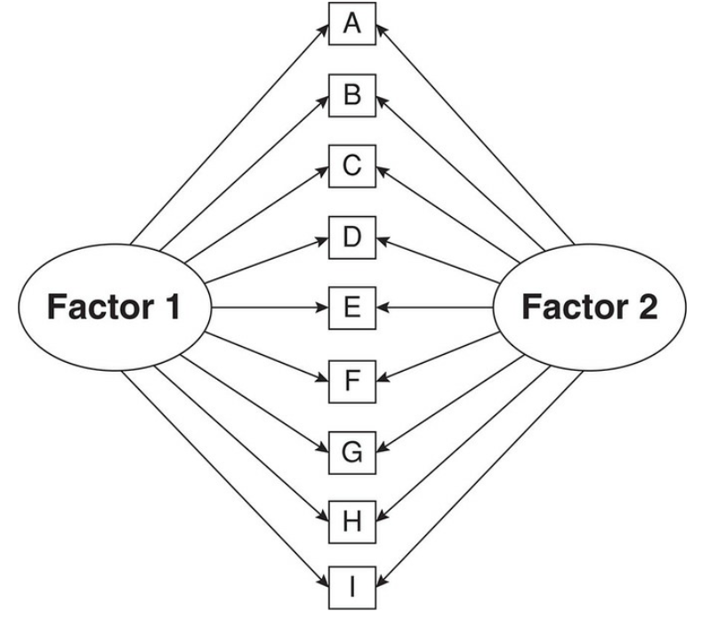
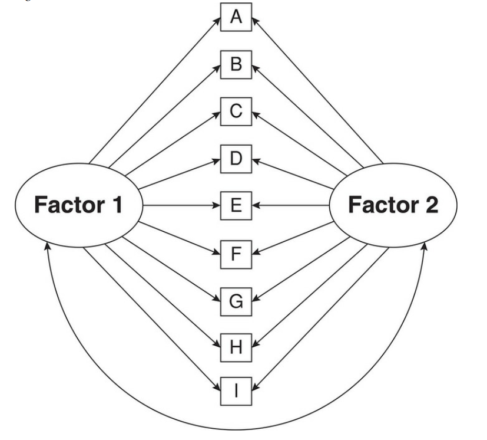
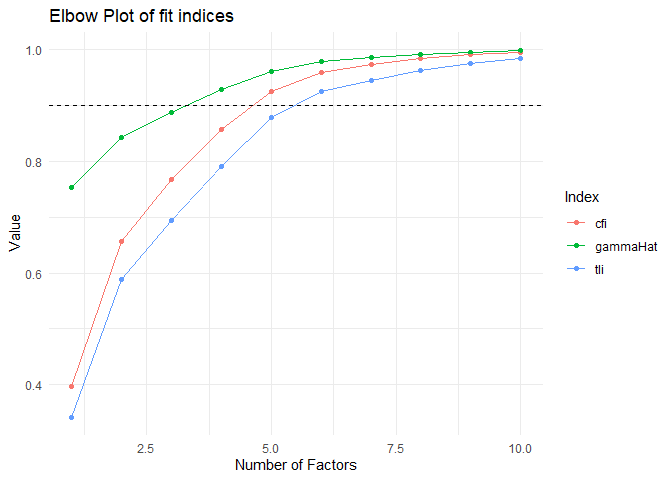
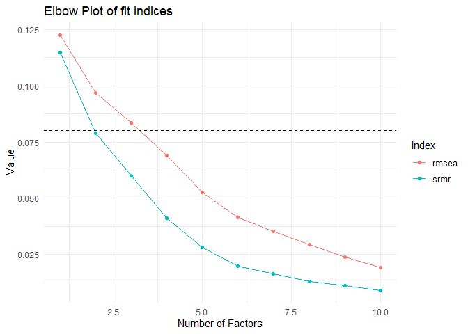
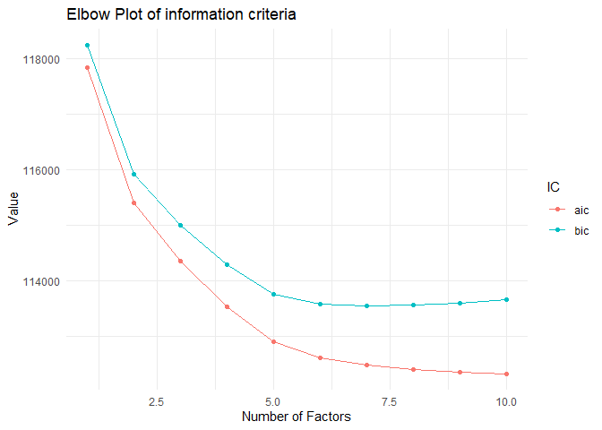
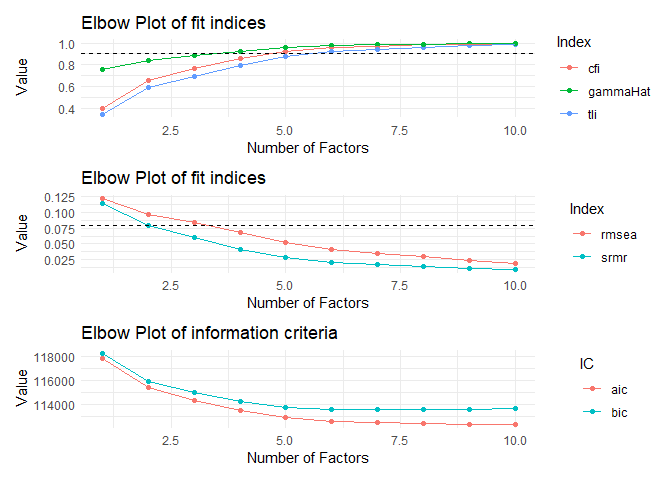

Exploratory Factor Analysis
================
Mauricio Garnier-Villarreal
1/12/23

- <a href="#introduction" id="toc-introduction">Introduction</a>
  - <a href="#test-theory" id="toc-test-theory">Test theory</a>
- <a href="#measurement-model" id="toc-measurement-model">Measurement
  model</a>
  - <a href="#exploratory-factor-analysis-efa"
    id="toc-exploratory-factor-analysis-efa">Exploratory Factor Analysis
    (EFA)</a>
    - <a href="#cross-validation"
      id="toc-cross-validation">Cross-validation</a>
    - <a href="#illustrations" id="toc-illustrations">Illustrations</a>
- <a href="#preparation" id="toc-preparation">Preparation</a>
  - <a href="#getting-some-data" id="toc-getting-some-data">Getting some
    data</a>
  - <a href="#descriptive-statistics"
    id="toc-descriptive-statistics">Descriptive statistics</a>
  - <a href="#split-data-for-cross-validation"
    id="toc-split-data-for-cross-validation">Split data for
    cross-validation</a>
- <a href="#exploratory-factor-analysis"
  id="toc-exploratory-factor-analysis">Exploratory Factor Analysis</a>
  - <a href="#lavaan" id="toc-lavaan"><code>lavaan</code></a>
  - <a href="#estimating-the-model" id="toc-estimating-the-model">Estimating
    the model</a>
  - <a href="#rotation" id="toc-rotation">Rotation</a>
  - <a href="#factor-enumeration" id="toc-factor-enumeration">Factor
    enumeration</a>
    - <a href="#statistical-criteria"
      id="toc-statistical-criteria">Statistical criteria</a>
      - <a href="#exact-fit" id="toc-exact-fit">Exact fit</a>
      - <a href="#approximate-fit" id="toc-approximate-fit">Approximate fit</a>
      - <a href="#information-criteria"
        id="toc-information-criteria">Information Criteria</a>
      - <a href="#extracting-fit-indices"
        id="toc-extracting-fit-indices">Extracting fit indices</a>
      - <a href="#elbow-plots" id="toc-elbow-plots">Elbow plots</a>
      - <a href="#solution" id="toc-solution">Solution</a>
- <a href="#cross-validation-cfa"
  id="toc-cross-validation-cfa">Cross-validation CFA</a>
- <a href="#r-session" id="toc-r-session">R session</a>
- <a href="#references" id="toc-references">References</a>

# Introduction

## Test theory

In the social sciences, we are often interested in somewhat ‘abstract’
concepts (e.g., emotions, attitudes, literacy, personality,…). These
concept cannot be measured *directly*, but have to be assessed
*indirectly* using observable indicators (e.g., items in a
questionnaire). We therefore create several items that are meant to
provide information about the underlying trait.

Test theory explains the relationships between the “latent variable”
(e.g., a personality trait such as “extraversion”) and the responses to
several items (e.g., “I make friends easily”, “I know how to captivate
people”…). It defines the statistical relation between a measurement and
the actual characteristic of interest.

Test theory states that there is a measurement model, that describes the
relation between indicators and latent variable. This allow us to test
the strength of association between indicators and latent variable.
While when working with composite scores (e.g., sum or mean scores
across items) still assumes that there is an underlying latent variable,
but it ignores the measurement model and assume all indicators are
equally good.

# Measurement model

A basic assumption of test theory is thus that the trait explains
response patterns in items. To investigate this relationship further, we
need to differentiate the following concepts:

<br>

*Table 1: Important concepts in test theory*

| Name                | Definition                                                                                                                                                                 |
|---------------------|----------------------------------------------------------------------------------------------------------------------------------------------------------------------------|
| Latent variables    | Not directly observable concepts - later also called ‘factors’ - that we are interested in estimating (e.g., emotions, attitudes, personality, literacy, concerns…)        |
| Manifest indicators | Measureable aspects that should be influenced by the latent variable (e.g., items in a questionnaire, but we can also think of other indicators)                           |
| True score          | The share of the variance in the measurement of a manifest indicator that is directly linked to the latent variable; what we want to estimate to the best of our abilities |
| Measurement error   | Share of the measurement variance that is not linked to the latent variable (includes item-specific variance, systematic errors, and random errors)                        |

<br>

In test theory, we decompose the variance of each measurement of an
manifest indicator: Every observable measurement $Y$ (e.g., an item) is
composed of variance explained by the latent variable (true score:
$\tau_a$) ), and the measurement error ($\epsilon$):

$Y_i = \tau_{a,i} + \epsilon_i$

Further, the measurement error represents all information that is not
related to the latent variable. It can include *random error*
variability ($\gamma_{a}$), method specific variance ($\gamma_{b}$) like
how the items were asked, a second trait specific variance
($\gamma_{c}$) which can be information related to other factors (like
anxiety when evaluating depression)

$\epsilon_i = \gamma_{a,i} + \gamma_{b,i} + \gamma_{c,i}$

The measurement error is thereby independent of the true score and
varies randomly across persons and measurement occasions:

$\rho(\tau_i, \epsilon_i) = 0$

Measurement errors can be divided into components like: *random error*
and *systematic error.* Random errors are errors in measurement that
lead to measurable values being inconsistent when repeated measurements
of a constant attribute or quantity are taken. Systematic errors are
errors that are not determined by chance but are introduced by an
inaccuracy (involving either the observation or measurement process).
Systematic errors can be imperfect calibration of the instrument or
interference of the environment.

Not all measurement error is *bad* information, as the specific
variances are true information in the indicators ($\gamma_{b}$,
$\gamma_{c}$), but the error means that is not related to the latent
variable of interest.

## Exploratory Factor Analysis (EFA)

The major difference between Confirmatory and Exploratory Factor
analysis is that in CFA we are testing a specific measurement model
(theoretical) structure, while in EFA we are asking to the data which is
the best fitting measurement model structure. It is important to note
that is you fit a CFA and EFA to the same data, EFA will always have
better fit, as it is a less restrictive model.

$Y_i = \tau_{a,i} + \tau_{b,i} + \epsilon_i$

Like a factor model, where we have true score variances related to
factors $\tau_{a}$ and $\tau_{b}$ , and the rest of the variance is
related to the error component.

So, if the EFA fits better, why don’t we just work with EFAs? Why do we
care about CFAs? The reason is that with EFA we are testing lower case
*theory*, while with CFA we are testing capital case *Theory*. Where
theory is a general framework, but less restrictive and tends to be
easier to work with, but this ends up being more sample dependent
results as well. While Theory tests specific already defined structures,
which makes it less sensitive to sample variability, and more
generalizable.

In EFA we don’t estimate just one model, we estimate a sequence of
models with increasing number of $K$ factors . Then we evaluate which
$K$ factor model is best, with a combination of statistical criteria and
theoretical interpretation.

With this criteria we are looking for the model with lowest number of
well fitting, and theoretically sound factors. We will look into these
criteria in the next sections

### Cross-validation

As EFA is tests *theory*, its is recommended to evaluated with
cross-validation. The method we will show here is based on split
samples. So, if you have a large enough sample, you would randomly split
the sample in 2 groups. Run the EFAs and decide a factorial structure
based on the first sample (test) and then estimate a CFA of the
specified structure on the second sample (validation).

If the EFA came up with a good theoretically sound factor structure, it
should show good fit on the validation sample. This is a powerful tool
to demonstrate that your model is stronger, and maybe approaching
*Theory.*

But this presents a limitation, you need to have a large enough sample
to split it, and have enough subjects for both EFA and CFA. Which can be
hard in some scenarios. It is not recommended to do both EFA and CFA
steps on the same sample, as it will be redundant information and will
positively bias the results of the CFA.

In an ideal case, we wont even split the sample. But collect data, run
the EFA, collects a second data set in a different time, and run the
CFA. This way there would be less sample dependency. But again, this can
be hard to achieve logistically.

### Illustrations

In EFA we follow the same graphical conventions as CFA, but now we
estimate a model where each indicator is describe by some true variance
in all factors. Assuming that the indicators have more in common across
all factors in the model



For example, the previous image presents a 2 factor EFA, where all
indicators load into each factor. Notice that in this case the factors
are independent of each other as there is no correlation between them,
also called *orthogonal*. This is a strong assumption of the model, up
not a requirement we can always estimate the model with correlated
factors (*oblique*), Like in the next image



# Preparation

We will use the package `psych` to get an example data set, `lavaan` to
run the EFA models, and `semTools` to do some added calculations, the
other packages are used for data management or descriptive plots

``` r
library(psych)
library(lavaan)
library(semTools)
library(car)
library(tidyr)
library(ggplot2)
library(patchwork)
```

## Getting some data

For this tutorial, we will assess a classic measurement model of
psychology: The Big Five Personality Model as assessed in the
International Personality Item Pool (https://ipip.ori.org).
Conveniently, it is included in the `psych` package and we can load it
by simply calling `bfi`. Let’s quickly open the respective documentation
to assess the item formulations.

``` r
dat <- bfi
head(dat)
```

          A1 A2 A3 A4 A5 C1 C2 C3 C4 C5 E1 E2 E3 E4 E5 N1 N2 N3 N4 N5 O1 O2 O3 O4
    61617  2  4  3  4  4  2  3  3  4  4  3  3  3  4  4  3  4  2  2  3  3  6  3  4
    61618  2  4  5  2  5  5  4  4  3  4  1  1  6  4  3  3  3  3  5  5  4  2  4  3
    61620  5  4  5  4  4  4  5  4  2  5  2  4  4  4  5  4  5  4  2  3  4  2  5  5
    61621  4  4  6  5  5  4  4  3  5  5  5  3  4  4  4  2  5  2  4  1  3  3  4  3
    61622  2  3  3  4  5  4  4  5  3  2  2  2  5  4  5  2  3  4  4  3  3  3  4  3
    61623  6  6  5  6  5  6  6  6  1  3  2  1  6  5  6  3  5  2  2  3  4  3  5  6
          O5 gender education age
    61617  3      1        NA  16
    61618  3      2        NA  18
    61620  2      2        NA  17
    61621  5      2        NA  17
    61622  3      1        NA  17
    61623  1      2         3  21

``` r
dim(dat)
```

    [1] 2800   28

``` r
?bfi
```

As we can see, the scale consists of 25 items. Based on the Big Five
Model of Personality, we can assume that these items reflect five
distinct dimensions:

- Agreeableness (e.g., “I inquire about others’ well-being”)
- Conscientiousness (e.g., “I continue until everything is perfect”)
- Extraversion (e.g., “I don’t talk a lot.”)
- Neuroticism (e.g., “I get irritated easily.”)
- Openness (e.g., “I am full of ideas.”)

All items are measure on 6-point likert scale from 1 = Very Inaccurate
to 6 = Very Accurate.

If we look at the item formulations, we can see that 8 items are reverse
coded. We could reverse code these items, but is not necessary, as the
factor analysis will estimate negative factor loadings indicating the
direction of the relation between the indicators and the latent
variable. Where this can have an effect is on the estimation of
reliability measures, as some are sensitive to indicator directionality.

Here we are recoding them with the `car` package function `recode()`, by
running it in a loop, we are recoding as many variables we have in
`vars_rev` with the same line of recode

``` r
vars_rev <- c("A1","C4","C5","E1","E2","O1","O3","O4")
for (j in 1:length(vars_rev)) {
  dat[,vars_rev[j]] <- recode(dat[,vars_rev[j]], 
                              "1=6; 2=5; 3=4; 4=3; 5=2; 6=1")
}
```

## Descriptive statistics

We should always start by looking at the items descriptive statistics,
since we are treating them as continuous (we can debate of that is
correct or not later), the desired statistics are things like mean,
median, and standard deviation. We can get that from the `describe()`
function from `psych`

``` r
describe(dat)
```

              vars    n  mean    sd median trimmed   mad min max range  skew
    A1           1 2784  4.59  1.41      5    4.77  1.48   1   6     5 -0.83
    A2           2 2773  4.80  1.17      5    4.98  1.48   1   6     5 -1.12
    A3           3 2774  4.60  1.30      5    4.79  1.48   1   6     5 -1.00
    A4           4 2781  4.70  1.48      5    4.93  1.48   1   6     5 -1.03
    A5           5 2784  4.56  1.26      5    4.71  1.48   1   6     5 -0.85
    C1           6 2779  4.50  1.24      5    4.64  1.48   1   6     5 -0.85
    C2           7 2776  4.37  1.32      5    4.50  1.48   1   6     5 -0.74
    C3           8 2780  4.30  1.29      5    4.42  1.48   1   6     5 -0.69
    C4           9 2774  4.45  1.38      5    4.59  1.48   1   6     5 -0.60
    C5          10 2784  3.70  1.63      4    3.75  1.48   1   6     5 -0.07
    E1          11 2777  4.03  1.63      4    4.14  1.48   1   6     5 -0.37
    E2          12 2784  3.86  1.61      4    3.94  1.48   1   6     5 -0.22
    E3          13 2775  4.00  1.35      4    4.07  1.48   1   6     5 -0.47
    E4          14 2791  4.42  1.46      5    4.59  1.48   1   6     5 -0.82
    E5          15 2779  4.42  1.33      5    4.56  1.48   1   6     5 -0.78
    N1          16 2778  2.93  1.57      3    2.82  1.48   1   6     5  0.37
    N2          17 2779  3.51  1.53      4    3.51  1.48   1   6     5 -0.08
    N3          18 2789  3.22  1.60      3    3.16  1.48   1   6     5  0.15
    N4          19 2764  3.19  1.57      3    3.12  1.48   1   6     5  0.20
    N5          20 2771  2.97  1.62      3    2.85  1.48   1   6     5  0.37
    O1          21 2778  2.18  1.13      2    2.04  1.48   1   6     5  0.90
    O2          22 2800  2.71  1.57      2    2.56  1.48   1   6     5  0.59
    O3          23 2772  2.56  1.22      2    2.44  1.48   1   6     5  0.77
    O4          24 2786  2.11  1.22      2    1.90  1.48   1   6     5  1.22
    O5          25 2780  2.49  1.33      2    2.34  1.48   1   6     5  0.74
    gender      26 2800  1.67  0.47      2    1.71  0.00   1   2     1 -0.73
    education   27 2577  3.19  1.11      3    3.22  1.48   1   5     4 -0.05
    age         28 2800 28.78 11.13     26   27.43 10.38   3  86    83  1.02
              kurtosis   se
    A1           -0.31 0.03
    A2            1.05 0.02
    A3            0.44 0.02
    A4            0.04 0.03
    A5            0.16 0.02
    C1            0.30 0.02
    C2           -0.14 0.03
    C3           -0.13 0.02
    C4           -0.62 0.03
    C5           -1.22 0.03
    E1           -1.09 0.03
    E2           -1.15 0.03
    E3           -0.47 0.03
    E4           -0.30 0.03
    E5           -0.09 0.03
    N1           -1.01 0.03
    N2           -1.05 0.03
    N3           -1.18 0.03
    N4           -1.09 0.03
    N5           -1.06 0.03
    O1            0.43 0.02
    O2           -0.81 0.03
    O3            0.30 0.02
    O4            1.08 0.02
    O5           -0.24 0.03
    gender       -1.47 0.01
    education    -0.32 0.02
    age           0.56 0.21

Notice that this function will treat all the variables as continuous,
even when it doesn’t make sense, like with gender in this example. from
here we can talk about the indicator characteristics.

We can also plot the indicators, to visualize them. We first switch our
data from wide to long form, then we can plot the respective histograms
with `ggplot()`

``` r
dat_long <- pivot_longer(dat, cols = A1:O5,
                         names_to = "key", values_to = "value")
ggplot(dat_long, aes(x = value)) +
  geom_histogram(bins = 6, 
                 fill = "lightblue",
                 color = "white") +
  facet_wrap(~key) +
  theme_minimal() +
  labs(x = "Values (1 = Do not agree at all; 6 = Fully agree)",
       y = "Number of responses")
```


We can see how must are close normally distributed. Remember that as
with GLM, CFA does NOT assume that the data is normally distributed, it
assumes that the residuals are normally distributed. For this reason, we
are not making any test of normality on the data itself.

## Split data for cross-validation

As we discussed earlier, when possible is recommended to test the factor
structure with cross-validation. In this case we can do it as the sample
size is large $N=2800$. So, we will split it into 2 samples

``` r
set.seed(1987)

rand_samp <- sample(1:2, nrow(dat), replace = T)
dat1 <- dat[rand_samp == 1,]
dat2 <- dat[rand_samp == 2,]
```

This way we have randomly generated codes 1 and 2 for as many rows we
have in the data, and then create two new data sets one for each code.
Now we have split the data into 2 random groups. We will use `dat1` for
the EFA, and `dat2` for the cross-validation CFA.

# Exploratory Factor Analysis

## `lavaan`

We will work with the `lavaan` package, which handles Structural
Equation Models (SEM) in general. Remember that EFA is a subtype of SEM.
You can find more information about it at https://lavaan.ugent.be/

We will use the `efa()` function from lavaan. Which estimate them as a
wrapper of the general `lavaan()` function. With the advantage that we
can extract all the information from a lavaan object, and take advantage
of its variety of estimation arguments.

## Estimating the model

Now, we can estimate the EFAs, notice we don’t need to specify a model
syntax, as it automatically writes the EFA syntax for the respective
number of factors

``` r
# Estimate the model
fit.efa <- efa(data = dat1,
               ov.names=paste0(rep(c("A","C","E","N","O"),each=5),1:5 ) ,
               nfactors = 1:10,
               rotation = "geomin",
               baseline = T,
               missing="fiml")
```

Here we need to give the data set, specify which variables will be use
in the analysis with the `ov.names=` argument, because by default it
will use all the variables in the data set. Then we specify which $K$
number of factors we want to estimate (`nfactors`), in this case we are
asking from 1 to 10 factor solutions. Here is also where we specify
which type of rotation we want to apply, in this case we are using the
oblique rotation *geomin.* We also ask for `baseline=T`, this way we
will be able to estimate fit indices that rely on the baseline model
(like CFI). And last with the argument `missing="fiml"` we ask to use
Full Information Maximum Likelihood (FIML) to handle the missing data.

It is important to check that all the models have converged properly, we
can do this with this code. Presenting a `TRUE` or `FALSE` for each
model where the first means that it converged. In this case we see that
all models have converged

``` r
converged <- NULL
for(j in 1:10){
  converged[j] <- lavInspect(fit.efa[[j]], "converged")
}
converged
```

     [1] TRUE TRUE TRUE TRUE TRUE TRUE TRUE TRUE TRUE TRUE

## Rotation

The default results from and EFA are uninterpretable, as it estimates
all possible factor loadings. To have interpretable results we need
*rotate* them, this means to adjust the direction of the relation
between factors, we will not go over mathematical details about
rotation.

There are two main types of rotation *orthogonal* and *oblique.* Where
orthogonal rotation constraint the factors to be independent of each
other with all correlations fixed to 0. While oblique rotation estimates
all correlations between factors.

Orthogonal rotations seems like a strong constraint, with little
theoretical defense, as you would have to argue that all the factors
from the same instrument have no relation between them. Because of this
we recommend to always use an oblique rotation (like geomin), as this
would estimate the factor correlations which also provides more
information to interpret the theoretical meaning of the factors. And, if
the factors are not related (such as the orthogonal assumption) we would
see that in low correlations close to 0.

## Factor enumeration

So, now we have 10 EFA models, but how do we decide which one to keep?
The decision of how many factor we should keep is a balance between
statistical criteria and theory. The statistical criteria will point us
at the number of factors that present *good* enough fit, and then we
need to make sure that those solutions are theoretically sound. We
suggest to pick 2 or 3 solutions in functions of statistical criteria,
and them choose the final solution in function of theory.

### Statistical criteria

In EFA, we are also testing if the factor structure is a good
representation of the data. We do this by testing the fit of the model.
There are different metrics of it. We will go over the most commonly use
and recommendations.

It is recommended to make an elbow plot and compare multiple statistical
criteria, to help us visualize relevant changes in them as we increase
the number of factors (Nylund-Gibson & Choi, 2018)

#### Exact fit

The test of exact fit is the Null Hypothesis Significance Test (NHST)
for the overall model. Testing is the model reproduces the sample
covariance matrix perfectly. We can see the observed summary statistics
with `lavInspect` , the sample covariances and means for each variable.

As the EFA result object is a list, we can extract this from a factor
solution with `[[3]]`, for example calling the third factor solution
here

``` r
lavInspect(fit.efa[[3]], "sampstat")
```

The test of exact fit compares this sample matrix against the covariance
matrix and means reproduce by the model, called the model implied
moments.

``` r
lavInspect(fit.efa[[3]], "implied")
```

This test between observed and implied sufficient statistics is done
with a $\chi^2$ test

$$
\chi^2_\text{ML} = -2(\ell_\text{H} - \ell_\text{S})
$$

We can see this test with `fitMeasures()` function, and asking for just
the needed information. Remember that this test tends to reject models
even when the model misfit is small. As we see in this case we reject
the null hypothesis of the model perfectly reproducing the sample
sufficient statistics

``` r
fitMeasures(fit.efa[[3]], c("chisq","df","pvalue"))
```

       chisq       df   pvalue 
    2444.091  228.000    0.000 

#### Approximate fit

As the exact fit test tends to reject models even when the misfit is
small, we also use the approximate fit indices. These indices relay on
the idea that all model fall within a continuum of perfect fit (observed
covariances) and worst fit (all indicators are independent), and we try
to approximate where in that continuum our model is.

It is important t note, these indices are NOT hypothesis test to accept
or reject a model, but they should be interpret as effect size of
misfit.

There are three types of approximate indices (Garnier-Villarreal, &
Jorgensen, 2020):

- Noncentrality: use the noncentrality parameter
  ($\hat{\lambda}=\chi^2 - df$) to compare our model to the perfect
  model. These include RMSEA (Root Mean Square Error of approximation),
  $\hat{\Gamma}$. From these indices we recommend to use $\hat{\Gamma}$
  over RMSEA, this is because $\hat{\Gamma}$ is less sensitive to model
  and sample characteristics, while RMSEA tends to prefer larger models.

- Incemental fit: these indices compare our model to the worst possible
  model. These include CFI (Comparative Fit Index), and TLI (Tucker and
  Lewis index). From these indices we recommend to use CFI over TLI, as
  it is less sensitive to model and sample characteristics, while TLI is
  more sensitive and TLI is not bounded by 1 which makes it harder to
  interpret.

- Residual based: these indexes compare the observed and reproduce
  correlations, and present the respective deviatons. These include the
  residual correlations, and SRMR (standardized root mean squared
  residual) . The residual correlations present respective residual
  correlation for all possible indicator correlations, while the SRMR is
  the average correlation bias of the model, for this reason we
  recommend the SRMR.

$$
\text{RMSEA} = \hat{\varepsilon} = \sqrt{\max\Bigg[0, \frac{\hat{\lambda}}{df \times N}\Bigg]} = \sqrt{\max\Bigg[0, \frac{\chi^2_\text{ML} - df}{df \times N}\Bigg]} = \sqrt{\max\Bigg[0, \frac{F_\text{ML}}{df} - \frac{1}{N}\Bigg]}
$$

$$
\hat{\Gamma} = \frac{p}{p+2\frac{\hat{\lambda}}{N}}
$$

$$
\text{TLI} = \text{NNFI} = \frac{\frac{\chi^2_0}{df_0} - \frac{\chi^2_\text{H}}{df_\text{H}}}{\frac{\chi^2_0}{df_0} - 1}
$$

$$
\text{CFI} = \frac{\max(0, \hat{\lambda}_0) - \max(0, \hat{\lambda}_\text{H})}{\max(0, \hat{\lambda}_0)} = 1 - \frac{\max(0, \hat{\lambda}_\text{H})}{\max(0, \hat{\lambda}_0)}
$$

We can extract most of these indices from the `fitMeasures()` function,
except $\hat{\Gamma}$ for which we need to use the `moreFitIndices()`
function from semTools

``` r
fitMeasures(fit.efa[[3]], c("rmsea","cfi","tli","srmr"))
```

    rmsea   cfi   tli  srmr 
    0.083 0.767 0.694 0.060 

``` r
moreFitIndices(fit.efa[[3]], "gammaHat")
```

    gammaHat 
       0.887 

Remember that we should not use these indices to *accept* a model, but
as effect sizes of *misfit*.

#### Information Criteria

Information criteria typically used for determining the optimal number
of classes include the Akaike Information Criterion (AIC) and the
Bayesian Information Criterion (BIC). Both information criteria are
based on the $-2*LL$ (which is lower for better fitting models), and add
a penalty for the number of parameters (incentivizing simpler models).
This helps balance model fit and model complexity. The lower the value
of an information criterion, the better the overall fit of the model.

$$
\text{AIC} = -2LL + 2k
$$

Where $LL$ is the model log-likelihood, and $k$ is the number of
parameters.

$$
\text{BIC} = -2LL + k\log{n}
$$

Where $LL$ is the model log-likelihood, $k$ is the number of parameters,
and $n$ is the number of observations (sample size).

The general objective of the Information Criteria (IC) is to evaluate
the model’s out-of-sample predictive accuracy, so adjusting for over
fitting. Fit measures like $R^2$ evaluate the in-sample predictive
accuracy, meaning that they evaluate the models ability to predict the
observed outcomes based on the same data that was use to build up the
model. These metrics are positively bias, meaning that will present
better model fit than it has in reality. While IC corrects for this
positive bias by evaluating the models accuracy approximating the
out-of-sample predictive accuracy, meaning that it is the ability to
predict the outcome for observations that are not part of the training
model. Ideally we would estimate the model a lot of time with less
observations and predict their scores, but IC’s approximate this by
their different penalty metrics. For example \$R^2\$ will increase even
if an added predictors are unnecessary, while IC’s will show worst fit
when a predictor (complexity) is unnecessary (McElreath, 2020)

The BIC applies a stronger penalty for model complexity that scales
logarithmically with the sample size. The literature suggests the BIC
may be the most appropriate information criterion to use for model
comparison (Nylund-Gibson & Choi, 2018; Masyn, 2013)

Information criteria may occasionally contradict each other, so it is
important to identify a suitable strategy to reconcile them. One option
is to select a specific fit index before analyzing the data. Another
option is to always prefer the most parsimonious model that has best fit
according to any of the available fit indices. Yet another option is to
incorporate information from multiple fit indices using the analytic
hierarchy process.

A disadvantage of the IC’s is that we do not have standard errors for
them, so we only have the absolute values without a measure of their
variability. So, the difference between models IC can be very small.
Still indicating that the model with the lower value is *better*, but if
this difference is very small can considered them *functionally equal*,
and you should take into consideration the interpretability of the
model.

#### Extracting fit indices

We can get the default indices for all models with the `fitMeasures()`
function, but this one will not give you $\hat{\Gamma}$

``` r
fitMeasures(fit.efa)
```

To get all the indices we recommend (and only those) we will use a loop,
to go over each EFA, and extract the few we need from the
`fitMeasures()` and `moreFirIndices()` functions

``` r
fit_ind <- NULL
for(j in 1:10){
  temp <- c(nfac = nrow(lavInspect(fit.efa[[j]],"cor.lv")),
            fitMeasures(fit.efa[[j]], c("npar","chisq","df","pvalue","cfi","tli","srmr","rmsea","aic","bic")),
            moreFitIndices(fit.efa[[j]], "gammaHat"))
  fit_ind <- do.call(rbind, list(fit_ind, temp))
}
fit_ind <- as.data.frame(fit_ind)
round(fit_ind, 4)
```

       nfac npar     chisq  df pvalue    cfi    tli   srmr  rmsea      aic      bic
    1     1   75 6021.4810 275  0e+00 0.3970 0.3422 0.1147 0.1223 117842.5 118235.6
    2     2   99 3533.4440 251  0e+00 0.6556 0.5883 0.0788 0.0968 115402.4 115921.4
    3     3  122 2444.0905 228  0e+00 0.7675 0.6940 0.0600 0.0834 114359.1 114998.6
    4     4  144 1572.6015 206  0e+00 0.8566 0.7912 0.0411 0.0689 113531.6 114286.5
    5     5  165  897.2299 185  0e+00 0.9253 0.8788 0.0281 0.0525 112898.2 113763.2
    6     6  185  561.1259 165  0e+00 0.9584 0.9244 0.0199 0.0415 112602.1 113571.9
    7     7  204  400.6717 146  0e+00 0.9733 0.9451 0.0165 0.0353 112479.7 113549.1
    8     8  222  282.1035 128  0e+00 0.9838 0.9621 0.0132 0.0294 112397.1 113560.8
    9     9  239  199.6934 111  0e+00 0.9907 0.9748 0.0111 0.0239 112348.7 113601.5
    10   10  255  143.8729  95  9e-04 0.9949 0.9838 0.0092 0.0192 112324.9 113661.6
       gammaHat
    1    0.7524
    2    0.8418
    3    0.8874
    4    0.9274
    5    0.9608
    6    0.9778
    7    0.9856
    8    0.9913
    9    0.9949
    10   0.9972

This way we have now a matrix with the desired indices for each EFA
across rows. We first have the exact fit test, then the approximate fit
indices, and last the information criteria.

Here we see that for the exact test, we reject the null hypothesis of
perfect fit for all the models. With CFI, wee see fit passing the common
rule of thumb of 0.9 after 5 factors, in TLI after 6, and in
$\hat{\Gamma}$ after 4. For RMSEA we see it passing the common rule of
thumb of 0.08 after 4, and for SRMR after 2.

#### Elbow plots

As we see the different indices don’t necessarily agree on the number of
factors. To help us make a decision, it helps to visualize them in an
elbow plot. This way we can see at what number of factors the indices
stop improving, and if there is an *elbow* indicating a point where
there is a sudden improvement in fit.

We recommend to make 3 plots from these indices, one for the indices
that present better fit close to 1 (CFI, TLI, and $\hat{\Gamma}$), a
second one for the indices that present better fit close to 0 (RMSEA and
SRMR), and a third for the information criteria. This way the scale of
the plots will be easier to read and interpret.

Here we first do the plot for CFI, TLI, and $\hat{\Gamma}$

``` r
elbow_plot1 <- fit_ind[ , c("nfac","cfi","tli","gammaHat")] # 
elbow_plot1 <- pivot_longer(elbow_plot1, cols = c("cfi","tli","gammaHat"), names_to = "Index", values_to = "Value") # to long format

p1 <- ggplot(elbow_plot1, aes(x = nfac, y = Value, group = Index))+
  geom_point(aes(color = Index))+
  geom_line(aes(color = Index))+
  labs(title="Elbow Plot of fit indices", 
       x = "Number of Factors", y = " Value")+
  theme_minimal() +
  geom_hline(yintercept = 0.9, lty = 2)
p1
```



From this I would say that at least 5 factors are needed, and after 7
the change is minimal

Then we can do the plot for RMSEA and SRMR

``` r
elbow_plot2 <- fit_ind[ , c("nfac","rmsea","srmr")] # 
elbow_plot2 <- pivot_longer(elbow_plot2, cols = c("rmsea","srmr"), names_to = "Index", values_to = "Value") # to long format

p2 <- ggplot(elbow_plot2, aes(x = nfac, y = Value, group = Index))+
  geom_point(aes(color = Index))+
  geom_line(aes(color = Index))+
  labs(title="Elbow Plot of fit indices", 
       x = "Number of Factors", y = " Value")+
  theme_minimal() +
  geom_hline(yintercept = 0.08, lty = 2)
p2
```



From this we see that the fit continues improving up to basically 0 in
the SRMR, but up to 10 factors is probably overfitting. I would say that
after 6 factors the change is small, so maybe 6 or 7 are suggested by
these indices

Lastly, we can plot the information criteria

``` r
elbow_plot3 <- fit_ind[ , c("nfac","aic","bic")] # 
elbow_plot3 <- pivot_longer(elbow_plot3, cols = c("aic","bic"), names_to = "IC", values_to = "Value") # to long format

p3 <- ggplot(elbow_plot3, aes(x = nfac, y = Value, group = IC))+
  geom_point(aes(color = IC))+
  geom_line(aes(color = IC))+
  labs(title="Elbow Plot of information criteria", 
       x = "Number of Factors", y = " Value")+
  theme_minimal()
p3
```



From this plot we see that after 6 the change is minimal, suggesting 6
or 7 might be good solutions to evaluate

``` r
p1 + p2 + p3 + plot_layout(nrow = 3, byrow = FALSE)
```



#### Solution

Based on these results, I would say that the statistical criteria
suggest that the solution is between the 5, 6 and 7 factor solutions.
The next step would be to evaluate the theoretical meaning of these 3
solutions.

We would do this by looking at the summary of each solution, for example
for the 6 factor solution, we see in the `unique.var` columns is
variance in each item that is unexplained after all factors, in the
`communalities` columns we see the explained variance in each item by
all factors. In the `f1` to `f6` columns we see the standardized factors
loadings (higher than 0.3, `cutoff = 0.3`). And the factor correlations
shows the correlations between factors

``` r
summary(fit.efa[[6]], nd = 3L, cutoff = 0.3, dot.cutoff = 0.05)
```

    lavaan 0.6.13 ended normally after 164 iterations

      Estimator                                         ML
      Optimization method                           NLMINB
      Number of model parameters                       185

      Rotation method                       GEOMIN OBLIQUE
      Geomin epsilon                                 0.001
      Rotation algorithm (rstarts)                GPA (30)
      Standardized metric                             TRUE
      Row weights                                     None

      Number of observations                          1397
      Number of missing patterns                        53

    Model Test User Model:
                                                          
      Test statistic                               561.126
      Degrees of freedom                               165
      P-value (Chi-square)                           0.000

    Standardized loadings: (* = significant at 1% level)

           f1      f2      f3      f4      f5      f6       unique.var
    A1  0.527*      .*                 -0.313*      .*           0.729
    A2  0.707*                      .*      .*                   0.513
    A3  0.656*                      .               .            0.503
    A4  0.437*      .*      .               .       .            0.713
    A5  0.538*              .       .       .*      .*           0.531
    C1      .   0.496*              .          -0.377*           0.676
    C2          0.629*              .          -0.321*           0.550
    C3      .   0.521*                              .*           0.693
    C4          0.554*  0.311*         -0.391*                   0.420
    C5          0.522*  0.325*      .*                           0.571
    E1      .       .*  0.547*      .*                           0.631
    E2      .       .   0.698*                                   0.463
    E3      .*              .*              .* -0.479*           0.515
    E4      .*          0.496*          0.324*                   0.447
    E5              .*  0.412*      .*         -0.304*           0.595
    N1      .*                  0.808*                           0.297
    N2      .                   0.839*      .*                   0.312
    N3                      .*  0.617*      .       .*           0.462
    N4              .  -0.498*  0.354*              .*           0.573
    N5      .*         -0.317*  0.428*      .                    0.636
    O1      .                       .           0.618*           0.650
    O2      .*              .       .*  0.328*  0.304*           0.725
    O3                              .           0.689*           0.517
    O4      .           0.410*              .*  0.491*           0.735
    O5                                  0.470*  0.384*           0.625
         communalities
    A1           0.271
    A2           0.487
    A3           0.497
    A4           0.287
    A5           0.469
    C1           0.324
    C2           0.450
    C3           0.307
    C4           0.580
    C5           0.429
    E1           0.369
    E2           0.537
    E3           0.485
    E4           0.553
    E5           0.405
    N1           0.703
    N2           0.688
    N3           0.538
    N4           0.427
    N5           0.364
    O1           0.350
    O2           0.275
    O3           0.483
    O4           0.265
    O5           0.375

                                  f4    f3    f1    f6    f2    f5  total
    Sum of sq (obliq) loadings 2.284 2.186 2.020 1.957 1.611 0.862 10.921
    Proportion of total        0.209 0.200 0.185 0.179 0.148 0.079  1.000
    Proportion var             0.091 0.087 0.081 0.078 0.064 0.034  0.437
    Cumulative var             0.091 0.179 0.260 0.338 0.402 0.437  0.437

    Factor correlations: (* = significant at 1% level)

           f1      f2      f3      f4      f5      f6 
    f1  1.000                                         
    f2  0.143   1.000                                 
    f3  0.416*  0.024   1.000                         
    f4 -0.062  -0.116  -0.212*  1.000                 
    f5  0.195  -0.019  -0.004   0.327*  1.000         
    f6 -0.325*  0.096  -0.429* -0.113   0.000   1.000 

We would say that an item belongs to the factor that it has the highest
factor loading to.

You should see the summary for the chosen models, and decide which
solution is more theoretically sound

``` r
summary(fit.efa[[5]], nd = 3L, cutoff = 0.3, dot.cutoff = 0.05)
summary(fit.efa[[6]], nd = 3L, cutoff = 0.3, dot.cutoff = 0.05)
summary(fit.efa[[7]], nd = 3L, cutoff = 0.3, dot.cutoff = 0.05)
```

Since I am not an expert on this topic I will not make an in depth
theoretical interpretation, and will chose the 6 factor solution for the
cross-validation

``` r
round(fit_ind[6,], 3)
```

      nfac npar   chisq  df pvalue   cfi   tli srmr rmsea      aic      bic
    6    6  185 561.126 165      0 0.958 0.924 0.02 0.041 112602.1 113571.9
      gammaHat
    6    0.978

# Cross-validation CFA

After having chosen an EFA solution, we can estimate the
cross-validation with the second random data set. We write the model
syntax based on the EFA solution, and then estimate the model with the
`cfa` function

``` r
f6_mod <- "
f1 =~ A1 + A2 + A3 + A4 + A5
f2 =~ C1 + C2 + C3 + C4 + C5
f3 =~ E1 + E2 + E4 + E5 + N4
f4 =~ N1 + N2 + N3 + N5 
f5 =~ O2 + O5
f6 =~ E3 + O1 + O3 + O4
"

fit.cfa <- cfa(f6_mod, 
               data=dat2, 
               std.lv=T, 
               meanstructure=T,
               missing="fiml")
```

Then we would evaluate the overall model fit, here we see that it
presents fit lower than the EFA model, this is expected but we are
looking into a good enough fit.

``` r
fitMeasures(fit.cfa, c("npar","chisq","df","pvalue","cfi","tli","srmr","rmsea","aic","bic"))
```

          npar      chisq         df     pvalue        cfi        tli       srmr 
        90.000   2821.916    260.000      0.000      0.750      0.712      0.081 
         rmsea        aic        bic 
         0.084 114802.993 115275.166 

``` r
moreFitIndices(fit.cfa, "gammaHat")
```

    gammaHat 
       0.873 

In a second model, I will include all loadings higher than 0.3 from the
EFA, meaning to include cross-loadings. Here we are adding these
loadings, and printing the fit indices

``` r
f6_mod2 <- "
f1 =~ A1 + A2 + A3 + A4 + A5
f2 =~ C1 + C2 + C3 + C4 + C5
f3 =~ E1 + E2 + E4 + E5 + N4
f4 =~ N1 + N2 + N3 + N5 
f5 =~ O2 + O5
f6 =~ E3 + O1 + O3 + O4
## cross-loadings
f3 =~ C4 + C5 + N5 + O4
f4 =~ N4
f5 =~ A1 + C4 + E4 
f6 =~ C1 + C2 + E5 + O2 + O5
"

fit.cfa2 <- cfa(f6_mod2, 
               data=dat2, 
               std.lv=T, 
               meanstructure=T,
               missing="fiml")
fitMeasures(fit.cfa2, c("npar","chisq","df","pvalue","cfi","tli","srmr","rmsea","aic","bic"))
```

          npar      chisq         df     pvalue        cfi        tli       srmr 
       103.000   1768.876    247.000      0.000      0.852      0.820      0.057 
         rmsea        aic        bic 
         0.066 113775.954 114316.330 

``` r
moreFitIndices(fit.cfa2, "gammaHat")
```

    gammaHat 
        0.92 

We do see a considerable improvement after adding these loadings. But,
how meaningful are these factor when we include all these
cross-loadings?

``` r
lavTestLRT(fit.cfa, fit.cfa2)
```


    Chi-Squared Difference Test

              Df    AIC    BIC  Chisq Chisq diff  RMSEA Df diff Pr(>Chisq)    
    fit.cfa2 247 113776 114316 1768.9                                         
    fit.cfa  260 114803 115275 2821.9       1053 0.2388      13  < 2.2e-16 ***
    ---
    Signif. codes:  0 '***' 0.001 '**' 0.01 '*' 0.05 '.' 0.1 ' ' 1

# R session

``` r
sessionInfo()
```

    R version 4.1.3 (2022-03-10)
    Platform: x86_64-w64-mingw32/x64 (64-bit)
    Running under: Windows 10 x64 (build 19045)

    Matrix products: default

    locale:
    [1] LC_COLLATE=English_United Kingdom.1252 
    [2] LC_CTYPE=English_United Kingdom.1252   
    [3] LC_MONETARY=English_United Kingdom.1252
    [4] LC_NUMERIC=C                           
    [5] LC_TIME=English_United Kingdom.1252    

    attached base packages:
    [1] stats     graphics  grDevices utils     datasets  methods   base     

    other attached packages:
    [1] patchwork_1.1.2 ggplot2_3.4.0   tidyr_1.2.1     car_3.1-1      
    [5] carData_3.0-5   semTools_0.5-6  lavaan_0.6-13   psych_2.2.9    

    loaded via a namespace (and not attached):
     [1] mvtnorm_1.1-3       lattice_0.20-45     zoo_1.8-11         
     [4] assertthat_0.2.1    digest_0.6.31       utf8_1.2.2         
     [7] R6_2.5.1            stats4_4.1.3        evaluate_0.19      
    [10] coda_0.19-4         pillar_1.8.1        rlang_1.0.6        
    [13] multcomp_1.4-20     rstudioapi_0.14     Matrix_1.5-3       
    [16] pbivnorm_0.6.0      rmarkdown_2.19      labeling_0.4.2     
    [19] splines_4.1.3       stringr_1.5.0       munsell_0.5.0      
    [22] numDeriv_2016.8-1.1 compiler_4.1.3      xfun_0.36          
    [25] pkgconfig_2.0.3     mnormt_2.1.1        htmltools_0.5.4    
    [28] tidyselect_1.2.0    tibble_3.1.8        codetools_0.2-18   
    [31] fansi_1.0.3         dplyr_1.0.10        withr_2.5.0        
    [34] MASS_7.3-58.1       grid_4.1.3          nlme_3.1-161       
    [37] jsonlite_1.8.4      xtable_1.8-4        gtable_0.3.1       
    [40] lifecycle_1.0.3     DBI_1.1.3           magrittr_2.0.3     
    [43] scales_1.2.1        estimability_1.4.1  cli_3.6.0          
    [46] stringi_1.7.12      farver_2.1.1        ellipsis_0.3.2     
    [49] generics_0.1.3      vctrs_0.5.1         sandwich_3.0-2     
    [52] TH.data_1.1-1       tools_4.1.3         glue_1.6.2         
    [55] purrr_1.0.1         emmeans_1.8.3       abind_1.4-5        
    [58] parallel_4.1.3      fastmap_1.1.0       survival_3.5-0     
    [61] yaml_2.3.6          colorspace_2.0-3    knitr_1.41         

# References

Bollen, K. A. (1989). Structural Equations with Latent Variables. John
Wiley & Sons, Inc.

Brown, T. A. (2015). Confirmatory factor analysis for applied research
(Second Edition). Guilford Press.

DeVellis, R. F. (2017). *Scale Development: Theory and Applications*
(Fourth). SAGE Publications.

Kline, R. B. (2016). Principles and practice of structural equation
modeling (Fourth Edition). Guilford Press.

Garnier-Villarreal, M., & Jorgensen, T. D. (2020). Adapting Fit Indices
for Bayesian Structural Equation Modeling: Comparison to Maximum
Likelihood. Psychological Methods, 25(1), 46–70.
https://doi.org/doi.org/10.1037/met0000224

Fan, X., & Sivo, S. A. (2007). Sensitivity of fit indices to model
misspecification and model types. Multivariate Behavioral Research,
42(3), 509–529. https://doi.org/10.1080/00273170701382864

McElreath, R. (2020). Statistical rethinking: A Bayesian course with
examples in R and Stan (2nd ed.). Taylor and Francis, CRC Press.

Nylund-Gibson, K., & Choi, A. Y. (2018). Ten frequently asked questions
about latent class analysis. Translational Issues in Psychological
Science, 4(4), 440–461. https://doi.org/10.1037/tps0000176

Masyn, K. E. (2013). Latent Class Analysis and Finite Mixture Modeling.
In P. E. Nathan & T. D. Little (Eds.), The Oxford Handbook of
Quantitative Methods: Vol. Volume 2: Statistical Analysis (p. 63).
Oxford University Press.
