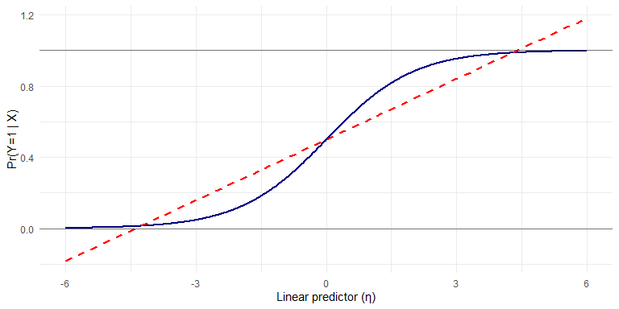
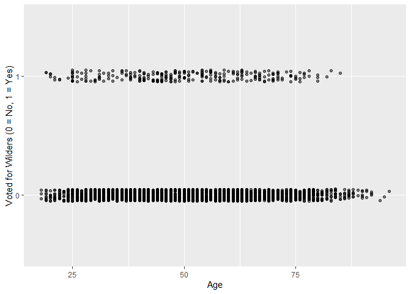
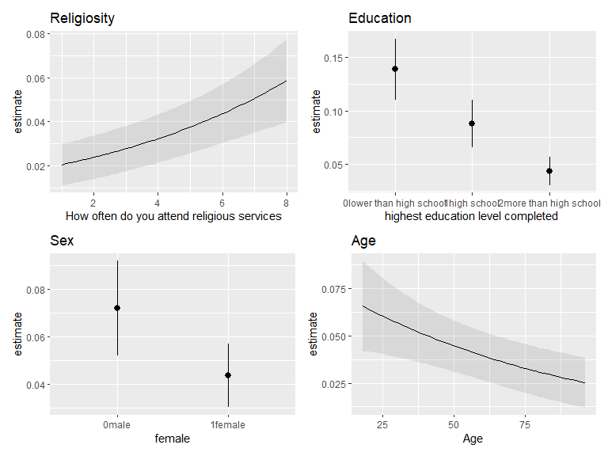

# Logistic Regression
Mauricio Garnier-Villarreal
2026-03-02

- [Introduction](#introduction)
- [LM vs GLM](#lm-vs-glm)
- [Logistic Regression](#logistic-regression)
  - [Interpreting Coefficients in Logistic
    Regression](#interpreting-coefficients-in-logistic-regression)
- [R Setup](#r-setup)
- [Data Import and Preparation](#data-import-and-preparation)
  - [Recode Variables](#recode-variables)
- [Descriptive statistics](#descriptive-statistics)
  - [Outcome Frequencies](#outcome-frequencies)
  - [Scatter Plot of Outcome vs. Age](#scatter-plot-of-outcome-vs-age)
  - [Descriptive Statistics for
    Predictors](#descriptive-statistics-for-predictors)
- [Logistic Regression Model](#logistic-regression-model)
  - [Extracting Coefficients](#extracting-coefficients)
  - [Nicely Formatted Tables with
    `parameters`](#nicely-formatted-tables-with-parameters)
  - [Overall Effect of Categorical
    Predictors](#overall-effect-of-categorical-predictors)
  - [Predicted Probabilities](#predicted-probabilities)
    - [Predicted Probability for a Specific
      Profile](#predicted-probability-for-a-specific-profile)
  - [Conditional Plots](#conditional-plots)
  - [Marginal Effects (Average Slope in
    Probability)](#marginal-effects-average-slope-in-probability)
  - [Differences in Probabilities Between
    Groups](#differences-in-probabilities-between-groups)
  - [Effect Size Transformations](#effect-size-transformations)
  - [Pseudo R‑Squared Measures](#pseudo-rsquared-measures)
  - [Model Comparison](#model-comparison)
    - [Likelihood Ratio Test (LRT)](#likelihood-ratio-test-lrt)
    - [Information Criteria (AIC, BIC)](#information-criteria-aic-bic)
      - [Confidence Intervals for IC
        Differences](#confidence-intervals-for-ic-differences)
  - [Confusion Matrix](#confusion-matrix)
  - [Conclusion](#conclusion)
- [References](#references)

# Introduction

Using linear regression for a binary outcome violates several key
assumptions of the ordinary least squares (OLS) model. First, linear
regression assumes that the dependent variable is continuous and can
take any real value, but a binary outcome is discrete and restricted to
only two values (0 and 1). This leads to predicted values that can fall
outside the meaningful $[0,1]$ probability range, producing impossible
predictions. Second, the assumption of normally distributed residuals is
violated because with a binary outcome, the errors are inherently
heteroscedastic and follow a binomial distribution rather than a normal
one. Moreover, the linear functional form implies that the effect of
predictors is constant across all values, whereas for a binary outcome
we typically expect a nonlinear S‑shaped relationship where changes in
probability are smaller near the extremes. These violations make OLS
regression inappropriate for binary data, necessitating alternatives
such as logistic regression, which is specifically designed to model
probabilities within the $[0,1]$ interval and accounts for the binomial
error structure.

In many cases we will be interested in dichotomous dependent variable
with vs.  responses, like Employed, Voted in the last election, Passed
an exam, or Migration.

When working with categorical response data, it is important to exercise
caution if you are considering categorizing a continuous variable, as
this practice can introduce several problems. Categorization often leads
to bias in estimates, magnifies differences between groups that may not
actually be distinct, and reduces the available variance in the data,
which in turn diminishes statistical power and can obscure meaningful
relationships. If categorization is necessary, it should only be done
when there is a clear and justifiable criterion—such as when groups are
significantly, qualitatively, or theoretically different from one
another. Otherwise, it is generally advisable to use variables in their
natural metric whenever possible, preserving the full information
contained in the data. An agnostic approach, where the variable metric
is chosen based on what best aligns with the research question rather
than convenience or convention, helps ensure that the analysis remains
faithful to the underlying phenomena being studied.

# LM vs GLM

The **General Linear Model** refers to the classical linear regression
framework in which the outcome variable $Y$ is assumed to follow a
normal distribution and the residuals are normally distributed. This
model takes the form
$Y = \beta_0 + \beta_1 X_1 + \dots + \beta_k X_k + \epsilon$, with
$\epsilon \sim N(0, \sigma^2)$. In contrast, the **Generalized Linear
Model (GLM)** generalizes this idea to response variables that are not
normally distributed, such as binary, count, or categorical outcomes.
GLM accomplishes this by retaining a linear predictor while allowing the
outcome to follow any distribution from the exponential family (e.g.,
binomial, Poisson, negative binomial) and connecting the linear
predictor to the expected value of the outcome through a link function.

Every GLM consists of three essential components:

1.  **Random component**: This specifies the probability distribution of
    the outcome variable $Y$. For example, in ordinary linear regression
    we have $Y \sim N(\mu, \sigma^2)$; for binary outcomes we use
    $Y \sim \text{Binomial}(n, p)$; for count data we might use
    $Y \sim \text{Poisson}(\lambda)$.
2.  **Systematic component**: This is the linear predictor
    $\eta = \beta_0 + \beta_1 X_1 + \dots + \beta_k X_k$, which combines
    the predictors linearly. No distributional assumptions are made
    about the $X$ variables.
3.  **Link function** $g(\cdot)$: This function connects the expected
    value of $Y$ (the random component) to the systematic component.
    Formally, $g(E(Y)) = \eta$, or equivalently $E(Y) = g^{-1}(\eta)$.
    For ordinary linear regression, the link function is the identity:
    $g(\mu) = \mu$. For logistic regression (binary outcome), the link
    is the logit function: $g(\mu) = \ln\left(\frac{\mu}{1-\mu}\right)$.
    Other common link functions include the probit, complementary
    log-log, and log links, each chosen to respect the measurement scale
    of the outcome.

Thus, the GLM framework provides a flexible and unified way to model
diverse data types while retaining the interpretability of linear
predictors.

# Logistic Regression

Logistic regression is used when the outcome variable $Y$ is binary
(e.g., success/failure, yes/no). In the Generalized Linear Model (GLM)
framework, logistic regression is characterized by:

- **Random component**: $Y$ follows a binomial distribution. For a
  single trial, this is the Bernoulli distribution:
  $Y \sim \text{Binomial}(n=1, p)$, where $p$ is the probability of a
  “success” (e.g., voting for Wilders).
- **Systematic component**: The linear predictor
  $\eta = \beta_0 + \beta_1 X_1 + \dots + \beta_k X_k$ combines the
  predictors linearly.
- **Link function**: Because $p$ is bounded between 0 and 1, we cannot
  model $p$ directly as a linear function of the predictors. Instead, we
  use the **logit link** function, which transforms the probability $p$
  to the log-odds scale (also called the logit of $p$):

$$
\text{logit}(p) = \ln\left(\frac{p}{1-p}\right) = \beta_0 + \beta_1 X_1 + \dots + \beta_k X_k
$$

The log-odds are unbounded (range $-\infty$ to $+\infty$), so they can
be modeled linearly. The odds themselves are $\frac{p}{1-p}$ and range
from $0$ to $+\infty$.

Alternatively, we can express the probability $p$ directly by applying
the inverse of the logit function (the logistic function):

$$
p = \frac{e^{\beta_0 + \beta_1 X_1 + \dots + \beta_k X_k}}{1 + e^{\beta_0 + \beta_1 X_1 + \dots + \beta_k X_k}}
$$

This creates an S‑shaped curve (the logistic curve) that ensures
predicted probabilities always lie between 0 and 1. The logistic
function is nonlinear in $X$, but the logit transformation linearizes
the relationship.

Below is a visualization of the logistic function (blue) compared to a
linear model (red). The linear model can produce probabilities outside
\[0,1\], while the logistic curve asymptotes at 0 and 1.

    `geom_smooth()` using formula = 'y ~ x'



The GLM framework unifies many models through the choice of random
component and link function, as summarized in the table below:

| **Model**  | **Random** | **Systematic** |  **Link**  |
|------------|:-----------|---------------:|:----------:|
| Regression | Normal     |          Mixed |  Identity  |
| ANOVA      | Normal     |    Categorical |  Identity  |
| Logistic   | Binomial   |          Mixed |   Logit    |
| Poisson    | Poisson    |          Mixed | Log-linear |

Logistic regression thus provides a principled way to model binary
outcomes while respecting the probabilistic nature of the response.

## Interpreting Coefficients in Logistic Regression

In logistic regression, the coefficients $\hat{\beta}$ represent the
change in the **log-odds** of the outcome for a one-unit increase in the
predictor, holding all other variables constant. For example, if
$\hat{\beta} = 0.5$, then a one-unit increase in $X$ is associated with
a 0.5 increase in the log-odds of $Y=1$. While mathematically precise,
the log-odds scale is not intuitively meaningful for most researchers or
readers. How much is a 0.5 increase in log-odds? It does not correspond
directly to a change in probability, and its interpretation depends on
where on the logistic curve the change occurs.

A more common and interpretable transformation is the **odds ratio
(OR)** , obtained by exponentiating the coefficient:
$OR = e^{\hat{\beta}}$. The odds ratio indicates the multiplicative
change in the odds of the outcome for a one-unit increase in the
predictor. Odds ratios range from 0 to $\infty$, with $OR = 1$ meaning
no effect (i.e., $\hat{\beta} = 0$). An $OR > 1$ indicates that as $X$
increases, the odds of $Y=1$ increase; an $OR < 1$ indicates decreasing
odds. For a change of $c$ units in $X$, the odds are multiplied by
$e^{c\hat{\beta}}$. For instance, if $\hat{\beta} = 0.5$, then
$OR \approx 1.65$, meaning a one-unit increase in $X$ raises the odds by
about 65%. If $\hat{\beta} = -0.5$, then $OR \approx 0.61$, meaning the
odds decrease by about 39%.

Despite their popularity, odds ratios can still be misleading if
interpreted as risk ratios, especially when the outcome is common. A
more directly interpretable approach is to work with **predicted
probabilities** $\hat{p}$. Using the inverse logit transformation, we
compute the probability of $Y=1$ for any combination of predictors:

$$
\hat{p} = \frac{e^{\hat{\beta}_0 + \hat{\beta}_1 X_1 + \dots + \hat{\beta}_k X_k}}{1 + e^{\hat{\beta}_0 + \hat{\beta}_1 X_1 + \dots + \hat{\beta}_k X_k}}
$$

Predicted probabilities are bounded between 0 and 1 and are expressed on
the probability scale, making them easy to communicate. For example, we
can say “a 30‑year‑old woman with high education and religiosity score
of 4 has a 4% predicted probability of voting for Wilders.”

To summarize the effect of a predictor across the sample, we often
compute **average marginal effects**, which measure the average change
in predicted probability for a one‑unit increase in a predictor, holding
other variables at their observed values. For a continuous predictor
like religiosity, the average marginal effect might be 0.015, meaning
that, on average, a one‑unit increase in religiosity raises the
probability of voting for Wilders by 1.5 percentage points. For a
categorical predictor like sex, we can compute the average difference in
predicted probabilities between groups (e.g., women vs. men). These
probability‑based interpretations are usually the most accessible for
substantive conclusions.

# R Setup

First, load the necessary libraries and set your working directory
(adjust the path to where your data file is located).

``` r
# Set working directory (modify this to your own path)
# setwd("~/path_to_your_data")

# Load required packages
library(summarytools)
library(marginaleffects)
library(effectsize)
library(caret)
library(DescTools)
library(ggplot2)
library(arm)
library(nonnest2)
library(MASS)
library(parameters)
library(patchwork)
library(rio)
library(car)
library(tidyr)
```

# Data Import and Preparation

We import the data file `logisticregression.sav` (SPSS format). The data
contain information on voters: whether they voted for Wilders
(`wilders`), age (`AGE`), gender (`female`), education level
(`education`), and religiosity (`religious`). We remove rows with
missing values and convert the outcome to a factor.

``` r
# Import data
dat <- import("logisticregression.sav")

# Remove missing values
dat <- drop_na(dat)

# Convert outcome to factor
dat$wilders <- as.factor(dat$wilders)

# View first rows
head(dat)
```

      female AGE religious wilders education
    1      0  18         8       0         1
    2      0  18         7       0         1
    3      1  18         5       0         0
    4      1  19         7       0         0
    5      1  19         6       0         1
    6      1  19         5       0         1

``` r
# Check dimensions
dim(dat)
```

    [1] 2460    5

## Recode Variables

We recode `female` into a factor with meaningful labels and also recode
`education` with meaningful labels. Here I add a number at the begining
of the label to control the order of the categorial levels.

``` r
dat$education <- recode(dat$education, "0 = '0lower than high school';
                        1 = '1high school'; 
                        2 = '2more than high school' ")
dat$Sex <- recode(dat$female, "0='0male'; 1='1female'")
```

# Descriptive statistics

Let’s explore the distribution of the outcome and the predictors.

## Outcome Frequencies

``` r
freq(dat$wilders)   # 11% voted for Wilders
```

    Frequencies  
    dat$wilders  
    Type: Factor  

                  Freq   % Valid   % Valid Cum.   % Total   % Total Cum.
    ----------- ------ --------- -------------- --------- --------------
              0   2183     88.74          88.74     88.74          88.74
              1    277     11.26         100.00     11.26         100.00
           <NA>      0                               0.00         100.00
          Total   2460    100.00         100.00    100.00         100.00

Here we see that about 11% of the sample voted for Wilders

## Scatter Plot of Outcome vs. Age

Since the outcome is binary, a scatter plot with jittered points can
give a rough idea of how many subjects at each level of Age

``` r
ggplot(dat, aes(x = AGE, y = wilders)) +
  geom_point(position = position_jitter(height = 0.05, width = 0), alpha = 0.5) +
  labs(y = "Voted for Wilders (0 = No, 1 = Yes)", 
       x = "Age")
```



## Descriptive Statistics for Predictors

First we use the `freq()` function for frequency tables for the
categorical predictors. And the `decr()` function for descriptive
information for the continuous predictors

``` r
freq(dat[, c("education", "Sex")])
```

    Frequencies  
    dat$education  
    Label: highest education level completed  
    Type: Character  

                                    Freq   % Valid   % Valid Cum.   % Total   % Total Cum.
    ----------------------------- ------ --------- -------------- --------- --------------
          0lower than high school    834     33.90          33.90     33.90          33.90
                     1high school    733     29.80          63.70     29.80          63.70
           2more than high school    893     36.30         100.00     36.30         100.00
                             <NA>      0                               0.00         100.00
                            Total   2460    100.00         100.00    100.00         100.00

    dat$Sex  
    Label: female  
    Type: Character  

                    Freq   % Valid   % Valid Cum.   % Total   % Total Cum.
    ------------- ------ --------- -------------- --------- --------------
            0male   1175     47.76          47.76     47.76          47.76
          1female   1285     52.24         100.00     52.24         100.00
             <NA>      0                               0.00         100.00
            Total   2460    100.00         100.00    100.00         100.00

``` r
descr(dat[, c("AGE", "religious")])
```

    Descriptive Statistics  
    dat  
    N: 2460  

                            AGE   religious
    ----------------- --------- -----------
                 Mean     51.55        5.71
              Std.Dev     16.52        2.10
                  Min     18.00        1.00
                   Q1     39.00        5.00
               Median     51.00        6.00
                   Q3     64.00        8.00
                  Max     96.00        8.00
                  MAD     19.27        1.48
                  IQR     25.00        3.00
                   CV      0.32        0.37
             Skewness      0.11       -0.68
          SE.Skewness      0.05        0.05
             Kurtosis     -0.78       -0.54
              N.Valid   2460.00     2460.00
                    N   2460.00     2460.00
            Pct.Valid    100.00      100.00

# Logistic Regression Model

We fit a model predicting `wilders` from age, sex, education, and
religiosity. We use the `glm()` function and specify
`family = binomial(link = "logit")`. Where `glm()` stands for
*generalized linear models*, and with
`family = binomial(link = "logit")` we specify the random component as
*binomial* distribution, and the link function as *logit* link.

``` r
regf <- glm(wilders ~ AGE + Sex + education + religious,
            data = dat, family = binomial(link = "logit"))
```

We can see the default `summary()`, as it displays the coefficients in
log-odds units.

``` r
summary(regf)
```


    Call:
    glm(formula = wilders ~ AGE + Sex + education + religious, family = binomial(link = "logit"), 
        data = dat)

    Coefficients:
                                     Estimate Std. Error z value Pr(>|z|)    
    (Intercept)                     -1.566622   0.362074  -4.327 1.51e-05 ***
    AGE                             -0.012796   0.004321  -2.962  0.00306 ** 
    Sex1female                      -0.531007   0.132095  -4.020 5.82e-05 ***
    education1high school           -0.515754   0.159539  -3.233  0.00123 ** 
    education2more than high school -1.262089   0.176793  -7.139 9.42e-13 ***
    religious                        0.156373   0.034254   4.565 4.99e-06 ***
    ---
    Signif. codes:  0 '***' 0.001 '**' 0.01 '*' 0.05 '.' 0.1 ' ' 1

    (Dispersion parameter for binomial family taken to be 1)

        Null deviance: 1731.4  on 2459  degrees of freedom
    Residual deviance: 1636.3  on 2454  degrees of freedom
    AIC: 1648.3

    Number of Fisher Scoring iterations: 5

## Extracting Coefficients

- **Log-odds coefficients**:

``` r
coef(regf)
```

                        (Intercept)                             AGE 
                        -1.56662232                     -0.01279621 
                         Sex1female           education1high school 
                        -0.53100712                     -0.51575423 
    education2more than high school                       religious 
                        -1.26208853                      0.15637311 

- **Odds ratios** (exponentiated coefficients):

``` r
exp(coef(regf))
```

                        (Intercept)                             AGE 
                          0.2087491                       0.9872853 
                         Sex1female           education1high school 
                          0.5880125                       0.5970501 
    education2more than high school                       religious 
                          0.2830622                       1.1692624 

## Nicely Formatted Tables with `parameters`

``` r
parameters(regf, digits = 3)
```

    Parameter                          | Log-Odds |    SE |           95% CI
    ------------------------------------------------------------------------
    (Intercept)                        |   -1.567 | 0.362 | [-2.284, -0.864]
    AGE                                |   -0.013 | 0.004 | [-0.021, -0.004]
    Sex [1female]                      |   -0.531 | 0.132 | [-0.792, -0.273]
    education [1high school]           |   -0.516 | 0.160 | [-0.831, -0.205]
    education [2more than high school] |   -1.262 | 0.177 | [-1.615, -0.921]
    religious                          |    0.156 | 0.034 | [ 0.090,  0.225]

    Parameter                          |      z |      p
    ----------------------------------------------------
    (Intercept)                        | -4.327 | < .001
    AGE                                | -2.962 | 0.003 
    Sex [1female]                      | -4.020 | < .001
    education [1high school]           | -3.233 | 0.001 
    education [2more than high school] | -7.139 | < .001
    religious                          |  4.565 | < .001


    Uncertainty intervals (profile-likelihood) and p-values (two-tailed)
      computed using a Wald z-distribution approximation.


    The model has a log- or logit-link. Consider using `exponentiate =
      TRUE` to interpret coefficients as ratios.

Interpretation (log-odds): - **Age**: For a one‑year increase in age,
the log‑odds of voting for Wilders decrease by 0.013, holding other
variables constant. - **Sex (female vs. male)**: Being female decreases
the log‑odds by 0.532, holding other variables constant. -
**Education**: Compared to low education, middle education decreases
log‑odds by 0.516; high education decreases by 1.26, holding other
variables constant. - **Religious**: A one‑unit increase in religiosity
increases log‑odds by 0.16, holding other variables constant.

Now with odds ratios (exponentiate = TRUE):

``` r
parameters(regf, exponentiate = TRUE, digits = 3)
```

    Parameter                          | Odds Ratio |    SE |         95% CI
    ------------------------------------------------------------------------
    (Intercept)                        |      0.209 | 0.076 | [0.102, 0.422]
    AGE                                |      0.987 | 0.004 | [0.979, 0.996]
    Sex [1female]                      |      0.588 | 0.078 | [0.453, 0.761]
    education [1high school]           |      0.597 | 0.095 | [0.436, 0.815]
    education [2more than high school] |      0.283 | 0.050 | [0.199, 0.398]
    religious                          |      1.169 | 0.040 | [1.095, 1.252]

    Parameter                          |      z |      p
    ----------------------------------------------------
    (Intercept)                        | -4.327 | < .001
    AGE                                | -2.962 | 0.003 
    Sex [1female]                      | -4.020 | < .001
    education [1high school]           | -3.233 | 0.001 
    education [2more than high school] | -7.139 | < .001
    religious                          |  4.565 | < .001


    Uncertainty intervals (profile-likelihood) and p-values (two-tailed)
      computed using a Wald z-distribution approximation.

Interpretation (odds ratios): - **Age**: Each additional year multiplies
the odds by 0.987 (i.e., reduces odds by about 1.3%), holding other
variables constant. - **Sex (female)**: The odds for women are 0.588
times the odds for men (41.2% lower), holding other variables
constant. - **Education**: Middle education odds are 0.597 times than
low education; high education odds are 0.283 times than low education,
holding other variables constant. - **Religious**: A one‑unit increase
multiplies the odds by 1.17, holding other variables constant.

## Overall Effect of Categorical Predictors

Use `Anova()` from the `car` package to test the NHST effect of each
predictor. When we have categorical predictors this is helpful to do the
test for the overall variable, instead of a single group comparison

``` r
Anova(regf, type = 2)
```

    Analysis of Deviance Table (Type II tests)

    Response: wilders
              LR Chisq Df Pr(>Chisq)    
    AGE          8.855  1   0.002922 ** 
    Sex         16.415  1  5.088e-05 ***
    education   56.308  2  5.926e-13 ***
    religious   22.472  1  2.133e-06 ***
    ---
    Signif. codes:  0 '***' 0.001 '**' 0.01 '*' 0.05 '.' 0.1 ' ' 1

We reject the null hypothesis of no relation with *voting for Wilders*
($p < .05$).

We can also use the `parameters()` function around `Anova()` to get a
cleaner table

``` r
parameters(Anova(regf, type = 2))
```

    Parameter |  Chi2 | df |      p
    -------------------------------
    AGE       |  8.86 |  1 | 0.003 
    Sex       | 16.42 |  1 | < .001
    education | 56.31 |  2 | < .001
    religious | 22.47 |  1 | < .001

    Anova Table (Type 2 tests)

## Predicted Probabilities

### Predicted Probability for a Specific Profile

We can compute the predicted probability for a 30‑year‑old woman with
high education (education = 2) and religiosity = 4.

**Manual calculation using log‑odds:**

``` r
cc <- coef(regf)
lo <- cc["(Intercept)"] + 30*cc["AGE"] + 1*cc["Sex1female"] + 
  0*cc["education1high school"] + 
  1*cc["education2more than high school"] + 4*cc["religious"]
lo   # log-odds
```

    (Intercept) 
      -3.118112 

``` r
invlogit(lo)   # probability
```

    (Intercept) 
     0.04236631 

Here we first build the prediction from the model parameters (`cc`) in
the log-odds metric (`lo`). This is the same as in linear regression,
the difference is that this prediction is in a metric hard to interpret.
Then we put the log-odds prediction into the inverse logit function
(`invlogit()`), this function transforms the logit link function back to
the probability metric. Just like in this equation

$$
\hat{p} = \frac{e^{\hat{\beta}_0 + \hat{\beta}_1 X_1 + \dots + \hat{\beta}_k X_k}}{1 + e^{\hat{\beta}_0 + \hat{\beta}_1 X_1 + \dots + \hat{\beta}_k X_k}}
$$

This is the same as

``` r
exp(lo)/(1+exp(lo))
```

    (Intercept) 
     0.04236631 

Here we see that according to our model, a 30‑year‑old woman with high
education (education = 2) and religiosity = 4 has a 4% chance of voting
for Widlers.

**Using `avg_predictions()` from `marginaleffects`:** we need to give
the logistic regression model first, then in the `newdata` argument we
specify the set of conditions of the predictions for which we want the
predicted probability. And with `type = "response"` we ask for the
prediction to be in the metric of the response variable, in this case it
would be a probability

``` r
avg_predictions(regf, type = "response",
                newdata = datagrid(religious = 4, AGE = 30, Sex = "1female", education = "2more than high school"))
```


     religious AGE     Sex              education Estimate Std. Error    z Pr(>|z|)
             4  30 1female 2more than high school   0.0424    0.00773 5.48   <0.001
        S  2.5 % 97.5 %
     24.5 0.0272 0.0575

    Type: response

The probability is about 4%.

We can also ak for Predicted Probabilities Across a Range of
Religiosity, at the average values of other predictors:

``` r
avg_predictions(regf, variables = list(religious = 0:10))
```


     religious Estimate Std. Error     z Pr(>|z|)     S  2.5 % 97.5 %
             0   0.0485    0.01008  4.81   <0.001  19.3 0.0287 0.0683
             1   0.0561    0.00986  5.69   <0.001  26.3 0.0368 0.0755
             2   0.0649    0.00937  6.92   <0.001  37.7 0.0465 0.0832
             3   0.0748    0.00860  8.69   <0.001  58.0 0.0579 0.0917
             4   0.0861    0.00762 11.31   <0.001  96.0 0.0712 0.1010
             5   0.0989    0.00665 14.87   <0.001 163.7 0.0859 0.1119
             6   0.1133    0.00638 17.75   <0.001 231.8 0.1008 0.1258
             7   0.1294    0.00774 16.73   <0.001 206.2 0.1143 0.1446
             8   0.1474    0.01093 13.48   <0.001 135.2 0.1260 0.1688
             9   0.1673    0.01560 10.72   <0.001  86.7 0.1367 0.1979
            10   0.1892    0.02147  8.82   <0.001  59.5 0.1472 0.2313

    Type: response

## Conditional Plots

We can use the `plot_predictions()` to visualize the effect of each
predictor while holding others constant. And because we loaded the
`patchwork` package we can set all the plots in a grid

``` r
# Religiosity
p1 <- plot_predictions(regf, type = "response", 
                       condition = "religious") + 
  labs(title = "Religiosity")

# Education
p2 <- plot_predictions(regf, type = "response", 
                       condition = "education") + 
  labs(title = "Education")

# Sex
p3 <- plot_predictions(regf, type = "response",
                       condition = "Sex") + 
  labs(title = "Sex")

# Age
p4 <- plot_predictions(regf, type = "response", 
                       condition = "AGE") + 
  labs(title = "Age")

# Combine with patchwork
(p1 + p2) / (p3 + p4)
```



## Marginal Effects (Average Slope in Probability)

The average marginal effect of religiosity (change in probability per
unit increase in religiosity):

``` r
avg_slopes(regf, variables = "religious")
```


     Estimate Std. Error    z Pr(>|z|)    S   2.5 % 97.5 %
        0.015     0.0033 4.55   <0.001 17.5 0.00853 0.0215

    Term: religious
    Type: response
    Comparison: dY/dX

Interpretation: A one‑unit increase in religiosity raises the
probability of voting for Wilders by about 1.5 percentage points, on
average.

## Differences in Probabilities Between Groups

For categorical predictors, we can estimate the group comparisons in the
metric of difference in *predicted probabilities*. For education
(pairwise comparisons):

``` r
avg_comparisons(regf, variables = list(education = "pairwise"))
```


                                             Contrast Estimate Std. Error     z
     1high school - 0lower than high school            -0.0619     0.0190 -3.25
     2more than high school - 0lower than high school  -0.1183     0.0166 -7.14
     2more than high school - 1high school             -0.0564     0.0137 -4.11
     Pr(>|z|)    S   2.5 %  97.5 %
      0.00115  9.8 -0.0992 -0.0246
      < 0.001 39.9 -0.1507 -0.0858
      < 0.001 14.6 -0.0833 -0.0295

    Term: education
    Type: response

For sex, as it is a binary variable it is not necessary to specify
`"pairwise"`, as there is only 1 possible comparison to make/ So, if we
specify `variables = "Sex"`, we will get the average difference in
*predicted probabilities* between men and women

``` r
avg_comparisons(regf, type = "response", 
                variables = "Sex")
```


     Estimate Std. Error     z Pr(>|z|)    S  2.5 %  97.5 %
      -0.0511     0.0127 -4.02   <0.001 14.1 -0.076 -0.0262

    Term: Sex
    Type: response
    Comparison: 1female - 0male

## Effect Size Transformations

Transform odds ratios to Cohen’s d (for categorical predictors) or
Pearson’s r (for continuous predictors). We can transform the Odds Ratio
into other measures of effect size, two that I recommend are to
transform it into `Pearson r` for continuous predictors, and into
`Cohen's d` for categorical predictors. This way they would be in
commonly used metrics of effect size.

We can do this with the `oddsratio_to_d()` and `oddsratio_to_r()`
functions, where we first provide the respective OR, and it it then
transformed into the desired metric `_to_d()` of `_to_r()`

``` r
# Odds ratios (without intercept)
or_values <- exp(coef(regf)[-1])
or_values
```

                                AGE                      Sex1female 
                          0.9872853                       0.5880125 
              education1high school education2more than high school 
                          0.5970501                       0.2830622 
                          religious 
                          1.1692624 

``` r
# To Cohen's d
oddsratio_to_d(or_values[c("Sex1female", 
                           "education1high school", 
                           "education2more than high school")])
```

                         Sex1female           education1high school 
                         -0.2927596                      -0.2843502 
    education2more than high school 
                         -0.6958259 

``` r
# To Pearson's r
oddsratio_to_r(or_values[c("AGE",
                           "religious")])
```

             AGE    religious 
    -0.003527439  0.043066514 

Here we see that between men and women, the OR equals a Cohen
$d = -0.29$, between low education and mid education would be
$d = -0.28$, between low education and high education would be
$d = -0.69$. We can extrapolate the Cohen d between mid and high
education as $d = -0.69 - -0.28 = -0.41$.

For the continuous predictors, we see that the OR for Age are equivalent
to $r = -0.0035$, and for Religiousness wit would be $r = 0.043$.

## Pseudo R‑Squared Measures

Several pseudo R² measures have been developed to provide a sense of
model fit in logistic regression, though none directly correspond to the
R² from ordinary least squares regression. Each of them try to
approximate the idea of overall model effect size

**McFadden’s R²** is based on the log-likelihood of the fitted model
relative to a null model (intercept only). It reflects the improvement
in model fit. Values tend to be much lower than OLS R², with values
between 0.2 and 0.4 often considered excellent fit.

$$
McFadden = \frac{-2LL_{null} - (-2LL_{k}) }{-2LL_{null}}
$$

**Cox and Snell R²** adjusts the likelihood ratio to have a maximum
value less than 1. Because its upper bound is less than 1, it can be
difficult to interpret, especially when the outcome is highly
imbalanced.

$$
CoxSnell = 1-exp(-(-2LL_{null}-(-2LL_{k})))/n
$$

**Nagelkerke R²** rescales the Cox and Snell R² to have a maximum value
of 1, making it more comparable to OLS R². It divides the Cox and Snell
value by its theoretical maximum, providing a more intuitive measure of
fit. In our model, Nagelkerke R² = 0.07, suggesting a modest improvement
over the null model.

$$
Nagelkerke = \frac{CoxSnell \ R^2}{1-exp(-(-2LL_{null})/n)}
$$

**Tjur’s R²** (also called the coefficient of discrimination) is
calculated as the average predicted probability for observations with
$Y=1$ minus the average predicted probability for observations with
$Y=0$. It directly measures how well the model separates the two outcome
groups. In our model, Tjur’s R² = 0.04, meaning the predicted
probabilities for those who voted for Wilders are, on average, 4
percentage points higher than for those who did not.

$$
Tjur = \left| E(\hat{Y} = 1| Y = 1) - E(\hat{Y} = 1| Y = 0)\right|
$$

All of these can be obtained using the `PseudoR2()` function from the
`DescTools` package.

``` r
PseudoR2(regf, 
         which = c("McFadden", "CoxSnell", "Nagelkerke", "Tjur"))
```

      McFadden   CoxSnell Nagelkerke       Tjur 
    0.05493341 0.03792644 0.07505456 0.04217732 

From these measures, we recommend to use Nagelkerke R² and Tjur’s R².

## Model Comparison

We might also be interested in comparing logistic regression models, for
this we will present two ways of model comparison.

### Likelihood Ratio Test (LRT)

First, we will go over the Likelihood Ratio Test (LRT), this compares
the models log-likelihood between models. This follows a \$^2 = ^2_1 -
^2_2 \$ distribution with $\Delta df = df_1 - df_2$. We can do this
comparison with `anova()` function

Compare the full model against a null model (intercept only).

``` r
reg0 <- glm(wilders ~ 1, data = dat, family = binomial(link = "logit"))
anova(reg0, regf, test = "Chisq")
```

    Analysis of Deviance Table

    Model 1: wilders ~ 1
    Model 2: wilders ~ AGE + Sex + education + religious
      Resid. Df Resid. Dev Df Deviance  Pr(>Chi)    
    1      2459     1731.5                          
    2      2454     1636.3  5   95.114 < 2.2e-16 ***
    ---
    Signif. codes:  0 '***' 0.001 '**' 0.01 '*' 0.05 '.' 0.1 ' ' 1

Compare against a model without education:

``` r
reg1 <- glm(wilders ~ AGE + female + religious,
            data = dat, family = binomial(link = "logit"))
anova(reg1, regf, test = "Chisq")
```

    Analysis of Deviance Table

    Model 1: wilders ~ AGE + female + religious
    Model 2: wilders ~ AGE + Sex + education + religious
      Resid. Df Resid. Dev Df Deviance  Pr(>Chi)    
    1      2456     1692.6                          
    2      2454     1636.3  2   56.308 5.926e-13 ***
    ---
    Signif. codes:  0 '***' 0.001 '**' 0.01 '*' 0.05 '.' 0.1 ' ' 1

If we reject the null hypothesis between models, we generally choose the
“larger” model (the one with more parameters). If we fail to reject the
null hypothesis between models, we generally choose the “smaller” model
(the one with less parameters). Both tests show that the full model fits
significantly better ($p < .05$).

### Information Criteria (AIC, BIC)

We can also use relative measures of fit based on how much information
we loose by using a model.

The most commonly used information criteria are: - Akaike Information
Criteria (**AIC**): $-2\hat{l}_{m}+2k$. Approximation of the
out-of-sample predictive accuracy - Bayesian Information Criteria
(**BIC**): $-2\hat{l}_{m}+k\ln(n)$. Approximation of the Bayes factor
comparison between 2 models

The lower the AIC and the BIC the better our model is. By themselves
they do not say a thing $\to$ We use them to *compare* models!

Compare models using AIC and BIC (lower is better). Here we set the ICs
in a table to check which model has the lowest

``` r
ic <- matrix(c(AIC(reg0), BIC(reg0),
               AIC(reg1), BIC(reg1),
               AIC(regf), BIC(regf)),
             ncol = 2, byrow = TRUE)
colnames(ic) <- c("AIC", "BIC")
rownames(ic) <- c("Null Model", "Model without education", "Full Model")
ic
```

                                 AIC      BIC
    Null Model              1733.448 1739.256
    Model without education 1700.642 1723.874
    Full Model              1648.334 1683.181

The full model has the lowest AIC and BIC, so it is the preferred model

#### Confidence Intervals for IC Differences

Use `icci()` from the `nonnest2` package to test whether the difference
in IC between models is significant. By testing the Confidence Interval
of the IC difference between models

``` r
# Null vs. Model without education
icci(reg0, reg1)
```


    Model 1 
     Class: glm 
     Call: glm(formula = wilders ~ 1, family = binomial(link = "logit"), ...
     AIC: 1733.448 
     BIC: 1739.256 

    Model 2 
     Class: glm 
     Call: glm(formula = wilders ~ AGE + female + religious, family = binomial(link = "logit"), ...
     AIC: 1700.642 
     BIC: 1723.874 

    95% Confidence Interval of AIC difference (AICdiff = AIC1 - AIC2) 
      7.013 < AICdiff < 58.599

    95% Confidence Interval of BIC difference (BICdiff = BIC1 - BIC2) 
      -10.411 < BICdiff < 41.175

``` r
# Model without education vs. Full model
icci(reg1, regf)
```


    Model 1 
     Class: glm 
     Call: glm(formula = wilders ~ AGE + female + religious, family = binomial(link = "logit"), ...
     AIC: 1700.642 
     BIC: 1723.874 

    Model 2 
     Class: glm 
     Call: glm(formula = wilders ~ AGE + Sex + education + religious, family = binomial(link = "logit"), ...
     AIC: 1648.334 
     BIC: 1683.181 

    95% Confidence Interval of AIC difference (AICdiff = AIC1 - AIC2) 
      23.560 < AICdiff < 81.057

    95% Confidence Interval of BIC difference (BICdiff = BIC1 - BIC2) 
      11.944 < BICdiff < 69.441

If the confidence interval for the difference does not include zero, the
models differ significantly.

## Confusion Matrix

As the logistic regression is a model type that predicts a categorical
variable, we can also evaluate the classification accuracy. This is how
accurate are the models predicted category, compared to the observed
data. We need to choose a cutoff (here we use 0.3, but 0.5 is common).

First we will save the model predicted probability of 1 (Voting for
Wilders in this example). Then we choose a cut off point, in this case
($P(Y = 1) = 0.3$), so that someone that had a predicted probability of
voting for Wilders equal or higher than $0.3$ we will classified them as
$Vote_{pred} = 1$, while if the predicted probability of voting for
Wilders is lower than $0.3$ we will classified them as
$Vote_{pred} = 0$.

Then we will use the observed and predicted variables win the
`confusionMatrix()` function to estimate the classification accuracy
measures

``` r
# Predicted probabilities
dat$pred_prob <- predict(regf, type = "response")

# Convert to predicted class (using cutoff 0.3)
cut_off <- 0.3
dat$wilders_pred <- as.factor(ifelse(dat$pred_prob > cut_off, 1, 0))

# Confusion matrix
confusionMatrix(dat$wilders_pred, dat$wilders)
```

    Confusion Matrix and Statistics

              Reference
    Prediction    0    1
             0 2167  269
             1   16    8
                                              
                   Accuracy : 0.8841          
                     95% CI : (0.8708, 0.8965)
        No Information Rate : 0.8874          
        P-Value [Acc > NIR] : 0.7081          
                                              
                      Kappa : 0.0358          
                                              
     Mcnemar's Test P-Value : <2e-16          
                                              
                Sensitivity : 0.99267         
                Specificity : 0.02888         
             Pos Pred Value : 0.88957         
             Neg Pred Value : 0.33333         
                 Prevalence : 0.88740         
             Detection Rate : 0.88089         
       Detection Prevalence : 0.99024         
          Balanced Accuracy : 0.51078         
                                              
           'Positive' Class : 0               
                                              

This function provides several measures, here we will focus on three -
**Overall accuracy**: 88% - **Sensitivity** (true positive rate for 0s):
99% - **Specificity** (true positive rate for 1s): 2% (the model rarely
predicts a “1”)

In this example we see that the model mostly classify “0s” correctly,
but it is bad at properly classifying “1s” correctly.

## Conclusion

This tutorial covered the essential steps for conducting logistic
regression in R, from data preparation to model interpretation and
evaluation. Logistic regression is a powerful tool for binary outcomes,
and understanding coefficients in both log‑odds and probability scales
is key to meaningful interpretation.

# References

Agresti, A. (2019). An introduction to categorical data analysis (Third
edition). John Wiley & Sons.
