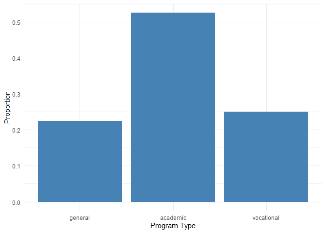
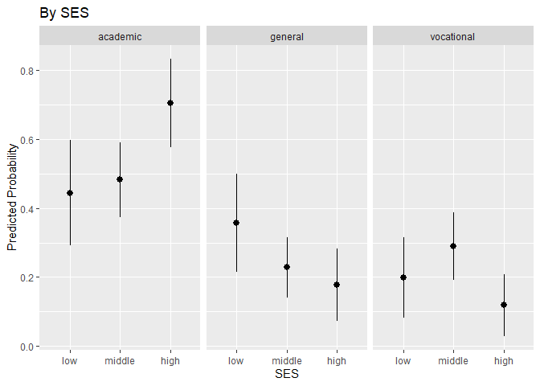
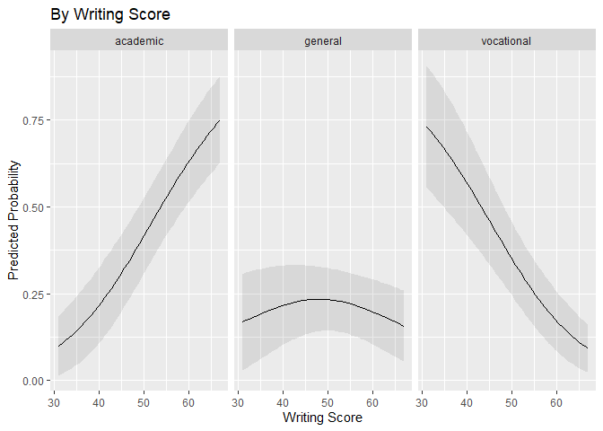
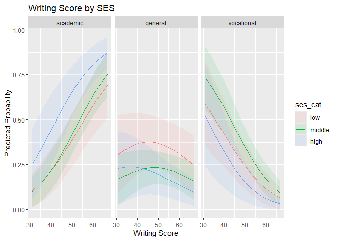

# Multinomial Logistic Regression
Mauricio Garnier-Villarreal
2026-03-31

- [<span class="toc-section-number">1</span>
  Introduction](#introduction)
- [<span class="toc-section-number">2</span> Recap of Binary Logistic
  Regression](#recap-of-binary-logistic-regression)
- [<span class="toc-section-number">3</span> Why Multinomial
  Models?](#why-multinomial-models)
- [<span class="toc-section-number">4</span> Example
  Dataset](#example-dataset)
- [<span class="toc-section-number">5</span> Multinomial Logistic
  Regression Model](#multinomial-logistic-regression-model)
  - [<span class="toc-section-number">5.1</span>
    Estimation](#estimation)
  - [<span class="toc-section-number">5.2</span>
    Interpretation](#interpretation)
  - [<span class="toc-section-number">5.3</span> Fitting a Multinomial
    Model in R](#fitting-a-multinomial-model-in-r)
    - [<span class="toc-section-number">5.3.1</span> Odds Ratios
      (Relative Risk Ratios)](#odds-ratios-relative-risk-ratios)
    - [<span class="toc-section-number">5.3.2</span> Changing the
      Baseline](#changing-the-baseline)
  - [<span class="toc-section-number">5.4</span> Predicted
    Probabilities](#predicted-probabilities)
    - [<span class="toc-section-number">5.4.1</span> Average Predictions
      by SES](#average-predictions-by-ses)
    - [<span class="toc-section-number">5.4.2</span> Predictions Across
      Writing Score](#predictions-across-writing-score)
    - [<span class="toc-section-number">5.4.3</span> Conditional
      Plots](#conditional-plots)
  - [<span class="toc-section-number">5.5</span> Marginal
    Effects](#marginal-effects)
    - [<span class="toc-section-number">5.5.1</span> Average Slope for
      Writing Score](#average-slope-for-writing-score)
    - [<span class="toc-section-number">5.5.2</span> Pairwise
      Comparisons for SES](#pairwise-comparisons-for-ses)
  - [<span class="toc-section-number">5.6</span> Confusion
    Matrix](#confusion-matrix)
  - [<span class="toc-section-number">5.7</span> Pseudo
    R‑Squared](#pseudo-rsquared)
  - [<span class="toc-section-number">5.8</span> Model
    Comparison](#model-comparison)
    - [<span class="toc-section-number">5.8.1</span> Likelihood Ratio
      Tests](#likelihood-ratio-tests)
    - [<span class="toc-section-number">5.8.2</span> Information
      Criteria](#information-criteria)
  - [<span class="toc-section-number">5.9</span> Assumptions of
    Multinomial Logistic
    Regression](#assumptions-of-multinomial-logistic-regression)
  - [<span class="toc-section-number">5.10</span> Pros and
    Cons](#pros-and-cons)
  - [<span class="toc-section-number">5.11</span> What to
    Report](#what-to-report)
  - [<span class="toc-section-number">5.12</span>
    Conclusion](#conclusion)
- [<span class="toc-section-number">6</span> References](#references)

# Introduction

In this tutorial we extend binary logistic regression to situations
where the outcome variable has more than two categories. When the
categories are **nominal** (no natural order) or **ordinal** (ordered
categories), we need a model that can handle multiple response options.
Multinomial logistic regression is the most common approach for nominal
outcomes. We will cover:

- The motivation for multinomial models
- The mathematical formulation
- Interpretation of coefficients, odds ratios, predicted probabilities,
  and marginal effects
- Implementation in R using the `nnet` package
- Model fit assessment and assumptions

We will use a dataset on high school students’ choice of academic
program (general, academic, vocational) to illustrate the methods.

# Recap of Binary Logistic Regression

Binary logistic regression models the probability of a binary outcome
$Y$ (coded 0/1) as a function of predictors. The model is:

$$
p = \frac{e^{\beta_0 + \beta_1 X_1 + \dots + \beta_k X_k}}{1 + e^{\beta_0 + \beta_1 X_1 + \dots + \beta_k X_k}}
$$

Equivalently, the log-odds (logit) of the probability has a linear
relation to the systematic component of the **Generalized linear
model**:

$$
\log\left(\frac{p}{1-p}\right) = \beta_0 + \beta_1 X_1 + \dots + \beta_k X_k
$$

- Coefficients $\beta$ represent the change in log-odds for a one-unit
  increase in the predictor.
- Exponentiated coefficients $e^\beta$ are **odds ratios**.
- Predicted probabilities $\hat{p}$ are obtained via the inverse logit
  transformation.
- Model fit can be assessed with likelihood ratio tests, pseudo‑$R^2$,
  and information criteria (AIC, BIC).

# Why Multinomial Models?

When the dependent variable has more than two categories (e.g., choice
of program, mode of transport, political party), binary logistic
regression is insufficient. The categories may be:

- **Nominal**: no inherent order. Examples: field of study, type of
  contract.
- **Ordinal**: ordered categories. Examples: Likert scales,
  socioeconomic status.

Multinomial logistic regression handles nominal outcomes by estimating a
set of binary logistic regressions comparing each category to a baseline
category. Ordinal outcomes can be modeled with proportional odds models
(not covered here), but multinomial logistic regression is also
applicable (though it ignores ordering).

# Example Dataset

We use the `hsbdemo` dataset (from the UCLA IDRE website) containing
variables on high school students: their chosen program type (`prog`:
general, academic, vocational), socioeconomic status (`ses`: low,
middle, high), and writing score (`write`). We will examine whether SES
and writing score predict program choice.

``` r
# Load required packages
library(rio)
library(nnet)
library(parameters)
library(marginaleffects)
library(ggplot2)
library(DescTools)
library(caret)
```

    Loading required package: lattice


    Attaching package: 'caret'

    The following objects are masked from 'package:DescTools':

        MAE, RMSE

    The following object is masked from 'package:parameters':

        compare_models

``` r
# Import data
dat <- import("hsbdemo.dta")   # ensure the file is in your working directory
dat <- dat[complete.cases(dat), ]   # remove missing

# Relevel factors for clarity
dat$ses_cat <- factor(dat$ses, 
                      levels = 1:3, 
                      labels = c("low", "middle", "high"))
dat$prog <- factor(dat$prog, 
                   levels = 1:3, 
                   labels = c("general", "academic", "vocational"))

# View first rows
head(dat)
```

       id female ses schtyp       prog read write math science socst honors awards
    1  45      1   1      1 vocational   34    35   41      29    26      0      0
    2 108      0   2      1    general   34    33   41      36    36      0      0
    3  15      0   3      1 vocational   39    39   44      26    42      0      0
    4  67      0   1      1 vocational   37    37   42      33    32      0      0
    5 153      0   2      1 vocational   39    31   40      39    51      0      0
    6  51      1   3      1    general   42    36   42      31    39      0      0
      cid ses_cat
    1   1     low
    2   1  middle
    3   1    high
    4   1     low
    5   1  middle
    6   1    high

Let’s examine the distribution of the outcome:

``` r
ggplot(dat, aes(x = prog)) +
  geom_bar(aes(y = after_stat(prop), group = 1), fill = "steelblue") +
  labs(y = "Proportion", x = "Program Type") +
  theme_minimal()
```



# Multinomial Logistic Regression Model

The multinomial logistic regression extends the binary logit model by
estimating a separate binary logit for each non‑baseline category versus
the baseline. Suppose the outcome $Y$ has $J$ categories, and we choose
category $J$ as the baseline. Then for $j = 1, \dots, J-1$:

$$
\log\left(\frac{P(Y = j \mid X)}{P(Y = J \mid X)}\right) = \alpha_j + \beta_{j1} X_1 + \dots + \beta_{jk} X_k
$$

This is a set of $J-1$ equations. The probabilities for each category
sum to 1, and we can obtain the predicted probabilities via the softmax
function:

$$
P(Y = j \mid X) = \frac{e^{\alpha_j + \beta_{j1} X_1 + \dots + \beta_{jk} X_k}}{\sum_{m=1}^J e^{\alpha_m + \beta_{m1} X_1 + \dots + \beta_{mk} X_k}}
$$

For the baseline category $J$, we set $\alpha_J = 0$ and all
$\beta_{J} = 0$.

## Estimation

Parameters are estimated by maximum likelihood. The likelihood for a
sample of $n$ independent observations is:

$$
L = \prod_{i=1}^n \prod_{j=1}^J P(Y_i = j \mid X_i)^{I(Y_i = j)}
$$

Maximizing the log‑likelihood yields the estimates
$\hat{\alpha}_j, \hat{\beta}_j$. Hypothesis testing and model comparison
proceed similarly to binary logistic regression using likelihood ratio
tests, Wald tests, and information criteria.

## Interpretation

Interpreting multinomial logistic regression coefficients requires care
because each coefficient refers to a specific contrast between a
non‑baseline category and the baseline. Common ways to present results:

- **Relative log-odds**: The coefficient $\beta_{j}$ is the change in
  log-odds of being in category $j$ versus the baseline for a one‑unit
  increase in the predictor, holding other variables constant.
- **Relative risk ratios (RRR)** : Exponentiating the coefficient,
  $e^{\beta_{j}}$, gives the multiplicative change in the odds of being
  in category $j$ versus the baseline. This is analogous to an odds
  ratio in binary logistic regression.
- **Predicted probabilities**: For any combination of predictor values,
  we can compute the probability of each outcome category. These are
  often more intuitive.
- **Marginal effects**: The average change in the probability of a
  particular category for a one‑unit change in a predictor (for
  continuous predictors) or for a contrast between groups (for
  categorical predictors).

We will illustrate each of these using R.

## Fitting a Multinomial Model in R

We use the `multinom()` function from the `nnet` package. It requires
the outcome to be a factor; the baseline is the first level by default.
We can change the baseline using `relevel()`. For this example we will
use `general` as the baseline outcome category.

Then we run the regression with the common R syntax, with `multinom()`.
Once we have estimated it, we can arrange the model parameters with the
`parameters()` function

``` r
# Set baseline to "general" (first level)
dat$prog <- relevel(dat$prog, ref = "general")

# Fit model with ses_cat and write as predictors
mreg <- multinom(prog ~ ses_cat + write, data = dat, trace = FALSE)

# View coefficients (log-odds scale)
parameters(mreg)
```

    # Response level: academic

    Parameter        | Log-Odds |   SE |         95% CI |     z |     p
    -------------------------------------------------------------------
    (Intercept)      |    -2.85 | 1.17 | [-5.14, -0.57] | -2.45 | 0.014
    ses cat [middle] |     0.53 | 0.44 | [-0.34,  1.40] |  1.20 | 0.229
    ses cat [high]   |     1.16 | 0.51 | [ 0.15,  2.17] |  2.26 | 0.024
    write            |     0.06 | 0.02 | [ 0.02,  0.10] |  2.71 | 0.007

    # Response level: vocational

    Parameter        | Log-Odds |   SE |         95% CI |     z |     p
    -------------------------------------------------------------------
    (Intercept)      |     2.37 | 1.17 | [ 0.06,  4.67] |  2.01 | 0.044
    ses cat [middle] |     0.82 | 0.49 | [-0.14,  1.79] |  1.68 | 0.092
    ses cat [high]   |     0.18 | 0.65 | [-1.09,  1.45] |  0.28 | 0.781
    write            |    -0.06 | 0.02 | [-0.10, -0.01] | -2.39 | 0.017


    Uncertainty intervals (equal-tailed) and p-values (two-tailed) computed
      using a Wald normal distribution approximation.


    The model has a log- or logit-link. Consider using `exponentiate =
      TRUE` to interpret coefficients as ratios.

The output shows two sets of coefficients: one for “academic
vs. general” and one for “vocational vs. general”. Each set includes an
intercept and slopes for the predictors.

### Odds Ratios (Relative Risk Ratios)

We exponentiate the coefficients to obtain odds ratios:

``` r
parameters(mreg, exponentiate = TRUE)
```

    # Response level: academic

    Parameter        | Odds Ratio |   SE |       95% CI |     z |     p
    -------------------------------------------------------------------
    (Intercept)      |       0.06 | 0.07 | [0.01, 0.57] | -2.45 | 0.014
    ses cat [middle] |       1.70 | 0.76 | [0.71, 4.07] |  1.20 | 0.229
    ses cat [high]   |       3.20 | 1.64 | [1.17, 8.76] |  2.26 | 0.024
    write            |       1.06 | 0.02 | [1.02, 1.11] |  2.71 | 0.007

    # Response level: vocational

    Parameter        | Odds Ratio |    SE |         95% CI |     z |     p
    ----------------------------------------------------------------------
    (Intercept)      |      10.66 | 12.51 | [1.07, 106.44] |  2.01 | 0.044
    ses cat [middle] |       2.28 |  1.12 | [0.87,   5.96] |  1.68 | 0.092
    ses cat [high]   |       1.20 |  0.78 | [0.34,   4.27] |  0.28 | 0.781
    write            |       0.95 |  0.02 | [0.90,   0.99] | -2.39 | 0.017


    Uncertainty intervals (equal-tailed) and p-values (two-tailed) computed
      using a Wald normal distribution approximation.

Interpretation: - For students with **high SES** (compared to low SES),
the odds of being in the academic program versus the general program are
multiplied by **3.20** (i.e., they are 3.20 times higher), holding
writing score constant. - For a one‑unit increase in **writing score**,
the odds of being in the academic program versus the general program
increase by a factor of **1.06** (about 6%), holding SES constant. - For
students with **high SES** (compared to low SES), the odds of being in
the vocational program versus the general program are multiplied by
**1.20** (i.e., they are 3.20 times higher), holding writing score
constant. - For a one‑unit increase in **writing score**, the odds of
being in the vocational program versus the general program increase by a
factor of **0.95** (about 5%), holding SES constant.

### Changing the Baseline

If you want to compare, say, vocational versus academic, you can change
the baseline and refit. Choose the baseline that makes the most sense
for your research question with the `relevel` function

``` r
dat$prog <- relevel(dat$prog, ref = "academic")
mreg_acad <- multinom(prog ~ ses_cat + write, data = dat, trace = FALSE)
parameters(mreg_acad, exponentiate = TRUE)
```

    # Response level: general

    Parameter        | Odds Ratio |    SE |         95% CI |     z |     p
    ----------------------------------------------------------------------
    (Intercept)      |      17.33 | 20.21 | [1.76, 170.44] |  2.45 | 0.014
    ses cat [middle] |       0.59 |  0.26 | [0.25,   1.40] | -1.20 | 0.229
    ses cat [high]   |       0.31 |  0.16 | [0.11,   0.86] | -2.26 | 0.024
    write            |       0.94 |  0.02 | [0.90,   0.98] | -2.71 | 0.007

    # Response level: vocational

    Parameter        | Odds Ratio |     SE |           95% CI |     z |      p
    --------------------------------------------------------------------------
    (Intercept)      |     184.61 | 214.81 | [18.87, 1805.84] |  4.48 | < .001
    ses cat [middle] |       1.34 |   0.64 | [ 0.53,    3.40] |  0.61 | 0.541 
    ses cat [high]   |       0.37 |   0.22 | [ 0.12,    1.20] | -1.65 | 0.099 
    write            |       0.89 |   0.02 | [ 0.85,    0.93] | -5.11 | < .001


    Uncertainty intervals (equal-tailed) and p-values (two-tailed) computed
      using a Wald normal distribution approximation.

Now the coefficients compare “general vs. academic” and “vocational
vs. academic”.

## Predicted Probabilities

Predicted probabilities are often the most interpretable output. We can
obtain them for each observation using `fitted()`:

``` r
head(fitted(mreg), 3)
```

        general  academic vocational
    1 0.3382355 0.1482852  0.5134793
    2 0.1806255 0.1202128  0.6991617
    3 0.2367932 0.4186802  0.3445267

These are the predicted probability for each subject (rows) to belong in
each outcome category (columns). They will sum up to 1 by rows

We can also compute average predicted probabilities for each level of a
predictor, or for specific values.

### Average Predictions by SES

With the `avg_predictions()` function we can estimate marginal
predictions to choose certain outcome category in function of the
specified predictor. In this case we can see the predicted probabilities
in function of the `ses_cat` predictor with the `variables` argument

``` r
avg_predictions(mreg, variables = "ses_cat")
```


          Group ses_cat Estimate Std. Error     z Pr(>|z|)    S  2.5 % 97.5 %
     academic    low       0.444     0.0698  6.36  < 0.001 32.2 0.3068  0.580
     academic    middle    0.479     0.0473 10.13  < 0.001 77.6 0.3866  0.572
     academic    high      0.675     0.0612 11.04  < 0.001 91.8 0.5555  0.795
     general     low       0.332     0.0687  4.83  < 0.001 19.5 0.1972  0.466
     general     middle    0.207     0.0413  5.01  < 0.001 20.8 0.1263  0.288
     general     high      0.172     0.0519  3.31  < 0.001 10.1 0.0700  0.274
     vocational  low       0.225     0.0550  4.09  < 0.001 14.5 0.1169  0.332
     vocational  middle    0.313     0.0432  7.25  < 0.001 41.1 0.2285  0.398
     vocational  high      0.153     0.0495  3.09  0.00202  9.0 0.0558  0.250

    Type: probs

These are the predicted probabilities of each program type, averaged
over the sample, holding writing score at its observed values. For
example, In average people with low SES has a 44% probability of
chossing the academic program, 33% probability of chosing the general
program, and 22% probability of choosing the vocational program.

### Predictions Across Writing Score

We can also find the predicted probabilities at a range of values from a
continuous predictor, like `write` in this example

``` r
avg_predictions(mreg, variables = "write")
```


          Group write Estimate Std. Error     z Pr(>|z|)     S  2.5 % 97.5 %
     academic    31.0   0.1463     0.0539  2.72  0.00662   7.2 0.0407  0.252
     academic    45.5   0.3857     0.0471  8.18  < 0.001  51.7 0.2933  0.478
     academic    54.0   0.5578     0.0375 14.88  < 0.001 163.9 0.4843  0.631
     academic    60.0   0.6681     0.0435 15.37  < 0.001 174.7 0.5829  0.753
     academic    67.0   0.7719     0.0525 14.70  < 0.001 160.1 0.6690  0.875
     general     31.0   0.2188     0.0753  2.90  0.00368   8.1 0.0711  0.367
     general     45.5   0.2622     0.0404  6.50  < 0.001  33.5 0.1831  0.341
     general     54.0   0.2390     0.0321  7.45  < 0.001  43.3 0.1761  0.302
     general     60.0   0.2058     0.0372  5.54  < 0.001  25.0 0.1330  0.279
     general     67.0   0.1610     0.0457  3.52  < 0.001  11.2 0.0714  0.251
     vocational  31.0   0.6348     0.0920  6.90  < 0.001  37.5 0.4545  0.815
     vocational  45.5   0.3521     0.0428  8.22  < 0.001  52.2 0.2682  0.436
     vocational  54.0   0.2032     0.0319  6.37  < 0.001  32.3 0.1407  0.266
     vocational  60.0   0.1261     0.0302  4.18  < 0.001  15.1 0.0670  0.185
     vocational  67.0   0.0671     0.0248  2.70  0.00689   7.2 0.0184  0.116

    Type: probs

This gives the average predicted probability for each program type at
each observed writing score (averaging over SES). For example, someone
with $write = 31$ has a 14% probability of chossing the academic
program. and 22% probability of choosing the general program.

### Conditional Plots

Visualizing predicted probabilities helps understand the effects.

We can also visualize the change in predicted probabilities with
conditiona plots from the `plot_predictions()` function. As we have more
than 2 outcome categories, we need to specified `facet_wrap(~ group)` so
that the we plot a grid of conditional plots for each category from the
outcome.

We can get the plot for `SES` as

``` r
plot_predictions(mreg, condition = "ses_cat") +
  facet_wrap(~ group) +
  labs(y = "Predicted Probability", 
       x = "SES",
       title = "By SES")
```



We can get the plot for `Writing Score` as

``` r
plot_predictions(mreg, condition = "write") +
  facet_wrap(~ group) +
  labs(y = "Predicted Probability", 
       x = "Writing Score",
       title = "By Writing Score")
```



And lastly we can get the plot for `Writing Score` at each `SES` group
by including both in the `condition` argument. Not that order matters
here, as the first variablw will be the focal predictor and the second
one will be the moderator

``` r
plot_predictions(mreg, condition = c("write", "ses_cat")) +
  facet_wrap(~ group) +
  labs(y = "Predicted Probability", 
       x = "Writing Score",
       title = "Writing Score by SES")
```


These plots show how the probability of chosing each program changes
with writing score, separately for each SES group.

## Marginal Effects

Marginal effects quantify the average change in predicted probability
for a one‑unit change in a predictor.

### Average Slope for Writing Score

``` r
avg_slopes(mreg, variables = "write", type = "probs")
```


          Group Estimate Std. Error     z Pr(>|z|)    S    2.5 %   97.5 %
     academic    0.01714    0.00288  5.96   <0.001 28.5  0.01150  0.02278
     general    -0.00283    0.00282 -1.00    0.317  1.7 -0.00836  0.00271
     vocational -0.01431    0.00251 -5.70   <0.001 26.3 -0.01923 -0.00939

    Term: write
    Type: probs
    Comparison: dY/dX

Interpretation: On average, a one‑point increase in writing score is
associated with a **decrease** of about 0.28 percentage points in the
probability of choosing the general program, a **increase** of about 1.7
percentage points for academic, and a **decrease** of about 1.4
percentage points for vocational. (Note: slopes for a given predictor
sum to zero across categories because probabilities sum to 1.)

### Pairwise Comparisons for SES

For categorical predictors its more interpretable to estimate the group
differences in predicted probability between predictor categories. In
this case we ask for all pairwise comparisons between `SES` groups

``` r
avg_comparisons(mreg, 
                variables = list(ses_cat = "pairwise"), 
                type = "probs")
```


          Group      Contrast Estimate Std. Error      z Pr(>|z|)   S   2.5 %
     academic   high - low      0.2318     0.0937  2.475   0.0133 6.2  0.0482
     academic   high - middle   0.1960     0.0777  2.523   0.0116 6.4  0.0438
     academic   middle - low    0.0358     0.0841  0.426   0.6705 0.6 -0.1290
     general    high - low     -0.1601     0.0869 -1.843   0.0654 3.9 -0.3303
     general    high - middle  -0.0356     0.0666 -0.534   0.5933 0.8 -0.1662
     general    middle - low   -0.1245     0.0799 -1.557   0.1194 3.1 -0.2811
     vocational high - low     -0.0717     0.0743 -0.965   0.3344 1.6 -0.2174
     vocational high - middle  -0.1604     0.0658 -2.437   0.0148 6.1 -0.2895
     vocational middle - low    0.0887     0.0698  1.270   0.2039 2.3 -0.0481
      97.5 %
      0.4154
      0.3483
      0.2005
      0.0102
      0.0950
      0.0322
      0.0739
     -0.0314
      0.2255

    Term: ses_cat
    Type: probs

This shows the average difference in predicted probabilities between SES
groups. For example, moving from low to high SES increases the
probability of academic program by about 23 percentage points, on
average, and decreases the probability of general program by about 16
percentage points.

## Confusion Matrix

We can assess classification accuracy by comparing predicted categories
(the one with highest predicted probability) to observed categories. For
this we first save the predicted class for each subject
(`predict(mreg)`), and then provide the predicted category and the
observed one to the `confusionMatrix()` function

``` r
# Predicted classes
pred_class <- predict(mreg)

# Confusion matrix
confusionMatrix(pred_class, dat$prog)
```

    Warning in confusionMatrix.default(pred_class, dat$prog): Levels are not in the
    same order for reference and data. Refactoring data to match.

    Confusion Matrix and Statistics

                Reference
    Prediction   academic general vocational
      academic         92      27         23
      general           4       7          4
      vocational        9      11         23

    Overall Statistics
                                             
                   Accuracy : 0.61           
                     95% CI : (0.5387, 0.678)
        No Information Rate : 0.525          
        P-Value [Acc > NIR] : 0.009485       
                                             
                      Kappa : 0.2993         
                                             
     Mcnemar's Test P-Value : 7.654e-06      

    Statistics by Class:

                         Class: academic Class: general Class: vocational
    Sensitivity                   0.8762         0.1556            0.4600
    Specificity                   0.4737         0.9484            0.8667
    Pos Pred Value                0.6479         0.4667            0.5349
    Neg Pred Value                0.7759         0.7946            0.8280
    Prevalence                    0.5250         0.2250            0.2500
    Detection Rate                0.4600         0.0350            0.1150
    Detection Prevalence          0.7100         0.0750            0.2150
    Balanced Accuracy             0.6749         0.5520            0.6633

The overall accuracy is about 61%. Sensitivity and specificity are
reported for each outcome category.

## Pseudo R‑Squared

Several pseudo R² measures have been developed to provide a sense of
model fit in logistic regression, though none directly correspond to the
R² from ordinary least squares regression. Each of them try to
approximate the idea of overall model effect size

**McFadden’s R²** is based on the log-likelihood of the fitted model
relative to a null model (intercept only). It reflects the improvement
in model fit. Values tend to be much lower than OLS R², with values
between 0.2 and 0.4 often considered excellent fit.

$$
McFadden = \frac{-2LL_{null} - (-2LL_{k}) }{-2LL_{null}}
$$

**Cox and Snell R²** adjusts the likelihood ratio to have a maximum
value less than 1. Because its upper bound is less than 1, it can be
difficult to interpret, especially when the outcome is highly
imbalanced.

$$
CoxSnell = 1-exp(-(-2LL_{null}-(-2LL_{k})))/n
$$

**Nagelkerke R²** rescales the Cox and Snell R² to have a maximum value
of 1, making it more comparable to OLS R². It divides the Cox and Snell
value by its theoretical maximum, providing a more intuitive measure of
fit. In our model, Nagelkerke R² = 0.07, suggesting a modest improvement
over the null model.

$$
Nagelkerke = \frac{CoxSnell \ R^2}{1-exp(-(-2LL_{null})/n)}
$$

All of these can be obtained using the `PseudoR2()` function from the
`DescTools` package.

``` r
PseudoR2(mreg, 
         which = c("McFadden", "CoxSnell", "Nagelkerke"))
```

    Warning in PseudoR2(mreg, which = c("McFadden", "CoxSnell", "Nagelkerke")):
    Could not find model or data element of multinom object for evaluating PseudoR2
    null model. Will fit null model with new evaluation of 'dat'. Ensure object has
    not changed since initial call, or try running multinom with 'model = TRUE'

      McFadden   CoxSnell Nagelkerke 
     0.1181545  0.2142758  0.2462666 

From these measures, we recommend to use Nagelkerke R².

## Model Comparison

We might also be interested in comparing regression models, for this we
will present two ways of model comparison.

### Likelihood Ratio Tests

First, we will go over the Likelihood Ratio Test (LRT), this compares
the models log-likelihood between models. This follows a \$^2 = ^2_1 -
^2_2 \$ distribution with $\Delta df = df_1 - df_2$. We can do this
comparison with `anova()` function

We can test the overall significance of the model against a null model
(intercept only):

``` r
mreg0 <- multinom(prog ~ 1, data = dat, trace = FALSE)
anova(mreg0, mreg)
```

    Likelihood ratio tests of Multinomial Models

    Response: prog
                Model Resid. df Resid. Dev   Test    Df LR stat.      Pr(Chi)
    1               1       398   408.1933                                   
    2 ses_cat + write       392   359.9635 1 vs 2     6  48.2299 1.063001e-08

The significant result ($p < .001$) indicates that the predictors
improve fit.

We can also test the contribution of a specific predictor, e.g., SES:

``` r
mreg1 <- multinom(prog ~ write, data = dat, trace = FALSE)
anova(mreg1, mreg)
```

    Likelihood ratio tests of Multinomial Models

    Response: prog
                Model Resid. df Resid. Dev   Test    Df LR stat.    Pr(Chi)
    1           write       396   371.0217                                 
    2 ses_cat + write       392   359.9635 1 vs 2     4 11.05822 0.02591741

The test shows that SES significantly improves model fit beyond writing
score alone ($p < .05$).

If we reject the null hypothesis between models, we generally choose the
“larger” model (the one with more parameters). If we fail to reject the
null hypothesis between models, we generally choose the “smaller” model
(the one with less parameters). Both tests show that the full model fits
significantly better ($p < .05$).

### Information Criteria

We can also use relative measures of fit based on how much information
we loose by using a model.

The most commonly used information criteria are: - Akaike Information
Criteria (**AIC**): $-2\hat{l}_{m}+2k$. Approximation of the
out-of-sample predictive accuracy - Bayesian Information Criteria
(**BIC**): $-2\hat{l}_{m}+k\ln(n)$. Approximation of the Bayes factor
comparison between 2 models

The lower the AIC and the BIC the better our model is. By themselves
they do not say a thing $\to$ We use them to *compare* models!

Compare models using AIC and BIC (lower is better). Here we set the ICs
in a table to check which model has the lowest

AIC and BIC allow comparison of nested and non‑nested models:

``` r
ic <- matrix(c(AIC(mreg0), BIC(mreg0),
               AIC(mreg1), BIC(mreg1),
               AIC(mreg), BIC(mreg)), ncol = 2, byrow = TRUE)
colnames(ic) <- c("AIC", "BIC")
rownames(ic) <- c("Null Model", "Write only", "Full Model")
ic
```

                    AIC      BIC
    Null Model 412.1933 418.7900
    Write only 379.0217 392.2149
    Full Model 375.9635 402.3500

Lower values indicate better fit; the full model has the lowest AIC, but
BIC is lowest for the write‑only model (due to heavier penalty for
complexity).

## Assumptions of Multinomial Logistic Regression

1.  **Categorical outcome**: The dependent variable is nominal with
    $J \ge 3$ categories.
2.  **Independence of errors**: Observations are independent (no
    clustering). If clustering exists, consider mixed effects models.
3.  **No severe multicollinearity**: Correlated predictors can inflate
    standard errors. Check VIFs if concerned.
4.  **Linearity between continuous predictors and log-odds**: For each
    non‑baseline category, the log‑odds of that category versus baseline
    should be linearly related to continuous predictors. This can be
    checked by adding nonlinear terms (e.g., squared) and testing their
    significance.
5.  **Independence of Irrelevant Alternatives (IIA)** : The odds of
    choosing one category over another should not depend on the presence
    of other categories. This is a strong assumption; if categories are
    very similar, IIA may be violated. For example, if “academic” and
    “vocational” are seen as similar, adding a new category like “arts”
    might change their relative odds. There are tests (e.g.,
    Hausman‑McFadden), but they are not always reliable; theoretical
    judgment is often preferable.

## Pros and Cons

**Pros**: - Natural extension of binary logistic regression. - Handles
nominal outcomes flexibly. - Readily available in R (`nnet`, `VGAM`). -
Interpretation via odds ratios and predicted probabilities is
straightforward.

**Cons**: - Many coefficients can be overwhelming (especially with many
categories and predictors). - Assumes IIA, which may be unrealistic. -
Can be overparameterized; model selection may be needed. - Ordinal
information is ignored if used for ordinal outcomes (ordinal logistic
regression is more parsimonious for ordered categories).

## What to Report

When presenting results, include:

- The model selection process (how predictors were chosen).
- Measures of overall fit: pseudo‑$R^2$, likelihood ratio test, AIC/BIC,
  classification accuracy.
- A table of coefficients (log‑odds or odds ratios) with confidence
  intervals and p‑values.
- Predicted probabilities or marginal effects for key predictors, often
  visualized with plots.
- A discussion of assumptions and any violations.

For example, a coefficient table with odds ratios:

``` r
parameters(mreg, exponentiate = TRUE)
```

    # Response level: academic

    Parameter        | Odds Ratio |   SE |       95% CI |     z |     p
    -------------------------------------------------------------------
    (Intercept)      |       0.06 | 0.07 | [0.01, 0.57] | -2.45 | 0.014
    ses cat [middle] |       1.70 | 0.76 | [0.71, 4.07] |  1.20 | 0.229
    ses cat [high]   |       3.20 | 1.64 | [1.17, 8.76] |  2.26 | 0.024
    write            |       1.06 | 0.02 | [1.02, 1.11] |  2.71 | 0.007

    # Response level: vocational

    Parameter        | Odds Ratio |    SE |         95% CI |     z |     p
    ----------------------------------------------------------------------
    (Intercept)      |      10.66 | 12.51 | [1.07, 106.44] |  2.01 | 0.044
    ses cat [middle] |       2.28 |  1.12 | [0.87,   5.96] |  1.68 | 0.092
    ses cat [high]   |       1.20 |  0.78 | [0.34,   4.27] |  0.28 | 0.781
    write            |       0.95 |  0.02 | [0.90,   0.99] | -2.39 | 0.017


    Uncertainty intervals (equal-tailed) and p-values (two-tailed) computed
      using a Wald normal distribution approximation.

And a visualization of predicted probabilities:

``` r
plot_predictions(mreg, condition = c("write", "ses_cat")) +
  facet_wrap(~ group) +
    labs(y = "Predicted Probability", 
       x = "Writing Score",
       title = "Writing Score by SES")
```



## Conclusion

Multinomial logistic regression is a powerful tool for modeling nominal
outcomes with more than two categories. By thinking of it as a set of
binary logistic regressions, the interpretation becomes manageable.
Always complement coefficient tables with predicted probabilities and
marginal effects to convey substantive meaning. Be mindful of the IIA
assumption and consider whether it is plausible for your data.

# References

Agresti, A. (2019). An introduction to categorical data analysis (Third
edition). John Wiley & Sons.
