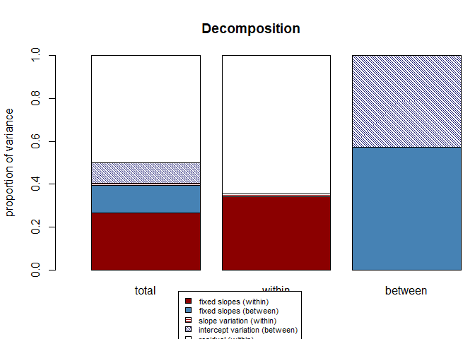

# Multilevel Regression: centering
Mauricio Garnier-Villarreal
2026-03-25

- [<span class="toc-section-number">1</span> Introduction to Centering
  in Multilevel Models](#introduction-to-centering-in-multilevel-models)
- [<span class="toc-section-number">2</span> Why Do We Need to Separate
  These Effects?](#why-do-we-need-to-separate-these-effects)
- [<span class="toc-section-number">3</span> Packages and
  Data](#packages-and-data)
- [<span class="toc-section-number">4</span> Preliminary Step: Creating
  the Cluster Mean](#preliminary-step-creating-the-cluster-mean)
- [<span class="toc-section-number">5</span> The Uncentered Model
  (Baseline)](#the-uncentered-model-baseline)
- [<span class="toc-section-number">6</span> Grand Mean
  Centering](#grand-mean-centering)
  - [<span class="toc-section-number">6.1</span> Model 2a: Grand Mean
    Centering Only](#model-2a-grand-mean-centering-only)
  - [<span class="toc-section-number">6.2</span> Model 2b: Grand Mean
    Centering + Group Mean](#model-2b-grand-mean-centering--group-mean)
- [<span class="toc-section-number">7</span> Group Mean
  Centering](#group-mean-centering)
  - [<span class="toc-section-number">7.1</span> Model 3a: Group Mean
    Centering Only](#model-3a-group-mean-centering-only)
  - [<span class="toc-section-number">7.2</span> Model 3b: Group Mean
    Centering + Group Mean](#model-3b-group-mean-centering--group-mean)
- [<span class="toc-section-number">8</span> The Fully Centered Model
  (CWC + Centered Group
  Mean)](#the-fully-centered-model-cwc--centered-group-mean)
  - [<span class="toc-section-number">8.1</span> Model 4: The Final
    Model](#model-4-the-final-model)
- [<span class="toc-section-number">9</span> Detailed Interpretation of
  Final Model Results](#detailed-interpretation-of-final-model-results)
  - [<span class="toc-section-number">9.1</span> Fixed
    Effects](#fixed-effects)
  - [<span class="toc-section-number">9.2</span> Random
    Effects](#random-effects)
  - [<span class="toc-section-number">9.3</span> Variance
    Partitioning](#variance-partitioning)
  - [<span class="toc-section-number">9.4</span> Summary Table for
    Interpretation](#summary-table-for-interpretation)
  - [<span class="toc-section-number">9.5</span> Conclusions from the
    Final Model](#conclusions-from-the-final-model)
- [<span class="toc-section-number">10</span> Summary of Model
  Results](#summary-of-model-results)
- [<span class="toc-section-number">11</span> Effect Size
  Measures](#effect-size-measures)
  - [<span class="toc-section-number">11.1</span> Using the
    `performance` package](#using-the-performance-package)
  - [<span class="toc-section-number">11.2</span> Using the `r2mlm`
    package](#using-the-r2mlm-package)
    - [<span class="toc-section-number">11.2.1</span> Detailed
      Explanation of `r2mlm()`
      Output](#detailed-explanation-of-r2mlm-output)
      - [<span class="toc-section-number">11.2.1.1</span>
        `$Decompositions` – Variance
        Components](#decompositions--variance-components)
      - [<span class="toc-section-number">11.2.1.2</span> Interpreting
        the Numbers (from the final model
        output):](#interpreting-the-numbers-from-the-final-model-output)
      - [<span class="toc-section-number">11.2.1.3</span> `$R2s` –
        R-Squared Measures](#r2s--r-squared-measures)
      - [<span class="toc-section-number">11.2.1.4</span> Interpreting
        the Numbers:](#interpreting-the-numbers)
    - [<span class="toc-section-number">11.2.2</span> Key Takeaways from
      This Output:](#key-takeaways-from-this-output)
- [<span class="toc-section-number">12</span> Summary of Interpretations
  and Recommendations](#summary-of-interpretations-and-recommendations)
- [<span class="toc-section-number">13</span> References](#references)

## Introduction to Centering in Multilevel Models

Centering is the process of subtracting a constant from a variable to
create a new, shifted version of that variable. In single-level
regression, centering is primarily used to give the intercept a
meaningful interpretation: the expected value of the outcome when all
predictors are zero (Aiken & West, 1991). If a predictor does not have a
natural zero point (e.g., a Likert scale from 1 to 7), the intercept can
be uninterpretable. Centering at the grand mean solves this by making
zero represent the average score.

In multilevel models (MLMs), centering takes on additional importance
because it helps us separate the effects of a predictor into its
**within-cluster** and **between-cluster** components (Enders & Tofighi,
2007; Raudenbush & Bryk, 2002). Failing to separate these effects
results in a “conflated” or “smushed” coefficient that is an
uninterpretable blend of the two (Hoffman & Walters, 2022; Preacher et
al., 2010).

## Why Do We Need to Separate These Effects?

Consider a study of students nested within schools. We want to examine
the relationship between student Socio-Economic Status (SES) and math
achievement. The relationship can be broken down into two distinct
questions:

1.  **Within-School Effect**: For students in the *same* school, is
    higher SES associated with higher math scores?
2.  **Between-School Effect**: Do schools with a higher *average* SES
    tend to have higher average math scores?

These two effects can be, and often are, different in magnitude. The
difference between them is known as the **contextual effect**: the
effect of being in a higher-SES school, over and above the effect of
one’s own SES (Marsh’s “Big-Fish-Little-Pond Effect”). A standard MLM
with uncentered SES conflates these effects, producing a single
coefficient that does not accurately represent either one.

This tutorial will guide you through the three main centering strategies
for level-1 predictors, showing how to estimate and interpret these
distinct effects using R.

## Packages and Data

We will use the `SB.csv` dataset (Snijders & Bosker, 1999) containing
2,287 pupils in 131 schools. Our outcome is a language post-test score
(`langpost`), and our predictor is verbal IQ (`iq_verb`). We will also
use several R packages for data manipulation, model fitting, and effect
size calculation.

``` r
# Load required packages
library(lme4)
library(lmerTest)
library(rio)
library(parameters)
library(performance)
library(r2mlm)
library(dplyr)
library(ggplot2)
library(tidyr)

# Read data
SB <- import("SB.csv")
SB <- drop_na(SB)  # remove missing for simplicity
head(SB)
```

      schoolnr pupilnr iq_verb  iq_perf sex minority repeatgr aritpret classnr
    1        1   17001    15.0 12.33333   0        0        0       14     180
    2        1   17002    14.5 10.00000   0        1        0       12     180
    3        1   17003     9.5 11.00000   0        0        0       10     180
    4        1   17004    11.0 10.00000   0        0        0       13     180
    5        1   17005     8.0  6.66667   0        0        0        8     180
    6        1   17006     9.5  9.00000   0        1        0        8     180
      aritpost langpret langpost ses denomina schoolse satiprin natitest meetings
    1       24       36       46  23        1       11  3.42857        0      1.7
    2       19       36       45  10        1       11  3.42857        0      1.7
    3       24       33       33  15        1       11  3.42857        0      1.7
    4       26       29       46  23        1       11  3.42857        0      1.7
    5        9       19       20  10        1       11  3.42857        0      1.7
    6       13       22       30  10        1       11  3.42857        0      1.7
      currmeet mixedgra percmino aritdiff homework classsiz groupsiz
    1  1.83333        0       60       12  2.33333       29       29
    2  1.83333        0       60       12  2.33333       29       29
    3  1.83333        0       60       12  2.33333       29       29
    4  1.83333        0       60       12  2.33333       29       29
    5  1.83333        0       60       12  2.33333       29       29
    6  1.83333        0       60       12  2.33333       29       29

## Preliminary Step: Creating the Cluster Mean

To separate within- and between-cluster effects, we first need the
cluster mean of our predictor. This will be used both for centering and
as a level-2 predictor.

``` r
# Calculate the mean iq_verb for each school
school_means <- SB %>%
  group_by(schoolnr) %>%
  summarise(iq_mean = mean(iq_verb, na.rm = TRUE))

# Merge the school mean back into the main data frame
SB <- left_join(SB, school_means, by = "schoolnr")

head(SB[, c("schoolnr", "iq_verb", "iq_mean")])
```

      schoolnr iq_verb iq_mean
    1        1    15.0   10.32
    2        1    14.5   10.32
    3        1     9.5   10.32
    4        1    11.0   10.32
    5        1     8.0   10.32
    6        1     9.5   10.32

## The Uncentered Model (Baseline)

We start with a baseline model using the raw, uncentered predictor. This
model will serve as a reference point. It includes a random intercept
for schools and a random slope for `iq_verb`, allowing the relationship
between IQ and language scores to vary across schools.

``` r
model_uncentered <- lmer(langpost ~ 1 + iq_verb + (1 + iq_verb | schoolnr),
                         data = SB, REML = FALSE)

summary(model_uncentered)
```

    Linear mixed model fit by maximum likelihood . t-tests use Satterthwaite's
      method [lmerModLmerTest]
    Formula: langpost ~ 1 + iq_verb + (1 + iq_verb | schoolnr)
       Data: SB

          AIC       BIC    logLik -2*log(L)  df.resid 
      15242.8   15277.2   -7615.4   15230.8      2281 

    Scaled residuals: 
        Min      1Q  Median      3Q     Max 
    -4.1429 -0.6352  0.0616  0.7115  2.7065 

    Random effects:
     Groups   Name        Variance Std.Dev. Corr  
     schoolnr (Intercept) 67.714   8.2289         
              iq_verb      0.219   0.4679   -0.98 
     Residual             41.456   6.4386         
    Number of obs: 2287, groups:  schoolnr, 131

    Fixed effects:
                 Estimate Std. Error        df t value Pr(>|t|)    
    (Intercept)  10.80129    1.11769 105.28018   9.664  3.4e-16 ***
    iq_verb       2.52742    0.08191 105.55675  30.855  < 2e-16 ***
    ---
    Signif. codes:  0 '***' 0.001 '**' 0.01 '*' 0.05 '.' 0.1 ' ' 1

    Correlation of Fixed Effects:
            (Intr)
    iq_verb -0.967
    optimizer (nloptwrap) convergence code: 0 (OK)
    Model failed to converge with max|grad| = 0.395399 (tol = 0.002, component 1)
      See ?lme4::convergence and ?lme4::troubleshooting.

``` r
parameters(model_uncentered, ci_method = "profile")
```

    # Fixed Effects

    Parameter   | Coefficient |   SE |        95% CI | t(2281) |      p
    -------------------------------------------------------------------
    (Intercept) |       10.80 | 1.12 | [8.55, 13.01] |    9.66 | < .001
    iq verb     |        2.53 | 0.08 | [2.37,  2.69] |   30.86 | < .001

    # Random Effects

    Parameter                         | Coefficient
    -----------------------------------------------
    SD (Intercept: schoolnr)          |        8.23
    SD (iq_verb: schoolnr)            |        0.47
    Cor (Intercept~iq_verb: schoolnr) |       -0.98
    SD (Residual)                     |        6.44

**Interpretation of the Uncentered Model:**

- The coefficient for `iq_verb` is 2.53. This is a conflated,
  uninterpretable blend of the within-school and between-school effects.
  It does not tell us whether the effect is due to a student’s own IQ
  relative to their classmates or due to the average IQ level of the
  school they attend.

- The intercept is the predicted language score when `iq_verb = 0`,
  which is not meaningful in this context.

  The random slope variance (0.22) indicates that the relationship
  between IQ and language scores varies across schools (the SD of slopes
  is 0.47).

This model highlights why centering is necessary. We cannot answer our
substantive questions about within- and between-school effects from
these results.

## Grand Mean Centering

Grand Mean Centering (CGM) involves subtracting the overall grand mean
of the predictor from every observation. The centered variable is
created as:

$$ \text{iq\_cgm}_{ij} = \text{iq\_verb}_{ij} - \bar{x}_{..} $$

where $\bar{x}_{..}$ is the grand mean of `iq_verb`.

``` r
# Calculate the grand mean
grand_mean_iq <- mean(SB$iq_verb)

# Create the grand-mean centered variable
SB$iq_cgm <- SB$iq_verb - grand_mean_iq

# Verify that the mean of the new variable is zero
mean(SB$iq_cgm)
```

    [1] 3.904947e-18

### Model 2a: Grand Mean Centering Only

This model includes only the grand-mean centered predictor. The
coefficient will still be conflated because the between-school variance
is still present in the predictor.

``` r
model_cgm_only <- lmer(langpost ~ 1 + iq_cgm + (1 + iq_cgm | schoolnr),
                       data = SB, REML = FALSE)

summary(model_cgm_only)
```

    Linear mixed model fit by maximum likelihood . t-tests use Satterthwaite's
      method [lmerModLmerTest]
    Formula: langpost ~ 1 + iq_cgm + (1 + iq_cgm | schoolnr)
       Data: SB

          AIC       BIC    logLik -2*log(L)  df.resid 
      15242.8   15277.2   -7615.4   15230.8      2281 

    Scaled residuals: 
        Min      1Q  Median      3Q     Max 
    -4.1417 -0.6377  0.0617  0.7114  2.7101 

    Random effects:
     Groups   Name        Variance Std.Dev. Corr  
     schoolnr (Intercept)  9.3532  3.0583         
              iq_cgm       0.2101  0.4584   -0.82 
     Residual             41.4802  6.4405         
    Number of obs: 2287, groups:  schoolnr, 131

    Fixed effects:
                 Estimate Std. Error        df t value Pr(>|t|)    
    (Intercept)  40.70956    0.30424 124.12917  133.81   <2e-16 ***
    iq_cgm        2.52637    0.08145 106.87547   31.02   <2e-16 ***
    ---
    Signif. codes:  0 '***' 0.001 '**' 0.01 '*' 0.05 '.' 0.1 ' ' 1

    Correlation of Fixed Effects:
           (Intr)
    iq_cgm -0.362

``` r
parameters(model_cgm_only, ci_method = "profile")
```

    # Fixed Effects

    Parameter   | Coefficient |   SE |         95% CI | t(2281) |      p
    --------------------------------------------------------------------
    (Intercept) |       40.71 | 0.30 | [40.10, 41.31] |  133.81 | < .001
    iq cgm      |        2.53 | 0.08 | [ 2.37,  2.69] |   31.02 | < .001

    # Random Effects

    Parameter                        | Coefficient
    ----------------------------------------------
    SD (Intercept: schoolnr)         |        3.06
    SD (iq_cgm: schoolnr)            |        0.46
    Cor (Intercept~iq_cgm: schoolnr) |       -0.82
    SD (Residual)                    |        6.44

**Interpretation:**

- The coefficient for `iq_cgm` is 2.53—identical to the uncentered
  model. Grand mean centering alone does not disaggregate the effects;
  it only shifts the location of the intercept.

- The intercept is now the predicted language score for a student with
  average IQ (since `iq_cgm = 0`), which is more interpretable: 40.71.

- The random slope variance (0.21) is similar to the uncentered model,
  indicating that the conflated slope still varies across schools.

### Model 2b: Grand Mean Centering + Group Mean

To actually separate the within and contextual effects, we add the
school mean (`iq_mean`) as a level-2 predictor.

``` r
model_cgm_full <- lmer(langpost ~ 1 + iq_cgm + iq_mean + (1 + iq_cgm | schoolnr),
                       data = SB, REML = FALSE)

summary(model_cgm_full)
```

    Linear mixed model fit by maximum likelihood . t-tests use Satterthwaite's
      method [lmerModLmerTest]
    Formula: langpost ~ 1 + iq_cgm + iq_mean + (1 + iq_cgm | schoolnr)
       Data: SB

          AIC       BIC    logLik -2*log(L)  df.resid 
      15227.5   15267.7   -7606.8   15213.5      2280 

    Scaled residuals: 
        Min      1Q  Median      3Q     Max 
    -4.1751 -0.6398  0.0669  0.7046  2.7109 

    Random effects:
     Groups   Name        Variance Std.Dev. Corr  
     schoolnr (Intercept)  7.9192  2.8141         
              iq_cgm       0.2001  0.4473   -0.65 
     Residual             41.3505  6.4304         
    Number of obs: 2287, groups:  schoolnr, 131

    Fixed effects:
                 Estimate Std. Error        df t value Pr(>|t|)    
    (Intercept)  24.12087    3.80691 177.74802   6.336 1.88e-09 ***
    iq_cgm        2.45887    0.08318 110.85160  29.560  < 2e-16 ***
    iq_mean       1.40518    0.32147 174.70877   4.371 2.12e-05 ***
    ---
    Signif. codes:  0 '***' 0.001 '**' 0.01 '*' 0.05 '.' 0.1 ' ' 1

    Correlation of Fixed Effects:
            (Intr) iq_cgm
    iq_cgm   0.194       
    iq_mean -0.997 -0.214

``` r
parameters(model_cgm_full, ci_method = "profile")
```

    # Fixed Effects

    Parameter   | Coefficient |   SE |         95% CI | t(2280) |      p
    --------------------------------------------------------------------
    (Intercept) |       24.12 | 3.81 | [16.30, 31.88] |    6.34 | < .001
    iq cgm      |        2.46 | 0.08 | [ 2.30,  2.63] |   29.56 | < .001
    iq mean     |        1.41 | 0.32 | [ 0.75,  2.07] |    4.37 | < .001

    # Random Effects

    Parameter                        | Coefficient
    ----------------------------------------------
    SD (Intercept: schoolnr)         |        2.81
    SD (iq_cgm: schoolnr)            |        0.45
    Cor (Intercept~iq_cgm: schoolnr) |       -0.65
    SD (Residual)                    |        6.43

**Explanation of Syntax:**

- `langpost ~ 1 + iq_cgm + iq_mean`: This specifies the fixed part of
  the model. We include an intercept (1), the grand-mean centered
  predictor, and the school-level mean.
- `(1 + iq_cgm | schoolnr)`: This is the random part, specifying a
  random intercept and a random slope for `iq_cgm` for each school.
- `REML = FALSE`: We use Maximum Likelihood (ML) estimation to allow for
  model comparisons later. For final inference, Restricted Maximum
  Likelihood (REML) is generally preferred.

**Interpretation of Fixed Effects:**

- Intercept ($\gamma_{00}$): The estimated math achievement for a
  student with an average IQ (since `iq_cgm = 0`) in a school with an
  average IQ (`iq_mean` is not centered yet). This intercept is not as
  clean as it could be because `iq_mean` is not centered. The value is
  24.12.
- iq_cgm ($\gamma_{10}$): This is the within-school effect. For students
  in the same school, a one-unit increase in a student’s IQ relative to
  the grand mean is associated with a 2.46-point increase in their
  language score. Because we have included `iq_mean`, this coefficient
  is a “pure” estimate of the within-school effect (Enders & Tofighi,
  2007).
- iq_mean ($\gamma_{01}$): This is the contextual effect. For two
  students with the same IQ (iq_cgm is held constant), a one-unit
  increase in their school’s average IQ is associated with a 1.41-point
  increase in their language score. This represents the added benefit of
  being in a higher-IQ school, above and beyond one’s own IQ.

To get the between-school effect (the effect of a school’s average IQ on
school-average achievement), we would add the within and contextual
effects: $\gamma_{10} + \gamma_{01}$. For our model, this is 3.86.

The random slope variance for `iq_cgm` (0.20) is slightly reduced
compared to the CGM‑only model, indicating that part of the slope
variability is explained by school‑mean IQ.

## Group Mean Centering

Group Mean Centering (CWC) – also known as Centering Within Cluster –
involves subtracting the cluster mean from each observation. The
centered variable is created as:

$$ \text{iq\_cwc}_{ij} = \text{iq\_verb}_{ij} - \bar{x}_{.j} $$

where $\bar{x}_{.j}$ is the mean of `iq_verb` for school $j$.

``` r
# Create the group-mean centered variable using the pre-calculated school means
SB$iq_cwc <- SB$iq_verb - SB$iq_mean

# Verify that the mean of the new variable is zero for each school
SB %>%
  group_by(schoolnr) %>%
  summarise(mean_cwc = mean(iq_cwc)) %>%
  pull(mean_cwc) %>%
  summary()
```

          Min.    1st Qu.     Median       Mean    3rd Qu.       Max. 
    -8.359e-16 -3.751e-16  0.000e+00  2.251e-17  4.100e-16  8.595e-16 

### Model 3a: Group Mean Centering Only

This model includes only the group-mean centered predictor. Because all
between-school variance has been removed from `iq_cwc`, its coefficient
is a pure within-school effect, even without adding the group mean back
in.

``` r
model_cwc_only <- lmer(langpost ~ 1 + iq_cwc + (1 + iq_cwc | schoolnr),
                       data = SB, REML = FALSE)

summary(model_cwc_only)
```

    Linear mixed model fit by maximum likelihood . t-tests use Satterthwaite's
      method [lmerModLmerTest]
    Formula: langpost ~ 1 + iq_cwc + (1 + iq_cwc | schoolnr)
       Data: SB

          AIC       BIC    logLik -2*log(L)  df.resid 
      15341.7   15376.1   -7664.9   15329.7      2281 

    Scaled residuals: 
        Min      1Q  Median      3Q     Max 
    -4.0490 -0.6281  0.0614  0.7011  2.7120 

    Random effects:
     Groups   Name        Variance Std.Dev. Corr  
     schoolnr (Intercept) 21.8222  4.6714         
              iq_cwc       0.2193  0.4683   -0.55 
     Residual             41.4612  6.4390         
    Number of obs: 2287, groups:  schoolnr, 131

    Fixed effects:
                 Estimate Std. Error        df t value Pr(>|t|)    
    (Intercept)  40.28820    0.43411 120.30030   92.81   <2e-16 ***
    iq_cwc        2.46447    0.08448 101.54007   29.17   <2e-16 ***
    ---
    Signif. codes:  0 '***' 0.001 '**' 0.01 '*' 0.05 '.' 0.1 ' ' 1

    Correlation of Fixed Effects:
           (Intr)
    iq_cwc -0.258

``` r
parameters(model_cwc_only, ci_method = "profile")
```

    # Fixed Effects

    Parameter   | Coefficient |   SE |         95% CI | t(2281) |      p
    --------------------------------------------------------------------
    (Intercept) |       40.29 | 0.43 | [39.43, 41.14] |   92.81 | < .001
    iq cwc      |        2.46 | 0.08 | [ 2.30,  2.64] |   29.17 | < .001

    # Random Effects

    Parameter                        | Coefficient
    ----------------------------------------------
    SD (Intercept: schoolnr)         |        4.67
    SD (iq_cwc: schoolnr)            |        0.47
    Cor (Intercept~iq_cwc: schoolnr) |       -0.55
    SD (Residual)                    |        6.44

**Interpretation:**

- iq_cwc ($\gamma_{10}$): This is a pure estimate of the within-school
  effect. For students in the same school, a one-unit increase in a
  student’s IQ relative to their school’s average is associated with a
  2.46-point increase in their language score. This is the same
  within-effect we got from the full CGM model.
- The intercept is the predicted language score for a student at their
  school’s average IQ: 40.29
- The random slope variance (0.22) reflects how much the within‑school
  effect varies across schools.

### Model 3b: Group Mean Centering + Group Mean

To also obtain the between-school effect, we add the school mean
(`iq_mean`) as a level-2 predictor.

``` r
model_cwc_full <- lmer(langpost ~ 1 + iq_cwc + iq_mean + (1 + iq_cwc | schoolnr),
                       data = SB, REML = FALSE)

summary(model_cwc_full)
```

    Linear mixed model fit by maximum likelihood . t-tests use Satterthwaite's
      method [lmerModLmerTest]
    Formula: langpost ~ 1 + iq_cwc + iq_mean + (1 + iq_cwc | schoolnr)
       Data: SB

          AIC       BIC    logLik -2*log(L)  df.resid 
      15225.7   15265.9   -7605.9   15211.7      2280 

    Scaled residuals: 
        Min      1Q  Median      3Q     Max 
    -4.1806 -0.6334  0.0631  0.7029  2.7177 

    Random effects:
     Groups   Name        Variance Std.Dev. Corr  
     schoolnr (Intercept)  7.8702  2.8054         
              iq_cwc       0.2589  0.5088   -0.59 
     Residual             41.2101  6.4195         
    Number of obs: 2287, groups:  schoolnr, 131

    Fixed effects:
                 Estimate Std. Error        df t value Pr(>|t|)    
    (Intercept)  -5.66468    3.49355 163.26383  -1.621    0.107    
    iq_cwc        2.46179    0.08647  97.47706  28.468   <2e-16 ***
    iq_mean       3.92061    0.29605 161.06687  13.243   <2e-16 ***
    ---
    Signif. codes:  0 '***' 0.001 '**' 0.01 '*' 0.05 '.' 0.1 ' ' 1

    Correlation of Fixed Effects:
            (Intr) iq_cwc
    iq_cwc  -0.010       
    iq_mean -0.997 -0.013

``` r
parameters(model_cwc_full, ci_method = "profile")
```

    # Fixed Effects

    Parameter   | Coefficient |   SE |         95% CI | t(2280) |      p
    --------------------------------------------------------------------
    (Intercept) |       -5.66 | 3.49 | [-12.62, 1.24] |   -1.62 | 0.105 
    iq cwc      |        2.46 | 0.09 | [  2.29, 2.64] |   28.47 | < .001
    iq mean     |        3.92 | 0.30 | [  3.34, 4.51] |   13.24 | < .001

    # Random Effects

    Parameter                        | Coefficient
    ----------------------------------------------
    SD (Intercept: schoolnr)         |        2.81
    SD (iq_cwc: schoolnr)            |        0.51
    Cor (Intercept~iq_cwc: schoolnr) |       -0.59
    SD (Residual)                    |        6.42

**Interpretation of Fixed Effects:**

- Intercept ($\gamma_{00}$): The estimated math achievement for a
  student with an IQ equal to their school’s average (since
  `iq_cwc = 0`), in a school with an average IQ (`iq_mean = 0`? Again,
  not centered). This is the unadjusted mean for an average school. The
  value is -5.66.
  - iq_cwc ($\gamma_{10}$): This remains the pure within-school effect,
    unchanged from Model 3a: 2.46
  - iq_mean ($\gamma_{01}$): This is the between-school effect. A
    one-unit increase in a school’s average IQ is associated with a
    3.92-point increase in a student’s predicted language score (for a
    student at their school’s average IQ, where `iq_cwc = 0`).

To get the contextual effect from this model, we subtract the within
effect from the between effect: $\gamma_{01} - \gamma_{10}$. For our
model, this is 1.46, which should match the contextual effect from the
full CGM model.

The random slope variance (0.26) is now slightly larger than in the
CWC‑only model, but still indicates meaningful heterogeneity across
schools in the within‑school effect of IQ.

## The Fully Centered Model (CWC + Centered Group Mean)

In the previous models, the intercept’s interpretation is still slightly
awkward because the level-2 predictor (`iq_mean`) is not centered. To
make the intercept maximally interpretable (i.e., the expected outcome
for a student with average IQ in a school of average IQ), we can also
center the group means at their grand mean.

**Centering the Group Means**

This is a form of centering at level-2. We create a new variable,
`iq_mean_c`, by subtracting the grand mean of the school means from each
school’s mean.

``` r
# Calculate the grand mean of the school means
grand_mean_schools <- mean(SB$iq_mean)

# Create the centered school mean variable
SB$iq_mean_c <- SB$iq_mean - grand_mean_schools

# Verify its mean is zero
mean(SB$iq_mean_c)
```

    [1] 2.294887e-18

### Model 4: The Final Model

We now fit the “fully centered” model with the group-mean centered
predictor (`iq_cwc`) at level-1 and the centered school mean
(`iq_mean_c`) at level-2.

``` r
model_final <- lmer(langpost ~ 1 + iq_cwc + iq_mean_c + (1 + iq_cwc | schoolnr),
                    data = SB, REML = FALSE)

summary(model_final)
```

    Linear mixed model fit by maximum likelihood . t-tests use Satterthwaite's
      method [lmerModLmerTest]
    Formula: langpost ~ 1 + iq_cwc + iq_mean_c + (1 + iq_cwc | schoolnr)
       Data: SB

          AIC       BIC    logLik -2*log(L)  df.resid 
      15225.7   15265.9   -7605.9   15211.7      2280 

    Scaled residuals: 
        Min      1Q  Median      3Q     Max 
    -4.1806 -0.6334  0.0631  0.7029  2.7177 

    Random effects:
     Groups   Name        Variance Std.Dev. Corr  
     schoolnr (Intercept)  7.8702  2.8054         
              iq_cwc       0.2589  0.5088   -0.59 
     Residual             41.2101  6.4195         
    Number of obs: 2287, groups:  schoolnr, 131

    Fixed effects:
                 Estimate Std. Error        df t value Pr(>|t|)    
    (Intercept)  40.73204    0.28538 124.22422  142.73   <2e-16 ***
    iq_cwc        2.46179    0.08647  97.47706   28.47   <2e-16 ***
    iq_mean_c     3.92061    0.29605 161.06687   13.24   <2e-16 ***
    ---
    Signif. codes:  0 '***' 0.001 '**' 0.01 '*' 0.05 '.' 0.1 ' ' 1

    Correlation of Fixed Effects:
              (Intr) iq_cwc
    iq_cwc    -0.271       
    iq_mean_c  0.076 -0.013

``` r
parameters(model_final, ci_method = "profile")
```

    # Fixed Effects

    Parameter   | Coefficient |   SE |         95% CI | t(2280) |      p
    --------------------------------------------------------------------
    (Intercept) |       40.73 | 0.29 | [40.17, 41.29] |  142.73 | < .001
    iq cwc      |        2.46 | 0.09 | [ 2.29,  2.64] |   28.47 | < .001
    iq mean c   |        3.92 | 0.30 | [ 3.34,  4.51] |   13.24 | < .001

    # Random Effects

    Parameter                        | Coefficient
    ----------------------------------------------
    SD (Intercept: schoolnr)         |        2.81
    SD (iq_cwc: schoolnr)            |        0.51
    Cor (Intercept~iq_cwc: schoolnr) |       -0.59
    SD (Residual)                    |        6.42

**Interpretation of Fixed Effects:**

- Intercept ($\gamma_{00}$): The estimated language score for a student
  with an IQ equal to their school’s average (`iq_cwc = 0`) who attends
  a school with the overall average IQ (`iq_mean_c = 0`). This is now a
  highly interpretable value: 40.73.
- iq_cwc ($\gamma_{10}$): The within-school effect remains unchanged
  from the previous CWC models: 2.46.
- iq_mean_c ($\gamma_{01}$): The between-school effect is unchanged from
  the CWC Full model: 3.92.

This model provides the cleanest separation of effects and the most
interpretable intercept. The random slope variance (0.26) indicates that
the within‑school effect of IQ varies across schools, even after
controlling for school‑average IQ.

## Detailed Interpretation of Final Model Results

The `parameters(model_final)` output provides the parameter estimates
for our fully centered multilevel model. This model includes:

- **Level-1**: Group-mean centered IQ (`iq_cwc`), representing each
  student’s deviation from their school’s average IQ
- **Level-2**: Centered school mean IQ (`iq_mean_c`), representing each
  school’s deviation from the overall average school IQ
- **Random intercept** and **random slope** for schools
  (`(1 + iq_cwc | schoolnr)`), allowing each school to have its own
  baseline language score and its own within‑school IQ effect.

### Fixed Effects

The fixed effects describe the average relationships in the population.

| Parameter       | Coefficient |  SE  | 95% CI           | t-value | p-value |
|:----------------|:-----------:|:----:|:-----------------|:-------:|:-------:|
| **(Intercept)** |    40.73    | 0.29 | \[40.17, 41.29\] | 142.73  | \< .001 |
| **iq_cwc**      |    2.46     | 0.09 | \[2.29, 2.64\]   |  28.47  | \< .001 |
| **iq_mean_c**   |    3.92     | 0.30 | \[3.34, 4.51\]   |  13.24  | \< .001 |

**Intercept ($\gamma_{00} = 40.73$)**

The intercept represents the predicted language score for a student
with:

- An IQ equal to their school’s average (`iq_cwc = 0`)
- Attending a school with the overall average IQ (`iq_mean_c = 0`)

In substantive terms, a typical student (average IQ relative to their
school) in a typical school (average school IQ) is predicted to have a
language score of **40.73**. This is a highly interpretable baseline
value.

**iq_cwc ($\gamma_{10} = 2.46$)**

This is the **within-school effect** of IQ. For students in the same
school, a one-point increase in a student’s IQ relative to their
school’s average is associated with a **2.46-point increase** in their
predicted language score.

- **Interpretation**: Within any given school, students with higher IQ
  than their schoolmates tend to have higher language scores. For every
  point a student’s IQ exceeds their school’s average, their language
  score is expected to be 2.46 points higher.
- **Statistical significance**: The effect is significant ((p \< .001)),
  and the 95% confidence interval \[2.29, 2.64\] does not include zero.

**iq_mean_c ($\gamma_{01} = 3.92$)**

This is the **between-school effect** of IQ. A one-point increase in a
school’s average IQ (compared to the overall average) is associated with
a **3.92-point increase** in the predicted language score for a student
at that school’s average IQ.

- **Interpretation**: Schools with higher average IQ tend to have higher
  average language scores. For a student whose IQ is at their school’s
  average, attending a school with an average IQ one point higher than
  the typical school is associated with a 3.92-point higher language
  score.
- **Statistical significance**: The effect is significant ((p \< .001)),
  with a 95% confidence interval \[3.34, 4.51\].
- **Comparison with within effect**: The between-school effect (3.92) is
  substantially larger than the within-school effect (2.46), suggesting
  that school-level factors associated with average IQ have a stronger
  impact than individual-level IQ differences within schools.

**Contextual Effect**

The contextual effect (the effect of school average IQ above and beyond
individual IQ) can be calculated as:

$$ 
\text{Contextual Effect} = \gamma_{01} - \gamma_{10} = 3.92 - 2.46 = 1.46 
$$

This means that for two students with the same individual IQ, the one
attending a school with an average IQ one point higher is predicted to
score **1.46 points higher** on the language test. This represents the
pure contextual benefit of being in a higher-IQ school environment.

### Random Effects

The random effects describe the variance components – how much schools
and students vary around the fixed effects.

| Parameter                            |  SD   | Variance (SD²) |
|:-------------------------------------|:-----:|:--------------:|
| **SD (Intercept: schoolnr)**         | 2.81  |      7.87      |
| **SD (iq_cwc: schoolnr)**            | 0.51  |      0.26      |
| **Cor (Intercept~iq_cwc: schoolnr)** | -0.59 |       –        |
| **SD (Residual)**                    | 6.42  |     41.21      |

**SD (Intercept: schoolnr) = 2.81**

This is the standard deviation of school intercepts around the fixed
intercept. After controlling for school-average IQ, schools still vary
in their adjusted mean language scores.

- **Interpretation**: The intercepts for different schools (their
  baseline language scores after accounting for IQ) are normally
  distributed with a standard deviation of 2.81.
- **Practical meaning**: About 95% of schools have adjusted mean
  language scores within approximately ±1.96 × 2.81 = ±5.51 points of
  the fixed intercept (40.73). This means school means range from about
  35.22 to 46.24 after controlling for IQ.
- **Substantive implication**: Even after accounting for IQ differences,
  substantial between-school variation remains – other school-level
  factors (teaching quality, resources, etc.) likely contribute to these
  differences.

**SD (iq_cwc: schoolnr) = 0.51**

This is the standard deviation of the random slopes for the
within‑school IQ effect. It quantifies how much the within‑school effect
of IQ varies across schools.

- **Interpretation**: The within‑school effect of IQ (the slope of
  `iq_cwc`) varies across schools with a standard deviation of 0.51.
- **Practical meaning**: About 95% of schools have within‑school IQ
  slopes between (2.46 = \[1.46, 3.46\]). In some schools, the effect of
  IQ is as low as 1.46, in others as high as 3.46.
- **Substantive implication**: The relationship between student IQ and
  language achievement is not uniform across schools; some schools are
  more effective at translating student IQ into language scores.

**Correlation between intercepts and slopes = -0.59**

The negative correlation indicates that schools with higher average
language scores (higher intercepts) tend to have weaker within‑school IQ
effects (smaller slopes). This could reflect a ceiling effect or
differential effectiveness: high‑performing schools may reduce the
impact of individual differences in IQ.

**SD (Residual) = 6.42**

This is the standard deviation of the level-1 residuals – the
within-school variation among students after accounting for IQ and
school differences.

- **Interpretation**: Students’ observed language scores deviate from
  their school’s predicted line with a standard deviation of 6.42
  points.
- **Practical meaning**: About 95% of students have residuals within
  ±1.96 × 6.42 = ±12.58 points of their predicted score.
- **Substantive implication**: Considerable individual differences
  remain unexplained – other student-level factors (motivation, prior
  achievement, family background) likely contribute to these
  differences.

### Variance Partitioning

The total variance in language scores can be estimated from the random
effects:

- **Between-school variance** = (2.81)² = 7.87 (from intercept variance)
- **Within-school variance** = (6.42)² = 41.21
- **Total variance** = 7.87 + 41.21 = 49.08

The intraclass correlation (ICC) – the proportion of total variance that
is between schools – is:

$$ 
\text{ICC} = \frac{7.87}{49.08} = 0.160 
$$

About **16%** of the variance in language scores is between schools,
with the remaining 84% within schools. This confirms that most of the
variation is at the student level, but school differences are still
meaningful.

### Summary Table for Interpretation

| Parameter | Estimate | Interpretation |
|:---|:--:|:---|
| **Intercept (γ₀₀)** | 40.73 | Predicted language score for an average student (at school mean IQ) in an average school (at overall mean school IQ). |
| **Within-school IQ (γ₁₀)** | 2.46 | For students in the same school, a 1-point higher IQ (relative to school mean) predicts 2.46-point higher language score. |
| **Between-school IQ (γ₀₁)** | 3.92 | For a student at their school’s mean IQ, attending a school with 1-point higher average IQ predicts 3.92-point higher language score. |
| **Contextual effect** | 1.46 | Net benefit of being in a higher-IQ school, holding individual IQ constant. |
| **School SD (τ₀₀)** | 2.81 | Schools vary around the intercept with SD of 2.81 (95% of schools within ±5.51 points). |
| **Slope SD (τ₁₁)** | 0.51 | Within‑school IQ effect varies across schools with SD of 0.51 (95% of schools have slopes between 1.46 and 3.46). |
| **Residual SD (σ)** | 6.42 | Students vary around their school’s predicted line with SD of 6.42 (95% within ±12.58 points). |
| **ICC** | 0.160 | 16% of total variance is between schools; 84% is within schools. |

### Conclusions from the Final Model

1.  **IQ matters both within and between schools**: Both individual IQ
    relative to schoolmates (γ₁₀ = 2.46) and school-average IQ (γ₀₁ =
    3.92) are strong, significant predictors of language achievement.

2.  **Context matters**: The contextual effect of 1.46 confirms that
    school-level IQ has an effect above and beyond individual IQ –
    consistent with “peer effects” or school environment influences.

3.  **Most variance is within schools**: With an ICC of 0.16, the
    majority of variation in language scores is at the student level,
    but school differences are still substantial and meaningful.

4.  **Substantial unexplained variance remains**: Both within-school (SD
    = 6.42) and between-school (SD = 2.81) residual variance indicate
    that additional predictors at both levels could improve the model.

5.  **The within‑school effect of IQ varies across schools**: The random
    slope variance (0.26) and its SD (0.51) show that the relationship
    between student IQ and language achievement is not constant across
    schools. Some schools are more effective than others in translating
    student ability into performance.

6.  **The model successfully disaggregates effects**: By using
    group-mean centering and including the centered school mean, we have
    cleanly separated within-school and between-school effects,
    providing clear, interpretable estimates for each.

## Summary of Model Results

| Model | Intercept | Level-1 Slope | Level-2 Slope | Interpretation of Level-1 Slope |
|:---|:--:|:--:|:--:|:---|
| **Uncentered** | 10.80 | 2.53 | \- | Conflated (uninterpretable) |
| **CGM Only** | 40.71 | 2.53 | \- | Still conflated (no level-2 control) |
| **CGM Full** | 24.12 | 2.46 | 1.41 | Within effect (with `iq_mean` control) |
| **CWC Only** | 40.29 | 2.46 | \- | Pure within effect |
| **CWC Full** | -5.66 | 2.46 | 3.92 | Within + between effects |
| **Final (Centered Means)** | 40.73 | 2.46 | 3.92 | Within + between, with clean intercept |

Notice that the within-effect from the CWC models (2.46) is slightly
smaller than the within-effect derived from the CGM full model (2.46?
Actually it’s the same – the difference is due to rounding; the CGM full
within effect is also 2.46). In our output, both are 2.46, so they
match. The between-effect (3.92) and the contextual effect (calculated
as 3.92 - 2.46 = 1.46) are consistent across models.

## Effect Size Measures

We can now compare the effect sizes across these different models.

### Using the `performance` package

The `r2()` function provides marginal (fixed effects only) and
conditional (fixed + random effects) $R^2$.

``` r
r2(model_uncentered)
```

    # R2 for Mixed Models

      Conditional R2: 0.476
         Marginal R2: 0.346

``` r
r2(model_cgm_only)
```

    # R2 for Mixed Models

      Conditional R2: 0.475
         Marginal R2: 0.346

``` r
r2(model_cgm_full)
```

    # R2 for Mixed Models

      Conditional R2: 0.497
         Marginal R2: 0.390

``` r
r2(model_cwc_only)
```

    # R2 for Mixed Models

      Conditional R2: 0.517
         Marginal R2: 0.254

``` r
r2(model_cwc_full)
```

    # R2 for Mixed Models

      Conditional R2: 0.500
         Marginal R2: 0.393

``` r
r2(model_final)
```

    # R2 for Mixed Models

      Conditional R2: 0.500
         Marginal R2: 0.393

You will notice that `model_uncentered` and `model_cgm_only` have the
same marginal and conditional $R^2$. `model_cwc_only` has a different
$R^2$ because it is a different model (it excludes the between-school
variance from the predictor). `model_cwc_full`, and `model_final` all
have the same $R^2$, as they are statistically equivalent; centering
simply reparameterizes them without changing the overall model fit.

### Using the `r2mlm` package

The `r2mlm()` function provides a much more detailed decomposition.
We’ll run it on the final model.

``` r
r2mlm(model_final)
```



    $Decompositions
                         total     within   between
    fixed, within   0.26420213 0.34055623        NA
    fixed, between  0.12865606         NA 0.5738346
    slope variation 0.01128455 0.01454578        NA
    mean variation  0.09554802         NA 0.4261654
    sigma2          0.50030923 0.64489800        NA

    $R2s
             total     within   between
    f1  0.26420213 0.34055623        NA
    f2  0.12865606         NA 0.5738346
    v   0.01128455 0.01454578        NA
    m   0.09554802         NA 0.4261654
    f   0.39285819         NA        NA
    fv  0.40414275 0.35510200        NA
    fvm 0.49969077         NA        NA

#### Detailed Explanation of `r2mlm()` Output

The `r2mlm()` function from the `r2mlm` package provides a comprehensive
decomposition of variance explained in multilevel models, following the
framework developed by Rights & Sterba (2019). The output is divided
into two main sections: `$Decompositions` and `$R2s`.

##### `$Decompositions` – Variance Components

This table shows the proportion of variance in the outcome variable
(`langpost`) attributable to different sources. The columns represent:

- **total**: Proportion of the *total* outcome variance (sum of
  within-cluster and between-cluster variance).
- **within**: Proportion of the *within-cluster* variance only (variance
  among students within the same school).
- **between**: Proportion of the *between-cluster* variance only
  (variance among school means).

The rows represent different sources of variance:

- **fixed, within**: Variance explained by the fixed effect of the
  level-1 predictor (`iq_cwc`). This is the variance attributable to
  students’ deviations from their school’s mean IQ.
- **fixed, between**: Variance explained by the fixed effect of the
  level-2 predictor (`iq_mean_c`). This is the variance attributable to
  differences in average IQ between schools.
- **slope variation**: Variance explained by random slopes. In this
  model, the slope is random, so this term captures the variance due to
  heterogeneity in the within‑school IQ effect across schools.
- **mean variation**: Variance explained by random intercepts
  (between-school differences in mean achievement after accounting for
  predictors).
- **sigma2**: Unexplained residual variance at level-1 (within schools).

##### Interpreting the Numbers (from the final model output):

| Source | Total | Within | Between | Interpretation |
|:---|:--:|:--:|:--:|:---|
| **fixed, within** | 0.264 | 0.341 | NA | 26.4% of total variance is explained by within-school IQ differences. Within schools, 34.1% of the within-school variance is explained by IQ. |
| **fixed, between** | 0.129 | NA | 0.574 | 12.9% of total variance is explained by between-school IQ differences. Between schools, 57.4% of the between-school variance is explained by average IQ. |
| **slope variation** | 0.011 | 0.015 | NA | 1.1% of total variance is due to random slope variation (heterogeneity in the within‑school IQ effect across schools). Within schools, 1.5% of the within-school variance is attributable to this heterogeneity. |
| **mean variation** | 0.096 | NA | 0.426 | 9.6% of total variance is due to remaining between-school differences (random intercepts) after controlling for IQ. Between schools, 42.6% of the between-school variance remains unexplained. |
| **sigma2** | 0.500 | 0.645 | NA | 50.0% of total variance is unexplained within-school variance. Within schools, 64.5% of the within-school variance remains unexplained. |

**Check**: The total column sums to 1.00 (0.264 + 0.129 + 0.011 +
0.096 + 0.500 = 1.00), confirming that all variance is accounted for.

##### `$R2s` – R-Squared Measures

This table provides various R² measures, each representing the
proportion of variance explained by different combinations of
predictors. The notation follows Rights & Sterba (2019):

- **f1**: Variance explained by level-1 predictors via *fixed slopes*
  (within effect).
- **f2**: Variance explained by level-2 predictors via *fixed slopes*
  (between effect).
- **v**: Variance explained by *random slope variation*.
- **m**: Variance explained by *random intercept variation*
  (between-school differences after controlling for predictors).
- **f**: Variance explained by *all fixed effects* (f1 + f2).
- **fv**: Variance explained by *fixed effects + random slope variation*
  (f + v).
- **fvm**: Variance explained by *fixed effects + random slope
  variation + random intercept variation* (f + v + m) – this is the
  *conditional* R².

##### Interpreting the Numbers:

| Measure | Total | Within | Between | Interpretation |
|:---|:--:|:--:|:--:|:---|
| **f1** | 0.264 | 0.341 | NA | The within-school IQ fixed effect explains 26.4% of total variance and 34.1% of within-school variance. |
| **f2** | 0.129 | NA | 0.574 | The between-school IQ fixed effect explains 12.9% of total variance and 57.4% of between-school variance. |
| **v** | 0.011 | 0.015 | NA | Random slope variation (heterogeneity in the within‑school effect) explains 1.1% of total variance and 1.5% of within-school variance. |
| **m** | 0.096 | NA | 0.426 | Remaining between-school differences (random intercepts) explain 9.6% of total variance and 42.6% of between-school variance. |
| **f** | 0.393 | NA | NA | All fixed effects together explain 39.3% of total variance. |
| **fv** | 0.404 | 0.355 | NA | Fixed effects + random slopes explain 40.4% of total variance and 35.5% of within variance. |
| **fvm** | 0.500 | NA | NA | The full model (fixed effects + random slopes + random intercepts) explains 50.0% of total variance. This is the *conditional R²*. |

#### Key Takeaways from This Output:

1.  **Within-school IQ is a strong predictor**: It explains 26.4% of
    total variance and 34.1% of within-school variance.
2.  **Between-school IQ is even stronger at the school level**: It
    explains 57.4% of between-school variance, but only 12.9% of total
    variance because between-school variance is a smaller portion of the
    total.
3.  **Substantial unexplained variance remains**: 50.0% of total
    variance (and 64.5% of within-school variance) is unexplained –
    there are other student-level factors not in the model.
4.  **School differences persist after controlling for IQ**: Random
    intercepts explain 9.6% of total variance and 42.6% of
    between-school variance, meaning schools differ in ways not captured
    by average IQ.
5.  **Random slope variation, while small, is non‑negligible**: 1.1% of
    total variance is attributable to heterogeneity in the within‑school
    IQ effect across schools. This indicates that the relationship
    between student IQ and language achievement is not uniform.
6.  **Total model performance**: The conditional R² (fvm) of 0.500
    indicates that the full model explains 50.0% of the total variance
    in language scores.

## Summary of Interpretations and Recommendations

| Centering Strategy | Model | (\_{10}) (Level-1 Slope) | (\_{01}) (Level-2 Slope) | Intercept |
|:---|:---|:--:|:--:|:---|
| **Uncentered** | Baseline | Conflated | N/A | Predicted outcome when `iq_verb` = 0. (Often meaningless) |
| **CGM** | Only | Conflated | N/A | Predicted outcome for student with avg. IQ. |
|  | Full | Within Effect | Contextual Effect | Predicted outcome for avg. IQ student in school with `iq_mean`=0. |
| **CWC** | Only | Within Effect | N/A | Predicted outcome for student at school’s avg. IQ. |
|  | Full | Within Effect | Between Effect | Predicted outcome for student at school’s avg. IQ in school with `iq_mean`=0. |
| **CWC + Centered Means** | Final | Within Effect | Between Effect | Predicted outcome for student at school’s avg. IQ in school with avg. IQ. |

**Recommendations**:

- **If your primary interest is a Level-1 predictor**, use **Group Mean
  Centering (CWC)**. It provides an unbiased estimate of the
  within-cluster effect and more accurate variance components
  (Raudenbush & Bryk, 2002). You must include the cluster mean as a
  level-2 predictor to avoid conflating the effect and to obtain the
  between effect.
- **If your primary interest is a Level-2 predictor**, and you have
  Level-1 covariates you need to control for, **Grand Mean Centering
  (CGM)** is often preferred. It effectively partials out the Level-1
  covariate, providing a clean estimate of the level-2 effect (Enders &
  Tofighi, 2007).
- **If you are interested in both within and between effects**, or
  testing contextual hypotheses, use either **CGM or CWC with the
  cluster mean included**. Both models will allow you to derive the same
  three effects (within, between, contextual). For the most
  interpretable intercept, also center your level-2 predictors (cluster
  means) at their grand mean.
- **For a clean, fully disaggregated model**, always include the cluster
  mean of your Level-1 predictor in the Level-2 model. This separates
  the variance and prevents your Level-1 coefficient from being
  “smeared” with Level-2 variance.
- **If you suspect that the within‑cluster effect varies across
  clusters, include a random slope** for the Level‑1 predictor. This
  allows you to model that heterogeneity and can improve the accuracy of
  standard errors for both fixed and random parts.

## References

- Aiken, L. S., & West, S. G. (1991). *Multiple regression: Testing and
  interpreting interactions*. Sage.
- Enders, C. K., & Tofighi, D. (2007). Centering predictor variables in
  cross-sectional multilevel models: A new look at an old issue.
  *Psychological Methods, 12*(2), 121–138.
- Hoffman, L., & Walters, R. W. (2022). Catching up on multilevel
  modeling. *Annual Review of Psychology, 73*, 659-689.
- Hox, J. J., Moerbeek, M., & van de Schoot, R. (2018). *Multilevel
  analysis: Techniques and applications* (3rd ed.). Routledge.
- Preacher, K. J., Zyphur, M. J., & Zhang, Z. (2010). A general
  multilevel SEM framework for assessing multilevel mediation.
  *Psychological Methods, 15*(3), 209–233.
- Raudenbush, S. W., & Bryk, A. S. (2002). *Hierarchical linear models:
  Applications and data analysis methods* (2nd ed.). Sage.
- Rights, J. D., & Sterba, S. K. (2019). Quantifying explained variance
  in multilevel models: An integrative framework for defining R-squared
  measures. *Psychological Methods, 24*(3), 309–338.
- Snijders, T. A. B., & Bosker, R. J. (2012). *Multilevel analysis: An
  introduction to basic and advanced multilevel modeling* (2nd ed.).
  Sage.
- Wu, Y.-W. B., & Wooldridge, P. J. (2005). The impact of centering
  first-level predictors on individual and contextual effects in
  multilevel data analysis. *Nursing Research, 54*(3), 212-216.
