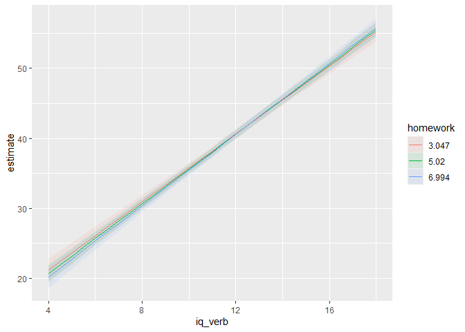
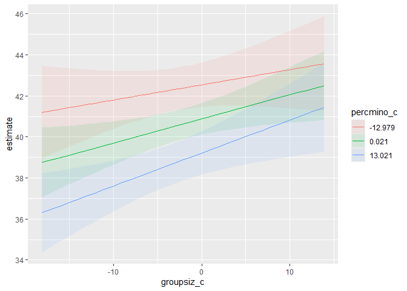
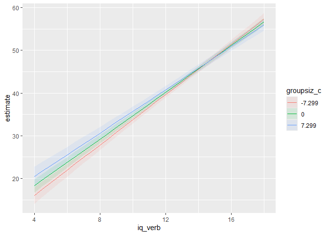
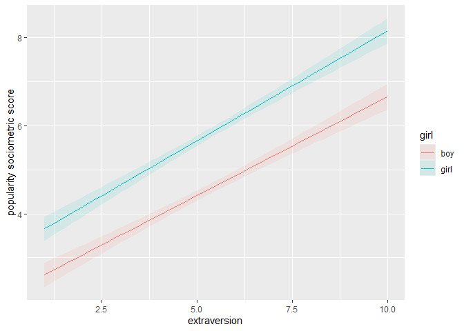
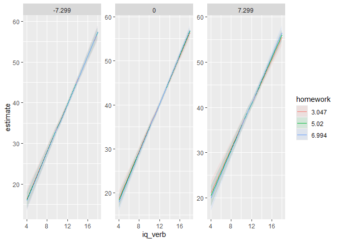
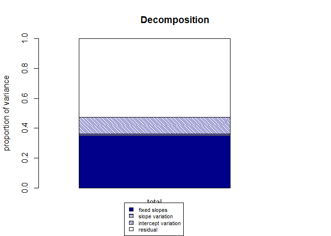

# Multilevel Regression: interactions
Mauricio Garnier-Villarreal
2026-04-01

- [<span class="toc-section-number">1</span> What is Moderation
  Analysis?](#what-is-moderation-analysis)
  - [<span class="toc-section-number">1.1</span> Packages and
    Data](#packages-and-data)
- [<span class="toc-section-number">2</span> Theoretical and Analytical
  Models](#theoretical-and-analytical-models)
- [<span class="toc-section-number">3</span> Level-1
  Interactions](#level-1-interactions)
  - [<span class="toc-section-number">3.1</span> Model
    Specification](#model-specification)
  - [<span class="toc-section-number">3.2</span> Allowing Random
    Slopes](#allowing-random-slopes)
  - [<span class="toc-section-number">3.3</span> Effect size
    difference](#effect-size-difference)
  - [<span class="toc-section-number">3.4</span> Probing and Plotting
    Level-1 Interactions](#probing-and-plotting-level-1-interactions)
  - [<span class="toc-section-number">3.5</span> Model
    tables](#model-tables)
- [<span class="toc-section-number">4</span> Level-2
  Interactions](#level-2-interactions)
  - [<span class="toc-section-number">4.1</span> Model
    Specification](#model-specification-1)
  - [<span class="toc-section-number">4.2</span> Centering Level-2
    Predictors](#centering-level-2-predictors)
  - [<span class="toc-section-number">4.3</span> Effect size
    difference](#effect-size-difference-1)
  - [<span class="toc-section-number">4.4</span> Probing and Plotting
    Level-2 Interactions](#probing-and-plotting-level-2-interactions)
  - [<span class="toc-section-number">4.5</span> Model
    tables](#model-tables-1)
- [<span class="toc-section-number">5</span> Cross-Level
  Interactions](#cross-level-interactions)
  - [<span class="toc-section-number">5.1</span> Model
    Specification](#model-specification-2)
  - [<span class="toc-section-number">5.2</span> Testing the Need for
    Random Slopes](#testing-the-need-for-random-slopes)
  - [<span class="toc-section-number">5.3</span> Effect size
    difference](#effect-size-difference-2)
  - [<span class="toc-section-number">5.4</span> Probing and Plotting
    Cross-Level
    Interactions](#probing-and-plotting-cross-level-interactions)
  - [<span class="toc-section-number">5.5</span> Model
    tables](#model-tables-2)
- [<span class="toc-section-number">6</span> Example with a Binary
  Moderator](#example-with-a-binary-moderator)
- [<span class="toc-section-number">7</span> Three-Way
  Interactions](#three-way-interactions)
  - [<span class="toc-section-number">7.1</span> Probing Three-Way
    Interactions](#probing-three-way-interactions)
  - [<span class="toc-section-number">7.2</span> Plotting Three-Way
    Interactions](#plotting-three-way-interactions)
  - [<span class="toc-section-number">7.3</span> Model
    tables](#model-tables-3)
- [<span class="toc-section-number">8</span> Effect Sizes for
  Interactions](#effect-sizes-for-interactions)
  - [<span class="toc-section-number">8.1</span> Pseudo-$R^2$
    Change](#pseudo-r2-change)
  - [<span class="toc-section-number">8.2</span> Using the `performance`
    Package](#using-the-performance-package)
  - [<span class="toc-section-number">8.3</span> Using the `r2mlm`
    Package](#using-the-r2mlm-package)
- [<span class="toc-section-number">9</span> Summary and
  Recommendations](#summary-and-recommendations)
- [<span class="toc-section-number">10</span> References](#references)

# What is Moderation Analysis?

Moderation occurs when the relationship between two variables depends on
a third variable. In traditional single-level regression, a moderation
(interaction) hypothesis is tested by including a product term in the
model:

$$ Y = b_0 + b_1X + b_2Z + b_3XZ + e $$

In this model, the effect of $X$ on $Y$ is no longer constant; it
becomes a function of $Z$:

$$ \text{Effect of } X = b_1 + b_3Z $$

If $b_3$ is statistically significant, we conclude that $Z$ moderates
the $X \rightarrow Y$ relationship (or that $X$ moderates the
$Z \rightarrow Y$).

In multilevel modeling (MLM), moderation can occur at different levels
of analysis: - **Level-1 interactions**: Both predictors are at level-1
(e.g., student-level variables interacting to predict a student
outcome) - **Level-2 interactions**: Both predictors are at level-2
(e.g., school-level variables interacting to predict school outcomes) -
**Cross-level interactions**: A level-2 variable moderates a level-1
relationship (e.g., school characteristics changing how student SES
affects achievement)

This tutorial will guide you through estimating, probing, and
interpreting each type of interaction using R.

## Packages and Data

We will use the `SB.csv` dataset (Snijders & Bosker, 1999) containing
2,287 pupils in 131 schools. Our outcome is a language post-test score
(`langpost`). We will use several predictors: verbal IQ (`iq_verb`,
level-1), group size (`groupsiz`, level-2), and percent minority
(`percmino`, level-2). We’ll also use the `popular.csv` dataset (Hox,
2010) for a binary moderator example.

``` r
# Load required packages
library(lme4)
library(lmerTest)
library(rio)
library(parameters)
library(performance)
library(r2mlm)
library(dplyr)
library(ggplot2)
library(tidyr)
library(marginaleffects)
library(sjPlot)


# Read data
SB <- import("SB.csv")
SB <- drop_na(SB)  # remove missing for simplicity
head(SB)
```

      schoolnr pupilnr iq_verb  iq_perf sex minority repeatgr aritpret classnr
    1        1   17001    15.0 12.33333   0        0        0       14     180
    2        1   17002    14.5 10.00000   0        1        0       12     180
    3        1   17003     9.5 11.00000   0        0        0       10     180
    4        1   17004    11.0 10.00000   0        0        0       13     180
    5        1   17005     8.0  6.66667   0        0        0        8     180
    6        1   17006     9.5  9.00000   0        1        0        8     180
      aritpost langpret langpost ses denomina schoolse satiprin natitest meetings
    1       24       36       46  23        1       11  3.42857        0      1.7
    2       19       36       45  10        1       11  3.42857        0      1.7
    3       24       33       33  15        1       11  3.42857        0      1.7
    4       26       29       46  23        1       11  3.42857        0      1.7
    5        9       19       20  10        1       11  3.42857        0      1.7
    6       13       22       30  10        1       11  3.42857        0      1.7
      currmeet mixedgra percmino aritdiff homework classsiz groupsiz
    1  1.83333        0       60       12  2.33333       29       29
    2  1.83333        0       60       12  2.33333       29       29
    3  1.83333        0       60       12  2.33333       29       29
    4  1.83333        0       60       12  2.33333       29       29
    5  1.83333        0       60       12  2.33333       29       29
    6  1.83333        0       60       12  2.33333       29       29

``` r
# For binary moderator example
pop <- import("popular2.sav")
pop <- drop_na(pop)
pop$girl <- factor(pop$sex, labels = c("boy", "girl"))
head(pop)
```

      pupil class extrav sex texp popular popteach    Zextrav       Zsex    Ztexp
    1     1     1      5   1   24     6.3        6 -0.1703149  0.9888125 1.486153
    2     2     1      7   0   24     4.9        5  1.4140098 -1.0108084 1.486153
    3     3     1      4   1   24     5.3        6 -0.9624772  0.9888125 1.486153
    4     4     1      3   1   24     4.7        5 -1.7546396  0.9888125 1.486153
    5     5     1      5   1   24     6.0        6 -0.1703149  0.9888125 1.486153
    6     6     1      4   0   24     4.7        5 -0.9624772 -1.0108084 1.486153
        Zpopular   Zpopteach Cextrav Ctexp Csex girl
    1  0.8850133  0.66905609  -0.215 9.737  0.5 girl
    2 -0.1276291 -0.04308451   1.785 9.737 -0.5  boy
    3  0.1616973  0.66905609  -1.215 9.737  0.5 girl
    4 -0.2722923 -0.04308451  -2.215 9.737  0.5 girl
    5  0.6680185  0.66905609  -0.215 9.737  0.5 girl
    6 -0.2722923 -0.04308451  -1.215 9.737 -0.5  boy

# Theoretical and Analytical Models

In MLM, interactions are specified by including product terms in the
fixed part of the model. However, the model also includes random effects
that account for clustering. The general form of a two-level model with
interactions can be written as:

**Level 1 (within clusters):**
$$ Y_{ij} = \beta_{0j} + \beta_{1j}X_{1ij} + \beta_{2j}X_{2ij} + \beta_{3j}X_{1ij}X_{2ij} + e_{ij} $$

**Level 2 (between clusters):**
$$ \beta_{0j} = \gamma_{00} + \gamma_{01}W_{1j} + u_{0j} $$
$$ \beta_{1j} = \gamma_{10} + \gamma_{11}W_{1j} + u_{1j} $$
$$ \beta_{2j} = \gamma_{20} + u_{2j} $$
$$ \beta_{3j} = \gamma_{30} + u_{3j} $$

Where: - $\gamma_{00}$ is the overall intercept - $\gamma_{10}$,
$\gamma_{20}$, $\gamma_{30}$ are average slopes - $u$ terms are random
effects (variances $\tau_{00}$, $\tau_{11}$, $\tau_{22}$, $\tau_{33}$
and covariances) - $e_{ij}$ is the level-1 residual (variance
$\sigma^2$)

The specific form depends on which effects are allowed to vary randomly.
For testing interactions, the fixed effects ($\gamma$ coefficients) are
our primary interest, but correctly specifying the random part is
crucial for accurate standard errors.

# Level-1 Interactions

Level-1 interactions involve two predictors measured at the individual
(lowest) level. For example, we might hypothesize that the effect of IQ
on language scores depends on homework time. Both variables are at the
student level.

## Model Specification

For a level-1 interaction, we include the product term in the level-1
model. We also need to decide whether to allow the slopes to vary
randomly. A basic model with a level-1 interaction (between `iq_verb`
and `groupsiz` – though note `groupsiz` is actually a level-2 variable
in our data; for a pure level-1 example we would need two level-1
predictors). For demonstration, let’s create a level-1 predictor
`homework` (simulated) to interact with IQ.

``` r
# Create a simulated homework variable (level-1)
set.seed(123)
SB$homework <- rnorm(nrow(SB), mean = 5, sd = 2)
SB$homework <- ifelse(SB$homework < 0, 0, SB$homework)  # no negative hours
```

We should always start with **main effects** model, in which we estimate
the multilevel regression **without** the interaction between
predictors, so a multiple regression with random intercepts. For the CI
in MLM we ask for `profile` likelihood intervals, these are more
accurate in MLM models

``` r
m0_l1 <- lmer(langpost ~ 1 + iq_verb + homework + (1 | schoolnr),
              data = SB, REML = FALSE)

summary(m0_l1)
```

    Linear mixed model fit by maximum likelihood . t-tests use Satterthwaite's
      method [lmerModLmerTest]
    Formula: langpost ~ 1 + iq_verb + homework + (1 | schoolnr)
       Data: SB

          AIC       BIC    logLik -2*log(L)  df.resid 
      15261.7   15290.3   -7625.8   15251.7      2282 

    Scaled residuals: 
        Min      1Q  Median      3Q     Max 
    -4.0835 -0.6398  0.0598  0.7085  3.1333 

    Random effects:
     Groups   Name        Variance Std.Dev.
     schoolnr (Intercept)  9.498   3.082   
     Residual             42.225   6.498   
    Number of obs: 2287, groups:  schoolnr, 131

    Fixed effects:
                  Estimate Std. Error         df t value Pr(>|t|)    
    (Intercept)   11.29960    0.95956 2045.34676  11.776   <2e-16 ***
    iq_verb        2.48714    0.07011 2276.75235  35.477   <2e-16 ***
    homework      -0.02451    0.07025 2195.82718  -0.349    0.727    
    ---
    Signif. codes:  0 '***' 0.001 '**' 0.01 '*' 0.05 '.' 0.1 ' ' 1

    Correlation of Fixed Effects:
             (Intr) iq_vrb
    iq_verb  -0.873       
    homework -0.402  0.039

``` r
parameters(m0_l1, ci_method = "profile")
```

    # Fixed Effects

    Parameter   | Coefficient |   SE |         95% CI | t(2282) |      p
    --------------------------------------------------------------------
    (Intercept) |       11.30 | 0.96 | [ 9.41, 13.19] |   11.78 | < .001
    iq verb     |        2.49 | 0.07 | [ 2.35,  2.63] |   35.48 | < .001
    homework    |       -0.02 | 0.07 | [-0.16,  0.11] |   -0.35 | 0.727 

    # Random Effects

    Parameter                | Coefficient
    --------------------------------------
    SD (Intercept: schoolnr) |        3.08
    SD (Residual)            |        6.50

**Explanation of syntax:**

- `langpost ~ 1 + iq_verb + homework` specifies the fixed part:
  intercept (1) and main effects of IQ and homework.
- `(1 | schoolnr)` adds a random intercept for schools, allowing the
  mean language score to vary across schools.
- `REML = FALSE` uses maximum likelihood (ML) instead of restricted
  maximum likelihood (REML), which is necessary for likelihood‑ratio
  tests.
- The `parameters()` function with `ci_method = "profile"` computes
  confidence intervals based on profile likelihood, which are more
  accurate for mixed models than Wald intervals.

**Interpretation:** The fixed effects show that IQ is a strong positive
predictor of language scores ($b = 2.49$, $p < .001$), while homework
has a negligible and non‑significant effect ($b = -0.02$, $p = 0.727$).
The random intercept variance ($\tau_{00} = 9.50$) indicates moderate
variation between schools after accounting for the predictors. The
residual variance ($\sigma^2 = 42.22$) represents within‑school
variation.

Now we fit a model with an interaction between `iq_verb` and `homework`:

``` r
m1_l1 <- lmer(langpost ~ 1 + iq_verb * homework + (1 | schoolnr),
              data = SB, REML = FALSE)

summary(m1_l1)
```

    Linear mixed model fit by maximum likelihood . t-tests use Satterthwaite's
      method [lmerModLmerTest]
    Formula: langpost ~ 1 + iq_verb * homework + (1 | schoolnr)
       Data: SB

          AIC       BIC    logLik -2*log(L)  df.resid 
      15262.9   15297.3   -7625.4   15250.9      2281 

    Scaled residuals: 
        Min      1Q  Median      3Q     Max 
    -4.0919 -0.6366  0.0655  0.7069  3.0393 

    Random effects:
     Groups   Name        Variance Std.Dev.
     schoolnr (Intercept)  9.485   3.080   
     Residual             42.212   6.497   
    Number of obs: 2287, groups:  schoolnr, 131

    Fixed effects:
                       Estimate Std. Error         df t value Pr(>|t|)    
    (Intercept)        13.05977    2.21306 2273.08378   5.901 4.15e-09 ***
    iq_verb             2.33832    0.18261 2229.47576  12.805  < 2e-16 ***
    homework           -0.36834    0.39575 2210.46078  -0.931    0.352    
    iq_verb:homework    0.02913    0.03299 2209.20543   0.883    0.377    
    ---
    Signif. codes:  0 '***' 0.001 '**' 0.01 '*' 0.05 '.' 0.1 ' ' 1

    Correlation of Fixed Effects:
                (Intr) iq_vrb homwrk
    iq_verb     -0.977              
    homework    -0.918  0.911       
    iq_vrb:hmwr  0.901 -0.923 -0.984

``` r
parameters(m1_l1, ci_method = "profile")
```

    # Fixed Effects

    Parameter          | Coefficient |   SE |         95% CI | t(2281) |      p
    ---------------------------------------------------------------------------
    (Intercept)        |       13.06 | 2.21 | [ 8.72, 17.40] |    5.90 | < .001
    iq verb            |        2.34 | 0.18 | [ 1.98,  2.70] |   12.80 | < .001
    homework           |       -0.37 | 0.40 | [-1.14,  0.41] |   -0.93 | 0.352 
    iq verb × homework |        0.03 | 0.03 | [-0.04,  0.09] |    0.88 | 0.377 

    # Random Effects

    Parameter                | Coefficient
    --------------------------------------
    SD (Intercept: schoolnr) |        3.08
    SD (Residual)            |        6.50

**Explanation of syntax:**

- `iq_verb * homework` is shorthand for
  `iq_verb + homework + iq_verb:homework`. The colon `:` denotes the
  interaction term.
- The rest of the formula is the same as the main‑effects model.

**Interpretation:**

- The interaction term `iq_verb:homework` has a coefficient of 0.029
  ($p = 0.377$), which is not statistically significant. This means that
  the effect of IQ does not change significantly with different levels
  of homework.
- The main effect of IQ (2.34) now represents the effect of IQ when
  homework = 0. Because homework was not centered, this may not be a
  meaningful value. Similarly, the homework main effect (-0.37) is the
  effect when IQ = 0.
- The random intercept variance (9.49) and residual variance (42.21)
  remain similar to the main‑effects model.

We can also tests the significance of the interaction with the LRT model
comparison, by comparing the main effects and interaction models. In
this example the $p$-value will be the same as the $p$-value of the
regression table as both predictors are continuous. If you have
categorical predictors with more than 2 categories the results would not
be equivalent and we recommend you to use the LRT comparison in those
cases

``` r
anova(m0_l1, m1_l1)
```

    Data: SB
    Models:
    m0_l1: langpost ~ 1 + iq_verb + homework + (1 | schoolnr)
    m1_l1: langpost ~ 1 + iq_verb * homework + (1 | schoolnr)
          npar   AIC   BIC  logLik -2*log(L)  Chisq Df Pr(>Chisq)
    m0_l1    5 15262 15290 -7625.8     15252                     
    m1_l1    6 15263 15297 -7625.4     15251 0.7792  1     0.3774

In this example, we fail to reject the null hypothesis of `iq_verb`
slopes being equal across `homework` levels as $p = 0.377$.

## Allowing Random Slopes

If we believe the IQ effect (or the interaction itself) varies across
schools, we can add random slopes:

``` r
m1_l1_random <- lmer(langpost ~ 1 + iq_verb * homework + 
                       (1 + iq_verb | schoolnr),
                     data = SB, REML = FALSE)

summary(m1_l1_random)
```

    Linear mixed model fit by maximum likelihood . t-tests use Satterthwaite's
      method [lmerModLmerTest]
    Formula: langpost ~ 1 + iq_verb * homework + (1 + iq_verb | schoolnr)
       Data: SB

          AIC       BIC    logLik -2*log(L)  df.resid 
      15247.8   15293.7   -7615.9   15231.8      2279 

    Scaled residuals: 
        Min      1Q  Median      3Q     Max 
    -4.1281 -0.6516  0.0578  0.7113  2.7387 

    Random effects:
     Groups   Name        Variance Std.Dev. Corr  
     schoolnr (Intercept) 42.7995  6.5421         
              iq_verb      0.1048  0.3237   -0.97 
     Residual             41.8218  6.4670         
    Number of obs: 2287, groups:  schoolnr, 131

    Fixed effects:
                       Estimate Std. Error         df t value Pr(>|t|)    
    (Intercept)        12.63050    2.28711 1109.70885   5.522 4.16e-08 ***
    iq_verb             2.37632    0.18562 1250.95356  12.802  < 2e-16 ***
    homework           -0.32661    0.39783 2015.82601  -0.821    0.412    
    iq_verb:homework    0.02660    0.03309 1997.14599   0.804    0.421    
    ---
    Signif. codes:  0 '***' 0.001 '**' 0.01 '*' 0.05 '.' 0.1 ' ' 1

    Correlation of Fixed Effects:
                (Intr) iq_vrb homwrk
    iq_verb     -0.980              
    homework    -0.895  0.901       
    iq_vrb:hmwr  0.879 -0.913 -0.984
    optimizer (nloptwrap) convergence code: 0 (OK)
    Model failed to converge with max|grad| = 0.670668 (tol = 0.002, component 1)
      See ?lme4::convergence and ?lme4::troubleshooting.

``` r
parameters(m1_l1_random, ci_method = "profile")
```

    # Fixed Effects

    Parameter          | Coefficient |   SE | t(2279) |      p
    ----------------------------------------------------------
    (Intercept)        |       12.63 | 2.29 |    5.52 | < .001
    iq verb            |        2.38 | 0.19 |   12.80 | < .001
    homework           |       -0.33 | 0.40 |   -0.82 | 0.412 
    iq verb × homework |        0.03 | 0.03 |    0.80 | 0.421 

    # Random Effects

    Parameter                         | Coefficient
    -----------------------------------------------
    SD (Intercept: schoolnr)          |        6.54
    SD (iq_verb: schoolnr)            |        0.32
    Cor (Intercept~iq_verb: schoolnr) |       -0.97
    SD (Residual)                     |        6.47

**Explanation:** The random part `(1 + iq_verb | schoolnr)` allows both
the intercept and the slope of IQ to vary across schools. The `|`
separates the random effects from the grouping variable. This means we
estimate a random intercept variance, a random slope variance for IQ,
and their covariance.

**Interpretation:** The random slope variance for IQ is 0.105,
indicating that the effect of IQ on language scores varies across
schools. The correlation between the random intercept and slope is
-0.97, suggesting that schools with higher average language scores tend
to have weaker IQ effects. The interaction term remains non‑significant
($p = 0.421$). Adding random slopes improved the model fit (AIC
decreased from 15263 to 15248), but the interaction still does not reach
significance.

## Effect size difference

We can also evaluate the overall model fit improvement when we add the
interaction, by evaluating the change in $R^2$. We can first check this
by the change in conditional and marginal $R^2$ from the `performance`
package

``` r
r2(m0_l1)
```

    # R2 for Mixed Models

      Conditional R2: 0.460
         Marginal R2: 0.339

``` r
r2(m1_l1)
```

    # R2 for Mixed Models

      Conditional R2: 0.460
         Marginal R2: 0.339

In this case we see that the conditional and marginal $R^2$ are
basically equal between the main effects and interaction models.
Indicating that the model fit doesn’t improve by adding the interaction

``` r
r2mlm(m0_l1, bargraph = F)
```

    $Decompositions
                        total
    fixed           0.3387358
    slope variation 0.0000000
    mean variation  0.1214248
    sigma2          0.5398394

    $R2s
            total
    f   0.3387358
    v   0.0000000
    m   0.1214248
    fv  0.3387358
    fvm 0.4601606

``` r
r2mlm(m1_l1, bargraph = F)
```

    $Decompositions
                        total
    fixed           0.3388931
    slope variation 0.0000000
    mean variation  0.1212961
    sigma2          0.5398108

    $R2s
            total
    f   0.3388931
    v   0.0000000
    m   0.1212961
    fv  0.3388931
    fvm 0.4601892

When comparing the detail particioning of $R^2$ by the `r2mlm()`
function, we see that the improvement when adding the interaction is
negligible.

## Probing and Plotting Level-1 Interactions

As in single-level regression, we probe interactions by examining simple
slopes of the focal predictor at different values of the moderator. We
can use the marginaleffects package for this.

First, choose representative values of the moderator. Common choices are
the mean and ±1 standard deviation.

``` r
# Get mean and SD of homework
mean_hw <- mean(SB$homework, na.rm = TRUE)
sd_hw <- sd(SB$homework, na.rm = TRUE)

# Values for probing
hw_vals <- c(mean_hw - sd_hw, mean_hw, mean_hw + sd_hw)
names(hw_vals) <- c("-1 SD", "Mean", "+1 SD")
hw_vals <- round(hw_vals, 3)
hw_vals
```

    -1 SD  Mean +1 SD 
    3.047 5.020 6.994 

Now compute simple slopes of IQ at these homework values:

``` r
avg_slopes(m1_l1, 
           variables = "iq_verb",
           by = "homework",
           newdata = datagrid(homework = hw_vals))
```


     homework Estimate Std. Error    z Pr(>|z|)     S 2.5 % 97.5 %
         3.05     2.43     0.0979 24.8   <0.001 448.6  2.24   2.62
         5.02     2.48     0.0702 35.4   <0.001 910.1  2.35   2.62
         6.99     2.54     0.0936 27.1   <0.001 536.7  2.36   2.73

    Term: iq_verb
    Type: response
    Comparison: dY/dX

**Explanation of syntax:**  
- `avg_slopes()` computes average marginal effects (or simple slopes)
from a fitted model.  
- `variables = "iq_verb"` specifies the predictor whose slope we want.  
- `by = "homework"` indicates that we want separate slopes for different
values of homework.  
- `newdata = datagrid(homework = hw_vals)` tells the function to
evaluate the slopes at the three chosen homework levels.

**Interpretation:** The effect of IQ on language scores is 2.43 when
homework is low (3.05 hours), 2.48 at average homework (5.02 hours), and
2.54 when homework is high (6.99 hours). Although the slopes increase
slightly with homework, the interaction term was not significant, so
these differences are not reliable.

We can also plot the interaction:

``` r
plot_predictions(m1_l1, 
                 by = c("iq_verb", "homework"),
                 newdata = datagrid(iq_verb = unique(SB$iq_verb),
                                    homework = hw_vals ))
```



**Explanation:**  
- `plot_predictions()` generates a plot of predicted values.  
- `by = c("iq_verb", "homework")` places `iq_verb` on the x‑axis and
creates separate lines for each value of `homework`.  
- The `newdata` argument defines the grid of predictor values for which
predictions are made.

This plot shows the predicted language score across IQ values for
different levels of homework, allowing visual assessment of whether the
slopes differ. The lines appear nearly parallel, consistent with the
non‑significant interaction.

## Model tables

We can use the `tab_model()` function to present the results from both
models next to each other

``` r
tab_model(m0_l1, m1_l1)
```

<table style="border-collapse:collapse; border:none;">
<tr>
<th style="border-top: double; text-align:center; font-style:normal; font-weight:bold; padding:0.2cm;  text-align:left; ">&nbsp;</th>
<th colspan="3" style="border-top: double; text-align:center; font-style:normal; font-weight:bold; padding:0.2cm; ">langpost</th>
<th colspan="3" style="border-top: double; text-align:center; font-style:normal; font-weight:bold; padding:0.2cm; ">langpost</th>
</tr>
<tr>
<td style=" text-align:center; border-bottom:1px solid; font-style:italic; font-weight:normal;  text-align:left; ">Predictors</td>
<td style=" text-align:center; border-bottom:1px solid; font-style:italic; font-weight:normal;  ">Estimates</td>
<td style=" text-align:center; border-bottom:1px solid; font-style:italic; font-weight:normal;  ">CI</td>
<td style=" text-align:center; border-bottom:1px solid; font-style:italic; font-weight:normal;  ">p</td>
<td style=" text-align:center; border-bottom:1px solid; font-style:italic; font-weight:normal;  ">Estimates</td>
<td style=" text-align:center; border-bottom:1px solid; font-style:italic; font-weight:normal;  ">CI</td>
<td style=" text-align:center; border-bottom:1px solid; font-style:italic; font-weight:normal;  col7">p</td>
</tr>
<tr>
<td style=" padding:0.2cm; text-align:left; vertical-align:top; text-align:left; ">(Intercept)</td>
<td style=" padding:0.2cm; text-align:left; vertical-align:top; text-align:center;  ">11.30</td>
<td style=" padding:0.2cm; text-align:left; vertical-align:top; text-align:center;  ">9.42&nbsp;&ndash;&nbsp;13.18</td>
<td style=" padding:0.2cm; text-align:left; vertical-align:top; text-align:center;  "><strong>&lt;0.001</strong></td>
<td style=" padding:0.2cm; text-align:left; vertical-align:top; text-align:center;  ">13.06</td>
<td style=" padding:0.2cm; text-align:left; vertical-align:top; text-align:center;  ">8.72&nbsp;&ndash;&nbsp;17.40</td>
<td style=" padding:0.2cm; text-align:left; vertical-align:top; text-align:center;  col7"><strong>&lt;0.001</strong></td>
</tr>
<tr>
<td style=" padding:0.2cm; text-align:left; vertical-align:top; text-align:left; ">iq verb</td>
<td style=" padding:0.2cm; text-align:left; vertical-align:top; text-align:center;  ">2.49</td>
<td style=" padding:0.2cm; text-align:left; vertical-align:top; text-align:center;  ">2.35&nbsp;&ndash;&nbsp;2.62</td>
<td style=" padding:0.2cm; text-align:left; vertical-align:top; text-align:center;  "><strong>&lt;0.001</strong></td>
<td style=" padding:0.2cm; text-align:left; vertical-align:top; text-align:center;  ">2.34</td>
<td style=" padding:0.2cm; text-align:left; vertical-align:top; text-align:center;  ">1.98&nbsp;&ndash;&nbsp;2.70</td>
<td style=" padding:0.2cm; text-align:left; vertical-align:top; text-align:center;  col7"><strong>&lt;0.001</strong></td>
</tr>
<tr>
<td style=" padding:0.2cm; text-align:left; vertical-align:top; text-align:left; ">homework</td>
<td style=" padding:0.2cm; text-align:left; vertical-align:top; text-align:center;  ">&#45;0.02</td>
<td style=" padding:0.2cm; text-align:left; vertical-align:top; text-align:center;  ">&#45;0.16&nbsp;&ndash;&nbsp;0.11</td>
<td style=" padding:0.2cm; text-align:left; vertical-align:top; text-align:center;  ">0.727</td>
<td style=" padding:0.2cm; text-align:left; vertical-align:top; text-align:center;  ">&#45;0.37</td>
<td style=" padding:0.2cm; text-align:left; vertical-align:top; text-align:center;  ">&#45;1.14&nbsp;&ndash;&nbsp;0.41</td>
<td style=" padding:0.2cm; text-align:left; vertical-align:top; text-align:center;  col7">0.352</td>
</tr>
<tr>
<td style=" padding:0.2cm; text-align:left; vertical-align:top; text-align:left; ">iq verb × homework</td>
<td style=" padding:0.2cm; text-align:left; vertical-align:top; text-align:center;  "></td>
<td style=" padding:0.2cm; text-align:left; vertical-align:top; text-align:center;  "></td>
<td style=" padding:0.2cm; text-align:left; vertical-align:top; text-align:center;  "></td>
<td style=" padding:0.2cm; text-align:left; vertical-align:top; text-align:center;  ">0.03</td>
<td style=" padding:0.2cm; text-align:left; vertical-align:top; text-align:center;  ">&#45;0.04&nbsp;&ndash;&nbsp;0.09</td>
<td style=" padding:0.2cm; text-align:left; vertical-align:top; text-align:center;  col7">0.377</td>
</tr>
<tr>
<td colspan="7" style="font-weight:bold; text-align:left; padding-top:.8em;">Random Effects</td>
</tr>
&#10;<tr>
<td style=" padding:0.2cm; text-align:left; vertical-align:top; text-align:left; padding-top:0.1cm; padding-bottom:0.1cm;">&sigma;<sup>2</sup></td>
<td style=" padding:0.2cm; text-align:left; vertical-align:top; padding-top:0.1cm; padding-bottom:0.1cm; text-align:left;" colspan="3">42.22</td>
<td style=" padding:0.2cm; text-align:left; vertical-align:top; padding-top:0.1cm; padding-bottom:0.1cm; text-align:left;" colspan="3">42.21</td>
</tr>
&#10;<tr>
<td style=" padding:0.2cm; text-align:left; vertical-align:top; text-align:left; padding-top:0.1cm; padding-bottom:0.1cm;">&tau;<sub>00</sub></td>
<td style=" padding:0.2cm; text-align:left; vertical-align:top; padding-top:0.1cm; padding-bottom:0.1cm; text-align:left;" colspan="3">9.50 <sub>schoolnr</sub></td>
<td style=" padding:0.2cm; text-align:left; vertical-align:top; padding-top:0.1cm; padding-bottom:0.1cm; text-align:left;" colspan="3">9.49 <sub>schoolnr</sub></td>
&#10;<tr>
<td style=" padding:0.2cm; text-align:left; vertical-align:top; text-align:left; padding-top:0.1cm; padding-bottom:0.1cm;">ICC</td>
<td style=" padding:0.2cm; text-align:left; vertical-align:top; padding-top:0.1cm; padding-bottom:0.1cm; text-align:left;" colspan="3">0.18</td>
<td style=" padding:0.2cm; text-align:left; vertical-align:top; padding-top:0.1cm; padding-bottom:0.1cm; text-align:left;" colspan="3">0.18</td>
&#10;<tr>
<td style=" padding:0.2cm; text-align:left; vertical-align:top; text-align:left; padding-top:0.1cm; padding-bottom:0.1cm;">N</td>
<td style=" padding:0.2cm; text-align:left; vertical-align:top; padding-top:0.1cm; padding-bottom:0.1cm; text-align:left;" colspan="3">131 <sub>schoolnr</sub></td>
<td style=" padding:0.2cm; text-align:left; vertical-align:top; padding-top:0.1cm; padding-bottom:0.1cm; text-align:left;" colspan="3">131 <sub>schoolnr</sub></td>
<tr>
<td style=" padding:0.2cm; text-align:left; vertical-align:top; text-align:left; padding-top:0.1cm; padding-bottom:0.1cm; border-top:1px solid;">Observations</td>
<td style=" padding:0.2cm; text-align:left; vertical-align:top; padding-top:0.1cm; padding-bottom:0.1cm; text-align:left; border-top:1px solid;" colspan="3">2287</td>
<td style=" padding:0.2cm; text-align:left; vertical-align:top; padding-top:0.1cm; padding-bottom:0.1cm; text-align:left; border-top:1px solid;" colspan="3">2287</td>
</tr>
<tr>
<td style=" padding:0.2cm; text-align:left; vertical-align:top; text-align:left; padding-top:0.1cm; padding-bottom:0.1cm;">Marginal R<sup>2</sup> / Conditional R<sup>2</sup></td>
<td style=" padding:0.2cm; text-align:left; vertical-align:top; padding-top:0.1cm; padding-bottom:0.1cm; text-align:left;" colspan="3">0.339 / 0.460</td>
<td style=" padding:0.2cm; text-align:left; vertical-align:top; padding-top:0.1cm; padding-bottom:0.1cm; text-align:left;" colspan="3">0.339 / 0.460</td>
</tr>
&#10;</table>

# Level-2 Interactions

Level-2 interactions involve two predictors measured at the cluster
level. For example, we might hypothesize that the effect of school size
on average achievement depends on school type (public vs. private). In
our data, `groupsiz` (group size) and `percmino` (percent minority) are
level-2 variables.

## Model Specification

For a level-2 interaction, we include the product term in the level-2
equation for the intercept. First, we need to create school-mean
aggregated variables.

``` r
# Aggregate to school level
school_data <- SB %>%
  group_by(schoolnr) %>%
  summarise(langpost_mean = mean(langpost),
            groupsiz = first(groupsiz),
            percmino = first(percmino))
```

**Note:** This could be a single-level model at the school level,
aggregated regressions. In a true multilevel context, we would fit this
as a level-2 model with random intercepts, but with only 131 schools, we
might treat schools as fixed or use MLM with random intercepts but
level-2 predictors only. Here’s how to specify it in MLM form, but
including the random intercept:

As always we should start with the main effects model

``` r
m0_l2 <- lmer(langpost ~ 1 + groupsiz + percmino + (1 | schoolnr),
                  data = SB, REML = FALSE)

summary(m0_l2)
```

    Linear mixed model fit by maximum likelihood . t-tests use Satterthwaite's
      method [lmerModLmerTest]
    Formula: langpost ~ 1 + groupsiz + percmino + (1 | schoolnr)
       Data: SB

          AIC       BIC    logLik -2*log(L)  df.resid 
      16231.0   16259.6   -8110.5   16221.0      2282 

    Scaled residuals: 
         Min       1Q   Median       3Q      Max 
    -3.11900 -0.64925  0.07711  0.73923  2.61080 

    Random effects:
     Groups   Name        Variance Std.Dev.
     schoolnr (Intercept) 14.21    3.770   
     Residual             64.57    8.036   
    Number of obs: 2287, groups:  schoolnr, 131

    Fixed effects:
                 Estimate Std. Error        df t value Pr(>|t|)    
    (Intercept)  38.82156    1.10522 157.20577  35.126  < 2e-16 ***
    groupsiz      0.12481    0.04797 146.57281   2.602   0.0102 *  
    percmino     -0.14184    0.02710 136.50374  -5.234 6.12e-07 ***
    ---
    Signif. codes:  0 '***' 0.001 '**' 0.01 '*' 0.05 '.' 0.1 ' ' 1

    Correlation of Fixed Effects:
             (Intr) gropsz
    groupsiz -0.923       
    percmino -0.239  0.067

``` r
parameters(m0_l2, ci_method = "profile")
```

    # Fixed Effects

    Parameter   | Coefficient |   SE |         95% CI | t(2282) |      p
    --------------------------------------------------------------------
    (Intercept) |       38.82 | 1.11 | [36.65, 41.01] |   35.13 | < .001
    groupsiz    |        0.12 | 0.05 | [ 0.03,  0.22] |    2.60 | 0.009 
    percmino    |       -0.14 | 0.03 | [-0.20, -0.09] |   -5.23 | < .001

    # Random Effects

    Parameter                | Coefficient
    --------------------------------------
    SD (Intercept: schoolnr) |        3.77
    SD (Residual)            |        8.04

**Interpretation:** Both group size (0.12, $p = 0.009$) and percent
minority (-0.14, $p < .001$) are significant predictors of language
scores. The random intercept variance (14.21) is larger than in the
level‑1 models, because we are not yet including the strong level‑1
predictor IQ.

Then we can add the interaction

``` r
m1_l2 <- lmer(langpost ~ 1 + groupsiz * percmino + (1 | schoolnr),
                  data = SB, REML = FALSE)

summary(m1_l2)
```

    Linear mixed model fit by maximum likelihood . t-tests use Satterthwaite's
      method [lmerModLmerTest]
    Formula: langpost ~ 1 + groupsiz * percmino + (1 | schoolnr)
       Data: SB

          AIC       BIC    logLik -2*log(L)  df.resid 
      16231.6   16266.0   -8109.8   16219.6      2281 

    Scaled residuals: 
         Min       1Q   Median       3Q      Max 
    -3.13253 -0.64990  0.08087  0.73576  2.57809 

    Random effects:
     Groups   Name        Variance Std.Dev.
     schoolnr (Intercept) 14.17    3.764   
     Residual             64.54    8.034   
    Number of obs: 2287, groups:  schoolnr, 131

    Fixed effects:
                        Estimate Std. Error         df t value Pr(>|t|)    
    (Intercept)        39.421046   1.217192 165.969834  32.387  < 2e-16 ***
    groupsiz            0.095133   0.054222 151.697786   1.755 0.081362 .  
    percmino           -0.205243   0.060571 167.382407  -3.388 0.000876 ***
    groupsiz:percmino   0.003338   0.002852 130.852637   1.170 0.243980    
    ---
    Signif. codes:  0 '***' 0.001 '**' 0.01 '*' 0.05 '.' 0.1 ' ' 1

    Correlation of Fixed Effects:
                (Intr) gropsz percmn
    groupsiz    -0.937              
    percmino    -0.474  0.445       
    grpsz:prcmn  0.421 -0.468 -0.895

``` r
parameters(m1_l2, ci_method = "profile")
```

    # Fixed Effects

    Parameter           | Coefficient |       SE |         95% CI | t(2281) |      p
    --------------------------------------------------------------------------------
    (Intercept)         |       39.42 |     1.22 | [37.03, 41.83] |   32.39 | < .001
    groupsiz            |        0.10 |     0.05 | [-0.01,  0.20] |    1.75 | 0.079 
    percmino            |       -0.21 |     0.06 | [-0.33, -0.09] |   -3.39 | < .001
    groupsiz × percmino |    3.34e-03 | 2.85e-03 | [ 0.00,  0.01] |    1.17 | 0.242 

    # Random Effects

    Parameter                | Coefficient
    --------------------------------------
    SD (Intercept: schoolnr) |        3.76
    SD (Residual)            |        8.03

**Interpretation:**

- The interaction term `groupsiz:percmino` has a coefficient of 0.0033
  ($p = 0.242$), which is not significant. This indicates that the
  effect of group size does not depend on percent minority (or vice
  versa).
- Because we have not centered the predictors, the main effects are
  conditional on the other predictor being zero, which may not be
  meaningful (e.g., `percmino = 0` is possible but may be outside the
  typical range).

## Centering Level-2 Predictors

For better interpretation, we should center level-2 predictors,
especially when including interactions.

``` r
# Center level-2 predictors
SB <- SB %>%
  mutate(groupsiz_c = groupsiz - mean(groupsiz, na.rm = T),
         percmino_c = percmino - mean(percmino, na.rm = T))

m1_l2_centered <- lmer(langpost ~ 1 + groupsiz_c * percmino_c + (1 | schoolnr),
                       data = SB, REML = FALSE)

summary(m1_l2_centered)
```

    Linear mixed model fit by maximum likelihood . t-tests use Satterthwaite's
      method [lmerModLmerTest]
    Formula: langpost ~ 1 + groupsiz_c * percmino_c + (1 | schoolnr)
       Data: SB

          AIC       BIC    logLik -2*log(L)  df.resid 
      16231.6   16266.0   -8109.8   16219.6      2281 

    Scaled residuals: 
         Min       1Q   Median       3Q      Max 
    -3.13253 -0.64990  0.08087  0.73576  2.57809 

    Random effects:
     Groups   Name        Variance Std.Dev.
     schoolnr (Intercept) 14.17    3.764   
     Residual             64.54    8.034   
    Number of obs: 2287, groups:  schoolnr, 131

    Fixed effects:
                            Estimate Std. Error         df t value Pr(>|t|)    
    (Intercept)            40.775755   0.389081 110.958666 104.800  < 2e-16 ***
    groupsiz_c              0.117096   0.048370 149.128925   2.421   0.0167 *  
    percmino_c             -0.128123   0.029492 111.224517  -4.344  3.1e-05 ***
    groupsiz_c:percmino_c   0.003338   0.002852 130.852637   1.170   0.2440    
    ---
    Signif. codes:  0 '***' 0.001 '**' 0.01 '*' 0.05 '.' 0.1 ' ' 1

    Correlation of Fixed Effects:
                (Intr) grpsz_ prcmn_
    groupsiz_c   0.252              
    percmino_c  -0.022  0.007       
    grpsz_c:pr_  0.009 -0.137  0.397

``` r
parameters(m1_l2_centered, ci_method = "profile")
```

    # Fixed Effects

    Parameter               | Coefficient |       SE |         95% CI | t(2281) |      p
    ------------------------------------------------------------------------------------
    (Intercept)             |       40.78 |     0.39 | [40.00, 41.54] |  104.80 | < .001
    groupsiz c              |        0.12 |     0.05 | [ 0.02,  0.21] |    2.42 | 0.016 
    percmino c              |       -0.13 |     0.03 | [-0.19, -0.07] |   -4.34 | < .001
    groupsiz c × percmino c |    3.34e-03 | 2.85e-03 | [ 0.00,  0.01] |    1.17 | 0.242 

    # Random Effects

    Parameter                | Coefficient
    --------------------------------------
    SD (Intercept: schoolnr) |        3.76
    SD (Residual)            |        8.03

**Explanation:** Centering subtracts the mean, so the new variables have
a mean of zero. This makes the main effects interpretable as the effect
at the mean of the other predictor.

**Interpretation:**  
- Now the main effect of `groupsiz_c` (0.117, $p = 0.017$) is the effect
of group size on language scores at the average percent minority.  
- The main effect of `percmino_c` (-0.128, $p < .001$) is the effect of
percent minority at the average group size.  
- The interaction term remains unchanged (0.0033, $p = 0.242$).

As before, we can test the significance of the interaction with a model
comparison between the main effects and interaction model.

``` r
anova(m0_l2, m1_l2)
```

    Data: SB
    Models:
    m0_l2: langpost ~ 1 + groupsiz + percmino + (1 | schoolnr)
    m1_l2: langpost ~ 1 + groupsiz * percmino + (1 | schoolnr)
          npar   AIC   BIC  logLik -2*log(L)  Chisq Df Pr(>Chisq)
    m0_l2    5 16231 16260 -8110.5     16221                     
    m1_l2    6 16232 16266 -8109.8     16220 1.3691  1      0.242

In this case we fail to reject the null hypothesis of a level-2
interaction, as $p = 0.242$.

## Effect size difference

We can evaluate the improvement in model fit by the change in $R^2$. In
tis case we see that the main effect model even present higher
conditional and marginal $R^2$

``` r
r2(m0_l2)
```

    # R2 for Mixed Models

      Conditional R2: 0.222
         Marginal R2: 0.051

``` r
r2(m1_l2)
```

    # R2 for Mixed Models

      Conditional R2: 0.218
         Marginal R2: 0.047

Similarly, with the $R^2$ decmpisition, we see that the interaction
present neglible improvent in model fit.

``` r
r2mlm(m0_l2, bargraph = F)
```

    $Decompositions
                         total
    fixed           0.05124057
    slope variation 0.00000000
    mean variation  0.17114807
    sigma2          0.77761135

    $R2s
             total
    f   0.05124057
    v   0.00000000
    m   0.17114807
    fv  0.05124057
    fvm 0.22238865

``` r
r2mlm(m1_l2, bargraph = F)
```

    $Decompositions
                         total
    fixed           0.04668194
    slope variation 0.00000000
    mean variation  0.17160063
    sigma2          0.78171743

    $R2s
             total
    f   0.04668194
    v   0.00000000
    m   0.17160063
    fv  0.04668194
    fvm 0.21828257

## Probing and Plotting Level-2 Interactions

Probing a level-2 interaction follows the same logic as level-1: examine
simple slopes of one predictor at conditional values of the other.

``` r
# Values for percent minority
perc_vals <- c(mean(SB$percmino) - sd(SB$percmino),
               mean(SB$percmino),
               mean(SB$percmino) + sd(SB$percmino))
perc_vals <- round(perc_vals, 1)
names(perc_vals) <- c("-1 SD", "Mean", "+1 SD")
perc_vals <- perc_vals - mean(SB$percmino)
perc_vals <- round(perc_vals, 3)
perc_vals
```

      -1 SD    Mean   +1 SD 
    -12.979   0.021  13.021 

``` r
# Simple slopes of groupsiz at these values
avg_slopes(m1_l2_centered,
           variables = "groupsiz_c",
           by = "percmino_c",
           newdata = datagrid(percmino_c = perc_vals))
```


     percmino_c Estimate Std. Error    z Pr(>|z|)   S   2.5 % 97.5 %
        -12.979   0.0738     0.0649 1.14  0.25555 2.0 -0.0534  0.201
          0.021   0.1172     0.0484 2.42  0.01541 6.0  0.0224  0.212
         13.021   0.1606     0.0568 2.83  0.00471 7.7  0.0492  0.272

    Term: groupsiz_c
    Type: response
    Comparison: dY/dX

**Interpretation:** The effect of group size on language scores is 0.074
when percent minority is low (-12.98% from mean), 0.117 at the mean, and
0.161 when percent minority is high (+13.02% from mean). Although the
slope increases with percent minority, the interaction is not
significant, so these differences are not reliable.

We need to adjust the values because the predictor is centered.
Alternatively, we can use the original metric with appropriate
centering.

Plotting:

``` r
plot_predictions(m1_l2_centered, 
                 by = c("groupsiz_c", "percmino_c"),
                 newdata = datagrid(groupsiz_c = unique(SB$groupsiz_c),
                                    percmino_c = perc_vals))
```



This shows how the relationship between group size and language scores
changes across levels of percent minority. The lines are slightly
diverging, but the interaction is not significant.

## Model tables

We can present the model parameters in a table next to each other

``` r
tab_model(m0_l2, m1_l2)
```

<table style="border-collapse:collapse; border:none;">
<tr>
<th style="border-top: double; text-align:center; font-style:normal; font-weight:bold; padding:0.2cm;  text-align:left; ">&nbsp;</th>
<th colspan="3" style="border-top: double; text-align:center; font-style:normal; font-weight:bold; padding:0.2cm; ">langpost</th>
<th colspan="3" style="border-top: double; text-align:center; font-style:normal; font-weight:bold; padding:0.2cm; ">langpost</th>
</tr>
<tr>
<td style=" text-align:center; border-bottom:1px solid; font-style:italic; font-weight:normal;  text-align:left; ">Predictors</td>
<td style=" text-align:center; border-bottom:1px solid; font-style:italic; font-weight:normal;  ">Estimates</td>
<td style=" text-align:center; border-bottom:1px solid; font-style:italic; font-weight:normal;  ">CI</td>
<td style=" text-align:center; border-bottom:1px solid; font-style:italic; font-weight:normal;  ">p</td>
<td style=" text-align:center; border-bottom:1px solid; font-style:italic; font-weight:normal;  ">Estimates</td>
<td style=" text-align:center; border-bottom:1px solid; font-style:italic; font-weight:normal;  ">CI</td>
<td style=" text-align:center; border-bottom:1px solid; font-style:italic; font-weight:normal;  col7">p</td>
</tr>
<tr>
<td style=" padding:0.2cm; text-align:left; vertical-align:top; text-align:left; ">(Intercept)</td>
<td style=" padding:0.2cm; text-align:left; vertical-align:top; text-align:center;  ">38.82</td>
<td style=" padding:0.2cm; text-align:left; vertical-align:top; text-align:center;  ">36.65&nbsp;&ndash;&nbsp;40.99</td>
<td style=" padding:0.2cm; text-align:left; vertical-align:top; text-align:center;  "><strong>&lt;0.001</strong></td>
<td style=" padding:0.2cm; text-align:left; vertical-align:top; text-align:center;  ">39.42</td>
<td style=" padding:0.2cm; text-align:left; vertical-align:top; text-align:center;  ">37.03&nbsp;&ndash;&nbsp;41.81</td>
<td style=" padding:0.2cm; text-align:left; vertical-align:top; text-align:center;  col7"><strong>&lt;0.001</strong></td>
</tr>
<tr>
<td style=" padding:0.2cm; text-align:left; vertical-align:top; text-align:left; ">groupsiz</td>
<td style=" padding:0.2cm; text-align:left; vertical-align:top; text-align:center;  ">0.12</td>
<td style=" padding:0.2cm; text-align:left; vertical-align:top; text-align:center;  ">0.03&nbsp;&ndash;&nbsp;0.22</td>
<td style=" padding:0.2cm; text-align:left; vertical-align:top; text-align:center;  "><strong>0.009</strong></td>
<td style=" padding:0.2cm; text-align:left; vertical-align:top; text-align:center;  ">0.10</td>
<td style=" padding:0.2cm; text-align:left; vertical-align:top; text-align:center;  ">&#45;0.01&nbsp;&ndash;&nbsp;0.20</td>
<td style=" padding:0.2cm; text-align:left; vertical-align:top; text-align:center;  col7">0.079</td>
</tr>
<tr>
<td style=" padding:0.2cm; text-align:left; vertical-align:top; text-align:left; ">percmino</td>
<td style=" padding:0.2cm; text-align:left; vertical-align:top; text-align:center;  ">&#45;0.14</td>
<td style=" padding:0.2cm; text-align:left; vertical-align:top; text-align:center;  ">&#45;0.19&nbsp;&ndash;&nbsp;-0.09</td>
<td style=" padding:0.2cm; text-align:left; vertical-align:top; text-align:center;  "><strong>&lt;0.001</strong></td>
<td style=" padding:0.2cm; text-align:left; vertical-align:top; text-align:center;  ">&#45;0.21</td>
<td style=" padding:0.2cm; text-align:left; vertical-align:top; text-align:center;  ">&#45;0.32&nbsp;&ndash;&nbsp;-0.09</td>
<td style=" padding:0.2cm; text-align:left; vertical-align:top; text-align:center;  col7"><strong>0.001</strong></td>
</tr>
<tr>
<td style=" padding:0.2cm; text-align:left; vertical-align:top; text-align:left; ">groupsiz × percmino</td>
<td style=" padding:0.2cm; text-align:left; vertical-align:top; text-align:center;  "></td>
<td style=" padding:0.2cm; text-align:left; vertical-align:top; text-align:center;  "></td>
<td style=" padding:0.2cm; text-align:left; vertical-align:top; text-align:center;  "></td>
<td style=" padding:0.2cm; text-align:left; vertical-align:top; text-align:center;  ">0.00</td>
<td style=" padding:0.2cm; text-align:left; vertical-align:top; text-align:center;  ">&#45;0.00&nbsp;&ndash;&nbsp;0.01</td>
<td style=" padding:0.2cm; text-align:left; vertical-align:top; text-align:center;  col7">0.242</td>
</tr>
<tr>
<td colspan="7" style="font-weight:bold; text-align:left; padding-top:.8em;">Random Effects</td>
</tr>
&#10;<tr>
<td style=" padding:0.2cm; text-align:left; vertical-align:top; text-align:left; padding-top:0.1cm; padding-bottom:0.1cm;">&sigma;<sup>2</sup></td>
<td style=" padding:0.2cm; text-align:left; vertical-align:top; padding-top:0.1cm; padding-bottom:0.1cm; text-align:left;" colspan="3">64.57</td>
<td style=" padding:0.2cm; text-align:left; vertical-align:top; padding-top:0.1cm; padding-bottom:0.1cm; text-align:left;" colspan="3">64.54</td>
</tr>
&#10;<tr>
<td style=" padding:0.2cm; text-align:left; vertical-align:top; text-align:left; padding-top:0.1cm; padding-bottom:0.1cm;">&tau;<sub>00</sub></td>
<td style=" padding:0.2cm; text-align:left; vertical-align:top; padding-top:0.1cm; padding-bottom:0.1cm; text-align:left;" colspan="3">14.21 <sub>schoolnr</sub></td>
<td style=" padding:0.2cm; text-align:left; vertical-align:top; padding-top:0.1cm; padding-bottom:0.1cm; text-align:left;" colspan="3">14.17 <sub>schoolnr</sub></td>
&#10;<tr>
<td style=" padding:0.2cm; text-align:left; vertical-align:top; text-align:left; padding-top:0.1cm; padding-bottom:0.1cm;">ICC</td>
<td style=" padding:0.2cm; text-align:left; vertical-align:top; padding-top:0.1cm; padding-bottom:0.1cm; text-align:left;" colspan="3">0.18</td>
<td style=" padding:0.2cm; text-align:left; vertical-align:top; padding-top:0.1cm; padding-bottom:0.1cm; text-align:left;" colspan="3">0.18</td>
&#10;<tr>
<td style=" padding:0.2cm; text-align:left; vertical-align:top; text-align:left; padding-top:0.1cm; padding-bottom:0.1cm;">N</td>
<td style=" padding:0.2cm; text-align:left; vertical-align:top; padding-top:0.1cm; padding-bottom:0.1cm; text-align:left;" colspan="3">131 <sub>schoolnr</sub></td>
<td style=" padding:0.2cm; text-align:left; vertical-align:top; padding-top:0.1cm; padding-bottom:0.1cm; text-align:left;" colspan="3">131 <sub>schoolnr</sub></td>
<tr>
<td style=" padding:0.2cm; text-align:left; vertical-align:top; text-align:left; padding-top:0.1cm; padding-bottom:0.1cm; border-top:1px solid;">Observations</td>
<td style=" padding:0.2cm; text-align:left; vertical-align:top; padding-top:0.1cm; padding-bottom:0.1cm; text-align:left; border-top:1px solid;" colspan="3">2287</td>
<td style=" padding:0.2cm; text-align:left; vertical-align:top; padding-top:0.1cm; padding-bottom:0.1cm; text-align:left; border-top:1px solid;" colspan="3">2287</td>
</tr>
<tr>
<td style=" padding:0.2cm; text-align:left; vertical-align:top; text-align:left; padding-top:0.1cm; padding-bottom:0.1cm;">Marginal R<sup>2</sup> / Conditional R<sup>2</sup></td>
<td style=" padding:0.2cm; text-align:left; vertical-align:top; padding-top:0.1cm; padding-bottom:0.1cm; text-align:left;" colspan="3">0.051 / 0.222</td>
<td style=" padding:0.2cm; text-align:left; vertical-align:top; padding-top:0.1cm; padding-bottom:0.1cm; text-align:left;" colspan="3">0.047 / 0.218</td>
</tr>
&#10;</table>

# Cross-Level Interactions

Cross-level interactions are the most distinctive type of moderation in
multilevel models. They occur when a level-2 variable moderates a
level-1 relationship. For example, we might hypothesize that the effect
of student IQ on language scores depends on school-level characteristics
like group size or percent minority.

## Model Specification

A cross-level interaction is specified by including the level-2
predictor in the level-2 equation for the slope of the level-1
predictor. In the combined model, this creates a product term between
the level-1 and level-2 variables.

As always we start with the main effects model (without interactions),
in this case we have random intercept and slope

``` r
m0_cross <- lmer(langpost ~ 1 + iq_verb + groupsiz_c + (1 + iq_verb | schoolnr),
                data = SB, REML = FALSE)

summary(m0_cross)
```

    Linear mixed model fit by maximum likelihood . t-tests use Satterthwaite's
      method [lmerModLmerTest]
    Formula: langpost ~ 1 + iq_verb + groupsiz_c + (1 + iq_verb | schoolnr)
       Data: SB

          AIC       BIC    logLik -2*log(L)  df.resid 
      15242.9   15283.0   -7614.4   15228.9      2280 

    Scaled residuals: 
        Min      1Q  Median      3Q     Max 
    -4.1075 -0.6425  0.0617  0.7130  2.7145 

    Random effects:
     Groups   Name        Variance Std.Dev. Corr  
     schoolnr (Intercept) 61.8869  7.867          
              iq_verb      0.2025  0.450    -0.97 
     Residual             41.4892  6.441          
    Number of obs: 2287, groups:  schoolnr, 131

    Fixed effects:
                 Estimate Std. Error        df t value Pr(>|t|)    
    (Intercept)  11.07026    1.11546 105.00332   9.924   <2e-16 ***
    iq_verb       2.51325    0.08191 107.95087  30.684   <2e-16 ***
    groupsiz_c    0.05316    0.03687 151.13126   1.442    0.151    
    ---
    Signif. codes:  0 '***' 0.001 '**' 0.01 '*' 0.05 '.' 0.1 ' ' 1

    Correlation of Fixed Effects:
               (Intr) iq_vrb
    iq_verb    -0.966       
    groupsiz_c  0.177 -0.130

``` r
parameters(m0_cross, ci_method = "profile")
```

    # Fixed Effects

    Parameter   | Coefficient |   SE |         95% CI | t(2280) |      p
    --------------------------------------------------------------------
    (Intercept) |       11.07 | 1.12 | [ 8.81, 13.27] |    9.92 | < .001
    iq verb     |        2.51 | 0.08 | [ 2.35,  2.68] |   30.68 | < .001
    groupsiz c  |        0.05 | 0.04 | [-0.02,  0.13] |    1.44 | 0.149 

    # Random Effects

    Parameter                         | Coefficient
    -----------------------------------------------
    SD (Intercept: schoolnr)          |        7.87
    SD (iq_verb: schoolnr)            |        0.45
    Cor (Intercept~iq_verb: schoolnr) |       -0.97
    SD (Residual)                     |        6.44

**Interpretation:**  
- IQ has a strong positive effect (2.51, $p < .001$).  
- Group size has a small positive effect that is not significant (0.05,
$p = 0.149$).  
- The random intercept variance is 61.89 and the random slope variance
for IQ is 0.203, indicating substantial variation in the IQ effect
across schools.  
- The correlation between intercept and slope is -0.97, meaning schools
with higher average language scores tend to have weaker IQ effects.

Now, we can estimate the interaction between level-2 and level-1
predictors

``` r
m_cross <- lmer(langpost ~ 1 + iq_verb * groupsiz_c + (1 + iq_verb | schoolnr),
                data = SB, REML = FALSE)

summary(m_cross)
```

    Linear mixed model fit by maximum likelihood . t-tests use Satterthwaite's
      method [lmerModLmerTest]
    Formula: langpost ~ 1 + iq_verb * groupsiz_c + (1 + iq_verb | schoolnr)
       Data: SB

          AIC       BIC    logLik -2*log(L)  df.resid 
      15237.9   15283.8   -7611.0   15221.9      2279 

    Scaled residuals: 
        Min      1Q  Median      3Q     Max 
    -4.1291 -0.6396  0.0614  0.7185  2.7204 

    Random effects:
     Groups   Name        Variance Std.Dev. Corr  
     schoolnr (Intercept) 54.9159  7.4105         
              iq_verb      0.1662  0.4076   -0.97 
     Residual             41.5111  6.4429         
    Number of obs: 2287, groups:  schoolnr, 131

    Fixed effects:
                        Estimate Std. Error        df t value Pr(>|t|)    
    (Intercept)         11.38809    1.09133 101.00531  10.435  < 2e-16 ***
    iq_verb              2.49533    0.07995 104.82888  31.212  < 2e-16 ***
    groupsiz_c           0.41630    0.14094 126.63442   2.954  0.00374 ** 
    iq_verb:groupsiz_c  -0.02837    0.01065 137.49120  -2.663  0.00867 ** 
    ---
    Signif. codes:  0 '***' 0.001 '**' 0.01 '*' 0.05 '.' 0.1 ' ' 1

    Correlation of Fixed Effects:
                (Intr) iq_vrb grpsz_
    iq_verb     -0.965              
    groupsiz_c   0.134 -0.094       
    iq_vrb:grp_ -0.091  0.062 -0.966
    optimizer (nloptwrap) convergence code: 0 (OK)
    Model failed to converge with max|grad| = 0.0163854 (tol = 0.002, component 1)
      See ?lme4::convergence and ?lme4::troubleshooting.

``` r
parameters(m_cross, ci_method = "profile")
```

    # Fixed Effects

    Parameter            | Coefficient |   SE |         95% CI | t(2279) |      p
    -----------------------------------------------------------------------------
    (Intercept)          |       11.39 | 1.09 | [ 9.20, 13.55] |   10.44 | < .001
    iq verb              |        2.50 | 0.08 | [ 2.34,  2.66] |   31.21 | < .001
    groupsiz c           |        0.42 | 0.14 | [ 0.14,  0.70] |    2.95 | 0.003 
    iq verb × groupsiz c |       -0.03 | 0.01 | [-0.05, -0.01] |   -2.66 | 0.008 

    # Random Effects

    Parameter                         | Coefficient
    -----------------------------------------------
    SD (Intercept: schoolnr)          |        7.41
    SD (iq_verb: schoolnr)            |        0.41
    Cor (Intercept~iq_verb: schoolnr) |       -0.97
    SD (Residual)                     |        6.44

**Explanation:**

- `iq_verb * groupsiz_c` includes the main effects and the cross-level
  interaction.
- `(1 + iq_verb | schoolnr)` allows both the intercept and the IQ slope
  to vary across schools. This is important because if we believe a
  level-2 variable moderates the IQ slope, there must be slope variation
  to explain (Aguinis, Gottfredson, & Culpepper, 2013).

**Interpretation:**

- The interaction term `iq_verb:groupsiz_c` has a coefficient of -0.028
  ($p = 0.008$). This means that for a one‑unit increase in group size
  (centered), the slope of IQ decreases by 0.028. In other words, the
  effect of IQ on language scores is weaker in larger schools.
- The main effect of IQ (2.50) is the effect of IQ at the mean of group
  size (since `groupsiz_c` is centered).
- The random slope variance for IQ (0.166) is smaller than in the
  main‑effects model (0.203), indicating that group size explains part
  of the between‑school variation in the IQ slope.
- The correlation between intercept and slope is still very strong
  (-0.97).

We can alsways test the signifficance of the interaction with a model
comparison, in this case we reject the null hypothesis of no cross-level
interaction as $p = 0.008$

``` r
anova(m0_cross, m_cross)
```

    Data: SB
    Models:
    m0_cross: langpost ~ 1 + iq_verb + groupsiz_c + (1 + iq_verb | schoolnr)
    m_cross: langpost ~ 1 + iq_verb * groupsiz_c + (1 + iq_verb | schoolnr)
             npar   AIC   BIC  logLik -2*log(L)  Chisq Df Pr(>Chisq)   
    m0_cross    7 15243 15283 -7614.4     15229                        
    m_cross     8 15238 15284 -7611.0     15222 6.9173  1   0.008536 **
    ---
    Signif. codes:  0 '***' 0.001 '**' 0.01 '*' 0.05 '.' 0.1 ' ' 1

## Testing the Need for Random Slopes

Before testing a cross-level interaction, we should verify that the
slope of the level-1 predictor actually varies across clusters. We can
compare models with and without the random slope.

``` r
# Model with fixed slope
m_fixed <- lmer(langpost ~ 1 + iq_verb * groupsiz_c + (1 | schoolnr),
                data = SB, REML = FALSE)

# Model with random slope (already fit)
anova(m_fixed, m_cross)
```

    Data: SB
    Models:
    m_fixed: langpost ~ 1 + iq_verb * groupsiz_c + (1 | schoolnr)
    m_cross: langpost ~ 1 + iq_verb * groupsiz_c + (1 + iq_verb | schoolnr)
            npar   AIC   BIC  logLik -2*log(L) Chisq Df Pr(>Chisq)    
    m_fixed    6 15250 15285 -7619.2     15238                        
    m_cross    8 15238 15284 -7611.0     15222 16.38  2  0.0002775 ***
    ---
    Signif. codes:  0 '***' 0.001 '**' 0.01 '*' 0.05 '.' 0.1 ' ' 1

A significant chi-square test indicates that allowing the slope to vary
improves model fit, justifying the search for cross-level moderators.
Here, the test is significant ($p < .001$), confirming that the IQ slope
varies across schools.

## Effect size difference

In this case we see that the model with the interaction increases the
marginal $R^2$ by 0.5%

``` r
r2(m0_cross)
```

    # R2 for Mixed Models

      Conditional R2: 0.473
         Marginal R2: 0.348

``` r
r2(m_cross)
```

    # R2 for Mixed Models

      Conditional R2: 0.472
         Marginal R2: 0.353

Similarly, we can see small model fit improvements in the $R^2$
decomposition

``` r
r2mlm(m0_cross, bargraph = F)
```

    $Decompositions
                         total
    fixed           0.34814668
    slope variation 0.01100597
    mean variation  0.11409080
    sigma2          0.52675655

    $R2s
             total
    f   0.34814668
    v   0.01100597
    m   0.11409080
    fv  0.35915264
    fvm 0.47324345

``` r
r2mlm(m_cross, bargraph = F)
```

    $Decompositions
                          total
    fixed           0.352854092
    slope variation 0.009040244
    mean variation  0.110431347
    sigma2          0.527674317

    $R2s
              total
    f   0.352854092
    v   0.009040244
    m   0.110431347
    fv  0.361894336
    fvm 0.472325683

## Probing and Plotting Cross-Level Interactions

Probing a cross-level interaction involves examining the simple slope of
the level-1 predictor (IQ) at different values of the level-2 moderator
(group size).

``` r
# Values of group size (centered) at which to probe
gs_vals <- c(mean(SB$groupsiz) - sd(SB$groupsiz),
             mean(SB$groupsiz),
             mean(SB$groupsiz) + sd(SB$groupsiz))
gs_vals_centered <- gs_vals - mean(SB$groupsiz)
names(gs_vals_centered) <- c("-1 SD", "Mean", "+1 SD")
gs_vals_centered <- round(gs_vals_centered, 3)
gs_vals_centered
```

     -1 SD   Mean  +1 SD 
    -7.299  0.000  7.299 

``` r
# Simple slopes of IQ at these group size values
avg_slopes(m_cross,
           variables = "iq_verb",
           by = "groupsiz_c",
           newdata = datagrid(groupsiz_c = gs_vals_centered))
```


     groupsiz_c Estimate Std. Error    z Pr(>|z|)     S 2.5 % 97.5 %
           -7.3     2.95      0.108 27.3   <0.001 543.7  2.74   3.16
            0.0     2.75      0.080 34.3   <0.001 854.9  2.59   2.90
            7.3     2.54      0.115 22.1   <0.001 356.4  2.31   2.76

    Term: iq_verb
    Type: response
    Comparison: dY/dX

**Interpretation:** The effect of IQ on language scores is 2.95 in
smaller schools (group size = -7.3, i.e., one SD below the mean), 2.75
in average‑sized schools, and 2.54 in larger schools (group size =
+7.3). The decreasing pattern is consistent with the negative
interaction term.

Plotting:

``` r
plot_predictions(m_cross,
                 by = c("iq_verb", "groupsiz_c"),
                 newdata = datagrid(iq_verb = unique(SB$iq_verb),
                                    groupsiz_c = gs_vals_centered))
```



This plot shows three regression lines (IQ on language scores) for
different levels of group size, allowing visual comparison of slopes.
The lines clearly diverge, with the slope decreasing as group size
increases.

## Model tables

We can present the model parameters in a table next to each other

``` r
tab_model(m0_cross, m_cross)
```

<table style="border-collapse:collapse; border:none;">
<tr>
<th style="border-top: double; text-align:center; font-style:normal; font-weight:bold; padding:0.2cm;  text-align:left; ">&nbsp;</th>
<th colspan="3" style="border-top: double; text-align:center; font-style:normal; font-weight:bold; padding:0.2cm; ">langpost</th>
<th colspan="3" style="border-top: double; text-align:center; font-style:normal; font-weight:bold; padding:0.2cm; ">langpost</th>
</tr>
<tr>
<td style=" text-align:center; border-bottom:1px solid; font-style:italic; font-weight:normal;  text-align:left; ">Predictors</td>
<td style=" text-align:center; border-bottom:1px solid; font-style:italic; font-weight:normal;  ">Estimates</td>
<td style=" text-align:center; border-bottom:1px solid; font-style:italic; font-weight:normal;  ">CI</td>
<td style=" text-align:center; border-bottom:1px solid; font-style:italic; font-weight:normal;  ">p</td>
<td style=" text-align:center; border-bottom:1px solid; font-style:italic; font-weight:normal;  ">Estimates</td>
<td style=" text-align:center; border-bottom:1px solid; font-style:italic; font-weight:normal;  ">CI</td>
<td style=" text-align:center; border-bottom:1px solid; font-style:italic; font-weight:normal;  col7">p</td>
</tr>
<tr>
<td style=" padding:0.2cm; text-align:left; vertical-align:top; text-align:left; ">(Intercept)</td>
<td style=" padding:0.2cm; text-align:left; vertical-align:top; text-align:center;  ">11.07</td>
<td style=" padding:0.2cm; text-align:left; vertical-align:top; text-align:center;  ">8.88&nbsp;&ndash;&nbsp;13.26</td>
<td style=" padding:0.2cm; text-align:left; vertical-align:top; text-align:center;  "><strong>&lt;0.001</strong></td>
<td style=" padding:0.2cm; text-align:left; vertical-align:top; text-align:center;  ">11.39</td>
<td style=" padding:0.2cm; text-align:left; vertical-align:top; text-align:center;  ">9.25&nbsp;&ndash;&nbsp;13.53</td>
<td style=" padding:0.2cm; text-align:left; vertical-align:top; text-align:center;  col7"><strong>&lt;0.001</strong></td>
</tr>
<tr>
<td style=" padding:0.2cm; text-align:left; vertical-align:top; text-align:left; ">iq verb</td>
<td style=" padding:0.2cm; text-align:left; vertical-align:top; text-align:center;  ">2.51</td>
<td style=" padding:0.2cm; text-align:left; vertical-align:top; text-align:center;  ">2.35&nbsp;&ndash;&nbsp;2.67</td>
<td style=" padding:0.2cm; text-align:left; vertical-align:top; text-align:center;  "><strong>&lt;0.001</strong></td>
<td style=" padding:0.2cm; text-align:left; vertical-align:top; text-align:center;  ">2.50</td>
<td style=" padding:0.2cm; text-align:left; vertical-align:top; text-align:center;  ">2.34&nbsp;&ndash;&nbsp;2.65</td>
<td style=" padding:0.2cm; text-align:left; vertical-align:top; text-align:center;  col7"><strong>&lt;0.001</strong></td>
</tr>
<tr>
<td style=" padding:0.2cm; text-align:left; vertical-align:top; text-align:left; ">groupsiz c</td>
<td style=" padding:0.2cm; text-align:left; vertical-align:top; text-align:center;  ">0.05</td>
<td style=" padding:0.2cm; text-align:left; vertical-align:top; text-align:center;  ">&#45;0.02&nbsp;&ndash;&nbsp;0.13</td>
<td style=" padding:0.2cm; text-align:left; vertical-align:top; text-align:center;  ">0.149</td>
<td style=" padding:0.2cm; text-align:left; vertical-align:top; text-align:center;  ">0.42</td>
<td style=" padding:0.2cm; text-align:left; vertical-align:top; text-align:center;  ">0.14&nbsp;&ndash;&nbsp;0.69</td>
<td style=" padding:0.2cm; text-align:left; vertical-align:top; text-align:center;  col7"><strong>0.003</strong></td>
</tr>
<tr>
<td style=" padding:0.2cm; text-align:left; vertical-align:top; text-align:left; ">iq verb × groupsiz c</td>
<td style=" padding:0.2cm; text-align:left; vertical-align:top; text-align:center;  "></td>
<td style=" padding:0.2cm; text-align:left; vertical-align:top; text-align:center;  "></td>
<td style=" padding:0.2cm; text-align:left; vertical-align:top; text-align:center;  "></td>
<td style=" padding:0.2cm; text-align:left; vertical-align:top; text-align:center;  ">&#45;0.03</td>
<td style=" padding:0.2cm; text-align:left; vertical-align:top; text-align:center;  ">&#45;0.05&nbsp;&ndash;&nbsp;-0.01</td>
<td style=" padding:0.2cm; text-align:left; vertical-align:top; text-align:center;  col7"><strong>0.008</strong></td>
</tr>
<tr>
<td colspan="7" style="font-weight:bold; text-align:left; padding-top:.8em;">Random Effects</td>
</tr>
&#10;<tr>
<td style=" padding:0.2cm; text-align:left; vertical-align:top; text-align:left; padding-top:0.1cm; padding-bottom:0.1cm;">&sigma;<sup>2</sup></td>
<td style=" padding:0.2cm; text-align:left; vertical-align:top; padding-top:0.1cm; padding-bottom:0.1cm; text-align:left;" colspan="3">41.49</td>
<td style=" padding:0.2cm; text-align:left; vertical-align:top; padding-top:0.1cm; padding-bottom:0.1cm; text-align:left;" colspan="3">41.51</td>
</tr>
&#10;<tr>
<td style=" padding:0.2cm; text-align:left; vertical-align:top; text-align:left; padding-top:0.1cm; padding-bottom:0.1cm;">&tau;<sub>00</sub></td>
<td style=" padding:0.2cm; text-align:left; vertical-align:top; padding-top:0.1cm; padding-bottom:0.1cm; text-align:left;" colspan="3">61.89 <sub>schoolnr</sub></td>
<td style=" padding:0.2cm; text-align:left; vertical-align:top; padding-top:0.1cm; padding-bottom:0.1cm; text-align:left;" colspan="3">54.92 <sub>schoolnr</sub></td>
&#10;<tr>
<td style=" padding:0.2cm; text-align:left; vertical-align:top; text-align:left; padding-top:0.1cm; padding-bottom:0.1cm;">&tau;<sub>11</sub></td>
<td style=" padding:0.2cm; text-align:left; vertical-align:top; padding-top:0.1cm; padding-bottom:0.1cm; text-align:left;" colspan="3">0.20 <sub>schoolnr.iq_verb</sub></td>
<td style=" padding:0.2cm; text-align:left; vertical-align:top; padding-top:0.1cm; padding-bottom:0.1cm; text-align:left;" colspan="3">0.17 <sub>schoolnr.iq_verb</sub></td>
&#10;<tr>
<td style=" padding:0.2cm; text-align:left; vertical-align:top; text-align:left; padding-top:0.1cm; padding-bottom:0.1cm;">&rho;<sub>01</sub></td>
<td style=" padding:0.2cm; text-align:left; vertical-align:top; padding-top:0.1cm; padding-bottom:0.1cm; text-align:left;" colspan="3">-0.97 <sub>schoolnr</sub></td>
<td style=" padding:0.2cm; text-align:left; vertical-align:top; padding-top:0.1cm; padding-bottom:0.1cm; text-align:left;" colspan="3">-0.97 <sub>schoolnr</sub></td>
&#10;<tr>
<td style=" padding:0.2cm; text-align:left; vertical-align:top; text-align:left; padding-top:0.1cm; padding-bottom:0.1cm;">ICC</td>
<td style=" padding:0.2cm; text-align:left; vertical-align:top; padding-top:0.1cm; padding-bottom:0.1cm; text-align:left;" colspan="3">0.19</td>
<td style=" padding:0.2cm; text-align:left; vertical-align:top; padding-top:0.1cm; padding-bottom:0.1cm; text-align:left;" colspan="3">0.18</td>
&#10;<tr>
<td style=" padding:0.2cm; text-align:left; vertical-align:top; text-align:left; padding-top:0.1cm; padding-bottom:0.1cm;">N</td>
<td style=" padding:0.2cm; text-align:left; vertical-align:top; padding-top:0.1cm; padding-bottom:0.1cm; text-align:left;" colspan="3">131 <sub>schoolnr</sub></td>
<td style=" padding:0.2cm; text-align:left; vertical-align:top; padding-top:0.1cm; padding-bottom:0.1cm; text-align:left;" colspan="3">131 <sub>schoolnr</sub></td>
<tr>
<td style=" padding:0.2cm; text-align:left; vertical-align:top; text-align:left; padding-top:0.1cm; padding-bottom:0.1cm; border-top:1px solid;">Observations</td>
<td style=" padding:0.2cm; text-align:left; vertical-align:top; padding-top:0.1cm; padding-bottom:0.1cm; text-align:left; border-top:1px solid;" colspan="3">2287</td>
<td style=" padding:0.2cm; text-align:left; vertical-align:top; padding-top:0.1cm; padding-bottom:0.1cm; text-align:left; border-top:1px solid;" colspan="3">2287</td>
</tr>
<tr>
<td style=" padding:0.2cm; text-align:left; vertical-align:top; text-align:left; padding-top:0.1cm; padding-bottom:0.1cm;">Marginal R<sup>2</sup> / Conditional R<sup>2</sup></td>
<td style=" padding:0.2cm; text-align:left; vertical-align:top; padding-top:0.1cm; padding-bottom:0.1cm; text-align:left;" colspan="3">0.348 / 0.473</td>
<td style=" padding:0.2cm; text-align:left; vertical-align:top; padding-top:0.1cm; padding-bottom:0.1cm; text-align:left;" colspan="3">0.353 / 0.472</td>
</tr>
&#10;</table>

# Example with a Binary Moderator

Cross-level interactions are particularly common with binary level-2
moderators, such as experimental condition or school type. Using the
`popular` dataset (Hox, 2010), we can test whether the effect of
extraversion on popularity depends on teacher experience (continuous) or
sex (binary).

As always we start with the main effects model

``` r
# Model with sex as a binary moderator of extraversion effect
m0_binary <- lmer(popular ~ 1 + extrav + girl + texp  + (1 + extrav | class),
                 data = pop, REML = FALSE)

summary(m0_binary)
```

    Linear mixed model fit by maximum likelihood . t-tests use Satterthwaite's
      method [lmerModLmerTest]
    Formula: popular ~ 1 + extrav + girl + texp + (1 + extrav | class)
       Data: pop

          AIC       BIC    logLik -2*log(L)  df.resid 
       4828.8    4873.6   -2406.4    4812.8      1992 

    Scaled residuals: 
        Min      1Q  Median      3Q     Max 
    -3.1816 -0.6467 -0.0215  0.6640  2.9686 

    Random effects:
     Groups   Name        Variance Std.Dev. Corr  
     class    (Intercept) 1.28051  1.1316         
              extrav      0.03393  0.1842   -0.89 
     Residual             0.55180  0.7428         
    Number of obs: 2000, groups:  class, 100

    Fixed effects:
                 Estimate Std. Error        df t value Pr(>|t|)    
    (Intercept) 7.377e-01  1.952e-01 1.851e+02    3.78 0.000212 ***
    extrav      4.526e-01  2.448e-02 9.850e+01   18.49  < 2e-16 ***
    girlgirl    1.252e+00  3.655e-02 1.916e+03   34.26  < 2e-16 ***
    texp        9.087e-02  8.598e-03 1.038e+02   10.57  < 2e-16 ***
    ---
    Signif. codes:  0 '***' 0.001 '**' 0.01 '*' 0.05 '.' 0.1 ' ' 1

    Correlation of Fixed Effects:
             (Intr) extrav grlgrl
    extrav   -0.719              
    girlgirl -0.031 -0.058       
    texp     -0.687  0.087 -0.040

``` r
parameters(m0_binary, ci_method = "profile")
```

    # Fixed Effects

    Parameter   | Coefficient |       SE |       95% CI | t(1992) |      p
    ----------------------------------------------------------------------
    (Intercept) |        0.74 |     0.20 | [0.30, 1.19] |    3.78 | < .001
    extrav      |        0.45 |     0.02 | [0.40, 0.50] |   18.49 | < .001
    girl [girl] |        1.25 |     0.04 | [1.18, 1.32] |   34.26 | < .001
    texp        |        0.09 | 8.60e-03 | [0.07, 0.11] |   10.57 | < .001

    # Random Effects

    Parameter                     | Coefficient
    -------------------------------------------
    SD (Intercept: class)         |        1.13
    SD (extrav: class)            |        0.18
    Cor (Intercept~extrav: class) |       -0.89
    SD (Residual)                 |        0.74

**Interpretation:** Extraversion (0.453, $p < .001$), being a girl
(1.252, $p < .001$), and teacher experience (0.091, $p < .001$) all
positively predict popularity. The random intercept variance (1.281) and
random slope variance for extraversion (0.034) indicate that both the
intercept and the effect of extraversion vary across classes.

And then we can add the interaction term

``` r
# Model with sex as a binary moderator of extraversion effect
m_binary <- lmer(popular ~ 1 + extrav * girl + texp  + (1 + extrav | class),
                 data = pop, REML = FALSE)

summary(m_binary)
```

    Linear mixed model fit by maximum likelihood . t-tests use Satterthwaite's
      method [lmerModLmerTest]
    Formula: popular ~ 1 + extrav * girl + texp + (1 + extrav | class)
       Data: pop

          AIC       BIC    logLik -2*log(L)  df.resid 
       4828.2    4878.6   -2405.1    4810.2      1991 

    Scaled residuals: 
        Min      1Q  Median      3Q     Max 
    -3.1854 -0.6483 -0.0183  0.6762  2.9872 

    Random effects:
     Groups   Name        Variance Std.Dev. Corr  
     class    (Intercept) 1.34471  1.1596         
              extrav      0.03485  0.1867   -0.89 
     Residual             0.55061  0.7420         
    Number of obs: 2000, groups:  class, 100

    Fixed effects:
                     Estimate Std. Error        df t value Pr(>|t|)    
    (Intercept)     8.892e-01  2.124e-01 2.353e+02   4.186 4.01e-05 ***
    extrav          4.266e-01  2.938e-02 1.853e+02  14.518  < 2e-16 ***
    girlgirl        9.932e-01  1.630e-01 1.833e+03   6.094 1.34e-09 ***
    texp            8.954e-02  8.581e-03 1.034e+02  10.434  < 2e-16 ***
    extrav:girlgirl 5.015e-02  3.075e-02 1.802e+03   1.631    0.103    
    ---
    Signif. codes:  0 '***' 0.001 '**' 0.01 '*' 0.05 '.' 0.1 ' ' 1

    Correlation of Fixed Effects:
                (Intr) extrav grlgrl texp  
    extrav      -0.769                     
    girlgirl    -0.375  0.519              
    texp        -0.627  0.068 -0.018       
    extrv:grlgr  0.378 -0.544 -0.975  0.009

``` r
parameters(m_binary, ci_method = "profile")
```

    # Fixed Effects

    Parameter            | Coefficient |       SE |        95% CI | t(1991) |      p
    --------------------------------------------------------------------------------
    (Intercept)          |        0.89 |     0.21 | [ 0.41, 1.38] |    4.19 | < .001
    extrav               |        0.43 |     0.03 | [ 0.37, 0.48] |   14.52 | < .001
    girl [girl]          |        0.99 |     0.16 | [ 0.67, 1.32] |    6.09 | < .001
    texp                 |        0.09 | 8.58e-03 | [ 0.07, 0.11] |   10.43 | < .001
    extrav × girl [girl] |        0.05 |     0.03 | [-0.01, 0.11] |    1.63 | 0.103 

    # Random Effects

    Parameter                     | Coefficient
    -------------------------------------------
    SD (Intercept: class)         |        1.16
    SD (extrav: class)            |        0.19
    Cor (Intercept~extrav: class) |       -0.89
    SD (Residual)                 |        0.74

**Interpretation**: - `extrav` is the effect of extraversion for boys
(`girl = 0`): 0.427, $p < .001$. - `extrav:girl` is the difference in
the extraversion slope for girls compared to boys: 0.050, $p = 0.103$,
which is not significant. Therefore, sex does not significantly moderate
the effect of extraversion on popularity.

``` r
anova(m0_binary, m_binary)
```

    Data: pop
    Models:
    m0_binary: popular ~ 1 + extrav + girl + texp + (1 + extrav | class)
    m_binary: popular ~ 1 + extrav * girl + texp + (1 + extrav | class)
              npar    AIC    BIC  logLik -2*log(L)  Chisq Df Pr(>Chisq)
    m0_binary    8 4828.8 4873.6 -2406.4    4812.8                     
    m_binary     9 4828.2 4878.6 -2405.1    4810.2 2.6074  1     0.1064

Probing a binary moderator is simpler: we only have two simple slopes
(for each group).

``` r
avg_slopes(m_binary,
           variables = "extrav",
           by = "girl")
```


     girl Estimate Std. Error    z Pr(>|z|)     S 2.5 % 97.5 %
     boy     0.443     0.0294 15.1   <0.001 168.0 0.385  0.500
     girl    0.462     0.0287 16.1   <0.001 190.6 0.406  0.518

    Term: extrav
    Type: response
    Comparison: dY/dX

**Interpretation**: For boys, the effect of extraversion on popularity
is 0.443; for girls, it’s 0.462. The difference (0.019) is the
interaction term (0.050 in the model output; the slight discrepancy is
due to rounding). The p‑value of the interaction was 0.103, so this
difference is not statistically significant.

Plot:

``` r
plot_predictions(m_binary, 
                 condition = c("extrav", "girl"))
```



The plot shows nearly parallel lines for boys and girls, consistent with
the non‑significant interaction.

Model tables

We can present the model parameters in a table next to each other

``` r
tab_model(m0_binary, m_binary)
```

<table style="border-collapse:collapse; border:none;">
<tr>
<th style="border-top: double; text-align:center; font-style:normal; font-weight:bold; padding:0.2cm;  text-align:left; ">&nbsp;</th>
<th colspan="3" style="border-top: double; text-align:center; font-style:normal; font-weight:bold; padding:0.2cm; ">popularity sociometric<br>score</th>
<th colspan="3" style="border-top: double; text-align:center; font-style:normal; font-weight:bold; padding:0.2cm; ">popularity sociometric<br>score</th>
</tr>
<tr>
<td style=" text-align:center; border-bottom:1px solid; font-style:italic; font-weight:normal;  text-align:left; ">Predictors</td>
<td style=" text-align:center; border-bottom:1px solid; font-style:italic; font-weight:normal;  ">Estimates</td>
<td style=" text-align:center; border-bottom:1px solid; font-style:italic; font-weight:normal;  ">CI</td>
<td style=" text-align:center; border-bottom:1px solid; font-style:italic; font-weight:normal;  ">p</td>
<td style=" text-align:center; border-bottom:1px solid; font-style:italic; font-weight:normal;  ">Estimates</td>
<td style=" text-align:center; border-bottom:1px solid; font-style:italic; font-weight:normal;  ">CI</td>
<td style=" text-align:center; border-bottom:1px solid; font-style:italic; font-weight:normal;  col7">p</td>
</tr>
<tr>
<td style=" padding:0.2cm; text-align:left; vertical-align:top; text-align:left; ">(Intercept)</td>
<td style=" padding:0.2cm; text-align:left; vertical-align:top; text-align:center;  ">0.74</td>
<td style=" padding:0.2cm; text-align:left; vertical-align:top; text-align:center;  ">0.35&nbsp;&ndash;&nbsp;1.12</td>
<td style=" padding:0.2cm; text-align:left; vertical-align:top; text-align:center;  "><strong>&lt;0.001</strong></td>
<td style=" padding:0.2cm; text-align:left; vertical-align:top; text-align:center;  ">0.89</td>
<td style=" padding:0.2cm; text-align:left; vertical-align:top; text-align:center;  ">0.47&nbsp;&ndash;&nbsp;1.31</td>
<td style=" padding:0.2cm; text-align:left; vertical-align:top; text-align:center;  col7"><strong>&lt;0.001</strong></td>
</tr>
<tr>
<td style=" padding:0.2cm; text-align:left; vertical-align:top; text-align:left; ">extraversion</td>
<td style=" padding:0.2cm; text-align:left; vertical-align:top; text-align:center;  ">0.45</td>
<td style=" padding:0.2cm; text-align:left; vertical-align:top; text-align:center;  ">0.40&nbsp;&ndash;&nbsp;0.50</td>
<td style=" padding:0.2cm; text-align:left; vertical-align:top; text-align:center;  "><strong>&lt;0.001</strong></td>
<td style=" padding:0.2cm; text-align:left; vertical-align:top; text-align:center;  ">0.43</td>
<td style=" padding:0.2cm; text-align:left; vertical-align:top; text-align:center;  ">0.37&nbsp;&ndash;&nbsp;0.48</td>
<td style=" padding:0.2cm; text-align:left; vertical-align:top; text-align:center;  col7"><strong>&lt;0.001</strong></td>
</tr>
<tr>
<td style=" padding:0.2cm; text-align:left; vertical-align:top; text-align:left; ">girl: girl</td>
<td style=" padding:0.2cm; text-align:left; vertical-align:top; text-align:center;  ">1.25</td>
<td style=" padding:0.2cm; text-align:left; vertical-align:top; text-align:center;  ">1.18&nbsp;&ndash;&nbsp;1.32</td>
<td style=" padding:0.2cm; text-align:left; vertical-align:top; text-align:center;  "><strong>&lt;0.001</strong></td>
<td style=" padding:0.2cm; text-align:left; vertical-align:top; text-align:center;  ">0.99</td>
<td style=" padding:0.2cm; text-align:left; vertical-align:top; text-align:center;  ">0.67&nbsp;&ndash;&nbsp;1.31</td>
<td style=" padding:0.2cm; text-align:left; vertical-align:top; text-align:center;  col7"><strong>&lt;0.001</strong></td>
</tr>
<tr>
<td style=" padding:0.2cm; text-align:left; vertical-align:top; text-align:left; ">teacher experience in<br>years</td>
<td style=" padding:0.2cm; text-align:left; vertical-align:top; text-align:center;  ">0.09</td>
<td style=" padding:0.2cm; text-align:left; vertical-align:top; text-align:center;  ">0.07&nbsp;&ndash;&nbsp;0.11</td>
<td style=" padding:0.2cm; text-align:left; vertical-align:top; text-align:center;  "><strong>&lt;0.001</strong></td>
<td style=" padding:0.2cm; text-align:left; vertical-align:top; text-align:center;  ">0.09</td>
<td style=" padding:0.2cm; text-align:left; vertical-align:top; text-align:center;  ">0.07&nbsp;&ndash;&nbsp;0.11</td>
<td style=" padding:0.2cm; text-align:left; vertical-align:top; text-align:center;  col7"><strong>&lt;0.001</strong></td>
</tr>
<tr>
<td style=" padding:0.2cm; text-align:left; vertical-align:top; text-align:left; ">extrav:girlgirl</td>
<td style=" padding:0.2cm; text-align:left; vertical-align:top; text-align:center;  "></td>
<td style=" padding:0.2cm; text-align:left; vertical-align:top; text-align:center;  "></td>
<td style=" padding:0.2cm; text-align:left; vertical-align:top; text-align:center;  "></td>
<td style=" padding:0.2cm; text-align:left; vertical-align:top; text-align:center;  ">0.05</td>
<td style=" padding:0.2cm; text-align:left; vertical-align:top; text-align:center;  ">&#45;0.01&nbsp;&ndash;&nbsp;0.11</td>
<td style=" padding:0.2cm; text-align:left; vertical-align:top; text-align:center;  col7">0.103</td>
</tr>
<tr>
<td colspan="7" style="font-weight:bold; text-align:left; padding-top:.8em;">Random Effects</td>
</tr>
&#10;<tr>
<td style=" padding:0.2cm; text-align:left; vertical-align:top; text-align:left; padding-top:0.1cm; padding-bottom:0.1cm;">&sigma;<sup>2</sup></td>
<td style=" padding:0.2cm; text-align:left; vertical-align:top; padding-top:0.1cm; padding-bottom:0.1cm; text-align:left;" colspan="3">0.55</td>
<td style=" padding:0.2cm; text-align:left; vertical-align:top; padding-top:0.1cm; padding-bottom:0.1cm; text-align:left;" colspan="3">0.55</td>
</tr>
&#10;<tr>
<td style=" padding:0.2cm; text-align:left; vertical-align:top; text-align:left; padding-top:0.1cm; padding-bottom:0.1cm;">&tau;<sub>00</sub></td>
<td style=" padding:0.2cm; text-align:left; vertical-align:top; padding-top:0.1cm; padding-bottom:0.1cm; text-align:left;" colspan="3">1.28 <sub>class</sub></td>
<td style=" padding:0.2cm; text-align:left; vertical-align:top; padding-top:0.1cm; padding-bottom:0.1cm; text-align:left;" colspan="3">1.34 <sub>class</sub></td>
&#10;<tr>
<td style=" padding:0.2cm; text-align:left; vertical-align:top; text-align:left; padding-top:0.1cm; padding-bottom:0.1cm;">&tau;<sub>11</sub></td>
<td style=" padding:0.2cm; text-align:left; vertical-align:top; padding-top:0.1cm; padding-bottom:0.1cm; text-align:left;" colspan="3">0.03 <sub>class.extrav</sub></td>
<td style=" padding:0.2cm; text-align:left; vertical-align:top; padding-top:0.1cm; padding-bottom:0.1cm; text-align:left;" colspan="3">0.03 <sub>class.extrav</sub></td>
&#10;<tr>
<td style=" padding:0.2cm; text-align:left; vertical-align:top; text-align:left; padding-top:0.1cm; padding-bottom:0.1cm;">&rho;<sub>01</sub></td>
<td style=" padding:0.2cm; text-align:left; vertical-align:top; padding-top:0.1cm; padding-bottom:0.1cm; text-align:left;" colspan="3">-0.89 <sub>class</sub></td>
<td style=" padding:0.2cm; text-align:left; vertical-align:top; padding-top:0.1cm; padding-bottom:0.1cm; text-align:left;" colspan="3">-0.89 <sub>class</sub></td>
&#10;<tr>
<td style=" padding:0.2cm; text-align:left; vertical-align:top; text-align:left; padding-top:0.1cm; padding-bottom:0.1cm;">ICC</td>
<td style=" padding:0.2cm; text-align:left; vertical-align:top; padding-top:0.1cm; padding-bottom:0.1cm; text-align:left;" colspan="3">0.37</td>
<td style=" padding:0.2cm; text-align:left; vertical-align:top; padding-top:0.1cm; padding-bottom:0.1cm; text-align:left;" colspan="3">0.38</td>
&#10;<tr>
<td style=" padding:0.2cm; text-align:left; vertical-align:top; text-align:left; padding-top:0.1cm; padding-bottom:0.1cm;">N</td>
<td style=" padding:0.2cm; text-align:left; vertical-align:top; padding-top:0.1cm; padding-bottom:0.1cm; text-align:left;" colspan="3">100 <sub>class</sub></td>
<td style=" padding:0.2cm; text-align:left; vertical-align:top; padding-top:0.1cm; padding-bottom:0.1cm; text-align:left;" colspan="3">100 <sub>class</sub></td>
<tr>
<td style=" padding:0.2cm; text-align:left; vertical-align:top; text-align:left; padding-top:0.1cm; padding-bottom:0.1cm; border-top:1px solid;">Observations</td>
<td style=" padding:0.2cm; text-align:left; vertical-align:top; padding-top:0.1cm; padding-bottom:0.1cm; text-align:left; border-top:1px solid;" colspan="3">2000</td>
<td style=" padding:0.2cm; text-align:left; vertical-align:top; padding-top:0.1cm; padding-bottom:0.1cm; text-align:left; border-top:1px solid;" colspan="3">2000</td>
</tr>
<tr>
<td style=" padding:0.2cm; text-align:left; vertical-align:top; text-align:left; padding-top:0.1cm; padding-bottom:0.1cm;">Marginal R<sup>2</sup> / Conditional R<sup>2</sup></td>
<td style=" padding:0.2cm; text-align:left; vertical-align:top; padding-top:0.1cm; padding-bottom:0.1cm; text-align:left;" colspan="3">0.513 / 0.695</td>
<td style=" padding:0.2cm; text-align:left; vertical-align:top; padding-top:0.1cm; padding-bottom:0.1cm; text-align:left;" colspan="3">0.511 / 0.695</td>
</tr>
&#10;</table>

# Three-Way Interactions

MLM can also accommodate higher-order interactions, such as a level-1 ×
level-1 × level-2 interaction. For example, the interaction between IQ
and homework might itself be moderated by group size.

As always we should start with the main effects model

``` r
m0_3way <- lmer(langpost ~ 1 + iq_verb + homework + groupsiz_c + 
                 (1 + iq_verb | schoolnr),
               data = SB, REML = FALSE)

summary(m0_3way)
```

    Linear mixed model fit by maximum likelihood . t-tests use Satterthwaite's
      method [lmerModLmerTest]
    Formula: langpost ~ 1 + iq_verb + homework + groupsiz_c + (1 + iq_verb |  
        schoolnr)
       Data: SB

          AIC       BIC    logLik -2*log(L)  df.resid 
      15246.1   15291.9   -7615.0   15230.1      2279 

    Scaled residuals: 
        Min      1Q  Median      3Q     Max 
    -4.0834 -0.6480  0.0623  0.7229  2.8074 

    Random effects:
     Groups   Name        Variance Std.Dev. Corr  
     schoolnr (Intercept) 42.3176  6.505          
              iq_verb      0.1102  0.332    -0.96 
     Residual             41.8133  6.466          
    Number of obs: 2287, groups:  schoolnr, 131

    Fixed effects:
                  Estimate Std. Error         df t value Pr(>|t|)    
    (Intercept)   11.26343    1.10600  141.46640  10.184   <2e-16 ***
    iq_verb        2.50103    0.07680  119.07070  32.564   <2e-16 ***
    homework      -0.01067    0.07005 2194.72593  -0.152    0.879    
    groupsiz_c     0.05908    0.03665  153.75539   1.612    0.109    
    ---
    Signif. codes:  0 '***' 0.001 '**' 0.01 '*' 0.05 '.' 0.1 ' ' 1

    Correlation of Fixed Effects:
               (Intr) iq_vrb homwrk
    iq_verb    -0.913              
    homework   -0.349  0.037       
    groupsiz_c  0.161 -0.120  0.009
    optimizer (nloptwrap) convergence code: 0 (OK)
    Model failed to converge with max|grad| = 0.326267 (tol = 0.002, component 1)
      See ?lme4::convergence and ?lme4::troubleshooting.

``` r
parameters(m0_3way, ci_method = "profile")
```

    # Fixed Effects

    Parameter   | Coefficient |   SE | t(2279) |      p
    ---------------------------------------------------
    (Intercept) |       11.26 | 1.11 |   10.18 | < .001
    iq verb     |        2.50 | 0.08 |   32.56 | < .001
    homework    |       -0.01 | 0.07 |   -0.15 | 0.879 
    groupsiz c  |        0.06 | 0.04 |    1.61 | 0.107 

    # Random Effects

    Parameter                         | Coefficient
    -----------------------------------------------
    SD (Intercept: schoolnr)          |        6.51
    SD (iq_verb: schoolnr)            |        0.33
    Cor (Intercept~iq_verb: schoolnr) |       -0.96
    SD (Residual)                     |        6.47

Then we can add the 3-way interaction terms

``` r
m_3way <- lmer(langpost ~ 1 + iq_verb * homework * groupsiz_c + 
                 (1 + iq_verb | schoolnr),
               data = SB, REML = FALSE)

summary(m_3way)
```

    Linear mixed model fit by maximum likelihood . t-tests use Satterthwaite's
      method [lmerModLmerTest]
    Formula: langpost ~ 1 + iq_verb * homework * groupsiz_c + (1 + iq_verb |  
        schoolnr)
       Data: SB

          AIC       BIC    logLik -2*log(L)  df.resid 
      15245.0   15313.9   -7610.5   15221.0      2275 

    Scaled residuals: 
        Min      1Q  Median      3Q     Max 
    -4.0982 -0.6380  0.0613  0.7143  2.6687 

    Random effects:
     Groups   Name        Variance Std.Dev. Corr  
     schoolnr (Intercept) 54.495   7.382          
              iq_verb      0.164   0.405    -0.97 
     Residual             41.501   6.442          
    Number of obs: 2287, groups:  schoolnr, 131

    Fixed effects:
                                  Estimate Std. Error         df t value Pr(>|t|)
    (Intercept)                  1.289e+01  2.322e+00  9.193e+02   5.554 3.66e-08
    iq_verb                      2.372e+00  1.876e-01  1.054e+03  12.646  < 2e-16
    homework                    -2.941e-01  3.988e-01  1.969e+03  -0.737    0.461
    groupsiz_c                   5.174e-01  3.225e-01  1.170e+03   1.604    0.109
    iq_verb:homework             2.406e-02  3.316e-02  1.941e+03   0.726    0.468
    iq_verb:groupsiz_c          -3.846e-02  2.614e-02  1.269e+03  -1.471    0.142
    homework:groupsiz_c         -2.009e-02  5.518e-02  2.079e+03  -0.364    0.716
    iq_verb:homework:groupsiz_c  2.010e-03  4.565e-03  2.047e+03   0.440    0.660
                                   
    (Intercept)                 ***
    iq_verb                     ***
    homework                       
    groupsiz_c                     
    iq_verb:homework               
    iq_verb:groupsiz_c             
    homework:groupsiz_c            
    iq_verb:homework:groupsiz_c    
    ---
    Signif. codes:  0 '***' 0.001 '**' 0.01 '*' 0.05 '.' 0.1 ' ' 1

    Correlation of Fixed Effects:
                (Intr) iq_vrb homwrk grpsz_ iq_vr: iq_v:_ hmwr:_
    iq_verb     -0.980                                          
    homework    -0.883  0.893                                   
    groupsiz_c   0.034 -0.018 -0.015                            
    iq_vrb:hmwr  0.867 -0.905 -0.985  0.009                     
    iq_vrb:grp_ -0.018  0.004  0.009 -0.981 -0.002              
    hmwrk:grps_ -0.017  0.010  0.028 -0.900 -0.020  0.902       
    iq_vrb:hm:_  0.011 -0.002 -0.020  0.883  0.013 -0.913 -0.984
    optimizer (nloptwrap) convergence code: 0 (OK)
    Model failed to converge with max|grad| = 0.0166505 (tol = 0.002, component 1)
      See ?lme4::convergence and ?lme4::troubleshooting.

``` r
parameters(m_3way, ci_method = "profile")
```

    # Fixed Effects

    Parameter                         | Coefficient |       SE |         95% CI
    ---------------------------------------------------------------------------
    (Intercept)                       |       12.89 |     2.32 | [ 8.33, 17.45]
    iq verb                           |        2.37 |     0.19 | [ 2.00,  2.74]
    homework                          |       -0.29 |     0.40 | [-1.08,  0.49]
    groupsiz c                        |        0.52 |     0.32 | [-0.12,  1.15]
    iq verb × homework                |        0.02 |     0.03 | [-0.04,  0.09]
    iq verb × groupsiz c              |       -0.04 |     0.03 | [-0.09,  0.01]
    homework × groupsiz c             |       -0.02 |     0.06 | [-0.13,  0.09]
    (iq verb × homework) × groupsiz c |    2.01e-03 | 4.57e-03 | [-0.01,  0.01]

    Parameter                         | t(2275) |      p
    ----------------------------------------------------
    (Intercept)                       |    5.55 | < .001
    iq verb                           |   12.65 | < .001
    homework                          |   -0.74 | 0.461 
    groupsiz c                        |    1.60 | 0.109 
    iq verb × homework                |    0.73 | 0.468 
    iq verb × groupsiz c              |   -1.47 | 0.141 
    homework × groupsiz c             |   -0.36 | 0.716 
    (iq verb × homework) × groupsiz c |    0.44 | 0.660 

    # Random Effects

    Parameter                         | Coefficient
    -----------------------------------------------
    SD (Intercept: schoolnr)          |        7.38
    SD (iq_verb: schoolnr)            |        0.41
    Cor (Intercept~iq_verb: schoolnr) |       -0.97
    SD (Residual)                     |        6.44

**Interpretation**: The three-way term `iq_verb:homework:groupsiz_c` has
a coefficient of 0.002 ($p = 0.660$), which is not significant. This
means that the IQ × homework interaction does not vary significantly
across levels of group size.

Now, the regression terms test specific 2-way or 3-way interaction
terms. While for an overall test is better to do the model comparison
LRT test

``` r
anova(m0_3way, m_3way)
```

    Data: SB
    Models:
    m0_3way: langpost ~ 1 + iq_verb + homework + groupsiz_c + (1 + iq_verb | schoolnr)
    m_3way: langpost ~ 1 + iq_verb * homework * groupsiz_c + (1 + iq_verb | schoolnr)
            npar   AIC   BIC  logLik -2*log(L)  Chisq Df Pr(>Chisq)  
    m0_3way    8 15246 15292 -7615.0     15230                       
    m_3way    12 15245 15314 -7610.5     15221 9.0233  4    0.06052 .
    ---
    Signif. codes:  0 '***' 0.001 '**' 0.01 '*' 0.05 '.' 0.1 ' ' 1

The likelihood‑ratio test comparing the main‑effects model to the full
three‑way model yields a p‑value of 0.0605, which is marginally
non‑significant, suggesting that adding the three‑way interaction and
its lower‑order terms does not significantly improve the model fit.

## Probing Three-Way Interactions

Probing a three-way interaction is more complex: we examine the two-way
interaction at different levels of the third variable. For example, we
could probe the IQ × homework interaction at low, medium, and high group
size.

First, get values for homework:

``` r
# Values for homework
mean_hw <- mean(SB$homework, na.rm = TRUE)
sd_hw <- sd(SB$homework, na.rm = TRUE)
hw_vals <- c(mean_hw - sd_hw, mean_hw, mean_hw + sd_hw)
names(hw_vals) <- c("-1 SD", "Mean", "+1 SD")
hw_vals <- round(hw_vals, 3)
hw_vals
```

    -1 SD  Mean +1 SD 
    3.047 5.020 6.994 

Now compute simple slopes of IQ at different homework and group size
combinations:

``` r
avg_slopes(m_3way,
           variables = "iq_verb",
           by = c("homework", "groupsiz_c"),
           newdata = datagrid(homework = hw_vals,
                              groupsiz_c = gs_vals_centered))
```


     groupsiz_c homework Estimate Std. Error    z Pr(>|z|)     S 2.5 % 97.5 %
           -7.3     3.05     2.93     0.1486 19.7   <0.001 284.3  2.63   3.22
            0.0     3.05     2.69     0.1055 25.5   <0.001 474.2  2.48   2.90
            7.3     3.05     2.45     0.1511 16.2   <0.001 194.4  2.16   2.75
           -7.3     5.02     2.94     0.1085 27.1   <0.001 536.5  2.73   3.16
            0.0     5.02     2.74     0.0799 34.2   <0.001 851.0  2.58   2.89
            7.3     5.02     2.53     0.1149 22.0   <0.001 354.2  2.30   2.76
           -7.3     6.99     2.96     0.1360 21.8   <0.001 347.0  2.70   3.23
            0.0     6.99     2.78     0.1015 27.4   <0.001 548.4  2.59   2.98
            7.3     6.99     2.61     0.1451 18.0   <0.001 237.2  2.32   2.89

    Term: iq_verb
    Type: response
    Comparison: dY/dX

This gives the simple slope of IQ at each combination of homework (three
levels) and group size (three levels) – nine slopes in total. We can
then see if the pattern of IQ slopes across homework levels differs
between group size conditions. For example, at low group size (-7.3),
the IQ slopes are 2.93, 2.94, and 2.96 across low, mean, and high
homework, showing a slight increase. At high group size (7.3), the
slopes are 2.45, 2.53, and 2.61, also increasing but with a smaller
range. However, the three‑way interaction was not significant, so these
differences are not reliable.

## Plotting Three-Way Interactions

Plotting a three-way interaction can be done with separate panels:

``` r
plot_predictions(m_3way,
                 by = c("iq_verb", "homework", "groupsiz_c"),
                 newdata = datagrid(groupsiz_c = gs_vals_centered,
                                    homework = hw_vals,
                                    iq_verb = unique(SB$iq_verb)))
```



This produces three plots (one per group size level) showing the IQ ×
homework interaction. The plots allow visual inspection of whether the
pattern of lines changes across group size levels. In this case, the
lines appear similar across panels, consistent with the non‑significant
three‑way term.

## Model tables

We can present the model parameters in a table next to each other

``` r
tab_model(m0_3way, m_3way)
```

<table style="border-collapse:collapse; border:none;">
<tr>
<th style="border-top: double; text-align:center; font-style:normal; font-weight:bold; padding:0.2cm;  text-align:left; ">&nbsp;</th>
<th colspan="3" style="border-top: double; text-align:center; font-style:normal; font-weight:bold; padding:0.2cm; ">langpost</th>
<th colspan="3" style="border-top: double; text-align:center; font-style:normal; font-weight:bold; padding:0.2cm; ">langpost</th>
</tr>
<tr>
<td style=" text-align:center; border-bottom:1px solid; font-style:italic; font-weight:normal;  text-align:left; ">Predictors</td>
<td style=" text-align:center; border-bottom:1px solid; font-style:italic; font-weight:normal;  ">Estimates</td>
<td style=" text-align:center; border-bottom:1px solid; font-style:italic; font-weight:normal;  ">CI</td>
<td style=" text-align:center; border-bottom:1px solid; font-style:italic; font-weight:normal;  ">p</td>
<td style=" text-align:center; border-bottom:1px solid; font-style:italic; font-weight:normal;  ">Estimates</td>
<td style=" text-align:center; border-bottom:1px solid; font-style:italic; font-weight:normal;  ">CI</td>
<td style=" text-align:center; border-bottom:1px solid; font-style:italic; font-weight:normal;  col7">p</td>
</tr>
<tr>
<td style=" padding:0.2cm; text-align:left; vertical-align:top; text-align:left; ">(Intercept)</td>
<td style=" padding:0.2cm; text-align:left; vertical-align:top; text-align:center;  ">11.26</td>
<td style=" padding:0.2cm; text-align:left; vertical-align:top; text-align:center;  ">9.09&nbsp;&ndash;&nbsp;13.43</td>
<td style=" padding:0.2cm; text-align:left; vertical-align:top; text-align:center;  "><strong>&lt;0.001</strong></td>
<td style=" padding:0.2cm; text-align:left; vertical-align:top; text-align:center;  ">12.89</td>
<td style=" padding:0.2cm; text-align:left; vertical-align:top; text-align:center;  ">8.34&nbsp;&ndash;&nbsp;17.45</td>
<td style=" padding:0.2cm; text-align:left; vertical-align:top; text-align:center;  col7"><strong>&lt;0.001</strong></td>
</tr>
<tr>
<td style=" padding:0.2cm; text-align:left; vertical-align:top; text-align:left; ">iq verb</td>
<td style=" padding:0.2cm; text-align:left; vertical-align:top; text-align:center;  ">2.50</td>
<td style=" padding:0.2cm; text-align:left; vertical-align:top; text-align:center;  ">2.35&nbsp;&ndash;&nbsp;2.65</td>
<td style=" padding:0.2cm; text-align:left; vertical-align:top; text-align:center;  "><strong>&lt;0.001</strong></td>
<td style=" padding:0.2cm; text-align:left; vertical-align:top; text-align:center;  ">2.37</td>
<td style=" padding:0.2cm; text-align:left; vertical-align:top; text-align:center;  ">2.00&nbsp;&ndash;&nbsp;2.74</td>
<td style=" padding:0.2cm; text-align:left; vertical-align:top; text-align:center;  col7"><strong>&lt;0.001</strong></td>
</tr>
<tr>
<td style=" padding:0.2cm; text-align:left; vertical-align:top; text-align:left; ">homework</td>
<td style=" padding:0.2cm; text-align:left; vertical-align:top; text-align:center;  ">&#45;0.01</td>
<td style=" padding:0.2cm; text-align:left; vertical-align:top; text-align:center;  ">&#45;0.15&nbsp;&ndash;&nbsp;0.13</td>
<td style=" padding:0.2cm; text-align:left; vertical-align:top; text-align:center;  ">0.879</td>
<td style=" padding:0.2cm; text-align:left; vertical-align:top; text-align:center;  ">&#45;0.29</td>
<td style=" padding:0.2cm; text-align:left; vertical-align:top; text-align:center;  ">&#45;1.08&nbsp;&ndash;&nbsp;0.49</td>
<td style=" padding:0.2cm; text-align:left; vertical-align:top; text-align:center;  col7">0.461</td>
</tr>
<tr>
<td style=" padding:0.2cm; text-align:left; vertical-align:top; text-align:left; ">groupsiz c</td>
<td style=" padding:0.2cm; text-align:left; vertical-align:top; text-align:center;  ">0.06</td>
<td style=" padding:0.2cm; text-align:left; vertical-align:top; text-align:center;  ">&#45;0.01&nbsp;&ndash;&nbsp;0.13</td>
<td style=" padding:0.2cm; text-align:left; vertical-align:top; text-align:center;  ">0.107</td>
<td style=" padding:0.2cm; text-align:left; vertical-align:top; text-align:center;  ">0.52</td>
<td style=" padding:0.2cm; text-align:left; vertical-align:top; text-align:center;  ">&#45;0.12&nbsp;&ndash;&nbsp;1.15</td>
<td style=" padding:0.2cm; text-align:left; vertical-align:top; text-align:center;  col7">0.109</td>
</tr>
<tr>
<td style=" padding:0.2cm; text-align:left; vertical-align:top; text-align:left; ">iq verb × homework</td>
<td style=" padding:0.2cm; text-align:left; vertical-align:top; text-align:center;  "></td>
<td style=" padding:0.2cm; text-align:left; vertical-align:top; text-align:center;  "></td>
<td style=" padding:0.2cm; text-align:left; vertical-align:top; text-align:center;  "></td>
<td style=" padding:0.2cm; text-align:left; vertical-align:top; text-align:center;  ">0.02</td>
<td style=" padding:0.2cm; text-align:left; vertical-align:top; text-align:center;  ">&#45;0.04&nbsp;&ndash;&nbsp;0.09</td>
<td style=" padding:0.2cm; text-align:left; vertical-align:top; text-align:center;  col7">0.468</td>
</tr>
<tr>
<td style=" padding:0.2cm; text-align:left; vertical-align:top; text-align:left; ">iq verb × groupsiz c</td>
<td style=" padding:0.2cm; text-align:left; vertical-align:top; text-align:center;  "></td>
<td style=" padding:0.2cm; text-align:left; vertical-align:top; text-align:center;  "></td>
<td style=" padding:0.2cm; text-align:left; vertical-align:top; text-align:center;  "></td>
<td style=" padding:0.2cm; text-align:left; vertical-align:top; text-align:center;  ">&#45;0.04</td>
<td style=" padding:0.2cm; text-align:left; vertical-align:top; text-align:center;  ">&#45;0.09&nbsp;&ndash;&nbsp;0.01</td>
<td style=" padding:0.2cm; text-align:left; vertical-align:top; text-align:center;  col7">0.141</td>
</tr>
<tr>
<td style=" padding:0.2cm; text-align:left; vertical-align:top; text-align:left; ">homework × groupsiz c</td>
<td style=" padding:0.2cm; text-align:left; vertical-align:top; text-align:center;  "></td>
<td style=" padding:0.2cm; text-align:left; vertical-align:top; text-align:center;  "></td>
<td style=" padding:0.2cm; text-align:left; vertical-align:top; text-align:center;  "></td>
<td style=" padding:0.2cm; text-align:left; vertical-align:top; text-align:center;  ">&#45;0.02</td>
<td style=" padding:0.2cm; text-align:left; vertical-align:top; text-align:center;  ">&#45;0.13&nbsp;&ndash;&nbsp;0.09</td>
<td style=" padding:0.2cm; text-align:left; vertical-align:top; text-align:center;  col7">0.716</td>
</tr>
<tr>
<td style=" padding:0.2cm; text-align:left; vertical-align:top; text-align:left; ">(iq verb × homework) ×<br>groupsiz c</td>
<td style=" padding:0.2cm; text-align:left; vertical-align:top; text-align:center;  "></td>
<td style=" padding:0.2cm; text-align:left; vertical-align:top; text-align:center;  "></td>
<td style=" padding:0.2cm; text-align:left; vertical-align:top; text-align:center;  "></td>
<td style=" padding:0.2cm; text-align:left; vertical-align:top; text-align:center;  ">0.00</td>
<td style=" padding:0.2cm; text-align:left; vertical-align:top; text-align:center;  ">&#45;0.01&nbsp;&ndash;&nbsp;0.01</td>
<td style=" padding:0.2cm; text-align:left; vertical-align:top; text-align:center;  col7">0.660</td>
</tr>
<tr>
<td colspan="7" style="font-weight:bold; text-align:left; padding-top:.8em;">Random Effects</td>
</tr>
&#10;<tr>
<td style=" padding:0.2cm; text-align:left; vertical-align:top; text-align:left; padding-top:0.1cm; padding-bottom:0.1cm;">&sigma;<sup>2</sup></td>
<td style=" padding:0.2cm; text-align:left; vertical-align:top; padding-top:0.1cm; padding-bottom:0.1cm; text-align:left;" colspan="3">41.81</td>
<td style=" padding:0.2cm; text-align:left; vertical-align:top; padding-top:0.1cm; padding-bottom:0.1cm; text-align:left;" colspan="3">41.50</td>
</tr>
&#10;<tr>
<td style=" padding:0.2cm; text-align:left; vertical-align:top; text-align:left; padding-top:0.1cm; padding-bottom:0.1cm;">&tau;<sub>00</sub></td>
<td style=" padding:0.2cm; text-align:left; vertical-align:top; padding-top:0.1cm; padding-bottom:0.1cm; text-align:left;" colspan="3">42.32 <sub>schoolnr</sub></td>
<td style=" padding:0.2cm; text-align:left; vertical-align:top; padding-top:0.1cm; padding-bottom:0.1cm; text-align:left;" colspan="3">54.50 <sub>schoolnr</sub></td>
&#10;<tr>
<td style=" padding:0.2cm; text-align:left; vertical-align:top; text-align:left; padding-top:0.1cm; padding-bottom:0.1cm;">&tau;<sub>11</sub></td>
<td style=" padding:0.2cm; text-align:left; vertical-align:top; padding-top:0.1cm; padding-bottom:0.1cm; text-align:left;" colspan="3">0.11 <sub>schoolnr.iq_verb</sub></td>
<td style=" padding:0.2cm; text-align:left; vertical-align:top; padding-top:0.1cm; padding-bottom:0.1cm; text-align:left;" colspan="3">0.16 <sub>schoolnr.iq_verb</sub></td>
&#10;<tr>
<td style=" padding:0.2cm; text-align:left; vertical-align:top; text-align:left; padding-top:0.1cm; padding-bottom:0.1cm;">&rho;<sub>01</sub></td>
<td style=" padding:0.2cm; text-align:left; vertical-align:top; padding-top:0.1cm; padding-bottom:0.1cm; text-align:left;" colspan="3">-0.96 <sub>schoolnr</sub></td>
<td style=" padding:0.2cm; text-align:left; vertical-align:top; padding-top:0.1cm; padding-bottom:0.1cm; text-align:left;" colspan="3">-0.97 <sub>schoolnr</sub></td>
&#10;<tr>
<td style=" padding:0.2cm; text-align:left; vertical-align:top; text-align:left; padding-top:0.1cm; padding-bottom:0.1cm;">ICC</td>
<td style=" padding:0.2cm; text-align:left; vertical-align:top; padding-top:0.1cm; padding-bottom:0.1cm; text-align:left;" colspan="3">0.18</td>
<td style=" padding:0.2cm; text-align:left; vertical-align:top; padding-top:0.1cm; padding-bottom:0.1cm; text-align:left;" colspan="3">0.18</td>
&#10;<tr>
<td style=" padding:0.2cm; text-align:left; vertical-align:top; text-align:left; padding-top:0.1cm; padding-bottom:0.1cm;">N</td>
<td style=" padding:0.2cm; text-align:left; vertical-align:top; padding-top:0.1cm; padding-bottom:0.1cm; text-align:left;" colspan="3">131 <sub>schoolnr</sub></td>
<td style=" padding:0.2cm; text-align:left; vertical-align:top; padding-top:0.1cm; padding-bottom:0.1cm; text-align:left;" colspan="3">131 <sub>schoolnr</sub></td>
<tr>
<td style=" padding:0.2cm; text-align:left; vertical-align:top; text-align:left; padding-top:0.1cm; padding-bottom:0.1cm; border-top:1px solid;">Observations</td>
<td style=" padding:0.2cm; text-align:left; vertical-align:top; padding-top:0.1cm; padding-bottom:0.1cm; text-align:left; border-top:1px solid;" colspan="3">2287</td>
<td style=" padding:0.2cm; text-align:left; vertical-align:top; padding-top:0.1cm; padding-bottom:0.1cm; text-align:left; border-top:1px solid;" colspan="3">2287</td>
</tr>
<tr>
<td style=" padding:0.2cm; text-align:left; vertical-align:top; text-align:left; padding-top:0.1cm; padding-bottom:0.1cm;">Marginal R<sup>2</sup> / Conditional R<sup>2</sup></td>
<td style=" padding:0.2cm; text-align:left; vertical-align:top; padding-top:0.1cm; padding-bottom:0.1cm; text-align:left;" colspan="3">0.349 / 0.464</td>
<td style=" padding:0.2cm; text-align:left; vertical-align:top; padding-top:0.1cm; padding-bottom:0.1cm; text-align:left;" colspan="3">0.353 / 0.472</td>
</tr>
&#10;</table>

# Effect Sizes for Interactions

Several approaches exist for quantifying the importance of interaction
effects in MLM (Rights & Sterba, 2019).

## Pseudo-$R^2$ Change

We can compute the reduction in variance components when adding the
interaction:

``` r
# Model without interaction
m_main <- lmer(langpost ~ 1 + iq_verb + groupsiz_c + (1 + iq_verb | schoolnr),
               data = SB, REML = FALSE)

# Model with interaction (already fit)
# Compare variance components
VarCorr(m_main)
```

     Groups   Name        Std.Dev. Corr   
     schoolnr (Intercept) 7.86682         
              iq_verb     0.45003  -0.970 
     Residual             6.44121         

``` r
VarCorr(m_cross)
```

     Groups   Name        Std.Dev. Corr   
     schoolnr (Intercept) 7.41052         
              iq_verb     0.40762  -0.972 
     Residual             6.44291         

``` r
# Proportion reduction in slope variance
tau11_main <- as.data.frame(VarCorr(m_main)) %>% 
  filter(grp == "schoolnr" & var1 == "iq_verb") %>% 
  pull(vcov)
tau11_cross <- as.data.frame(VarCorr(m_cross)) %>% 
  filter(grp == "schoolnr" & var1 == "iq_verb") %>% 
  pull(vcov)

(tau11_main - tau11_cross) / tau11_main
```

    [1] 0.1796002

This tells us how much of the slope variance across schools is explained
by group size. Here, about 18% of the variance in the IQ slope is
accounted for by group size.

## Using the `performance` Package

``` r
r2(m_main)
```

    # R2 for Mixed Models

      Conditional R2: 0.473
         Marginal R2: 0.348

``` r
r2(m_cross)
```

    # R2 for Mixed Models

      Conditional R2: 0.472
         Marginal R2: 0.353

## Using the `r2mlm` Package

The `r2mlm` package provides comprehensive $R^2$ measures for MLM,
partitioning variance into fixed and random components at each level.

``` r
r2mlm(m_main)
```


    $Decompositions
                         total
    fixed           0.34814668
    slope variation 0.01100597
    mean variation  0.11409080
    sigma2          0.52675655

    $R2s
             total
    f   0.34814668
    v   0.01100597
    m   0.11409080
    fv  0.35915264
    fvm 0.47324345

``` r
r2mlm(m_cross)
```



    $Decompositions
                          total
    fixed           0.352854092
    slope variation 0.009040244
    mean variation  0.110431347
    sigma2          0.527674317

    $R2s
              total
    f   0.352854092
    v   0.009040244
    m   0.110431347
    fv  0.361894336
    fvm 0.472325683

The output shows total, within-cluster, and between-cluster variance
explained, as well as decomposition into fixed (`f1`, `f2`), random
slope (`v`), and random intercept (`m`) components. In the interaction
model, the fixed‑effect variance explained (`f`) increases slightly,
while the random slope variance (`v`) decreases, indicating that group
size helps explain why the IQ slope varies across schools.

# Summary and Recommendations

| Interaction Type | Specification | Probing | Key Considerations |
|:---|:---|:---|:---|
| **Level-1 × Level-1** | Include product term in level-1 model | Simple slopes of one predictor at levels of the other | Center predictors for interpretability; consider random slopes for either predictor |
| **Level-2 × Level-2** | Include product term in level-2 intercept equation | Simple slopes at levels of the moderator | Center level-2 predictors; ensure sufficient level-2 sample size |
| **Cross-level (L1 × L2)** | Include L2 predictor in L2 slope equation | Simple slopes of L1 predictor at levels of L2 moderator | Must have random slope of L1 predictor to test; L2 sample size critical for power |

**General Recommendations** (Aguinis et al., 2013; Enders & Tofighi,
2007):

1.  **Center predictors** appropriately – group-mean centering for
    level-1 predictors when testing cross-level interactions, grand-mean
    centering for level-2 predictors.
2.  **Include random slopes** for level-1 predictors involved in
    cross-level interactions to avoid biased standard errors.
3.  **Check statistical power** – cross-level interactions require
    adequate level-2 sample size (often \>50). Use tools like the power
    calculator from Mathieu et al. (2012).
4.  **Graph interactions** to aid interpretation, but don’t rely on
    graphs alone for conclusions about effect importance.
5.  **Report complete results** including fixed effects, random effects
    (variances and covariances), and effect size measures.

# References

- Aguinis, H., Gottfredson, R. K., & Culpepper, S. A. (2013).
  Best-practice recommendations for estimating cross-level interaction
  effects using multilevel modeling. *Journal of Management, 39*(6),
  1490-1528.
- Enders, C. K., & Tofighi, D. (2007). Centering predictor variables in
  cross-sectional multilevel models: A new look at an old issue.
  *Psychological Methods, 12*(2), 121-138.
- Hox, J. J., Moerbeek, M., & van de Schoot, R. (2018). *Multilevel
  analysis: Techniques and applications* (3rd ed.). Routledge.
- Mathieu, J. E., Aguinis, H., Culpepper, S. A., & Chen, G. (2012).
  Understanding and estimating the power to detect cross-level
  interaction effects in multilevel modeling. *Journal of Applied
  Psychology, 97*(5), 951-966.
- Preacher, K. J., Curran, P. J., & Bauer, D. J. (2006). Computational
  tools for probing interaction effects in multiple linear regression,
  multilevel modeling, and latent curve analysis. *Journal of
  Educational and Behavioral Statistics, 31*(4), 437-448.
- Rights, J. D., & Sterba, S. K. (2019). Quantifying explained variance
  in multilevel models: An integrative framework for defining R-squared
  measures. *Psychological Methods, 24*(3), 309-338.
- Snijders, T. A. B., & Bosker, R. J. (2012). *Multilevel analysis: An
  introduction to basic and advanced multilevel modeling* (2nd ed.).
  Sage.
