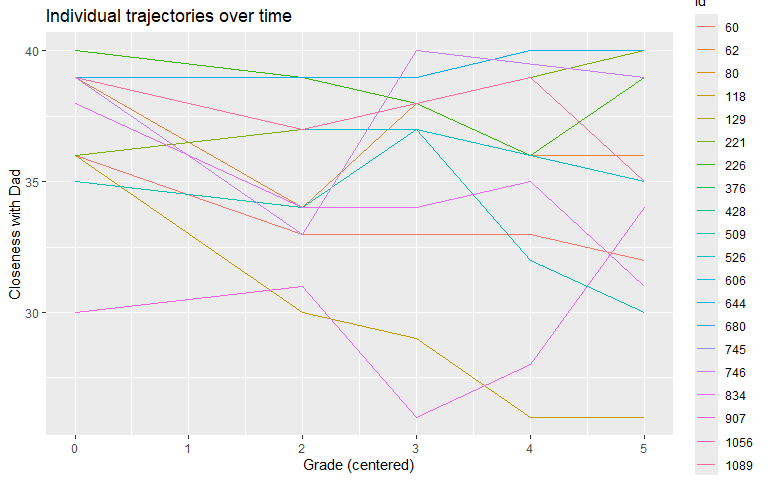
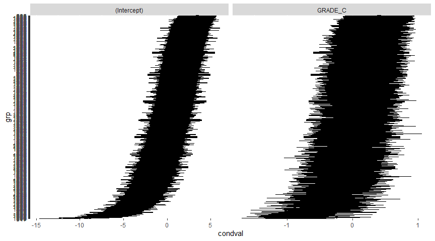
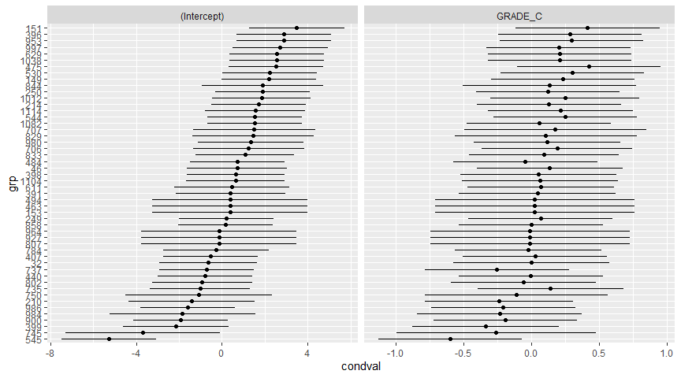
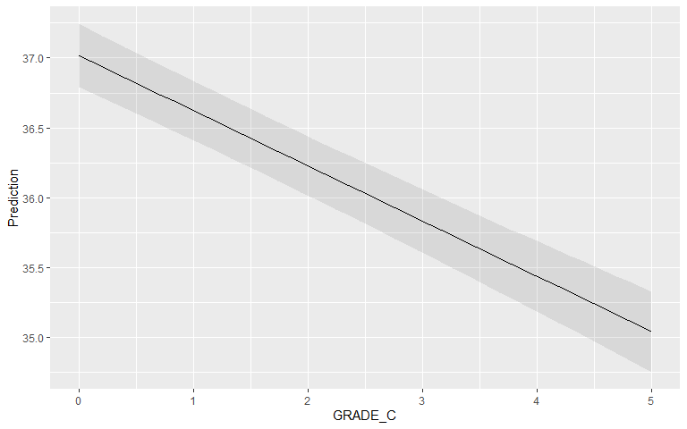
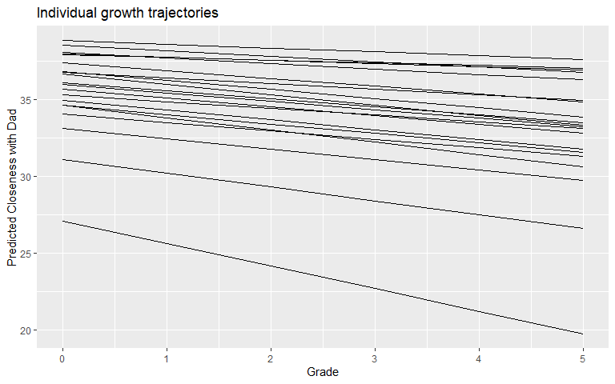
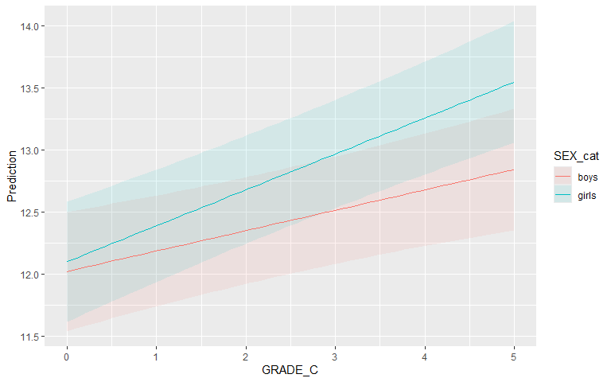
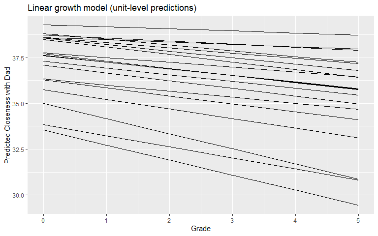
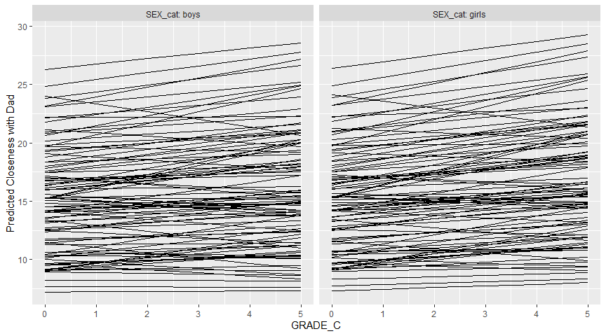
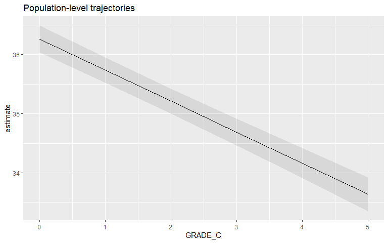
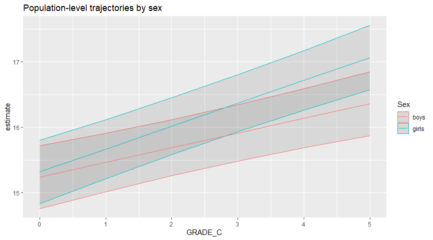

# Multilevel Regression: centering
Mauricio Garnier-Villarreal
2026-10-05

- [<span class="toc-section-number">1</span> Introduction to
  Longitudinal Data
  Analysis](#introduction-to-longitudinal-data-analysis)
- [<span class="toc-section-number">2</span> Rationales for Longitudinal
  Research](#rationales-for-longitudinal-research)
  - [<span class="toc-section-number">2.1</span> Rationale 1:
    Intraindividual change (and
    stability)](#rationale-1-intraindividual-change-and-stability)
  - [<span class="toc-section-number">2.2</span> Rationale 2:
    Interindividual differences in
    change](#rationale-2-interindividual-differences-in-change)
  - [<span class="toc-section-number">2.3</span> Rationale 3:
    Interrelationships in behavioral
    change](#rationale-3-interrelationships-in-behavioral-change)
  - [<span class="toc-section-number">2.4</span> Rationale 4: Causes of
    intraindividual
    change](#rationale-4-causes-of-intraindividual-change)
  - [<span class="toc-section-number">2.5</span> Rationale 5: Causes of
    interindividual differences in
    change](#rationale-5-causes-of-interindividual-differences-in-change)
- [<span class="toc-section-number">3</span> Questions about
  Growth](#questions-about-growth)
- [<span class="toc-section-number">4</span> Modeling
  Frameworks](#modeling-frameworks)
- [<span class="toc-section-number">5</span> The Meaning of
  *Time*](#the-meaning-of-time)
- [<span class="toc-section-number">6</span> Packages and
  Data](#packages-and-data)
- [<span class="toc-section-number">7</span> The Multilevel Growth
  Model](#the-multilevel-growth-model)
  - [<span class="toc-section-number">7.1</span> The Two-Level Growth
    Model](#the-two-level-growth-model)
  - [<span class="toc-section-number">7.2</span> Parameter
    Interpretation](#parameter-interpretation)
  - [<span class="toc-section-number">7.3</span> Alternative
    Models](#alternative-models)
- [<span class="toc-section-number">8</span> Choosing the Time
  Origin](#choosing-the-time-origin)
  - [<span class="toc-section-number">8.1</span> Why the Origin
    Matters](#why-the-origin-matters)
  - [<span class="toc-section-number">8.2</span> The
    Aperture](#the-aperture)
  - [<span class="toc-section-number">8.3</span> Rescaling
    Time](#rescaling-time)
- [<span class="toc-section-number">9</span> Alternative Metrics of
  Time](#alternative-metrics-of-time)
  - [<span class="toc-section-number">9.1</span> Cohort-Sequential
    Designs](#cohort-sequential-designs)
- [<span class="toc-section-number">10</span> Building Growth Models: A
  Sequential Approach](#building-growth-models-a-sequential-approach)
  - [<span class="toc-section-number">10.1</span> Fixed Intercept, Fixed
    Slope (OLS)](#fixed-intercept-fixed-slope-ols)
  - [<span class="toc-section-number">10.2</span> Null Model (Random
    Intercept Only)](#null-model-random-intercept-only)
  - [<span class="toc-section-number">10.3</span> Random Intercept,
    Fixed Slope](#random-intercept-fixed-slope)
  - [<span class="toc-section-number">10.4</span> Fixed Intercept,
    Random Slope](#fixed-intercept-random-slope)
  - [<span class="toc-section-number">10.5</span> Random Intercept,
    Random Slope (Full
    Model)](#random-intercept-random-slope-full-model)
  - [<span class="toc-section-number">10.6</span> Model
    Comparison](#model-comparison)
  - [<span class="toc-section-number">10.7</span> Visualizing Random
    Effects](#visualizing-random-effects)
    - [<span class="toc-section-number">10.7.1</span> Visualizing random
      effects with
      marginaleffects](#visualizing-random-effects-with-marginaleffects)
  - [<span class="toc-section-number">10.8</span> Using the Aperture to
    Recenter Time](#using-the-aperture-to-recenter-time)
- [<span class="toc-section-number">11</span> Adding
  Predictors](#adding-predictors)
  - [<span class="toc-section-number">11.1</span> Time-Invariant
    Predictors (Predicting Intercepts and
    Slopes)](#time-invariant-predictors-predicting-intercepts-and-slopes)
  - [<span class="toc-section-number">11.2</span> Example: Does Sex
    Predict Growth in Conflict with
    Mom?](#example-does-sex-predict-growth-in-conflict-with-mom)
  - [<span class="toc-section-number">11.3</span> Probing the
    Interaction](#probing-the-interaction)
  - [<span class="toc-section-number">11.4</span> Time-Varying
    Covariates](#time-varying-covariates)
  - [<span class="toc-section-number">11.5</span> Multiple Group Growth
    Models](#multiple-group-growth-models)
  - [<span class="toc-section-number">11.6</span>
    Interactions](#interactions)
- [<span class="toc-section-number">12</span> Centering in Growth
  Models](#centering-in-growth-models)
- [<span class="toc-section-number">13</span> Effect Size
  Measures](#effect-size-measures)
  - [<span class="toc-section-number">13.1</span> Using the
    `performance` Package](#using-the-performance-package)
  - [<span class="toc-section-number">13.2</span> Level-Specific
    Pseudo-R²](#level-specific-pseudo-r²)
  - [<span class="toc-section-number">13.3</span> Rights & Sterba (2019)
    Framework](#rights--sterba-2019-framework)
- [<span class="toc-section-number">14</span> Visualizing
  Trajectories](#visualizing-trajectories)
  - [<span class="toc-section-number">14.1</span> Unit-Level
    Predictions](#unit-level-predictions)
  - [<span class="toc-section-number">14.2</span> Unit-Level Predictions
    with a Predictor](#unit-level-predictions-with-a-predictor)
  - [<span class="toc-section-number">14.3</span> Population-Level
    Predictions](#population-level-predictions)
- [<span class="toc-section-number">15</span> Summary and
  Recommendations](#summary-and-recommendations)
- [<span class="toc-section-number">16</span> References](#references)

## Introduction to Longitudinal Data Analysis

In the previous tutorials of this course we used multilevel models (MLM)
to handle **clustered** data, where observations were nested within
higher-level units such as schools or classrooms. We covered random
intercept and random slope models (16_MLM1), how centering separates
within- and between-cluster effects (16_1_MLM_centering), and how to
estimate, probe, and plot interactions at different levels
(16_2_MLM_interactions).

This tutorial introduces a second, very common application of MLM:
**longitudinal data**, where repeated observations are nested within
individuals. This is the same statistical machinery we have already
learned, but the “cluster” is now a person and the key predictor is
**time**. With MLM, when discussing longitudinal data we are primarily
interested in data with observations nested within individuals, where
the individual is the level-2 variable. When we include time as a
level-1 predictor in these models, the model becomes a **multilevel
growth model** (also known as a latent growth curve model, and identical
to those fit with SEM) (Singer & Willett, 2003).

The central idea is that each person has their own trajectory over time,
described by an intercept (where they start) and a slope (how fast they
change). MLM lets us estimate the **average** trajectory in the
population and, at the same time, quantify how much people **differ**
from that average trajectory. As Little (2024) puts it, growth curve
models characterize between-person differences in growth by representing
each individual’s cross-time observations as a parsimonious model of the
growth process.

## Rationales for Longitudinal Research

Baltes and Nesselroade (1979) outlined five main rationales for
conducting longitudinal research. These rationales continue to motivate
longitudinal designs today and help us understand *why* we invest in
collecting repeated measures.

### Rationale 1: Intraindividual change (and stability)

- Direct identification of intraindividual change (and stability).
- Measuring the same individual (or entity) repeatedly allows
  researchers to identify if and how specific attributes of the
  individual changed (or remained the same) over time.
- Developmental (and other) theories of change often conceptualize
  change as either an **incremental** or a **transformational** process:
  - *Incremental*: change in magnitude (e.g., vocabulary growing
    steadily).
  - *Transformational*: change between discrete states (e.g., moving
    from non-reader to reader).

### Rationale 2: Interindividual differences in change

- Direct identification of interindividual differences (or similarity)
  in intraindividual change.
- Do different individuals change different amounts, or in different
  directions?
- Baltes and Nesselroade (1979) suggested that heterogeneity in change
  is the norm, given the “existence of diversity, multidirectionality,
  and large interindividual differences in developmental outcomes”
  (p. 24).

### Rationale 3: Interrelationships in behavioral change

- Analysis of interrelationships in behavioral change.
- “The examination of interrelationships in change among distinct
  behavioral classes is particularly important if a structural, holistic
  approach to development is taken” (Baltes & Nesselroade, 1979, p. 25).
- This holistic approach centers on the idea that changes in multiple
  constructs are expected to occur simultaneously and/or sequentially.

### Rationale 4: Causes of intraindividual change

- Analysis of causes (determinants) of intraindividual change.
- Explaining or accounting for the observed within-person change
  process.
- Identify the time-varying factors and/or mechanisms that impact and/or
  drive the within-person changes identified in Rationale 1.

### Rationale 5: Causes of interindividual differences in change

- Analysis of causes (determinants) of interindividual differences in
  intraindividual change.
- Given that individuals differ in how they change over time (Rationale
  2), researchers are often interested in identifying the factors and/or
  mechanisms that can account for those between-person differences.

## Questions about Growth

When we model longitudinal data, we are usually trying to answer three
broad questions (Singer & Willett, 2003):

1.  **What is the shape of the mean trend over time?**
    - What is the average intercept for the entire group?
    - What is the average slope for the entire group?
2.  **Is there significant between-person variability in the shape of
    the trend?**
    - Do two or more groups differ in intercept? In slope?
3.  **What variables are systematically associated with change over
    time?**

These questions map directly onto the fixed effects (average trajectory)
and random effects (variability around that trajectory) of a multilevel
growth model.

## Modeling Frameworks

- Both **SEM** and **MLM** can estimate growth models (Singer & Willett,
  2003).
- A large variety of models can be estimated with both frameworks.
- Some specific cases can only be estimated in one framework (e.g.,
  certain latent variable or measurement-error corrections are more
  natural in SEM; certain nested data structures are more natural in
  MLM).
- In this tutorial we use the MLM framework, because it builds directly
  on everything we have done so far.

## The Meaning of *Time*

- Time *means* nothing by itself.
- Time is a *proxy* for something else, such as (Singer & Willett,
  2003):
  - Cognitive development
  - Application of a new policy
  - Learning/experience
- This has important consequences: the choice of the time variable (and
  its origin) shapes how we interpret the intercept and the slope, as we
  will see later.

## Packages and Data

We will use the `simchild.csv` dataset, which contains measures of
closeness and conflict with MOM and DAD over 6 time points (Grades 1
through 6). This is a simulated dataset used for demonstration, and its
structure mirrors the panel datasets commonly used in longitudinal
teaching.

Key variables:

- `id`: person identifier (the level-2 unit)
- `GRADE`: grade in school (1 to 6)
- `GRADE_C`: grade centered so that Grade 1 = 0 (i.e., `GRADE - 1`)
- `CLOSEDAD`: closeness with dad (the outcome in our first models)
- `CLOSEMOM`: closeness with mom (used later as a time-varying
  covariate)
- `CONFLMOM`: conflict with mom (used for the gender example)
- `SEX`: sex of the child (0 = girls, 1 = boys)

The data are in **long (tall) format**, with one row per person per time
point. As we learned in 16_MLM1, this is the format required by most
software. Little (2024) contrasts the tall format (one row per occasion,
with a `time` column) with the wide format (one column per occasion),
and notes that in the tall format the same variable is measured
repeatedly for each individual.

``` r
# Load required packages
library(lme4)
library(lmerTest)
library(rio)
library(parameters)
library(marginaleffects)
library(ggplot2)
library(tidyr)
library(psych)
library(performance)
library(r2mlm)
library(car)

# Read data
simchild <- import("simchild.csv", na.strings = "-999999")

# Inspect the data
summary(simchild)
```

           id              SEX             GRADE          GRADE_C     
     Min.   :   1.0   Min.   :0.0000   Min.   :1.000   Min.   :0.000  
     1st Qu.: 279.8   1st Qu.:0.0000   1st Qu.:3.000   1st Qu.:2.000  
     Median : 563.0   Median :0.0000   Median :4.000   Median :3.000  
     Mean   : 564.1   Mean   :0.4996   Mean   :3.794   Mean   :2.794  
     3rd Qu.: 849.2   3rd Qu.:1.0000   3rd Qu.:5.000   3rd Qu.:4.000  
     Max.   :1131.0   Max.   :1.0000   Max.   :6.000   Max.   :5.000  
                                                                      
        CONFLMOM        CONFLDAD        CLOSEMOM        CLOSEDAD    
     Min.   : 7.00   Min.   : 7.00   Min.   :12.00   Min.   :13.00  
     1st Qu.:11.00   1st Qu.:11.00   1st Qu.:36.00   1st Qu.:33.00  
     Median :15.00   Median :15.00   Median :38.00   Median :36.00  
     Mean   :16.08   Mean   :15.32   Mean   :36.97   Mean   :34.97  
     3rd Qu.:20.00   3rd Qu.:19.00   3rd Qu.:39.00   3rd Qu.:38.00  
     Max.   :35.00   Max.   :34.00   Max.   :40.00   Max.   :40.00  
     NAs    :43      NAs    :1444    NAs    :40      NAs    :1443   
        CLOSMBOY        CLOSMGRL        CNFLMBOY         CNFLMGRL     
     Min.   : 0.00   Min.   : 0.00   Min.   : 0.000   Min.   : 0.000  
     1st Qu.: 0.00   1st Qu.: 0.00   1st Qu.: 0.000   1st Qu.: 0.000  
     Median : 0.00   Median : 0.00   Median : 0.000   Median : 0.000  
     Mean   :18.28   Mean   :18.54   Mean   : 7.897   Mean   : 8.117  
     3rd Qu.:37.00   3rd Qu.:38.00   3rd Qu.:15.000   3rd Qu.:16.000  
     Max.   :40.00   Max.   :40.00   Max.   :35.000   Max.   :35.000  
     NAs    :20      NAs    :20      NAs    :22       NAs    :21      
        CLOSDBOY        CLOSDGRL        CNFLDBOY         CNFLDGRL     
     Min.   : 0.00   Min.   : 0.00   Min.   : 0.000   Min.   : 0.000  
     1st Qu.: 0.00   1st Qu.: 0.00   1st Qu.: 0.000   1st Qu.: 0.000  
     Median : 0.00   Median : 0.00   Median : 0.000   Median : 0.000  
     Mean   :14.58   Mean   :14.69   Mean   : 6.499   Mean   : 6.323  
     3rd Qu.:35.00   3rd Qu.:35.00   3rd Qu.:14.000   3rd Qu.:13.000  
     Max.   :40.00   Max.   :40.00   Max.   :34.000   Max.   :34.000  
     NAs    :711     NAs    :732     NAs    :712      NAs    :732     
        CONSBOY          CONSGRL           CONS1            CONS3       
     Min.   :0.0000   Min.   :0.0000   Min.   :0.0000   Min.   :0.0000  
     1st Qu.:0.0000   1st Qu.:0.0000   1st Qu.:0.0000   1st Qu.:0.0000  
     Median :0.0000   Median :1.0000   Median :0.0000   Median :0.0000  
     Mean   :0.4996   Mean   :0.5004   Mean   :0.2012   Mean   :0.2006  
     3rd Qu.:1.0000   3rd Qu.:1.0000   3rd Qu.:0.0000   3rd Qu.:0.0000  
     Max.   :1.0000   Max.   :1.0000   Max.   :1.0000   Max.   :1.0000  
                                                                        
         CONS4            CONS5            CONS6           GRDBOY_C    
     Min.   :0.0000   Min.   :0.0000   Min.   :0.0000   Min.   :0.000  
     1st Qu.:0.0000   1st Qu.:0.0000   1st Qu.:0.0000   1st Qu.:0.000  
     Median :0.0000   Median :0.0000   Median :0.0000   Median :0.000  
     Mean   :0.1997   Mean   :0.1987   Mean   :0.1998   Mean   :1.397  
     3rd Qu.:0.0000   3rd Qu.:0.0000   3rd Qu.:0.0000   3rd Qu.:3.000  
     Max.   :1.0000   Max.   :1.0000   Max.   :1.0000   Max.   :5.000  
                                                                       
        GRDGRL_C    
     Min.   :0.000  
     1st Qu.:0.000  
     Median :0.000  
     Mean   :1.397  
     3rd Qu.:3.000  
     Max.   :5.000  
                    

``` r
head(simchild)
```

      id SEX GRADE GRADE_C CONFLMOM CONFLDAD CLOSEMOM CLOSEDAD CLOSMBOY CLOSMGRL
    1  1   1     1       0       11       16       36       37       36        0
    2  1   1     3       2       13       16       39       34       39        0
    3  1   1     4       3       15       NA       40       NA       40        0
    4  1   1     5       4        8       11       39       35       39        0
    5  1   1     6       5       14       16       35       35       35        0
    6  2   0     3       2       11       13       40       38        0       40
      CNFLMBOY CNFLMGRL CLOSDBOY CLOSDGRL CNFLDBOY CNFLDGRL CONSBOY CONSGRL CONS1
    1       11        0       37        0       16        0       1       0     1
    2       13        0       34        0       16        0       1       0     0
    3       15        0       NA        0       NA        0       1       0     0
    4        8        0       35        0       11        0       1       0     0
    5       14        0       35        0       16        0       1       0     0
    6        0       11        0       38        0       13       0       1     0
      CONS3 CONS4 CONS5 CONS6 GRDBOY_C GRDGRL_C
    1     0     0     0     0        0        0
    2     1     0     0     0        2        0
    3     0     1     0     0        3        0
    4     0     0     1     0        4        0
    5     0     0     0     1        5        0
    6     1     0     0     0        0        2

``` r
dim(simchild)
```

    [1] 5144   25

We can check the structure of the long-format data by looking at a few
individuals:

``` r
# Look at the first observations for a few individuals
head(simchild[simchild$id %in% unique(simchild$id)[1:3],
              c("id", "GRADE", "GRADE_C", "CLOSEDAD", "CLOSEMOM", "SEX")], 12)
```

       id GRADE GRADE_C CLOSEDAD CLOSEMOM SEX
    1   1     1       0       37       36   1
    2   1     3       2       34       39   1
    3   1     4       3       NA       40   1
    4   1     5       4       35       39   1
    5   1     6       5       35       35   1
    6   2     3       2       38       40   0
    7   2     4       3       38       39   0
    8   2     5       4       38       40   0
    9   2     6       5       37       40   0
    10  3     1       0       36       37   0
    11  3     3       2       37       34   0
    12  3     4       3       37       34   0

To get a first sense of the data, we can plot the trajectories of a
random sample of 20 individuals:

``` r
# Sample 20 individuals for a readable plot
ids <- sample(unique(simchild$id), 20)
simchild_short <- subset(simchild, id %in% ids)

ggplot(data = simchild_short,
       mapping = aes(x = GRADE_C, y = CLOSEDAD,
                     colour = factor(id))) +
  geom_line() +
  labs(colour = "id",
       x = "Grade (centered)",
       y = "Closeness with Dad",
       title = "Individual trajectories over time")
```



The plot shows that individuals start at different levels (different
intercepts) and change at different rates (different slopes). This is
exactly the kind of heterogeneity that the multilevel growth model is
designed to capture.

## The Multilevel Growth Model

### The Two-Level Growth Model

The basic growth model with a single predictor, *time*, is:

**Level 1 (within-person):**

$$y_{ij} = \beta_{0j} + \beta_{1j}\,time_{ij} + e_{ij}, \qquad e_{ij} \sim N(0, \sigma^2)$$

**Level 2 (between-person):**

$$\beta_{0j} = \gamma_{00} + u_{0j}$$

$$\beta_{1j} = \gamma_{10} + u_{1j}$$

with the random effects covariance matrix

$$T = \begin{bmatrix}
\tau_{00} & \\
\tau_{10} & \tau_{11}
\end{bmatrix}$$

where
$\mathbf{u}_j = (u_{0j}, u_{1j})' \sim MVN(\mathbf{0}, \mathbf{T})$
(Singer & Willett, 2003). Little (2024) presents the same model in SEM
notation, where the level-1 equation is defined by how the loadings of
the intercept and slope factors are specified (typically fixed rather
than freely estimated, so that the factors can be interpreted as an
intercept and a slope).

Substituting the level-2 equations into the level-1 equation gives the
combined (reduced-form) model:

$$y_{ij} = \gamma_{00} + \gamma_{10}\,time_{ij} + u_{0j} + u_{1j}\,time_{ij} + e_{ij}$$

### Parameter Interpretation

The parameters of the growth model have direct and intuitive
interpretations (Singer & Willett, 2003):

| Parameter | Meaning |
|----|----|
| $\gamma_{00}$ | Average score on $y$ at time = 0 (average intercept) |
| $\gamma_{10}$ | Average increase in $y$ for each 1-unit increase in time (average slope) |
| $\tau_{00}$ | Variability in scores on $y$ at time = 0 (intercept variance) |
| $\tau_{11}$ | Variability in the slope of time (variability in individuals’ change over time) |
| $\tau_{10}$ | Covariance between intercept and slope |
| $\sigma^2$ | Within-person residual variance |

The fixed effects ($\gamma$) describe the **average** trajectory; the
random effects ($\tau$) describe **how much people differ** from that
average trajectory.

### Alternative Models

Depending on the research question, we may want to constrain some
variance components to zero. The following are all special cases of the
full model, defined by which elements of $\mathbf{T}$ are free (Singer &
Willett, 2003):

- **Fixed intercept, fixed slope:**
  $T = \begin{bmatrix} 0 & \\ 0 & 0 \end{bmatrix}$ — no between-person
  variability at all; this is just an OLS regression.
- **Random intercept, fixed slope:**
  $T = \begin{bmatrix} \tau_{00} & \\ 0 & 0 \end{bmatrix}$ — people
  differ in where they start, but change at the same rate.
- **Fixed intercept, random slope:**
  $T = \begin{bmatrix} 0 & \\ 0 & \tau_{11} \end{bmatrix}$ — people
  start at the same place, but change at different rates.
- **Random intercept, random slope:**
  $T = \begin{bmatrix} \tau_{00} & \\ \tau_{10} & \tau_{11} \end{bmatrix}$
  — people differ in both starting point and rate of change (the full
  model).

Any of these models may be sensible depending on the situation. We can
test the significance of any variance component (e.g., $\tau_{11}$)
using the profile likelihood method or the deviance test for nested
models. It is also easy to specify other level-1 predictors
(time-varying covariates) or level-2 predictors of intercepts and slopes
(time-invariant covariates).

## Choosing the Time Origin

The intercept is “located” where the origin (zero-point) of the time
variable is situated. Therefore, **time = 0 needs to be meaningful**.
Most commonly, time is centered at the first observation (Singer &
Willett, 2003).

For example, if the time metric is a calendar year, it is best to center
the year so that the origin is the first assessment:

``` r
year <- c(1974, 1982, 1985, 1991)
time <- year - 1974

rbind(year, time)
```

         [,1] [,2] [,3] [,4]
    year 1974 1982 1985 1991
    time    0    8   11   17

The time metric then becomes “years since initial assessment.”

Other scenarios for a meaningful origin might be (Singer & Willett,
2003):

- time since diagnosis
- time since birth
- developmental state
- time until death
- time before and after some important event

### Why the Origin Matters

Choosing the origin of time is important because it affects the
interpretation of (Singer & Willett, 2003):

- the mean intercept ($\gamma_{00}$)
- the intercept variance ($\tau_{00}$)
- the intercept/slope covariance ($\tau_{10}$)

Two important notes:

- **Recentering** time will affect any parameter associated with the
  intercept (but not the slope).
- **Rescaling** time (e.g., converting from months to years) will affect
  any parameter associated with the slope (but not the intercept).

Crucially, the **fit of the model does not change** based on centering
or rescaling; only the interpretation of the model parameters changes.
Little (2024) devotes specific attention to the importance of coding
time properly, noting that the coding of observations at different
intervals of time affects the interpretation of growth models.

### The Aperture

The value of time that corresponds to the smallest dispersion of
predicted scores (the smallest $\tau_{00}$) is called the **aperture**.
The aperture also happens to be the place where the covariance between
intercepts and slopes is 0 ($\tau_{10}$ flips from negative to positive)
(Singer & Willett, 2003).

We can use this fact to solve for the aperture:

$$aperture = a^* - \frac{\tau_{10}}{\tau_{11}}$$

where $a^*$ is usually time = 0. The aperture might not fall in the
range of observed data.

An example of where the concept of the aperture might be useful: suppose
a researcher wishes to plan a study to collect data at just the time at
which children begin to diverge on some characteristic. We might use
data collected sometime after the suspected aperture point to make a
good estimate of when the aperture occurs (Singer & Willett, 2003).

### Rescaling Time

We can also rescale time to change the metric of the slope. For example,
dividing time by 10 changes the slope from “per grade” to “per decade of
grades”:

``` r
# Rescale time: slope per decade
simchild$dec <- simchild$GRADE_C / 10

m1e <- lmer(CLOSEDAD ~ 1 + dec + (1 + dec | id),
            data = simchild, REML = FALSE)
parameters(m1e, ci_method = "profile")
```

    # Fixed Effects

    Parameter   | Coefficient |   SE |         95% CI | t(3695) |      p
    --------------------------------------------------------------------
    (Intercept) |       36.26 | 0.12 | [36.03, 36.49] |  313.72 | < .001
    dec         |       -5.25 | 0.29 | [-5.81, -4.68] |  -18.30 | < .001

    # Random Effects

    Parameter               | Coefficient
    -------------------------------------
    SD (Intercept: id)      |        2.58
    SD (dec: id)            |        3.90
    Cor (Intercept~dec: id) |        0.47
    SD (Residual)           |        2.53

``` r
# Rescale time: slope per 10 grades (slope becomes 10x larger)
simchild$mon <- simchild$GRADE_C * 10

m1e1 <- lmer(CLOSEDAD ~ 1 + mon + (1 + mon | id),
             data = simchild, REML = FALSE)
parameters(m1e1, ci_method = "profile")
```

    # Fixed Effects

    Parameter   | Coefficient |       SE |         95% CI | t(3695) |      p
    ------------------------------------------------------------------------
    (Intercept) |       36.26 |     0.11 | [36.03, 36.49] |  316.32 | < .001
    mon         |       -0.05 | 2.87e-03 | [-0.06, -0.05] |  -18.32 | < .001

    # Random Effects

    Parameter               | Coefficient
    -------------------------------------
    SD (Intercept: id)      |        2.53
    SD (mon: id)            |        0.04
    Cor (Intercept~mon: id) |        0.50
    SD (Residual)           |        2.54

Notice how the slope estimate scales with the time metric, while the
model fit (AIC, log-likelihood) stays identical.

## Alternative Metrics of Time

Say you want to measure growth in language ability in elementary school
children. There are several options for what to use as the variable
*time* (Singer & Willett, 2003):

- **wave**: reflexively chosen by most researchers (data organization
  habit)
- **grade**: perhaps reflects change due to “nurture”
- **age**: perhaps reflects change due to “nature”
- perhaps more than one of these?

Sometimes these variables are completely confounded (they yield the same
information), and sometimes they are not. It is possible for children of
the same age to be in different grades, and for children in the same
wave of measurement to have different ages. **What is chosen as the time
metric can have profound consequences for interpretation**, so decide
what theory suggests is the variable truly responsible for change
(Biesanz et al., 2004).

### Cohort-Sequential Designs

It is sometimes possible to obtain information for trajectories across
many occasions (ages) by measuring on fewer occasions (waves) (Singer &
Willett, 2003).

A **cohort** is a group of individuals followed longitudinally, but
starting at different times. For example, we might follow a cohort of
5-year-olds for 4 years (yielding data for ages 5–8) and a cohort of
7-year-olds for those same 4 years (yielding data for ages 7–10). In
only 4 years, we have collected data spanning ages 5–10.

**Cohort-sequential designs** (or accelerated longitudinal designs) are
data collection strategies that pursue this strategy to save costs in
terms of time and money. “Gluing together” cohort trajectories has
benefits, but it also involves assumptions — fortunately, some of those
assumptions are testable.

Cohorts might differ due to **cohort effects** (or history effects):
differences between groups of people born in different eras. For
example, individuals born in the 1950s may perform worse on a
reaction-time test than those born in the 1970s not because they are
older, but because they did not grow up using computers. In this
example, cohort is causing the effect, not age (Duncan & Duncan, 2004).

## Building Growth Models: A Sequential Approach

As in 16_MLM1, we follow a sequential approach (Peugh, 2010): start with
the simplest model, then build up by adding random effects and
predictors, comparing nested models along the way. For all model
comparisons with likelihood ratio tests we use **ML** estimation
(`REML = FALSE`).

### Fixed Intercept, Fixed Slope (OLS)

The simplest model is an OLS regression, which assumes no between-person
variability in intercepts or slopes. We fit it with `lm()` because
`lmer()` cannot estimate a model with no random effects:

``` r
m1 <- lm(CLOSEDAD ~ 1 + GRADE_C, data = simchild)
parameters(m1)
```

    Parameter   | Coefficient |   SE |         95% CI | t(3699) |      p
    --------------------------------------------------------------------
    (Intercept) |       36.37 | 0.13 | [36.12, 36.62] |  287.35 | < .001
    GRADE C     |       -0.51 | 0.04 | [-0.58, -0.43] |  -13.05 | < .001

This gives us the average trajectory, but it ignores the clustering of
observations within persons, so the standard errors are too small and we
cannot describe individual differences.

### Null Model (Random Intercept Only)

The null model includes a random intercept for persons but no predictor:

``` r
m0a <- lmer(CLOSEDAD ~ 1 + (1 | id),
            data = simchild, REML = FALSE)
parameters(m0a, ci_method = "profile")
```

    # Fixed Effects

    Parameter   | Coefficient |   SE |         95% CI | t(3698) |      p
    --------------------------------------------------------------------
    (Intercept) |       34.86 | 0.11 | [34.63, 35.08] |  308.74 | < .001

    # Random Effects

    Parameter          | Coefficient
    --------------------------------
    SD (Intercept: id) |        3.18
    SD (Residual)      |        2.80

We can compute the intraclass correlation (ICC), which here represents
the proportion of variance that is between persons:

``` r
# ICC: proportion of variance between persons
3.18^2 / (3.18^2 + 2.8^2)
```

    [1] 0.5632896

An ICC of about 0.56 means that roughly 56% of the variability in
closeness with dad is **between** persons, and 44% is **within** persons
across time. This substantial between-person variance justifies a
multilevel model.

### Random Intercept, Fixed Slope

Now we add time as a fixed predictor, keeping the random intercept:

``` r
m1a <- lmer(CLOSEDAD ~ 1 + GRADE_C + (1 | id),
            data = simchild, REML = FALSE)
parameters(m1a, ci_method = "profile")
```

    # Fixed Effects

    Parameter   | Coefficient |   SE |         95% CI | t(3697) |      p
    --------------------------------------------------------------------
    (Intercept) |       36.21 | 0.13 | [35.95, 36.47] |  273.11 | < .001
    GRADE C     |       -0.50 | 0.03 | [-0.56, -0.45] |  -19.27 | < .001

    # Random Effects

    Parameter          | Coefficient
    --------------------------------
    SD (Intercept: id) |        3.20
    SD (Residual)      |        2.63

The fixed slope for `GRADE_C` is the **average** change in closeness per
grade. The random intercept variance ($\tau_{00}$) tells us how much
persons differ in their starting level. Because the slope is fixed, this
model assumes everyone changes at the same rate.

### Fixed Intercept, Random Slope

We can also allow the slope to vary while fixing the intercept. In
`lmer()` syntax, `(0 + GRADE_C | id)` removes the random intercept and
keeps only the random slope:

``` r
m1b <- lmer(CLOSEDAD ~ 1 + GRADE_C + (0 + GRADE_C | id),
            data = simchild, REML = FALSE)
parameters(m1b, ci_method = "profile")
```

    # Fixed Effects

    Parameter   | Coefficient |   SE |         95% CI | t(3697) |      p
    --------------------------------------------------------------------
    (Intercept) |       36.40 | 0.09 | [36.22, 36.58] |  396.54 | < .001
    GRADE C     |       -0.55 | 0.04 | [-0.63, -0.47] |  -13.29 | < .001

    # Random Effects

    Parameter        | Coefficient
    ------------------------------
    SD (GRADE_C: id) |        0.90
    SD (Residual)    |        2.95

This model assumes everyone starts at the same level but changes at
different rates. It is rarely the best substantive choice, but it is
useful as a comparison point.

### Random Intercept, Random Slope (Full Model)

The full growth model allows both the intercept and the slope to vary
across persons:

``` r
m1c <- lmer(CLOSEDAD ~ 1 + GRADE_C + (1 + GRADE_C | id),
            data = simchild, REML = FALSE)
parameters(m1c, ci_method = "profile")
```

    # Fixed Effects

    Parameter   | Coefficient |   SE |         95% CI | t(3695) |      p
    --------------------------------------------------------------------
    (Intercept) |       36.26 | 0.12 | [36.03, 36.49] |  313.72 | < .001
    GRADE C     |       -0.52 | 0.03 | [-0.58, -0.47] |  -18.30 | < .001

    # Random Effects

    Parameter                   | Coefficient
    -----------------------------------------
    SD (Intercept: id)          |        2.58
    SD (GRADE_C: id)            |        0.39
    Cor (Intercept~GRADE_C: id) |        0.47
    SD (Residual)               |        2.53

Interpretation:

- **Fixed intercept** ($\gamma_{00}$): the average closeness with dad at
  Grade 1 (when `GRADE_C = 0`).
- **Fixed slope** ($\gamma_{10}$): the average change in closeness per
  grade.
- **Random intercept variance** ($\tau_{00}$): variability in starting
  levels.
- **Random slope variance** ($\tau_{11}$): variability in rates of
  change.
- **Intercept–slope correlation** ($\rho_{01} = 0.47$): persons who
  start higher tend to increase more (or, with a negative correlation,
  those who start higher change more slowly).

### Model Comparison

We can test whether the random slope is needed using a likelihood ratio
test. Nested models with the same fixed effects are compared with
`anova()`:

``` r
anova(m1a, m1c)
```

    Data: simchild
    Models:
    m1a: CLOSEDAD ~ 1 + GRADE_C + (1 | id)
    m1c: CLOSEDAD ~ 1 + GRADE_C + (1 + GRADE_C | id)
        npar   AIC   BIC  logLik -2*log(L)  Chisq Df Pr(>Chisq)    
    m1a    4 19462 19487 -9727.1     19454                         
    m1c    6 19370 19408 -9679.2     19358 95.806  2  < 2.2e-16 ***
    ---
    Signif. codes:  0 '***' 0.001 '**' 0.01 '*' 0.05 '.' 0.1 ' ' 1

``` r
anova(m1b, m1c)
```

    Data: simchild
    Models:
    m1b: CLOSEDAD ~ 1 + GRADE_C + (0 + GRADE_C | id)
    m1c: CLOSEDAD ~ 1 + GRADE_C + (1 + GRADE_C | id)
        npar   AIC   BIC  logLik -2*log(L)  Chisq Df Pr(>Chisq)    
    m1b    4 19933 19957 -9962.3     19925                         
    m1c    6 19370 19408 -9679.2     19358 566.22  2  < 2.2e-16 ***
    ---
    Signif. codes:  0 '***' 0.001 '**' 0.01 '*' 0.05 '.' 0.1 ' ' 1

The comparison of `m1a` (fixed slope) and `m1c` (random slope) tests
whether the slope varies significantly across persons. The comparison of
`m1b` (fixed intercept) and `m1c` tests whether the intercept varies. A
significant chi-square indicates that the additional random effect
improves model fit.

For confidence intervals on the random effects, we use **profile
likelihood** intervals, which are more accurate than Wald intervals in
MLM (Hox et al., 2018; this may take a while to compute):

``` r
parameters(m1c, ci_method = "profile")
parameters(m1c, ci_method = "profile", ci = .90)
```

### Visualizing Random Effects

We can extract and plot the random effects (BLUPs) with `ranef()` and
`ggplot2`, just as we did for the school random effects in 16_MLM1:

``` r
randE <- ranef(m1c)
dd <- as.data.frame(randE)

ggplot(dd, aes(y = grp, x = condval)) +
  geom_point() +
  facet_wrap(~ term, scales = "free_x") +
  geom_errorbar(aes(xmin = condval - 2 * condsd,
                    xmax = condval + 2 * condsd),
                width = 0,
                orientation = "y")
```



This caterpillar plot shows each person’s random intercept deviation
(left panel) and random slope deviation (right panel). Points far from
zero indicate persons whose trajectory differs substantially from the
average. With many persons the plot becomes crowded, so we can subset to
a random sample of 50:

``` r
ids <- sample(dd$grp, 50)
dd2 <- subset(dd, grp %in% ids)

ggplot(dd2, aes(y = grp, x = condval)) +
  geom_point() +
  facet_wrap(~ term, scales = "free_x") +
  geom_errorbar(aes(xmin = condval - 2 * condsd,
                    xmax = condval + 2 * condsd),
                width = 0,
                orientation = "y")
```



#### Visualizing random effects with marginaleffects

We can also visualize the random effects directly as predicted
trajectories, using the `marginaleffects` package. At the **population
level**, `plot_predictions()` averages over the random effects and shows
the average growth trajectory with its confidence band:

``` r
plot_predictions(m1c, condition = "GRADE_C")
```



At the **unit level**, we generate predictions for each person (which
include their random effects) and plot one line per person. This is the
trajectory-based analogue of the caterpillar plot:

``` r
# Unit-level predictions for a random sample of 20 persons
preds_re <- predictions(m1c,
                        newdata = datagrid(id = sample(m1c@frame$id, 20),
                                           GRADE_C = 0:5))

ggplot(preds_re, aes(GRADE_C, estimate, group = id)) +
  geom_line() +
  labs(y = "Predicted Closeness with Dad",
       x = "Grade",
       title = "Individual growth trajectories")
```



The caterpillar plot emphasizes the **distribution** of the random
intercepts and slopes (how spread out persons are, and which persons are
outliers), while the `marginaleffects` trajectory plot emphasizes the
**implied growth lines** for individual persons. Together they give a
complete picture of the between-person heterogeneity in the model.

### Using the Aperture to Recenter Time

Recall that the aperture is the time point where the intercept–slope
covariance is zero. For `m1c` the estimated random effects give an
intercept SD of 2.5775, a slope SD of 0.3904, and an intercept–slope
correlation of 0.47. We convert the correlation to a covariance using
`psych::cor2cov()`:

``` r
# Convert the correlation matrix to a covariance matrix
tauCor <- matrix(c(1, .47, .47, 1), byrow = TRUE, nrow = 2)

tauCov <- cor2cov(tauCor, c(2.5775, 0.3904))

# Covariance of intercept and slope (check by hand)
.47 * 2.5775 * .3904
```

    [1] 0.4729403

``` r
# Aperture: time point where covariance is zero
-tauCov[1, 2] / tauCov[2, 2]
```

    [1] -3.103035

``` r
# Equivalent by hand
-(0.4729403 / 0.1524)
```

    [1] -3.103283

The aperture is about $-3.1$ grades relative to the current origin
(`GRADE_C = 0`), which falls **outside** the observed range (grades
0–5). We can nonetheless recenter time at the aperture and refit the
model:

``` r
# Create a new time variable with the origin at the aperture
simchild$NEW_GRADE <- simchild$GRADE_C - (-tauCov[1, 2] / tauCov[2, 2])

m1cAP <- lmer(CLOSEDAD ~ 1 + NEW_GRADE + (1 + NEW_GRADE | id),
              data = simchild, REML = FALSE)
parameters(m1cAP, ci_method = "profile")
```

    # Fixed Effects

    Parameter   | Coefficient |   SE |         95% CI | t(3695) |      p
    --------------------------------------------------------------------
    (Intercept) |       37.89 | 0.17 | [37.55, 38.22] |  222.57 | < .001
    NEW GRADE   |       -0.52 | 0.03 | [-0.58, -0.47] |  -18.30 | < .001

    # Random Effects

    Parameter                     | Coefficient
    -------------------------------------------
    SD (Intercept: id)            |        2.28
    SD (NEW_GRADE: id)            |        0.39
    Cor (Intercept~NEW_GRADE: id) |   -5.31e-03
    SD (Residual)                 |        2.53

When the origin is placed at the aperture, the estimated intercept–slope
correlation becomes (approximately) zero, and the intercept variance is
at its minimum. This can be useful when planning a study, but remember
that the aperture may not correspond to a meaningful or observed point
in time.

## Adding Predictors

In growth models, the intercept or slope can be predicted by level-2
predictors, or the outcome can be predicted by level-1 predictors. This
distinction is often described as **time-invariant** (level-2) and
**time-varying** (level-1) predictors (Singer & Willett, 2003).

- A **level-2 predictor** of the intercept or slope tells you how
  intercepts or slopes differ as a function of the subject.
- A **level-1 predictor** of the outcome tells you how the outcome is
  changing over time, *controlling* for the level-1 predictor.

Remember that the trajectory (intercept and slope) is interpreted where
all covariates (other than time) equal 0. Therefore, level-1 predictors
need to be centered in a meaningful way, especially if interactions are
involved (Singer & Willett, 2003).

### Time-Invariant Predictors (Predicting Intercepts and Slopes)

When a variable predicts the slope, the model includes an interaction
term between time and that predictor. The general model is (Singer &
Willett, 2003):

$$\begin{array}{l}
y_{ij} = \beta_{0j} + \beta_{1j}\,time_{ij} + e_{ij} \\
\beta_{0j} = \gamma_{00} + \gamma_{01}w_{j} + u_{0j} \\
\beta_{1j} = \gamma_{10} + \gamma_{11}w_{j} + u_{1j} \\
\overline{y_{ij} = \gamma_{00} + \gamma_{10}time_{ij} + \gamma_{01}w_{j} + u_{0j} + u_{1j}time_{ij} + \gamma_{11}time_{ij}w_{j} + e_{ij}}
\end{array}$$

Some of the most interesting effects occur when variables predict
**slopes** (i.e., when $\gamma_{11} \neq 0$).

### Example: Does Sex Predict Growth in Conflict with Mom?

We use `CONFLMOM` (conflict with mom) as the outcome and `SEX` as a
level-2 predictor. First, recode sex into a labeled factor (boys = 1,
girls = 0):

``` r
simchild$SEX_cat <- car::recode(simchild$SEX,
                                " 0 = 'girls'; 1 = 'boys' ")

# Baseline growth model (no predictor)
m1d0 <- lmer(CONFLMOM ~ 1 + GRADE_C + (1 + GRADE_C | id),
             data = simchild, REML = FALSE)
parameters(m1d0, ci_method = "profile")
```

    # Fixed Effects

    Parameter   | Coefficient |   SE |         95% CI | t(5095) |      p
    --------------------------------------------------------------------
    (Intercept) |       15.28 | 0.17 | [14.94, 15.62] |   87.83 | < .001
    GRADE C     |        0.29 | 0.03 | [ 0.22,  0.35] |    8.83 | < .001

    # Random Effects

    Parameter                   | Coefficient
    -----------------------------------------
    SD (Intercept: id)          |        5.03
    SD (GRADE_C: id)            |        0.60
    Cor (Intercept~GRADE_C: id) |       -0.20
    SD (Residual)               |        3.22

Next, we add `SEX_cat` as a predictor of the **intercept only** (main
effect, no interaction):

``` r
m1d <- lmer(CONFLMOM ~ 1 + GRADE_C + SEX_cat + (1 + GRADE_C | id),
            data = simchild, REML = FALSE)
parameters(m1d, ci_method = "profile")
```

    # Fixed Effects

    Parameter       | Coefficient |   SE |         95% CI | t(5094) |      p
    ------------------------------------------------------------------------
    (Intercept)     |       15.09 | 0.23 | [14.63, 15.54] |   65.03 | < .001
    GRADE C         |        0.29 | 0.03 | [ 0.22,  0.35] |    8.83 | < .001
    SEX cat [girls] |        0.38 | 0.31 | [-0.23,  0.99] |    1.23 | 0.220 

    # Random Effects

    Parameter                   | Coefficient
    -----------------------------------------
    SD (Intercept: id)          |        5.03
    SD (GRADE_C: id)            |        0.60
    Cor (Intercept~GRADE_C: id) |       -0.20
    SD (Residual)               |        3.22

Finally, we add the **time × sex interaction**, which lets sex predict
the **slope** as well:

``` r
m1f <- lmer(CONFLMOM ~ 1 + GRADE_C + SEX_cat + GRADE_C:SEX_cat +
              (1 + GRADE_C | id),
            data = simchild, REML = FALSE)
parameters(m1f, ci_method = "profile")
```

    # Fixed Effects

    Parameter                 | Coefficient |   SE |         95% CI | t(5093) |      p
    ----------------------------------------------------------------------------------
    (Intercept)               |       15.24 | 0.24 | [14.76, 15.72] |   62.21 | < .001
    GRADE C                   |        0.22 | 0.05 | [ 0.13,  0.31] |    4.87 | < .001
    SEX cat [girls]           |        0.08 | 0.35 | [-0.60,  0.76] |    0.23 | 0.820 
    GRADE C × SEX cat [girls] |        0.12 | 0.06 | [ 0.00,  0.25] |    1.92 | 0.055 

    # Random Effects

    Parameter                   | Coefficient
    -----------------------------------------
    SD (Intercept: id)          |        5.03
    SD (GRADE_C: id)            |        0.59
    Cor (Intercept~GRADE_C: id) |       -0.20
    SD (Residual)               |        3.22

Interpretation:

- The `GRADE_C` main effect is now the slope for the reference group
  (girls).
- The `GRADE_C:SEX_cat` interaction tells us whether boys and girls
  differ in their rate of change over time.
- The `SEX_cat` main effect tells us whether boys and girls differ in
  conflict at Grade 1 (time = 0).

### Probing the Interaction

As we learned in 16_2_MLM_interactions, we probe an interaction by
examining simple slopes and plotting them. We use the `marginaleffects`
package for this, exactly as in the previous tutorial.

First, we compute the simple slopes of time (`GRADE_C`) at each level of
the moderator (`SEX_cat`):

``` r
avg_slopes(m1f, variables = "GRADE_C", by = "SEX_cat")
```


     SEX_cat Estimate Std. Error    z Pr(>|z|)    S 2.5 % 97.5 %
       boys     0.224     0.0460 4.87   <0.001 19.7 0.134  0.314
       girls    0.351     0.0459 7.64   <0.001 45.4 0.261  0.441

    Term: GRADE_C
    Type: response
    Comparison: dY/dX

This gives the rate of change in conflict separately for girls and boys,
along with standard errors and confidence intervals. We can then plot
the two trajectories:

``` r
plot_predictions(m1f, condition = c("GRADE_C", "SEX_cat"))
```



The plot shows the predicted conflict trajectory for girls and boys. If
the lines are not parallel, the interaction is present. This is exactly
the same probing logic as in cross-level interactions
(16_2_MLM_interactions), only now the level-1 predictor is *time*.

### Time-Varying Covariates

A **time-varying covariate** is a level-1 predictor that changes within
persons over time. Here we examine change in `CLOSEDAD` controlling for
`CLOSEMOM`. As always, the time-varying covariate should be centered so
the intercept is interpretable (Singer & Willett, 2003).

``` r
# Model with CLOSEMOM as a time-varying covariate
m1h <- lmer(CLOSEDAD ~ 1 + GRADE_C + CLOSEMOM + (1 + GRADE_C | id),
            data = simchild, REML = FALSE)
parameters(m1h, ci_method = "profile")
```

    # Fixed Effects

    Parameter   | Coefficient |   SE |         95% CI | t(3655) |      p
    --------------------------------------------------------------------
    (Intercept) |       29.73 | 0.87 | [28.01, 31.45] |   34.20 | < .001
    GRADE C     |       -0.46 | 0.03 | [-0.52, -0.41] |  -15.63 | < .001
    CLOSEMOM    |        0.17 | 0.02 | [ 0.13,  0.22] |    7.60 | < .001

    # Random Effects

    Parameter                   | Coefficient
    -----------------------------------------
    SD (Intercept: id)          |        2.50
    SD (GRADE_C: id)            |        0.38
    Cor (Intercept~GRADE_C: id) |        0.47
    SD (Residual)               |        2.53

We can also test whether the effect of `CLOSEMOM` (its slope) differs
across individuals by adding it as a random slope:

``` r
m1h1 <- lmer(CLOSEDAD ~ 1 + GRADE_C + CLOSEMOM +
               (1 + GRADE_C + CLOSEMOM | id),
             data = simchild, REML = FALSE)
parameters(m1h1, ci_method = "profile")
```

    # Fixed Effects

    Parameter   | Coefficient |   SE | t(3652) |      p
    ---------------------------------------------------
    (Intercept) |       29.70 | 0.87 |   34.24 | < .001
    GRADE C     |       -0.46 | 0.03 |  -15.63 | < .001
    CLOSEMOM    |        0.17 | 0.02 |    7.65 | < .001

    # Random Effects

    Parameter                    | Coefficient
    ------------------------------------------
    SD (Intercept: id)           |        2.29
    SD (GRADE_C: id)             |        0.37
    SD (CLOSEMOM: id)            |    8.29e-03
    Cor (Intercept~GRADE_C: id)  |        0.57
    Cor (Intercept~CLOSEMOM: id) |        0.54
    Cor (GRADE_C~CLOSEMOM: id)   |       -0.38
    SD (Residual)                |        2.54

``` r
anova(m1h, m1h1)
```

    Data: simchild
    Models:
    m1h: CLOSEDAD ~ 1 + GRADE_C + CLOSEMOM + (1 + GRADE_C | id)
    m1h1: CLOSEDAD ~ 1 + GRADE_C + CLOSEMOM + (1 + GRADE_C + CLOSEMOM | id)
         npar   AIC   BIC  logLik -2*log(L) Chisq Df Pr(>Chisq)
    m1h     7 19111 19154 -9548.4     19097                    
    m1h1   10 19118 19180 -9548.8     19098     0  3          1

Now we center `CLOSEMOM` at its grand mean (36.97) so that the intercept
is interpretable:

``` r
simchild$CLOSEMOM_C <- simchild$CLOSEMOM - 36.97

m1hc <- lmer(CLOSEDAD ~ 1 + GRADE_C + CLOSEMOM_C + (1 + GRADE_C | id),
             data = simchild, REML = FALSE)
parameters(m1hc, ci_method = "profile")
```

    # Fixed Effects

    Parameter   | Coefficient |   SE |         95% CI | t(3655) |      p
    --------------------------------------------------------------------
    (Intercept) |       36.09 | 0.12 | [35.86, 36.32] |  307.87 | < .001
    GRADE C     |       -0.46 | 0.03 | [-0.52, -0.41] |  -15.63 | < .001
    CLOSEMOM C  |        0.17 | 0.02 | [ 0.13,  0.22] |    7.60 | < .001

    # Random Effects

    Parameter                   | Coefficient
    -----------------------------------------
    SD (Intercept: id)          |        2.50
    SD (GRADE_C: id)            |        0.38
    Cor (Intercept~GRADE_C: id) |        0.47
    SD (Residual)               |        2.53

We can combine the time-varying covariate with a time-invariant
predictor, and also test whether the time-varying covariate interacts
with time:

``` r
# Time-varying covariate plus sex
m1i <- lmer(CLOSEDAD ~ 1 + GRADE_C * SEX_cat + CLOSEMOM_C +
              (1 + GRADE_C | id),
            data = simchild, REML = FALSE)
parameters(m1i, ci_method = "profile")
```

    # Fixed Effects

    Parameter                 | Coefficient |   SE |         95% CI | t(3653) |      p
    ----------------------------------------------------------------------------------
    (Intercept)               |       35.94 | 0.16 | [35.62, 36.26] |  221.48 | < .001
    GRADE C                   |       -0.48 | 0.04 | [-0.56, -0.40] |  -11.63 | < .001
    SEX cat [girls]           |        0.30 | 0.23 | [-0.15,  0.75] |    1.32 | 0.187 
    CLOSEMOM C                |        0.17 | 0.02 | [ 0.13,  0.21] |    7.50 | < .001
    GRADE C × SEX cat [girls] |        0.03 | 0.06 | [-0.08,  0.15] |    0.59 | 0.556 

    # Random Effects

    Parameter                   | Coefficient
    -----------------------------------------
    SD (Intercept: id)          |        2.50
    SD (GRADE_C: id)            |        0.38
    Cor (Intercept~GRADE_C: id) |        0.46
    SD (Residual)               |        2.53

``` r
# Interaction between time and the time-varying covariate
m1hcI <- lmer(CLOSEDAD ~ 1 + GRADE_C * CLOSEMOM_C + (1 + GRADE_C | id),
              data = simchild, REML = FALSE)
parameters(m1hcI, ci_method = "profile")
```

    # Fixed Effects

    Parameter            | Coefficient |   SE |         95% CI | t(3654) |      p
    -----------------------------------------------------------------------------
    (Intercept)          |       36.09 | 0.12 | [35.86, 36.33] |  301.48 | < .001
    GRADE C              |       -0.46 | 0.03 | [-0.52, -0.41] |  -15.46 | < .001
    CLOSEMOM C           |        0.17 | 0.04 | [ 0.09,  0.24] |    4.44 | < .001
    GRADE C × CLOSEMOM C |    8.88e-04 | 0.01 | [-0.02,  0.02] |    0.09 | 0.929 

    # Random Effects

    Parameter                   | Coefficient
    -----------------------------------------
    SD (Intercept: id)          |        2.50
    SD (GRADE_C: id)            |        0.38
    Cor (Intercept~GRADE_C: id) |        0.47
    SD (Residual)               |        2.53

### Multiple Group Growth Models

When we add a categorical predictor at level 2 (person level), we can
estimate a **multiple group growth curve**. This lets us ask: “Do both
groups have the same growth pattern?” and “Do groups differ in only part
of the growth pattern?” (Singer & Willett, 2003).

**Groups differ in both intercept and slope:**

$$\begin{array}{l}
y_{ij} = \beta_{0j} + \beta_{1j}\,time_{ij} + e_{ij} \\
\beta_{0j} = \gamma_{00} + \gamma_{01}Group_{j} + u_{0j} \\
\beta_{1j} = \gamma_{10} + \gamma_{11}Group_{j} + u_{1j}
\end{array}$$

**Groups differ only on the intercept:**

$$\begin{array}{l}
\beta_{0j} = \gamma_{00} + \gamma_{01}Group_{j} + u_{0j} \\
\beta_{1j} = \gamma_{10} + u_{1j}
\end{array}$$

**Groups differ only on the slope:**

$$\begin{array}{l}
\beta_{0j} = \gamma_{00} + u_{0j} \\
\beta_{1j} = \gamma_{10} + \gamma_{11}Group_{j} + u_{1j}
\end{array}$$

The same logic applies to **continuous** level-2 predictors (Singer &
Willett, 2003):

- Predicting the intercept indicates differences at time 0.
- Predicting the slope indicates differences in the rate of change for a
  one-unit increase in the predictor.

### Interactions

When we have differences in the slope, it is an interaction between the
*time* and *w* predictors, i.e., a **cross-level interaction** between a
level-1 (time) and a level-2 (w) predictor. We can use simple slopes to
probe and plot differences in the growth pattern — what changes relative
to 16_2_MLM_interactions is the *interpretation*, as everything is now
in function of the growth model (Singer & Willett, 2003).

## Centering in Growth Models

Centering predictors applies in the same way as in previous MLM models
(Singer & Willett, 2003):

- Uncentered data
- Grand mean centering
- Conditional value centering
- **Group mean centering**
- **Group mean centering, + mean**

There is no universally correct choice for how (or whether) to center.
As detailed in 16_1_MLM_centering, the decision depends on what we want
to make predictions about (Enders & Tofighi, 2007):

| If we prefer to make predictions about $y_{ij}$ based on… | Then use… |
|----|----|
| The absolute level of $x_{ij}$ | raw $x_{ij}$ |
| Standing on $x$ relative to all other level-1 units | grand mean centered $x_{ij}$ |
| Standing on $x_{ij}$ relative to all other level-1 units within a group | group mean centered $x_{ij}$ |
| Disentangling level-1 and level-2 effects | group mean centered $x_{ij}$, plus the group mean as a level-2 predictor |

And, as always: does $x$ have a meaningful zero? If not, then centering
may be advisable (Singer & Willett, 2003). In growth models, **time** is
the most important variable to center, because the intercept is located
at the time origin. Note that “group mean centering” time would center
each person at their own mean time, which is unusual; typically we
center time at a **common, meaningful value** (the first wave, or the
aperture).

## Effect Size Measures

As we saw in 16_MLM1 and 16_1_MLM_centering, traditional $R^2$ is not
directly applicable in MLM because variance is partitioned across
levels. We use the same pseudo-$R^2$ measures as before.

### Using the `performance` Package

The `r2()` function provides marginal (fixed effects only) and
conditional (fixed + random effects) $R^2$:

``` r
r2(m1c)
```

    # R2 for Mixed Models

      Conditional R2: 0.645
         Marginal R2: 0.046

The marginal $R^2$ represents the variance explained by the fixed
effects (the average trajectory), and the conditional $R^2$ includes the
random effects (individual variability around that trajectory). The
difference between them is the variance attributable to between-person
differences in intercepts and slopes.

### Level-Specific Pseudo-R²

We can also compute the level-specific pseudo-$R^2$ measures (Raudenbush
& Bryk, 2002) by comparing the null model to the fitted model:

``` r
# Level-1 (within-person) R²: reduction in residual variance
sigma2_null <- as.data.frame(VarCorr(m0a)) |>
  subset(grp == "Residual") |> (`[[`)("vcov")
sigma2_m1c <- as.data.frame(VarCorr(m1c)) |>
  subset(grp == "Residual") |> (`[[`)("vcov")

(sigma2_null - sigma2_m1c) / sigma2_null
```

    [1] 0.1823263

### Rights & Sterba (2019) Framework

The `r2mlm()` function provides a comprehensive decomposition of
variance into components attributable to level-1 predictors via fixed
slopes ($f_1$), level-2 predictors via fixed slopes ($f_2$), random
slope variation ($v$), random intercept variation ($m$), and residual
(Rights & Sterba, 2019):

``` r
r2mlm(m1c, bargraph = FALSE)
```

    $Decompositions
                         total
    fixed           0.04578211
    slope variation 0.02535887
    mean variation  0.57429552
    sigma2          0.35456349

    $R2s
             total
    f   0.04578211
    v   0.02535887
    m   0.57429552
    fv  0.07114098
    fvm 0.64543651

In a growth model, the $v$ component captures the variance due to
**random slopes** (individual differences in change), and the $m$
component captures the variance due to **random intercepts** (individual
differences in starting level). These are the two most substantively
interesting components in longitudinal models.

## Visualizing Trajectories

The `marginaleffects` package is particularly useful for growth models
because it can produce both **unit-level** (person-specific) and
**population-level** (average) predicted trajectories.

### Unit-Level Predictions

Unit-level predictions use the random effects, so each person gets their
own fitted line:

``` r
# Build a prediction grid for 20 sampled persons
nd <- datagrid(model = m1c,
               id = sample(m1c@frame$id, 20),
               GRADE_C = 0:5)

pred1 <- predictions(m1c, newdata = nd)

ggplot(pred1, aes(GRADE_C, estimate, group = id)) +
  geom_line() +
  labs(y = "Predicted Closeness with Dad",
       x = "Grade",
       title = "Linear growth model (unit-level predictions)")
```



### Unit-Level Predictions with a Predictor

We can also facet the person-level trajectories by a predictor such as
sex:

``` r
nd <- datagrid(model = m1f,
               id = sample(m1f@frame$id, 100),
               GRADE_C = 0:5,
               SEX_cat = levels(m1f@frame$SEX_cat))

pred2 <- predictions(m1f, newdata = nd)

ggplot(pred2, aes(GRADE_C, estimate, group = id)) +
  geom_line() +
  ylab("Predicted Closeness with Dad") +
  facet_wrap(~ SEX_cat, labeller = label_both)
```



### Population-Level Predictions

For population-level inference we average over the random effects by
setting `re.form = NA` (or `id = NA` in the grid). This gives the
average trajectory and its confidence band:

``` r
# Population-level predictions (no predictors)
nd <- datagrid(model = m1c, id = NA, GRADE_C = 0:5)

pred3 <- predictions(m1c, newdata = nd, re.form = NA)

ggplot(pred3, aes(x = GRADE_C, y = estimate,
                  ymin = conf.low, ymax = conf.high)) +
  geom_ribbon(alpha = .1) +
  geom_line() +
  labs(title = "Population-level trajectories")
```



And with a predictor, we can compare population-level trajectories
across groups:

``` r
# Population-level predictions by sex
nd <- datagrid(model = m1f, id = NA, GRADE_C = 0:5,
               SEX_cat = levels(m1f@frame$SEX_cat))

pred4 <- predictions(m1f, newdata = nd, re.form = NA)

ggplot(pred4, aes(x = GRADE_C, colour = SEX_cat, y = estimate,
                  ymin = conf.low, ymax = conf.high)) +
  geom_ribbon(alpha = .1) +
  geom_line() +
  labs(title = "Population-level trajectories by sex",
       colour = "Sex")
```



The unit-level plots show the heterogeneity in individual trajectories,
while the population-level plots show the average pattern (and its
uncertainty). Reporting both is often the clearest way to communicate a
growth model.

## Summary and Recommendations

Growth models in MLM are just another MLM regression. We need to adjust
the interpretation as the structure and predictors change in function of
time; all the other MLM characteristics apply the same way (Singer &
Willett, 2003).

Key points to remember:

1.  **Longitudinal data are nested data.** Repeated measures (level 1)
    are nested within persons (level 2). Everything we learned about
    random intercepts and slopes in 16_MLM1 applies directly (Hox et
    al., 2018).

2.  **The time origin matters.** Recentering time changes the
    interpretation of the intercept, the intercept variance, and the
    intercept–slope covariance — but not the model fit. Center time at a
    meaningful value (usually the first wave). Rescaling time changes
    the slope metric (Singer & Willett, 2003).

3.  **The aperture** is the time point with minimum intercept variance
    and zero intercept–slope covariance. It can be useful for study
    planning but may fall outside the observed range (Singer & Willett,
    2003).

4.  **Choose the time metric deliberately.** Wave, grade, and age can
    give different substantive answers. Let theory guide the choice
    (Biesanz et al., 2004).

5.  **Build models sequentially.** Start with a null (random intercept)
    model, then add time as a fixed slope, then test whether the slope
    should be random, then add predictors. Use likelihood ratio tests
    (`anova()`) and information criteria (AIC, BIC) for model
    comparison.

6.  **Use profile likelihood confidence intervals** for random effects —
    they are more accurate than Wald intervals (Hox et al., 2018). In
    this tutorial we obtain them with
    `parameters(model, ci_method = "profile")`.

7.  **Interpret fixed and random effects together.** The fixed effects
    describe the average trajectory; the random effects describe how
    much people differ from it. The intercept–slope covariance describes
    whether starting level relates to rate of change (Singer & Willett,
    2003).

8.  **Center time-varying covariates** so the intercept is
    interpretable, and remember that level-2 predictors of the slope
    create time × predictor interactions (cross-level interactions)
    (Singer & Willett, 2003).

9.  **Probe and plot interactions** with the `marginaleffects` package
    (`avg_slopes()` and `plot_predictions()`), exactly as in
    16_2_MLM_interactions, but interpret them in terms of growth
    (differences in starting point and/or rate of change) (Aguinis et
    al., 2013).

10. **Report effect sizes** using marginal and conditional $R^2$
    (`performance::r2()`) and the full decomposition (`r2mlm::r2mlm()`),
    and visualize both unit-level and population-level trajectories
    (`marginaleffects`) (Rights & Sterba, 2019).

## References

- Aguinis, H., Gottfredson, R. K., & Culpepper, S. A. (2013).
  Best-practice recommendations for estimating cross-level interaction
  effects using multilevel modeling. *Journal of Management, 39*(6),
  1490–1528.
- Baltes, P. B., & Nesselroade, J. R. (1979). History and rationale of
  longitudinal research. In J. R. Nesselroade & P. B. Baltes (Eds.),
  *Longitudinal research in the study of behavior and development*
  (pp. 1–39). Academic Press.
- Biesanz, J. C., Deeb-Sossa, N., Papadakis, A. A., Bollen, K. A., &
  Curran, P. J. (2004). The role of coding time in estimating and
  interpreting growth curve models. *Psychological Methods, 9*(1),
  30–52.
- Duncan, T. E., & Duncan, S. C. (2004). An introduction to latent
  growth curve modeling. *Behavior Therapy, 35*(2), 333–363.
- Enders, C. K., & Tofighi, D. (2007). Centering predictor variables in
  cross-sectional multilevel models: A new look at an old issue.
  *Psychological Methods, 12*(2), 121–138.
- Hox, J. J., Moerbeek, M., & van de Schoot, R. (2018). *Multilevel
  analysis: Techniques and applications* (3rd ed.). Routledge.
- Little, T. D. (2024). *Longitudinal structural equation modeling* (2nd
  ed.). Guilford Press.
- Peugh, J. L. (2010). A practical guide to multilevel modeling.
  *Journal of School Psychology, 48*(1), 85–112.
- Raudenbush, S. W., & Bryk, A. S. (2002). *Hierarchical linear models:
  Applications and data analysis methods* (2nd ed.). Sage.
- Rights, J. D., & Sterba, S. K. (2019). Quantifying explained variance
  in multilevel models: An integrative framework for defining R-squared
  measures. *Psychological Methods, 24*(3), 309–338.
- Singer, J. D., & Willett, J. B. (2003). *Applied longitudinal data
  analysis: Modeling change and event occurrence*. Oxford University
  Press.
- Snijders, T. A. B., & Bosker, R. J. (2012). *Multilevel analysis: An
  introduction to basic and advanced multilevel modeling* (2nd ed.).
  Sage.
