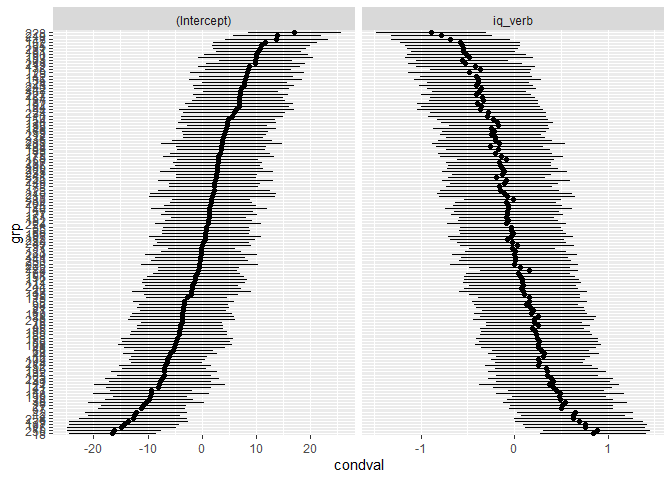
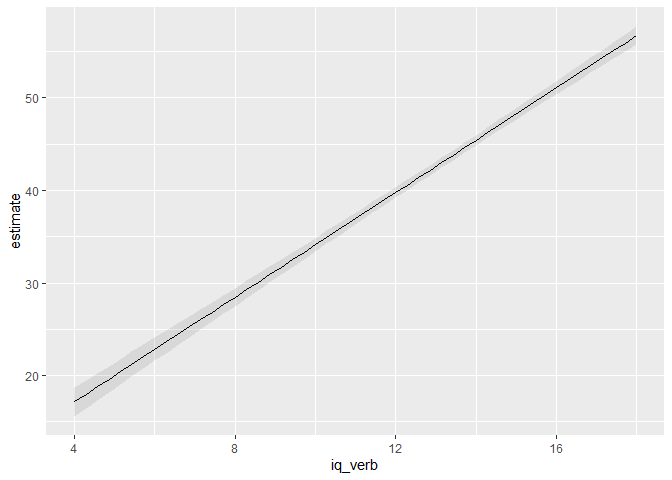
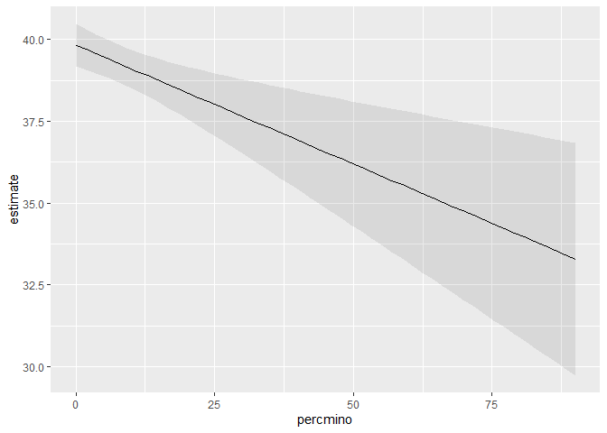
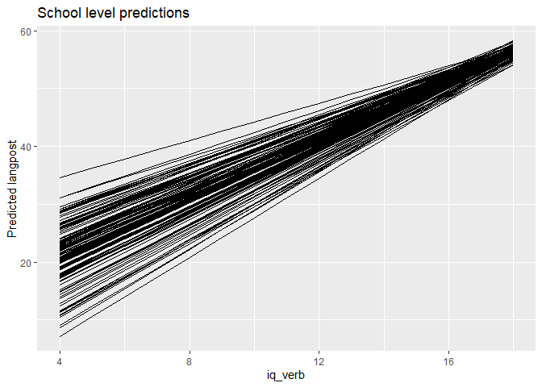
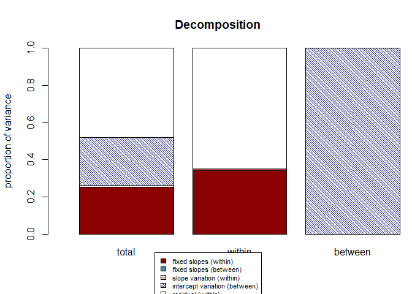

# Multilevel Regression: introduction and random effects
Mauricio Garnier-Villarreal
2026-03-16

- [Introduction to Multilevel
  Modeling](#introduction-to-multilevel-modeling)
- [Quick Review of Linear Regression and Its
  Assumptions](#quick-review-of-linear-regression-and-its-assumptions)
- [How Can Nested Data Be Handled (instead of
  MLM)?](#how-can-nested-data-be-handled-instead-of-mlm)
  - [Disaggregation](#disaggregation)
  - [Aggregation](#aggregation)
  - [Fixed Effects (ANCOVA) Approach](#fixed-effects-ancova-approach)
  - [Separate Regressions](#separate-regressions)
- [Why We Recommend MLM Instead of Other
  Methods](#why-we-recommend-mlm-instead-of-other-methods)
- [Random Effects (MLM) Regression
  Models](#random-effects-mlm-regression-models)
  - [The Two-Level Model](#the-two-level-model)
  - [Estimation](#estimation)
  - [Building Models: A Sequential
    Approach](#building-models-a-sequential-approach)
    - [Null Model (Random Intercept
      Only)](#null-model-random-intercept-only)
    - [Adding a Fixed Level-1 Predictor
      (iq_verb)](#adding-a-fixed-level-1-predictor-iq_verb)
    - [Allowing the Slope to Vary Across Level
      2-units](#allowing-the-slope-to-vary-across-level-2-units)
    - [Adding a Level-2 Predictor (percent
      minority)](#adding-a-level-2-predictor-percent-minority)
  - [Visualizing Random Effects](#visualizing-random-effects)
    - [With `marginaleffects`](#with-marginaleffects)
  - [Model Comparison](#model-comparison)
- [Effect Size Measures in MLM](#effect-size-measures-in-mlm)
  - [Level-Specific Pseudo-R² (Raudenbush & Bryk,
    2002)](#level-specific-pseudo-r²-raudenbush--bryk-2002)
  - [Snijders & Bosker’s (1999) Overall
    R²](#snijders--boskers-1999-overall-r²)
  - [Conditional and marginal R²](#conditional-and-marginal-r²)
  - [Rights & Sterba (2019) Framework](#rights--sterba-2019-framework)
  - [Recommendations for Reporting](#recommendations-for-reporting)
- [References](#references)

## Introduction to Multilevel Modeling

Multilevel modeling (MLM), also known as hierarchical linear modeling or
mixed-effects modeling, is a regression-based technique designed for
data with a nested or clustered structure. Such data arise when
observations are grouped within higher-level units. Common examples:

- Students nested within classrooms or schools
- Employees nested within organizations
- Repeated measurements nested within individuals (longitudinal data)
- Patients nested within therapists

In these situations, observations within the same cluster tend to be
more similar than observations from different clusters. This similarity
– often measured by the intraclass correlation – violates the assumption
of independence required by ordinary least squares (OLS) regression. If
we ignore this clustering, standard errors become too small, leading to
inflated Type I error rates. MLM explicitly models this dependence by
allowing regression coefficients (intercepts and slopes) to vary across
clusters, thereby producing correct standard errors and enabling us to
study how relationships differ between clusters.

Software for MLM includes R (packages `lme4`, `nlme`, `lmerTest`), SAS
(`PROC MIXED`), SPSS (`MIXED`), Stata (`mixed`), and specialized
programs like HLM and MLwiN. In this tutorial we use R with the `lme4`
package, together with supporting packages for diagnostics and effect
sizes.

## Quick Review of Linear Regression and Its Assumptions

The simple linear regression model for a single predictor is:

$$ 
y_i = \beta_0 + \beta_1 x_i + e_i, \quad e_i \sim N(0, \sigma^2) 
$$

Key assumptions (Gauss-Markov theorem) include:

1.  **Linearity**: The relationship between predictors and outcome is
    linear.
2.  **Independence**: Observations are independent of each other.
3.  **Homoscedasticity**: The variance of residuals is constant across
    all levels of predictors.
4.  **Normality**: Residuals are normally distributed (required for
    inference, especially with small samples).

When data are nested, the independence assumption is violated because
observations from the same cluster share common influences, leading to
correlated errors. This can result in underestimated standard errors,
inflated Type I error rates, and biased parameter estimates if ignored.

## How Can Nested Data Be Handled (instead of MLM)?

Several traditional approaches have been used to analyze nested data,
each with significant drawbacks. We illustrate these using the `SB.csv`
dataset (Snijders & Bosker, 1999) containing 2287 pupils in 131 schools.
The outcome is a language post-test score (`langpost`), and a predictor
is verbal IQ (`iq_verb`).

``` r
# Load required packages
library(lme4)
library(lmerTest)
library(rio)
library(parameters)
library(ggplot2)
library(dplyr)
library(r2mlm)
library(tidyr)
library(car)
library(performance)
library(marginaleffects)

# Read data
SB <- import("SB.csv")
SB <- drop_na(SB)  # remove missing for simplicity
head(SB)
```

      schoolnr pupilnr iq_verb  iq_perf sex minority repeatgr aritpret classnr
    1        1   17001    15.0 12.33333   0        0        0       14     180
    2        1   17002    14.5 10.00000   0        1        0       12     180
    3        1   17003     9.5 11.00000   0        0        0       10     180
    4        1   17004    11.0 10.00000   0        0        0       13     180
    5        1   17005     8.0  6.66667   0        0        0        8     180
    6        1   17006     9.5  9.00000   0        1        0        8     180
      aritpost langpret langpost ses denomina schoolse satiprin natitest meetings
    1       24       36       46  23        1       11  3.42857        0      1.7
    2       19       36       45  10        1       11  3.42857        0      1.7
    3       24       33       33  15        1       11  3.42857        0      1.7
    4       26       29       46  23        1       11  3.42857        0      1.7
    5        9       19       20  10        1       11  3.42857        0      1.7
    6       13       22       30  10        1       11  3.42857        0      1.7
      currmeet mixedgra percmino aritdiff homework classsiz groupsiz
    1  1.83333        0       60       12  2.33333       29       29
    2  1.83333        0       60       12  2.33333       29       29
    3  1.83333        0       60       12  2.33333       29       29
    4  1.83333        0       60       12  2.33333       29       29
    5  1.83333        0       60       12  2.33333       29       29
    6  1.83333        0       60       12  2.33333       29       29

### Disaggregation

Analyze all level-1 data as if no clustering exists. This ignores the
grouping, leading to underestimated standard errors.

``` r
m_dis <- lm(langpost ~ iq_verb, data = SB)
summary(m_dis)
```


    Call:
    lm(formula = langpost ~ iq_verb, data = SB)

    Residuals:
         Min       1Q   Median       3Q      Max 
    -28.7022  -4.3944   0.6056   5.2595  26.2212 

    Coefficients:
                Estimate Std. Error t value Pr(>|t|)    
    (Intercept)  9.52848    0.86682   10.99   <2e-16 ***
    iq_verb      2.65390    0.07215   36.78   <2e-16 ***
    ---
    Signif. codes:  0 '***' 0.001 '**' 0.01 '*' 0.05 '.' 0.1 ' ' 1

    Residual standard error: 7.137 on 2285 degrees of freedom
    Multiple R-squared:  0.3719,    Adjusted R-squared:  0.3716 
    F-statistic:  1353 on 1 and 2285 DF,  p-value: < 2.2e-16

``` r
parameters(m_dis)
```

    Parameter   | Coefficient |   SE |        95% CI | t(2285) |      p
    -------------------------------------------------------------------
    (Intercept) |        9.53 | 0.87 | [7.83, 11.23] |   10.99 | < .001
    iq verb     |        2.65 | 0.07 | [2.51,  2.80] |   36.78 | < .001


    Uncertainty intervals (equal-tailed) and p-values (two-tailed) computed
      using a Wald t-distribution approximation.

The output shows a highly significant effect of iq_verb, but the
standard errors are too small because they do not account for
school-level similarity. The R² is 0.37, but this is misleading because
part of the explained variance may be due to between-school differences.

### Aggregation

Average the outcome and predictors within each cluster and analyze at
the cluster level. This loses within-cluster information and reduces
sample size dramatically.

``` r
school_means <- SB %>%
  group_by(schoolnr) %>%
  summarise(langpost = mean(langpost),
            iq_verb = mean(iq_verb))
m_agg <- lm(langpost ~ iq_verb, data = school_means)
summary(m_agg)
```


    Call:
    lm(formula = langpost ~ iq_verb, data = school_means)

    Residuals:
        Min      1Q  Median      3Q     Max 
    -8.4163 -1.7507  0.0461  2.2184  6.8885 

    Coefficients:
                Estimate Std. Error t value Pr(>|t|)    
    (Intercept)   -7.269      3.431  -2.119    0.036 *  
    iq_verb        4.049      0.292  13.866   <2e-16 ***
    ---
    Signif. codes:  0 '***' 0.001 '**' 0.01 '*' 0.05 '.' 0.1 ' ' 1

    Residual standard error: 3.346 on 129 degrees of freedom
    Multiple R-squared:  0.5985,    Adjusted R-squared:  0.5953 
    F-statistic: 192.3 on 1 and 129 DF,  p-value: < 2.2e-16

``` r
parameters(m_agg)
```

    Parameter   | Coefficient |   SE |          95% CI | t(129) |      p
    --------------------------------------------------------------------
    (Intercept) |       -7.27 | 3.43 | [-14.06, -0.48] |  -2.12 | 0.036 
    iq verb     |        4.05 | 0.29 | [  3.47,  4.63] |  13.87 | < .001


    Uncertainty intervals (equal-tailed) and p-values (two-tailed) computed
      using a Wald t-distribution approximation.

Now we have only 131 observations (one per school). The effect of
iq_verb is larger (4.05) but we cannot make inferences about individual
students (ecological fallacy). The R² is 0.60, but this only describes
between-school variation.

### Fixed Effects (ANCOVA) Approach

Include dummy variables for each cluster (minus one) to control for
cluster differences. This can lead to many parameters, especially with
many clusters, and cannot include cluster-level predictors.

``` r
m_fe <- lm(langpost ~ iq_verb + factor(schoolnr), data = SB)
summary(m_fe)
```


    Call:
    lm(formula = langpost ~ iq_verb + factor(schoolnr), data = SB)

    Residuals:
         Min       1Q   Median       3Q      Max 
    -25.7629  -4.1364   0.3521   4.5535  19.4275 

    Coefficients:
                         Estimate Std. Error t value Pr(>|t|)    
    (Intercept)         11.479551   1.494055   7.683 2.33e-14 ***
    iq_verb              2.414772   0.071647  33.704  < 2e-16 ***
    factor(schoolnr)2   -9.498215   2.777422  -3.420 0.000638 ***
    factor(schoolnr)10  -6.434659   3.180118  -2.023 0.043155 *  
    factor(schoolnr)12  -3.392235   2.121013  -1.599 0.109890    
    factor(schoolnr)15  -8.374431   2.638148  -3.174 0.001523 ** 
    factor(schoolnr)16   1.797799   2.638613   0.681 0.495728    
    factor(schoolnr)18  -6.978124   1.857881  -3.756 0.000177 ***
    factor(schoolnr)21  -1.123930   2.043253  -0.550 0.582329    
    factor(schoolnr)24   4.602132   1.858764   2.476 0.013366 *  
    factor(schoolnr)26  -0.673673   2.012073  -0.335 0.737797    
    factor(schoolnr)27  -5.600757   1.923110  -2.912 0.003624 ** 
    factor(schoolnr)29   2.662502   2.438839   1.092 0.275083    
    factor(schoolnr)33  -1.013636   2.951893  -0.343 0.731342    
    factor(schoolnr)35   1.061648   2.167086   0.490 0.624257    
    factor(schoolnr)36  -4.113191   1.878104  -2.190 0.028626 *  
    factor(schoolnr)38   2.543690   1.788110   1.423 0.155009    
    factor(schoolnr)40   0.113150   1.706898   0.066 0.947153    
    factor(schoolnr)41  -3.167919   2.223866  -1.425 0.154444    
    factor(schoolnr)42  -4.739894   2.169536  -2.185 0.029015 *  
    factor(schoolnr)44  -2.125000   2.120999  -1.002 0.316511    
    factor(schoolnr)47  -8.052345   2.640713  -3.049 0.002322 ** 
    factor(schoolnr)48  -2.355836   2.349742  -1.003 0.316170    
    factor(schoolnr)49  -3.352336   2.523774  -1.328 0.184219    
    factor(schoolnr)52  -4.271617   1.927004  -2.217 0.026747 *  
    factor(schoolnr)54   3.045016   1.755208   1.735 0.082911 .  
    factor(schoolnr)55   0.669603   1.762060   0.380 0.703974    
    factor(schoolnr)57   1.025900   1.859150   0.552 0.581135    
    factor(schoolnr)60  -1.662913   1.898591  -0.876 0.381200    
    factor(schoolnr)61   0.045029   1.950585   0.023 0.981585    
    factor(schoolnr)62   2.337962   1.936161   1.208 0.227363    
    factor(schoolnr)65   5.534789   1.904411   2.906 0.003695 ** 
    factor(schoolnr)66  -1.096538   2.352625  -0.466 0.641197    
    factor(schoolnr)67  -5.506096   1.823331  -3.020 0.002559 ** 
    factor(schoolnr)68  -0.859374   1.955819  -0.439 0.660421    
    factor(schoolnr)76  -0.972621   2.078296  -0.468 0.639840    
    factor(schoolnr)78   0.468650   2.042294   0.229 0.818523    
    factor(schoolnr)79   1.528369   2.170351   0.704 0.481382    
    factor(schoolnr)80   2.979465   1.921821   1.550 0.121208    
    factor(schoolnr)86   1.123438   1.859981   0.604 0.545904    
    factor(schoolnr)87  -0.420156   1.923181  -0.218 0.827084    
    factor(schoolnr)88   0.809092   2.430566   0.333 0.739256    
    factor(schoolnr)90   5.557008   2.123341   2.617 0.008930 ** 
    factor(schoolnr)94   2.357577   2.134120   1.105 0.269410    
    factor(schoolnr)95  -1.745328   2.007647  -0.869 0.384758    
    factor(schoolnr)97   1.415509   2.043698   0.693 0.488622    
    factor(schoolnr)98  -1.984232   1.950384  -1.017 0.309099    
    factor(schoolnr)101  4.604323   1.875837   2.455 0.014185 *  
    factor(schoolnr)103 -7.779263   3.505036  -2.219 0.026560 *  
    factor(schoolnr)106 -1.538352   2.429031  -0.633 0.526592    
    factor(schoolnr)107 -4.638468   2.050658  -2.262 0.023800 *  
    factor(schoolnr)108 -1.901262   2.526247  -0.753 0.451771    
    factor(schoolnr)109 -4.469460   1.947737  -2.295 0.021846 *  
    factor(schoolnr)110  2.975001   2.045239   1.455 0.145926    
    factor(schoolnr)111  0.280241   2.012675   0.139 0.889275    
    factor(schoolnr)112  0.194968   2.775823   0.070 0.944011    
    factor(schoolnr)115 -0.355113   1.759671  -0.202 0.840087    
    factor(schoolnr)116 -3.336004   1.976178  -1.688 0.091535 .  
    factor(schoolnr)118 -3.947348   2.526639  -1.562 0.118366    
    factor(schoolnr)119 -1.617329   2.281478  -0.709 0.478466    
    factor(schoolnr)121 -3.720453   2.440178  -1.525 0.127489    
    factor(schoolnr)123 -0.273580   3.495930  -0.078 0.937631    
    factor(schoolnr)124  3.435797   1.953654   1.759 0.078779 .  
    factor(schoolnr)125  1.613004   1.824866   0.884 0.376847    
    factor(schoolnr)130  4.726094   2.223372   2.126 0.033647 *  
    factor(schoolnr)132  5.189422   1.929263   2.690 0.007204 ** 
    factor(schoolnr)136  4.867757   2.086288   2.333 0.019728 *  
    factor(schoolnr)137  4.445645   2.009533   2.212 0.027052 *  
    factor(schoolnr)141  0.215768   1.950384   0.111 0.911921    
    factor(schoolnr)142  4.557387   1.859766   2.451 0.014344 *  
    factor(schoolnr)147  7.087992   1.904973   3.721 0.000204 ***
    factor(schoolnr)148  2.216283   1.782912   1.243 0.213978    
    factor(schoolnr)149  1.991505   1.925025   1.035 0.301002    
    factor(schoolnr)150  1.445682   1.838175   0.786 0.431675    
    factor(schoolnr)151  0.866799   1.875709   0.462 0.644043    
    factor(schoolnr)152  6.619887   2.045972   3.236 0.001232 ** 
    factor(schoolnr)155  3.983351   1.724174   2.310 0.020966 *  
    factor(schoolnr)156 -0.048200   2.281036  -0.021 0.983143    
    factor(schoolnr)159  2.551797   1.750628   1.458 0.145084    
    factor(schoolnr)160  3.294541   1.878355   1.754 0.079581 .  
    factor(schoolnr)161  4.926706   1.750352   2.815 0.004927 ** 
    factor(schoolnr)164  4.238850   1.857799   2.282 0.022607 *  
    factor(schoolnr)167  3.868182   1.836921   2.106 0.035337 *  
    factor(schoolnr)170  2.591587   1.819718   1.424 0.154542    
    factor(schoolnr)175  2.786081   2.175134   1.281 0.200374    
    factor(schoolnr)176  6.229818   1.879475   3.315 0.000933 ***
    factor(schoolnr)177  0.971491   2.042943   0.476 0.634454    
    factor(schoolnr)179 -8.479071   2.951753  -2.873 0.004111 ** 
    factor(schoolnr)182  1.139772   2.524603   0.451 0.651699    
    factor(schoolnr)183  0.691551   1.747203   0.396 0.692288    
    factor(schoolnr)184  0.521775   1.792876   0.291 0.771059    
    factor(schoolnr)188 -1.125378   2.280203  -0.494 0.621679    
    factor(schoolnr)189  2.574098   2.042380   1.260 0.207682    
    factor(schoolnr)192 -4.063352   2.636973  -1.541 0.123484    
    factor(schoolnr)193  6.350001   2.285874   2.778 0.005518 ** 
    factor(schoolnr)195 -0.006817   1.951117  -0.003 0.997212    
    factor(schoolnr)196  1.792025   1.806753   0.992 0.321383    
    factor(schoolnr)197  0.979547   1.961529   0.499 0.617563    
    factor(schoolnr)198 -2.130925   2.776551  -0.767 0.442885    
    factor(schoolnr)199 -4.152651   1.759170  -2.361 0.018335 *  
    factor(schoolnr)204  1.303954   1.856304   0.702 0.482477    
    factor(schoolnr)206  3.313586   2.355219   1.407 0.159598    
    factor(schoolnr)209  2.298741   1.879679   1.223 0.221485    
    factor(schoolnr)210 -0.319743   2.086288  -0.153 0.878208    
    factor(schoolnr)212  1.728069   1.839692   0.939 0.347669    
    factor(schoolnr)214 -4.310849   1.921512  -2.243 0.024968 *  
    factor(schoolnr)215  2.282056   2.281599   1.000 0.317326    
    factor(schoolnr)216  2.050082   2.780203   0.737 0.460968    
    factor(schoolnr)217  2.559873   2.641683   0.969 0.332638    
    factor(schoolnr)218  4.973462   1.863346   2.669 0.007662 ** 
    factor(schoolnr)219  5.119887   2.168939   2.361 0.018337 *  
    factor(schoolnr)222  0.937595   1.856250   0.505 0.613539    
    factor(schoolnr)224  0.383655   2.224572   0.172 0.863090    
    factor(schoolnr)226 -0.607741   2.639747  -0.230 0.817937    
    factor(schoolnr)227  2.818909   2.010833   1.402 0.161101    
    factor(schoolnr)228  7.871240   1.927004   4.085 4.57e-05 ***
    factor(schoolnr)231  5.543183   1.925235   2.879 0.004026 ** 
    factor(schoolnr)233 -2.590971   2.526440  -1.026 0.305222    
    factor(schoolnr)234  4.620106   2.222909   2.078 0.037790 *  
    factor(schoolnr)235  3.422444   2.431996   1.407 0.159495    
    factor(schoolnr)237  1.688826   2.120929   0.796 0.425964    
    factor(schoolnr)240  0.304310   2.284432   0.133 0.894040    
    factor(schoolnr)241  2.038489   1.877216   1.086 0.277640    
    factor(schoolnr)242  5.559969   2.348976   2.367 0.018022 *  
    factor(schoolnr)243  5.092188   2.636796   1.931 0.053589 .  
    factor(schoolnr)244 -0.551442   2.220380  -0.248 0.803884    
    factor(schoolnr)246  3.232104   2.286321   1.414 0.157603    
    factor(schoolnr)249  0.540105   1.859981   0.290 0.771552    
    factor(schoolnr)250  0.131819   2.122955   0.062 0.950495    
    factor(schoolnr)252 -0.609710   2.349645  -0.259 0.795282    
    factor(schoolnr)256 -7.655398   2.428891  -3.152 0.001645 ** 
    factor(schoolnr)258 -8.751055   2.775908  -3.153 0.001641 ** 
    ---
    Signif. codes:  0 '***' 0.001 '**' 0.01 '*' 0.05 '.' 0.1 ' ' 1

    Residual standard error: 6.491 on 2155 degrees of freedom
    Multiple R-squared:   0.51, Adjusted R-squared:  0.4802 
    F-statistic: 17.12 on 131 and 2155 DF,  p-value: < 2.2e-16

``` r
#parameters(m_fe)  # commented because output is very long
Anova(m_fe, type = 2)
```

    Anova Table (Type II tests)

    Response: langpost
                     Sum Sq   Df   F value    Pr(>F)    
    iq_verb           47866    1 1135.9549 < 2.2e-16 ***
    factor(schoolnr)  25595  130    4.6725 < 2.2e-16 ***
    Residuals         90806 2155                        
    ---
    Signif. codes:  0 '***' 0.001 '**' 0.01 '*' 0.05 '.' 0.1 ' ' 1

The ANOVA table shows that both iq_verb and school are significant.
However, this model includes 130 dummy variables (schools minus one),
which is cumbersome and assumes schools are fixed effects – we cannot
generalize to other schools. Also, we cannot include school-level
predictors because they would be perfectly collinear with the dummies.

### Separate Regressions

Run a separate regression in each cluster. This yields unstable
estimates, especially for small clusters, and does not provide a single
summary of the overall effect.

``` r
# Using lmList from nlme
library(nlme)
mL <- lmList(langpost ~ iq_verb | schoolnr, data = SB)
summary(mL)
```

    Call:
      Model: langpost ~ iq_verb | schoolnr 
       Data: SB 

    Coefficients:
       (Intercept) 
           Estimate Std. Error     t value     Pr(>|t|)
    1    13.2993501   5.437305  2.44594538 1.453187e-02
    2    12.1671159  11.472890  1.06051007 2.890391e-01
    10  -30.1000000  20.981007 -1.43463085 1.515467e-01
    12   10.2796353  13.025260  0.78920767 4.300830e-01
    15  -11.7768987  11.953447 -0.98523033 3.246286e-01
    16  -10.8364780  33.706806 -0.32149228 7.478705e-01
    18  -11.6732283   9.547892 -1.22259747 2.216240e-01
    21    6.8731501   9.180488  0.74866937 4.541435e-01
    24   18.2350732   7.398343  2.46475114 1.379331e-02
    26   12.6210607   9.468307  1.33297968 1.826884e-01
    27    8.2449355   9.224109  0.89384633 3.715103e-01
    29   31.2438330   8.614007  3.62709652 2.937170e-04
    33   20.3181818  26.971053  0.75333291 4.513375e-01
    35   11.0812604   8.124887  1.36386648 1.727612e-01
    36   -0.4329060  10.602611 -0.04083013 9.674353e-01
    38   14.9185713   7.846929  1.90119875 5.741782e-02
    40   -1.8742515   7.721184 -0.24274147 8.082303e-01
    41   -3.8208710  11.603642 -0.32928206 7.419766e-01
    42  -28.3184544  14.745613 -1.92046644 5.493931e-02
    44  -21.7647059  20.890459 -1.04184909 2.976060e-01
    47   20.4323690   8.733030  2.33966553 1.939772e-02
    48    4.7939698  14.069456  0.34073599 7.333377e-01
    49   -9.3397239  11.858151 -0.78762062 4.310108e-01
    52   13.5682457   7.683231  1.76595583 7.755392e-02
    54   15.1399904   8.377812  1.80715324 7.088675e-02
    55   19.5908734   6.219122  3.15010279 1.655961e-03
    57   14.7840964   8.409042  1.75811905 7.887831e-02
    60    2.3893591   6.890800  0.34674625 7.288180e-01
    61   10.6550530   7.340610  1.45152151 1.467896e-01
    62   28.8240741   9.202041  3.13235668 1.758887e-03
    65   28.1234568  10.844792  2.59326833 9.575330e-03
    66   -2.4206095  10.594983 -0.22846751 8.193059e-01
    67    5.3417689   7.504412  0.71181712 4.766600e-01
    68    7.2064632   9.130398  0.78928251 4.300393e-01
    76    2.5266564   7.232581  0.34934368 7.268676e-01
    78   25.2247557   8.795230  2.86800394 4.173460e-03
    79   23.5411061  10.134577  2.32285041 2.028583e-02
    80   -1.8825928   7.680240 -0.24512162 8.063871e-01
    86   11.1192854   7.632127  1.45690527 1.452976e-01
    87   -1.3926829   9.327217 -0.14931388 8.813208e-01
    88  -16.7797495  10.940072 -1.53378787 1.252381e-01
    90   43.7406832  23.486737  1.86235677 6.269755e-02
    94   28.6738056   9.930511  2.88744515 3.925045e-03
    95    9.2652495   9.406304  0.98500428 3.247396e-01
    97   -6.1963190  14.295316 -0.43345099 6.647333e-01
    98   14.3489408   8.009743  1.79143581 7.337267e-02
    101  27.2832427   5.930391  4.60058060 4.473822e-06
    103  24.6800000  10.500303  2.35040832 1.884830e-02
    106   1.5530864   9.900807  0.15686463 8.753672e-01
    107 -23.6700919  11.540276 -2.05108539 4.038705e-02
    108  -6.8194444  19.360658 -0.35223206 7.247009e-01
    109  12.8766934   6.131825  2.09997748 3.585425e-02
    110  29.3043478  15.166697  1.93215095 5.348021e-02
    111   4.9131944  12.766770  0.38484241 7.003946e-01
    112  -0.3371105  13.539775 -0.02489779 9.801389e-01
    115   0.9549795  10.555773  0.09046988 9.279228e-01
    116   8.3333333  11.645216  0.71560141 4.743200e-01
    118 -41.6195122  23.117619 -1.80033735 7.195615e-02
    119   8.7341977  10.525483  0.82981444 4.067415e-01
    121  -2.8691589  18.965507 -0.15128301 8.797675e-01
    123  30.6275168  10.736669  2.85260894 4.380209e-03
    124  30.6769231  14.136746  2.17001309 3.012177e-02
    125  11.2214326   8.761449  1.28077356 2.004199e-01
    130   8.1447743   8.186223  0.99493683 3.198859e-01
    132  17.0520723  12.285441  1.38799025 1.652927e-01
    136  20.6612319  19.947794  1.03576528 3.004353e-01
    137  15.1390977   9.429433  1.60551516 1.085364e-01
    141  13.1996161   9.075232  1.45446597 1.459721e-01
    142  20.3431559  11.859506  1.71534595 8.643480e-02
    147  30.6459583  14.375695  2.13178962 3.314421e-02
    148  21.2251087   9.769358  2.17262071 2.992451e-02
    149  11.3949021   9.651285  1.18066169 2.378758e-01
    150   0.4823009  12.396976  0.03890472 9.689702e-01
    151  15.3490635   7.379043  2.08008851 3.764290e-02
    152  25.0000000  16.035203  1.55906979 1.191361e-01
    155   5.1629516   7.668208  0.67329310 5.008377e-01
    156   9.3346457  10.235347  0.91200086 3.618768e-01
    159  16.0419181   8.010615  2.00258258 4.535521e-02
    160   8.5090275   6.131271  1.38780802 1.653482e-01
    161  26.2796410   7.843234  3.35061290 8.211364e-04
    164  15.5114871   9.923739  1.56306876 1.181927e-01
    167  20.0727193   6.246039  3.21367179 1.331097e-03
    170 -10.8640275   7.560429 -1.43695911 1.508841e-01
    175  11.1536996  11.220677  0.99403094 3.203266e-01
    176  12.4862947   6.812712  1.83279359 6.698002e-02
    177  20.7066521  14.504843  1.42756813 1.535704e-01
    179 -25.9248826  24.362728 -1.06412067 2.874009e-01
    182  12.8637084  10.216813  1.25907256 2.081492e-01
    183   8.9979116   8.735929  1.02998908 3.031381e-01
    184  27.7467785   7.972167  3.48045633 5.111595e-04
    188 -21.6317204  18.016359 -1.20067104 2.300193e-01
    189  13.8183481   7.668221  1.80202798 7.168967e-02
    192   8.1973684  22.485424  0.36456366 7.154752e-01
    193  21.2277070  15.990200  1.32754481 1.844782e-01
    195   4.5776596  11.318318  0.40444700 6.859268e-01
    196  15.4542391   7.147274  2.16225634 3.071519e-02
    197  12.9200627  11.014790  1.17297406 2.409442e-01
    198  -0.7626866  14.902917 -0.05117700 9.591895e-01
    199   1.3006600   6.298189  0.20651333 8.364107e-01
    204  14.1740009   8.929075  1.58739852 1.125785e-01
    206  -9.9250000  28.706546 -0.34573996 7.295741e-01
    209   8.4017094  12.599995  0.66680257 5.049742e-01
    210  -0.9290393  11.031417 -0.08421759 9.328918e-01
    212  20.6415828   6.809036  3.03149844 2.464277e-03
    214   9.9770673   5.259018  1.89713497 5.795228e-02
    215  20.1580345  11.025593  1.82829479 6.765236e-02
    216  15.7976190  20.842826  0.75794035 4.485749e-01
    217 -31.0000000  33.770798 -0.91795283 3.587529e-01
    218  33.3853564   6.047479  5.52054149 3.813887e-08
    219  37.2035491  12.881613  2.88811262 3.916760e-03
    222   0.9420290   9.605616  0.09807065 9.218859e-01
    224  20.8226257  10.850479  1.91905129 5.511826e-02
    226  27.0316206  16.047451  1.68448060 9.224293e-02
    227  30.8898637   9.152216  3.37512387 7.517479e-04
    228  38.1738717   8.584635  4.44676679 9.189244e-06
    231  28.4421053  11.255201  2.52701890 1.157910e-02
    233 -16.9396186  15.250955 -1.11072509 2.668186e-01
    234  10.1789639  11.138544  0.91385052 3.609042e-01
    235 -16.8621190  18.732799 -0.90013878 3.681534e-01
    237  18.6545918   9.014591  2.06937745 3.863726e-02
    240  17.5937183  17.601834  0.99953890 3.176531e-01
    241  13.2250436   7.053573  1.87494245 6.094446e-02
    242  10.2445820  10.675894  0.95959944 3.373714e-01
    243  35.6515152  19.052339  1.87124086 6.145580e-02
    244   9.6132265   9.562745  1.00527897 3.148826e-01
    246  -3.6033058  14.983848 -0.24047933 8.099830e-01
    249  13.8456862   9.323419  1.48504385 1.376879e-01
    250  13.7388393   9.986432  1.37575055 1.690510e-01
    252  34.9292267  12.428951  2.81031166 4.996943e-03
    256 -26.2052335   9.904096 -2.64589846 8.210477e-03
    258  26.1920290  21.877619  1.19720656 2.313662e-01
       iq_verb 
          Estimate Std. Error    t value     Pr(>|t|)
    1    2.2384351  0.5119972  4.3719671 1.293720e-05
    2    1.2830189  1.2459812  1.0297257 3.032618e-01
    10   5.7619048  1.9794284  2.9108933 3.643347e-03
    12   2.1823708  1.3695633  1.5934793 1.112088e-01
    15   3.7088608  1.0205538  3.6341649 2.858326e-04
    16   4.4779874  2.8774704  1.5562236 1.198112e-01
    18   3.7913386  0.8049105  4.7102612 2.641965e-06
    21   2.7107822  0.7690566  3.5248148 4.331900e-04
    24   2.2346977  0.6089119  3.6699851 2.488384e-04
    26   2.2682552  0.7544528  3.0064907 2.675317e-03
    27   2.2077348  0.7977635  2.7674051 5.701838e-03
    29   1.1385199  0.6247613  1.8223278 6.855269e-02
    33   1.5454545  2.3685564  0.6524880 5.141605e-01
    35   2.5505804  0.7387896  3.4523772 5.670838e-04
    36   3.0816239  0.8993017  3.4266852 6.232002e-04
    38   2.3367963  0.6751998  3.4608959 5.495422e-04
    40   3.4933611  0.6122747  5.7055455 1.330413e-08
    41   3.4067379  0.9375098  3.6338157 2.862175e-04
    42   5.3804131  1.2389053  4.3428768 1.475726e-05
    44   5.1932773  1.8593492  2.7930618 5.270266e-03
    47   0.3690383  1.0145516  0.3637452 7.160862e-01
    48   2.7973199  1.2312851  2.2718702 2.319883e-02
    49   4.0107362  1.0657293  3.7633724 1.724072e-04
    52   1.9000649  0.6113602  3.1079305 1.910197e-03
    54   2.3673142  0.6399133  3.6994297 2.218454e-04
    55   1.7954890  0.5082836  3.5324553 4.209380e-04
    57   2.2255422  0.6898124  3.2263005 1.274021e-03
    60   3.0790004  0.6039937  5.0977361 3.757156e-07
    61   2.4879955  0.6062429  4.1039585 4.222449e-05
    62   1.3148148  0.6666470  1.9722803 4.871349e-02
    65   1.5308642  0.8559893  1.7884150 7.385852e-02
    66   3.4619086  0.8519470  4.0635260 5.018186e-05
    67   2.4665008  0.6058397  4.0712104 4.856760e-05
    68   2.6804309  0.7017157  3.8198244 1.375683e-04
    76   3.1725430  0.6696816  4.7373899 2.315243e-06
    78   1.2573290  0.7546746  1.6660545 9.585722e-02
    79   1.5396114  0.8299088  1.8551572 6.371902e-02
    80   3.9232283  0.6970729  5.6281463 2.074987e-08
    86   2.5363043  0.6158898  4.1181141 3.973349e-05
    87   3.5020638  0.8052124  4.3492420 1.433926e-05
    88   4.9206681  0.9267587  5.3095459 1.219476e-07
    90   0.1832298  1.9577946  0.0935899 9.254442e-01
    94   1.3344316  0.7129691  1.8716541 6.139853e-02
    95   2.4565619  0.8272886  2.9694133 3.018747e-03
    97   4.0214724  1.1959265  3.3626419 7.863722e-04
    98   2.0043179  0.6664093  3.0076381 2.665284e-03
    101  1.3782109  0.5347490  2.5773044 1.002758e-02
    103 -0.6933333  1.4812686 -0.4680673 6.397869e-01
    106  3.1950617  0.9014713  3.5442743 4.026216e-04
    107  4.7355327  0.8697720  5.4445676 5.823752e-08
    108  3.7812500  1.6035203  2.3580931 1.846368e-02
    109  1.8728228  0.5507374  3.4005732 6.854984e-04
    110  1.2010870  1.2330480  0.9740796 3.301333e-01
    111  2.9625000  1.0141553  2.9211504 3.526009e-03
    112  3.5665722  1.2773535  2.7921575 5.284961e-03
    115  3.3042292  0.9175465  3.6011572 3.244315e-04
    116  2.3974359  1.0552192  2.2719790 2.319224e-02
    118  6.4731707  1.9006133  3.4058326 6.725027e-04
    119  2.5121556  0.8945044  2.8084329 5.026077e-03
    121  3.1962617  1.3865245  2.3052327 2.125420e-02
    123  0.4228188  1.0509240  0.4023305 6.874833e-01
    124  1.1538462  1.1251042  1.0255460 3.052281e-01
    125  2.5646926  0.6947231  3.6916760 2.286735e-04
    130  3.0801139  0.6595411  4.6700864 3.208343e-06
    132  2.3846971  0.9581848  2.4887653 1.289854e-02
    136  2.0797101  1.5443292  1.3466754 1.782355e-01
    137  2.4812030  0.7865451  3.1545592 1.631000e-03
    141  2.2875589  0.7578168  3.0186173 2.570999e-03
    142  2.0608365  0.9687957  2.1272148 3.352279e-02
    147  1.4606424  1.1304529  1.2920860 1.964748e-01
    148  1.8409247  0.7390221  2.4910280 1.281694e-02
    149  2.5884743  0.7989415  3.2398798 1.215177e-03
    150  3.4911504  1.0666458  3.2730175 1.081964e-03
    151  2.1340306  0.6784840  3.1452925 1.683298e-03
    152  1.8574822  1.2888959  1.4411421 1.496992e-01
    155  3.2919293  0.6460747  5.0952763 3.805642e-07
    156  2.5984252  0.8817352  2.9469449 3.245979e-03
    159  2.2511825  0.6450073  3.4901660 4.930496e-04
    160  2.9474764  0.5087741  5.7932914 7.984329e-09
    161  1.6082507  0.6337372  2.5377247 1.123198e-02
    164  2.4324132  0.8386779  2.9002950 3.768311e-03
    167  1.9898634  0.5497200  3.6197759 3.020971e-04
    170  4.6161790  0.6581708  7.0136495 3.152600e-12
    175  2.6548111  0.8553466  3.1037840 1.937040e-03
    176  2.8492413  0.5556720  5.1275592 3.214751e-07
    177  1.7077426  1.2350633  1.3827166 1.669042e-01
    179  4.9859155  2.1530309  2.3157659 2.067051e-02
    182  2.3882726  1.0833181  2.2045902 2.759495e-02
    183  2.6891625  0.7488112  3.5912424 3.369470e-04
    184  1.1533339  0.6312599  1.8270350 6.784163e-02
    188  5.3225806  1.6291782  3.2670340 1.104971e-03
    189  2.4352332  0.6529363  3.7296645 1.970071e-04
    192  2.3421053  2.0810027  1.1254696 2.605235e-01
    193  2.1464968  1.2538923  1.7118669 8.707431e-02
    195  2.9893617  0.9355899  3.1951625 1.419027e-03
    196  2.2359197  0.5768636  3.8759936 1.095716e-04
    197  2.3808777  0.8030158  2.9649201 3.062992e-03
    198  3.3164179  1.3112215  2.5292584 1.150571e-02
    199  2.9496456  0.5492630  5.3701882 8.768508e-08
    204  2.2914010  0.7836656  2.9239524 3.494559e-03
    206  4.3500000  2.2423816  1.9399017 5.253032e-02
    209  2.8603989  1.0384242  2.7545572 5.929721e-03
    210  3.3537118  0.8477088  3.9562073 7.877145e-05
    212  1.7921622  0.5600589  3.1999529 1.395770e-03
    214  2.1473088  0.4827942  4.4476685 9.151137e-06
    215  1.8645418  0.9349684  1.9942297 4.626083e-02
    216  2.2333333  1.6561086  1.3485428 1.776347e-01
    217  6.0000000  2.6821551  2.2370071 2.539431e-02
    218  1.0889117  0.4623074  2.3553847 1.859844e-02
    219  0.6450939  1.0965557  0.5882911 5.564025e-01
    222  3.4347826  0.8458640  4.0606797 5.079258e-05
    224  1.6913408  0.8642703  1.9569580 5.048963e-02
    226  1.0750988  1.3170084  0.8163189 4.144138e-01
    227  1.0479746  0.7436008  1.4093242 1.588929e-01
    228  0.8915171  0.6854144  1.3006980 1.935098e-01
    231  1.4631579  0.9306527  1.5721847 1.160640e-01
    233  4.5572034  1.2525633  3.6383018 2.813108e-04
    234  2.9081633  0.9162973  3.1738207 1.527051e-03
    235  5.0507983  1.5454495  3.2681742 1.100552e-03
    237  1.9234694  0.7935367  2.4239198 1.544107e-02
    240  1.9452888  1.4144789  1.3752688 1.692002e-01
    241  2.4403954  0.6056624  4.0293000 5.801002e-05
    242  3.0402477  0.9664600  3.1457563 1.680644e-03
    243  0.5757576  1.8233156  0.3157751 7.522058e-01
    244  2.5330661  0.8452987  2.9966520 2.762784e-03
    246  3.8512397  1.1661966  3.3023933 9.753129e-04
    249  2.2651998  0.7561255  2.9957986 2.770492e-03
    250  2.2354911  0.8299006  2.6936854 7.124995e-03
    252  0.2804718  1.0891395  0.2575169 7.968059e-01
    256  5.2611596  0.9188794  5.7256257 1.184441e-08
    258  0.2101449  2.0429555  0.1028632 9.180817e-01

    Residual standard error: 6.414081 on 2025 degrees of freedom

The output shows the intercept and slope for each school. Some schools
have very few students, leading to imprecise estimates (e.g., school 10
has slope 5.76 with SE 1.98). There is no single measure of the average
relationship, and small schools are not “borrowing strength” from larger
ones.

All these methods are suboptimal. Disaggregation ignores clustering,
aggregation loses power and can lead to ecological fallacy, fixed
effects models are cumbersome and cannot generalize beyond sampled
clusters, and separate regressions are inefficient and ignore the
multilevel structure.

## Why We Recommend MLM Instead of Other Methods

Multilevel modeling treats clusters as a random sample from a
population, estimating both fixed effects (average relationships) and
random effects (cluster-specific deviations). Key advantages:

- **Correct standard errors**: Accounts for within-cluster dependence.
- **Variance decomposition**: Partitions outcome variance into within-
  and between-cluster components (intraclass correlation).
- **Can include predictors at all levels**: Level-1 (individual) and
  level-2 (cluster) predictors can be modeled simultaneously.
- **Cross-level interactions**: Investigate whether relationships at
  level-1 vary as a function of level-2 characteristics.
- **Shrinkage estimates**: Empirical Bayes predictions for clusters
  borrow strength from the overall data, improving estimates for small
  clusters.
- **Handles unbalanced designs naturally**: Different cluster sizes are
  accommodated.

As Hox et al. (2018, p. 1) put it: “Multilevel analysis is used to
examine relations between variables measured at different levels of the
multilevel data structure.”

## Random Effects (MLM) Regression Models

### The Two-Level Model

For a continuous outcome $y_{ij}$ for individual $i$ in cluster $j$,
with a single level-1 predictor $x_{ij}$ and a level-2 predictor $z_j$,
the model is:

**Level 1** (within-cluster): $$ 
y_{ij} = \beta_{0j} + \beta_{1j} x_{ij} + e_{ij}, \quad e_{ij} \sim N(0, \sigma^2) 
$$

**Level 2** (between-cluster): $$ 
\beta_{0j} = \gamma_{00} + \gamma_{01} z_j + u_{0j} 
$$

$$ 
\beta_{1j} = \gamma_{10} + \gamma_{11} z_j + u_{1j} 
$$ where
$\mathbf{u}_j = (u_{0j}, u_{1j})' \sim MVN(\mathbf{0}, \mathbf{T})$,
with $\mathbf{T}$ containing variances $\tau_{00}$ and $\tau_{11}$ and
covariance $\tau_{01}$.

Substituting gives the combined model: $$ 
y_{ij} = \gamma_{00} + \gamma_{10} x_{ij} + \gamma_{01} z_j + \gamma_{11} x_{ij} z_j + u_{0j} + u_{1j} x_{ij} + e_{ij} 
$$

The fixed part ($\gamma$’s) represents the average relationships across
all clusters; the random part ($u$’s) captures cluster-specific
deviations.

### Estimation

Parameters are typically estimated using maximum likelihood (ML) or
restricted maximum likelihood (REML). REML is preferred for variance
components because it corrects for the loss of degrees of freedom from
estimating fixed effects (Hox et al., 2018, Chapter 3). In `lmer()`, we
set `REML = FALSE` for ML (allows likelihood ratio tests on fixed
effects) and `REML = TRUE` (default) for REML when comparing models with
the same fixed structure. Model comparisons can be done using likelihood
ratio tests (LRT) or information criteria (AIC, BIC).

### Building Models: A Sequential Approach

We follow the strategy outlined by Peugh (2010): start with a null
model, then add level-1 predictors, test for random slopes, add level-2
predictors, and finally cross-level interactions.

#### Null Model (Random Intercept Only)

``` r
m0 <- lmer(langpost ~ 1 + (1 | schoolnr), data = SB, REML = FALSE)
summary(m0)
```

    Linear mixed model fit by maximum likelihood . t-tests use Satterthwaite's
      method [lmerModLmerTest]
    Formula: langpost ~ 1 + (1 | schoolnr)
       Data: SB

          AIC       BIC    logLik -2*log(L)  df.resid 
      16259.2   16276.4   -8126.6   16253.2      2284 

    Scaled residuals: 
         Min       1Q   Median       3Q      Max 
    -3.11661 -0.65733  0.07616  0.74118  2.50577 

    Random effects:
     Groups   Name        Variance Std.Dev.
     schoolnr (Intercept) 19.43    4.408   
     Residual             64.57    8.035   
    Number of obs: 2287, groups:  schoolnr, 131

    Fixed effects:
                Estimate Std. Error       df t value Pr(>|t|)    
    (Intercept)  40.3641     0.4264 116.4419   94.67   <2e-16 ***
    ---
    Signif. codes:  0 '***' 0.001 '**' 0.01 '*' 0.05 '.' 0.1 ' ' 1

``` r
parameters(m0)
```

    # Fixed Effects

    Parameter   | Coefficient |   SE |         95% CI | t(2284) |      p
    --------------------------------------------------------------------
    (Intercept) |       40.36 | 0.43 | [39.53, 41.20] |   94.67 | < .001

    # Random Effects

    Parameter                | Coefficient
    --------------------------------------
    SD (Intercept: schoolnr) |        4.41
    SD (Residual)            |        8.04


    Uncertainty intervals (equal-tailed) and p-values (two-tailed) computed
      using a Wald t-distribution approximation.

**Explanation of arguments:** - `langpost ~ 1 + (1 | schoolnr)`: the
formula specifies a fixed intercept (`1`) and a random intercept for
each school (`(1 | schoolnr)`). The term `(1 | schoolnr)` means “allow
the intercept to vary across schools”. - `REML = FALSE`: use maximum
likelihood (ML) estimation. This is chosen because we will later compare
models that differ in fixed effects.

**Output interpretation:** - Fixed effects: The intercept is the grand
mean of `langpost` across all students and schools, estimated as
40.36. - Random effects: - `schoolnr (Intercept)` variance = 19.43 (SD =
4.41). This is the between-school variance in mean language scores. -
`Residual` variance = 64.57 (SD = 8.04). This is the within-school
(student-level) variance. - The total variance = 19.43 + 64.57 =
84.00. - Intraclass correlation (ICC) = 19.43 / 84.00 = 0.23, meaning
23% of the variance in language scores is between schools.

``` r
# Compute ICC manually
VarCorr(m0)
```

     Groups   Name        Std.Dev.
     schoolnr (Intercept) 4.4078  
     Residual             8.0354  

``` r
icc0 <- 4.4078^2 / (4.4078^2 + 8.0354^2)
icc0
```

    [1] 0.2313041

We can easily estimate this from a random intercept model with the
`icc()` function from the `performance` package:

``` r
icc(m0)
```

    # Intraclass Correlation Coefficient

        Adjusted ICC: 0.231
      Unadjusted ICC: 0.231

The ICC is a key measure of clustering; values above 0.05–0.10 often
warrant multilevel modeling.

#### Adding a Fixed Level-1 Predictor (iq_verb)

``` r
m1 <- lmer(langpost ~ 1 + iq_verb + (1 | schoolnr), 
           data = SB, REML = FALSE)
summary(m1)
```

    Linear mixed model fit by maximum likelihood . t-tests use Satterthwaite's
      method [lmerModLmerTest]
    Formula: langpost ~ 1 + iq_verb + (1 | schoolnr)
       Data: SB

          AIC       BIC    logLik -2*log(L)  df.resid 
      15259.8   15282.7   -7625.9   15251.8      2283 

    Scaled residuals: 
        Min      1Q  Median      3Q     Max 
    -4.0958 -0.6370  0.0580  0.7069  3.1467 

    Random effects:
     Groups   Name        Variance Std.Dev.
     schoolnr (Intercept)  9.497   3.082   
     Residual             42.227   6.498   
    Number of obs: 2287, groups:  schoolnr, 131

    Fixed effects:
                 Estimate Std. Error        df t value Pr(>|t|)    
    (Intercept) 1.117e+01  8.788e-01 1.926e+03   12.71   <2e-16 ***
    iq_verb     2.488e+00  7.005e-02 2.276e+03   35.52   <2e-16 ***
    ---
    Signif. codes:  0 '***' 0.001 '**' 0.01 '*' 0.05 '.' 0.1 ' ' 1

    Correlation of Fixed Effects:
            (Intr)
    iq_verb -0.937

``` r
parameters(m1)
```

    # Fixed Effects

    Parameter   | Coefficient |   SE |        95% CI | t(2283) |      p
    -------------------------------------------------------------------
    (Intercept) |       11.17 | 0.88 | [9.44, 12.89] |   12.71 | < .001
    iq verb     |        2.49 | 0.07 | [2.35,  2.63] |   35.52 | < .001

    # Random Effects

    Parameter                | Coefficient
    --------------------------------------
    SD (Intercept: schoolnr) |        3.08
    SD (Residual)            |        6.50


    Uncertainty intervals (equal-tailed) and p-values (two-tailed) computed
      using a Wald t-distribution approximation.

**Explanation of arguments:** - `iq_verb` is added as a fixed effect. It
is a student-level predictor. - The random part remains
`(1 | schoolnr)`, i.e., only the intercept varies across schools.

**Output interpretation:** - Fixed effect of `iq_verb` = 2.49 (p \<
.001). This means that, on average, a one-point increase in verbal IQ is
associated with a 2.49-point increase in language post-test, holding
school constant. - The intercept now represents the predicted language
score when `iq_verb = 0`. With centered predictors, this would be more
meaningful, but here it’s simply the value at zero IQ. - Random effects:
The residual variance decreased from 64.57 to 42.22 (a reduction of
about 35%). The between-school variance also decreased from 19.43 to
9.50, indicating that part of the between-school differences is
explained by differences in average IQ across schools (compositional
effect).

#### Allowing the Slope to Vary Across Level 2-units

``` r
m2 <- lmer(langpost ~ 1 + iq_verb + (1 + iq_verb | schoolnr), 
           data = SB, REML = FALSE,
           control = lmerControl(optimizer = "Nelder_Mead"))
summary(m2)
```

    Linear mixed model fit by maximum likelihood . t-tests use Satterthwaite's
      method [lmerModLmerTest]
    Formula: langpost ~ 1 + iq_verb + (1 + iq_verb | schoolnr)
       Data: SB
    Control: lmerControl(optimizer = "Nelder_Mead")

          AIC       BIC    logLik -2*log(L)  df.resid 
      15242.8   15277.2   -7615.4   15230.8      2281 

    Scaled residuals: 
        Min      1Q  Median      3Q     Max 
    -4.1417 -0.6377  0.0617  0.7114  2.7101 

    Random effects:
     Groups   Name        Variance Std.Dev. Corr  
     schoolnr (Intercept) 65.8822  8.1168         
              iq_verb      0.2101  0.4584   -0.98 
     Residual             41.4801  6.4405         
    Number of obs: 2287, groups:  schoolnr, 131

    Fixed effects:
                 Estimate Std. Error        df t value Pr(>|t|)    
    (Intercept)  10.81232    1.11088 106.32518   9.733   <2e-16 ***
    iq_verb       2.52637    0.08145 106.87591  31.016   <2e-16 ***
    ---
    Signif. codes:  0 '***' 0.001 '**' 0.01 '*' 0.05 '.' 0.1 ' ' 1

    Correlation of Fixed Effects:
            (Intr)
    iq_verb -0.967

``` r
parameters(m2)
```

    # Fixed Effects

    Parameter   | Coefficient |   SE |        95% CI | t(2281) |      p
    -------------------------------------------------------------------
    (Intercept) |       10.81 | 1.11 | [8.63, 12.99] |    9.73 | < .001
    iq verb     |        2.53 | 0.08 | [2.37,  2.69] |   31.02 | < .001

    # Random Effects

    Parameter                         | Coefficient
    -----------------------------------------------
    SD (Intercept: schoolnr)          |        8.12
    SD (iq_verb: schoolnr)            |        0.46
    Cor (Intercept~iq_verb: schoolnr) |       -0.98
    SD (Residual)                     |        6.44


    Uncertainty intervals (equal-tailed) and p-values (two-tailed) computed
      using a Wald t-distribution approximation.

**Explanation of arguments:** - `(1 + iq_verb | schoolnr)` means we
allow both the intercept and the slope of `iq_verb` to vary randomly
across schools. This adds two variance components: variance of the
slopes, and covariance between intercepts and slopes. -
`control = lmerControl(optimizer = "Nelder_Mead")`: we specify a
different optimizer because models with random slopes can be more
difficult to estimate; Nelder-Mead is a robust alternative.

**Output interpretation:** - Fixed effects: The average slope of
`iq_verb` is 2.53, similar to before. - Random effects: - Variance of
intercepts = 65.88 (SD = 8.12) – this is now the variance of school mean
language scores *when iq_verb = 0*. Because we haven’t centered
`iq_verb`, zero is outside the observed range; this variance is not
directly interpretable. - Variance of slopes = 0.21 (SD = 0.46). This
indicates that the relationship between IQ and language varies across
schools: some schools have a stronger effect, others weaker. -
Correlation between intercepts and slopes = -0.98. This strong negative
correlation suggests that schools with higher average language scores
(higher intercept) tend to have weaker IQ effects (lower slopes). This
could be a ceiling effect or a statistical artifact due to scaling;
centering predictors would help interpret these variances and
covariances. - Residual variance = 41.48, slightly lower than in `m1`.

Now the slope of iq_verb varies across schools (variance = 0.21). We can
test whether this random slope is necessary using a likelihood ratio
test.

``` r
anova(m1, m2)
```

    Data: SB
    Models:
    m1: langpost ~ 1 + iq_verb + (1 | schoolnr)
    m2: langpost ~ 1 + iq_verb + (1 + iq_verb | schoolnr)
       npar   AIC   BIC  logLik -2*log(L)  Chisq Df Pr(>Chisq)    
    m1    4 15260 15283 -7625.9     15252                         
    m2    6 15243 15277 -7615.4     15231 20.995  2   2.76e-05 ***
    ---
    Signif. codes:  0 '***' 0.001 '**' 0.01 '*' 0.05 '.' 0.1 ' ' 1

The test compares the deviance (-2 log likelihood) of the two models.
The difference is 20.99 on 2 degrees of freedom (because `m2` adds two
parameters: slope variance and intercept-slope covariance). The p-value
is highly significant, indicating that allowing the slope to vary
improves model fit.

#### Adding a Level-2 Predictor (percent minority)

``` r
m3 <- lmer(langpost ~ 1 + iq_verb + percmino + (1 + iq_verb | schoolnr), 
           data = SB, REML = FALSE,
           control = lmerControl(optimizer = "Nelder_Mead"))
summary(m3)
```

    Linear mixed model fit by maximum likelihood . t-tests use Satterthwaite's
      method [lmerModLmerTest]
    Formula: langpost ~ 1 + iq_verb + percmino + (1 + iq_verb | schoolnr)
       Data: SB
    Control: lmerControl(optimizer = "Nelder_Mead")

          AIC       BIC    logLik -2*log(L)  df.resid 
      15233.8   15273.9   -7609.9   15219.8      2280 

    Scaled residuals: 
        Min      1Q  Median      3Q     Max 
    -4.1842 -0.6442  0.0543  0.7044  2.7066 

    Random effects:
     Groups   Name        Variance Std.Dev. Corr  
     schoolnr (Intercept) 62.6941  7.9180         
              iq_verb      0.2085  0.4566   -0.98 
     Residual             41.4443  6.4377         
    Number of obs: 2287, groups:  schoolnr, 131

    Fixed effects:
                 Estimate Std. Error        df t value Pr(>|t|)    
    (Intercept)  11.47690    1.11998 114.69865  10.247  < 2e-16 ***
    iq_verb       2.51310    0.08153 108.49151  30.823  < 2e-16 ***
    percmino     -0.07261    0.02151 162.23790  -3.375 0.000924 ***
    ---
    Signif. codes:  0 '***' 0.001 '**' 0.01 '*' 0.05 '.' 0.1 ' ' 1

    Correlation of Fixed Effects:
             (Intr) iq_vrb
    iq_verb  -0.962       
    percmino -0.190  0.068

``` r
parameters(m3)
```

    # Fixed Effects

    Parameter   | Coefficient |   SE |         95% CI | t(2280) |      p
    --------------------------------------------------------------------
    (Intercept) |       11.48 | 1.12 | [ 9.28, 13.67] |   10.25 | < .001
    iq verb     |        2.51 | 0.08 | [ 2.35,  2.67] |   30.82 | < .001
    percmino    |       -0.07 | 0.02 | [-0.11, -0.03] |   -3.37 | < .001

    # Random Effects

    Parameter                         | Coefficient
    -----------------------------------------------
    SD (Intercept: schoolnr)          |        7.92
    SD (iq_verb: schoolnr)            |        0.46
    Cor (Intercept~iq_verb: schoolnr) |       -0.98
    SD (Residual)                     |        6.44


    Uncertainty intervals (equal-tailed) and p-values (two-tailed) computed
      using a Wald t-distribution approximation.

**Explanation of arguments:** - `percmino` is a school-level variable
(percentage of minority students). It is added as a fixed effect to
explain between-school variation.

**Output interpretation:** - Fixed effect of `percmino` = -0.073 (p \<
.001). For every 1% increase in minority enrollment, the predicted
language score decreases by 0.07 points, holding student IQ constant.
This is a small but significant contextual effect. - The random slope
variance remains about 0.21, indicating that even after controlling for
school composition, the IQ effect still varies across schools.

`percmino` has a significant negative effect: schools with higher
percent minority have lower average language scores.

### Visualizing Random Effects

We can extract and plot the random effects (BLUPs) using `ranef()` and
using `ggplot2` we can plot the random slope and intercept.

``` r
ranef_m2 <- ranef(m2)
dd <- as.data.frame(ranef_m2)

ggplot(dd, aes(y=grp,x=condval)) +
  geom_point() + 
  facet_wrap(~term,scales="free_x") +
  geom_errorbar(aes(xmin=condval -2*condsd,
                    xmax=condval +2*condsd), 
                width=0, 
                orientation = "y")
```



**Explanation:** - `ranef(m2)` extracts the conditional modes (best
linear unbiased predictions, or BLUPs) of the random effects, along with
conditional standard deviations (`condsd`). The result is a list; we
convert it to a data frame. - The plot shows each school’s random
intercept deviation (left) and random slope deviation (right). The dots
are the point estimates, and the error bars represent ±2 conditional SDs
(roughly 95% confidence intervals for the random effects). Schools with
error bars that do not overlap zero are significantly different from the
average. - This caterpillar plot helps identify outliers and assess the
variability of random effects.

#### With `marginaleffects`

We can also visualize the **fixed** effects with the `marginaleffects`
package, as these are `ggplot2` objects you can modify them.

``` r
plot_predictions(m3, condition = "iq_verb")
```

    Warning: For this model type, `marginaleffects` only takes into account the
    uncertainty in fixed-effect parameters. This is often appropriate when
    `re.form=NA`, but may be surprising to users who set `re.form=NULL` (default)
    or to some other value. Call `options(marginaleffects_safe = FALSE)` to silence
    this warning.
    Warning: For this model type, `marginaleffects` only takes into account the
    uncertainty in fixed-effect parameters. This is often appropriate when
    `re.form=NA`, but may be surprising to users who set `re.form=NULL` (default)
    or to some other value. Call `options(marginaleffects_safe = FALSE)` to silence
    this warning.



``` r
plot_predictions(m3, condition = "percmino")
```

    Warning: For this model type, `marginaleffects` only takes into account the
    uncertainty in fixed-effect parameters. This is often appropriate when
    `re.form=NA`, but may be surprising to users who set `re.form=NULL` (default)
    or to some other value. Call `options(marginaleffects_safe = FALSE)` to silence
    this warning.
    Warning: For this model type, `marginaleffects` only takes into account the
    uncertainty in fixed-effect parameters. This is often appropriate when
    `re.form=NA`, but may be surprising to users who set `re.form=NULL` (default)
    or to some other value. Call `options(marginaleffects_safe = FALSE)` to silence
    this warning.



**Explanation:** - `plot_predictions()` from `marginaleffects` computes
predicted values of the outcome across the range of a predictor, holding
other predictors at their means (or typical values). The default uses
only fixed effects (i.e., it averages over random effects), which is
appropriate for population-level inference. - The first plot shows the
average relationship between IQ and language scores, with a confidence
band. - The second plot shows the average relationship between percent
minority and language scores. Both are linear because we have not
included interactions.

We can also visualize the variability in the conditional slope, via
`predictions` by first generating the model predictions at the level-1.
Then plot the slope for each level-1 unit.

``` r
# unit level
preds <- predictions(m3, 
                     newdata = datagrid(schoolnr=as.factor(SB$schoolnr),
                                        iq_verb=4:18 ))
```

    Warning: For this model type, `marginaleffects` only takes into account the
    uncertainty in fixed-effect parameters. This is often appropriate when
    `re.form=NA`, but may be surprising to users who set `re.form=NULL` (default)
    or to some other value. Call `options(marginaleffects_safe = FALSE)` to silence
    this warning.

``` r
ggplot(preds, aes(iq_verb, estimate, level=schoolnr)) +
  geom_line()+
  labs(y = "Predicted langpost", 
       x = "iq_verb", 
       title = "School level predictions")
```



**Explanation:** - `predictions()` generates predicted values for each
combination of predictors specified in `newdata`. Here we create a grid
with all schools and IQ values from 4 to 18. - Because we include
`schoolnr`, the predictions use the random effects for each school, so
each line represents the predicted regression line for that school
(conditional on its random intercept and slope). This visualizes the
heterogeneity in the IQ effect across schools.

### Model Comparison

Use `anova()` for nested models, and `AIC()`, `BIC()` for non-nested
comparisons.

``` r
AIC(m0, m1, m2, m3)
```

       df      AIC
    m0  3 16259.22
    m1  4 15259.77
    m2  6 15242.78
    m3  7 15233.80

``` r
BIC(m0, m1, m2, m3)
```

       df      BIC
    m0  3 16276.42
    m1  4 15282.71
    m2  6 15277.19
    m3  7 15273.94

**Interpretation:** Lower AIC/BIC indicates better fit. Here, `m3` has
the lowest AIC and BIC, suggesting it is the best among these models.
However, these criteria do not test significance; they are used for
model selection.

## Effect Size Measures in MLM

Traditional $R^2$ is not directly applicable in MLM because variance is
partitioned across levels. Several pseudo-$R^2$ measures have been
proposed.

### Level-Specific Pseudo-R² (Raudenbush & Bryk, 2002)

These measure the proportion of variance explained at each level
relative to a baseline model (usually the null model).

For level-1: $$ 
R^2_1 = \frac{\sigma^2_{null} - \sigma^2_{full}}{\sigma^2_{null}} 
$$

For level-2 (intercept): $$ 
R^2_2 = \frac{\tau_{00,null} - \tau_{00,full}}{\tau_{00,null}} 
$$

For level-2 (slope): $$ 
R^2_{slope} = \frac{\tau_{11,null} - \tau_{11,full}}{\tau_{11,null}} 
$$

We can compute these manually from our models.

``` r
# Level-1 R² from m1 vs m0
sigma2_null <- as.data.frame(VarCorr(m0)) %>% filter(grp == "Residual") %>% pull(vcov)
sigma2_m1 <- as.data.frame(VarCorr(m1)) %>% filter(grp == "Residual") %>% pull(vcov)
R2_1 <- (sigma2_null - sigma2_m1) / sigma2_null
R2_1
```

    [1] 0.3460029

The result 0.346 means that adding `iq_verb` explains about 34.6% of the
within-school variance in language scores.

### Snijders & Bosker’s (1999) Overall R²

Snijders and Bosker proposed a total $R^2$ based on the proportional
reduction in prediction error. It is defined as:

$$ 
R^2_{SB} = 1 - \frac{\hat{\sigma}^2_{full} + \hat{\tau}_{00,full}}{\hat{\sigma}^2_{null} + \hat{\tau}_{00,null}} 
$$

This can be computed from the null and full models.

``` r
var_null <- sigma2_null + as.data.frame(VarCorr(m0)) %>% filter(grp == "schoolnr") %>% pull(vcov)
var_full <- sigma2_m1 + as.data.frame(VarCorr(m1)) %>% filter(grp == "schoolnr") %>% pull(vcov)
R2_SB <- 1 - var_full / var_null
R2_SB
```

    [1] 0.3842096

This value of 0.384 indicates that the model explains 38.4% of the total
variance (both within and between) compared to the null model.

### Conditional and marginal R²

We can also estimate the **Conditional** and **Marginal** $R^2$, to
separate the explained variance related to fixed and fixed+random
effects

- **Marginal** $R^2$: variance explained by only fixed predictors
- **Conditional** $R^2$: variance explained by both fixed and random
  predictors

We can estimate them with the `r2()` function from the `performance`
package. For the third model we see that 36.7% of the variance is due
only to the fixed effects, and 48.4% of the variance is due to both
fixed and random effects.

``` r
r2(m3)
```

    # R2 for Mixed Models

      Conditional R2: 0.484
         Marginal R2: 0.367

**Interpretation:**

- Marginal R² = 0.367: the fixed effects (IQ and percent minority)
  account for 36.7% of the total variance.
- Conditional R² = 0.484: the entire model, including the random
  intercepts and slopes, explains 48.4% of the variance. The difference
  (0.117) is the variance attributable to the random effects (i.e.,
  between-school heterogeneity).

### Rights & Sterba (2019) Framework

Rights and Sterba (2019) developed a comprehensive framework that
partitions variance into components attributable to level-1 predictors
via fixed slopes ($f_1$), level-2 predictors via fixed slopes ($f_2$),
random slope variation ($v$), random intercept variation ($m$), and
residual. They provide total, within-cluster, and between-cluster $R^2$
measures, and show that many previous measures are special cases.

The R package `r2mlm` implements these measures. We need to fit a model
with cluster-mean-centered predictors to obtain proper decomposition.
We’ll create centered variables.

``` r
SB <- SB %>%
  group_by(schoolnr) %>%
  mutate(iq_verb_c = iq_verb - mean(iq_verb, na.rm = TRUE)) %>%
  ungroup()
```

Now fit a model with level-1 predictor centered and random slope for the
centered predictor.

``` r
m_final <- lmer(langpost ~ 1 + iq_verb_c + 
                  (1 + iq_verb_c | schoolnr), data = SB, REML = TRUE)
```

Compute the R² measures:

``` r
r2mlm(m_final)
```



    $Decompositions
                          total     within between
    fixed, within   0.253391689 0.34047555      NA
    fixed, between  0.000000000         NA       0
    slope variation 0.009451046 0.01269911      NA
    mean variation  0.255771255         NA       1
    sigma2          0.481386010 0.64682534      NA

    $R2s
              total     within between
    f1  0.253391689 0.34047555      NA
    f2  0.000000000         NA       0
    v   0.009451046 0.01269911      NA
    m   0.255771255         NA       1
    f   0.253391689         NA      NA
    fv  0.262842735 0.35317466      NA
    fvm 0.518613990         NA      NA

**Explanation of output:**

- The plot shows three bar charts: total variance decomposition,
  within-cluster variance decomposition, and between-cluster variance
  decomposition.
- The printed tables:
  - `$Decompositions`: the raw proportions of variance attributable to
    each source (total, within, between). For example, `fixed, within`
    (0.253) means that 25.3% of total variance is due to the fixed
    effect of the within-school centered IQ. `slope variation` (0.009)
    is the variance due to random slopes.
  - `$R2s`: the actual R² measures.
    - `f1` = proportion of total variance explained by level-1
      predictors via fixed slopes (0.253).
    - `f2` = proportion explained by level-2 predictors (here none, so
      0).
    - `v` = proportion explained by random slope variation (0.009).
    - `m` = proportion explained by random intercept variation (0.256).
    - `f` = total variance explained by fixed effects (0.253).
    - `fv` = total explained by fixed + random slopes (0.263).
    - `fvm` = total explained by fixed + random slopes + random
      intercepts (0.519), which is the conditional R².
    - The within columns give the same measures but restricted to
      within-cluster variance; between columns give between-cluster
      measures.

For example, `R2_f` is the proportion of total variance explained by
fixed effects, `R2_v` by random slope variation, `R2_m` by random
intercept variation. The `R2_within` and `R2_between` give
level-specific explained variance.

### Recommendations for Reporting

Rights and Cole (2018) advise reporting a set of measures to fully
convey effect sizes. At a minimum, report:

- Total R² (marginal and conditional, via `r2` output)
- Level-1 and level-2 specific R²
- The decomposition of variance components (e.g., via the `r2mlm`
  output)

When comparing models, use differences in these R² measures (Rights &
Sterba, 2020). The `r2mlm` package also provides functions for model
comparison.

## References

- Hox, J. J., Moerbeek, M., & van de Schoot, R. (2018). *Multilevel
  analysis: Techniques and applications* (3rd ed.). Routledge.
- Peugh, J. L. (2010). A practical guide to multilevel modeling.
  *Journal of School Psychology, 48*(1), 85–112.
- Rights, J. D., & Sterba, S. K. (2019). Quantifying explained variance
  in multilevel models: An integrative framework for defining R-squared
  measures. *Psychological Methods, 24*(3), 309–338.
- Rights, J. D., & Sterba, S. K. (2020). New recommendations on the use
  of R-squared differences in multilevel model comparisons.
  *Multivariate Behavioral Research, 55*(4), 568–599.
- Rights, J. D., & Cole, D. A. (2018). Effect size measures for
  multilevel models in clinical child and adolescent research: New
  R-squared methods and recommendations. *Journal of Clinical Child &
  Adolescent Psychology, 47*(6), 863–873.
- Snijders, T. A. B., & Bosker, R. J. (2012). *Multilevel analysis: An
  introduction to basic and advanced multilevel modeling* (2nd ed.).
  Sage.
