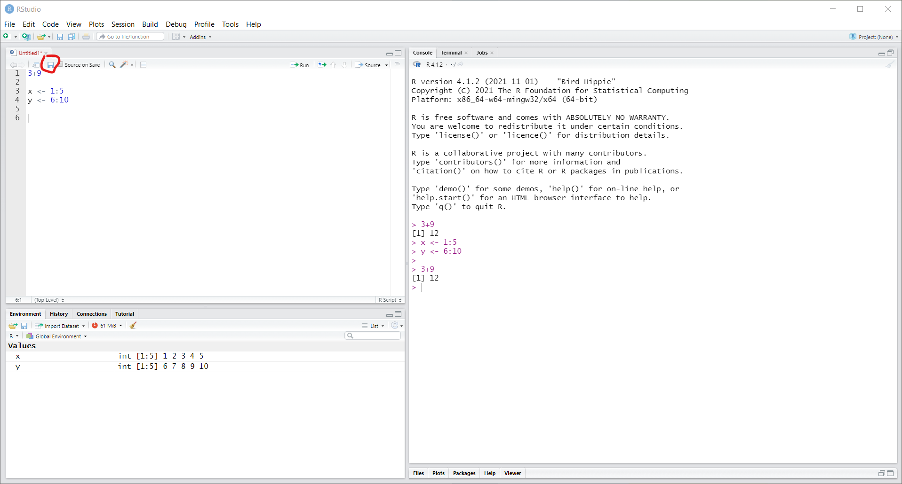
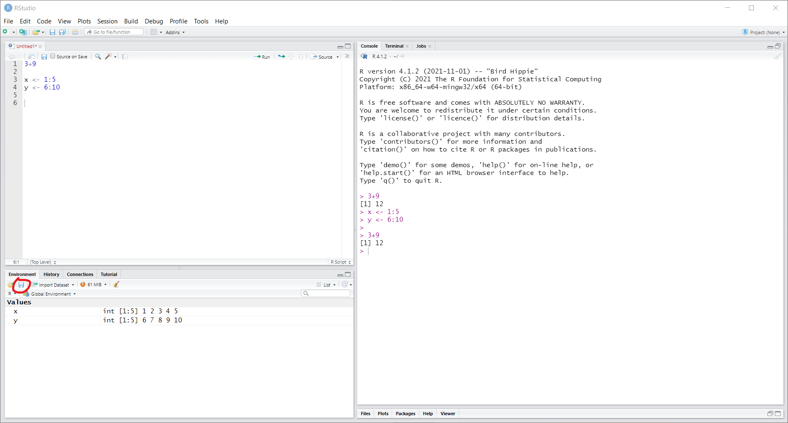

# Introduction

## Using RStudio

Once you have installed R and RStudio, you can start by launching RStudio.
If everything was installed correctly, RStudio will automatically launch R as well.
The first time you open RStudio, you will likely see three separate windows.
The first thing you want to do is open an R Script to work in.
To do so, go to the toolbar and select File -\> New File -\> R Script.

You will now see four windows split evenly over the four corners of your screen:

-   You have the text editor for the file that you are working in. This will most of the time be an R script (syntax).
-   Can see the data and values that you are currently working with (environment) or view your history of input.
-   Have the console, which is where you can enter and run code, and view the output. If you run code from your R script, it will also be executed in this console.
-   Can browse through files on your computer, view help for functions, or view visualizations.

While you can directly enter code into your console, you should always work with R scripts.
This allows you to keep track of what you are doing and save every step.
Furthermore, this allows transparency and reproducibility of your work.

## Running code from the R script

Type the example code in the gray boxes into your R Script.
Run the code and you should get the output shown in the **output** boxes that start with ``##`` .

```{r, eval=T}
3 + 3
2 * 5
(6 / 2) * 3
"some text"
"some more text"
sum(1,2,3,4,5)   ## using a function
```

Some kinds of functions return multiple outputs.
The **[1]** next to your output indicates that that is the first (and in this case, only) output.

You can **run** parts of the code in an R script by pressing Ctrl + Enter (on mac this is command + Enter).
This can be done in two ways:

-   If you select a piece of text (so that it is highlighted) you can press Ctrl + Enter to run the selection. For example, select the first three lines (the three mathematical operations) and press Ctrl + Enter.
-   If you haven't made a selection, but your text cursor is in the editor, you can press Ctrl + Enter to run the line where the cursor is at. This will also move the cursor to the next line, so you can *walk* through the code from top to bottom, running each line. Try starting on the first line, and pressing Ctrl + Enter six times, to run each line separately.

You might have noticed that after for the `sum()` in the last example we have added a comment stating that we are using a function.
It is good to know that you can make comments in you code with \# , anything after it will not be run as code, and it is useful to make comments on your code.

You should always add comments your code so you can come back later and know what you were doing.
Something that seems obvious while you are in the middle of working on a project may not be obvious months later if you or a collaborator need to revisit your analysis.

```{r}
## Here I am doing a cool analysis
sum(1,4,6,7,8)
```


## Assigning values to names

Now we can start working in R!
When running the example code, you saw that R automatically **evaluates** expressions.
The calculation 3+3 evaluates to 6, and 2\*5 evaluates to 10.
You also saw that the **function** *sum(1,2,3,4,5)* evaluates to 15 (the sum of the numbers).
For now, one more thing that you need to know about the R syntax is how values can be **assigned** to variables (or objects).

In plain terms, **assignment** is how you make R remember things by assigning them a name.
This works the same way for all sorts of values, from single numbers to entire datasets.
You can choose whether you prefer the equal sign (=) or the arrow (\<-) for assignment; they do exactly the same thing.

```{r, eval=T}
x = 2
y <- "some text"
```

Here we have remembered the number 2 as **x** and the text "some text" as **y**.
If you are working in RStudio (which you should), you can now also see these names and values in the "Environment" tab.

We can now use the names to retrieve the values, or to use these values in new commands.

```{r, eval=T}
x * 5
```

This way with R we can create objects, and then do follow up analysis, plots, etc from these objects.
You can name these objects what you want, but it is important to know that R is case sensitive, and that object names cannot start with a number.

```{r, eval=T}
h <- 5
h ##after we have assigned a value to "h", when we call "h", we get the value we assigned. 
H <- 8
H
h <- 4
h
```

So, here the object **h** is not the same as the object **H**.
Also, when we assign a new value to **h** it overwrites the old value.

# Data types

Data types concern the different types that single values in data can have.
The most basic data types in R are:

-   numeric (numbers)
-   character (text, sometimes also called 'strings')
-   factor (categorical data)
-   logical (True or False)

In addition, there are special types for data such as date/time values.

-   Date (calendar dates) or POSIXlt (calendar dates and times). We will not go over these more advanced data types here, but you should know that they exist within R.

## Numeric

Numbers.
As simple as is gets.
You can use them to do the math you know and love.

```{r, eval=T}
x <- 5     ## assign a number to the name x
class(x)   ## view the class of the value assigned to x
x + 3
x / 2
log(x)     ## logarithm
sqrt(x)    ## square root
```

## Character

Textual data (recognizable by the quotes), either as single characters, entire words, or even full texts.

```{r, eval=T}
x <- "Some text"  ## assign text to the name x
class(x)          ## view the class of the value assigned to x
```

It's important to recognize the distinction between names and character values.
In the above example, x is the name to which the text "some text" has been assigned.
Whether a word is a name or a character value is indicated with quotes.

```{r, eval=T}
x       ## get value assigned to the name x
"x"     ## the text "x"
```

Naturally, you cannot perform math with character data.
Using the wrong data type will generally yield an error.
Run the code below and see what happens.

```{r, eval=F}
x <- "x"
sum(x)
```

It's import to recognize these types of errors, because they are terribly common.
You might have imported data in which a column that's supposed to contain numbers accidentally contains a word, in which case R will consider the column to be column of character values.

Note that you can express a number as a character value, e.g., "1", "999", but not a text as a numerical value.
If it is possible to convert a value to a different type, you can do so with the **as** method:

```{r, eval=T}
x <- "999"
x <- as.numeric(x)     ## converts character to numeric
x
y <- 999
y <- as.character(y)   ## converts numeric to character
y                      ##you will note that the character comes back in quotation marks. 
z <- "nein nein nein"
z <- as.numeric(z)     ## tries to convert character to numeric, but fails 
z
```

# Data structures

In SPSS, Excel or Google Sheets, data is always organized in a rectangular data frame, with cells arranged in rows and columns.
Typically, the rows then represent cases (e.g., respondents, participants, newspaper articles) and columns represent different aspects of each case (e.g., age, gender, date, medium).
These different aspects are generally called **variables**.
For most analyses, this is also the recommended data format in R, using the *data.frame* structure.
However, an important difference is that in R it is possible, and often useful, to combine different formats.
Also, to understand how a *data.frame* in R works, it is useful to understand that a *data.frame* is a collection of *vectors*, and thus it is useful to first understand how *vectors* work.

Here we will first briefly discuss *vectors*, and then quickly move on to *data.frames*.
In addition, we will mention *matrices* and *lists* on a good-to-know-about basis.

## Vector

The concept of a vector might be confusing from a social science background, because we rarely use the term in the context of statistics (well, not consciously at least).
We won't address why R calls them vectors and how this relates to vector algebra, but only how you most commonly use them.

A vector in R is a **sequence** of **one or more values** of the **same data type** From a social science background, it is very similar to what we often call a **variable**.

You can declare a vector in R with `c(...)`, where between the parentheses you enter the elements (or values), separated with commas.
This is the concatenate function.
The number of elements is called the length of the vector.
A vector can have any of the data types discussed above (numeric, character, factor, logical, Date).

```{r, eval=T}
name <- c("John", "Thijs", "Kate")   ## a character vector of length 3
age <- c(1, 2, 34, 15)    ## a numeric vector of length 4
grade <- 1:10               ## a numeric vector of length 10 with the values 1 to 10.
## 1:10 is a fast way of writing "integers 1-10". 
```

If you combine data types in the same vector, R will generally use the broadest data type for the entire vector.
For example, we saw earlier that a number can be expressed as a character value, but a text cannot be expressed as a numerical.
Accordingly, if we combine both types in a vector, R will convert the numerical values to character values.

```{r, eval=T}
c(1, 2, "c")            ## becomes a character vector of length 3
```

Since vectors can only have one type, we can perform type specific operations with them.
In many ways, we can work with them in the same way as we can work with single values.
In fact, single values are actually just vectors of length 1.
For example, if we have a vector of numeric type, also called a numeric vector, we can perform calculations.

```{r, eval=T}
x <- c( 1, 2, 3, 4, 5)
y <- c(10,20,30,40,50)
x + y     ## for 2 vectors of same size calculations are pairwise (1 + 10, 2 + 20, etc.)
x + 10    ## for a vector and single value, the value is repeated (1 + 10, 2 + 10, etc.)
```

### Selecting elements

There are two common ways to select a specific element or a range of elements from a vector.
One is to give the indices (positions) of the elements in square brackets after the vector name.
Note that the indices themselves are given as a numeric vector.

```{r, eval=T}
x <- c('a','b','c','d','e','f','g')  
x[5]            ## select the fifth element
x[c(1,3)]       ## select the first and third elements
x[2:5]          ## select elements two to five
```

If you select with indices, the specific order of the indices is used, and you can also repeat indices.
This can for instance be used to sort data.

```{r, eval=T}
x[5:1]          ## select elements in positions 5 to 1
x[c(5,5,5)]     ## select the element in position 5 multiple times
```

You can also use negative indices to select everything except the specified elements.

```{r, eval=T}
x[-5]            ## select every element except the fifth
x[-c(1,3)]       ## select every element other than the first and third
```

## Data.frame

A *data.frame* is essentially a collection of vectors with the same length (rows), tied together as columns.
That is, it creates something like an Excel/Google Sheets spreadsheet.
To create the *data.frame*, we use the `data.frame()` function.
We enter the vectors in the format: `column_name = vector`.
Here we create a *data.frame* for data from a fictional experiment.

```{r, results=T, eval=T}
d <- data.frame(id =        1:10,
                condition = c('E', 'E', 'C', 'C', 'C', 'E', 'E', 'E', 'C', 'C'),
                gender =    c('M', 'M', 'F', 'M', 'F', 'F', 'F', 'M', 'M', 'F'),
                age =       c( 17,  19,  22,  18,  16,  21,  18,  17,  26,  18),
                score_t1 =  c(8.0, 6.0, 7.5, 6.8, 8.0, 6.4, 6.0, 3.2, 7.3, 6.8),
                score_t2 =  c(8.3, 6.4, 7.7, 6.3, 7.5, 6.4, 6.2, 3.6, 7.0, 6.5))
d
```

Now, the data structure clearly implies that there is a relation between the elements in the *column vectors*.
In other words, that each row represents a *case*.
In our example, these cases are participants, and the columns represent:

-   the participant **id**.
-   the experimental **condition** (E = experimental condition, C = control group)
-   demographic variables: **gender** and **age**.
-   test scores before and after the experimental condition: **score_t1** and **score_t2**

### Selecting rows, columns and elements

Since data.frames have both rows and columns, we need to use both a row number and a column number to select data.
Similar to selection in vectors, we use the square brackets.
The difference is that for data.frames the square brackets have two parts, separated by a comma.
Assuming our data.frame is called `d`, we can select with:

| syntax | meaning                                  |
|--------|------------------------------------------|
| d[i,j] | select rows (i) and columns (j)          |
| d[i, ] | select only rows (i) and use all columns |
| d[ ,j] | select only columns (j) and use all rows |

Selection for rows (i) and columns (j) works identical to selection in vectors.
You can use either a numeric vector with indices, or a logical vector.
Accordingly, you can also use comparisons.

In addition, there are two special ways to select columns.
One is that j can be a character vector with column names.
The other uses the dollar sign (\$).

| syntax             | meaning                                         |
|--------------------|-------------------------------------------------|
| d[ ,c("c1", "c2")] | select the columns with the names "c1" and "c2" |
| d\$id              | select the column named id, all rows            |

#### selecting columns

Let's put this to practice, starting with columns:

```{r, eval=T}
## selecting a single column returns a vector
d[,1]             ## select the first column by index 
d[,"id"]          ## select the id column by name
d$id              ## select the id column using the dollar sign
## selecting multiple columns returns a data.frame
d[,1:2]           ## select the first two columns by indices
d[,c("id","age")] ## select the "id" and "age" columns by name
d[,-1]            ## select every column except for the first  
```

#### selecting rows

Selecting rows is practically identical to selecting elements from vectors, and it conveniently returns a data.frame with all columns and their matched positions intact.

```{r}
d[1:5,]    ## select first 5 rows
```

A very useful additional trick is that you can use all the columns to make comparisons.
For example, we can use the gender column to look up all elements for which the value is "M" (male), and use this to select rows.

```{r}
d[d$gender == "M", ]       
```

You can combine this with the logical operators to make a selection using multiple columns.
Logical operators are explained in detail at the bottom of this document.
For now, you only need to understand that we can use the **&** (AND) operator to say that we want two comparisons to be TRUE (d\$gender == "F" AND d\$age == 21).

```{r}
d[d$gender == "F" & d$age == 21, ]    ## 21 year old female participant(s)
d[d$score_t1 < d$score_t2,]           ## selects participants that have a higher score in time t2 than in t1
```

#### selecting rows and columns

We can combine row and column selection.
This works just like you'd expect it to, so there's little to add here.
Do note, however, that you can combine the different selection methods.

```{r, eval=T}
d[d$gender == "F", "score_t1"]    ## get the score_t1 column for female participants
d[d$gender == "F",]$score_t1      ## identical, but first subset data.frame, then select column
d$score_t1[d$gender == "F"]       ## identical, but first select column vector, then subset vector
```

### Subsetting, adding and modifying data

*Exercise 1:* With the selection techniques you already learned how to create a subset of the data.
Try to subset the data so that only participants in the condition "E" are included.
Assign this subset to a new name.
Create a second subset in which only the variables *id*, *gender*, and *age* are included.
Assign this subset to a different name.

```{r}
# Subset of experimental group
d_experimental <- d[d$condition == "E",]
d_experimental
# Subset with socio-demographics variables
d_sociodem <- d[, c("id", "age", "gender")]
d_sociodem <- d[, c(1, 3, 4)]         ## alternative using position
d_sociodem
```

## Other common data structures

A data frame is a special case of the data structures **arrays**, which are dimensional structures for vectors.
So, a data frame is a 2 dimensional array (rows, columns), and these can be extended for 3, 4 ..
dimensional arrays.
This allows it work with complex data structures, but less common.
These types won't be covered here.
There are other data structures, such as the `matrix` and `list`.
Packages can also provide new classes for organizing and manipulating data.
These are more advanced topics.

# Importing and saving data

Of course, we can also save a data.frame in our computer.
We therefore can use a variety of formats (e.g., .RData, .csv...).
When saving, it is always important to understand *where* we are saving file to.
Each R sessions is connected to a particular folder on your computer.
We can check where we are by using the function `getwd()` which stands for "get the current working directory".
This resulting path is where the data will be stored.

```{r, eval = F}
# Where are we currently on our computer?
getwd()
# Save and load an RData file
save(d, file = "test_data.RData")   ## d=data frame we want to save; file = file and/or connection to write to
load(file = "test_data.RData")
# Save and load a csv file
write.csv(d, file = "test_data.csv")
d2 <- read.csv(file = "test_data.csv", )
d2
```

Data can also be download directly from websites.
Yet, you can also download the data, store it in some readable format (most preferably a csv-file) and than load it manually.
Other tutorials will cover how to import data sets from different formats.

# Functions

Where data types and structures concern how data is represented in R, functions are the tools that you use to read, create, manage, manipulate, analyze and visualize data.
We have already seen some examples such as `sum()`, the sum function and `c()`, the concatenate function.

## What is a function?

There are many correct and formal ways to define what functions are, but for the sake of simplicity we will focus on an informal description of how you can think of functions in R:

-   A function has the form: `output <- function_name(argument1, argument2, ...)`
    -   **function_name** is a name to indicate which function you want to use. It is followed by parentheses.
    -   **arguments** are the input of the function, and are inserted within the parentheses. Arguments can be any R object, such as numbers, strings, vectors and data.frames. Multiple arguments can be given, separated by commas.
    -   **output** is anything that is returned by the function, such as vectors, data.frames or the results of a statistical analysis. Some functions do not have output, but produce a visualization or write data to disk.
-   The purpose of a function is to make it easy to perform a (large) set of (complex) operations. This is crucial, because
    -   It makes code easier to understand. You don't need to see the operations, just the name of the function that performs them
    -   You don't need to understand the operations, just how to use the function

For example, say that you need to calculate the square root of a number.
This is a very common thing to do in statistical analysis, but it actually requires a quite complicated set of operations to perform.
This is when you want to use a function, in this case the `sqrt` (square root) function.

```{r}
sqrt(5)
```

In this example, the function name is `sqrt`.
The input is the single argument `5`.
If you run this code, it produces the output `2.236068`.
Currently, R will simply print this output in your Console, but as you learned before, we can assign this output to a name.

```{r}
square_root_5 <- sqrt(5)
square_root_5
```

This simple process of input -\> function -\> output is essentially how you work with R most of the times.
You have data in some form.
You provide this data as input to a function, and R generates output.
You can assign the output to a name to use it in the next steps, or the output is a table with results or a visualization that you want to interpret.

## Using functions

Above you saw the simple function `sqrt()`, that given a single number as input returned a single number as output.
As you have also seen in the first week, functions can have multiple arguments as input.
Consider this function here:

```{r, eval=T}
mean(x = c(1, 2, NA, 1, 2, 5), na.rm = TRUE)
mean(x = c(1, 2, NA, 1, 2, 5), na.rm = FALSE)
```

This function, with the name `mean`, is given several arguments here: `x` and `na.rm`.
Given this input, many operations are performed behind the scenes to create the arithmetic mean of the vector.
We see the effect of the `na.rm` argument, when `TRUE` it will calculate the mean ignoring any missing data (`NA`), and when `FALSE` it will include the missing value in the calculation, returning a missing value.

By now we hope you have realized just how broad the use of functions is.
The *R syntax* for performing basic mathematical operations such as `sqrt()` is essentially the same as the syntax for creating a mean, performing advances statistical analysis or creating powerful visualizations.
Accordingly, if you understand this syntax, you can do almost anything in R.

The many R packages that you can install are mostly just collections of functions.
We will now show how you can learn how to use each function by knowing how to view and interpret it's documentation page.

### Viewing and interpreting function documentation

You can access the documentation of a function by typing a question mark in front of the function name, and running the line of code.
Let's do this to view the documentation of the `sqrt()` function

```{r, eval=F}
?sqrt
```

If you run this in RStudio, the help page will pop-up in the bottom-right corner, under the *Help* tab page.
Sometimes, if the name of a documentation page is used in multiple packages, you will first receive a list of these packages from which you will have to select the page.

For the `sqrt()` function, the help page has the **title** "Miscellaneous Mathematical Functions".
Just below the title, you see the **Description**, in which the author of a function briefly describes what the function is for.
Here we see that there are two functions that are grouped under "Miscellaneous Mathematical Functions", the `abs()` function for computing the absolute value of a number `x`, and the `sqrt()` function for the square root.

Under description, the **Usage** is shown.
This is simply the name of the function or functions, and the possible arguments that you can use.
Here the Usage is extremely simple: both functions only take one argument named `x`.

Below usage, the **Arguments** section explains how to use each argument.
Here, the only argument is `x`, and it is explained that x is "a numeric or complex vector or array".
For now, let's focus only on the case of a numeric vector.
It appears that in addition to giving a single value like above (recall that in R this is actually a vector of length 1) we can give a vector with multiple numbers.

```{r}
sqrt(c(1,2,3,4,5))
```

There are more parts to the documentation that we'll ignore for now.
Notable parts to look into for yourself are **Details**, that provides more information, and the **Examples** section at the very bottom, which is a great starting point to see a function in action.

# Packages

As we mentioned before, **packages** are collections of functions that are designed for some specific purpose.
These are developed by people all over the world, and made available online.
Since there are thousands of packages, when you first install R it only includes the *basic* packages.
When you want to, you can install the packages, this has to be done only once per computer.

## Install and load packages

There are several ways you can install packages, in RStudio you can to th lower-left pane, and the *Packages* tab.
Click the **Install** button, in the following window you can type the name of the package you want to install and when ready click the **Install** button.
It's important to make sure to mark the box `Install dependencies`; this is a required step and will install any other package that a package requires to work.

The second method is through syntax, the function is **install.packages()**, and we are using 2 arguments, the first is the name of the package you want to install, and the second is the one specifying to also install the dependency packages.

```{r, eval=F}
install.packages("car", dep=TRUE)
```

For this example, we are installing the `car` package, and the respective dependencies.
Now that we have installed it, we still can't use its functions.
Before using its functions we need to `load` it with the **library()** function.
Once we load the package we have access to the package functions, this needs to be done every time you open R and need the package.

```{r}
library(car)
```

Once we have loaded the packages `car` we can access its functions.
For example, we can use the `recode()` function, which lets use change values from a vector to other values (e.g. recoding "Male" and "Female" to "M" and "F".

```{r}
x <- 1:3
x
x2 <- recode(x, "1=3;2=2;3=1")
x2
```

Another step related to packages is that we need to **update** them regularly.
As developers improve and fix bugs every so often, we need to update the packages to obtain the latest versions.
We recommend to check for update at least once a month.
You can do this in two ways

-   First with the RStudio interface. On the bottom left pane, on the **Packages** tab, click on the update button. This will open a window, showing which packages have newer versions available, then click **Select all** and **Install Updates**
-   Second by using the R syntax as shown below, by including the argument `ask=FALSE`, it will automatically installed all available updates.

```{r, eval=F}
update.packages(ask=FALSE, checkBuilt=T)
```

## Some error messages

A common error when working with packages is is to try to load a packages that has not been installed yet, this give us a useful error message

```{r, error=T}
library(tidyLPA)
```

Here we see a clear error, R saying that it cannot load the package `tidyLPA` because there is no such package installed.
O, if you see this error you need to first install it.

Another common error is when you try to use a function from a package that has not been loaded with `library()` ahead of time

```{r, error=T}
qplot(rnorm(1000))
```

Here we get a clear message that R does not recognize the function qplot, as we have not loaded the respective package `ggplot2` in this example.

# Working directory

The working directory is the folder in your computer from which R will look for and write files into directly.
You can set the working directory to any folder in your computer.
We recommend you to have it explicitly for each R syntax file, this way every time you start the syntax again.

You can first see what is your working directoyr with

```{r, eval=F}
getwd()
```

There are two ways to set your working directory \* First, with the RStudio interface.
On the top bar menu Session -\> Set Working Directory -\> Choose Directory.
This will open a window for you to select the folder you want to.
You will see that these steps will prompt a syntax run in the console.
We recommend you to copy this line and past it in your syntax so you can re-run it next time you open your syntax \* Second, we can use the syntax directly, with the setwd() function, you can copy the direction of the folder and paste it into the function.
Make sure this is between quotes, and the slash is in this direction /

```{r, eval=F}
setwd("C:/Users/Admin/Downloads")
```

# Save syntax and workspace

As we have shown there are two pieces of information we would want to save, the syntax and workspace.
From the RStudio interface we can save both of them, for the syntax you will use the save icon in the syntax pane



This will open a window for you to name the file.
This will be a file with the extension `.R`

And for saving the workspace, we will use the save icon from the Environment pane



From here you can give a name to this file.
This will be a file with the extension `.RData.`

In general, you always want to save the syntax, as this is the reproducible base of your analysis.
At any point you can open the syntax and re-run all the analysis and obtain the same results.
We recommend to save the workspace only when the results of the project are final and/or re-running the synatx takes long so you dont want to do this every time you open the syntax again.
