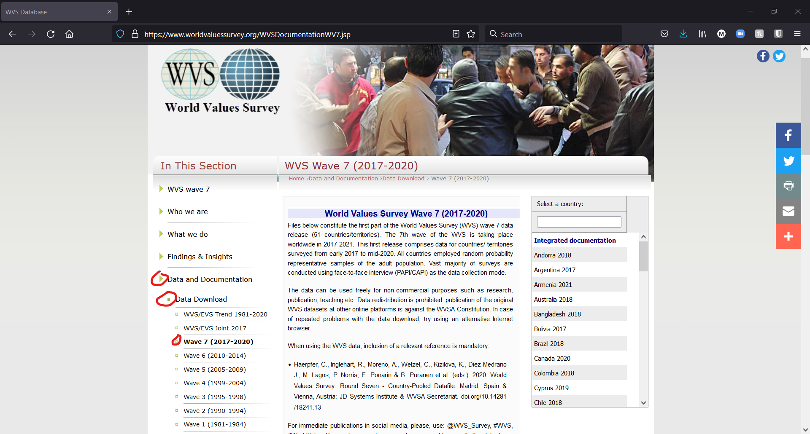
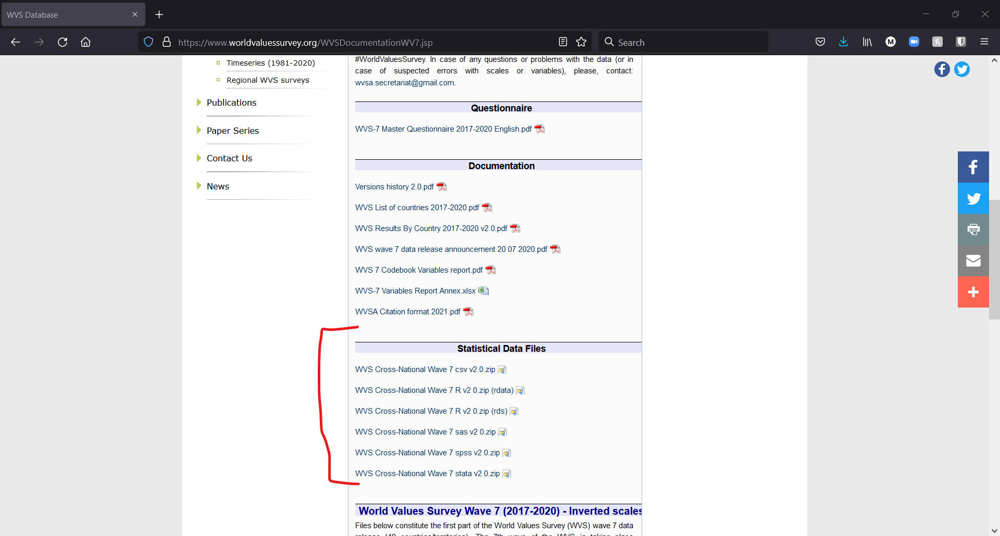
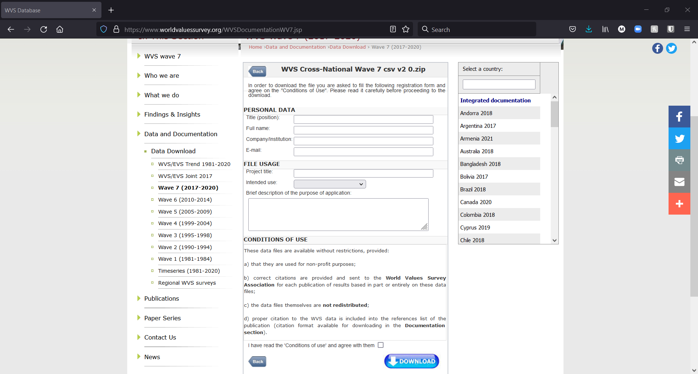

For the following tutorials, we want to use a data set that provides meaningful data for many different types of analyses. For this we will use the [World Values Survey (WVS)](https://www.worldvaluessurvey.org/) data set. As stated on the website, the WVS is currently "the largest non-commercial cross-national empirical time-series investigation of human beliefs and values ever executed". The WVS covers a broad range of topics that are relevant to many disciplines within the social sciences, such as Sociology, Political Science, International Relations, Economics, Public Health, Demography, Anthropology, and Social Psychology. Another strength of the WVS is the broad coverage of countries around the world. The WVS will be used throughout the following tutorials. It is therefore a good idea to download the data set before continuing with the tutorials.

TO download the WVS data, visitthe [WVS website](https://www.worldvaluessurvey.org/), then go to the Data and Documentation -> Data Download -> Wave 7 (2017-2020) tab from the menu on the left (see the screenshot below). 

As mentioned on this page, you need to cite the data set when your are publishing analyses based on the WVS data. The relevant citation is:

*Haerpfer, C., Inglehart, R., Moreno, A., Welzel, C., Kizilova, K., Diez-Medrano J., M. Lagos, P. Norris, E. Ponarin & B. Puranen et al. (eds.). 2020. World Values Survey: Round Seven - Country-Pooled Datafile. Madrid, Spain & Vienna, Austria: JD Systems Institute & WVSA Secretariat. doi.org/10.14281/18241.13*

Here, you can also find more documentation like the full *Questionnaire* and additional *Documentation*. Finally we see that the WVS data set is provided in several data formats, like `csv`, `R`, `SAS`, `STATA`, and `SPSS`. 

Next, you can choose which data format you want to download. In general terms, we suggest to export and share data in a text format (e.g., the `csv` format, more on this in the following tutorial), as these ones are easier to open and share across platforms (Linux, Mac, Windows) and between different software programs. In the following screen, you will be asked to share information on yourself and intended data usage. These questions allow the WVS team to keep track of who is using the data set. Under "FILE USAGE", you can select "instruction" and state that you will be using the data set for a university course.

Once you provided the information and accept the conditions of use you can download the data set. The data set will be downloaded as a `.zip` file. By extracting the `.zip` file (for example using 7-Zip) you will get the file in the format that you selected for download on the website. Next, move the file to the folder you want to work in. In the next steps we will look at how to import data in different formats into **R**.

