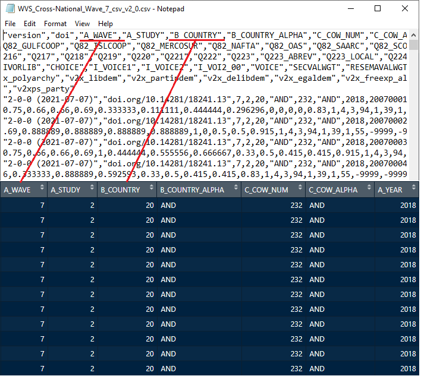

# Intoduction to data formats

In this tutorial, we will cover several ways to import data sets in R. An **advantage** of programs like R is that **you can do the same thing in different ways**. But specially when you are learning it, a **disadvantage** is that **you can do the same thing in different ways**. Which can be confusing, we know. Here, we will present several different ways of importing data, including the `import()` function from the `rio` package, which we will use throughout the remaining tutorials. But if you find that another way feels more comfortable for you, go for it. 

A common characteristic across the different methods is that all the data sets are located in the folder that is **set as working directory**. But if you have them in another folder we will also show how to set the file path. 

Not every data set is the same. Depending on the format, a data set can be a *simpler* or more *complex* format to import and work with. Data can be shared in many format. The simpler ones are text types (like `.csv`, `.txt`), and more complex formats are the ones that are software specific (like `.sav` from `SPSS` and `.dta` from `Stata`). The text types only have the data set in a simple structure, like values separated by commas (`.csv` = comma-separated values) or values separated by blank spaces or tabs (`.txt`). The software data types, in contrast, include the data, and a series of code that defines the specific software structure behind it. 

In general terms, we suggest to export and share data in a text format, as these ones are easier to open and share across platforms and software programs. 

Different data formats require specific methods to import them into **R**. Therefore, it is important to be aware of the format that your data is saved in. The easiest way to figure that out is to look at the file extension of your data file. For example, The `.csv` extension of the `data_set.csv` file shows that this file is saved in the comma-separated values (`csv`) format. A problem is that most computers will hide the file extensions by default, but you easily look up it up online how to show the file extensions in your operating system. 

Below, we show you how to import data sets in different formats into **R**. We will use the different data formats in which the [World Value Survey (WVS)](https://www.worldvaluessurvey.org/) can be downloaded. These include the most common formats you will encounter, namely `text (.csv)`, `SPSS (.sav)`, `SAS (.sas7bdat)`, and `Stata (.dta)`. The data sharing rules of the WVS forbid us to upload the data, but you can simply download it from the [WVS website](https://www.worldvaluessurvey.org/). Tutorial 3.1 shows you how to do this.

# Base R
*Base R* can only import files in text format. With *Base R* we mean the basic functionality of the **R** programming language. For these approaches, you do not need to install and load (`library()`) external packages. 

## Text files
There are two functions to import text files in *Base R*. The first one is a general function that can import a variety of text formats:

```{r, eval=T}
dat <- read.table("WVS_Cross-National_Wave_7_csv_v2_0.csv", sep= ",", header=TRUE, na.strings = c("-999", "-9999"))
dim(dat)
is(dat)
```

Here, we are using the `read.table()` function, which can read most text formats. The first argument we provide to the function is the file name (between quotes). For now, we assume that the data file you want to import is in the working directory so that we do not need to specify the full file path (more on that under 'File path' below). The second argument defines the type of text file it is. `sep=` defines what type of value/character separates values. In this case, `sep=","` indicates that the file is comma-separated (values in the data are simply separated by commas in the text files). The next argument is `header=TRUE`, which is telling R that the first row of the data set has the variable names. For example, in the screenshot below we can see that *A_WAVE* and *B_COUNTRY* are read in as names of variables instead of values in the data. If you specify `header=FALSE` it will read the first row as values from the data set. The last argument we are using is `na.strings=`, here we are specifying what values in the data set will be read as missing data (`NA`) instead of observed data, in this case we are saying that anytime we see `-999` or `-9999` R will recode that into a missing data code `NA`. 
<center>

{width=70%}

<center>

In the next line we are using the function `dim()` to see the size of each dimension of the data set. As this is a rectangular data set it has 2 dimensions, and the `dim()` function tells us that the data set has 76897 rows (subjects) and 548 columns (variables). Notice that the order in R will always be `rows/columns`. Lastly, we are using the function `is()` to ask R what type of object the imported data set now is in R. In this case, it is imported as a `data.frame`. 

The second method to import text files is using the `read.csv()` function, this is basically the same as the previous one, just that by default has `sep=","`. So when we are importing comma separated values data sets it requires one less argument. 

```{r, eval=T}
dat <- read.csv("WVS_Cross-National_Wave_7_csv_v2_0.csv", header=TRUE, na.strings = c("-999", "-9999"))
dim(dat)
is(dat)
```

Then we see that `dim()` and `is()` function give us the same results as before


# `foreign` package
We saw that with the base R functions we can only import text files. In many scenarios, however, you will have the data sets in another format and we will need to use additional packages to import data in these formats in to R. Here, we will see how to use the package `foreign` to import some of these data formats. First, we need to install and load the `foreign` package. You can read more on how to install packages in tutorial 2 *R basics: Getting started*. We use `library(foreign)` to load the package.

```{r, eval=T}
library(foreign)
```


## SPSS
Let's start with one of the most commonly used ones, the `.sav` format used by `SPSS`. For this we will use the `read.spss()` function. 

```{r, eval=T}
dat <- read.spss("WVS_Cross-National_Wave_7_sav_v2_0.sav", to.data.frame = TRUE, use.value.labels = FALSE)
dim(dat)
is(dat)
```

We are now seeing commonalities in how these functions work, the first argument is always the file name, and more specific arguments follow after that. We are adding the argument `to.data.frame=TRUE` so that data is imported as a data.frame object instead of a list. And we specify `use.value.labels=FALSE` so that the data is imported as the values (numbers) instead of the labels that are used in some programs to specify what each value means (e.g., likert type items in SPSS). Notice that we did not specify any missing data codes, this is because the function automatically reads the missing codes from SPSS. Using `dim` we see that the data has the same number of rows and columns as before, and `is()` tells us that the object type is `data.frame`. 

An advantage of using a data format other than text is that the file includes additional information. For example we see the details about each variable with the strcuture fuction `str()`

```{r, eval=F}
str(dat)
```

The output of this function is too long to show here but you can try for yourself. `str()` shows the data type of each each variable (e.g., integer or character, see tutorial 2), and the values it takes. The `attributes()` function shows additional information read from the variable information in SPSS. 

```{r, eval=T}
attributes(dat$Q60)
```
In this case, we ask for the attributes of the variable `Q60`, which shows for example the variable label *Trust: People you know personally*, the values the variable takes, and corresponding value labels that were specified in SPSS. 


## Stata
Lets see the differences for importing an Stata file. 

```{r, eval=T}
dat <- read.dta("WVS_Cross-National_Wave_7_stata_v2_0.dta", convert.factors = FALSE, missing.type = TRUE)
dim(dat)
is(dat)
```

We see that for `.dta` data sets, we need specify the file name for the `read.dta()` function, the argument `convert.factors=FALSE` makes sure that we import the numerical value instead of the value labels for each item, and the last argument `missing.type=TRUE` have it save any information related to missing values. And we can see that the number of rows and columns, and object types are the same as the previous methods. 

```{r, eval=T}
attributes(dat$Q60)
```

A differences when importing the SPSS data, we see that the imported data.frame does not keep the value labels attributes for the likert items. 


# `haven` package
For the following example we will use the `haven` package. `haven` is part of the `tidyverse`, which is a collection of R packages designed for data science. First, we need to load the package using `library()`, and we can then import the different file types.

```{r, eval=T}
library(haven)
```


## SPSS


```{r, eval=T}
dat <- read_sav("WVS_Cross-National_Wave_7_sav_v2_0.sav")
dim(dat)
is(dat)
```

We see that the `read_sav` works generally well with only specifying the file name, and the defaults in the other arguments. We see the number of rows and columns is the same as the previous examples. But a difference is that is imported data set is a tibble table (`tbl_df`) first instead of a data.frame. This is a variant of the data objects, part of the `tidyverse`. 

```{r, eval=T}
attributes(dat$Q60)
```

When we look at the saved attributes, we see that haven saves more attributes information for item `Q60`, even presenting the item label. 


## Stata
Now we will see how to import an Stata file with the `haven` functions. We just need to switch to the `read_stata()` function. 

```{r, eval=T}
dat <- read_stata("WVS_Cross-National_Wave_7_stata_v2_0.dta")
dim(dat)
is(dat)
```

We see that the functionality is the same as with the `read_sav` function, we will use the defaults and specify the file name. 


```{r, eval=T}
attributes(dat$Q60)
```

As with the SPSS file, `haven` keeps plenty of information for each item in the respective attributes. 

## SAS
With a SAS data file, we use the same format but with the respective function `read_sas()`. The same as the other `haven` functions, we recommend to use the other defaults, and specify the file name. 

```{r, eval=T}
dat <- read_sas("WVS_CrossNat_W7_v2_0.sas7bdat")
dim(dat)
is(dat)
```

When looking at the saved attributes, we see that from the SAS file, we are only saving the item label, but not the value labels

```{r, eval=T}
attributes(dat$Q60)
```


# `rio` package
This package is designed to make data importing, exporting as user friendly as possible, deciding which functions is best to import depending on the file type. So the user only needs to know one function that works with many file types. As always, we need to start by loading the package, assuming that it is already installed.

```{r, eval=T}
library(rio)
```

As stated on its [support page](https://cran.r-project.org/web/packages/rio/vignettes/rio.html) the `rio` package supports a variety of file formats for import and export. To keep the package slim, non-essential formats are not installed (or loaded) by default. To ensure `rio` is fully functional, install these packages the first time you use rio via:

```{r, eval=F}
install_formats()
```

`rio` does not include all these formats to keep the package light by default.


## Text files
Now, lets see how to import the text file, we will use the swiss-knife import function. This function doesn't actually imports the file, it identifies the file format, and chooses the function from another package to import it. You can see the packages used to import each file format with  

```{r, eval=F}
?import
```

```{r, eval=T}
dat <- import("WVS_Cross-National_Wave_7_csv_v2_0.csv",na.strings = c("-999", "-9999"))
dim(dat)
is(dat)
```

Here, we need to specify the file name, and possible missing value codes. As the text file has no additional information, it keeps no information in the variable attributes

```{r, eval=T}
attributes(dat$Q60)
```

## SPSS
As the `import()` function does the decisions for us, we just need to give it the new file names, and it will pick the respective package. 

```{r, eval=T}
dat <- import("WVS_Cross-National_Wave_7_sav_v2_0.sav")
dim(dat)
is(dat)
```

By default, it is using the function from the `haven` package, which will keep the additional attribute information from the original data file

```{r, eval=T}
attributes(dat$Q60)
```


## SAS
Again, we just need to give the new file name to the `import()` function and it will pick the respective package for the import of files in the `SAS` format. 

```{r, eval=T}
dat <- import("WVS_CrossNat_W7_v2_0.sas7bdat")
dim(dat)
is(dat)
```

As previous SAS imported files, the data.frame does not keep additional information in the variable attributes, only the item label

```{r, eval=T}
attributes(dat$Q60)
```


## Stata
Finally, the same goes for the Stata files in the `.dta` format. Simply use the `import()` function which will choose the right package and function to import the data in the background.

```{r, eval=T}
dat <- import("WVS_Cross-National_Wave_7_stata_v2_0.dta")
dim(dat)
is(dat)
```

As it is using the `haven` functions, we keep the same information in the variable attributes

```{r, eval=T}
attributes(dat$Q60)
```


# Additional information
In the previous examples, we have use defaults that work well for general use cases. Here we present a few uses and cases you might ran into

## Need more detail about the functions
So far in our examples we used the defaults or minimal number of arguments for each function. You might run into a case that requires to manipulate the functions further. When this comes to be, go to the help page of a specific function to identify the detail on how it works, and other arguments on how to modify how it works

```{r,eval=F}
## for example
?import
```


## File path
In the previous examples we assumed that the data file you want to import was in the working directory. If that is not the case, you can still import the file, but just requires to specify the full path for the file location, like this

```{r eval=FALSE}
dat <- import("C:/Users/Admin/Dropbox/Magic Briefcase/Vrije/R_tutorials/git/WVS_Cross-National_Wave_7_sav_v2_0.sav")
dim(dat)
is(dat)
```

Here is important to make sure the slash is this direction \/, some operating system tend to change the direction on the file manager. 

## `choose.file()`
So far we have used the import functions with the full file name (or path), but some people don't like this or are too use to browsing for a file. We can do this if we change the file name and ask R to search for a file in the browser

```{r eval=FALSE}
### WVS_Cross-National_Wave_7_sav_v2_0.sav
dat <- import(file.choose())
dim(dat)
is(dat)
```

When using the `file.choose()` function instead of the file name, R will open a browse window where you can look for the respective file in your computer. If you choose to use this approach, we strongly recommend to add the file name, or some identifier for the imported file. This is so we can keep track of which data set was imported for the future and reproducibility. 

## General recommendations
Finally, after seeing all of these different ways to do the same thing, what are the final takeaways? Our recommendations for general practice, which should work in most scenarios, are:

* Use the `import()` function from the `rio` package, this works well for most common data types, and it is user friendly. 
* Save the data sets in the working directory folder, for facility to have all files for a respective analysis in a single place.
* Specify the full file name in the functions reading in the data. This would give us more tractability of the data analysis process and ease to reproduce it. 

