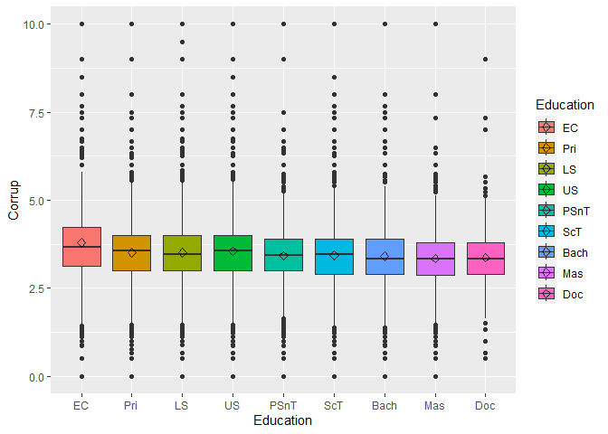

Basic plots
================
Mauricio Garnier-Villarreal, Joris M. Schröder & Joseph Charles Van
Matre
01 September, 2022

-   <a href="#setup-the-r-session" id="toc-setup-the-r-session">Setup the R
    session</a>
-   <a href="#import-the-data-set" id="toc-import-the-data-set">Import the
    data set</a>
    -   <a href="#select-variables-of-interest"
        id="toc-select-variables-of-interest">Select variables of interest</a>
-   <a href="#ggplot2-basics" id="toc-ggplot2-basics"><code>ggplot2</code>
    basics</a>
-   <a href="#histograms" id="toc-histograms">Histograms</a>
    -   <a href="#divide-by-color" id="toc-divide-by-color">Divide by color</a>
    -   <a href="#grid-of-plots" id="toc-grid-of-plots">Grid of plots</a>
    -   <a href="#final-plot" id="toc-final-plot">Final plot</a>
-   <a href="#scatter-plot" id="toc-scatter-plot">Scatter plot</a>
    -   <a href="#prediction-line" id="toc-prediction-line">Prediction line</a>
    -   <a href="#divide-by-color-1" id="toc-divide-by-color-1">Divide by
        color</a>
    -   <a href="#grid-of-plots-1" id="toc-grid-of-plots-1">Grid of plots</a>
    -   <a href="#final-plot-1" id="toc-final-plot-1">Final plot</a>
-   <a href="#bar-plot" id="toc-bar-plot">Bar plot</a>
    -   <a href="#adding-color" id="toc-adding-color">Adding color</a>
    -   <a href="#grid-of-plots-2" id="toc-grid-of-plots-2">Grid of plots</a>
-   <a href="#box-plot" id="toc-box-plot">Box plot</a>
    -   <a href="#by-category" id="toc-by-category">By category</a>
    -   <a href="#add-statistic" id="toc-add-statistic">Add statistic</a>
    -   <a href="#grid-of-plots-3" id="toc-grid-of-plots-3">Grid of plots</a>
    -   <a href="#final-plot-2" id="toc-final-plot-2">Final plot</a>
-   <a href="#reference" id="toc-reference">Reference</a>

# Setup the R session

When we start an R session we always need to set our working directory.
In this case I am doing that for the folder that holds the downloaded
[World Values Survey (WVS)](https://www.worldvaluessurvey.org/) `SPSS`
data set.

``` r
setwd("~path_to_your_file")
```

The next step for our session will be to load the packages that we will
be using.

``` r
library(rio)
library(ggplot2)
```

# Import the data set

Here we will be importing the `.sav` WVS data set

``` r
dat <- import("WVS_Cross-National_Wave_7_sav_v2_0.sav")
dim(dat)
```

    ## [1] 76897   548

Here we are calling our data set **dat** and asking to see the dimension
of it. We see that the data set has 76897 subjects, and 548 columns.

## Select variables of interest

In cases with large data sets like this we might want to select a subset
of variables that we want to work with. Since it is not easy to see 548
variables.

``` r
vars <- c("Q275", "Q260", "Q262", "Y001", "B_COUNTRY_ALPHA", "SACSECVAL",
          "Q112","Q113","Q114","Q115","Q116","Q117","Q118","Q119","Q120",
          "Q65","Q69","Q71","Q72","Q73")
dat2 <- dat[,vars]
dim(dat2)
```

    ## [1] 76897    20

``` r
head(dat2)
```

    ##   Q275 Q260 Q262 Y001 B_COUNTRY_ALPHA SACSECVAL Q112 Q113 Q114 Q115 Q116 Q117
    ## 1    3    2   60    0             AND  0.287062    2   NA   NA   NA   NA   NA
    ## 2    7    1   47    2             AND  0.467525   10    3    3    3    3    3
    ## 3    7    1   48    4             AND  0.425304    7    2    2    2    2    2
    ## 4    2    2   62    2             AND  0.556170    5    3    3    3    3    2
    ## 5    2    1   49    1             AND  0.458949    5    2    2    2    2    1
    ## 6    1    2   51    3             AND  0.210111    6    2    2    2    2    2
    ##   Q118 Q119 Q120 Q65 Q69 Q71 Q72 Q73
    ## 1    1    2    6  NA   1   1   1   1
    ## 2    1    3    2  NA   3   4   4   4
    ## 3    1    2    7  NA   2   3   3   3
    ## 4    1    4    7  NA   3   3   3   3
    ## 5    1    3    7  NA   2   2   3   2
    ## 6    1    4    2  NA   1   2   2   2

Here we are first creating a vector with the variable names for the ones
we want to keep. You can see all variable names for the full data set as
well:

``` r
colnames(dat)
```

After writing which variables we want to work with, we create a new data
set **dat2** with only these 7 variables, and make sure we did it
correctly by looking at the the dimension of the data **dim(dat2)** and
looking at the first 6 rows of it **head(dat2)**. These are quick checks
that we have done this correctly.

# `ggplot2` basics

We will use the package `ggplot2` for most plots. Lets first go over
some of the basics.

`ggplot2` creates packages in layers. Think about starting with a simple
plot. Once we have a base, we can add layers on top. We will see in our
examples how to start from simple plots and then add complexity.

This makes `ggplot2` able to to manipulate the plot’s features with
great flexibility. We will start simple, but `ggplot2` can do much more
than what we will see here.

# Histograms

Lets start with a basic histogram for the *Secular values* variable in
the data

``` r
attributes(dat2$SACSECVAL)
```

    ## $label
    ## [1] "SACSECVAL.- Welzel Overall Secular Values"
    ## 
    ## $format.spss
    ## [1] "F9.6"
    ## 
    ## $labels
    ## Missing 
    ##     -99

The basic histogram starts with `ggplot()` function, where the first
part `ggplot(dat2, aes(x=SACSECVAL))` creates an empty plot, which will
not print anything until you add some *geom* to it. In this case we are
adding `geom_histogram()`. Think of the first part as telling with which
variables we will work, and second part what to do with those variables

``` r
ggplot(dat2, aes(x=SACSECVAL))+
  geom_histogram()
```

    ## `stat_bin()` using `bins = 30`. Pick better value with `binwidth`.

    ## Warning: Removed 262 rows containing non-finite values (stat_bin).

<!-- -->

The function finds a number of `bins` for the plot, but you can modify
it as you wish, to what you consider looks better in your plot

``` r
ggplot(dat2, aes(x=SACSECVAL))+
  geom_histogram(bins=50)
```

    ## Warning: Removed 262 rows containing non-finite values (stat_bin).

<!-- -->

Similar to a histogram, we can plot the density

``` r
ggplot(dat2, aes(x=SACSECVAL))+
  geom_density()
```

    ## Warning: Removed 262 rows containing non-finite values (stat_density).

<!-- -->

Notice that the histogram shows the count on the *y* axis, while the
density plot shows the *density*.

You can change the color of the columns in the histogram with the `fill`
argument

``` r
ggplot(dat2, aes(x=SACSECVAL))+
  geom_histogram(fill = "steelblue")
```

    ## `stat_bin()` using `bins = 30`. Pick better value with `binwidth`.

    ## Warning: Removed 262 rows containing non-finite values (stat_bin).

<!-- -->

Maybe you want the histogram plot with the density metric. We can do
this by specifying the density as the metric of the *y* axis this way

``` r
ggplot(dat2, aes(x=SACSECVAL))+
  geom_histogram(aes(y = ..density..))
```

    ## `stat_bin()` using `bins = 30`. Pick better value with `binwidth`.

    ## Warning: Removed 262 rows containing non-finite values (stat_bin).

<!-- -->

## Divide by color

We could be interested in seeing the histogram for different groups;
this can be be done by specifying color differences according a one
grouping variable like this:

``` r
ggplot(dat2, aes(x = SACSECVAL, fill = as.factor(Q260) ))+
  geom_histogram()
```

    ## `stat_bin()` using `bins = 30`. Pick better value with `binwidth`.

    ## Warning: Removed 262 rows containing non-finite values (stat_bin).

<!-- -->

Notice that for this to work, R has to know that it is a categorical
variable that is why we are using the `as.factor()` function. Lets do
this after we use the `factor()` function to modify the *sex* variable

``` r
dat2$Sex <- factor(dat2$Q260, 
                       levels = 1:2,
                       labels = c("Male","Female") )
attributes(dat2$Sex)
```

    ## $levels
    ## [1] "Male"   "Female"
    ## 
    ## $class
    ## [1] "factor"

``` r
ggplot(dat2, aes(x = SACSECVAL, fill = Sex ))+
  geom_histogram()
```

    ## `stat_bin()` using `bins = 30`. Pick better value with `binwidth`.

    ## Warning: Removed 262 rows containing non-finite values (stat_bin).

<!-- -->

Now that we have meaningful labels, we can see the histogram for both
male and female subjects. Let’s now look at the plots by the *edcuation*
variable. We modify it with the `factor()` function the same way.

``` r
dat2$Education <- factor(dat2$Q275, 
                       levels = 0:8,
                       labels = c("Early childhood",
                                  "Primary",
                                  "Lower secondary",
                                  "Upper secondary",
                                  "Post-secondary non-tertiary",
                                  "Short-cycle tertiary",
                                  "Bachelor or equivalent",
                                  "Master or equivalent",
                                  "Doctoral or equivalent") )
attributes(dat2$Education)
```

    ## $levels
    ## [1] "Early childhood"             "Primary"                    
    ## [3] "Lower secondary"             "Upper secondary"            
    ## [5] "Post-secondary non-tertiary" "Short-cycle tertiary"       
    ## [7] "Bachelor or equivalent"      "Master or equivalent"       
    ## [9] "Doctoral or equivalent"     
    ## 
    ## $class
    ## [1] "factor"

Let’s do the histogram, with the density metric in the *y* axis, with
different fill colors according to the education levels

``` r
ggplot(dat2, aes(x = SACSECVAL, fill = Education ))+
  geom_histogram(aes(y=..density..))
```

    ## `stat_bin()` using `bins = 30`. Pick better value with `binwidth`.

    ## Warning: Removed 262 rows containing non-finite values (stat_bin).

<!-- -->

## Grid of plots

And now we can separate the plots, creating one for male and one for
female subjects, in a grid. The `facet_grid()` sets columns and rows of
plots, by the specified grouping variables. With the `Var1~Var2` format
you can specify that Var1 defines the columns, and Var2 defines the
rows. If you only define one of this, you will only get rows or columns
instead of a full grid. In this case we are looking at 1 row columns
following the *Sex* variable

``` r
ggplot(dat2, aes(x = SACSECVAL, fill = Education ))+
  geom_histogram(aes(y=..density..))+
  facet_grid(~Sex)
```

    ## `stat_bin()` using `bins = 30`. Pick better value with `binwidth`.

    ## Warning: Removed 262 rows containing non-finite values (stat_bin).

<!-- -->

But here we have a problem, we get a full new plot for the `NA` in the
*Sex* variable. Let’s exclude that. We can do that with a little data
manioulation in the data object when we called it into the function. We
can use `subset(dat2, !is.na(Sex))`. We are asking the function to first
get a subset of the data where the variable *Sex* is not `NA`.

``` r
ggplot(subset(dat2, !is.na(Sex)), aes(x = SACSECVAL, fill = Education ))+
  geom_histogram(aes(y=..density..))+
  facet_grid(~Sex)
```

    ## `stat_bin()` using `bins = 30`. Pick better value with `binwidth`.

    ## Warning: Removed 252 rows containing non-finite values (stat_bin).

<!-- -->

## Final plot

Let’s add one last modification. We want clear labels for the axis and
title for the plot. We can do this with

``` r
ggplot(subset(dat2, !is.na(Sex) & !is.na(Education)), 
       aes(x = SACSECVAL, fill = Education ))+
  geom_histogram(aes(y=..density..))+
  facet_grid(~Sex)+
  labs(x="Overall Secular Values", y="Density", 
       title = "Histogram across education and sex")
```

    ## `stat_bin()` using `bins = 30`. Pick better value with `binwidth`.

    ## Warning: Removed 220 rows containing non-finite values (stat_bin).

<!-- -->

That is a histogram ready for a paper!!

# Scatter plot

When we have 2 continuous variables, the most common plot is a scatter
plot with one variable on the *x* axis and another variable on the *y*
axis. For this we are going to start by creating 2 scale variables
*Corruption Perception* and *Lack Confidence in the Government*

``` r
dat2$Corrup <- rowMeans(dat2[,paste0("Q",112:120)],na.rm = T)
dat2$GovConf <- rowMeans(dat2[,c("Q65","Q69","Q71","Q72","Q73")],na.rm=T)
```

This basic plot can be define like this: we specify which variable we
want in the *x* and the *y* axis and then specify the scatter plot with
the `geom_point()`

``` r
ggplot(dat2, aes(x = Corrup, y = GovConf ))+
  geom_point()
```

    ## Warning: Removed 555 rows containing missing values (geom_point).

<!-- -->

## Prediction line

A common next step would be to include the *regression* line between
these 2 variables, we can do this with `geom_smooth(method="lm")` which
specifies the linear regression line with the method linear model, or
*lm*.

``` r
ggplot(dat2, aes(x = Corrup, y = GovConf ))+
  geom_point()+
  geom_smooth(method = "lm", se=T)
```

    ## `geom_smooth()` using formula 'y ~ x'

    ## Warning: Removed 555 rows containing non-finite values (stat_smooth).

    ## Warning: Removed 555 rows containing missing values (geom_point).

<!-- -->

We can also choose a best fitting line with `method="loess"` , which is
not stricted to set a straight line, but can present a curve line. In
this case we are adding `se=F`, because of a memory limit when
computing, but we recommend to always use `se=T`, as this will also
present the confidence interval bands.

``` r
ggplot(dat2, aes(x = Corrup, y = GovConf ))+
  geom_point()+
  geom_smooth(method = "loess", se=F)
```

    ## `geom_smooth()` using formula 'y ~ x'

    ## Warning: Removed 555 rows containing non-finite values (stat_smooth).

    ## Warning: Removed 555 rows containing missing values (geom_point).

<!-- -->

## Divide by color

We can also add color or grid plots like we did with histograms. For
example, let’s add the same color differences by *Sex*. Like before, we
are excluding cases with `NA`in the *Sex* variable. Now, by adding the
color difference by sex we are also seeing the different *loess* lines.

``` r
ggplot(subset(dat2, !is.na(Sex)), 
       aes(x = Corrup, y = GovConf, colour = Sex))+
  geom_point()+
  geom_smooth(method = "loess", se=F)
```

    ## `geom_smooth()` using formula 'y ~ x'

    ## Warning: Removed 547 rows containing non-finite values (stat_smooth).

    ## Warning: Removed 547 rows containing missing values (geom_point).

<!-- -->

## Grid of plots

Now, lets see how it looks when we add *Education* as a grid of plots.
Here we are using the `facet_wrap()` which takes all the education
groups and create a nice grid based on each level. We can see the
bivariate relation at each education level, and the different *loess*
line for each sex group

``` r
ggplot(subset(dat2, !is.na(Sex) & !is.na(Education)), 
       aes(x = Corrup, y = GovConf, colour = Sex))+
  geom_point()+
  geom_smooth(method = "loess", se=F)+
  facet_wrap(vars(Education) )
```

    ## `geom_smooth()` using formula 'y ~ x'

    ## Warning: Removed 516 rows containing non-finite values (stat_smooth).

    ## Warning: Removed 516 rows containing missing values (geom_point).

<!-- -->

## Final plot

Finaly, lets add some labels and a title:

``` r
ggplot(subset(dat2, !is.na(Sex) & !is.na(Education)), 
       aes(x = Corrup, y = GovConf, colour = Sex))+
  geom_point()+
  geom_smooth(method = "loess", se=F)+
  facet_wrap(vars(Education) )+
  labs(x="Corruption Perception", 
       y="Lack of Confidence in the Government", 
       title = "This is some cool Plot!")
```

    ## `geom_smooth()` using formula 'y ~ x'

    ## Warning: Removed 516 rows containing non-finite values (stat_smooth).

    ## Warning: Removed 516 rows containing missing values (geom_point).

<!-- -->

# Bar plot

A basic plot you might want to do for categorical data, the visual
equivalent to a frequency table, is a *bar* plot. With this one we seek
to represent the number of participants answering each option. We can
make this plot with the `geom_bar()` addition to `ggplot`.

``` r
ggplot(dat2, 
       aes(Education))+
  geom_bar()
```

<!-- -->

We see here a problem, the category labels are too long to show properly
in the *x-axis*. A possible solution is to modify these labels to 2 or 3
letter codes. We can do this with the `factor()` function.

``` r
levels(dat2$Education)
```

    ## [1] "Early childhood"             "Primary"                    
    ## [3] "Lower secondary"             "Upper secondary"            
    ## [5] "Post-secondary non-tertiary" "Short-cycle tertiary"       
    ## [7] "Bachelor or equivalent"      "Master or equivalent"       
    ## [9] "Doctoral or equivalent"

``` r
dat2$Education <- factor(dat2$Education,
                         levels = levels(dat2$Education),
                         labels = c("EC","Pri","LS","US","PSnT","ScT","Bach","Mas","Doc"))
levels(dat2$Education)
```

    ## [1] "EC"   "Pri"  "LS"   "US"   "PSnT" "ScT"  "Bach" "Mas"  "Doc"

With the `levels()` function we can see the existing category names, and
decide what to change them to. Here we are changing them for some short
hand codes. Now that we have shorter labels, we can do the bar plot, and
read the *x-axis*

``` r
ggplot(dat2, 
       aes(Education))+
  geom_bar()
```

<!-- -->

Now we can see how to add some more complexity to our bar plots. First,
we want to get rid of the missing values in our plots, we can do this
with the `subset()` function when we call the data set.

## Adding color

Next, we want to see the bar plot for multiple groups, for example for
male and female participants. We can do this be adding `fill = Sex` to
the `aes()` argument, and adding `position=position_dodge()` to
`geom_bar()`. The fill argument tells it to have different filled in
colors for each group, and the position argument tells it to set each
group next to each other.

``` r
ggplot(subset(dat2, !is.na(Sex) & !is.na(Education)), 
       aes(Education, fill = Sex))+
  geom_bar(position=position_dodge())
```

<!-- -->

## Grid of plots

Another way to see the bar plots for different groups is by setting a
grid of plots, with multiple separate bar plots for each group. We can
do this by adding `facet_wrap(vars(Sex) )`. This way `ggplot2` will set
a grid of plots in function of the categories in the variable Sex.

``` r
ggplot(subset(dat2, !is.na(Sex) & !is.na(Education)), 
       aes(Education))+
  geom_bar()+
  facet_wrap(vars(Sex) )
```

<!-- -->

# Box plot

Another type of plot you may be interested in is box plots. This one
represents the range, median, and outlines for a continuous variable.

We will use the *Corruption Perception* variable for this example. We
can do a simple box plot by adding `geom_boxplot()`.

``` r
ggplot(dat2,
       aes(y=Corrup))+
  geom_boxplot()
```

    ## Warning: Removed 130 rows containing non-finite values (stat_boxplot).

<!-- -->
This example, however, is not very informative.

## By category

Next, we can get box plots across a categorical condition, for example
Sex. We can remove the missing values, and set `x=Sex`, this way we will
see the categories of Sex on the *x-axis*

``` r
ggplot(subset(dat2, !is.na(Sex) ),
       aes(y=Corrup, x=Sex))+
  geom_boxplot()
```

    ## Warning: Removed 125 rows containing non-finite values (stat_boxplot).

<!-- -->

We can do this by Education level as well. We will also have different
colors for the respective categories, with `fill=Education`.

``` r
ggplot(subset(dat2, !is.na(Education) ),
       aes(y=Corrup, x=Education, fill=Education))+
  geom_boxplot()
```

    ## Warning: Removed 110 rows containing non-finite values (stat_boxplot).

<!-- -->

## Add statistic

We can add other characteristics, for example add the *mean* in the
boxes. We can do this by adding
`stat_summary(fun=mean, geom="point", shape=5, size=2)`, with this we
are asking to estimate the mean, use a point geom, with a shape 5
(meaning a diamond), and size of 2 for this geom. You can play with
shape and size to see how you want the plot to look.

``` r
ggplot(subset(dat2, !is.na(Education) ),
       aes(y=Corrup, x=Education, fill=Education))+
  geom_boxplot()+
  stat_summary(fun=mean, geom="point", shape=5, size=2)
```

    ## Warning: Removed 110 rows containing non-finite values (stat_boxplot).

    ## Warning: Removed 110 rows containing non-finite values (stat_summary).

<!-- -->

## Grid of plots

As we have being doing, let’s add a facet grid to this plot, in this
case by Sex

``` r
ggplot(subset(dat2, !is.na(Education) & !is.na(Sex) ),
       aes(y=Corrup, x=Education, fill=Education))+
  geom_boxplot()+
  stat_summary(fun=mean, geom="point", shape=5, size=2)+
  facet_wrap(vars(Sex) )
```

    ## Warning: Removed 110 rows containing non-finite values (stat_boxplot).

    ## Warning: Removed 110 rows containing non-finite values (stat_summary).

<!-- -->

## Final plot

For the final model, we want to change the labels.

``` r
ggplot(subset(dat2, !is.na(Education) & !is.na(Sex) ),
       aes(y=Corrup, x=Education, fill=Education))+
  geom_boxplot()+
  stat_summary(fun=mean, geom="point", shape=5, size=2)+
  facet_wrap(vars(Sex) )+
    labs(y="Corruption Perception", 
         x="Highest Education level", 
         title = "This is some cool Plot!")
```

    ## Warning: Removed 110 rows containing non-finite values (stat_boxplot).

    ## Warning: Removed 110 rows containing non-finite values (stat_summary).

<!-- -->

# Reference

As we have seen there are a lot of plots you can do with `ggplot2` as
well as many ways to edit them to look how you want. But this usually
needs some extra work and figuring out how the different functionality
works. For additional help we suggest the following book

-   Wickham H (2016). ggplot2: Elegant Graphics for Data Analysis.
    Springer-Verlag New York. ISBN 978-3-319-24277-4,
    <https://ggplot2.tidyverse.org>.
