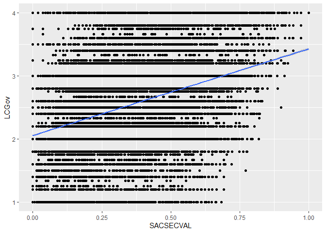
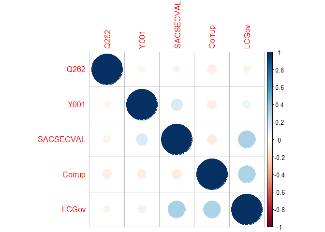
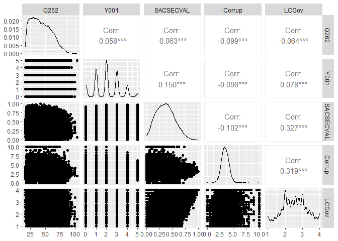
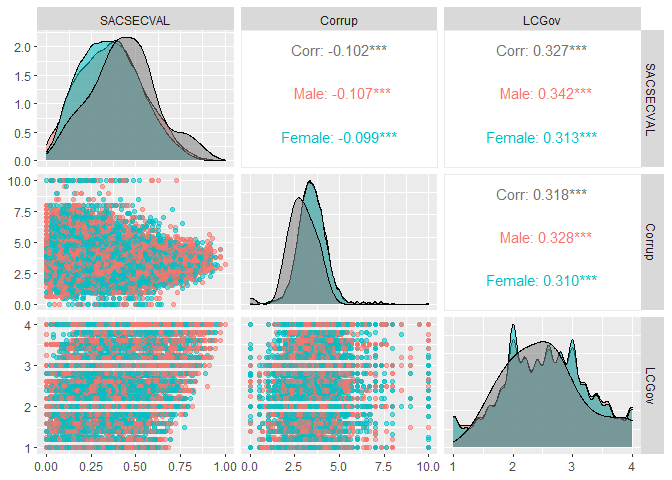

Correlation
================
Mauricio Garnier-Villarreal, Joris M. Schröder & Joseph Charles Van
Matre
01 September, 2022

-   <a href="#setup-the-r-session" id="toc-setup-the-r-session">Setup the R
    session</a>
-   <a href="#import-the-data-set" id="toc-import-the-data-set">Import the
    data set</a>
    -   <a href="#select-variables-of-interest"
        id="toc-select-variables-of-interest">Select variables of interest</a>
    -   <a href="#create-composite-scores"
        id="toc-create-composite-scores">Create composite scores</a>
-   <a href="#scatter-plot" id="toc-scatter-plot">Scatter-plot</a>
-   <a href="#pearson-correlation" id="toc-pearson-correlation">Pearson
    correlation</a>
    -   <a href="#subset-of-variables" id="toc-subset-of-variables">Subset of
        variables</a>
    -   <a href="#confidence-intervals" id="toc-confidence-intervals">Confidence
        Intervals</a>
-   <a href="#spearman-correlation" id="toc-spearman-correlation">Spearman
    correlation</a>
-   <a href="#kendall-tau-correlation"
    id="toc-kendall-tau-correlation">Kendall-tau correlation</a>
-   <a href="#extracting-the-different-matrices"
    id="toc-extracting-the-different-matrices">Extracting the different
    matrices</a>
-   <a href="#correlogram" id="toc-correlogram">Correlogram</a>
-   <a href="#pairs-plot" id="toc-pairs-plot">Pairs plot</a>

# Setup the R session

When we start working in R, we always need to setup our session. For
this we need to set our working directory, in this case I am doing that
for the folder that holds the downloaded [World Values Survey
(WVS)](https://www.worldvaluessurvey.org/) `SPSS` data set

``` r
setwd("~path_to_your_file")
```

The next step for setting up our session will be to load the packages
that we will be using

``` r
library(rio)
library(psych)
library(corrplot)
```

    ## corrplot 0.92 loaded

``` r
library(ggplot2)
```

    ## 
    ## Attaching package: 'ggplot2'

    ## The following objects are masked from 'package:psych':
    ## 
    ##     %+%, alpha

``` r
library(GGally)
```

    ## Registered S3 method overwritten by 'GGally':
    ##   method from   
    ##   +.gg   ggplot2

# Import the data set

Here we will be importing the `.sav` WVS data set

``` r
dat <- import("WVS_Cross-National_Wave_7_sav_v2_0.sav")
dim(dat)
```

    ## [1] 76897   548

Here we are calling our data set **dat** and asking to see the dimension
of it. We see that the data set has 76897 subjects, and 548 columns.

## Select variables of interest

In cases with large data sets like this we might want to select a subset
of variables that we want to work with. Since it is not easy to see 548
variables.

``` r
vars <- c("Q260","Q262", "Y001", "SACSECVAL", "Q112", "Q113", "Q114", "Q115", "Q116", "Q117", "Q118", "Q119", "Q120", "Q65", "Q69", "Q71", "Q72", "Q73")
dat2 <- dat[,vars]
dim(dat2)
```

    ## [1] 76897    18

``` r
head(dat2)
```

    ##   Q260 Q262 Y001 SACSECVAL Q112 Q113 Q114 Q115 Q116 Q117 Q118 Q119 Q120 Q65 Q69
    ## 1    2   60    0  0.287062    2   NA   NA   NA   NA   NA    1    2    6  NA   1
    ## 2    1   47    2  0.467525   10    3    3    3    3    3    1    3    2  NA   3
    ## 3    1   48    4  0.425304    7    2    2    2    2    2    1    2    7  NA   2
    ## 4    2   62    2  0.556170    5    3    3    3    3    2    1    4    7  NA   3
    ## 5    1   49    1  0.458949    5    2    2    2    2    1    1    3    7  NA   2
    ## 6    2   51    3  0.210111    6    2    2    2    2    2    1    4    2  NA   1
    ##   Q71 Q72 Q73
    ## 1   1   1   1
    ## 2   4   4   4
    ## 3   3   3   3
    ## 4   3   3   3
    ## 5   2   3   2
    ## 6   2   2   2

Here we are first creating a vector with the variable names for the ones
I want to keep. You can see all variable names for the full data set as
well:

``` r
colnames(dat)
```

After identifying which variables we will work with, we create a new
data set **dat2** with only these 17 variables, and make sure we did it
correctly by looking at the the dimension of the data **dim(dat2)**. We
also look at the first 6 rows: **head(dat2)**. These are quick checks
that we have created the new data correctly.

The variables we will use here are:

-   Q260: sex, 1 = Male, 2 = Female
-   Q262: age in years
-   Y001: post-materialism index
-   SACSECVAL: secular values
-   Q112-Q120: Corruption Perception Index
-   Q65-Q73: Lack of Confidence in the government

## Create composite scores

We will be using the composite scores for *Corruption Perception Index*
and *Lack of Confidence in the government* instead of their single
items. So, we first need to compute them, we will use the mean across
all items for each composite

``` r
dat2$Corrup <- rowMeans(dat2[,c("Q112", "Q113", "Q114", "Q115", "Q116", "Q117", "Q118", "Q119", "Q120")], na.rm=T)
dat2$LCGov <- rowMeans(dat2[,c("Q65", "Q69", "Q71", "Q72", "Q73")], na.rm=T)
head(dat2)
```

    ##   Q260 Q262 Y001 SACSECVAL Q112 Q113 Q114 Q115 Q116 Q117 Q118 Q119 Q120 Q65 Q69
    ## 1    2   60    0  0.287062    2   NA   NA   NA   NA   NA    1    2    6  NA   1
    ## 2    1   47    2  0.467525   10    3    3    3    3    3    1    3    2  NA   3
    ## 3    1   48    4  0.425304    7    2    2    2    2    2    1    2    7  NA   2
    ## 4    2   62    2  0.556170    5    3    3    3    3    2    1    4    7  NA   3
    ## 5    1   49    1  0.458949    5    2    2    2    2    1    1    3    7  NA   2
    ## 6    2   51    3  0.210111    6    2    2    2    2    2    1    4    2  NA   1
    ##   Q71 Q72 Q73   Corrup LCGov
    ## 1   1   1   1 2.750000  1.00
    ## 2   4   4   4 3.444444  3.75
    ## 3   3   3   3 3.000000  2.75
    ## 4   3   3   3 3.444444  3.00
    ## 5   2   3   2 2.777778  2.25
    ## 6   2   2   2 2.555556  1.75

With the `rowmeans()` we compute the mean across the specified
variables, for each subject. Remember to include the `na.rm=T` argument,
so the missing values are properly ignored.

Now, we will exclude the single indicators from the data set, for
easiness to have only the variables of interest

``` r
dat2 <- dat2[,c("Q260", "Q262", "Y001", "SACSECVAL", "Corrup", "LCGov")]
head(dat2)
```

    ##   Q260 Q262 Y001 SACSECVAL   Corrup LCGov
    ## 1    2   60    0  0.287062 2.750000  1.00
    ## 2    1   47    2  0.467525 3.444444  3.75
    ## 3    1   48    4  0.425304 3.000000  2.75
    ## 4    2   62    2  0.556170 3.444444  3.00
    ## 5    1   49    1  0.458949 2.777778  2.25
    ## 6    2   51    3  0.210111 2.555556  1.75

The new `dat2` data set only include the 5 continuous variables of
interest

# Scatter-plot

When looking at correlations, is recommended to first look at the
bivariate scatter-plot between the two variables of interest. We can do
this with the `ggplot2` package

``` r
ggplot(data=dat2, aes(x=SACSECVAL, y=LCGov))+
  geom_point()+
  geom_smooth(method = "lm", se=T)
```

    ## `geom_smooth()` using formula 'y ~ x'

<!-- -->

Now, in the `ggplot()` function we need to specify the data set, and
with the `aes()` argument we specify which variable goes in the *x* and
*y* axis respectively. Then we add the `geom_point()` to get the points
across both variables. Lastly, we add the predicted regression line
between these variables with `geom_smooth(method = "lm", se=T)`

# Pearson correlation

For estimating the correlations for multiple pairs of variables we are
using the `corr.test()` function from the `psych` package. To estimate
all correlations in the data set,

``` r
cor_pear1 <- corr.test(dat2[,-1], method = "pearson", adjust = "holm")
cor_pear1
```

    ## Call:corr.test(x = dat2[, -1], method = "pearson", adjust = "holm")
    ## Correlation matrix 
    ##            Q262  Y001 SACSECVAL Corrup LCGov
    ## Q262       1.00 -0.06     -0.06  -0.10 -0.06
    ## Y001      -0.06  1.00      0.15  -0.10  0.08
    ## SACSECVAL -0.06  0.15      1.00  -0.10  0.33
    ## Corrup    -0.10 -0.10     -0.10   1.00  0.32
    ## LCGov     -0.06  0.08      0.33   0.32  1.00
    ## Sample Size 
    ##            Q262  Y001 SACSECVAL Corrup LCGov
    ## Q262      76579 72058     76330  76455 76130
    ## Y001      72058 72313     72227  72256 72010
    ## SACSECVAL 76330 72227     76635  76549 76271
    ## Corrup    76455 72256     76549  76767 76342
    ## LCGov     76130 72010     76271  76342 76441
    ## Probability values (Entries above the diagonal are adjusted for multiple tests.) 
    ##           Q262 Y001 SACSECVAL Corrup LCGov
    ## Q262         0    0         0      0     0
    ## Y001         0    0         0      0     0
    ## SACSECVAL    0    0         0      0     0
    ## Corrup       0    0         0      0     0
    ## LCGov        0    0         0      0     0
    ## 
    ##  To see confidence intervals of the correlations, print with the short=FALSE option

In this case we are excluding the first column, with the `[,-1]`, this
way we are not including *sex* in the correlation estimates.

When we provide the full data set, it will estimate the correlations
between *all* the variables. With the `method` argument we specify the
type of correlation we want to estimate, in this case *pearson*. And the
`adjust` argument specifies which method we want to use to adjust the
*p-values* for multiple tests, here we choose *holm*.

The correlation results are presented in 3 tables, first we see the
correlation matrix which presents the correlation coefficients. Second,
we see the sample size matrix, since we have missing data each estimated
correlation did not included the same subjects, here we can see how many
subjects were included for each correlation. The last table include the
*p-values* for each correlation, the the lower diagonal presents the
un-adjusted ones, and the ones on the upper diagonal are the adjusted
(*holm*) *p-values*. In this case, we see no practical difference when
adjusting the *p-values*, as all of them are lower than *0.001*.

## Subset of variables

In most cases, you will not want to estimate all possible correlations,
you will want to only estimate this for a subset of variables. You can
do this by selecting the variables that you want

``` r
cor_pear2 <- corr.test(dat2[,c("SACSECVAL","Corrup","LCGov")], method = "pearson", adjust = "holm")
cor_pear2
```

    ## Call:corr.test(x = dat2[, c("SACSECVAL", "Corrup", "LCGov")], method = "pearson", 
    ##     adjust = "holm")
    ## Correlation matrix 
    ##           SACSECVAL Corrup LCGov
    ## SACSECVAL      1.00  -0.10  0.33
    ## Corrup        -0.10   1.00  0.32
    ## LCGov          0.33   0.32  1.00
    ## Sample Size 
    ##           SACSECVAL Corrup LCGov
    ## SACSECVAL     76635  76549 76271
    ## Corrup        76549  76767 76342
    ## LCGov         76271  76342 76441
    ## Probability values (Entries above the diagonal are adjusted for multiple tests.) 
    ##           SACSECVAL Corrup LCGov
    ## SACSECVAL         0      0     0
    ## Corrup            0      0     0
    ## LCGov             0      0     0
    ## 
    ##  To see confidence intervals of the correlations, print with the short=FALSE option

This way we can see only the three correlations we want (in this
example).

## Confidence Intervals

The default `print` does not include the the respective confidence
intervals. To see them we need to ask for it, like this

``` r
print(cor_pear2, short=F)
```

    ## Call:corr.test(x = dat2[, c("SACSECVAL", "Corrup", "LCGov")], method = "pearson", 
    ##     adjust = "holm")
    ## Correlation matrix 
    ##           SACSECVAL Corrup LCGov
    ## SACSECVAL      1.00  -0.10  0.33
    ## Corrup        -0.10   1.00  0.32
    ## LCGov          0.33   0.32  1.00
    ## Sample Size 
    ##           SACSECVAL Corrup LCGov
    ## SACSECVAL     76635  76549 76271
    ## Corrup        76549  76767 76342
    ## LCGov         76271  76342 76441
    ## Probability values (Entries above the diagonal are adjusted for multiple tests.) 
    ##           SACSECVAL Corrup LCGov
    ## SACSECVAL         0      0     0
    ## Corrup            0      0     0
    ## LCGov             0      0     0
    ## 
    ##  Confidence intervals based upon normal theory.  To get bootstrapped values, try cor.ci
    ##             raw.lower raw.r raw.upper raw.p lower.adj upper.adj
    ## SACSE-Corrp     -0.11 -0.10     -0.10     0     -0.11     -0.10
    ## SACSE-LCGov      0.32  0.33      0.33     0      0.32      0.33
    ## Corrp-LCGov      0.31  0.32      0.32     0      0.31      0.33

Now we can see the respective CI in the last fourth table, in the
*raw.lower* and *raw.upper* columns. In this case we see very small CI,
this is mostly due to the large sample size.

The default is to present the 95% CI, but you can adjust it with
the`alpha` argument, for example for a 99% CI we would do this

``` r
cor_pear3 <- corr.test(dat2[,c("SACSECVAL","Corrup","LCGov")], method = "pearson", adjust = "holm", alpha = 0.01)
print(cor_pear3, short=F)
```

    ## Call:corr.test(x = dat2[, c("SACSECVAL", "Corrup", "LCGov")], method = "pearson", 
    ##     adjust = "holm", alpha = 0.01)
    ## Correlation matrix 
    ##           SACSECVAL Corrup LCGov
    ## SACSECVAL      1.00  -0.10  0.33
    ## Corrup        -0.10   1.00  0.32
    ## LCGov          0.33   0.32  1.00
    ## Sample Size 
    ##           SACSECVAL Corrup LCGov
    ## SACSECVAL     76635  76549 76271
    ## Corrup        76549  76767 76342
    ## LCGov         76271  76342 76441
    ## Probability values (Entries above the diagonal are adjusted for multiple tests.) 
    ##           SACSECVAL Corrup LCGov
    ## SACSECVAL         0      0     0
    ## Corrup            0      0     0
    ## LCGov             0      0     0
    ## 
    ##  Confidence intervals based upon normal theory.  To get bootstrapped values, try cor.ci
    ##             raw.lower raw.r raw.upper raw.p lower.adj upper.adj
    ## SACSE-Corrp     -0.11 -0.10     -0.09     0     -0.11     -0.09
    ## SACSE-LCGov      0.32  0.33      0.34     0      0.32      0.34
    ## Corrp-LCGov      0.31  0.32      0.33     0      0.31      0.33

# Spearman correlation

We can ask for other correlations coefficients, like the
*non-parametric* Spearman correlation, which is estimated based on the
variable ranks, instead of the metric of the observed data. This method
makes it less sensitive to outliers. We can estimate this by changing
the `method` argument

``` r
cor_spear1 <- corr.test(dat2[,c("SACSECVAL","Corrup","LCGov")], method = "spearman", adjust = "holm")
print(cor_spear1, short=F)
```

    ## Call:corr.test(x = dat2[, c("SACSECVAL", "Corrup", "LCGov")], method = "spearman", 
    ##     adjust = "holm")
    ## Correlation matrix 
    ##           SACSECVAL Corrup LCGov
    ## SACSECVAL      1.00  -0.09  0.31
    ## Corrup        -0.09   1.00  0.34
    ## LCGov          0.31   0.34  1.00
    ## Sample Size 
    ##           SACSECVAL Corrup LCGov
    ## SACSECVAL     76635  76549 76271
    ## Corrup        76549  76767 76342
    ## LCGov         76271  76342 76441
    ## Probability values (Entries above the diagonal are adjusted for multiple tests.) 
    ##           SACSECVAL Corrup LCGov
    ## SACSECVAL         0      0     0
    ## Corrup            0      0     0
    ## LCGov             0      0     0
    ## 
    ##  Confidence intervals based upon normal theory.  To get bootstrapped values, try cor.ci
    ##             raw.lower raw.r raw.upper raw.p lower.adj upper.adj
    ## SACSE-Corrp     -0.10 -0.09     -0.08     0     -0.10     -0.08
    ## SACSE-LCGov      0.30  0.31      0.31     0      0.30      0.31
    ## Corrp-LCGov      0.33  0.34      0.34     0      0.33      0.34

# Kendall-tau correlation

Another *non-parametric* correlation method we can use if Kendall-tau.
Which is also based on variable ranks, but deals with ties in adifferent
way. In general, between these two non-parameteric correlation methods,
Kendall-tau is more robust and recommended. We can again specify this
with the `method` argument.

``` r
cor_kend1 <- corr.test(dat2[,c("SACSECVAL","Corrup","LCGov")], method = "kendall", adjust = "holm")
print(cor_kend1, short=F)
```

    ## Call:corr.test(x = dat2[, c("SACSECVAL", "Corrup", "LCGov")], method = "kendall", 
    ##     adjust = "holm")
    ## Correlation matrix 
    ##           SACSECVAL Corrup LCGov
    ## SACSECVAL      1.00  -0.06  0.22
    ## Corrup        -0.06   1.00  0.24
    ## LCGov          0.22   0.24  1.00
    ## Sample Size 
    ##           SACSECVAL Corrup LCGov
    ## SACSECVAL     76635  76549 76271
    ## Corrup        76549  76767 76342
    ## LCGov         76271  76342 76441
    ## Probability values (Entries above the diagonal are adjusted for multiple tests.) 
    ##           SACSECVAL Corrup LCGov
    ## SACSECVAL         0      0     0
    ## Corrup            0      0     0
    ## LCGov             0      0     0
    ## 
    ##  Confidence intervals based upon normal theory.  To get bootstrapped values, try cor.ci
    ##             raw.lower raw.r raw.upper raw.p lower.adj upper.adj
    ## SACSE-Corrp     -0.07 -0.06     -0.06     0     -0.07     -0.06
    ## SACSE-LCGov      0.21  0.22      0.22     0      0.21      0.22
    ## Corrp-LCGov      0.23  0.24      0.25     0      0.23      0.25

# Extracting the different matrices

We see that from this function we get multiple matrices with the needed
information. All of these matrices are saved in the object that the
`corr.test` function give us. I will use the correlation results from
the pearson coefficient here, we can extract only the correlation matrix
by

``` r
cor_pear2$r
```

    ##            SACSECVAL     Corrup     LCGov
    ## SACSECVAL  1.0000000 -0.1022859 0.3272091
    ## Corrup    -0.1022859  1.0000000 0.3185771
    ## LCGov      0.3272091  0.3185771 1.0000000

the *p-values* with

``` r
cor_pear2$p
```

    ##               SACSECVAL        Corrup LCGov
    ## SACSECVAL  0.000000e+00 4.241995e-177     0
    ## Corrup    4.241995e-177  0.000000e+00     0
    ## LCGov      0.000000e+00  0.000000e+00     0

and the Confidence Intervals with

``` r
cor_pear2$ci
```

    ##                  lower          r       upper             p
    ## SACSE-Corrp -0.1092908 -0.1022859 -0.09527096 4.241995e-177
    ## SACSE-LCGov  0.3208573  0.3272091  0.33353151  0.000000e+00
    ## Corrp-LCGov  0.3121890  0.3185771  0.32493644  0.000000e+00

The names show us all the different pieces of information we can ask
from it

``` r
names(cor_pear2)
```

    ##  [1] "r"      "n"      "t"      "p"      "p.adj"  "se"     "sef"    "adjust"
    ##  [9] "sym"    "ci"     "ci2"    "ci.adj" "stars"  "Call"

# Correlogram

There are different ways to plot multiple correlations at the same time.
One of this is the **correlogram**, we will use the `corrplot` package
for this. The `corrplot()` function requires the correlation matrix.

The default settings represent the direction of each correlation by
color, with *blue* meaning positive, and *red* meaning negative. And the
magnitude of the correlation is represented by the size of the cicles.

``` r
corrplot(cor_pear1$r)
```

<!-- -->

# Pairs plot

Another way to present the multiple correlations is with the *pairs*
plots. For this we can use the `GGally` package and its `ggpairs()`
functions.

``` r
ggpairs(dat2, columns=2:6)
```

<!-- -->

The pairs plot presents the density plot for each variable in the
diagonal, the scatter-plot in the lower triangle, and the pearson
correlation on the upper diagonal. You can also select which variables
to plot with the `columns` argument

``` r
ggpairs(dat2, columns=4:6)
```

<!-- -->

One last plot modification we want to show is to the pairs plots for
multiple groups. Girst we need to change the sex variable into a
categorical variable

``` r
dat2$Sex <- factor(dat2$Q260, 
                       levels = 1:2,
                       labels = c("Male","Female") )
```

Then we can include the new *Sex* variable in the `aes()` argument. This
way we can see the pairs plots for the whole sample, and for each group.

``` r
ggpairs(dat2, 
        columns=4:6,
        aes(color = Sex,  # Color by group (cat. variable)
            alpha = 0.5))  # Transparency
```

<!-- -->
