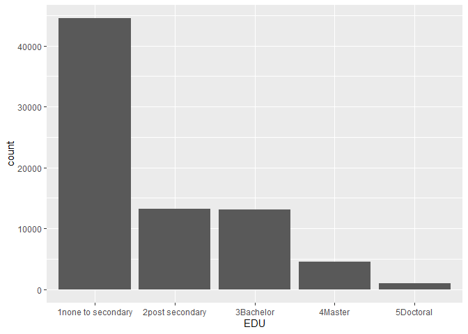

# Contingency tables
Mauricio Garnier-Villarreal
2024-02-23

- [Introduction](#introduction)
- [Set up the R Session](#set-up-the-r-session)
- [Import the Dataset](#import-the-dataset)
  - [Data prepration](#data-prepration)
- [Contingency tables](#contingency-tables)
  - [Marginal probabilities](#marginal-probabilities)
  - [$\chi^2$ contingency test](#chi2-contingency-test)
  - [Effect size](#effect-size)
  - [Plots](#plots)
- [References](#references)

# Introduction

Contingency tables are very useful to condense a large number of
observations into smaller manageble tables. A contingency table shows
the distribution of a variable in the rows and another in its columns.
They are not only useful for condensing data, but they also show the
relations between variables. They are a way of summarizing categorical
variables.

In this tutorials we will cover how to estimate contingency tables, the
respective effect sizes, and plots to help with interpretation

# Set up the R Session

When we start working in R, we always need to setup our session. For
this we need to set our working directory. You should set it for the
folder that holds the data set.

``` r
setwd("~path_to_your_file")
```

The next step for setting up our session will be to load the packages
that we will be using. We will use a packages like `car` for data
management, as well as the `rio` package for importing our data.
Additionally, we need the `summarytools` for calculation of marginal
probabilities, `effectsize` to calculate the effect sizes, and the
`ggplot2` packages for plots. Note that you potentially need to install
some of these packages, however.

``` r
library(rio)
library(summarytools)
library(ggplot2)
library(effectsize)
library(car)
```

# Import the Dataset

``` r
dat <- import("education.sav")
head(dat)
```

      sex_fac EDU_fac EDU_fac_2
    1       2       1         1
    2       1       4         2
    3       1       4         2
    4       2       1         1
    5       1       1         1
    6       2       1         1

``` r
dim(dat)
```

    [1] 76257     3

Or if you want to pull it from the github site

``` r
dat <- import("https://github.com/maugavilla/well_hello_stats/raw/main/tutorials/education.sav")
head(dat)
dim(dat)
```

In this data set we have the sex and education level of the
participants. And the education level is set with two different
catrgorizations. We can see the label for each value (number) with the
`attributes()` function

``` r
attributes(dat$sex_fac)
```

    $label
    [1] "Sex"

    $format.spss
    [1] "F8.0"

    $labels
       Male Feamale 
          1       2 

``` r
attributes(dat$EDU_fac)
```

    $label
    [1] "Education 5 categories"

    $format.spss
    [1] "F8.0"

    $labels
    none to secondary    post secondary          Bachelor            Master 
                    1                 2                 3                 4 
             Doctoral 
                    5 

``` r
attributes(dat$EDU_fac_2)
```

    $label
    [1] "Education 2 categories"

    $format.spss
    [1] "F8.0"

    $labels
    less than post grad       post graduate 
                      1                   2 

We see that for `EDU_fac` we have 5 levels of education, and for
`EDU_fac_2` we have only 2. In practice you should use the education
variable to use in function of the research question, and the level of
detail that you are interested in.

## Data prepration

For this tutorial we will use the `sex_fac` and `EDU_fac` variables. We
first will change the numerical values for interpretable text values.
This for two reasons, first will give show us the meaningful labels in
the output (making it easier to read), and force `R` to treat the
variables as categorical, preventing user errors.

We will use the `recode()` function to recode them into the new
varoables `SEX` and `EDU`

``` r
dat$SEX <- recode(dat$sex_fac, "1='Men';2='Women' ")

dat$EDU <- recode(dat$EDU_fac, "1='1none to secondary';
                      2='2post secondary';
                      3='3Bachelor';
                      4='4Master';
                      5='5Doctoral' ")
```

And then with the `freq()` function we can see the frequency tables
(including percentages) for each of the two vaeriables of interest

``` r
freq(dat[,c("SEX","EDU")])
```

    Frequencies  
    dat$SEX  
    Label: Sex  
    Type: Character  

                   Freq   % Valid   % Valid Cum.   % Total   % Total Cum.
    ----------- ------- --------- -------------- --------- --------------
            Men   36300     47.60          47.60     47.60          47.60
          Women   39957     52.40         100.00     52.40         100.00
           <NA>       0                               0.00         100.00
          Total   76257    100.00         100.00    100.00         100.00

    dat$EDU  
    Label: Education 5 categories  
    Type: Character  

                                Freq   % Valid   % Valid Cum.   % Total   % Total Cum.
    ------------------------ ------- --------- -------------- --------- --------------
          1none to secondary   44508     58.37          58.37     58.37          58.37
             2post secondary   13238     17.36          75.73     17.36          75.73
                   3Bachelor   13044     17.11          92.83     17.11          92.83
                     4Master    4547      5.96          98.79      5.96          98.79
                   5Doctoral     920      1.21         100.00      1.21         100.00
                        <NA>       0                               0.00         100.00
                       Total   76257    100.00         100.00    100.00         100.00

# Contingency tables

Now that we have prepared our data set, we can calculate our continegncy
table. The basic table can be estimated with the `table()` function, by
providing the 2 variables to it. The first variable will on the rows,
and the second one on the columns.

This table shows the counts of participants within each combination of
characterictics, like 503 men have a doctoral degree

``` r
tab1 <- table(dat$EDU, dat$SEX)
tab1
```

                        
                           Men Women
      1none to secondary 20552 23956
      2post secondary     6501  6737
      3Bachelor           6506  6538
      4Master             2238  2309
      5Doctoral            503   417

## Marginal probabilities

But its not as easy to interpret the counts, because even when we see
some differences. For this we can use marginal probabilities
(proportions). For this we can use the `ctable()` function, provide the
same 2 variables, and add the argument `prop="r"` to ask for *row*
proportions

``` r
ctable(dat$EDU, dat$SEX, prop="r")
```

    Cross-Tabulation, Row Proportions  
    EDU * SEX  
    Data Frame: dat  

    -------------------- ----- --------------- --------------- ----------------
                           SEX             Men           Women            Total
                     EDU                                                       
      1none to secondary         20552 (46.2%)   23956 (53.8%)   44508 (100.0%)
         2post secondary          6501 (49.1%)    6737 (50.9%)   13238 (100.0%)
               3Bachelor          6506 (49.9%)    6538 (50.1%)   13044 (100.0%)
                 4Master          2238 (49.2%)    2309 (50.8%)    4547 (100.0%)
               5Doctoral           503 (54.7%)     417 (45.3%)     920 (100.0%)
                   Total         36300 (47.6%)   39957 (52.4%)   76257 (100.0%)
    -------------------- ----- --------------- --------------- ----------------

With this you can interpret the proportion differences between column
categories across each row category. For example, of all participants
with a doctoral degree 55% are men, and 45% are women.

Or we can change the argument to `prop="r"` to get *column* proportions.
With this you can interpret the proportion differences between row
categories across each column category. For example, of all men 57% have
**none to seconday** education, and a 1% have a doctoral degree.

``` r
ctable(dat$EDU, dat$SEX, prop="c")
```

    Cross-Tabulation, Column Proportions  
    EDU * SEX  
    Data Frame: dat  

    -------------------- ----- ---------------- ---------------- ----------------
                           SEX              Men            Women            Total
                     EDU                                                         
      1none to secondary         20552 ( 56.6%)   23956 ( 60.0%)   44508 ( 58.4%)
         2post secondary          6501 ( 17.9%)    6737 ( 16.9%)   13238 ( 17.4%)
               3Bachelor          6506 ( 17.9%)    6538 ( 16.4%)   13044 ( 17.1%)
                 4Master          2238 (  6.2%)    2309 (  5.8%)    4547 (  6.0%)
               5Doctoral           503 (  1.4%)     417 (  1.0%)     920 (  1.2%)
                   Total         36300 (100.0%)   39957 (100.0%)   76257 (100.0%)
    -------------------- ----- ---------------- ---------------- ----------------

Or, if you want to get the column and row totals without propostions can
change the argument to `prop="n"`

``` r
ctable(dat$EDU, dat$SEX, prop="n")
```

    Cross-Tabulation  
    EDU * SEX  
    Data Frame: dat  

    -------------------- ----- ------- ------- -------
                           SEX     Men   Women   Total
                     EDU                              
      1none to secondary         20552   23956   44508
         2post secondary          6501    6737   13238
               3Bachelor          6506    6538   13044
                 4Master          2238    2309    4547
               5Doctoral           503     417     920
                   Total         36300   39957   76257
    -------------------- ----- ------- ------- -------

## $\chi^2$ contingency test

A $\chi^2$ contingency analysis allows us to test the null hypothesis
that two categorical variables are independent of each other.

Because this is the easiest test to calculate by hand, it is one of the
most common tests used. However, remember that the $\chi^2$ test is an
approximation, and requires that all of the expected values are greater
than 1 and that at least 80% are greater than 5, some would say that
100% should be above 5. When doing such a test of independence on a
computer, it is probably better to use Fisher’s exact test, which
doesn’t have this restriction.

The $\chi^2$ contingency test can be done with the function
`chisq.test()`. If we give a frequency table as input, this function
will calculate the $\chi^2$ test for us.

Before we do the test, though, we need to make sure that the assumptions
of the $\chi^2$ test are met by our data. Fortunately, the chisq.test()
function also provides a way for us to look at the expected values. If
we give a contigency table as input, and then add \$expected at the end
of the function, it will show us the expected values for a test of
independence, like this:

``` r
chisq.test(tab1)$expected
```

                        
                                Men      Women
      1none to secondary 21186.7815 23321.2185
      2post secondary     6301.5776  6936.4224
      3Bachelor           6209.2293  6834.7707
      4Master             2164.4715  2382.5285
      5Doctoral            437.9401   482.0599

In this case all the expected values are greater than 5, so we have no
problem meeting this assumption. Therefore, it is appropriate to do a
$\chi^2$ contingency test. Just give a contingency table as input to the
`chisq.test()` function to do this test. We’ve added the option
`correct = FALSE` to tell R to not do a Yate’s correction, which can be
overly conservative.

``` r
chisq.test(tab1)
```


        Pearson's Chi-squared test

    data:  tab1
    X-squared = 98.624, df = 4, p-value < 2.2e-16

This output shows that the $\chi^2$ value for this test is 98.624, with
4 degree of freedom and a $p < .001$. So we can reject the null
hypothesis of no association between sex and education level.

## Effect size

We need to also estimate measures of effect size, to improve the
interpretation, as the null hypothesis tests do not provide information
about the magnitude of the association. For this measure, we will use
Cramer’s $V$ as the effect size (Tomczak & Tomczak, 2014)

For this we can use the `cramers_v()` function, and just give it the
contigency table

``` r
cramers_v(tab1)
```

    Cramer's V (adj.) |       95% CI
    --------------------------------
    0.04              | [0.03, 1.00]

    - One-sided CIs: upper bound fixed at [1.00].

Cramer’s $V$ is an association effect size that ranges between 0
(indicating no relationship) to 1 (indicating a perfect relationship).
In this example we see that it is very close to 0 ($V = .04$) indicating
an small effect size of the association

For a 2-by-2 contingency table you can calculate the Odds Ratio and Risk
Ratio as effect size measures. For this example, we are first recoding
education into a binary variable. From none to post seconday as category
1, and any college degrees as category 2

``` r
dat$EDU2 <- recode(dat$EDU_fac, "1='1nonetosec';
                      2='1nonetosec';
                      3='2pastsec';
                      4='2pastsec';
                      5='2pastsec' ")
```

Then we first need to estimate the new contigency table with the new
education variable. Then you can estimate the Odds Ratio and Risk Ratio
with the respective functions

``` r
tab22 <- table(dat$EDU2, dat$SEX)
tab22
```

                
                   Men Women
      1nonetosec 27053 30693
      2pastsec    9247  9264

``` r
chisq.test(tab22)
```


        Pearson's Chi-squared test with Yates' continuity correction

    data:  tab22
    X-squared = 54.086, df = 1, p-value = 1.919e-13

``` r
oddsratio(tab22)
```

    Odds ratio |       95% CI
    -------------------------
    0.88       | [0.85, 0.91]

``` r
riskratio(tab22)
```

    Risk ratio |       95% CI
    -------------------------
    0.97       | [0.96, 0.98]

## Plots

There are different ways to present plots for contigency tables, first
we will see bar plots. This ones present the counts for each category.
For this we can use the `ggplot2` package. If we provide the data frame,
and only one categorical variable for the x-axis, we can present the bar
plot for each variable

``` r
ggplot(data=dat, aes(x=EDU))+
  geom_bar()
```



``` r
ggplot(data=dat, aes(x=SEX))+
  geom_bar()
```


Then, if we want to include both variables in the same plot, we can do
it in a couple of different ways. In the first example, we have one
variable in the x-axis, and use the `facet_wrap` function to create
separate plots for each of the categories of the second variable.

On the second example, we have all participants in the same plot, but
separate them by color (`fill`). And in the third example we do both,
separate plots and different colors.

``` r
ggplot(data=dat, aes(x=EDU))+
  geom_bar()+
  facet_wrap(vars(SEX) )
```


``` r
ggplot(data=dat, aes(x=EDU, fill=SEX))+
  geom_bar()
```


``` r
ggplot(data=dat, aes(x=EDU, fill=SEX))+
  geom_bar()+
  facet_wrap(vars(SEX) )
```


Note that for the previous plots we have counts on the y-axis, but we
can swith this for proportions. We can do this by adjusting the `aes()`
function inside the `geom_bar()` function. With
`aes(y = ..count../sum(..count..))` we specify that the y-axis should
dive the counts by their total (making it a proportion)

``` r
ggplot(data=dat, aes(x=EDU, fill=SEX))+
  geom_bar(aes(y = ..count../sum(..count..)))+
  facet_wrap(vars(SEX) )
```


Lastly, we can also use the mosaic plot, which is another graphical
technique for showing the association between two categorical variables.
Here, each combination of the variables is represented by a rectangle,
and the size of the rectangle is proportional to the number of
individuals in that combination.

R has a function to calculate mosaic plots, with the sensible name
`mosaicplot()`. In its most basic form, you just give it a contigency
table as input.

``` r
mosaicplot(tab1)
```


# References

Tomczak, M., & Tomczak, E. (2014). The need to report effect size
estimates revisited. An overview of some recommended measures of effect
size. TRENDS in Sport Sciences, 1(21), 19–25.
