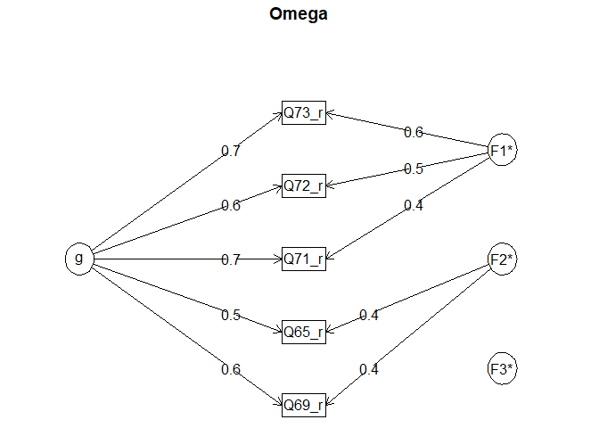

Reliability analysis
================
Mauricio Garnier-Villarreal, Joris M. Schröder & Joseph Charles Van
Matre
11 February, 2024

- [What is reliability analysis?](#what-is-reliability-analysis)
- [Preparation](#preparation)
  - [Setup the R session](#setup-the-r-session)
  - [Import the data set](#import-the-data-set)
    - [Select variables of interest](#select-variables-of-interest)
    - [Data preparation](#data-preparation)
- [Reliability analysis](#reliability-analysis)
  - [Cronbach’s alpha](#cronbachs-alpha)
    - [Interpreting the output](#interpreting-the-output)
    - [Mix of positively and negatively scored
      items](#mix-of-positively-and-negatively-scored-items)
    - [Squared multiple correlation
      (SMC)](#squared-multiple-correlation-smc)
  - [McDonald’s omega](#mcdonalds-omega)
    - [Interpreting the output](#interpreting-the-output-1)
    - [Mix of positively and negatively scored
      items](#mix-of-positively-and-negatively-scored-items-1)
- [References](#references)

# What is reliability analysis?

In many areas of the social sciences, variables of interest are not
directly observable. These (latent) variables are therefore measured
with scales comprised of a set of items (e.g., questions in a survey).
These items indirectly measure the variable of interest by inferring
that the underlying construct manifests itself through these items
(McNeish, 2018). Broadly defined, measures of reliability are used to
demonstrate that “the scores based on the items are reasonably
consistent, the responses to the scale are reproducible, and that
responses are not simply comprised of random noise. Put another way, a
reliability analysis provides evidence that the scale is consistently
measuring the same thing (although, this is distinct from concluding
that the scale is measuring the intended construct—that is a question of
scale validity).” (McNeish, 2018, p. 413). In this tutorial, we will
look at two measures of reliability: *Cronbach’s alpha* $\alpha$ and
*McDonald’s omega total* $\omega_t$.

# Preparation

## Setup the R session

Starting a new session, we should first set our working directory. Here,
we set it to the the folder that contains the [World Values Survey
(WVS)](https://www.worldvaluessurvey.org/) `SPSS` data set in `.sav`
format.

``` r
setwd("~path_to_your_file")
```

The next step for our session will be to load the packages that we will
be using. For reliability analysis, we will use the
[`psych`](https://cran.r-project.org/web/packages/psych/index.html)
package. If you have not yet installed the package, you can use
`install.packages("psych")` to install the `psych` package and then load
it via `library()`. Additionally, we use the `rio` package to import our
data (see the tutorial *Importing Data Sets*), and the `car` package for
recoding items (see the tutorial *Data Management 1*).

``` r
# install.packages("psych") # if you have not yet installed the psych package
library(psych)
library(rio)
library(car)
```

    ## Loading required package: carData

    ## 
    ## Attaching package: 'car'

    ## The following object is masked from 'package:psych':
    ## 
    ##     logit

## Import the data set

We import the WVS data set.

``` r
dat <- import("WVS_Cross-National_Wave_7_sav_v2_0.sav")
dim(dat)
```

    ## [1] 76897   548

We name the data set **dat** and ask **R** to show us its dimensions
using `dim()`. We see that the data set has 84638 rows (in this case
respondents), and 563 columns (in this case variables).

### Select variables of interest

With a large data set like the WVS, we usually want to select only a
subset of variables that we need for our analysis. This makes the data
set more overseeable. We want to use questions from the WVS to create a
scale of confidence in the government. To create this scale, we use five
items from the survey that measure confidence in armed forces, the
police, the government (in your nation’s capital), in political parties,
and in the parliament. The variable names are Q65, Q69, Q71, Q72, and
Q73.

To select these variables, we first create a vector named `vars`
containing the names of the variables that we want to keep.

``` r
vars <- c("Q65", "Q69", "Q71", "Q72", "Q73")
```

Next, we tell **R** to create a data set **dat2** which only contains
the columns with the names in the vector `vars`. In `dat[, vars]`, the
argument before the comma specifies which rows to keep (here, we keep it
empty to keep all rows/respondents in the data). The argument after the
comma tells r which columns/variables to keep, and we tell R to keep the
columns with the names stored in the vector `vars`. We check the
dimensions (`dim(dat2)`) and the first few rows of the data set
(`head(dat2)`). This is a quick check whether everything went well and
that we now have a data frame with just the 5 variables we wanted to
select.

``` r
dat2 <- dat[, vars]            
dim(dat2)
```

    ## [1] 76897     5

``` r
head(dat2)
```

    ##   Q65 Q69 Q71 Q72 Q73
    ## 1  NA   1   1   1   1
    ## 2  NA   3   4   4   4
    ## 3  NA   2   3   3   3
    ## 4  NA   3   3   3   3
    ## 5  NA   2   2   3   2
    ## 6  NA   1   2   2   2

### Data preparation

Let’s first have a look at the items that make up the scale of
confidence in the government. Using `attributes()`, we can see that the
variable Q65 measures confidence in the armed forces. We can also see
that 1 means that they have a great deal of confidence and that 4 means
that they have no confidence at all. So, we see that the higher the
score the less confidence they have in the government.

``` r
attributes(dat2$Q65) ## Confidence: Armed Forces
```

    ## $label
    ## [1] "Confidence: Armed Forces"
    ## 
    ## $format.spss
    ## [1] "F3.0"
    ## 
    ## $labels
    ## Other missing; Multiple answers Mail (EVS) 
    ##                                         -5 
    ##                                  Not asked 
    ##                                         -4 
    ##                                  No answer 
    ##                                         -2 
    ##                                 Don´t know 
    ##                                         -1 
    ##                               A great deal 
    ##                                          1 
    ##                                Quite a lot 
    ##                                          2 
    ##                              Not very much 
    ##                                          3 
    ##                                None at all 
    ##                                          4

We can also check that this is also true for the other items (output not
shown).

``` r
attributes(dat2$Q69) ## Confidence: The Police
attributes(dat2$Q71) ## Confidence: The Government
attributes(dat2$Q72) ## Confidence: The Political Parties
attributes(dat2$Q73) ## Confidence: Parliament
```

This is not really intuitive. Instead, we would like to have higher
values represent more confidence in the government. To do that, we
reverse code the items such that higher values on the items mean *more*
confidence in the government (you can find more details on this
procedure in the tutorial *Data management 1*).

First, we check which values actually occur in the data. To do this, we
request descriptive statistics for the items. We previously use the
`descr()` function from the `summarytools` package (see the tutorial on
*Descriptive Statistics*). The `psych` package has a similar function
called `describe()`, which provides almost the same information. Here,
we will use the `describe()` function, since we already have the `psych`
package loaded.

``` r
# descr(dat2) # use this if you are using the 'summarytools' package
describe(dat2)
```

    ##     vars     n mean   sd median trimmed  mad min max range  skew kurtosis se
    ## Q65    1 73362 2.09 0.92      2    2.00 1.48   1   4     3  0.48    -0.63  0
    ## Q69    2 74827 2.34 0.94      2    2.30 1.48   1   4     3  0.25    -0.80  0
    ## Q71    3 74235 2.58 0.99      3    2.60 1.48   1   4     3 -0.03    -1.05  0
    ## Q72    4 74317 2.94 0.90      3    3.01 1.48   1   4     3 -0.44    -0.66  0
    ## Q73    5 74277 2.78 0.95      3    2.85 1.48   1   4     3 -0.24    -0.91  0

From the description of the items we can see that the values range from
1 to 4 in the data for these variables (min and max). This means that
all other responses have correctly been coded as missing `NA`.

To reverse code the variables, will use the `recode()` function from the
`car` package.

``` r
dat2$Q65_r <- recode(dat2$Q65, "1=4; 2=3; 3=2; 4=1")
dat2$Q69_r <- recode(dat2$Q69, "1=4; 2=3; 3=2; 4=1")
dat2$Q71_r <- recode(dat2$Q71, "1=4; 2=3; 3=2; 4=1")
dat2$Q72_r <- recode(dat2$Q72, "1=4; 2=3; 3=2; 4=1")
dat2$Q73_r <- recode(dat2$Q73, "1=4; 2=3; 3=2; 4=1")
```

We give the new items a name ending with `_r`, indicating that is the
same item as before but reverse coded. We do a quick check that the
recoding went well by looking at a cross-table between the original
variable, and the new one. We can see that the variable values follow
the diagonal, indicating that values were recoded correctly. Only the
`NA` is the same, because we want to keep the same missing values.

``` r
table(dat2$Q65, dat2$Q65_r, useNA="always")
```

    ##       
    ##            1     2     3     4  <NA>
    ##   1        0     0     0 22019     0
    ##   2        0     0 29214     0     0
    ##   3        0 15767     0     0     0
    ##   4     6362     0     0     0     0
    ##   <NA>     0     0     0     0  3535

``` r
table(dat2$Q69, dat2$Q69_r, useNA="always")
```

    ##       
    ##            1     2     3     4  <NA>
    ##   1        0     0     0 14485     0
    ##   2        0     0 30518     0     0
    ##   3        0 19804     0     0     0
    ##   4    10020     0     0     0     0
    ##   <NA>     0     0     0     0  2070

``` r
table(dat2$Q71, dat2$Q71_r, useNA="always")
```

    ##       
    ##            1     2     3     4  <NA>
    ##   1        0     0     0 11327     0
    ##   2        0     0 24395     0     0
    ##   3        0 22497     0     0     0
    ##   4    16016     0     0     0     0
    ##   <NA>     0     0     0     0  2662

``` r
table(dat2$Q72, dat2$Q72_r, useNA="always")
```

    ##       
    ##            1     2     3     4  <NA>
    ##   1        0     0     0  5090     0
    ##   2        0     0 17225     0     0
    ##   3        0 29054     0     0     0
    ##   4    22948     0     0     0     0
    ##   <NA>     0     0     0     0  2580

``` r
table(dat2$Q73, dat2$Q73_r, useNA="always")
```

    ##       
    ##            1     2     3     4  <NA>
    ##   1        0     0     0  7267     0
    ##   2        0     0 21501     0     0
    ##   3        0 25941     0     0     0
    ##   4    19568     0     0     0     0
    ##   <NA>     0     0     0     0  2620

As the last step for data preparation, we create a new data set that
only contains the recoded items. This makes the relibility analysis
below a little bit easier.

``` r
reverse_coded <- c("Q65_r", "Q69_r", "Q71_r", "Q72_r", "Q73_r")
dat3 <- dat2[, reverse_coded] 
```

# Reliability analysis

Now that our data is well prepared, getting the reliability estimates is
actually super easy. We look at Cronbach’s alpha and McDonald’s omega
total as two measures of reliability. Cronbach’s alpha is not a measure
of reliability, but a measure of inter-item correlation, that
approximates reliability when *tau-equivalence* assumption is met.
McDonald’s omega is an improved measure of reliability based on the
congeneric measurement model (Cho & Kim, 2015)

## Cronbach’s alpha

To get Cronbach’s alpha, we simply use the `alpha()` function from the
`psych` package, and give it the name of the data set that contains the
reverse coded items (`dat3`).

``` r
alpha(dat3)               # note that ggplot2 also has a function called `alpha`. If you also have the ggplot2 package loaded, you have to specify which of these you want to use. To use the alpha function from the `psych` package you can type `psych::alpha()`
```

    ## 
    ## Reliability analysis   
    ## Call: alpha(x = dat3)
    ## 
    ##   raw_alpha std.alpha G6(smc) average_r S/N     ase mean   sd median_r
    ##       0.83      0.83    0.82      0.49 4.8 0.00099  2.4 0.74     0.46
    ## 
    ##     95% confidence boundaries 
    ##          lower alpha upper
    ## Feldt     0.83  0.83  0.83
    ## Duhachek  0.83  0.83  0.83
    ## 
    ##  Reliability if an item is dropped:
    ##       raw_alpha std.alpha G6(smc) average_r S/N alpha se var.r med.r
    ## Q65_r      0.84      0.84    0.82      0.57 5.4  0.00093 0.020  0.57
    ## Q69_r      0.81      0.81    0.80      0.52 4.3  0.00112 0.042  0.51
    ## Q71_r      0.77      0.77    0.76      0.45 3.3  0.00140 0.024  0.43
    ## Q72_r      0.78      0.78    0.76      0.47 3.5  0.00131 0.018  0.46
    ## Q73_r      0.76      0.76    0.73      0.45 3.2  0.00140 0.015  0.44
    ## 
    ##  Item statistics 
    ##           n raw.r std.r r.cor r.drop mean   sd
    ## Q65_r 73362  0.64  0.64  0.49   0.45  2.9 0.92
    ## Q69_r 74827  0.73  0.73  0.62   0.57  2.7 0.94
    ## Q71_r 74235  0.84  0.83  0.79   0.72  2.4 0.99
    ## Q72_r 74317  0.81  0.81  0.77   0.68  2.1 0.90
    ## Q73_r 74277  0.84  0.84  0.82   0.73  2.2 0.95
    ## 
    ## Non missing response frequency for each item
    ##          1    2    3    4 miss
    ## Q65_r 0.09 0.21 0.40 0.30 0.05
    ## Q69_r 0.13 0.26 0.41 0.19 0.03
    ## Q71_r 0.22 0.30 0.33 0.15 0.03
    ## Q72_r 0.31 0.39 0.23 0.07 0.03
    ## Q73_r 0.26 0.35 0.29 0.10 0.03

### Interpreting the output

The main thing we are looking for in the output of the alpha function is
*alpha_raw*, which is the value for Cronbach’s alpha.

Another interesting piece of information is summarized under the heading
*Reliability if an item is dropped:*. Here, each of the rows indicates
what Cronbach’s alpha would be if that specific item was dropped from
the scale. In our example, Cronbach’s alpha slightly increases from 0.83
to 0.84 if we drop the first item `Q65_r`. For all the other items,
Cronbach’s alpha would be lower if they were dropped from the scale.
Here, it is important to keep in mind that dropping items also has
implications for scale validity, that is, whether the scale is measuring
the intended construct. So you should not exclude items simply based on
Cronbach’s alpha, but also consider how that might affect scale validity
at the same time.

Under *Item statistics* we also get results for the item-total
correlation. Item-total correlation is a measure for how strongly a
single item correlates with the total scale. *raw.r*, *std.r*, *r.drop*,
and *r.cor* are all slightly different estimates of item-total
correlation. You can find out more about the different measures by
typing `?alpha` in the console. Here, we focus on the *corrected
item-total correlation* given by *r.cor*, which is the most reliable of
these estimates. In our example, we can see in the output for *r.cor*
that the items Q65 (confidence in armed forces) and Q69 (confidence in
the police) have much lower correlations with a scale made up of the
remaining 4 items than the remaining items Q71 (confidence in the
government), Q72 (confidence in political parties), and Q73 (confidence
in the parliament).

### Mix of positively and negatively scored items

If you have a mix of positively and negatively scored items in your data
(e.g., if you forgot to reverse code some items of the scale), you can
still use the `alpha` function with that data, but you need to specify
an extra argument. First, lets see what happens if you simply apply
`alpha()` to such data. To test that, we create a new data set (`dat4`)
that contains two items in their original coding, and three items that
we reverse coded above.

``` r
forgot_reverse <- c("Q65", "Q69", "Q71_r", "Q72_r", "Q73_r")
dat4 <- dat2[, forgot_reverse] 
alpha(dat4)
```

    ## Warning in alpha(dat4): Some items were negatively correlated with the first principal component and probably 
    ## should be reversed.  
    ## To do this, run the function again with the 'check.keys=TRUE' option

    ## Some items ( Q65 Q69 ) were negatively correlated with the first principal component and 
    ## probably should be reversed.  
    ## To do this, run the function again with the 'check.keys=TRUE' option

    ## 
    ## Reliability analysis   
    ## Call: alpha(x = dat4)
    ## 
    ##   raw_alpha std.alpha G6(smc) average_r  S/N    ase mean   sd median_r
    ##       0.11      0.11    0.52     0.024 0.12 0.0052  2.2 0.46    -0.32
    ## 
    ##     95% confidence boundaries 
    ##          lower alpha upper
    ## Feldt      0.1  0.11  0.12
    ## Duhachek   0.1  0.11  0.12
    ## 
    ##  Reliability if an item is dropped:
    ##       raw_alpha std.alpha G6(smc) average_r   S/N alpha se var.r med.r
    ## Q65        0.37      0.37    0.65     0.127  0.58   0.0033  0.40  0.12
    ## Q69        0.48      0.47    0.66     0.184  0.90   0.0028  0.32  0.18
    ## Q71_r     -0.22     -0.22    0.33    -0.047 -0.18   0.0079  0.27 -0.32
    ## Q72_r     -0.37     -0.37    0.25    -0.073 -0.27   0.0087  0.27 -0.35
    ## Q73_r     -0.38     -0.37    0.21    -0.072 -0.27   0.0088  0.25 -0.33
    ## 
    ##  Item statistics 
    ##           n raw.r std.r r.cor r.drop mean   sd
    ## Q65   73362 0.208 0.204 -0.16  -0.23  2.1 0.92
    ## Q69   74827 0.066 0.057 -0.30  -0.35  2.3 0.94
    ## Q71_r 74235 0.663 0.649  0.64   0.27  2.4 0.99
    ## Q72_r 74317 0.716 0.716  0.74   0.40  2.1 0.90
    ## Q73_r 74277 0.720 0.713  0.77   0.39  2.2 0.95
    ## 
    ## Non missing response frequency for each item
    ##          1    2    3    4 miss
    ## Q65   0.30 0.40 0.21 0.09 0.05
    ## Q69   0.19 0.41 0.26 0.13 0.03
    ## Q71_r 0.22 0.30 0.33 0.15 0.03
    ## Q72_r 0.31 0.39 0.23 0.07 0.03
    ## Q73_r 0.26 0.35 0.29 0.10 0.03

In the output, you can now first see a warning *‘Some items ( Q65 Q69 )
were negatively correlated with the total scale and probably should be
reversed.’*. We still get an estimate for alpha and the other output of
the `alpha()` function, but we should ignore it if we see such a
warning. The warning also tells us that we can use the `check.keys=TRUE`
option to get around this problem, so let’s try that:

``` r
alpha(dat4, check.keys = TRUE)
```

    ## Warning in alpha(dat4, check.keys = TRUE): Some items were negatively correlated with the first principal component and were automatically reversed.
    ##  This is indicated by a negative sign for the variable name.

    ## 
    ## Reliability analysis   
    ## Call: alpha(x = dat4, check.keys = TRUE)
    ## 
    ##   raw_alpha std.alpha G6(smc) average_r  S/N     ase mean   sd median_r
    ##       0.83      0.11    0.52     0.024 0.12 0.00099  2.4 0.74    -0.32
    ## 
    ##     95% confidence boundaries 
    ##          lower alpha upper
    ## Feldt     0.83  0.83  0.83
    ## Duhachek  0.83  0.83  0.83
    ## 
    ##  Reliability if an item is dropped:
    ##       raw_alpha std.alpha G6(smc) average_r   S/N alpha se var.r med.r
    ## Q65-       0.84      0.37    0.65     0.127  0.58  0.00093  0.40  0.12
    ## Q69-       0.81      0.47    0.66     0.184  0.90  0.00112  0.32  0.18
    ## Q71_r      0.77     -0.22    0.33    -0.047 -0.18  0.00140  0.27 -0.32
    ## Q72_r      0.78     -0.37    0.25    -0.073 -0.27  0.00131  0.27 -0.35
    ## Q73_r      0.76     -0.37    0.21    -0.072 -0.27  0.00140  0.25 -0.33
    ## 
    ##  Item statistics 
    ##           n raw.r std.r r.cor r.drop mean   sd
    ## Q65-  73362  0.64 0.204 -0.16   0.45  2.9 0.92
    ## Q69-  74827  0.73 0.057 -0.30   0.57  2.7 0.94
    ## Q71_r 74235  0.84 0.649  0.64   0.72  2.4 0.99
    ## Q72_r 74317  0.81 0.716  0.74   0.68  2.1 0.90
    ## Q73_r 74277  0.84 0.713  0.77   0.73  2.2 0.95
    ## 
    ## Non missing response frequency for each item
    ##          1    2    3    4 miss
    ## Q65   0.30 0.40 0.21 0.09 0.05
    ## Q69   0.19 0.41 0.26 0.13 0.03
    ## Q71_r 0.22 0.30 0.33 0.15 0.03
    ## Q72_r 0.31 0.39 0.23 0.07 0.03
    ## Q73_r 0.26 0.35 0.29 0.10 0.03

We now get a warning saying that *‘Some items were negatively correlated
with total scale and were automatically reversed. This is indicated by a
negative sign for the variable name.’*. Now, the function automatically
reverse codes the affected items. The output is correct again, and is
the same as when applying `alpha()` to items that are all scored in the
same direction.

If we do not want to rely on this automatic reverse coding of the
`alpha()` function, we can also manually specify which items are
negatively coded by using the `keys` option. We specify that the items
Q65 and Q69, which are the first and the second variable in the dat4
data set, are negatively scored by giving `-1` in the first and second
position to the keys option.

``` r
alpha(dat4, keys = c(-1, -1, 1, 1, 1)) 
```

We don’t show the output because it is the same as in the first example
where all items are reverse coded by hand. We no longer get the warning,
and get the same correct result of $\alpha = 0.83$ and remaining output
as before.

### Squared multiple correlation (SMC)

The `smc()` function gives us the squared multiple correlation (think
$R^2$) for each of the items with all other items.

``` r
smc(dat3)
```

    ##     Q65_r     Q69_r     Q71_r     Q72_r     Q73_r 
    ## 0.2508589 0.3498631 0.5677779 0.5811695 0.6412574

Here, we can see that the SCM for items Q65_r and Q69_r are low in
comparison to the SCM of the remaining three items. This is in line with
the results for the corrected item-total correlation from above.

## McDonald’s omega

The `omega()` function from the `psych` package gives use McDonald’s
omega total $\omega_t$. We provide the name of the data set `dat3` to
the function.

``` r
omega(dat3)
```

    ## Loading required namespace: GPArotation

<!-- -->

    ## Omega 
    ## Call: omegah(m = m, nfactors = nfactors, fm = fm, key = key, flip = flip, 
    ##     digits = digits, title = title, sl = sl, labels = labels, 
    ##     plot = plot, n.obs = n.obs, rotate = rotate, Phi = Phi, option = option, 
    ##     covar = covar)
    ## Alpha:                 0.83 
    ## G.6:                   0.82 
    ## Omega Hierarchical:    0.65 
    ## Omega H asymptotic:    0.74 
    ## Omega Total            0.88 
    ## 
    ## Schmid Leiman Factor loadings greater than  0.2 
    ##          g   F1*   F2*   F3*   h2   u2   p2
    ## Q65_r 0.52        0.41       0.44 0.56 0.61
    ## Q69_r 0.64        0.37       0.56 0.44 0.73
    ## Q71_r 0.66  0.45             0.65 0.35 0.67
    ## Q72_r 0.61  0.54             0.67 0.33 0.56
    ## Q73_r 0.66  0.62             0.83 0.17 0.54
    ## 
    ## With Sums of squares  of:
    ##    g  F1*  F2*  F3* 
    ## 1.94 0.87 0.31 0.03 
    ## 
    ## general/max  2.22   max/min =   27.3
    ## mean percent general =  0.62    with sd =  0.08 and cv of  0.13 
    ## Explained Common Variance of the general factor =  0.61 
    ## 
    ## The degrees of freedom are -2  and the fit is  0 
    ## The number of observations was  76897  with Chi Square =  0  with prob <  NA
    ## The root mean square of the residuals is  0 
    ## The df corrected root mean square of the residuals is  NA
    ## 
    ## Compare this with the adequacy of just a general factor and no group factors
    ## The degrees of freedom for just the general factor are 5  and the fit is  0.52 
    ## The number of observations was  76897  with Chi Square =  39864.87  with prob <  0
    ## The root mean square of the residuals is  0.16 
    ## The df corrected root mean square of the residuals is  0.23 
    ## 
    ## RMSEA index =  0.322  and the 10 % confidence intervals are  0.319 0.325
    ## BIC =  39808.62 
    ## 
    ## Measures of factor score adequacy             
    ##                                                  g  F1*   F2*   F3*
    ## Correlation of scores with factors            0.81 0.71  0.52  0.28
    ## Multiple R square of scores with factors      0.65 0.50  0.27  0.08
    ## Minimum correlation of factor score estimates 0.31 0.00 -0.46 -0.84
    ## 
    ##  Total, General and Subset omega for each subset
    ##                                                  g  F1*  F2* F3*
    ## Omega total for total scores and subscales    0.88 0.88 0.66  NA
    ## Omega general for total scores and subscales  0.65 0.52 0.46  NA
    ## Omega group for total scores and subscales    0.21 0.36 0.21  NA

### Interpreting the output

The omega function provides quite a lot of output. First, we get
actually get a visual representation of the model that the function fits
to the data. This can be helpful, but you can also request not to get
the figure by specifying `omega(dat3, plot =FALSE)` instead.

The main thing we are looking for in the output is *Omega Total*, which
in this case is 0.88. You can see that the `omega()` functiona also
provides the value for Cronbach’s alpha above that, so you can just use
the `omega()` function to get output for both of the reliability
measures.

For the moment, we are not insterested in the remaining output, but you
can get a helpful and detailed description of the output of the
`omega()` function by typing typing `?omega` in the console.

### Mix of positively and negatively scored items

For the `omega()` fuction, you can also provide a mix of positively and
negatively scored items, and you will get the same reliability estimate
for omega total. You can check by using the `dat4` data set from above.
`omega()` assumes that any negative correlations between singe items and
the latent factor are due to reverse coding and ‘corrects’ that without
printing a warning. Items that were automatically reverse coded are
indicated by a small minus sign after their name under the heading
*Schmid Leiman Factor loadings greater than 0.2*.

# References

Chan C, Chan GC, Leeper TJ, Becker J (2021). rio: A Swiss-army knife for
data file I/O. R package version 0.5.29.
<https://cran.r-project.org/web/packages/rio/>

Cho, E., & Kim, S. (2015). Cronbach’s Coefficient Alpha: Well Known but
Poorly Understood. Organizational Research Methods, 18(2), 207–230.
<https://doi.org/10.1177/1094428114555994>

Fox J, Weisberg S (2019). An R Companion to Applied Regression, Third
edition. Sage, Thousand Oaks CA.
<https://socialsciences.mcmaster.ca/jfox/Books/Companion/>.

McNeish, D. (2018). Thanks coefficient alpha, we’ll take it from here.
Psychological Methods, 23(3), 412–433.
<https://doi.org/10.1037/met0000144>

Revelle W (2022). psych: Procedures for Psychological, Psychometric, and
Personality Research. Northwestern University, Evanston, Illinois. R
package version 2.2.3, <https://CRAN.R-project.org/package=psych>.
