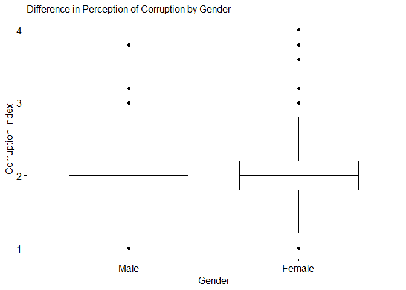

Difference in Means: t-tests
================
Mauricio Garnier-Villarreal, Joris M. Schröder & Joseph Charles Van
Matre
01 September, 2022

-   <a href="#setup-the-r-session" id="toc-setup-the-r-session">Setup the R
    session</a>
-   <a href="#import-the-data-set" id="toc-import-the-data-set">Import the
    data set</a>
    -   <a href="#currating-the-data" id="toc-currating-the-data">Currating the
        data</a>
        -   <a href="#transform-categorical-variables-to-binary"
            id="toc-transform-categorical-variables-to-binary">Transform categorical
            variables to binary</a>
-   <a href="#difference-in-means" id="toc-difference-in-means">Difference
    in Means</a>
-   <a href="#one-sample-t-tests" id="toc-one-sample-t-tests">One Sample
    t-tests</a>
-   <a href="#two-sample-t-tests" id="toc-two-sample-t-tests">Two Sample
    t-tests</a>
-   <a href="#paired-sample-t-test" id="toc-paired-sample-t-test">Paired
    sample t-test</a>
-   <a href="#effect-sizes" id="toc-effect-sizes">Effect Sizes</a>
-   <a href="#graphing-your-results" id="toc-graphing-your-results">Graphing
    your results</a>
-   <a href="#references" id="toc-references">References</a>

# Setup the R session

When we start working in R, we always need to setup our session. For
this we need to set our working directory, in this case I am doing that
for the folder that holds the downloaded [World Values Survey
(WVS)](https://www.worldvaluessurvey.org/) `SPSS` data set

``` r
setwd("~path_to_your_file")
```

The next step for setting up our session will be to load the packages
that we will be using. In this case we will need the *effectsize*
package. If you do not already have it installed, make sure to do so.
*effectsize* has quite a few dependencies, so it may take a moment to
install. Other than that we will use the *rio* package to import the
data set.

``` r
#install.packages("effectsize", dependencies = TRUE)
library(effectsize)
library(rio)
```

# Import the data set

We will now import the `.sav` WVS data set

``` r
dat <- import("WVS_Cross-National_Wave_7_sav_v2_0.sav")
dim(dat)
```

    ## [1] 76897   548

Here we are calling our data set **dat** and asking to see the dimension
of it, we see the full data set has 76897 rows, and 548 columns.

## Currating the data

Since this is a large data set, we will reduce the observations and
variables to those we will use in this tutorial.

We will be looking at an index of perceptions of public corruption (Q112
through Q117), sex (Q260), and country (B_COUNTRY_ALPHA).

``` r
#Keep only German respondents
dat <- dat[dat$B_COUNTRY_ALPHA == c("DEU"),]
#Keep only variables of interest
dat <- subset(dat,select=c(B_COUNTRY_ALPHA,Q260,Q113:Q117))
```

We are using the logical `==` to select only the subjects (rows) from
Germany. And the `subset` function, to select the desired columns.

We also need to create two additional variables to help us with this
tutorial. The first is a “Public Corruption Index”. The tutorial on
**Reliability** has more on how to construct and evaluate indexes, but
here we are just going to use the mean of 5 survey questions that ask
respondents to rate the level of public corruption in different areas of
society (e.g. public officials, media, etc.). We can use the `summary`
function to see the distribution of the *corrupt* index.

``` r
#Create the Public Corruption Index
dat$corrupt <- rowMeans(subset(dat,select=Q113:Q117), na.rm=F)
summary(dat$corrupt)
```

    ##    Min. 1st Qu.  Median    Mean 3rd Qu.    Max.    NA's 
    ##   1.000   1.800   2.000   2.041   2.200   4.000     227

### Transform categorical variables to binary

When we want to use categorical variables as predictors, it is
recommended to transformed them as `factor` type in `R`, or as binary.
In this case we will use the *Sex* variable `Q260`, which is coded as 1
and 2 right now (1 = Male, 2 = Female)

With the `factor()` function we an transform it, and change the numbers
to meaningful labels.

``` r
dat$Sex <- factor(dat$Q260, 
                       levels = 1:2,
                       labels = c("Male","Female") )
head(dat)
```

    ##       B_COUNTRY_ALPHA Q260 Q113 Q114 Q115 Q116 Q117 corrupt    Sex
    ## 19424             DEU    2    3    2    2    2    2     2.2 Female
    ## 19425             DEU    1    2    2    2    2    2     2.0   Male
    ## 19426             DEU    2    2   NA    2    2    2      NA Female
    ## 19427             DEU    2    2    2    1    2    2     1.8 Female
    ## 19428             DEU    2    3    3    3    3    3     3.0 Female
    ## 19429             DEU    1    1    2    2    1    2     1.6   Male

# Difference in Means

The **mean** is one of the most commonly used measures of central
tendency for describing data (together with the median and mode). When
we want to know the “average” score on an exam, the “average” height of
a group, or the “average” income in a country, we are interested in the
**mean score**, height or income.

Much of quantitative social science comes down to determining if there
is a difference in means, and a **t-test** is the most simple form of
testing for a difference in means.

There are three ways that we can think about differences in means: 1.
**One sample t-test**: The mean of a group is different from a
theoretical mean. For example: is the mean income in a country equal to
the poverty line, say €12,000 a year? 2. **Two sample t-test**: The mean
of one group is different from another group. For example: is the mean
income for men different than for women? 3. **Paired sample t-test**:
The mean of group A is different from group B, but each member of group
A has a partner in group B. This type of test is useful if there is
longitudinal data (e.g. when there are scores from an pre- and
post-test, an individual’s pre-test score is matched with their
post-test score) or if there is a clear pairing in the data (e.g. older
siblings in group A could be matched with younger sibling in group B.)

# One Sample t-tests

As stated before, a one sample t-test asks if the mean of a group is
different from some theoretical mean. Let’s say that we believe that the
average score on the corruption index is 2 in these countries. So our
null hypothesis would be that **corrupt = 2**. We use the `t.test`
function to test this hypothesis. We tell R where to find the that data
that has the outcome we are interested `dat$corrupt` and what our
hypothesis is `mu=2`.

``` r
one.sample <- t.test(dat$corrupt, mu=2)
one.sample
```

    ## 
    ##  One Sample t-test
    ## 
    ## data:  dat$corrupt
    ## t = 3.6376, df = 1300, p-value = 0.0002859
    ## alternative hypothesis: true mean is not equal to 2
    ## 95 percent confidence interval:
    ##  2.018768 2.062708
    ## sample estimates:
    ## mean of x 
    ##  2.040738

**R** gives us a lot of information back. It first give us the t-value,
the degrees of freedom, and the p-value. From this information, we can
conclude that we can reject the null hypothesis that the sample mean is
equal to 2, which **R** helpfully provides `true mean is not equal to 2`
**R** also provides the 95% confidence interval and the mean. The
`t.test` function defaults to a two-sided t-test. However, you can
perform a one-sided t-test with an additional argument in the function

``` r
#A one sided t-test with a null hy
t.test(dat$corrupt, mu=2, alternative="greater")
```

    ## 
    ##  One Sample t-test
    ## 
    ## data:  dat$corrupt
    ## t = 3.6376, df = 1300, p-value = 0.000143
    ## alternative hypothesis: true mean is greater than 2
    ## 95 percent confidence interval:
    ##  2.022304      Inf
    ## sample estimates:
    ## mean of x 
    ##  2.040738

# Two Sample t-tests

Two-sample t-test will likely be the most frequent t-test that you see
in research or use in your own work. A two-sample t-test asks if the
mean of one group is different from another group. The null hypothesis
is that the mean of both groups is equal; stated differently: the
difference in means is 0.

Here, we are going to ask if men and women have the same perception of
public corruption in these three countries.

Now we can run our t-test. For the `t.test` function, we first give the
outcome variable (corruption index), follow by `~` which is the equation
format in **R**, and the last part of the equations is the grouping
variable. Commonly `t.test` is done assuming the 2 groups have equal
variances, but is not necessary as there is a correction to run the
analysis without assuming this, we specify this with the argument
`var.equal=F`.

``` r
#two-sample t-test 
two.sample <- t.test(dat$corrupt ~ dat$Sex, var.equal=F)
two.sample
```

    ## 
    ##  Welch Two Sample t-test
    ## 
    ## data:  dat$corrupt by dat$Sex
    ## t = -1.9625, df = 1282.7, p-value = 0.04992
    ## alternative hypothesis: true difference in means between group Male and group Female is not equal to 0
    ## 95 percent confidence interval:
    ##  -8.779259e-02 -1.457177e-05
    ## sample estimates:
    ##   mean in group Male mean in group Female 
    ##             2.018769             2.062673

Again, **R** gives us a lot of the same information as it did last time.
We can immediately see, however, that `p-value = 0.04992` and know that
we can reject the null hypothesis that the two groups have equal means
with respect to the corruption index we created. As long as we use an
$\alpha = 0.05$, but if we had been more restrictive and use an
$\alpha = 0.01$ we would have failed to reject the null hypothesis. We
can also see the 95% confidence interval for the mean differences
between men and women.

We can see that **R** is using the model without assuming equality of
variances as it reports the *Welch* correction. If you wanted to apply
the model assuming equality of variances, can do it with the argument
`var.equal=T`

``` r
#two-sample t-test 
t.test(dat$corrupt ~ dat$Sex, var.equal=T)
```

    ## 
    ##  Two Sample t-test
    ## 
    ## data:  dat$corrupt by dat$Sex
    ## t = -1.9623, df = 1299, p-value = 0.04994
    ## alternative hypothesis: true difference in means between group Male and group Female is not equal to 0
    ## 95 percent confidence interval:
    ##  -0.0877959293 -0.0000112313
    ## sample estimates:
    ##   mean in group Male mean in group Female 
    ##             2.018769             2.062673

The default in **R** is `var.qual=F`, we recommned to use is as your
default.

# Paired sample t-test

The final t-test we will consider is a paired sample t-test. This is
perhaps the most complex form of t-test, but it is useful when you are
dealing with data that come in pairs. We are still looking at the
difference in means between two groups, but now each observation in one
group has a counterpart (or “buddy”) in the other group.

We will transform our data set in order to show an example of this.
First we will create a “ID”. The following code is creating a unique
number that is associated with exactly 2 respondents (i.e. we are
treating respondents one and two as if they were the same person before
and after an intervention, respondents three and four as the same
person, etc.) The respondents are not actually the same person in this
data set, but we will use this as an example. We will also create a time
variable that we can use to tell which data is the “pre” and which is
the “post”.

``` r
#Create an example ID with a time 1 and time 2 for each individual.
datp <- na.omit(dat)
datp <- datp[1:1300,]
datp$id <-rep(seq(1:(nrow(datp)/2)), each = 2)
datp$time <- rep(1:2,(nrow(datp)/2))
#keep only ID, time, and and corruption index, excluding missing values 
datp <- datp[,c("id","time","corrupt")]
# Show first few rows of new data
head(datp)
```

    ##       id time corrupt
    ## 19424  1    1     2.2
    ## 19425  1    2     2.0
    ## 19427  2    1     1.8
    ## 19428  2    2     3.0
    ## 19429  3    1     1.6
    ## 19430  3    2     2.4

Now we can run the paired sample t-test. Our two groups are time, and we
need to tell **R** that the sample is paired with the `paired = TRUE`
statement. Paired sample t-tests do not assume equality of variance, so
we do not need to include any variance parameter.

``` r
pair.sample <- t.test(datp$corrupt ~ datp$time, paired = TRUE)
pair.sample
```

    ## 
    ##  Paired t-test
    ## 
    ## data:  datp$corrupt by datp$time
    ## t = 0.52476, df = 649, p-value = 0.5999
    ## alternative hypothesis: true difference in means is not equal to 0
    ## 95 percent confidence interval:
    ##  -0.03205994  0.05544456
    ## sample estimates:
    ## mean of the differences 
    ##              0.01169231

Again, **R** provides the same kind of details as in our previous two
examples. The first row of data shows us that `p-value = 0.5999`,
meaning that we fail to reject the null hypothesis that both time points
have equal means. We should expect this, since this is a constructed
example and there is no reason why there would be a difference between
two responses in this case.

**Important Note of Caution** The data you use needs to be ordered by
individual. Look at the data table above and note how the rows of data
are in order first by individual, and then by time. Use the code below
to see what happens if your data is not properly ordered.

``` r
dat.1<- datp[order(datp$corrupt),]
t.test(dat.1$corrupt ~ dat.1$time, paired = TRUE)
```

    ## 
    ##  Paired t-test
    ## 
    ## data:  dat.1$corrupt by dat.1$time
    ## t = 4.9111, df = 649, p-value = 1.148e-06
    ## alternative hypothesis: true difference in means is not equal to 0
    ## 95 percent confidence interval:
    ##  0.007017302 0.016367313
    ## sample estimates:
    ## mean of the differences 
    ##              0.01169231

# Effect Sizes

Let’s reconsider our two sample t-test results.

``` r
two.sample
```

    ## 
    ##  Welch Two Sample t-test
    ## 
    ## data:  dat$corrupt by dat$Sex
    ## t = -1.9625, df = 1282.7, p-value = 0.04992
    ## alternative hypothesis: true difference in means between group Male and group Female is not equal to 0
    ## 95 percent confidence interval:
    ##  -8.779259e-02 -1.457177e-05
    ## sample estimates:
    ##   mean in group Male mean in group Female 
    ##             2.018769             2.062673

As we saw, we reject the null hypothesis between men and women (with
$\alpha = 0.05$). But, even a very small difference can be statistically
significant with a large enough sample size. Is a difference of
**0.044** meaningful? Measures of effect sizes is one way to answer this
question.

**Cohen’s d** is an effect size statistic that is used with t-tests. It
is often reported with the t-test outcomes to give readers an idea of
how big or small of a difference was found; it reports the difference in
means in terms of standard deviations. It is a useful to aid
interpretation because it is not relent on the scale you of your
variable of interest. We can calculate Chohen’s d using the `cohens_d()`
function in the `effectsize` package.

Notice that the use of the function, is the same as with the `t.test`
function. Just adding the argument `pooled_sd=T`

``` r
cohens_d(corrupt~Sex, data=dat, pooled_sd = T)
```

    ## Cohen's d |         95% CI
    ## --------------------------
    ## -0.11     | [-0.22,  0.00]
    ## 
    ## - Estimated using pooled SD.

These results show that there is an .11 SD difference between men and
women on the corruption perception index. Whether or not Cohen’s d is
large or small will depend on the audience, but a 0.8 SD change is
generally considered very large, and less than 0.2 SD change is
generally considered small (Cohen, 1992).

For more details about the interpretation of the Cohen’s d, please see
[https://rpsychologist.com/cohend/](https://rpsychologist.com/cohend/l)

# Graphing your results

It is often helpful to readers to not only read the results of your
analysis, but to have visual to go along with it. The package `ggpubr`
is an easy package to plot t-tests.

``` r
#install.packages("ggpubr", dependencies = TRUE)
library(ggpubr)
```

    ## Loading required package: ggplot2

Let’s continue with the two sample t-test results. We have them saved in
`two.sample`.

Box and whisker plots are often the best way to display differences in
distributions that we look at with t-tests. `ggboxplot()` can do this
for us.

``` r
plot <- 
  ggboxplot(
    dat, x = "Sex", y = "corrupt", 
    ylab = "Corruption Index", xlab = "Gender",
    subtitle = "Difference in Perception of Corruption by Gender") 
plot
```

    ## Warning: Removed 227 rows containing non-finite values (stat_boxplot).

<!-- -->

The difference in this case isn’t very large, so it’s a bit hard to see.
Luckily, `ggpubr` is based on `ggplot2` so we can use all of the same
`ggplot2` functions. Lets add some of the t-test statistics to this
graph to give additional detail.

``` r
plot <- plot +
  labs(caption = paste(
  "Two sample t-test. p-value = ",
  round(two.sample$p.value,4)
  ))
plot
```

    ## Warning: Removed 227 rows containing non-finite values (stat_boxplot).

<!-- -->

# References

Cohen, J. (1992). A Power Primer. Psychological Bulletin, 112(1),
155–159.
