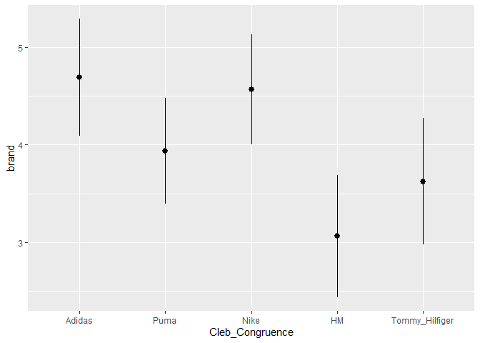
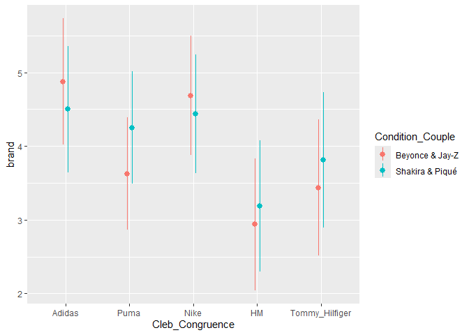

# Repeated Measures ANOVA
Mauricio Garnier-Villarreal & Denise J. Roth, FSW VU Amsterdam
2023-07-26

- [Introduction](#introduction)
- [Set up the R Session](#set-up-the-r-session)
- [Import the Dataset](#import-the-dataset)
  - [Prepare the Dataset](#prepare-the-dataset)
  - [Convert the Dataframe from Wide to Long
    Format](#convert-the-dataframe-from-wide-to-long-format)
- [Perform Repeated Measure
  Analysis](#perform-repeated-measure-analysis)
  - [Effect size](#effect-size)
  - [Post-hoc pairwise comparisons](#post-hoc-pairwise-comparisons)
  - [Plot group means](#plot-group-means)
  - [Post-hoc planned comparisons](#post-hoc-planned-comparisons)
- [Mixed design RM-ANOVA](#mixed-design-rm-anova)
  - [Effect size](#effect-size-1)
  - [Post-hoc comparisons](#post-hoc-comparisons)
  - [Plot post-hoc](#plot-post-hoc)
  - [Post-hoc planned comparisons](#post-hoc-planned-comparisons-1)
  - [Interpretation](#interpretation)

# Introduction

As social scientists delving into the world of statistics, it’s
essential to grasp various statistical techniques commonly used in
research. One such technique is the Repeated Measures Analysis of
Variance (ANOVA). In this tutorial, we’ll explore what a repeated
measures ANOVA is, when to use it, and how it can be applied to analyze
data in research studies. So let’s dive in!

Repeated Measures ANOVA (RM-ANOVA) is a statistical method used to
analyze data when the same subjects or participants are measured on
multiple occasions or under different conditions. It allows researchers
to examine whether there are significant differences across these
repeated measurements or conditions while accounting for the
interdependence of the data. It is particularly useful when you have
data that involve multiple measurements taken from the same subjects or
participants. It is commonly used in various fields such as psychology,
biology, medicine, education, and social sciences. You would typically
choose a RM-ANOVA over other analysis methods when you either have a:

1.  within-subject design: This means that each participant in your
    study is measured or tested under different conditions or at
    multiple time points. For example, measuring the performance of
    students before and after an intervention or assessing the effects
    of different treatment conditions on patients’ blood pressure. Or:

2.  You want to compare the means of three or more conditions: RM-ANOVA
    is specifically designed to analyze data with three or more levels
    or conditions. If you have only two conditions, a paired t-test
    might be more appropriate.

# Set up the R Session

When we start working in R, we always need to setup our session. For
this we need to set our working directory. In this case I am doing that
for the folder that holds the downloaded dataset for this example.

``` r
setwd("YOURWORKINGDIRECTORY")
```

The next step for setting up our session will be to load the packages
that we will be using. We will use a packages like `dplyr` for data
management, as well as the `rio` package for importing our data.
Additionally, we need the `reshape2` to reshape our data. Finally, the
packages `afex`, and `marginaleffects` are used for conducting our
analyses. Note that you potentially need to install some of these
packages, however.

``` r
library(rio)
library(dplyr)
library(reshape2)
library(marginaleffects)
library(afex)
library(sjlabelled)
library(effectsize)
```

# Import the Dataset

We are importing a `.sav` file from Qualtrics. This data shows an
example from a pre-test which was setup to determine which of five
different brands (Adidas, Puma, Nike, H&M, Tommy Hilfiger) had the best
fit with two celebrity influencer couples (Beyoncé and Jay Z and Shakira
and Piqué) for the promotion of a brand on Instagram. Participants rated
the congruence of five sports brands with one of the celebrity couples
(randomized), measured using a 7-Point Likert scale ranging from one
(strongly disagree) to seven (strongly agree). Participants were also
asked their agreement level to statements such as “Adidas is a good
match with the celebrities” or “Puma is a good match with the
celebrities” etc.. The congruence was the within factor with five levels
(Adidas, Puma, Nike, H&M, Tommy Hilfiger) and the between factor was the
type of celebrity couple (Beyonce & Jay-Z versus Shakira & Piqué). In
total, 32 participants filled in the survey.

``` r
d <- import("Native advertisement - pretest wide.sav")
```

## Prepare the Dataset

For easiness, we want to change the variable name to the respective
brand name, we can see the band associated to each variable from the
attributes of the data with the `get_label()` function from the package
`sjlabelled`

``` r
get_label(d)
```

                                                                                                                                                          Cleb_Congruence_1 
            "How will the following brands match these celebrities when they promote this brand on their Instagram account? - Adidas is a good match with the celebrities." 
                                                                                                                                                          Cleb_Congruence_2 
              "How will the following brands match these celebrities when they promote this brand on their Instagram account? - Puma is a good match with the celebrities." 
                                                                                                                                                          Cleb_Congruence_3 
              "How will the following brands match these celebrities when they promote this brand on their Instagram account? - Nike is a good match with the celebrities." 
                                                                                                                                                          Cleb_Congruence_4 
               "How will the following brands match these celebrities when they promote this brand on their Instagram account? - H&M is a good match with the celebrities." 
                                                                                                                                                          Cleb_Congruence_5 
    "How will the following brands match these celebrities when they promote this brand on their Instagram account? - Tommy Hilfiger is a good match with the celebrities." 
                                                                                                                                                           Condition_Couple 
                                                                                                                                                                         "" 

From this we have the necessary information to rename them, so that the
variable name match the brand

``` r
colnames(d) <- c("Adidas","Puma","Nike","HM","Tommy_Hilfiger","Condition_Couple")
```

Then we will recode the labels of the couple variable, so that it
explicitly mentions the couple instead of using codes 0 - 1. We will do
that with `recode()` function as follows

``` r
d$Condition_Couple <- car::recode(d$Condition_Couple, 
                                  "0='Beyonce & Jay-Z';
                                  1= 'Shakira & Piqué' ")
```

In these next steps, we first create a variable that contains a
participant ID and we also change the classes for some of the variables
included, as our model will ultimately need to know how to treat which
variables in its calculations.

With the `mutate()` function, we give it the data set, and then can
create a new variable `id` that represents the subject id, in function
of the data row numbers.

Then, with the same function, we can give a multiple variables within
the `across` function, and then change the data type to numeric and
factor respectively. This way, we have a clear defined user ids, and `R`
know which variables to treat as numeric and factor for future uses

``` r
d_id <- mutate(d, id = row_number())

d_id <- mutate(d_id, across(c(Adidas, Puma, 
                 Nike, HM, 
                 Tommy_Hilfiger), as.numeric))
d_id <- mutate(d_id, across(c(Condition_Couple,id), as.factor))
```

## Convert the Dataframe from Wide to Long Format

In R, data frames can be organized in two different formats: wide and
long. Each format has its advantages and is suitable for different types
of analyses. Let’s explore the differences between these formats. In the
**wide** format, each subject’s measurements or observations are
represented in a single row, and each variable or condition has its own
column. This format is often used when data is initially collected or
entered. Advantages of the wide format include simplicity and ease of
data entry. It is also suitable for certain analyses like generalized
linear models that assumed independence of observations, as each row is
independent of each other. However, for repeated measures analyses, the
long format is preferred and necessary, as the assumption of
independence of observations is violated, so we need to model it.

In the **long** format, each observation is represented in a separate
row, and a single column is used to indicate the condition or variable,
so that each subject will have as many rows as time points. This format
is particularly useful when dealing with repeated measures or
within-subjects designs. Each subject’s measurements are stacked on top
of each other, allowing for easy identification of repeated measures and
within-subjects factors. This format facilitates the analysis of
dependencies and enables appropriate statistical techniques such as
RM-ANOVA. RM-ANOVA requires a long format because it relies on the
dependence of measurements taken from the same subjects. By organizing
the data in a long format, we explicitly represent the repeated
measurements and their associated conditions. This allows the
statistical analysis to properly account for the within-subjects
variability.

In a long format, each row represents a unique measurement, and the
subject identifier ensures that the measurements are linked to the
corresponding individuals. This format provides the necessary structure
for conducting analyses that involve repeated measures, as it allows for
the identification of within-subjects factors, the calculation of
subject-specific means, and the assessment of the differences between
conditions.

By using the long format in RM-ANOVA, we can effectively examine the
effects of the within-subjects factors while accounting for the
dependency between measurements. The analysis can then yield valuable
insights into the significance of the conditions and their impact on the
measured outcome.

Let us first view what the our initially **wide** data frame looks like,
reshape it to the long format and then take a look again!

With the `melt()` function we can reshape it, first need to give the
wide format data set (`d_id`), then in the `id.vars` argument we provide
the name of the variables that do not change over time, and for the
`measure.vars` argument we give the name of the variables that change
over time. Then, in `variable.name` we give the values that the **time**
variables will have. Finally, in the `value.name` we have the name of
the variable that reports the score at each time point

``` r
head(d_id)
```

      Adidas Puma Nike HM Tommy_Hilfiger Condition_Couple id
    1      6    4    5  4              4  Beyonce & Jay-Z  1
    2      6    4    6  1              1  Beyonce & Jay-Z  2
    3      2    2    2  2              6  Beyonce & Jay-Z  3
    4      6    5    6  2              2  Beyonce & Jay-Z  4
    5      5    3    6  2              2  Beyonce & Jay-Z  5
    6      2    4    6  3              3  Shakira & Piqué  6

``` r
d_long <- melt(d_id,id.vars=c("id", "Condition_Couple"),
measure.vars=c("Adidas","Puma","Nike","HM","Tommy_Hilfiger"),
          variable.name="Cleb_Congruence", 
          value.name="brand")

head(d_long)
```

      id Condition_Couple Cleb_Congruence brand
    1  1  Beyonce & Jay-Z          Adidas     6
    2  2  Beyonce & Jay-Z          Adidas     6
    3  3  Beyonce & Jay-Z          Adidas     2
    4  4  Beyonce & Jay-Z          Adidas     6
    5  5  Beyonce & Jay-Z          Adidas     5
    6  6  Shakira & Piqué          Adidas     2

# Perform Repeated Measure Analysis

Now, it is time to actually perform a RM-ANOVA using functions from the
`afex` package that we loaded earlier. In addition to that, we can also
perform post-hoc tests.

First, with the `aov_ez` function we will run the RM-ANOVA. we need to
provide the long format data set (`d_long`), the dependent variable
(`brand`), the subject id (`id`), the within subject condition
(`Cleb_Congruence`).

``` r
model <- aov_ez(data=d_long,
                id = "id",
                dv = "brand",
                within = "Cleb_Congruence")
summary(model)
```


    Univariate Type III Repeated-Measures ANOVA Assuming Sphericity

                    Sum Sq num Df Error SS den Df  F value    Pr(>F)    
    (Intercept)     2528.1      1    199.1     31 393.6268 < 2.2e-16 ***
    Cleb_Congruence   57.9      4    258.9    124   6.9328 4.534e-05 ***
    ---
    Signif. codes:  0 '***' 0.001 '**' 0.01 '*' 0.05 '.' 0.1 ' ' 1


    Mauchly Tests for Sphericity

                    Test statistic p-value
    Cleb_Congruence        0.67041 0.22771


    Greenhouse-Geisser and Huynh-Feldt Corrections
     for Departure from Sphericity

                     GG eps Pr(>F[GG])    
    Cleb_Congruence 0.81888   0.000174 ***
    ---
    Signif. codes:  0 '***' 0.001 '**' 0.01 '*' 0.05 '.' 0.1 ' ' 1

                       HF eps   Pr(>F[HF])
    Cleb_Congruence 0.9271222 7.779328e-05

The output `summary(model)` present different sections, first from the
`ANOVA Assuming Sphericity` section we can interpret that ….

Second from the test of `Mauchly Tests for Sphericity` section we can
interpret that …

And third, for the `Greenhouse-Geisser and Huynh-Feldt Corrections`
correction section we can interpret that ….

## Effect size

We also need to describe the results in function of measures of effect
size. For ANOVA family of analysis, we recommend to use $\eta^2_f$ and
$\omega^2_f$. These measures estimate the proportion of variance
explained by each predictor (similar to $R^2$). Where $\eta^2_f$ is more
positively bias (similar to $R^2$), and $\omega^2_f$ is a more
conservative measure.

When you have multiple predictors, you will also see the **partial**
version of these measures ($\eta^2_p$ and $\omega^2_p$). These will most
commonly present higher effect sizes, as they are the proportion of
explained variance **that is not predicted by any other predictors**.
So, will show higher effect sizes because they are not in function of
the total variance of the outcome, but the residual variance.

To estimate these measure we will use the `effectsize` package
functions, just provide the RM-ANOVA model to the respective functions,
notice that we set `partial = FALSE` to estimate the full measure
instead of partial one.

``` r
eta_squared(model, partial = FALSE)
```

    # Effect Size for ANOVA (Type III)

    Parameter       | Eta2 |       95% CI
    -------------------------------------
    Cleb_Congruence | 0.11 | [0.02, 1.00]

    - One-sided CIs: upper bound fixed at [1.00].

``` r
omega_squared(model, partial = FALSE)
```

    # Effect Size for ANOVA (Type III)

    Parameter       | Omega2 |       95% CI
    ---------------------------------------
    Cleb_Congruence |   0.09 | [0.01, 1.00]

    - One-sided CIs: upper bound fixed at [1.00].

When the model has only one predictor, these measures are equivalent to
the model $R^2$. In this case the show that around an 11%
($\eta^2_f = 0.11$) of the variance is explained by the `Cleb_Conguence`
variable, or conservatively 9% ($\omega^2_f = 0.09$)

## Post-hoc pairwise comparisons

We can start by looking at the estimated means for each group, we can do
this with the `avg_predictions` function. We need to provide it with the
model, and for which predictor in the model you wish to see predicted
means with the `by` argument

``` r
avg_predictions(model, by = c("Cleb_Congruence"))
```


     Cleb_Congruence Estimate Std. Error     z Pr(>|z|)     S 2.5 % 97.5 %
      Adidas             4.69      0.306 15.32   <0.001 173.6  4.09   5.29
      Puma               3.94      0.277 14.24   <0.001 150.4  3.40   4.48
      Nike               4.56      0.287 15.88   <0.001 186.3  4.00   5.13
      HM                 3.06      0.317  9.65   <0.001  70.8  2.44   3.68
      Tommy_Hilfiger     3.62      0.329 11.01   <0.001  91.3  2.98   4.27

    Columns: Cleb_Congruence, estimate, std.error, statistic, p.value, s.value, conf.low, conf.high 

Once we have established an overall model effect, we would be interested
in testing specific comparisons, such as **Where do we see specific mean
differences?**. We will do the post-hoc tests with the
`marginalleffects` package, this will tell you how the values of the
outcome predicted by the model change when we manipulate the predictors
(and their pairwise combinations)

For this function, we provide the RM-ANOVA object (`model`), the group
variable we want to estimate (`list(Cleb_Congruence = "pairwise")`) as
well as specifying that we are requesting the pairwise comparisons.
Additionally, we are equating the `fdr` false discovery rate $p$-value
correction, asking for the tests and CI to be presented for the 95%
confidence level. We are specifying the degrees of freedom so the
function uses the $t-test$ instead of the $z-test$, we get these from
the handy function `insight::get_df()` which requires the RN-ANOVA
object

``` r
acmp <- avg_comparisons(model,
                       variables = list(Cleb_Congruence = "pairwise"), 
                       p_adjust = "fdr", conf_level = 0.95,
                       df = insight::get_df(model))

summary(acmp)
```


                Term                Contrast Estimate Std. Error      t Pr(>|t|)
     Cleb_Congruence Puma - Adidas             -0.750      0.336 -2.232   0.0386
     Cleb_Congruence Nike - Adidas             -0.125      0.361 -0.346   0.7298
     Cleb_Congruence HM - Adidas               -1.625      0.401 -4.053   <0.001
     Cleb_Congruence Tommy_Hilfiger - Adidas   -1.063      0.466 -2.278   0.0386
     Cleb_Congruence Nike - Puma                0.625      0.268  2.328   0.0386
     Cleb_Congruence HM - Puma                 -0.875      0.320 -2.735   0.0232
     Cleb_Congruence Tommy_Hilfiger - Puma     -0.313      0.371 -0.841   0.4461
     Cleb_Congruence HM - Nike                 -1.500      0.339 -4.425   <0.001
     Cleb_Congruence Tommy_Hilfiger - Nike     -0.938      0.381 -2.462   0.0373
     Cleb_Congruence Tommy_Hilfiger - HM        0.563      0.333  1.690   0.1163
        S  Df
      4.7 154
      0.5 154
     11.3 154
      4.7 154
      4.7 154
      5.4 154
      1.2 154
     12.4 154
      4.7 154
      3.1 154

    Columns: term, contrast, estimate, std.error, statistic, p.value, s.value, df 

From these post-host, we can interpret that we reject the null
hypothesis of equal means over conditions for the comparisons with an
adjusted $p-value < .05$, as the most commonly use $\alpha$ level.

Notice we are using `fdr` $p$-value correcting, instead of more
conservative ones like Bonferroni.

## Plot group means

Then we can visualize these difference by plotting the means across
conditions. We can do this with the visualization conditions of the
`marginaeffects` package.

First, we can see the model prediction, the average predictions based on
our model, across the condition of interest, with the
`avg_predictions()` function

Here we see the mode predicted means for each condition, as well as the
measure of variability (SE)

``` r
p <- avg_predictions(model, by = "Cleb_Congruence")
p
```


     Cleb_Congruence Estimate Std. Error     z Pr(>|z|)     S 2.5 % 97.5 %
      Adidas             4.69      0.306 15.32   <0.001 173.6  4.09   5.29
      Puma               3.94      0.277 14.24   <0.001 150.4  3.40   4.48
      Nike               4.56      0.287 15.88   <0.001 186.3  4.00   5.13
      HM                 3.06      0.317  9.65   <0.001  70.8  2.44   3.68
      Tommy_Hilfiger     3.62      0.329 11.01   <0.001  91.3  2.98   4.27

    Columns: Cleb_Congruence, estimate, std.error, statistic, p.value, s.value, conf.low, conf.high 

Then we can plot it with the function `plot_predictions`, based on the
model, and the error bars representing the variability

``` r
plot_predictions(model, by = "Cleb_Congruence")
```



The visualizations can be helpful to understand trends, and be clear on
the direction of the differences.

Note that this plot is a `ggplot2` type of plot, so you can edit it
accordingly.

## Post-hoc planned comparisons

In many cases you will not be interested in all pairwise comparisons,
but on planned comparisons, or specific contrasts tests. For this we can
use the `hypotheses()` function. First we can ask for how is the
function naming the relevant parameters

``` r
hypotheses(model)
```


     Term Estimate Std. Error     z Pr(>|z|)     S 2.5 % 97.5 %
       b1     4.69      0.306 15.32   <0.001 173.6  4.09   5.29
       b2     3.94      0.277 14.24   <0.001 150.4  3.40   4.48
       b3     4.56      0.287 15.88   <0.001 186.3  4.00   5.13
       b4     3.06      0.317  9.65   <0.001  70.8  2.44   3.68
       b5     3.62      0.329 11.01   <0.001  91.3  2.98   4.27

    Columns: term, estimate, std.error, statistic, p.value, s.value, conf.low, conf.high 

Here we see that the model extracts the mean for each of the five
groups, and we see that this match the factor variable

``` r
coef(model$lm)
```

                Adidas   Puma   Nike     HM Tommy_Hilfiger
    (Intercept) 4.6875 3.9375 4.5625 3.0625          3.625

Now, given the type of brands, we can think of comparing **sports**
(Adidas, Puma, Nike) brands against **casual** (H&M, Tommy Hilfiger)
brands. Here we will show hoe to do this in two ways.

In the first approach we will write up the formula to compare the groups
in function of the parameters from `hypotheses(model)`. Here we average
the group mean for sporty and casual brands

``` r
hypotheses(model, "(b1+b2+b3)/3 = (b4+b5)/2")
```


                         Term Estimate Std. Error    z Pr(>|z|)    S 2.5 % 97.5 %
     (b1+b2+b3)/3 = (b4+b5)/2     1.05      0.289 3.64   <0.001 11.8 0.485   1.62

    Columns: term, estimate, std.error, statistic, p.value, s.value, conf.low, conf.high 

In the second method, we will write the hypothesis with the commonly use
**weights**, where we set group parameters based on the sign of the
weights. So the first 3 groups will be set as one, and the last 2 will
be grouped together. This way positive weights will be compared agaiant
negative weights.

``` r
hypotheses(model, hypothesis = c(1/3,1/3,1/3,-1/2,-1/2))
```


       Term Estimate Std. Error    z Pr(>|z|)    S 2.5 % 97.5 %
     custom     1.05      0.289 3.64   <0.001 11.8 0.485   1.62

    Columns: term, estimate, std.error, statistic, p.value, s.value, conf.low, conf.high 

Here we reject the null hypothesis of sporty and casual brands to have
the same level of congruence.

You can also build a matrix with multiple contrasts, to test more than
one hypothesis at the time. For this example, We are adding a hypothesis
for each type of brand mean being equal to 0, and then the comparison
between them (previous example)

Note that for the matrix, each column represents a different hypothesis
and each row represents a group

``` r
cont_mat <- cbind(c(1/3,1/3,1/3,0,0),
                  c(0,0,0,1/2,1/2),
                  c(1/3,1/3,1/3,-1/2,-1/2))
colnames(cont_mat) <- c("Sport=0","Casual=0","Sport=Casual")
cont_mat
```

           Sport=0 Casual=0 Sport=Casual
    [1,] 0.3333333      0.0    0.3333333
    [2,] 0.3333333      0.0    0.3333333
    [3,] 0.3333333      0.0    0.3333333
    [4,] 0.0000000      0.5   -0.5000000
    [5,] 0.0000000      0.5   -0.5000000

``` r
hypotheses(model, hypothesis = cont_mat)
```


             Term Estimate Std. Error     z Pr(>|z|)     S 2.5 % 97.5 %
     Sport=0          4.40      0.222 19.83   <0.001 288.2 3.961   4.83
     Casual=0         3.34      0.277 12.06   <0.001 108.9 2.800   3.89
     Sport=Casual     1.05      0.289  3.64   <0.001  11.8 0.485   1.62

    Columns: term, estimate, std.error, statistic, p.value, s.value, conf.low, conf.high 

Note that for contrast weights, if you want the means in the metric of
the observed variable, you need to make sure the weights sum up to 1.
Otherwise the interpretation will be in another metric.

# Mixed design RM-ANOVA

A common next step in RM-ANOVA, is to also include a between subject
predictor, this way accounting for both within and between condition
differences. As we have within conditions, still requires to account for
the observations dependencies.

For this we will extend the use of the `aov_ez` function, will start
with the same arguments as before. The only difference is that we are
adding a between subject predictor (`Condition_Couple`) in the `between`
argument. This by default will include the interaction by within and
between variables.

``` r
model2 <- aov_ez(data=d_long,
                id = "id",
                dv = "brand",
                within = "Cleb_Congruence", 
                between = "Condition_Couple")
```

    Contrasts set to contr.sum for the following variables: Condition_Couple

``` r
summary(model2)
```


    Univariate Type III Repeated-Measures ANOVA Assuming Sphericity

                                      Sum Sq num Df Error SS den Df  F value
    (Intercept)                      2528.10      1   198.47     30 382.1287
    Condition_Couple                    0.63      1   198.47     30   0.0945
    Cleb_Congruence                    57.90      4   253.15    120   6.8615
    Condition_Couple:Cleb_Congruence    5.75      4   253.15    120   0.6814
                                        Pr(>F)    
    (Intercept)                      < 2.2e-16 ***
    Condition_Couple                    0.7607    
    Cleb_Congruence                  5.225e-05 ***
    Condition_Couple:Cleb_Congruence    0.6062    
    ---
    Signif. codes:  0 '***' 0.001 '**' 0.01 '*' 0.05 '.' 0.1 ' ' 1


    Mauchly Tests for Sphericity

                                     Test statistic p-value
    Cleb_Congruence                         0.64328 0.18542
    Condition_Couple:Cleb_Congruence        0.64328 0.18542


    Greenhouse-Geisser and Huynh-Feldt Corrections
     for Departure from Sphericity

                                      GG eps Pr(>F[GG])    
    Cleb_Congruence                  0.81077  0.0002079 ***
    Condition_Couple:Cleb_Congruence 0.81077  0.5765634    
    ---
    Signif. codes:  0 '***' 0.001 '**' 0.01 '*' 0.05 '.' 0.1 ' ' 1

                                       HF eps   Pr(>F[HF])
    Cleb_Congruence                  0.920655 9.310028e-05
    Condition_Couple:Cleb_Congruence 0.920655 5.944389e-01

The output `summary(model2)` present different sections, first from the
`ANOVA Assuming Sphericity` section we can interpret that ….

Second from the test of `Mauchly Tests for Sphericity` section we can
interpret that …

And third, for the `Greenhouse-Geisser and Huynh-Feldt Corrections`
correction section we can interpret that ….

## Effect size

Rememeber that when you have multiple predictors, you will also see the
**partial** version of these measures ($\eta^2_p$ and $\omega^2_p$).
These will most commonly present higher effect sizes, as they are the
proportion of explained variance **that is not predicted by any other
predictors**. So, will show higher effect sizes because they are not in
function of the total variance of the outcome, but the residual
variance.

To estimate these measure we will use the `effectsize` package
functions, just provide the RM-ANOVA model to the respective functions,
notice that we set `partial = FALSE` to estimate the full measure
instead of partial one.

``` r
eta_squared(model2, partial = FALSE)
```

    # Effect Size for ANOVA (Type III)

    Parameter                        |     Eta2 |       95% CI
    ----------------------------------------------------------
    Condition_Couple                 | 1.21e-03 | [0.00, 1.00]
    Cleb_Congruence                  |     0.11 | [0.02, 1.00]
    Condition_Couple:Cleb_Congruence |     0.01 | [0.00, 1.00]

    - One-sided CIs: upper bound fixed at [1.00].

``` r
omega_squared(model2, partial = FALSE)
```

    # Effect Size for ANOVA (Type III)

    Parameter                        | Omega2 |       95% CI
    --------------------------------------------------------
    Condition_Couple                 |   0.00 | [0.00, 1.00]
    Cleb_Congruence                  |   0.09 | [0.01, 1.00]
    Condition_Couple:Cleb_Congruence |   0.00 | [0.00, 1.00]

    - One-sided CIs: upper bound fixed at [1.00].

In this case the show that around an 11% ($\eta^2_f = 0.11$) of the
variance is explained by the `Cleb_Conguence` variable, or
conservatively 9% ($\omega^2_f = 0.09$). And the variable
`Condition_Couple` and the interaction functionally have no effect.

You can estimate the partial measures with the argument `partial=TRUE`

``` r
eta_squared(model2, partial = TRUE)
```

    # Effect Size for ANOVA (Type III)

    Parameter                        | Eta2 (partial) |       95% CI
    ----------------------------------------------------------------
    Condition_Couple                 |       3.14e-03 | [0.00, 1.00]
    Cleb_Congruence                  |           0.19 | [0.07, 1.00]
    Condition_Couple:Cleb_Congruence |           0.02 | [0.00, 1.00]

    - One-sided CIs: upper bound fixed at [1.00].

``` r
omega_squared(model2, partial = TRUE)
```

    # Effect Size for ANOVA (Type III)

    Parameter                        | Omega2 (partial) |       95% CI
    ------------------------------------------------------------------
    Condition_Couple                 |             0.00 | [0.00, 1.00]
    Cleb_Congruence                  |             0.10 | [0.01, 1.00]
    Condition_Couple:Cleb_Congruence |             0.00 | [0.00, 1.00]

    - One-sided CIs: upper bound fixed at [1.00].

In this case the show that around an 19% ($\eta^2_f = 0.19$) of the
variance that is not explained by other predictors is explained by the
`Cleb_Conguence` variable, or conservatively 10% ($\omega^2_f = 0.10$).
And the variable `Condition_Couple` and the interaction functionally
have no effect.

## Post-hoc comparisons

Now, the post-hocs can be done in 3 ways, first for the within variable,
second for the between variable, and third with the interaction between
them

First, we can estimate the pairwise comparisons (ignoring the
interactions)by including both the between and within variables in the
`variables` argument and asking for the pairwise comparisons.

``` r
acmp_1 <- avg_comparisons(model2,
                          variables = list(Cleb_Congruence = "pairwise", Condition_Couple = "pairwise"),
                          p_adjust = "fdr", conf_level = 0.95,
                          df = insight::get_df(model2))

summary(acmp_1)
```


                 Term                          Contrast Estimate Std. Error      t
     Cleb_Congruence  Puma - Adidas                       -0.750      0.329 -2.279
     Cleb_Congruence  Nike - Adidas                       -0.125      0.367 -0.341
     Cleb_Congruence  HM - Adidas                         -1.625      0.404 -4.026
     Cleb_Congruence  Tommy_Hilfiger - Adidas             -1.063      0.469 -2.264
     Cleb_Congruence  Nike - Puma                          0.625      0.261  2.395
     Cleb_Congruence  HM - Puma                           -0.875      0.323 -2.706
     Cleb_Congruence  Tommy_Hilfiger - Puma               -0.313      0.377 -0.829
     Cleb_Congruence  HM - Nike                           -1.500      0.342 -4.392
     Cleb_Congruence  Tommy_Hilfiger - Nike               -0.938      0.383 -2.448
     Cleb_Congruence  Tommy_Hilfiger - HM                  0.563      0.338  1.664
     Condition_Couple Shakira & Piqué - Beyonce & Jay-Z    0.125      0.407  0.307
     Pr(>|t|)    S  Df
       0.0393  4.7 149
       0.7590  0.4 149
       <0.001 11.0 149
       0.0393  4.7 149
       0.0393  4.7 149
       0.0279  5.2 149
       0.4991  1.0 149
       <0.001 12.1 149
       0.0393  4.7 149
       0.1351  2.9 149
       0.7590  0.4 149

    Columns: term, contrast, estimate, std.error, statistic, p.value, s.value, df 

From `summary(acmp_1)` we will have the estimated mean difference for
each pair comparison, and we can reject the null hypothesis for
comparisons where the adjusted $p -value < .05$

If we want to estimate the interacting post-hoc, across between and
within conditions. We can include the between condition in the `by`
argument. This way the results will include the pairwise comparisons
across `Cleb_Congruence` within conditions, for each `Condition_Couple`
between condition

``` r
acmp_2 <- avg_comparisons(model2,
                          variables = list(Cleb_Congruence = "pairwise"), 
                          p_adjust = "fdr", conf_level = 0.95, 
                          by = "Condition_Couple",
                          df = insight::get_df(model2))

summary(acmp_2)
```


                Term                            Contrast Condition_Couple Estimate
     Cleb_Congruence mean(Puma) - mean(Adidas)            Beyonce & Jay-Z  -1.2500
     Cleb_Congruence mean(Puma) - mean(Adidas)            Shakira & Piqué  -0.2500
     Cleb_Congruence mean(Nike) - mean(Adidas)            Beyonce & Jay-Z  -0.1875
     Cleb_Congruence mean(Nike) - mean(Adidas)            Shakira & Piqué  -0.0625
     Cleb_Congruence mean(HM) - mean(Adidas)              Beyonce & Jay-Z  -1.9375
     Cleb_Congruence mean(HM) - mean(Adidas)              Shakira & Piqué  -1.3125
     Cleb_Congruence mean(Tommy_Hilfiger) - mean(Adidas)  Beyonce & Jay-Z  -1.4375
     Cleb_Congruence mean(Tommy_Hilfiger) - mean(Adidas)  Shakira & Piqué  -0.6875
     Cleb_Congruence mean(Nike) - mean(Puma)              Beyonce & Jay-Z   1.0625
     Cleb_Congruence mean(Nike) - mean(Puma)              Shakira & Piqué   0.1875
     Cleb_Congruence mean(HM) - mean(Puma)                Beyonce & Jay-Z  -0.6875
     Cleb_Congruence mean(HM) - mean(Puma)                Shakira & Piqué  -1.0625
     Cleb_Congruence mean(Tommy_Hilfiger) - mean(Puma)    Beyonce & Jay-Z  -0.1875
     Cleb_Congruence mean(Tommy_Hilfiger) - mean(Puma)    Shakira & Piqué  -0.4375
     Cleb_Congruence mean(HM) - mean(Nike)                Beyonce & Jay-Z  -1.7500
     Cleb_Congruence mean(HM) - mean(Nike)                Shakira & Piqué  -1.2500
     Cleb_Congruence mean(Tommy_Hilfiger) - mean(Nike)    Beyonce & Jay-Z  -1.2500
     Cleb_Congruence mean(Tommy_Hilfiger) - mean(Nike)    Shakira & Piqué  -0.6250
     Cleb_Congruence mean(Tommy_Hilfiger) - mean(HM)      Beyonce & Jay-Z   0.5000
     Cleb_Congruence mean(Tommy_Hilfiger) - mean(HM)      Shakira & Piqué   0.6250
     Std. Error      t Pr(>|t|)   S  Df
          0.465 -2.685  0.04033 4.6 149
          0.465 -0.537  0.72019 0.5 149
          0.519 -0.361  0.76370 0.4 149
          0.519 -0.120  0.90434 0.1 149
          0.571 -3.395  0.00881 6.8 149
          0.571 -2.300  0.05716 4.1 149
          0.664 -2.166  0.07086 3.8 149
          0.664 -1.036  0.43125 1.2 149
          0.369  2.879  0.03051 5.0 149
          0.369  0.508  0.72019 0.5 149
          0.457 -1.503  0.26969 1.9 149
          0.457 -2.323  0.05716 4.1 149
          0.533 -0.352  0.76370 0.4 149
          0.533 -0.821  0.55077 0.9 149
          0.483 -3.623  0.00798 7.0 149
          0.483 -2.588  0.04246 4.6 149
          0.542 -2.308  0.05716 4.1 149
          0.542 -1.154  0.41712 1.3 149
          0.478  1.046  0.43125 1.2 149
          0.478  1.307  0.35128 1.5 149

    Columns: term, contrast, Condition_Couple, estimate, std.error, statistic, p.value, s.value, df, predicted, predicted_hi, predicted_lo 

This turns into larger post-hoc results, so be careful in its reading
and interpretation

## Plot post-hoc

For plotting the post-hoc results when including between and within
factors, we can do it the same as before one predictor at the time, or
looking the the interaction.

We can see the model predicted means for each group combination by
including both predictors in the `by` argument. If you include only one
predictor, you will get the predictions for only that one, ignoring the
interaction.

Here we get the model predictions across both predictors, accounting for
the interaction.

``` r
p2 <- avg_predictions(model2,
                      by = c("Cleb_Congruence", "Condition_Couple") )
p2
```


     Cleb_Congruence Condition_Couple Estimate Std. Error     z Pr(>|z|)    S 2.5 %
      Adidas          Beyonce & Jay-Z     4.88      0.437 11.15   <0.001 93.5  4.02
      Puma            Beyonce & Jay-Z     3.63      0.389  9.31   <0.001 66.1  2.86
      Nike            Beyonce & Jay-Z     4.69      0.412 11.38   <0.001 97.3  3.88
      HM              Beyonce & Jay-Z     2.94      0.455  6.46   <0.001 33.1  2.05
      Tommy_Hilfiger  Beyonce & Jay-Z     3.44      0.471  7.30   <0.001 41.7  2.51
      Adidas          Shakira & Piqué     4.50      0.437 10.29   <0.001 80.1  3.64
      Puma            Shakira & Piqué     4.25      0.389 10.92   <0.001 89.8  3.49
      Nike            Shakira & Piqué     4.44      0.412 10.78   <0.001 87.6  3.63
      HM              Shakira & Piqué     3.19      0.455  7.01   <0.001 38.6  2.30
      Tommy_Hilfiger  Shakira & Piqué     3.81      0.471  8.10   <0.001 50.7  2.89
     97.5 %
       5.73
       4.39
       5.49
       3.83
       4.36
       5.36
       5.01
       5.24
       4.08
       4.74

    Columns: Cleb_Congruence, Condition_Couple, estimate, std.error, statistic, p.value, s.value, conf.low, conf.high 

Then, we can plot the estimated means, accounting for the interactions.
With the same function as before, but by including both predictors in
the `by` argument. The function by default will choose the between
subject variable as the condition to separate the plot by group (based
on color)

``` r
plot_predictions(model2, by = c("Cleb_Congruence","Condition_Couple") )
```



## Post-hoc planned comparisons

(Note, I have no theoretical reason for meaningful comparisons here, so
I am writing some as understandable examples)

For planned comparisons while having cross factors we will use the
`marginal_means` function, which estimates all cross factor means
(similar to `avg_predictions`). If you run the function with the default
arguments it will estimate the marginal means for each factor, and we
need to add the argument `cross=T` to estimate all possible cross
marginal means.

``` r
mm <- marginal_means(model2, cross=T)
data.frame(mm)
```

       rowid Condition_Couple Cleb_Congruence estimate std.error statistic
    1      1  Beyonce & Jay-Z          Adidas   4.8750 0.4372023 11.150445
    2      2  Beyonce & Jay-Z            Puma   3.6250 0.3893103  9.311339
    3      3  Beyonce & Jay-Z            Nike   4.6875 0.4117417 11.384564
    4      4  Beyonce & Jay-Z              HM   2.9375 0.4550069  6.455947
    5      5  Beyonce & Jay-Z  Tommy_Hilfiger   3.4375 0.4707596  7.302029
    6      6  Shakira & Piqué          Adidas   4.5000 0.4372023 10.292719
    7      7  Shakira & Piqué            Puma   4.2500 0.3893103 10.916742
    8      8  Shakira & Piqué            Nike   4.4375 0.4117417 10.777387
    9      9  Shakira & Piqué              HM   3.1875 0.4550069  7.005389
    10    10  Shakira & Piqué  Tommy_Hilfiger   3.8125 0.4707596  8.098614
            p.value  s.value conf.low conf.high brand id wts
    1  7.124910e-29 93.50304 4.018099  5.731901 3.975  1   1
    2  1.262310e-20 66.10250 2.861966  4.388034 3.975  1   1
    3  4.991735e-30 97.33830 3.880501  5.494499 3.975  1   1
    4  1.075446e-10 33.11435 2.045703  3.829297 3.975  1   1
    5  2.834607e-13 41.68192 2.514828  4.360172 3.975  1   1
    6  7.599981e-25 80.12221 3.643099  5.356901 3.975  1   1
    7  9.587335e-28 89.75286 3.486966  5.013034 3.975  1   1
    8  4.402126e-27 87.55386 3.630501  5.244499 3.975  1   1
    9  2.463010e-12 38.56271 2.295703  4.079297 3.975  1   1
    10 5.558899e-16 50.67605 2.889828  4.735172 3.975  1   1

Once we have seen the cross means, we can build comparisons with weights
vectors. For example if we want to compare **Casual-Beyonce & Jay-Z** vs
**Casual-Shakira & Piqué** we can use the following weight vector in the
`hypothesis` argument

``` r
mm2 <- marginal_means(model2, cross=T, 
                      hypothesis = c(0,0,0,1/2,1/2,0,0,0,-1/2,-1/2))
mm2
```


       Term   Mean Std. Error      z Pr(>|z|)   S 2.5 % 97.5 %
     custom -0.313      0.561 -0.557    0.577 0.8 -1.41  0.786

    Columns: term, estimate, std.error, statistic, p.value, s.value, conf.low, conf.high 

Here we see that we fail to reject the null hypothesis of both groups
having the same marginal mean.

And, we can also add multiple comparisons with a matrix of weights. In
this example, we are adding the same hypothesis as before, and adding
**Sporty-Beyonce & Jay-Z** vs **Sporty-Shakira & Piqué**

Note that for the matrix, each column represents a different hypothesis
and each row represents a group

``` r
cont_mat2 <- cbind(c(0,0,0,1/2,1/2,0,0,0,-1/2,-1/2),
                   c(1/3,1/3,1/3,0,0,-1/3,-1/3,-1/3,0,0))
mm3 <- marginal_means(model2, cross=T, 
                      hypothesis = cont_mat2)
mm3
```


       Term      Mean Std. Error         z Pr(>|z|)   S  2.5 % 97.5 %
     custom -3.13e-01      0.561 -5.57e-01    0.577 0.8 -1.411  0.786
     custom -2.22e-16      0.451 -4.93e-16    1.000 0.0 -0.883  0.883

    Columns: term, estimate, std.error, statistic, p.value, s.value, conf.low, conf.high 

For both of these example, we fail to reject the null hypothesis.

## Interpretation

A repeated measure testing was used to determine the congruence between
five sports clothing brands and two celebrity couples. Participants
rated the congruence of five sports brands with one of the celebrity
couples (randomized), measured using a seven-point Likert scale ranging
from one (strongly disagree) to seven (strongly agree).

Participants were asked their agreement level to statements such as
“Adidas is a good match with the celebrities” and “Puma is a good match
with the celebrities”. The repeated measure used a within factor with
five levels (Adidas, Puma, Nike, H&M, Tommy Hilfiger) and a between
factor with two levels (Beyonce & Jay-Z and Shakira & Piqué). The result
showed that there we reject the null hypothesis of no differences in
congruence between the brands ($F (4, 124) = 6.93, p < .01$). Overall
Adidas had the highest mean congruence (M = 4.69, SE = 0.31).

We fail to reject the null hypothesis of equal congruence, when
comparing the two celebrity couples (interaction)
($F (4, 120) = 0.68, p = 0.606$). This shows that no brands showed a
significantly higher congruence with one couple compared to the other.
And brand differences should be look at ignoring couple effects
