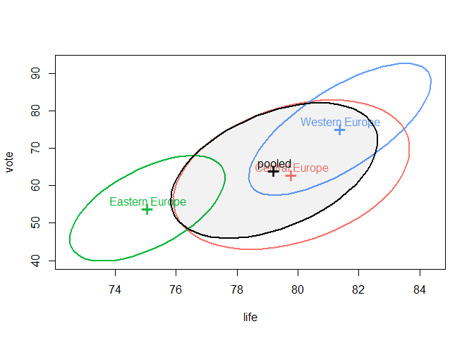

# Multivariate Analysis of Variance (MANOVA)
Santiago Gómez-Echeverry & Mauricio Garnier-Villarreal
2024-01-31

- [Introduction](#introduction)
- [Set up the R Session](#set-up-the-r-session)
- [Import the Dataset](#import-the-dataset)
- [Perform Multivariate Analysis of
  Variance](#perform-multivariate-analysis-of-variance)
  - [Effect size](#effect-size)
  - [Homogeneity of Variances](#homogeneity-of-variances)
  - [HE Plots](#he-plots)
  - [LDA](#lda)

# Introduction

Often, as social scientists we are interested in the effect that
treatment has in more than one dependent variable (DV). A naive approach
towards this problem would be to perform a separate analysis for each
DV. However, by doing this we would ignore that the two outcome measures
might be correlated. To analyze multiple DV’s while considering their
potential relationship we will use a technique called Multivariate
Analysis of Variance (MANOVA). In this tutorial, we’ll delve into
questions such as what a MANOVA analysis is, when should we use it, and
how it can inform social science research. Let’s dive in.

MANOVA is an extension of ANOVA, with which the researchers can estimate
the meandifference between groups in terms of two or more outcome
measures. This method has been applied extensively in the fields of
psychology, medicine and education. Note that we will only deal with
between variation, that is differences between groups and measurements a
one particular time point. However, the MANOVA method can be extended to
include both between and within variation.

# Set up the R Session

When we start working in R, we always need to setup our session. For
this we need to set our working directory. You should set it for the
folder that holds the data set.

``` r
setwd("~path_to_your_file")
```

The next step for setting up our session will be to load the packages
that we will be using. We will use a packages like `dplyr` for data
management, as well as the `rio` package for importing our data.
Additionally, we need the `reshape2` to reshape our data. Finally, the
packages `afex`, and `marginaleffects` are used for conducting our
analyses. Note that you potentially need to install some of these
packages, however.

``` r
library(dplyr)
library(reshape2)
library(marginaleffects)
library(afex)
library(sjlabelled)
library(effectsize)
library(rio)
library(bruceR)
library(corrplot)
library(car)
library(heplots)
library(candisc)
```

# Import the Dataset

We are importing a `.xlsx` file with the OECD Regional well-being data
set (). This data contains results for eleven (11) sub-dimension of
well-being for different regions of the European continent. The 11
sub-dimensions comprise four (4) dimensions: **material conditions**
(income, jobs, and housing), **quality of life** (education, health,
environment, safety, and access to services), and **subjective
well-being** (social network support and life satisfaction). In most
cases, the indicators selected to measure these dimensions is a
combination of people’s attributes and their living conditions,
available over two different periods (2000 and 2014). The data includes
208 regional-level observations and 17 variables.

``` r
dat <- import("OECD.xlsx")
head(dat)
```

      country                      region       continent code education employment
    1 Ireland Border, Midland and Western   British Isles IE01      81.3       32.2
    2  France                     Corsica  Western Europe  FRM       0.0       35.3
    3   Italy                      Sicily Southern Europe ITG1      60.6       40.5
    4   Italy                    Calabria Southern Europe ITF6      63.1       40.8
    5   Italy                      Apulia Southern Europe ITF4      59.2       41.4
    6   Italy                    Campania Southern Europe ITF3      61.0       42.0
      unemployment income homicide mortality life pollution vote broadband rooms
    1          8.0  15759      0.5       7.5 81.8       6.4 64.6        83   2.2
    2          7.9  18670      3.6       6.2 83.9      11.3 68.0        64   1.7
    3         21.9  14095      8.5       7.1 82.4      12.5 62.7        74   1.7
    4         22.0  13609      2.4       6.7 82.9      11.4 63.8        69   1.7
    5         19.3  14856      1.1       6.5 83.5      13.4 68.9        74   1.6
    6         21.3  13913      1.3       7.5 81.7      17.6 68.2        76   1.5
      social satisfaction
    1   96.0          7.2
    2   98.2          7.3
    3   86.3          5.9
    4   85.0          5.4
    5   85.2          5.9
    6   85.8          5.6

``` r
dim(dat)
```

    [1] 208  17

Or if you want to pull it from the github site

``` r
dat <- import("https://github.com/maugavilla/well_hello_stats/raw/main/tutorials/OECD.xlsx")
head(dat)
dim(dat)
```

Before we do any arrangements with the data, it would be good if we have
a look at the variables that we have with some descriptive statistics.
Remember, this only makes sense for variables that are *numeric*. If we
wanted to see how factors or characters are distributed in the data we
would require a different approach, like frequency tables. To get the
descriptive statistics we will use the `Describe` function from the
`bruceR` package.

``` r
Describe(dat[,-c(1,2,3,4)]) # note that we're excluding the first 4 columns as they contain character values.
```

    Descriptive Statistics:
    ────────────────────────────────────────────────────────────────────────────────
                    N     Mean      SD |   Median     Min      Max Skewness Kurtosis
    ────────────────────────────────────────────────────────────────────────────────
    education     208    80.25   13.52 |    84.10    0.00    97.50    -1.68     5.23
    employment    208    66.33    9.12 |    66.95   32.20    88.90    -0.83     1.11
    unemployment  208     8.87    6.00 |     6.95    1.80    29.70     1.40     1.35
    income        208 17707.02 4748.64 | 17783.00 5709.00 29279.00    -0.02    -0.84
    homicide      208     1.34    1.56 |     0.90    0.00    10.00     2.77     8.30
    mortality     208     8.10    1.64 |     7.60    5.70    13.30     1.02     0.24
    life          208    80.71    2.84 |    81.55   72.20    85.20    -0.95     0.09
    pollution     208    14.07    6.10 |    13.30    0.00    38.20     0.63     0.83
    vote          208    66.24   12.50 |    66.70   40.50    91.10    -0.13    -0.92
    broadband     208    81.28   11.12 |    82.00    0.00   100.00    -2.09    12.06
    rooms         208     1.68    0.33 |     1.70    0.90     2.30    -0.55    -0.31
    social        208    90.46    5.12 |    91.85   68.80   100.00    -1.00     1.02
    satisfaction  208     6.46    0.74 |     6.50    4.50     7.80    -0.29    -0.57
    ────────────────────────────────────────────────────────────────────────────────

Additionally, we can see how the variables are related to each other. To
do this we will use a correlation matrix, also referred as correlogram.
We would expect that the variables that are part of the same well-being
dimension have a *strong* correlation, whether it is positive or
negative.

``` r
cor_m <- cor(dat[,-c(1,2,3,4)])
corrplot(cor_m, type = 'lower', order = 'alphabet', method = 'color', 
         tl.cex = 0.5, tl.col = 'black', addCoef.col = 1, number.cex = 0.5) # this line sets the size and color of the text in the plot
```


Now that we have already explored how the data looks like, we can
continue with the data arrangement. For this exercise we will compare
only three groups that are defined from the variable continent. We will
compare Western, Eastern, and Central Europe. Besides, we will only use
a set of variables from the original pool. We will concentrate in the
variables `life` that measures life expectancy, `vote` that measures
political participation, and `education` which evaluates the overall
quality of the education.

``` r
dat2 <- filter(dat,(continent=="Eastern Europe" | continent == "Central Europe" | continent == "Western Europe"))
dat_lq <- dat2[,c('region','continent','life', 'vote', 'education')]
```

Before we start with the MANOVA analysis, let’s see how these variables
behave within our groups. To evaluate this we will get the means of
every outcome by group and plot them in bar plot. First, we create an
aggregate (grouped) dataset `dat_lq_agg` with the means of our outcome
variables per continent. This dataset we then reshape into a long format
(`dat_lq_long`) and use this to create a plot.

``` r
dat_lq_agg <- aggregate(dat_lq[,-c(1,2)], by = list(dat_lq$continent), mean)       
dat_lq_agg
```

             Group.1     life     vote education
    1 Central Europe 79.79322 62.96441  89.24915
    2 Eastern Europe 75.06190 53.92381  90.86667
    3 Western Europe 81.38000 75.07600  83.32800

``` r
dat_lq_long <- melt(dat_lq_agg, id = "Group.1", value.name = "value", variable.name = "dimension")
head(dat_lq_long)
```

             Group.1 dimension    value
    1 Central Europe      life 79.79322
    2 Eastern Europe      life 75.06190
    3 Western Europe      life 81.38000
    4 Central Europe      vote 62.96441
    5 Eastern Europe      vote 53.92381
    6 Western Europe      vote 75.07600

``` r
ggplot(data = dat_lq_long, aes(x = dimension, y =value, fill = dimension)) +
  geom_bar(stat = "identity") + 
  facet_wrap(~Group.1, scales = 'free_y') + # here, we group per region and set the scales of the y-axis as not-fixed
    theme_bw() +
    theme(axis.title.x=element_blank(), # with these lines, we remove the text from the x-axis
        axis.text.x=element_blank(),
        axis.ticks.x=element_blank())
```


# Perform Multivariate Analysis of Variance

Now, it is time to actually perform the MANOVA using the function
`Anova` from the `car` package that we loaded earlier.

First, we will define a linear model with the function `lm` specifying
all our variables. Keep in mind that now that we have multiple DV’s we
need to refer to them as block in the model by employing the `cbind`.
Once we have defined our model we can perform the MANOVA analysis, and
keep the results in a new object.

``` r
dat_lq
```

                                region      continent life vote education
    1                          Corsica Western Europe 83.9 68.0       0.0
    2          Brussels-Capital Region Western Europe 81.3 90.3      78.8
    3              Warminsko-Mazurskie Central Europe 77.1 42.3      90.3
    4       Wallonia (Région wallonne) Western Europe 79.8 87.6      81.3
    5                     Podkarpackie Central Europe 79.2 50.4      95.3
    6                          Latgale Eastern Europe 72.2 47.0      89.2
    7               Zachodniopomorskie Central Europe 77.7 45.9      92.3
    8                  Hauts-de-France Western Europe 80.7 78.2      80.5
    9                        Lubelskie Central Europe 78.2 49.0      93.2
    10               Northeast Estonia Eastern Europe 75.0 55.0      92.2
    11              Kujawsko-Pomorskie Central Europe 77.8 46.4      93.7
    12                        Šiauliai Eastern Europe 74.0 44.0      91.3
    13                  Swietokrzyskie Central Europe 77.9 46.8      93.2
    14                       Podlaskie Central Europe 78.4 47.1      92.9
    15                   East Slovakia Central Europe 77.2 55.1      91.5
    16                         Slaskie Central Europe 77.4 52.2      96.2
    17                        Opolskie Central Europe 78.2 43.1      93.9
    18                        Lubuskie Central Europe 77.4 44.6      93.3
    19                    Dolnoslaskie Central Europe 77.7 49.4      95.3
    20                     Malopolskie Central Europe 79.3 54.9      96.1
    21                          Alytus Eastern Europe 74.3 56.1      95.7
    22           Southern Transdanubia Central Europe 75.9 59.1      83.4
    23                           Utena Eastern Europe 73.1 51.8      93.8
    24                         Taurage Eastern Europe 73.3 51.6      88.5
    25                       Occitanie Western Europe 83.1 81.1      82.8
    26                       Grand Est Western Europe 82.1 78.7      82.7
    27                        Normandy Western Europe 81.9 80.9      80.2
    28                Northern Hungary Central Europe 74.6 60.3      84.3
    29                     Marijampole Eastern Europe 73.9 43.2      93.3
    30                       Panevežys Eastern Europe 74.5 42.6      91.7
    31            Northern Great Plain Central Europe 75.6 58.4      81.6
    32      Provence-Alpes-Côte d’Azur Western Europe 83.1 78.8      81.0
    33                       Pomorskie Central Europe 78.3 51.9      93.9
    34                          Vienna Central Europe 80.9 76.1      86.3
    35                         Kurzeme Eastern Europe 74.9 58.4      90.0
    36         Bourgogne-Franche-Comté Western Europe 82.3 79.4      82.6
    37                         Vidzeme Eastern Europe 74.1 60.1      91.0
    38              Nouvelle-Aquitaine Western Europe 82.9 80.5      84.2
    39           Centre - Val de Loire Western Europe 82.5 80.3      82.5
    40                      Luxembourg Western Europe 82.7 91.1      79.7
    41                         Zemgale Eastern Europe 74.0 55.5      80.0
    42                Central Slovakia Central Europe 77.0 61.3      93.0
    43                        Brittany Western Europe 82.0 83.5      87.7
    44                         Telšiai Eastern Europe 74.8 40.5      91.8
    45                   Île-de-France Western Europe 84.2 79.9      82.7
    46                         Lódzkie Central Europe 76.5 51.6      93.5
    47            Southern Great Plain Central Europe 75.9 58.3      86.4
    48                   Wielkopolskie Central Europe 78.0 50.2      95.1
    49            Auvergne-Rhône-Alpes Western Europe 83.6 79.3      85.4
    50  Flemish Region (Vlaams Gewest) Western Europe 82.6 90.8      85.0
    51                     Mazowieckie Central Europe 78.4 58.7      95.3
    52                Pays de la Loire Western Europe 83.1 83.3      85.7
    53                    West Estonia Eastern Europe 77.8 60.5      87.3
    54                 Central Estonia Eastern Europe 77.1 61.0      83.7
    55                   South Estonia Eastern Europe 77.8 62.7      90.3
    56                   West Slovakia Central Europe 77.2 60.2      94.7
    57                       Carinthia Central Europe 81.8 78.5      89.4
    58                          Kaunas Eastern Europe 75.2 46.8      96.8
    59            Central Transdanubia Central Europe 76.0 61.4      86.5
    60                      Burgenland Central Europe 81.4 84.5      87.7
    61            Western Transdanubia Central Europe 76.6 62.7      88.6
    62                         Vilnius Eastern Europe 75.1 51.6      96.8
    63                          Bremen Central Europe 80.1 70.8      84.1
    64                 Central Hungary Central Europe 77.6 66.3      91.9
    65                         Pieriga Eastern Europe 75.6 64.5      88.5
    66              Lake Geneva Region Central Europe 84.2 47.0      82.8
    67                          Styria Central Europe 82.1 79.8      87.0
    68                       Northwest Western Europe 77.2 52.3      90.3
    69                 Moravia-Silesia Western Europe 78.0 55.9      94.7
    70          North Rhine-Westphalia Central Europe 80.6 75.4      84.3
    71                            Riga Eastern Europe 75.6 69.7      88.0
    72                        Saarland Central Europe 80.2 76.6      85.2
    73          Mecklenburg-Vorpommern Central Europe 80.1 70.9      91.8
    74                 Central Moravia Western Europe 78.9 60.9      95.4
    75                          Berlin Central Europe 80.9 75.6      87.6
    76                   Saxony-Anhalt Central Europe 79.8 68.1      91.4
    77                          Ticino Central Europe 85.0 54.4      84.8
    78                   Lower Austria Central Europe 81.4 84.8      86.2
    79                       Southeast Western Europe 79.9 62.4      96.2
    80                       Northeast Western Europe 79.6 62.3      94.8
    81                           Tyrol Central Europe 82.8 76.4      84.9
    82                        Klaipeda Eastern Europe 75.3 40.7      94.9
    83              Schleswig-Holstein Central Europe 80.6 76.3      87.0
    84                    Lower Saxony Central Europe 80.5 76.4      85.5
    85                       Southwest Western Europe 79.3 60.9      95.2
    86                        Salzburg Central Europe 82.7 80.7      87.6
    87                           Hesse Central Europe 81.6 77.0      85.6
    88                   Upper Austria Central Europe 82.2 81.8      84.3
    89            Rhineland-Palatinate Central Europe 81.1 77.7      83.8
    90         Central Bohemian Region Western Europe 79.2 63.4      96.3
    91                      Vorarlberg Central Europe 82.7 72.2      83.0
    92               Bratislava Region Central Europe 78.9 66.4      97.3
    93                       Thuringia Central Europe 80.4 74.3      94.5
    94                         Hamburg Central Europe 81.2 76.0      86.2
    95                     Brandenburg Central Europe 80.7 73.7      92.2
    96                          Saxony Central Europe 81.1 75.4      94.0
    97                   North Estonia Eastern Europe 78.7 69.1      93.4
    98               Baden-Württemberg Central Europe 82.0 78.3      85.1
    99                          Prague Western Europe 80.6 67.1      97.5
    100                        Bavaria Central Europe 81.7 78.1      87.2
    101       Northwestern Switzerland Central Europe 83.6 48.2      87.0
    102                         Zurich Central Europe 83.9 47.2      88.4
    103              Espace Mittelland Central Europe 83.1 48.5      85.4
    104            Eastern Switzerland Central Europe 83.4 47.2      85.8
    105            Central Switzerland Central Europe 84.0 53.0      86.9

``` r
mod <- lm(cbind(life, vote, education) ~ continent, data = dat_lq)
maov <- summary(Anova(mod), univariate = TRUE, digits = 3)
maov
```


    Type II MANOVA Tests:

    Sum of squares and products for error:
                   life      vote education
    life       519.6068  1219.733  -679.833
    vote      1219.7328 14686.799 -2407.113
    education -679.8330 -2407.113  9599.225

    ------------------------------------------
     
    Term: continent 

    Sum of squares and products for the hypothesis:
                   life      vote  education
    life       499.1088  1442.913  -460.4404
    vote      1442.9132  5262.173 -1977.2707
    education -460.4404 -1977.271   807.5406

    Multivariate Tests: continent
                     Df test stat approx F num Df den Df     Pr(>F)    
    Pillai            2 0.6082156 14.71248      6    202 6.3486e-14 ***
    Wilks             2 0.4474935 16.49604      6    200 2.0342e-15 ***
    Hotelling-Lawley  2 1.1101781 18.31794      6    198 < 2.22e-16 ***
    Roy               2 0.9836126 33.11496      3    101 5.4657e-15 ***
    ---
    Signif. codes:  0 '***' 0.001 '**' 0.01 '*' 0.05 '.' 0.1 ' ' 1

     Type II Sums of Squares
               df   life    vote education
    continent   2 499.11  5262.2    807.54
    residuals 102 519.61 14686.8   9599.22

     F-tests
               life  vote education
    continent 48.99 18.27      4.29

     p-values
              life       vote       education
    continent 1.2266e-15 1.6494e-07 0.016253 

The output `summary(model)` present different sections. First, we have
the $SSCP_{R}$ and $SSCP_{E}$ matrices. These matrices contain the sum
of squares of each variable in the diagonals and the cross-products
outside of it. These matrices are the ones employed in the construction
of the following part of the output that is the multivariate tests. The
output presents the four typical statistics employed to assess the
significance of the intervention in MANOVA: **Pillai’s trace, Wilks
lambda, Hotelling-Lawley T, and Roy’s largest root**.

## Effect size

We also need to describe the results in function of measures of effect
size. For ANOVA family of analysis, we recommend to use $\eta^2_f$ and
$\omega^2_f$. These measures estimate the proportion of variance
explained by each predictor (similar to $R^2$). Where $\eta^2_f$ is more
positively bias (similar to $R^2$), and $\omega^2_f$ is a more
conservative measure.

When you have multiple predictors, you will also see the **partial**
version of these measures ($\eta^2_p$ and $\omega^2_p$). These will most
commonly present higher effect sizes, as they are the proportion of
explained variance **that is not predicted by any other predictors**.
So, will show higher effect sizes because they are not in function of
the total variance of the outcome, but the residual variance.

To estimate these measure we will use the `effectsize` package
functions, just provide the MANOVA model to the respective functions,
notice that we set `partial = FALSE` to estimate the full measure
instead of partial one (in this case they will be the same, as we have
only one predictor)

``` r
eta_squared(mod, partial = F)
```

    # Effect Size for ANOVA (Type I)

    Response  | Parameter | Eta2 |       95% CI
    -------------------------------------------
    life      | continent | 0.49 | [0.37, 1.00]
    vote      | continent | 0.26 | [0.14, 1.00]
    education | continent | 0.08 | [0.01, 1.00]

``` r
omega_squared(mod, partial = F)
```

    # Effect Size for ANOVA (Type I)

    Response  | Parameter | Omega2 |       95% CI
    ---------------------------------------------
    life      | continent |   0.48 | [0.36, 1.00]
    vote      | continent |   0.25 | [0.13, 1.00]
    education | continent |   0.06 | [0.00, 1.00]

When the model has only one predictor, these measures are equivalent to
the model $R^2$. In this case the show that for `life` around a 49%
($\eta^2_f = 0.49$) of the variance is explained by the `continent`
variable, around 26% for `vote`, and 8% for `education`.

## Homogeneity of Variances

Since we have between variation, we will assume that the variance of the
outcome variables is the same across groups. This assumption is what we
have referred as homogeneity of variances. However, we can’t use the
same test as before, because we’re dealing with *matrices* in this
situation. The test that we will employ in this case is **Box’s M
test**, which uses a chi-squared approximation to perform hypotheses
testing. As per usual, the null hypothesis of this test is that the
variances/covariances are the same across the groups. Keep in mind that
this test is not reliable when the sizes of the groups are very
irregular.

``` r
boxM(dat_lq[,c('life', 'vote', 'education')], dat_lq$continent)
```


        Box's M-test for Homogeneity of Covariance Matrices

    data:  dat_lq[, c("life", "vote", "education")]
    Chi-Sq (approx.) = 127.93, df = 12, p-value < 2.2e-16

As you see, from the function `boxM` we get the chi-squared, the degrees
of freedom and the p-value. With these results
$\chi^{2}(df= 12)=127.93, p < 0.001$ we reject the null hypothesis. This
implies that we do *not* have homogeneity of variances/covariances. In
this situation, there are two possible approaches: one is to **use a
higher significance level** in the hypothesis testing, and the other is
to **transform the dependent variable** so that we don’t observe these
difference on variances. Keep in mind that transforming the data does
not imply arbitrarily editing the data, but rather rescale the
information in a sensible way (e.g., by standardizing the variables).

## HE Plots

A nice way to evaluate the MANOVA model is through **Hypothesis-Error
(HE)** plots. This plots show two DVs simultaneously, and often separate
the diverse sources of variance with ellipses. The center of the
ellipses refer to means in the two variables, the **height** of the
ellipses denotes shows the **standard deviation** of the variable in the
**vertical axis**, and the **width** the one in the **horizontal axis**.
The **inclination** of the the ellipses show the **relationship**
between the two variables.

Let us see an HE plot with the different groups that we have.

``` r
cols = c(scales::hue_pal()(3), "black") # here, we create an object storing four different colors that we use in the plot below
covEllipses(dat_lq[,c('life', 'vote', 'education')], dat_lq$continent, 
            col=cols, fill=c(rep(FALSE,3), TRUE), fill.alpha=.05) # this line deals with the plot esthetics
```



If the ellipses of different groups **overlap** significantly, it
suggests that the groups are **not very different** with respect to the
dependent variables. The **further apart** the centroids (multivariate
means) of the ellipses are, the **more distinct** the groups are likely
to be.

This was a good taste of how the plots work. Now, let’s dive into the
plot with the model and the error.

``` r
heplot(mod, fill=TRUE, fill.alpha=0.1)
```


The **centroid** in the middle represents the multivariate mean of the
two dependent variables. The **shape** and **orientation** of the
ellipses are indicative of the correlation between the outcome
variables: we observe a **positive correlation** between `life` and
`vote`. A perfect circle would signify no correlation, a(n almost)
straight line would signify a correlation of ≈1. Given that the ellipse
from our predictor (continent) goes outside of the error ellipse, we can
state that there *is* a significant effect. However, it’s not clear
whether this effect is large or small, since the **length of the ellipse
is dependent on the scale of the variables**. A way to assess if the
*real* size of the effect visually, is to add the argument
`size="effect"`.

``` r
heplot(mod, fill=TRUE, fill.alpha=0.1, size = "effect")
```


We have only compared two variables. Now, let’s compare them all.

``` r
pairs(mod, variables=c('life', 'vote', 'education'))
```


We notice that group means for `life` and `vote` are positively
correlated (we established that above), but there are negative
correlations between the group means of both `vote` and `life` on
`education`.

## LDA

Often, MANOVA analyses are followed up with a Linear Discriminant
Analysis (LDA). The idea of LDA is to see how much of the variables that
before were our DVs could **explain** the belonging to the groups. That
is, we’re **reversing the research question**. Additionally, we are
interested in seeing if our variables capture one or several
**underlying dimensions**. As you saw in class, this might make sense,
since we could have a strong correlation between the observed variables.
To perform our analysis we will use the `candisc` function.

``` r
cda <- candisc(mod, term = "continent")
summary(cda)
```


    Canonical Discriminant Analysis for continent:

       CanRsq Eigenvalue Difference Percent Cumulative
    1 0.49587    0.98361    0.85705    88.6       88.6
    2 0.11235    0.12657    0.85705    11.4      100.0

    Class means:

                       Can1     Can2
    Central Europe -0.24037  0.29736
    Eastern Europe  1.85592 -0.22043
    Western Europe -0.99170 -0.51662

     std coefficients:
                  Can1     Can2
    life      -0.95788  0.61398
    vote      -0.14033 -0.89808
    education -0.10443  0.55568

The `summary`results have three parts. The first part corresponds to the
**eigenvalues**, which show how much of the total variance is explained
by each dimension (or as we referred to them in class: **variates**).
The second part shows the means of variates for each group, and the last
part of the output shows the standardized coefficients. These
coeffcients are the ones that are employed to construct the variates.
The coefficients, both standardized and *raw* are be stored in this new
object:

``` r
cda$coeffs.raw
```

                     Can1        Can2
    life      -0.42440007  0.27203158
    vote      -0.01169468 -0.07484289
    education -0.01076484  0.05728022

``` r
cda$coeffs.std
```

                    Can1       Can2
    life      -0.9578837  0.6139834
    vote      -0.1403305 -0.8980780
    education -0.1044300  0.5556773

`life`, `vote` and `education` are negatively related to the first
variate. In terms of the second variate, `life` and `education` are
positively related to it and `vote` is negatively related to it.

To end, let’s see the behavior of the groups and the observed variables
in the two underlying variates that we obtain from the LDA. Note that
the ellipses are perfect circles, indicating that there is **no
correlation** between the two variates.

``` r
col <- scales::hue_pal()(3) #again, this row sets the colors for the plot below
plot(cda, col=col, 
     ellipse=TRUE, var.col = "black")
```

    Vector scale factor set to 4.755


