Linear Regression
================
Mauricio Garnier-Villarreal, Joris M. Schröder & Joseph Charles Van
Matre
01 September, 2022

-   <a href="#setup-the-r-session" id="toc-setup-the-r-session">Setup the R
    session</a>
-   <a href="#import-the-data-set" id="toc-import-the-data-set">Import the
    data set</a>
    -   <a href="#prepare-the-data-set" id="toc-prepare-the-data-set">Prepare
        the data set</a>
        -   <a href="#create-composite-scores"
            id="toc-create-composite-scores">Create composite scores</a>
        -   <a href="#transform-categorical-variables-to-factor"
            id="toc-transform-categorical-variables-to-factor">Transform categorical
            variables to <code>factor()</code></a>
        -   <a href="#set-variables-for-analysis"
            id="toc-set-variables-for-analysis">Set variables for analysis</a>
-   <a href="#simple-linear-regression"
    id="toc-simple-linear-regression">Simple Linear regression</a>
    -   <a href="#standardize-solution"
        id="toc-standardize-solution">Standardize solution</a>
    -   <a href="#assumptions" id="toc-assumptions">Assumptions</a>
    -   <a href="#effect-size" id="toc-effect-size">Effect size</a>
    -   <a href="#slope-plots" id="toc-slope-plots">Slope plots</a>
    -   <a href="#interpretation-of-the-results"
        id="toc-interpretation-of-the-results">Interpretation of the results</a>
-   <a href="#linear-regression-with-a-binary-predictor"
    id="toc-linear-regression-with-a-binary-predictor">Linear regression
    with a binary predictor</a>
    -   <a href="#standardize-solution-1"
        id="toc-standardize-solution-1">Standardize solution</a>
    -   <a href="#assumptions-1" id="toc-assumptions-1">Assumptions</a>
    -   <a href="#effect-size-1" id="toc-effect-size-1">Effect size</a>
    -   <a href="#slope-plots-1" id="toc-slope-plots-1">Slope plots</a>
    -   <a href="#interpretation-of-the-results-1"
        id="toc-interpretation-of-the-results-1">Interpretation of the
        results</a>
-   <a href="#multiple-linear-regression"
    id="toc-multiple-linear-regression">Multiple Linear regression</a>
    -   <a href="#model-comparison" id="toc-model-comparison">Model
        comparison</a>
    -   <a href="#standardize-solution-2"
        id="toc-standardize-solution-2">Standardize solution</a>
    -   <a href="#assumptions-2" id="toc-assumptions-2">Assumptions</a>
    -   <a href="#effect-size-2" id="toc-effect-size-2">Effect size</a>
    -   <a href="#conditional-slope-plots"
        id="toc-conditional-slope-plots">Conditional Slope plots</a>
    -   <a href="#interpretation-of-the-results-2"
        id="toc-interpretation-of-the-results-2">Interpretation of the
        results</a>

# Setup the R session

When we start working in R, we always need to setup our session. For
this we need to set our working directory, in this case I am doing that
for the folder that holds the downloaded [World Values Survey
(WVS)](https://www.worldvaluessurvey.org/) `SPSS` data set

``` r
setwd("~path_to_your_file")
```

The next step for setting up our session will be to load the packages
that we will be using

``` r
library(rio)
library(psych)
library(effectsize)
library(visreg)
library(rockchalk)
library(ggplot2)
```

# Import the data set

Here we will be importing the `.sav` WVS data set

``` r
dat <- import("WVS_Cross-National_Wave_7_sav_v2_0.sav")
dim(dat)
```

    ## [1] 76897   548

Here we are calling our data set **dat** and asking to see the dimension
of it. We see that the data set has 76897 subjects, and 548 columns.

## Prepare the data set

In cases with large data sets like this we might want to select a subset
of variables that we want to work with. Since it is not easy to see 548
variables.

``` r
vars <- c("Q260","Q262", "Y001", "SACSECVAL", "Q112", "Q113", "Q114", "Q115", "Q116", "Q117", "Q118", "Q119", "Q120", "Q65", "Q69", "Q71", "Q72", "Q73")
dat2 <- dat[,vars]
dim(dat2)
```

    ## [1] 76897    18

``` r
head(dat2)
```

    ##   Q260 Q262 Y001 SACSECVAL Q112 Q113 Q114 Q115 Q116 Q117 Q118 Q119 Q120 Q65 Q69
    ## 1    2   60    0  0.287062    2   NA   NA   NA   NA   NA    1    2    6  NA   1
    ## 2    1   47    2  0.467525   10    3    3    3    3    3    1    3    2  NA   3
    ## 3    1   48    4  0.425304    7    2    2    2    2    2    1    2    7  NA   2
    ## 4    2   62    2  0.556170    5    3    3    3    3    2    1    4    7  NA   3
    ## 5    1   49    1  0.458949    5    2    2    2    2    1    1    3    7  NA   2
    ## 6    2   51    3  0.210111    6    2    2    2    2    2    1    4    2  NA   1
    ##   Q71 Q72 Q73
    ## 1   1   1   1
    ## 2   4   4   4
    ## 3   3   3   3
    ## 4   3   3   3
    ## 5   2   3   2
    ## 6   2   2   2

Here we are first creating a vector with the variable names for the ones
I want to keep. You can see all variable names for the full data set as
well:

``` r
colnames(dat)
```

After identifying which variables we will work with, we create a new
data set **dat2** with only these 17 variables, and make sure we did it
correctly by looking at the the dimension of the data **dim(dat2)**. We
also look at the first 6 rows: **head(dat2)**. These are quick checks
that we have created the new data correctly.

The variables we will use here are:

-   Q260: sex, 1 = Male, 2 = Female
-   Q262: age in years
-   Y001: post-materialism index
-   SACSECVAL: secular values
-   Q112-Q120: Corruption Perception Index
-   Q65-Q73: Lack of Confidence in the government

### Create composite scores

We will be using the composite scores for *Corruption Perception Index*
and *Lack of Confidence in the government* instead of their single
items. So, we first need to compute them, we will use the mean across
all items for each composite

``` r
dat2$Corrup <- rowMeans(dat2[,c("Q112", "Q113", "Q114", "Q115", "Q116", "Q117", "Q118", "Q119", "Q120")], na.rm=T)
dat2$LCGov <- rowMeans(dat2[,c("Q65", "Q69", "Q71", "Q72", "Q73")], na.rm=T)
head(dat2)
```

    ##   Q260 Q262 Y001 SACSECVAL Q112 Q113 Q114 Q115 Q116 Q117 Q118 Q119 Q120 Q65 Q69
    ## 1    2   60    0  0.287062    2   NA   NA   NA   NA   NA    1    2    6  NA   1
    ## 2    1   47    2  0.467525   10    3    3    3    3    3    1    3    2  NA   3
    ## 3    1   48    4  0.425304    7    2    2    2    2    2    1    2    7  NA   2
    ## 4    2   62    2  0.556170    5    3    3    3    3    2    1    4    7  NA   3
    ## 5    1   49    1  0.458949    5    2    2    2    2    1    1    3    7  NA   2
    ## 6    2   51    3  0.210111    6    2    2    2    2    2    1    4    2  NA   1
    ##   Q71 Q72 Q73   Corrup LCGov
    ## 1   1   1   1 2.750000  1.00
    ## 2   4   4   4 3.444444  3.75
    ## 3   3   3   3 3.000000  2.75
    ## 4   3   3   3 3.444444  3.00
    ## 5   2   3   2 2.777778  2.25
    ## 6   2   2   2 2.555556  1.75

With the `rowmeans()` we compute the mean across the specified
variables, for each subject. Remember to include the `na.rm=T` argument,
so the missing values are properly ignored.

### Transform categorical variables to `factor()`

when we want to use categorical variables as predictors, it is
recommended to transformed them as `factor` type in `R`. In this case we
will use the *Sex* variable `Q260`, which is coded as 1 and 2 right now.

With the `factor()` function we an transform it, and change the numbers
to meaningful labels.

``` r
dat2$Sex <- factor(dat2$Q260, 
                       levels = 1:2,
                       labels = c("Male","Female") )
```

### Set variables for analysis

Now, we will select only the variables of interest in a separate data
set.

``` r
dat2 <- na.omit(dat2[,c("Sex", "Q262", "Y001", "SACSECVAL", "Corrup", "LCGov")])
head(dat2)
```

    ##      Sex Q262 Y001 SACSECVAL   Corrup LCGov
    ## 1 Female   60    0  0.287062 2.750000  1.00
    ## 2   Male   47    2  0.467525 3.444444  3.75
    ## 3   Male   48    4  0.425304 3.000000  2.75
    ## 4 Female   62    2  0.556170 3.444444  3.00
    ## 5   Male   49    1  0.458949 2.777778  2.25
    ## 6 Female   51    3  0.210111 2.555556  1.75

``` r
dim(dat2)
```

    ## [1] 71633     6

The new `dat2` data set only include the 6 continuous variables of
interest, and 1 binary variable. With the `na.omit()` function we are
excluding all cases with some missing values.

# Simple Linear regression

With linear regression we need to define an outcome (dependent) and
predictor(s) (independent) variables. This way specifying directional
relations. For this example, we will use *Perception of corruption* as
the outcome, and *Lack of confidence in the government* as predictor.

``` r
mod1 <- lm(Corrup ~ LCGov, data=dat2)
```

Here we named the result of the regression `mod1`, we use the function
`lm()` which stands for *linear model*. This function requires 2
arguments, first the *formula*, which is a general formula form used in
a lot of `R`packages. The formula general form is \`\`Òutcome \~
Predictor\`\`\`. And the second argument is the data set.

Notice that when we run the regression, we don’t see any results. `R`
will only show you what you ask. The default results are shown by the
`summary()` function. If you ask for the `summary()` of the regression
model, you can see the regression table, overall model test (*F-test*),
and $R^2$.

``` r
summary(mod1)
```

    ## 
    ## Call:
    ## lm(formula = Corrup ~ LCGov, data = dat2)
    ## 
    ## Residuals:
    ##     Min      1Q  Median      3Q     Max 
    ## -3.8382 -0.4692 -0.0570  0.4203  7.0851 
    ## 
    ## Coefficients:
    ##             Estimate Std. Error t value Pr(>|t|)    
    ## (Intercept) 2.545653   0.010504  242.34   <2e-16 ***
    ## LCGov       0.369293   0.003967   93.08   <2e-16 ***
    ## ---
    ## Signif. codes:  0 '***' 0.001 '**' 0.01 '*' 0.05 '.' 0.1 ' ' 1
    ## 
    ## Residual standard error: 0.7788 on 71631 degrees of freedom
    ## Multiple R-squared:  0.1079, Adjusted R-squared:  0.1079 
    ## F-statistic:  8665 on 1 and 71631 DF,  p-value: < 2.2e-16

We can also ask for the confidence intervals with

``` r
confint(mod1, level = 0.95)
```

    ##                 2.5 %    97.5 %
    ## (Intercept) 2.5250647 2.5662413
    ## LCGov       0.3615173 0.3770689

For this we need to specify the regression model, and confidence level.
This example will estimate the 95% Confidence Interval for all the
parameters in the model.

## Standardize solution

It is common to look at the standardize regression slopes, we can
estimate this with the `standardize()` function from the
`rockchalk`package

``` r
mod1_st <- standardize(mod1)
summary(mod1_st)
```

    ## All variables in the model matrix and the dependent variable
    ## were centered. The centered variables have the letter "s" appended to their
    ## non-centered counterparts, even constructed
    ## variables like `x1:x2` and poly(x1,2). We agree, that's probably
    ## ill-advised, but you asked for it by running standardize().
    ## 
    ## The rockchalk function meanCenter is a smarter option, probably. 
    ## 
    ## The summary statistics of the variables in the design matrix. 
    ##         mean std.dev.
    ## Corrups    0        1
    ## dm         0        1
    ## 
    ## Call:
    ## lm(formula = Corrups ~ -1 + LCGovs, data = stddat)
    ## 
    ## Residuals:
    ##     Min      1Q  Median      3Q     Max 
    ## -4.6547 -0.5690 -0.0691  0.5097  8.5923 
    ## 
    ## Coefficients:
    ##        Estimate Std. Error t value Pr(>|t|)    
    ## LCGovs 0.328499   0.003529   93.09   <2e-16 ***
    ## ---
    ## Signif. codes:  0 '***' 0.001 '**' 0.01 '*' 0.05 '.' 0.1 ' ' 1
    ## 
    ## Residual standard error: 0.9445 on 71632 degrees of freedom
    ## Multiple R-squared:  0.1079, Adjusted R-squared:  0.1079 
    ## F-statistic:  8665 on 1 and 71632 DF,  p-value: < 2.2e-16

The `standardize()` function only requires the previous regression
model. It estimates the fully standardize regression. It is worth to
note that when you have only 1 predictor, the standardize regression
slope is equivalent to the *Pearson* correlation coefficient.

``` r
corr.test(dat2[,c("Corrup","LCGov")], method="pearson")
```

    ## Call:corr.test(x = dat2[, c("Corrup", "LCGov")], method = "pearson")
    ## Correlation matrix 
    ##        Corrup LCGov
    ## Corrup   1.00  0.33
    ## LCGov    0.33  1.00
    ## Sample Size 
    ## [1] 71633
    ## Probability values (Entries above the diagonal are adjusted for multiple tests.) 
    ##        Corrup LCGov
    ## Corrup      0     0
    ## LCGov       0     0
    ## 
    ##  To see confidence intervals of the correlations, print with the short=FALSE option

We can also get confidence intervals for the standardize solution, with
the same function as before.

``` r
confint(mod1_st, level=0.95)
```

    ##            2.5 %    97.5 %
    ## LCGovs 0.3215819 0.3354155

## Assumptions

The linear model assumptions can not be evaluated on the data, but only
once the model has been estimated. In `R` the most practical way to do
this is with the default plots for `lm()`

``` r
plot(mod1)
```

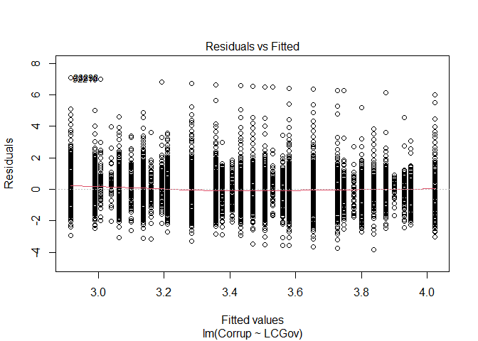<!-- -->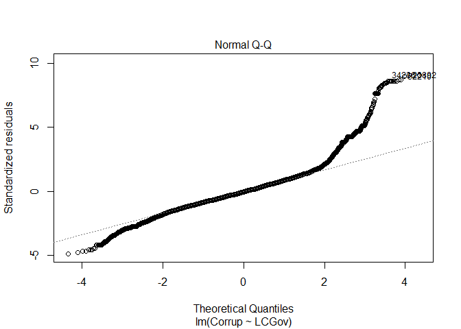<!-- -->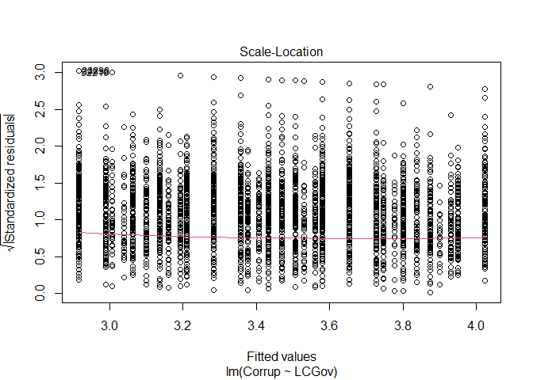<!-- -->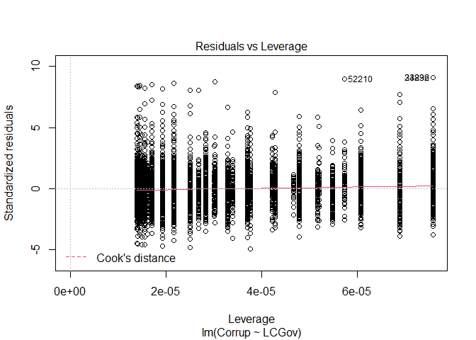<!-- -->

Here we see various diagnostic plots. The **first** one presents the
fitted values (predicted) against the model residuals (difference
between predicted and observed values). With this plot we can evaluate
linearity, and homogeneity of variance. If the *loess* (red) line is
flat, mostly on top of the *expected* (grey dotted) line, this indicates
that the linearity assumption is not violated. The linearity assumption
would be violated when the *loess* line presents a curve that
meaningfully deviates from the *expected* line. We can evaluate the
homogeneity of variance, by looking at the spread of the points across
the *x-axis*. If the points seems to have similar spread would indicate
no violation of the homogeneity of variance assumption. When the
homogeneity of variance assumption is violated, it presents clear
differences in the spread of the points across the *x-axis*.

The **second** plot presents the *QQ* plot for the standardized
residuals. This plots the theoretical quantiles (*x-axis*) against the
standardized residuals (*y-axis*). With this plot we can evaluate the
assumption of normality of the residuals. If the residuals are perfectly
normal, the residual points would follow the theoretical diagonal line.
Deviations from the theoretical line would indicate violations of the
residual normality assumption. In this case we can see deviations from
the theoretical line at the low and high ends.

The **third** plot is similar to the first one, with the fitted values
on the *x-axis*, but presenting the squared standardized residuals on
the *y-axis*. With the similarities with the first plot, we can evaluate
the same assumptions (linearity and homogeneity of variances), and
follow the same guidelines to review them. In this case we see no
meaningful deviations from either assumption.

Lastly, the **fourth** plot presents the leverage against the residuals.
With this we can evaluate the presence of outliers. More specifically
with Cook’s distance, when outliers are present they will be shown out
of a red-dotted line indicating that they are outliers according to the
Cook’s distance.

It is worth to remember that the linear models are robust to violations
of the normality, homogeneity of variance, and outliers. But it is not
robust to violations of linearity.

## Effect size

From the overall model we will use the $R^2$, and $R^2_{adj}$ as
measures of model predictive accuracy. And $\eta^2$, $\omega^2$ as
measure of predictor relative relevance. For simple regression (with
only one predictor) overall model and predictor relevance would be
equal, as the single indicator is the whole model

We can see the overall model ones from the `summary()` output

``` r
summary(mod1)
```

    ## 
    ## Call:
    ## lm(formula = Corrup ~ LCGov, data = dat2)
    ## 
    ## Residuals:
    ##     Min      1Q  Median      3Q     Max 
    ## -3.8382 -0.4692 -0.0570  0.4203  7.0851 
    ## 
    ## Coefficients:
    ##             Estimate Std. Error t value Pr(>|t|)    
    ## (Intercept) 2.545653   0.010504  242.34   <2e-16 ***
    ## LCGov       0.369293   0.003967   93.08   <2e-16 ***
    ## ---
    ## Signif. codes:  0 '***' 0.001 '**' 0.01 '*' 0.05 '.' 0.1 ' ' 1
    ## 
    ## Residual standard error: 0.7788 on 71631 degrees of freedom
    ## Multiple R-squared:  0.1079, Adjusted R-squared:  0.1079 
    ## F-statistic:  8665 on 1 and 71631 DF,  p-value: < 2.2e-16

In this case we see that $R^2 = 0.1079$, meaning that Lack of confidence
in the government explains 10.8% of the variance in Perception of
Corruption.

``` r
eta_squared(mod1, partial=F)
```

    ## # Effect Size for ANOVA (Type I)
    ## 
    ## Parameter | Eta2 |       95% CI
    ## -------------------------------
    ## LCGov     | 0.11 | [0.09, 1.00]
    ## 
    ## - One-sided CIs: upper bound fixed at [1.00].

``` r
omega_squared(mod1, partial=F)
```

    ## # Effect Size for ANOVA (Type I)
    ## 
    ## Parameter | Omega2 |       95% CI
    ## ---------------------------------
    ## LCGov     |   0.11 | [0.09, 1.00]
    ## 
    ## - One-sided CIs: upper bound fixed at [1.00].

We can see that $R^2$, $R^2_{adj}$, $\eta^2$, and $\omega^2$ presents
the same estimate up to the third decimal. Later we will show the
interpretation of these different metrics when multiple indicators are
present.

## Slope plots

We also want to plot the regression line, as the predicted scores next
to the observed data. We can do this with the \``visreg` package.

``` r
visreg(mod1, type="conditional")
```

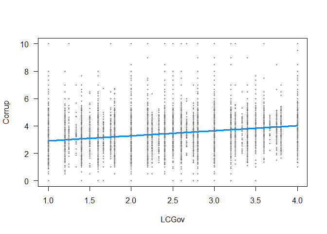<!-- -->

The `visreg()` function takes the \``lm()` model, and will plot the
regression line with the confidence intervals in grey (we can not see
the CI bands because of the large sample they are very small) on top the
observed points.

with a single predictor, this is equivalent to the observed
scatter-plot. when we add multiple predictors this change to conditional
regression lines.

## Interpretation of the results

Here we will present how to interpret the model results. With a single
indicator we get all the information we need from the `summary()`
function.

``` r
summary(mod1)
```

    ## 
    ## Call:
    ## lm(formula = Corrup ~ LCGov, data = dat2)
    ## 
    ## Residuals:
    ##     Min      1Q  Median      3Q     Max 
    ## -3.8382 -0.4692 -0.0570  0.4203  7.0851 
    ## 
    ## Coefficients:
    ##             Estimate Std. Error t value Pr(>|t|)    
    ## (Intercept) 2.545653   0.010504  242.34   <2e-16 ***
    ## LCGov       0.369293   0.003967   93.08   <2e-16 ***
    ## ---
    ## Signif. codes:  0 '***' 0.001 '**' 0.01 '*' 0.05 '.' 0.1 ' ' 1
    ## 
    ## Residual standard error: 0.7788 on 71631 degrees of freedom
    ## Multiple R-squared:  0.1079, Adjusted R-squared:  0.1079 
    ## F-statistic:  8665 on 1 and 71631 DF,  p-value: < 2.2e-16

-   From the overall model test, we reject the null hypothesis of the
    model being as good as the sample mean at predicting the outcome.
    Also could be seen as rejecting the null hypothesis of $R^2 = 0$.
    $F(1, 71631) = 8665, p < .001$.
-   The model explains 10.8% of the variance in Perception of corruption
    ($R^2 = 0.1079$).
-   When the Lack of confidence in the government is equal to 0, the
    expected score in Perception of corruption is 2.55, and we reject
    the null hypothesis of this intercept being equal to 0,
    $b_0 = 2.55, SE = 0.01, p < .001$.
-   As Lack of confidence in the government increases by 1, the
    perception in corruption increases by 0.366 points, and we reject
    the null hypothesis of this slope being equal to 0,
    $b_1 = 0.369, SE = 0.004, p < .001$.
-   From the standardize solution we see that as Lack of government
    confidence increases by 1 standard deviation, Perception of
    corruption increases by 0.328 standard deviations.

``` r
summary(mod1_st)
```

    ## All variables in the model matrix and the dependent variable
    ## were centered. The centered variables have the letter "s" appended to their
    ## non-centered counterparts, even constructed
    ## variables like `x1:x2` and poly(x1,2). We agree, that's probably
    ## ill-advised, but you asked for it by running standardize().
    ## 
    ## The rockchalk function meanCenter is a smarter option, probably. 
    ## 
    ## The summary statistics of the variables in the design matrix. 
    ##         mean std.dev.
    ## Corrups    0        1
    ## dm         0        1
    ## 
    ## Call:
    ## lm(formula = Corrups ~ -1 + LCGovs, data = stddat)
    ## 
    ## Residuals:
    ##     Min      1Q  Median      3Q     Max 
    ## -4.6547 -0.5690 -0.0691  0.5097  8.5923 
    ## 
    ## Coefficients:
    ##        Estimate Std. Error t value Pr(>|t|)    
    ## LCGovs 0.328499   0.003529   93.09   <2e-16 ***
    ## ---
    ## Signif. codes:  0 '***' 0.001 '**' 0.01 '*' 0.05 '.' 0.1 ' ' 1
    ## 
    ## Residual standard error: 0.9445 on 71632 degrees of freedom
    ## Multiple R-squared:  0.1079, Adjusted R-squared:  0.1079 
    ## F-statistic:  8665 on 1 and 71632 DF,  p-value: < 2.2e-16

# Linear regression with a binary predictor

We can run a regression where the predictor is a binary/categorical
variable. With a categorical variable with only 2 categories (binary),
this becomes equivalent to independent sample *t-test*. We can specify
this just by setting the categorical variable as the predictor in the
`R` formula, like this

``` r
mod2 <- lm(Corrup ~ Sex, data = dat2)
summary(mod2)
```

    ## 
    ## Call:
    ## lm(formula = Corrup ~ Sex, data = dat2)
    ## 
    ## Residuals:
    ##     Min      1Q  Median      3Q     Max 
    ## -3.4988 -0.4988 -0.0440  0.5012  6.5275 
    ## 
    ## Coefficients:
    ##              Estimate Std. Error t value Pr(>|t|)    
    ## (Intercept)  3.498834   0.004444 787.229  < 2e-16 ***
    ## SexFemale   -0.026294   0.006166  -4.265 2.01e-05 ***
    ## ---
    ## Signif. codes:  0 '***' 0.001 '**' 0.01 '*' 0.05 '.' 0.1 ' ' 1
    ## 
    ## Residual standard error: 0.8245 on 71631 degrees of freedom
    ## Multiple R-squared:  0.0002538,  Adjusted R-squared:  0.0002399 
    ## F-statistic: 18.19 on 1 and 71631 DF,  p-value: 2.006e-05

We see the way to implement is the same as before, it is important to
remember to set up the predictor as categorical with the `factor()`
function. We will present the difference in the interpretation in a
following sections.

It is worth noting that since our predictor is categorical, we see that
in the `summary` the slope name is `SexFemale`. This indicates that it
is the slope for the category `Female` and that the other category is
the baseline group of comparison, `Male` in this case.

## Standardize solution

There are divided opinions about the worthiness of standardized slopes
for categorical predictors. I particularly don’t recommend it as it sets
up the slope in an uninterpretable metric, and the measures of relative
relevance such as $\eta^2$ are better to compare multiple predictors
effects.

``` r
mod2_st <- standardize(mod2)
summary(mod2_st)
```

    ## All variables in the model matrix and the dependent variable
    ## were centered. The centered variables have the letter "s" appended to their
    ## non-centered counterparts, even constructed
    ## variables like `x1:x2` and poly(x1,2). We agree, that's probably
    ## ill-advised, but you asked for it by running standardize().
    ## 
    ## The rockchalk function meanCenter is a smarter option, probably. 
    ## 
    ## The summary statistics of the variables in the design matrix. 
    ##         mean std.dev.
    ## Corrups    0        1
    ## dm         0        1
    ## 
    ## Call:
    ## lm(formula = Corrups ~ -1 + SexFemales, data = stddat)
    ## 
    ## Residuals:
    ##     Min      1Q  Median      3Q     Max 
    ## -4.2431 -0.6050 -0.0533  0.6078  7.9161 
    ## 
    ## Coefficients:
    ##             Estimate Std. Error t value Pr(>|t|)    
    ## SexFemales -0.015932   0.003736  -4.265 2.01e-05 ***
    ## ---
    ## Signif. codes:  0 '***' 0.001 '**' 0.01 '*' 0.05 '.' 0.1 ' ' 1
    ## 
    ## Residual standard error: 0.9999 on 71632 degrees of freedom
    ## Multiple R-squared:  0.0002538,  Adjusted R-squared:  0.0002399 
    ## F-statistic: 18.19 on 1 and 71632 DF,  p-value: 2.006e-05

But … if you still want to estimate the respective standardize slope,
can use the same `standardize()` function. Like shown above.

## Assumptions

``` r
plot(mod2)
```

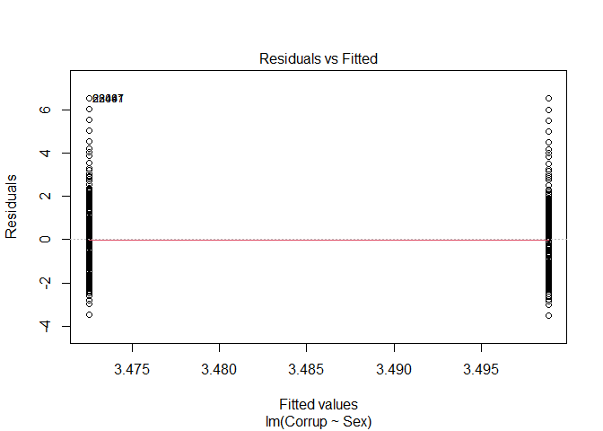<!-- -->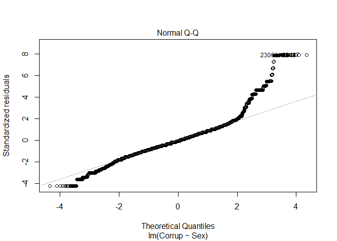<!-- -->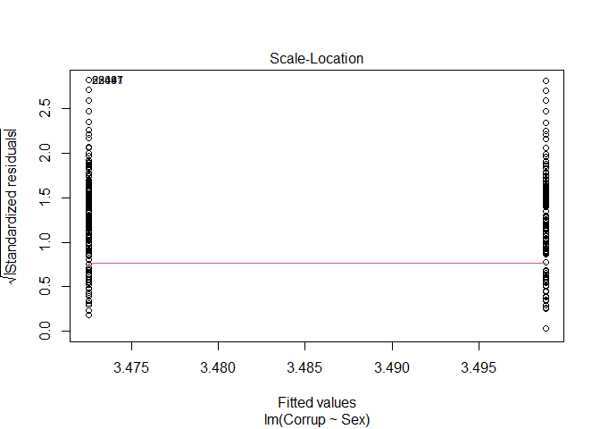<!-- -->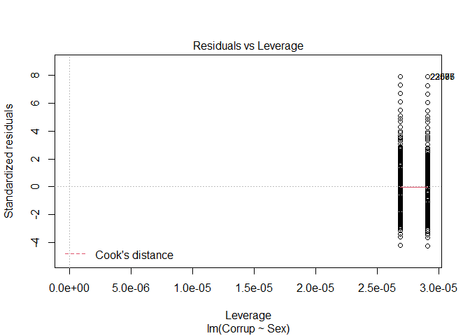<!-- -->

By evaluating the assumptions with the plots, we see that there is no
sign of violating the assumptions of linearity, homogeneity of
variances, or outliers. But, there are signs of violations of the
assumption of normally distributed residuals, at the tails of the
distributions.

## Effect size

As we still have only one predictor, the $R^2$, $\eta^2$, and $\omega^2$
will present the same results. We find that `Sex` explains 0.025% of the
outcome’s variance.

``` r
eta_squared(mod2, partial=F)
```

    ## # Effect Size for ANOVA (Type I)
    ## 
    ## Parameter |     Eta2 |       95% CI
    ## -----------------------------------
    ## Sex       | 2.54e-04 | [0.00, 1.00]
    ## 
    ## - One-sided CIs: upper bound fixed at [1.00].

``` r
omega_squared(mod2, partial=F)
```

    ## # Effect Size for ANOVA (Type I)
    ## 
    ## Parameter |   Omega2 |       95% CI
    ## -----------------------------------
    ## Sex       | 2.40e-04 | [0.00, 1.00]
    ## 
    ## - One-sided CIs: upper bound fixed at [1.00].

## Slope plots

When we plot the slopes for a categorical predictor `visreg` will
present it like a box plot for each group. It will do this if the
predictor is set as a `factor` type variable.

``` r
visreg(mod2, type = "conditional")
```

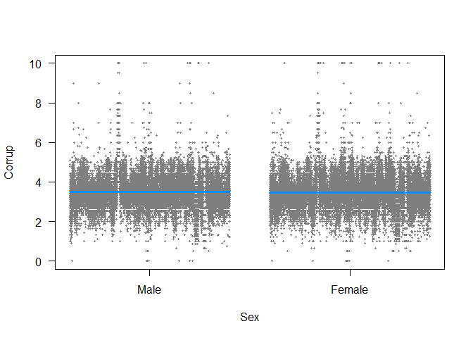<!-- -->

The blue line is the mean for each group, and the points are the
observed data. We see a wide spread of points above and below the mean,
and the means are very close to each other.

## Interpretation of the results

We will get the interpretation from the `summary()` output

``` r
summary(mod2)
```

    ## 
    ## Call:
    ## lm(formula = Corrup ~ Sex, data = dat2)
    ## 
    ## Residuals:
    ##     Min      1Q  Median      3Q     Max 
    ## -3.4988 -0.4988 -0.0440  0.5012  6.5275 
    ## 
    ## Coefficients:
    ##              Estimate Std. Error t value Pr(>|t|)    
    ## (Intercept)  3.498834   0.004444 787.229  < 2e-16 ***
    ## SexFemale   -0.026294   0.006166  -4.265 2.01e-05 ***
    ## ---
    ## Signif. codes:  0 '***' 0.001 '**' 0.01 '*' 0.05 '.' 0.1 ' ' 1
    ## 
    ## Residual standard error: 0.8245 on 71631 degrees of freedom
    ## Multiple R-squared:  0.0002538,  Adjusted R-squared:  0.0002399 
    ## F-statistic: 18.19 on 1 and 71631 DF,  p-value: 2.006e-05

-   From the overall model test, we reject the null hypothesis of the
    model being as good as the sample mean at predicting the outcome.
    Also could be seen as rejecting the null hypothesis of $R^2 = 0$.
    $F(1, 71631) = 18.19, p < .001$.
-   The model explains 0.025% of the variance in Perception of
    corruption ($R^2 = 0.00025$).
-   When *Sex* is at its baseline category (*Male*), the expected score
    in Perception of corruption is 3.50, and we reject the null
    hypothesis of this intercept being equal to 0,
    $b_0 = 3.50, SE = 0.004, p < .001$. Or could also say that the mean
    Perception of corruption for *Male* is 3.50.
-   As *Sex* changes category to *Female*, the perception in corruption
    decreases by 0.026 points, and we reject the null hypothesis of this
    slope (mean change) being equal to 0,
    $b_1 = -0.026, SE = 0.006, p < .001$. Or we could say that the mean
    difference between *Male* and *Female* is 0.026.

# Multiple Linear regression

An advantage of the General Linear Models, is the flexibility that they
have to include multiple predictors, and they can be any combination of
continuous and/or categorical.

In this following example we are adding four continuous predictors, and
one categorical:

-   Sex: Male, Female
-   Q262: age in years
-   Y001: post-materialism index
-   SACSECVAL: secular values
-   LCGov: Lack of Confidence in the government

We see that we can add multiple predictors by adding to the original
formula, such as `Outcome ~ Predictor1 + Predictor2 + Predictor3 + ...`
. This way you can extende it with as many predictors as your data,
model, and theory allows it.

``` r
mod3 <- lm(Corrup ~ Sex + Q262 + Y001 + SACSECVAL + LCGov, data=dat2)
summary(mod3)
```

    ## 
    ## Call:
    ## lm(formula = Corrup ~ Sex + Q262 + Y001 + SACSECVAL + LCGov, 
    ##     data = dat2)
    ## 
    ## Residuals:
    ##     Min      1Q  Median      3Q     Max 
    ## -3.7910 -0.4508 -0.0277  0.4112  6.9774 
    ## 
    ## Coefficients:
    ##               Estimate Std. Error t value Pr(>|t|)    
    ## (Intercept)  3.0681449  0.0142328 215.569  < 2e-16 ***
    ## SexFemale   -0.0359812  0.0056060  -6.418 1.39e-10 ***
    ## Q262        -0.0046809  0.0001733 -27.016  < 2e-16 ***
    ## Y001        -0.0661111  0.0023490 -28.144  < 2e-16 ***
    ## SACSECVAL   -1.0709923  0.0171199 -62.558  < 2e-16 ***
    ## LCGov        0.4553024  0.0040452 112.553  < 2e-16 ***
    ## ---
    ## Signif. codes:  0 '***' 0.001 '**' 0.01 '*' 0.05 '.' 0.1 ' ' 1
    ## 
    ## Residual standard error: 0.7492 on 71627 degrees of freedom
    ## Multiple R-squared:  0.1745, Adjusted R-squared:  0.1744 
    ## F-statistic:  3028 on 5 and 71627 DF,  p-value: < 2.2e-16

``` r
confint(mod3, level=0.95)
```

    ##                    2.5 %       97.5 %
    ## (Intercept)  3.040248627  3.096041098
    ## SexFemale   -0.046968945 -0.024993398
    ## Q262        -0.005020543 -0.004341345
    ## Y001        -0.070715184 -0.061506963
    ## SACSECVAL   -1.104547237 -1.037437312
    ## LCGov        0.447373746  0.463231028

## Model comparison

Before we had done two models, the first one with Just *Lack of
confidence* as predictor, and the second with just *Sex* as predictor.
Now we have added a total of five predictors.

Now we can also test the hypothesis of two models being equivalent. This
requires one model to be a subset of the second one. In this case we
will compare `mod1` with `mod3`. In this way `mod1` is a subset model
from `mod3`, as all the predictors of `mod1` are included in `mod3`,
with additional predictors.

We can compare the two models with the
\`\`ànova()`function, this is a general method in`R\`\`\` which
identifies the the type of models that are being compared, and uses the
correct method for the comparison. In this case does an *F-test*

``` r
anova(mod1, mod3)
```

    ## Analysis of Variance Table
    ## 
    ## Model 1: Corrup ~ LCGov
    ## Model 2: Corrup ~ Sex + Q262 + Y001 + SACSECVAL + LCGov
    ##   Res.Df   RSS Df Sum of Sq      F    Pr(>F)    
    ## 1  71631 43450                                  
    ## 2  71627 40207  4      3243 1444.3 < 2.2e-16 ***
    ## ---
    ## Signif. codes:  0 '***' 0.001 '**' 0.01 '*' 0.05 '.' 0.1 ' ' 1

Here the degrees of freedom (*df*) are the difference in number of
estimated parameters. In this case, we reject the null hypothesis of
that both models are equally good at predicting *Perception of
corruption*. Would lead us to choose the larger model.

## Standardize solution

Once we have decided to continue with `mod3`, we can also look at the
standardized slopes

``` r
mod3_st <- standardize(mod3)
summary(mod3_st)
```

    ## All variables in the model matrix and the dependent variable
    ## were centered. The centered variables have the letter "s" appended to their
    ## non-centered counterparts, even constructed
    ## variables like `x1:x2` and poly(x1,2). We agree, that's probably
    ## ill-advised, but you asked for it by running standardize().
    ## 
    ## The rockchalk function meanCenter is a smarter option, probably. 
    ## 
    ## The summary statistics of the variables in the design matrix. 
    ##            mean std.dev.
    ## Corrups       0        1
    ## SexFemales    0        1
    ## Q262s         0        1
    ## Y001s         0        1
    ## SACSECVALs    0        1
    ## LCGovs        0        1
    ## 
    ## Call:
    ## lm(formula = Corrups ~ -1 + SexFemales + Q262s + Y001s + SACSECVALs + 
    ##     LCGovs, data = stddat)
    ## 
    ## Residuals:
    ##     Min      1Q  Median      3Q     Max 
    ## -4.5975 -0.5467 -0.0336  0.4987  8.4617 
    ## 
    ## Coefficients:
    ##             Estimate Std. Error t value Pr(>|t|)    
    ## SexFemales -0.021801   0.003397  -6.418 1.39e-10 ***
    ## Q262s      -0.092092   0.003409 -27.016  < 2e-16 ***
    ## Y001s      -0.096775   0.003439 -28.144  < 2e-16 ***
    ## SACSECVALs -0.226937   0.003628 -62.559  < 2e-16 ***
    ## LCGovs      0.405007   0.003598 112.554  < 2e-16 ***
    ## ---
    ## Signif. codes:  0 '***' 0.001 '**' 0.01 '*' 0.05 '.' 0.1 ' ' 1
    ## 
    ## Residual standard error: 0.9086 on 71628 degrees of freedom
    ## Multiple R-squared:  0.1745, Adjusted R-squared:  0.1744 
    ## F-statistic:  3028 on 5 and 71628 DF,  p-value: < 2.2e-16

``` r
confint(mod3_st, level=0.95)
```

    ##                  2.5 %      97.5 %
    ## SexFemales -0.02845863 -0.01514365
    ## Q262s      -0.09877337 -0.08541101
    ## Y001s      -0.10351506 -0.09003587
    ## SACSECVALs -0.23404733 -0.21982721
    ## LCGovs      0.39795407  0.41205955

If we use these standardized slopes to rank the predictors effects, we
would conclude that *lack of confidence* if the one with the larger
effect, and *Sex* is the with with the smallest effect. Remember that
with this we can only rank the effects, but cannot test if a predictor
has an effect *significantly* larger than another.

## Assumptions

We will again use the diagnostic plots to evaluate for violations of the
model assumptions

``` r
plot(mod3)
```

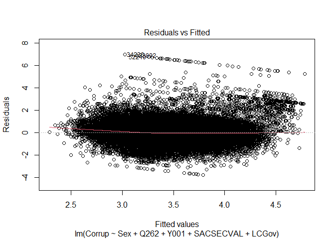<!-- -->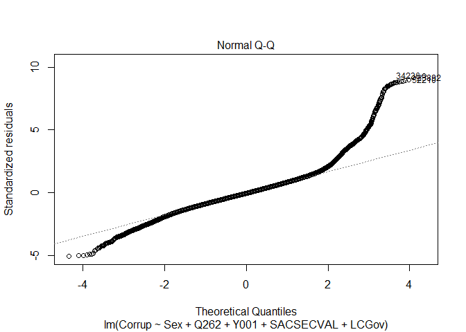<!-- -->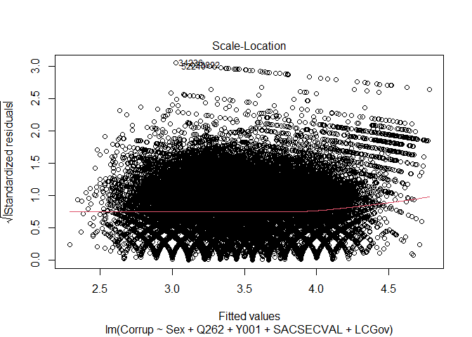<!-- -->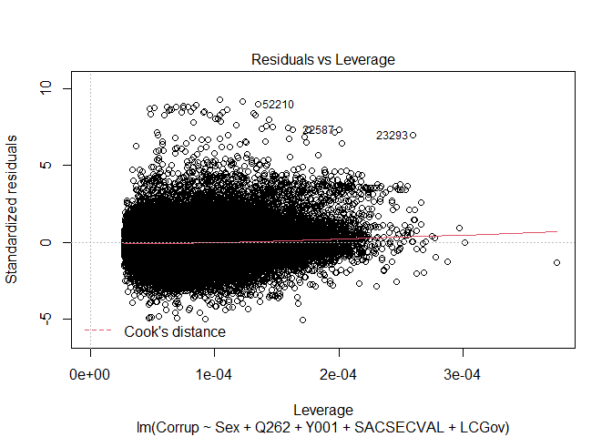<!-- -->

From the first, and third plots we see that there is a slight deviation
from the red *loess* line with the *expected* grey dotted line.
Indicating there might be small deviation from the linearity assumption
at the tails. This could be added into the model by adding the quadratic
effect of a predictor for example, `Q262^2`. But this still looks like
small deviation that would not lead me to consider it a meaningful
violation.

The other plots lead to no indication of violations of the homogeneity
of variance assumption, or outliers. And as the other models, we see the
assumption of normally distributed residuals violated in the tails of
the distribution.

## Effect size

For the overall model effect size we can look at the $R^2$, and
$R^2_{adj}$ in the summary output

``` r
summary(mod3)
```

    ## 
    ## Call:
    ## lm(formula = Corrup ~ Sex + Q262 + Y001 + SACSECVAL + LCGov, 
    ##     data = dat2)
    ## 
    ## Residuals:
    ##     Min      1Q  Median      3Q     Max 
    ## -3.7910 -0.4508 -0.0277  0.4112  6.9774 
    ## 
    ## Coefficients:
    ##               Estimate Std. Error t value Pr(>|t|)    
    ## (Intercept)  3.0681449  0.0142328 215.569  < 2e-16 ***
    ## SexFemale   -0.0359812  0.0056060  -6.418 1.39e-10 ***
    ## Q262        -0.0046809  0.0001733 -27.016  < 2e-16 ***
    ## Y001        -0.0661111  0.0023490 -28.144  < 2e-16 ***
    ## SACSECVAL   -1.0709923  0.0171199 -62.558  < 2e-16 ***
    ## LCGov        0.4553024  0.0040452 112.553  < 2e-16 ***
    ## ---
    ## Signif. codes:  0 '***' 0.001 '**' 0.01 '*' 0.05 '.' 0.1 ' ' 1
    ## 
    ## Residual standard error: 0.7492 on 71627 degrees of freedom
    ## Multiple R-squared:  0.1745, Adjusted R-squared:  0.1744 
    ## F-statistic:  3028 on 5 and 71627 DF,  p-value: < 2.2e-16

Here we see that the overall model explains 17.5% of the variance in
*Perception of corruption*. But this only presents the overall model
effect, it does not account for the predictive effect of each predictor.

We can identiy each predictor’s predictive effect with the full $\eta^2$
and $\omega^2$. Notice to estimate the *full* version of these metrics
we need to specify `partial=F`, so it does not estimate the partial
version.

These can be interpreted as the proportion of variance in the outcome
that es explained uniquely by each predictor

``` r
eta_squared(mod3, partial=F)
```

    ## # Effect Size for ANOVA (Type I)
    ## 
    ## Parameter |     Eta2 |       95% CI
    ## -----------------------------------
    ## Sex       | 2.54e-04 | [0.00, 1.00]
    ## Q262      | 9.31e-03 | [0.01, 1.00]
    ## Y001      | 9.81e-03 | [0.01, 1.00]
    ## SACSECVAL | 9.12e-03 | [0.01, 1.00]
    ## LCGov     |     0.15 | [0.12, 1.00]
    ## 
    ## - One-sided CIs: upper bound fixed at [1.00].

``` r
omega_squared(mod3, partial=F)
```

    ## # Effect Size for ANOVA (Type I)
    ## 
    ## Parameter |   Omega2 |       95% CI
    ## -----------------------------------
    ## Sex       | 2.42e-04 | [0.00, 1.00]
    ## Q262      | 9.30e-03 | [0.01, 1.00]
    ## Y001      | 9.80e-03 | [0.01, 1.00]
    ## SACSECVAL | 9.10e-03 | [0.01, 1.00]
    ## LCGov     |     0.15 | [0.12, 1.00]
    ## 
    ## - One-sided CIs: upper bound fixed at [1.00].

We can also estimate the partial version of these metrics $\eta^2_p$ and
$\omega^2_p$. Which are interpreted as the proportion of variance in the
outcome that uniquely explained by each predictor, that is not explained
by any other predictor.

``` r
eta_squared(mod3, partial=T)
```

    ## # Effect Size for ANOVA (Type I)
    ## 
    ## Parameter | Eta2 (partial) |       95% CI
    ## -----------------------------------------
    ## Sex       |       3.07e-04 | [0.00, 1.00]
    ## Q262      |           0.01 | [0.01, 1.00]
    ## Y001      |           0.01 | [0.01, 1.00]
    ## SACSECVAL |           0.01 | [0.01, 1.00]
    ## LCGov     |           0.15 | [0.09, 1.00]
    ## 
    ## - One-sided CIs: upper bound fixed at [1.00].

``` r
omega_squared(mod3, partial=T)
```

    ## # Effect Size for ANOVA (Type I)
    ## 
    ## Parameter | Omega2 (partial) |       95% CI
    ## -------------------------------------------
    ## Sex       |         2.93e-04 | [0.00, 1.00]
    ## Q262      |             0.01 | [0.01, 1.00]
    ## Y001      |             0.01 | [0.01, 1.00]
    ## SACSECVAL |             0.01 | [0.01, 1.00]
    ## LCGov     |             0.15 | [0.12, 1.00]
    ## 
    ## - One-sided CIs: upper bound fixed at [1.00].

Here we recommend the use of the *full* version of these metrics as it
presents a more direct interpretation, but the partial versions might be
commonly found in publications as they are default in other software.

$\eta^2$ can bee seen as the equivalent to the $R^2$, and $\omega^2$ as
the equivalent to $R^2_{adj}$. But for the individual predictor’s
effects

## Conditional Slope plots

For plotting the regression slopes, when we had a single predictor the
regression slope was equivalent to the scatter-plot. Now that we have
multiple predictors, the plots present the regression line when all the
other predictors are held constant, the conditional slopes. We can plot
these with the `visreg()` function, and specify which predictor to plot
with the `xvar` argument

``` r
visreg(mod3, type = "conditional", xvar = "Sex")
```

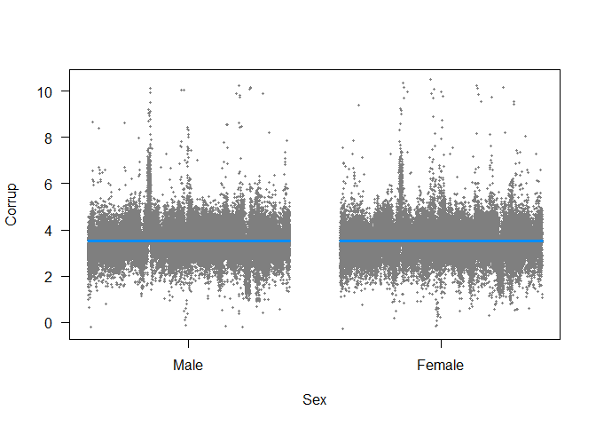<!-- -->

``` r
visreg(mod3, type = "conditional", xvar = "Q262")
```

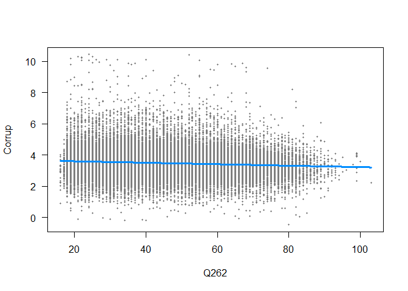<!-- -->

``` r
visreg(mod3, type = "conditional", xvar = "Y001")
```

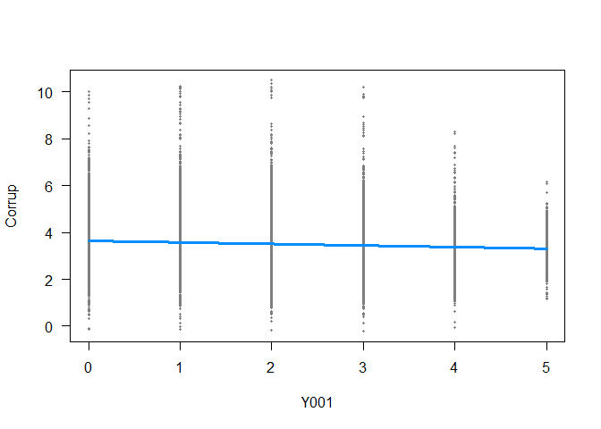<!-- -->

``` r
visreg(mod3, type = "conditional", xvar = "SACSECVAL")
```

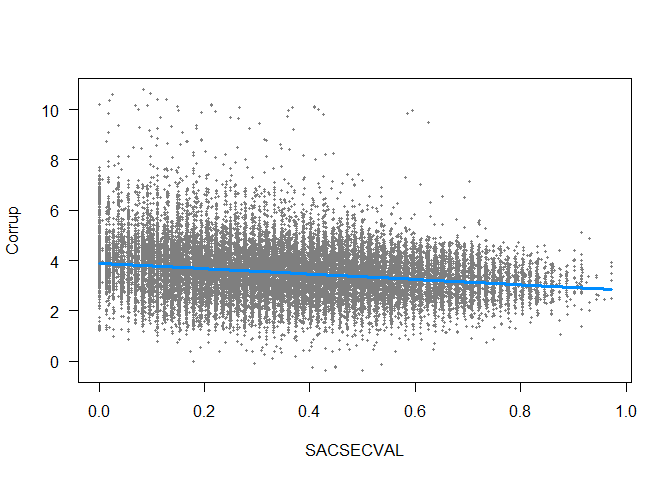<!-- -->

``` r
visreg(mod3, type = "conditional", xvar = "LCGov")
```

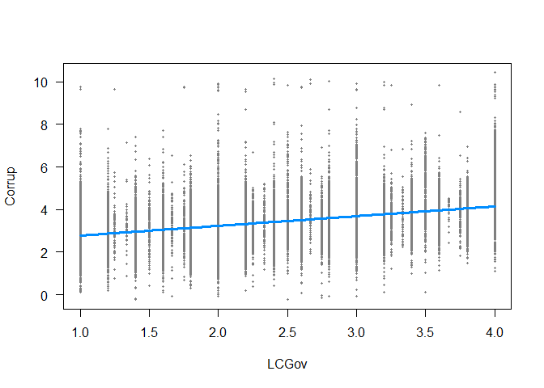<!-- -->

## Interpretation of the results

Now, there are a lot more pieces to add to the interpretation. Lets
start with the overall model null hypothesis test, from the
`summary(mod3)`

-   We reject the null hypothesis that the overall model is equivalent
    to the mean model at predicting *Perception of corruption*,
    $F(5, 71627) = 3028, p < .001$. With the overall model explaining
    17.5% ($R^2 = 0.1745$) of the variance in the outcome

Then we can continue to explain the effect of each predictor, by adding
information from the `summary()`, `standardize()`, and `eta_squared()`
functions

-   The expected average score of *Perception of corruption* for
    *Males*, and with 0 scores in all predictors is 3.07
    ($b_0 = 3.06, SE = 0.01, p < .001$), and we reject the null
    hypothesis of this expected score being equal to 0.
-   We find that *Female* have in average a *Perception of corruption*
    0.03 points lower than *Male*
    ($b_1 = -0.035, SE = 0.005, p < .001$), while holding all other
    predictors constant. We reject the null hypothesis of this mean
    difference being equal to 0. We see that *Sex* uniquely explains
    0.03% ($\eta^2 = 0.0003$) of the variance of the outcome.
-   As *Age* increases by 1 year, *Perception of corruption* decreases
    by 0.005 points in average($b_2 = -0.005, SE = 0.0002, p < .001$),
    while holding all other predictors constant. We reject the null
    hypothesis of this slope being equal to 0. We see that *Age*
    uniquely explains 0.93% ($\eta^2 = 0.0093$) of the variance of the
    outcome.
-   As *Post-materialism* increases by 1 unit, *Perception of
    corruption* decreases by 0.066 points in
    average($b_3 = -0.066, SE = 0.002, p < .001$), while holding all
    other predictors constant. We reject the null hypothesis of this
    slope being equal to 0. We see that *Post-materialism* uniquely
    explains 0.99% ($\eta^2 = 0.0098$) of the variance of the outcome.
-   As *Secular values* increases by 1 unit, *Perception of corruption*
    decreases by 1.07 points in
    average($b_4 = -1.07, SE = 0.017, p < .001$), while holding all
    other predictors constant. We reject the null hypothesis of this
    slope being equal to 0. We see that *Secular values* uniquely
    explains 0.91% ($\eta^2 = 0.0091$) of the variance of the outcome.
-   As *Lack of Confidence in the Government* increases by 1 unit,
    *Perception of corruption* increases by 0.455 points in
    average($b_5 = 0.455, SE = 0.004, p < .001$), while holding all
    other predictors constant. We reject the null hypothesis of this
    slope being equal to 0. We see that *Lack of Confidence in the
    Government* uniquely explains 14.6% ($\eta^2 = 0.146$) of the
    variance of the outcome.
-   Based on the relative effect measure of $\eta^2$ we can conclude
    that *Lack of Confidence in the Government* presents the stronger
    predictive effect, while *Sex* presents the lowest predictive
    effect. After controlling for the other predictors.
