Linear Regression
================
Mauricio Garnier-Villarreal
05 February, 2026

- [Setup the R session](#setup-the-r-session)
- [Import the data set](#import-the-data-set)
  - [Prepare the data set](#prepare-the-data-set)
    - [Create composite scores](#create-composite-scores)
    - [Transform categorical variables to
      `factor()`](#transform-categorical-variables-to-factor)
    - [Set variables for analysis](#set-variables-for-analysis)
- [Simple Linear regression](#simple-linear-regression)
  - [Standardize solution](#standardize-solution)
  - [Assumptions](#assumptions)
  - [Effect size](#effect-size)
  - [Slope plots](#slope-plots)
  - [Interpretation of the results](#interpretation-of-the-results)
- [Linear regression with a binary
  predictor](#linear-regression-with-a-binary-predictor)
  - [Post-hoc comparisons](#post-hoc-comparisons)
  - [Standardize solution](#standardize-solution-1)
  - [Assumptions](#assumptions-1)
  - [Effect size](#effect-size-1)
  - [Slope plots](#slope-plots-1)
  - [Interpretation of the results](#interpretation-of-the-results-1)
- [Linear regression with a categorical predictor (more than 2
  categories)](#linear-regression-with-a-categorical-predictor-more-than-2-categories)
  - [Post-hoc comparisons](#post-hoc-comparisons-1)
  - [Standardize solution](#standardize-solution-2)
  - [Assumptions](#assumptions-2)
  - [Effect size](#effect-size-2)
  - [Slope plots](#slope-plots-2)
- [Multiple Linear regression](#multiple-linear-regression)
  - [Model comparison](#model-comparison)
  - [Post-hoc comparisons](#post-hoc-comparisons-2)
  - [Standardize solution](#standardize-solution-3)
  - [Assumptions](#assumptions-3)
  - [Effect size](#effect-size-3)
  - [Conditional Slope plots](#conditional-slope-plots)
  - [Interpretation of the results](#interpretation-of-the-results-2)

# Setup the R session

When we start working in R, we always need to setup our session. For
this we need to set our working directory, in this case I am doing that
for the folder that holds the downloaded [World Values Survey
(WVS)](https://www.worldvaluessurvey.org/) `SPSS` data set

``` r
setwd("~path_to_your_file")
```

The next step for setting up our session will be to load the packages
that we will be using

``` r
library(rio)
library(psych)
library(effectsize)
library(marginaleffects)
library(ggplot2)
library(parameters)
library(car)
library(patchwork)
library(summarytools)
```

# Import the data set

Here we will be importing the `.sav` WVS data set

``` r
dat <- import("WVS_Cross-National_Wave_7_sav_v2_0.sav")
dim(dat)
```

    ## [1] 76897   548

Here we are calling our data set **dat** and asking to see the dimension
of it. We see that the data set has 76897 subjects, and 548 columns.

## Prepare the data set

In cases with large data sets like this we might want to select a subset
of variables that we want to work with. Since it is not easy to see 548
variables.

``` r
vars <- c("Q260","Q262", "Y001", "SACSECVAL", "Q112", "Q113", "Q114", "Q115", "Q116", "Q117", "Q118", "Q119", "Q120", "Q65", "Q69", "Q71", "Q72", "Q73")
dat2 <- dat[,vars]
dim(dat2)
```

    ## [1] 76897    18

``` r
head(dat2)
```

    ##   Q260 Q262 Y001 SACSECVAL Q112 Q113 Q114 Q115 Q116 Q117 Q118 Q119 Q120 Q65 Q69
    ## 1    2   60    0  0.287062    2   NA   NA   NA   NA   NA    1    2    6  NA   1
    ## 2    1   47    2  0.467525   10    3    3    3    3    3    1    3    2  NA   3
    ## 3    1   48    4  0.425304    7    2    2    2    2    2    1    2    7  NA   2
    ## 4    2   62    2  0.556170    5    3    3    3    3    2    1    4    7  NA   3
    ## 5    1   49    1  0.458949    5    2    2    2    2    1    1    3    7  NA   2
    ## 6    2   51    3  0.210111    6    2    2    2    2    2    1    4    2  NA   1
    ##   Q71 Q72 Q73
    ## 1   1   1   1
    ## 2   4   4   4
    ## 3   3   3   3
    ## 4   3   3   3
    ## 5   2   3   2
    ## 6   2   2   2

Here we are first creating a vector with the variable names for the ones
I want to keep. You can see all variable names for the full data set as
well:

``` r
colnames(dat)
```

After identifying which variables we will work with, we create a new
data set **dat2** with only these 17 variables, and make sure we did it
correctly by looking at the the dimension of the data **dim(dat2)**. We
also look at the first 6 rows: **head(dat2)**. These are quick checks
that we have created the new data correctly.

The variables we will use here are:

- Q260: sex, 1 = Male, 2 = Female
- Q262: age in years
- Y001: post-materialism index
- SACSECVAL: secular values
- Q112-Q120: Corruption Perception Index
- Q65-Q73: Lack of Confidence in the government

### Create composite scores

We will be using the composite scores for *Corruption Perception Index*
and *Lack of Confidence in the government* instead of their single
items. So, we first need to compute them, we will use the mean across
all items for each composite

``` r
dat2$Corrup <- rowMeans(dat2[,c("Q112", "Q113", "Q114", "Q115", "Q116", "Q117", "Q118", "Q119", "Q120")], na.rm=T)
dat2$LCGov <- rowMeans(dat2[,c("Q65", "Q69", "Q71", "Q72", "Q73")], na.rm=T)
head(dat2)
```

    ##   Q260 Q262 Y001 SACSECVAL Q112 Q113 Q114 Q115 Q116 Q117 Q118 Q119 Q120 Q65 Q69
    ## 1    2   60    0  0.287062    2   NA   NA   NA   NA   NA    1    2    6  NA   1
    ## 2    1   47    2  0.467525   10    3    3    3    3    3    1    3    2  NA   3
    ## 3    1   48    4  0.425304    7    2    2    2    2    2    1    2    7  NA   2
    ## 4    2   62    2  0.556170    5    3    3    3    3    2    1    4    7  NA   3
    ## 5    1   49    1  0.458949    5    2    2    2    2    1    1    3    7  NA   2
    ## 6    2   51    3  0.210111    6    2    2    2    2    2    1    4    2  NA   1
    ##   Q71 Q72 Q73   Corrup LCGov
    ## 1   1   1   1 2.750000  1.00
    ## 2   4   4   4 3.444444  3.75
    ## 3   3   3   3 3.000000  2.75
    ## 4   3   3   3 3.444444  3.00
    ## 5   2   3   2 2.777778  2.25
    ## 6   2   2   2 2.555556  1.75

With the `rowmeans()` we compute the mean across the specified
variables, for each subject. Remember to include the `na.rm=T` argument,
so the missing values are properly ignored.

### Transform categorical variables to `factor()`

when we want to use categorical variables as predictors, it is
recommended to transformed them as `factor` type in `R`. In this case we
will use the *Sex* variable `Q260`, which is coded as 1 and 2 right now.

With the `factor()` function we an transform it, and change the numbers
to meaningful labels.

``` r
dat2$Sex <- factor(dat2$Q260, 
                       levels = 1:2,
                       labels = c("Male","Female") )
```

### Set variables for analysis

Now, we will select only the variables of interest in a separate data
set.

``` r
dat2 <- na.omit(dat2[,c("Sex", "Q262", "Y001", "SACSECVAL", "Corrup", "LCGov")])
head(dat2)
```

    ##      Sex Q262 Y001 SACSECVAL   Corrup LCGov
    ## 1 Female   60    0  0.287062 2.750000  1.00
    ## 2   Male   47    2  0.467525 3.444444  3.75
    ## 3   Male   48    4  0.425304 3.000000  2.75
    ## 4 Female   62    2  0.556170 3.444444  3.00
    ## 5   Male   49    1  0.458949 2.777778  2.25
    ## 6 Female   51    3  0.210111 2.555556  1.75

``` r
dim(dat2)
```

    ## [1] 71633     6

The new `dat2` data set only include the 6 continuous variables of
interest, and 1 binary variable. With the `na.omit()` function we are
excluding all cases with some missing values.

# Simple Linear regression

With linear regression we need to define an outcome (dependent) and
predictor(s) (independent) variables. This way specifying directional
relations. For this example, we will use *Perception of corruption* as
the outcome, and *Lack of confidence in the government* as predictor.

``` r
mod1 <- lm(Corrup ~ LCGov, data=dat2)
```

Here we named the result of the regression `mod1`, we use the function
`lm()` which stands for *linear model*. This function requires 2
arguments, first the *formula*, which is a general formula form used in
a lot of `R`packages. The formula general form is \`\`Òutcome ~
Predictor\`\`\`. And the second argument is the data set.

Notice that when we run the regression, we don’t see any results. `R`
will only show you what you ask. The default results are shown by the
`summary()` function. If you ask for the `summary()` of the regression
model, you can see the regression table, overall model test (*F-test*),
and $R^2$.

``` r
summary(mod1)
```

    ## 
    ## Call:
    ## lm(formula = Corrup ~ LCGov, data = dat2)
    ## 
    ## Residuals:
    ##     Min      1Q  Median      3Q     Max 
    ## -3.8382 -0.4692 -0.0570  0.4203  7.0851 
    ## 
    ## Coefficients:
    ##             Estimate Std. Error t value Pr(>|t|)    
    ## (Intercept) 2.545653   0.010504  242.34   <2e-16 ***
    ## LCGov       0.369293   0.003967   93.08   <2e-16 ***
    ## ---
    ## Signif. codes:  0 '***' 0.001 '**' 0.01 '*' 0.05 '.' 0.1 ' ' 1
    ## 
    ## Residual standard error: 0.7788 on 71631 degrees of freedom
    ## Multiple R-squared:  0.1079, Adjusted R-squared:  0.1079 
    ## F-statistic:  8665 on 1 and 71631 DF,  p-value: < 2.2e-16

We can also ask for the confidence intervals with

``` r
confint(mod1, level = 0.95)
```

    ##                 2.5 %    97.5 %
    ## (Intercept) 2.5250647 2.5662413
    ## LCGov       0.3615173 0.3770689

For this we need to specify the regression model, and confidence level.
This example will estimate the 95% Confidence Interval for all the
parameters in the model.

We can also use the package `parameters` to create a summary table with
the coefficients, standard errors, and confidence intervals

``` r
parameters(mod1, digits=3)
```

    ## Parameter   | Coefficient |    SE |         95% CI | t(71631) |      p
    ## ----------------------------------------------------------------------
    ## (Intercept) |       2.546 | 0.011 | [2.525, 2.566] |  242.345 | < .001
    ## LCGov       |       0.369 | 0.004 | [0.362, 0.377] |   93.085 | < .001

    ## 
    ## Uncertainty intervals (equal-tailed) and p-values (two-tailed) computed
    ##   using a Wald t-distribution approximation.

## Standardize solution

It is common to look at the standardize regression slopes, we can
estimate this with the `standardize_parameters()` function from the
`parameters`package

``` r
standardize_parameters(mod1)
```

    ## # Standardization method: refit
    ## 
    ## Parameter   | Std. Coef. |        95% CI
    ## ----------------------------------------
    ## (Intercept) |   1.28e-15 | [-0.01, 0.01]
    ## LCGov       |       0.33 | [ 0.32, 0.34]

The `standardize_parameters()` function only requires the previous
regression model, and it reports the CI automatically. It estimates the
fully standardize regression. It is worth to note that when you have
only 1 predictor, the standardize regression slope is equivalent to the
*Pearson* correlation coefficient.

``` r
corr.test(dat2[,c("Corrup","LCGov")], method="pearson")
```

    ## Call:corr.test(x = dat2[, c("Corrup", "LCGov")], method = "pearson")
    ## Correlation matrix 
    ##        Corrup LCGov
    ## Corrup   1.00  0.33
    ## LCGov    0.33  1.00
    ## Sample Size 
    ## [1] 71633
    ## Probability values (Entries above the diagonal are adjusted for multiple tests.) 
    ##        Corrup LCGov
    ## Corrup      0     0
    ## LCGov       0     0
    ## 
    ##  To see confidence intervals of the correlations, print with the short=FALSE option

## Assumptions

The linear model assumptions can not be evaluated on the data, but only
once the model has been estimated. In `R` the most practical way to do
this is with the default plots for `lm()`

``` r
plot(mod1)
```

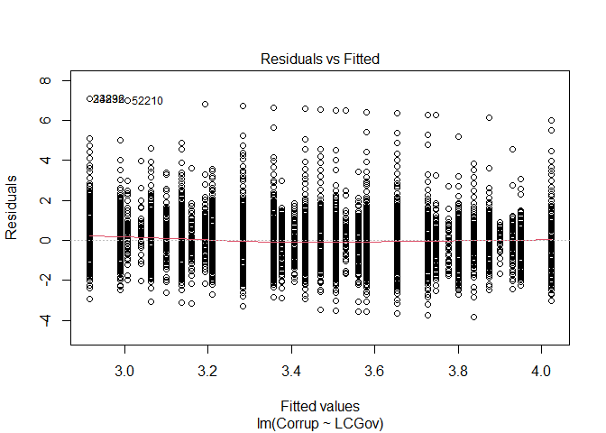<!-- -->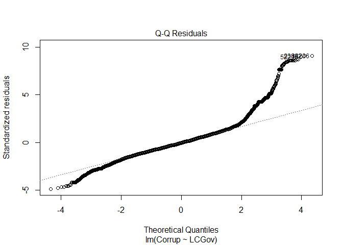<!-- -->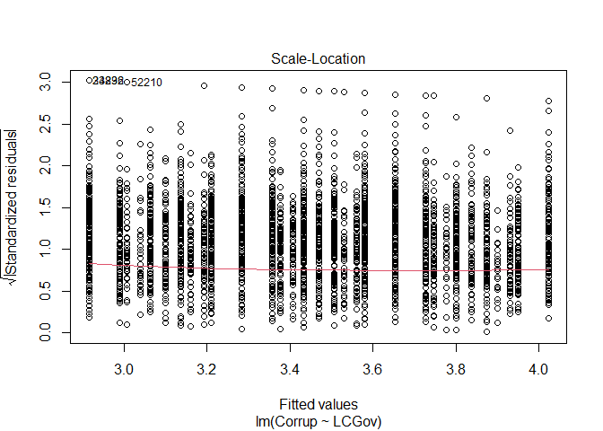<!-- -->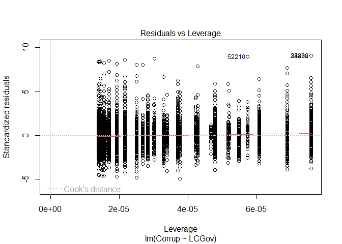<!-- -->

Here we see various diagnostic plots. The **first** one presents the
fitted values (predicted) against the model residuals (difference
between predicted and observed values). With this plot we can evaluate
linearity, and homogeneity of variance. If the *loess* (red) line is
flat, mostly on top of the *expected* (grey dotted) line, this indicates
that the linearity assumption is not violated. The linearity assumption
would be violated when the *loess* line presents a curve that
meaningfully deviates from the *expected* line. We can evaluate the
homogeneity of variance, by looking at the spread of the points across
the *x-axis*. If the points seems to have similar spread would indicate
no violation of the homogeneity of variance assumption. When the
homogeneity of variance assumption is violated, it presents clear
differences in the spread of the points across the *x-axis*.

The **second** plot presents the *QQ* plot for the standardized
residuals. This plots the theoretical quantiles (*x-axis*) against the
standardized residuals (*y-axis*). With this plot we can evaluate the
assumption of normality of the residuals. If the residuals are perfectly
normal, the residual points would follow the theoretical diagonal line.
Deviations from the theoretical line would indicate violations of the
residual normality assumption. In this case we can see deviations from
the theoretical line at the low and high ends.

The **third** plot is similar to the first one, with the fitted values
on the *x-axis*, but presenting the squared standardized residuals on
the *y-axis*. With the similarities with the first plot, we can evaluate
the same assumptions (linearity and homogeneity of variances), and
follow the same guidelines to review them. In this case we see no
meaningful deviations from either assumption.

Lastly, the **fourth** plot presents the leverage against the residuals.
With this we can evaluate the presence of outliers. More specifically
with Cook’s distance, when outliers are present they will be shown out
of a red-dotted line indicating that they are outliers according to the
Cook’s distance.

It is worth to remember that the linear models are robust to violations
of the normality, homogeneity of variance, and outliers. But it is not
robust to violations of linearity.

## Effect size

From the overall model we will use the $R^2$, and $R^2_{adj}$ as
measures of model predictive accuracy. And $\eta^2$, $\omega^2$ as
measure of predictor relative relevance. For simple regression (with
only one predictor) overall model and predictor relevance would be
equal, as the single indicator is the whole model

We can see the overall model ones from the `summary()` output

``` r
summary(mod1)
```

    ## 
    ## Call:
    ## lm(formula = Corrup ~ LCGov, data = dat2)
    ## 
    ## Residuals:
    ##     Min      1Q  Median      3Q     Max 
    ## -3.8382 -0.4692 -0.0570  0.4203  7.0851 
    ## 
    ## Coefficients:
    ##             Estimate Std. Error t value Pr(>|t|)    
    ## (Intercept) 2.545653   0.010504  242.34   <2e-16 ***
    ## LCGov       0.369293   0.003967   93.08   <2e-16 ***
    ## ---
    ## Signif. codes:  0 '***' 0.001 '**' 0.01 '*' 0.05 '.' 0.1 ' ' 1
    ## 
    ## Residual standard error: 0.7788 on 71631 degrees of freedom
    ## Multiple R-squared:  0.1079, Adjusted R-squared:  0.1079 
    ## F-statistic:  8665 on 1 and 71631 DF,  p-value: < 2.2e-16

Or you can only extract the $R^2$ by calling only that object of the
summary with the `$` operator

``` r
summary(mod1)$r.squared
```

    ## [1] 0.1079114

In this case we see that $R^2 = 0.1079$, meaning that Lack of confidence
in the government explains 10.8% of the variance in Perception of
Corruption.

``` r
eta_squared(Anova(mod1, type=2), partial=F)
```

    ## # Effect Size for ANOVA (Type II)
    ## 
    ## Parameter | Eta2 |       95% CI
    ## -------------------------------
    ## LCGov     | 0.11 | [0.10, 1.00]
    ## 
    ## - One-sided CIs: upper bound fixed at [1.00].

``` r
omega_squared(Anova(mod1, type=2), partial=F)
```

    ## # Effect Size for ANOVA (Type II)
    ## 
    ## Parameter | Omega2 |       95% CI
    ## ---------------------------------
    ## LCGov     |   0.11 | [0.10, 1.00]
    ## 
    ## - One-sided CIs: upper bound fixed at [1.00].

We can see that $R^2$, $R^2_{adj}$, $\eta^2$, and $\omega^2$ presents
the same estimate up to the third decimal. Later we will show the
interpretation of these different metrics when multiple indicators are
present.

## Slope plots

We also want to plot the regression line, as the predicted scores next
to the observed data. We can do this with the \``marginaleffects`
package.

``` r
plot_predictions(mod1, condition="LCGov")
```

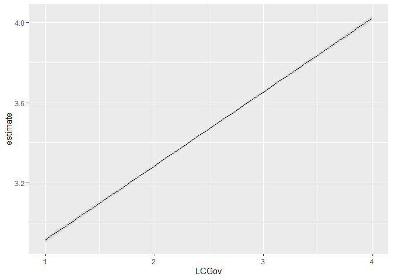<!-- -->

The `plot_predictions()` function takes the \``lm()` model and the
predictor to plot in the argument `condition`, and will plot the
regression line with the confidence intervals in grey (we can not see
the CI bands because of the large sample they are very small) on top the
observed points.

with a single predictor, this is equivalent to the observed
scatter-plot. when we add multiple predictors this change to conditional
regression lines.

## Interpretation of the results

Here we will present how to interpret the model results. With a single
indicator we get all the information we need from the `summary()` or
`parameters` function.

``` r
summary(mod1)
```

    ## 
    ## Call:
    ## lm(formula = Corrup ~ LCGov, data = dat2)
    ## 
    ## Residuals:
    ##     Min      1Q  Median      3Q     Max 
    ## -3.8382 -0.4692 -0.0570  0.4203  7.0851 
    ## 
    ## Coefficients:
    ##             Estimate Std. Error t value Pr(>|t|)    
    ## (Intercept) 2.545653   0.010504  242.34   <2e-16 ***
    ## LCGov       0.369293   0.003967   93.08   <2e-16 ***
    ## ---
    ## Signif. codes:  0 '***' 0.001 '**' 0.01 '*' 0.05 '.' 0.1 ' ' 1
    ## 
    ## Residual standard error: 0.7788 on 71631 degrees of freedom
    ## Multiple R-squared:  0.1079, Adjusted R-squared:  0.1079 
    ## F-statistic:  8665 on 1 and 71631 DF,  p-value: < 2.2e-16

``` r
parameters(mod1, digits=3)
```

    ## Parameter   | Coefficient |    SE |         95% CI | t(71631) |      p
    ## ----------------------------------------------------------------------
    ## (Intercept) |       2.546 | 0.011 | [2.525, 2.566] |  242.345 | < .001
    ## LCGov       |       0.369 | 0.004 | [0.362, 0.377] |   93.085 | < .001

    ## 
    ## Uncertainty intervals (equal-tailed) and p-values (two-tailed) computed
    ##   using a Wald t-distribution approximation.

- From the overall model test, we reject the null hypothesis of the
  model being as good as the sample mean at predicting the outcome. Also
  could be seen as rejecting the null hypothesis of $R^2 = 0$.
  $F(1, 71631) = 8665, p < .001$.
- The model explains 10.8% of the variance in Perception of corruption
  ($R^2 = 0.1079$).
- When the Lack of confidence in the government is equal to 0, the
  expected score in Perception of corruption is 2.55, and we reject the
  null hypothesis of this intercept being equal to 0,
  $b_0 = 2.55, SE = 0.01, p < .001$.
- As Lack of confidence in the government increases by 1, the perception
  in corruption increases by 0.366 points, and we reject the null
  hypothesis of this slope being equal to 0,
  $b_1 = 0.369, SE = 0.004, p < .001$.
- From the standardize solution we see that as Lack of government
  confidence increases by 1 standard deviation, Perception of corruption
  increases by 0.33 standard deviations.

``` r
standardize_parameters(mod1)
```

    ## # Standardization method: refit
    ## 
    ## Parameter   | Std. Coef. |        95% CI
    ## ----------------------------------------
    ## (Intercept) |   1.28e-15 | [-0.01, 0.01]
    ## LCGov       |       0.33 | [ 0.32, 0.34]

# Linear regression with a binary predictor

We can run a regression where the predictor is a binary/categorical
variable. With a categorical variable with only 2 categories (binary),
this becomes equivalent to independent sample *t-test*. We can specify
this just by setting the categorical variable as the predictor in the
`R` formula, like this

``` r
mod2 <- lm(Corrup ~ Sex, data = dat2)
summary(mod2)
```

    ## 
    ## Call:
    ## lm(formula = Corrup ~ Sex, data = dat2)
    ## 
    ## Residuals:
    ##     Min      1Q  Median      3Q     Max 
    ## -3.4988 -0.4988 -0.0440  0.5012  6.5275 
    ## 
    ## Coefficients:
    ##              Estimate Std. Error t value Pr(>|t|)    
    ## (Intercept)  3.498834   0.004444 787.229  < 2e-16 ***
    ## SexFemale   -0.026294   0.006166  -4.265 2.01e-05 ***
    ## ---
    ## Signif. codes:  0 '***' 0.001 '**' 0.01 '*' 0.05 '.' 0.1 ' ' 1
    ## 
    ## Residual standard error: 0.8245 on 71631 degrees of freedom
    ## Multiple R-squared:  0.0002538,  Adjusted R-squared:  0.0002399 
    ## F-statistic: 18.19 on 1 and 71631 DF,  p-value: 2.006e-05

``` r
parameters(mod2, digits=3)
```

    ## Parameter    | Coefficient |    SE |           95% CI | t(71631) |      p
    ## -------------------------------------------------------------------------
    ## (Intercept)  |       3.499 | 0.004 | [ 3.490,  3.508] |  787.229 | < .001
    ## Sex [Female] |      -0.026 | 0.006 | [-0.038, -0.014] |   -4.265 | < .001

    ## 
    ## Uncertainty intervals (equal-tailed) and p-values (two-tailed) computed
    ##   using a Wald t-distribution approximation.

We see the way to implement is the same as before, it is important to
remember to set up the predictor as categorical with the `factor()`
function. We will present the difference in the interpretation in a
following sections.

It is worth noting that since our predictor is categorical, we see that
in the `summary` the slope name is `SexFemale`. This indicates that it
is the slope for the category `Female` and that the other category is
the baseline group of comparison, `Male` in this case.

## Post-hoc comparisons

With categorical predictors the slopes represent the mean difference
between groups, we can estimate all possible pairwise comparisons with
the `avg_comparisons` and specifying for which categorical variable we
want pairwise differences. For this example it is exactly the same as
the regression table because we only have 2 groups, but will look
different when you have more than 2 groups

``` r
avg_comparisons(mod2, 
                variables = list(Sex="pairwise") )
```

    ## 
    ##  Estimate Std. Error     z Pr(>|z|)    S   2.5 %  97.5 %
    ##   -0.0263    0.00617 -4.26   <0.001 15.6 -0.0384 -0.0142
    ## 
    ## Term: Sex
    ## Type: response
    ## Comparison: Female - Male

## Standardize solution

There are divided opinions about the worthiness of standardized slopes
for categorical predictors. I particularly don’t recommend it as it sets
up the slope in an uninterpretable metric, and the measures of relative
relevance such as $\eta^2$ are better to compare multiple predictors
effects.

``` r
standardize_parameters(mod2)
```

    ## # Standardization method: refit
    ## 
    ## Parameter    | Std. Coef. |         95% CI
    ## ------------------------------------------
    ## (Intercept)  |       0.02 | [ 0.01,  0.03]
    ## Sex [Female] |      -0.03 | [-0.05, -0.02]

This function doesnt standardize the categorical predictor, so the
interpretation is `Female` group has an standardize mean difference of
0.03 lower than `Male`, basically a *Cohen d*.

As you can see, the `standardize_parameters()` doesnt standardize the
slopes for categorical predictors. But… if you really want to get the
standardize estimates, you can add the `method="basic"` argument

``` r
standardize_parameters(mod2, method = "basic")
```

    ## # Standardization method: basic
    ## 
    ## Parameter    | Std. Coef. |         95% CI
    ## ------------------------------------------
    ## (Intercept)  |       0.00 | [ 0.00,  0.00]
    ## Sex [Female] |      -0.02 | [-0.02, -0.01]

## Assumptions

``` r
plot(mod2)
```

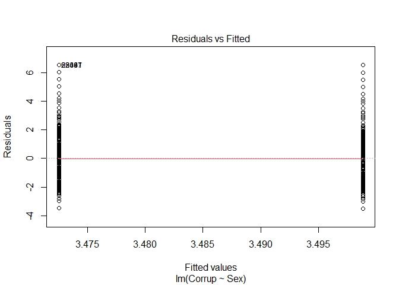<!-- -->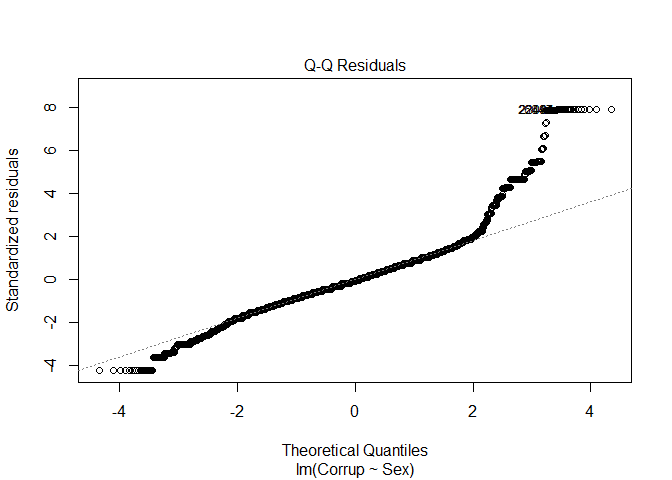<!-- -->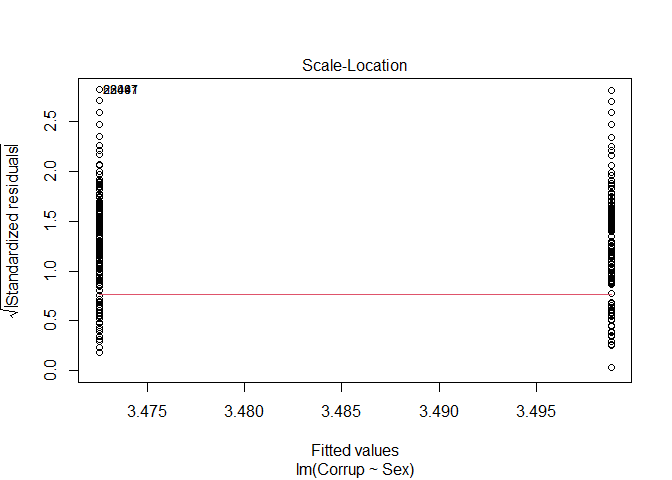<!-- -->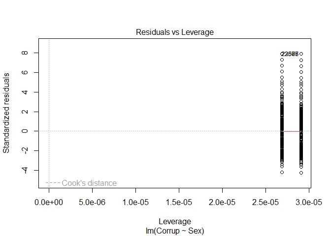<!-- -->

By evaluating the assumptions with the plots, we see that there is no
sign of violating the assumptions of linearity, homogeneity of
variances, or outliers. But, there are signs of violations of the
assumption of normally distributed residuals, at the tails of the
distributions.

## Effect size

As we still have only one predictor, the $R^2$, $\eta^2$, and $\omega^2$
will present the same results. We find that `Sex` explains 0.025% of the
outcome’s variance.

``` r
eta_squared(Anova(mod2, type=2), partial=F)
```

    ## # Effect Size for ANOVA (Type II)
    ## 
    ## Parameter |     Eta2 |       95% CI
    ## -----------------------------------
    ## Sex       | 2.54e-04 | [0.00, 1.00]
    ## 
    ## - One-sided CIs: upper bound fixed at [1.00].

``` r
omega_squared(Anova(mod2, type=2), partial=F)
```

    ## # Effect Size for ANOVA (Type II)
    ## 
    ## Parameter |   Omega2 |       95% CI
    ## -----------------------------------
    ## Sex       | 2.40e-04 | [0.00, 1.00]
    ## 
    ## - One-sided CIs: upper bound fixed at [1.00].

## Slope plots

When we plot the slopes for a categorical predictor `plot_predictions`
will present it like a box plot for each group. It will do this if the
predictor is set as a `factor` type variable.

``` r
plot_predictions(mod2, condition="Sex")
```

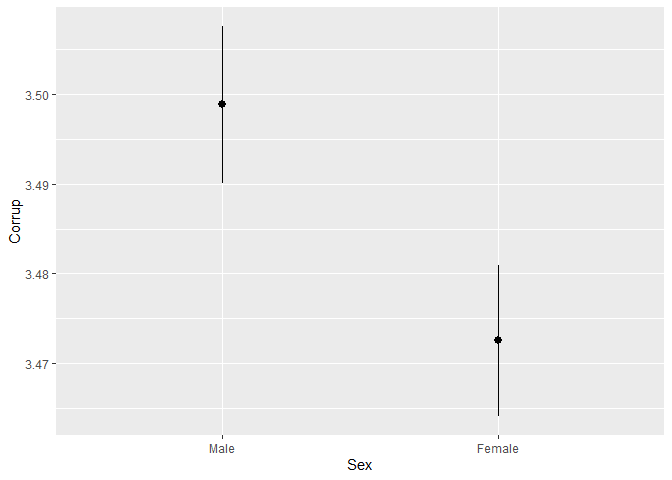<!-- -->

The point is the mean for each group and the lines represent the CI.

## Interpretation of the results

We will get the interpretation from the `summary()` output

``` r
summary(mod2)
```

    ## 
    ## Call:
    ## lm(formula = Corrup ~ Sex, data = dat2)
    ## 
    ## Residuals:
    ##     Min      1Q  Median      3Q     Max 
    ## -3.4988 -0.4988 -0.0440  0.5012  6.5275 
    ## 
    ## Coefficients:
    ##              Estimate Std. Error t value Pr(>|t|)    
    ## (Intercept)  3.498834   0.004444 787.229  < 2e-16 ***
    ## SexFemale   -0.026294   0.006166  -4.265 2.01e-05 ***
    ## ---
    ## Signif. codes:  0 '***' 0.001 '**' 0.01 '*' 0.05 '.' 0.1 ' ' 1
    ## 
    ## Residual standard error: 0.8245 on 71631 degrees of freedom
    ## Multiple R-squared:  0.0002538,  Adjusted R-squared:  0.0002399 
    ## F-statistic: 18.19 on 1 and 71631 DF,  p-value: 2.006e-05

``` r
parameters(mod2)
```

    ## Parameter    | Coefficient |       SE |         95% CI | t(71631) |      p
    ## --------------------------------------------------------------------------
    ## (Intercept)  |        3.50 | 4.44e-03 | [ 3.49,  3.51] |   787.23 | < .001
    ## Sex [Female] |       -0.03 | 6.17e-03 | [-0.04, -0.01] |    -4.26 | < .001

    ## 
    ## Uncertainty intervals (equal-tailed) and p-values (two-tailed) computed
    ##   using a Wald t-distribution approximation.

- From the overall model test, we reject the null hypothesis of the
  model being as good as the sample mean at predicting the outcome. Also
  could be seen as rejecting the null hypothesis of $R^2 = 0$.
  $F(1, 71631) = 18.19, p < .001$.
- The model explains 0.025% of the variance in Perception of corruption
  ($R^2 = 0.00025$).
- When *Sex* is at its baseline category (*Male*), the expected score in
  Perception of corruption is 3.50, and we reject the null hypothesis of
  this intercept being equal to 0, $b_0 = 3.50, SE = 0.004, p < .001$.
  Or could also say that the mean Perception of corruption for *Male* is
  3.50.
- As *Sex* changes category to *Female*, the perception in corruption
  decreases by 0.026 points, and we reject the null hypothesis of this
  slope (mean change) being equal to 0,
  $b_1 = -0.026, SE = 0.006, p < .001$. Or we could say that the mean
  difference between *Male* and *Female* is 0.026.

# Linear regression with a categorical predictor (more than 2 categories)

A binary predictor is most simple case of a categorical predictor. But
in many cases you might have a predictor with more than 2 categories.
Many part of the process looks the same, but we will highlight the
differences in this example.

For this example, we first need to categorize a continuous predictor.
But in general we dont recommend doing this, we will do it for the
example. Here we will categorize `Age` into age groups.

With the `table()` function we see that ages range from 16 to 103 in our
data set

``` r
table(dat2$Q262)
```

    ## 
    ##   16   17   18   19   20   21   22   23   24   25   26   27   28   29   30   31 
    ##   27   90 1433 1390 1514 1345 1523 1407 1576 1764 1465 1433 1643 1506 1968 1308 
    ##   32   33   34   35   36   37   38   39   40   41   42   43   44   45   46   47 
    ## 1608 1494 1422 1875 1478 1394 1612 1273 1769 1178 1386 1225 1202 1705 1235 1257 
    ##   48   49   50   51   52   53   54   55   56   57   58   59   60   61   62   63 
    ## 1319 1173 1448  976 1208 1191 1089 1529 1131 1015 1086  896 1229  841  918  927 
    ##   64   65   66   67   68   69   70   71   72   73   74   75   76   77   78   79 
    ##  866  996  760  703  730  576  692  450  405  366  329  291  274  280  229  198 
    ##   80   81   82   83   84   85   86   87   88   89   90   91   92   93   94   95 
    ##  210  157  166   89   94   72   52   37   34   27   15   17    9    9    3    2 
    ##   96   98   99  100  103 
    ##    1    1   10    1    1

Then we will use th `cut()` function to create groups in ranges of the
age variable. We assign it into a new variable `age_ran` , and provide
the continuous variable to the `cut()` function, lastly yoy add the
`breaks` for the continuous variable. This will cut the variable into
groups at the respective break points.

With `class()` we see that this automatically creates a `factor`
variable. And with the `freq()` function we can see the frequency table
for each group and the age range. This we can check that the groups were
created as we intended

``` r
dat2$age_ran <- cut(dat2$Q262, 
                    breaks = c(15, 18, 30, 50, 70, 103))

class(dat2$age_ran)
```

    ## [1] "factor"

``` r
freq(dat2$age_ran)
```

    ## Frequencies  
    ## dat2$age_ran  
    ## Type: Factor  
    ## 
    ##                   Freq   % Valid   % Valid Cum.   % Total   % Total Cum.
    ## -------------- ------- --------- -------------- --------- --------------
    ##        (15,18]    1550      2.16           2.16      2.16           2.16
    ##        (18,30]   18534     25.87          28.04     25.87          28.04
    ##        (30,50]   28361     39.59          67.63     39.59          67.63
    ##        (50,70]   19359     27.03          94.65     27.03          94.65
    ##       (70,103]    3829      5.35         100.00      5.35         100.00
    ##           <NA>       0                               0.00         100.00
    ##          Total   71633    100.00         100.00    100.00         100.00

Then we just add this new predictor in the `lm()` functions, just like
before. We can ask for the regression table either with the `summary` or
`parameters` functions. The regression table parameters show the mean
difference between each group with the reference group, in this case the
reference group is the `15 to 18`

``` r
mod_cat <- lm(Corrup ~ age_ran, data = dat2)
summary(mod_cat)
```

    ## 
    ## Call:
    ## lm(formula = Corrup ~ age_ran, data = dat2)
    ## 
    ## Residuals:
    ##     Min      1Q  Median      3Q     Max 
    ## -3.5586 -0.5187 -0.0743  0.4809  6.7503 
    ## 
    ## Coefficients:
    ##                 Estimate Std. Error t value Pr(>|t|)    
    ## (Intercept)      3.53954    0.02085 169.802  < 2e-16 ***
    ## age_ran(18,30]   0.01901    0.02170   0.876    0.381    
    ## age_ran(30,50]  -0.02082    0.02141  -0.973    0.331    
    ## age_ran(50,70]  -0.13153    0.02166  -6.072 1.27e-09 ***
    ## age_ran(70,103] -0.28985    0.02471 -11.732  < 2e-16 ***
    ## ---
    ## Signif. codes:  0 '***' 0.001 '**' 0.01 '*' 0.05 '.' 0.1 ' ' 1
    ## 
    ## Residual standard error: 0.8207 on 71628 degrees of freedom
    ## Multiple R-squared:  0.009525,   Adjusted R-squared:  0.009469 
    ## F-statistic: 172.2 on 4 and 71628 DF,  p-value: < 2.2e-16

``` r
parameters(mod_cat)
```

    ## Parameter         | Coefficient |   SE |         95% CI | t(71628) |      p
    ## ---------------------------------------------------------------------------
    ## (Intercept)       |        3.54 | 0.02 | [ 3.50,  3.58] |   169.80 | < .001
    ## age ran [>18-30]  |        0.02 | 0.02 | [-0.02,  0.06] |     0.88 | 0.381 
    ## age ran [>30-50]  |       -0.02 | 0.02 | [-0.06,  0.02] |    -0.97 | 0.331 
    ## age ran [>50-70]  |       -0.13 | 0.02 | [-0.17, -0.09] |    -6.07 | < .001
    ## age ran [>70-103] |       -0.29 | 0.02 | [-0.34, -0.24] |   -11.73 | < .001

    ## 
    ## Uncertainty intervals (equal-tailed) and p-values (two-tailed) computed
    ##   using a Wald t-distribution approximation.

This model is the same as an ANOVA, but presented with the regression
parameters. You can also get the ANOVA table from

``` r
Anova(mod_cat, type=2)
```

    ## Anova Table (Type II tests)
    ## 
    ## Response: Corrup
    ##           Sum Sq    Df F value    Pr(>F)    
    ## age_ran      464     4   172.2 < 2.2e-16 ***
    ## Residuals  48242 71628                      
    ## ---
    ## Signif. codes:  0 '***' 0.001 '**' 0.01 '*' 0.05 '.' 0.1 ' ' 1

And can also put that into the `parameters` function for a cleaner table

``` r
parameters(Anova(mod_cat, type=2))
```

    ## Parameter | Sum_Squares |    df | Mean_Square |      F |      p
    ## ---------------------------------------------------------------
    ## age_ran   |      463.90 |     4 |      115.97 | 172.20 | < .001
    ## Residuals |    48241.60 | 71628 |        0.67 |        |       
    ## 
    ## Anova Table (Type 2 tests)

## Post-hoc comparisons

With categorical predictors the slopes represent the mean difference
between groups, we can estimate all possible pairwise comparisons with
the `avg_comparisons` and specifying for which categorical variable we
want pairwise differences. For this example, as we have 5 groups, we get
10 total pair comparisons

``` r
pw2 <- avg_comparisons(mod_cat, type= "response",
                       variables = list(age_ran="pairwise") )
pw2
```

    ## 
    ##            Contrast Estimate Std. Error       z Pr(>|z|)     S   2.5 %  97.5 %
    ##  (18,30] - (15,18]    0.0190    0.02170   0.876    0.381   1.4 -0.0235  0.0615
    ##  (30,50] - (15,18]   -0.0208    0.02141  -0.973    0.331   1.6 -0.0628  0.0211
    ##  (30,50] - (18,30]   -0.0398    0.00775  -5.139   <0.001  21.8 -0.0550 -0.0246
    ##  (50,70] - (15,18]   -0.1315    0.02166  -6.072   <0.001  29.6 -0.1740 -0.0891
    ##  (50,70] - (18,30]   -0.1505    0.00843 -17.850   <0.001 234.3 -0.1671 -0.1340
    ##  (50,70] - (30,50]   -0.1107    0.00765 -14.470   <0.001 155.2 -0.1257 -0.0957
    ##  (70,103] - (15,18]  -0.2899    0.02471 -11.732   <0.001 103.2 -0.3383 -0.2414
    ##  (70,103] - (18,30]  -0.3089    0.01457 -21.201   <0.001 329.0 -0.3374 -0.2803
    ##  (70,103] - (30,50]  -0.2690    0.01413 -19.040   <0.001 266.1 -0.2967 -0.2413
    ##  (70,103] - (50,70]  -0.1583    0.01451 -10.907   <0.001  89.6 -0.1868 -0.1299
    ## 
    ## Term: age_ran
    ## Type: response

We can do different types of post-hoc comparisons, for example if we
specify `variables = list(age_ran="sequential")` we will get sequential
comparisons, so the first group compared with the second, and then the
second compare to the third, and so on

``` r
pw3 <- avg_comparisons(mod_cat, type= "response",
                       variables = list(age_ran="sequential") )
pw3
```

    ## 
    ##            Contrast Estimate Std. Error       z Pr(>|z|)     S   2.5 %  97.5 %
    ##  (18,30] - (15,18]    0.0190    0.02170   0.876    0.381   1.4 -0.0235  0.0615
    ##  (30,50] - (18,30]   -0.0398    0.00775  -5.139   <0.001  21.8 -0.0550 -0.0246
    ##  (50,70] - (30,50]   -0.1107    0.00765 -14.470   <0.001 155.2 -0.1257 -0.0957
    ##  (70,103] - (50,70]  -0.1583    0.01451 -10.907   <0.001  89.6 -0.1868 -0.1299
    ## 
    ## Term: age_ran
    ## Type: response

One last example I will present here is the case of planned contrasts,
this is the case were you want to test hypothesis “combining” some
groups, for example I want to compare the 2 youngest age groups against
the older ones.

We will do these comparisons in 2 steps, first we will estimate the
predicted means for each group with the `avg_predictions()` functions.
This will give us aobject with the saved mean predictors for each group.

``` r
avpred <- avg_predictions(mod_cat, 
                          variables = "age_ran")
avpred
```

    ## 
    ##   age_ran Estimate Std. Error   z Pr(>|z|)   S 2.5 % 97.5 %
    ##  (15,18]      3.54    0.02085 170   <0.001 Inf  3.50   3.58
    ##  (18,30]      3.56    0.00617 577   <0.001 Inf  3.55   3.57
    ##  (30,50]      3.52    0.00500 703   <0.001 Inf  3.51   3.53
    ##  (50,70]      3.41    0.00588 580   <0.001 Inf  3.40   3.42
    ##  (70,103]     3.25    0.01329 245   <0.001 Inf  3.22   3.28
    ## 
    ## Type: response

Then we use th `hypotheses()` function to build customize hypotheses. We
build this hypothesis with contrasts weights, in this example we are
combining the first 2 groups, and the last 3 groups. The contrasts
weights have some basic rules: - You specify which groups go together
with the sign of the weights, the ones with a `-` weight go together,
and positive ones go together - The weights should sume up to 1 in each
combined group. Thats why we use fractions in this example

``` r
hypotheses(avpred, 
           hypothesis = c(-1/2, -1/2, 1/3, 1/3, 1/3))
```

    ## 
    ##  Estimate Std. Error     z Pr(>|z|)     S 2.5 % 97.5 %
    ##    -0.157      0.012 -13.1   <0.001 128.3 -0.18 -0.133
    ## 
    ## Term: custom

Then we can also test multiple customize contrast at the same time. Save
all the desired contrasts into a matrix, where each column is a
contrast, and each row is a group. Here we use the function `cbind()` to
create this matrix, this function is column-bind, so each vector will be
a column in the new matrix

In this example, the first contrast is the same as before. The second
one combines the first 3 groups against the last 2. And the last one
ignores the first gorup (with a 0), and combines the second and third
group, against the fourth and fifth ones.

``` r
conts <- cbind(c(-1/2, -1/2, 1/3, 1/3, 1/3),
               c(-1/3, -1/3, -1/3, 1/2, 1/2),
               c(0, -1/2, -1/2, 1/2, 1/2))
conts
```

    ##            [,1]       [,2] [,3]
    ## [1,] -0.5000000 -0.3333333  0.0
    ## [2,] -0.5000000 -0.3333333 -0.5
    ## [3,]  0.3333333 -0.3333333 -0.5
    ## [4,]  0.3333333  0.5000000  0.5
    ## [5,]  0.3333333  0.5000000  0.5

``` r
hypotheses(avpred, hypothesis = conts, multcomp = "fdr")
```

    ## 
    ##  Estimate Std. Error     z Pr(>|z|)   S  2.5 % 97.5 %
    ##    -0.157    0.01195 -13.1   <0.001 Inf -0.184 -0.130
    ##    -0.210    0.01019 -20.6   <0.001 Inf -0.233 -0.187
    ##    -0.210    0.00829 -25.3   <0.001 Inf -0.229 -0.191
    ## 
    ## Term: custom

One last argument that we add here is the `multcomp = "fdr"` which
adjusts the `p-value` for multiple comparisons. In this case we use the
false discovery rate adjustment.

## Standardize solution

There are divided opinions about the worthiness of standardized slopes
for categorical predictors. I particularly don’t recommend it as it sets
up the slope in an uninterpretable metric, and the measures of relative
relevance such as $\eta^2$ are better to compare multiple predictors
effects.

``` r
standardize_parameters(mod_cat)
```

    ## # Standardization method: refit
    ## 
    ## Parameter         | Std. Coef. |         95% CI
    ## -----------------------------------------------
    ## (Intercept)       |       0.07 | [ 0.02,  0.12]
    ## age ran [>18-30]  |       0.02 | [-0.03,  0.07]
    ## age ran [>30-50]  |      -0.03 | [-0.08,  0.03]
    ## age ran [>50-70]  |      -0.16 | [-0.21, -0.11]
    ## age ran [>70-103] |      -0.35 | [-0.41, -0.29]

This function doesnt standardize the categorical predictor, so the
interpretation is `age ran [>70-103]` group has an standardize mean
difference of 0.35 lower than the reference group, basically a *Cohen
d*.

As you can see, the `standardize_parameters()` doesnt standardize the
slopes for categorical predictors. But… if you really want to get the
standardize estimates, you can add the `method="basic"` argument

``` r
standardize_parameters(mod_cat, method = "basic")
```

    ## # Standardization method: basic
    ## 
    ## Parameter         | Std. Coef. |         95% CI
    ## -----------------------------------------------
    ## (Intercept)       |       0.00 | [ 0.00,  0.00]
    ## age ran [>18-30]  |       0.01 | [-0.01,  0.03]
    ## age ran [>30-50]  |      -0.01 | [-0.04,  0.01]
    ## age ran [>50-70]  |      -0.07 | [-0.09, -0.05]
    ## age ran [>70-103] |      -0.08 | [-0.09, -0.07]

## Assumptions

``` r
plot(mod_cat)
```

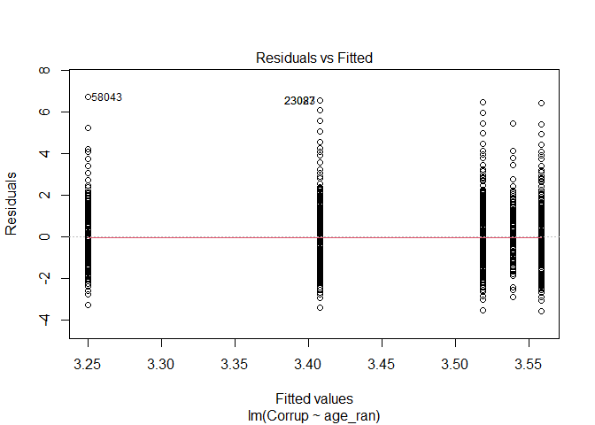<!-- -->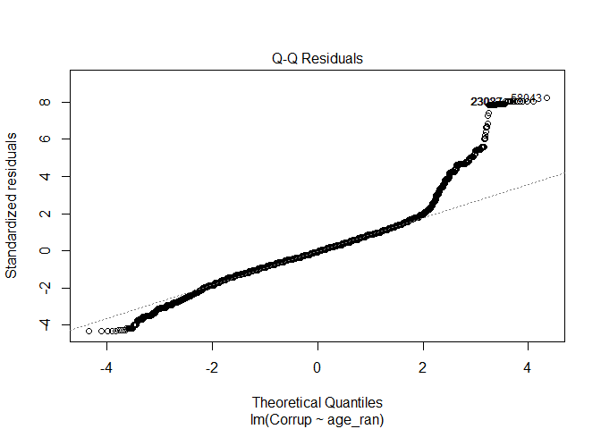<!-- -->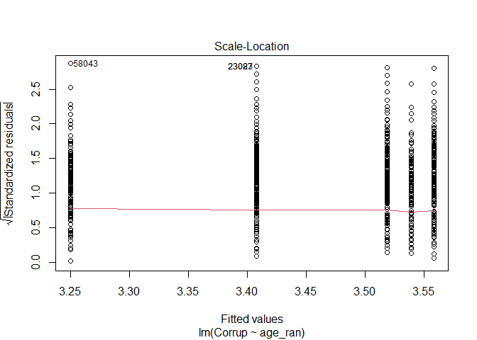<!-- -->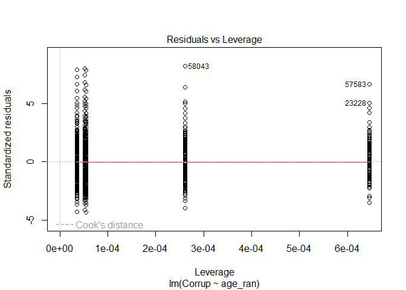<!-- -->

By evaluating the assumptions with the plots, we see that there is no
sign of violating the assumptions of linearity, homogeneity of
variances, or outliers. But, there are signs of violations of the
assumption of normally distributed residuals, at the tails of the
distributions.

## Effect size

As we still have only one predictor, the $R^2$, $\eta^2$, and $\omega^2$
will present the same results. We find that `Age ranges` explains 0.95%
of the outcome’s variance.

``` r
summary(mod_cat)$r.squared*100
```

    ## [1] 0.9524535

``` r
eta_squared(Anova(mod_cat, type=2), partial=F)
```

    ## # Effect Size for ANOVA (Type II)
    ## 
    ## Parameter |     Eta2 |       95% CI
    ## -----------------------------------
    ## age_ran   | 9.52e-03 | [0.01, 1.00]
    ## 
    ## - One-sided CIs: upper bound fixed at [1.00].

``` r
omega_squared(Anova(mod_cat, type=2), partial=F)
```

    ## # Effect Size for ANOVA (Type II)
    ## 
    ## Parameter |   Omega2 |       95% CI
    ## -----------------------------------
    ## age_ran   | 9.47e-03 | [0.01, 1.00]
    ## 
    ## - One-sided CIs: upper bound fixed at [1.00].

## Slope plots

We can also plot the “slopes” for categorical predictors, in this case
the model predictions will be predicted means and confidence intervals
fo each group. Here we can see that *Perception of corruption* is very
similar between the first age groups, and then it goes down.

``` r
plot_predictions(mod_cat, condition = "age_ran")
```

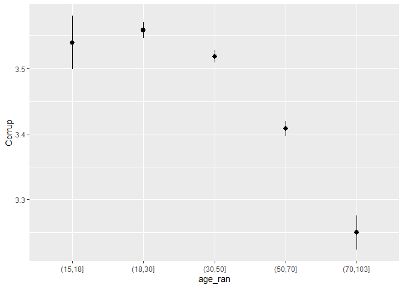<!-- -->

# Multiple Linear regression

An advantage of the General Linear Models, is the flexibility that they
have to include multiple predictors, and they can be any combination of
continuous and/or categorical.

In this following example we are adding 3 continuous predictors, and 2
categorical:

- Sex: Male, Female
- age_ran: age groups
- Y001: post-materialism index
- SACSECVAL: secular values
- LCGov: Lack of Confidence in the government

We see that we can add multiple predictors by adding to the original
formula, such as `Outcome ~ Predictor1 + Predictor2 + Predictor3 + ...`
. This way you can extend it with as many predictors as your data,
model, and theory allows it.

``` r
mod3 <- lm(Corrup ~ Sex + age_ran + Y001 + SACSECVAL + LCGov, data=dat2)
summary(mod3)
```

    ## 
    ## Call:
    ## lm(formula = Corrup ~ Sex + age_ran + Y001 + SACSECVAL + LCGov, 
    ##     data = dat2)
    ## 
    ## Residuals:
    ##     Min      1Q  Median      3Q     Max 
    ## -3.7281 -0.4490 -0.0286  0.4113  7.0043 
    ## 
    ## Coefficients:
    ##                  Estimate Std. Error t value Pr(>|t|)    
    ## (Intercept)      2.913334   0.022202 131.222  < 2e-16 ***
    ## SexFemale       -0.035892   0.005605  -6.404 1.52e-10 ***
    ## age_ran(18,30]   0.021358   0.019805   1.078    0.281    
    ## age_ran(30,50]  -0.017024   0.019542  -0.871    0.384    
    ## age_ran(50,70]  -0.117998   0.019780  -5.965 2.45e-09 ***
    ## age_ran(70,103] -0.289010   0.022564 -12.809  < 2e-16 ***
    ## Y001            -0.065113   0.002349 -27.718  < 2e-16 ***
    ## SACSECVAL       -1.074095   0.017122 -62.732  < 2e-16 ***
    ## LCGov            0.455979   0.004044 112.761  < 2e-16 ***
    ## ---
    ## Signif. codes:  0 '***' 0.001 '**' 0.01 '*' 0.05 '.' 0.1 ' ' 1
    ## 
    ## Residual standard error: 0.749 on 71624 degrees of freedom
    ## Multiple R-squared:  0.175,  Adjusted R-squared:  0.1749 
    ## F-statistic:  1899 on 8 and 71624 DF,  p-value: < 2.2e-16

``` r
confint(mod3, level=0.95)
```

    ##                       2.5 %      97.5 %
    ## (Intercept)      2.86981893  2.95684905
    ## SexFemale       -0.04687651 -0.02490687
    ## age_ran(18,30]  -0.01745946  0.06017593
    ## age_ran(30,50]  -0.05532630  0.02127836
    ## age_ran(50,70]  -0.15676810 -0.07922869
    ## age_ran(70,103] -0.33323527 -0.24478510
    ## Y001            -0.06971729 -0.06050864
    ## SACSECVAL       -1.10765399 -1.04053632
    ## LCGov            0.44805319  0.46390476

Or the simpler table with `parameters`

``` r
parameters(mod3, digits=3)
```

    ## Parameter         | Coefficient |    SE |           95% CI | t(71624) |      p
    ## ------------------------------------------------------------------------------
    ## (Intercept)       |       2.913 | 0.022 | [ 2.870,  2.957] |  131.222 | < .001
    ## Sex [Female]      |      -0.036 | 0.006 | [-0.047, -0.025] |   -6.404 | < .001
    ## age ran [>18-30]  |       0.021 | 0.020 | [-0.017,  0.060] |    1.078 | 0.281 
    ## age ran [>30-50]  |      -0.017 | 0.020 | [-0.055,  0.021] |   -0.871 | 0.384 
    ## age ran [>50-70]  |      -0.118 | 0.020 | [-0.157, -0.079] |   -5.965 | < .001
    ## age ran [>70-103] |      -0.289 | 0.023 | [-0.333, -0.245] |  -12.809 | < .001
    ## Y001              |      -0.065 | 0.002 | [-0.070, -0.061] |  -27.718 | < .001
    ## SACSECVAL         |      -1.074 | 0.017 | [-1.108, -1.041] |  -62.732 | < .001
    ## LCGov             |       0.456 | 0.004 | [ 0.448,  0.464] |  112.761 | < .001

    ## 
    ## Uncertainty intervals (equal-tailed) and p-values (two-tailed) computed
    ##   using a Wald t-distribution approximation.

When having a larger number of predictors, and combination of continuous
and categorical ones, it is useful to get the `Anova()` table. specially
because the NHST for the categorical predictor in the `parameters` table
is for the mean comparison between group2 against group1. While we are
also interested in the overall NHST of adding that predictor.

``` r
parameters(Anova(mod3, type=2))
```

    ## Parameter | Sum_Squares |    df | Mean_Square |        F |      p
    ## -----------------------------------------------------------------
    ## Sex       |       23.01 |     1 |       23.01 |    41.01 | < .001
    ## age_ran   |      434.43 |     4 |      108.61 |   193.59 | < .001
    ## Y001      |      431.01 |     1 |      431.01 |   768.27 | < .001
    ## SACSECVAL |     2207.77 |     1 |     2207.77 |  3935.34 | < .001
    ## LCGov     |     7133.26 |     1 |     7133.26 | 12714.99 | < .001
    ## Residuals |    40181.92 | 71624 |        0.56 |          |       
    ## 
    ## Anova Table (Type 2 tests)

The `Anova` table provides the NHST test for the null hypothesis of each
predictor having no relation to the outcome variable, keeping all other
predictors constant. For the continuous predictors this will be exactly
the same as the one from the `parameters` table.

## Model comparison

Before we had done two models, the first one with Just *Lack of
confidence* as predictor, and the second with just *Sex* as predictor.
Now we have added a total of five predictors.

Now we can also test the hypothesis of two models being equivalent. This
requires one model to be a subset of the second one. In this case we
will compare `mod1` with `mod3`. In this way `mod1` is a subset model
from `mod3`, as all the predictors of `mod1` are included in `mod3`,
with additional predictors.

We can compare the two models with the
\`\`ànova()`function, this is a general method in`R\`\`\` which
identifies the the type of models that are being compared, and uses the
correct method for the comparison. In this case does an *F-test*

``` r
anova(mod1, mod3)
```

    ## Analysis of Variance Table
    ## 
    ## Model 1: Corrup ~ LCGov
    ## Model 2: Corrup ~ Sex + age_ran + Y001 + SACSECVAL + LCGov
    ##   Res.Df   RSS Df Sum of Sq      F    Pr(>F)    
    ## 1  71631 43450                                  
    ## 2  71624 40182  7    3267.7 832.09 < 2.2e-16 ***
    ## ---
    ## Signif. codes:  0 '***' 0.001 '**' 0.01 '*' 0.05 '.' 0.1 ' ' 1

Here the degrees of freedom (*df*) are the difference in number of
estimated parameters. In this case, we reject the null hypothesis of
that both models are equally good at predicting *Perception of
corruption*. Would lead us to choose the larger model.

## Post-hoc comparisons

For the categorical predictor we can ask for the conditional pairwise
differences with the `avg_comparisons` function. These would be the
post-hoc comparisons, keeping all other predictors constant. For this
example we are only doing the pairwise comparison, but you can also do
the sequential or planned contrasts as in the previous example

``` r
pw4 <- avg_comparisons(mod3, 
                variables = list(age_ran="pairwise") )
pw4
```

    ## 
    ##            Contrast Estimate Std. Error       z Pr(>|z|)     S   2.5 %  97.5 %
    ##  (18,30] - (15,18]    0.0214    0.01980   1.078    0.281   1.8 -0.0175  0.0602
    ##  (30,50] - (15,18]   -0.0170    0.01954  -0.871    0.384   1.4 -0.0553  0.0213
    ##  (30,50] - (18,30]   -0.0384    0.00708  -5.419   <0.001  24.0 -0.0523 -0.0245
    ##  (50,70] - (15,18]   -0.1180    0.01978  -5.965   <0.001  28.6 -0.1568 -0.0792
    ##  (50,70] - (18,30]   -0.1394    0.00772 -18.055   <0.001 239.7 -0.1545 -0.1242
    ##  (50,70] - (30,50]   -0.1010    0.00699 -14.450   <0.001 154.8 -0.1147 -0.0873
    ##  (70,103] - (15,18]  -0.2890    0.02256 -12.809   <0.001 122.4 -0.3332 -0.2448
    ##  (70,103] - (18,30]  -0.3104    0.01333 -23.292   <0.001 396.2 -0.3365 -0.2843
    ##  (70,103] - (30,50]  -0.2720    0.01291 -21.062   <0.001 324.7 -0.2973 -0.2467
    ##  (70,103] - (50,70]  -0.1710    0.01326 -12.899   <0.001 124.0 -0.1970 -0.1450
    ## 
    ## Term: age_ran
    ## Type: response

## Standardize solution

Once we have decided to continue with `mod3`, we can also look at the
standardized slopes. Remember that this function *does not* standardized
the slopes for categorical predictors by default

``` r
standardize_parameters(mod3)
```

    ## # Standardization method: refit
    ## 
    ## Parameter         | Std. Coef. |         95% CI
    ## -----------------------------------------------
    ## (Intercept)       |       0.08 | [ 0.04,  0.13]
    ## Sex [Female]      |      -0.04 | [-0.06, -0.03]
    ## age ran [>18-30]  |       0.03 | [-0.02,  0.07]
    ## age ran [>30-50]  |      -0.02 | [-0.07,  0.03]
    ## age ran [>50-70]  |      -0.14 | [-0.19, -0.10]
    ## age ran [>70-103] |      -0.35 | [-0.40, -0.30]
    ## Y001              |      -0.10 | [-0.10, -0.09]
    ## SACSECVAL         |      -0.23 | [-0.23, -0.22]
    ## LCGov             |       0.41 | [ 0.40,  0.41]

If we use these standardized slopes to rank the predictors effects, we
would conclude that *lack of confidence* if the one with the larger
effect, and *Sex* is the with with the smallest effect. Remember that
for *age_ran* each of these coefficients are a pairwise cohen d against
the reference group. Remember that with this we can only rank the
effects, but cannot test if a predictor has an effect *significantly*
larger than another.

## Assumptions

We will again use the diagnostic plots to evaluate for violations of the
model assumptions

``` r
plot(mod3)
```

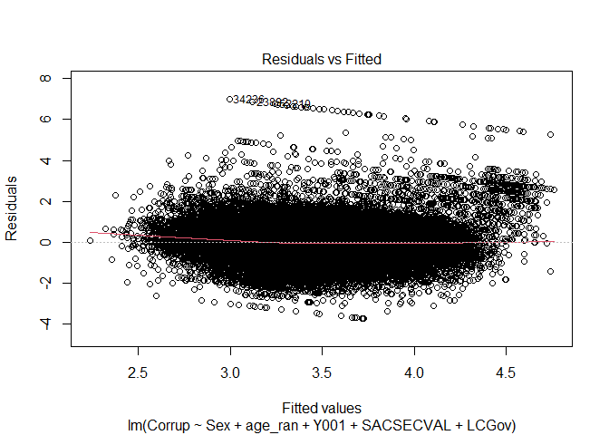<!-- -->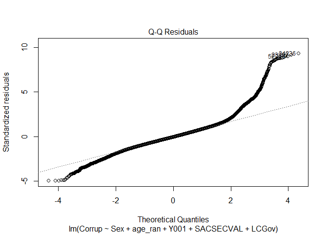<!-- -->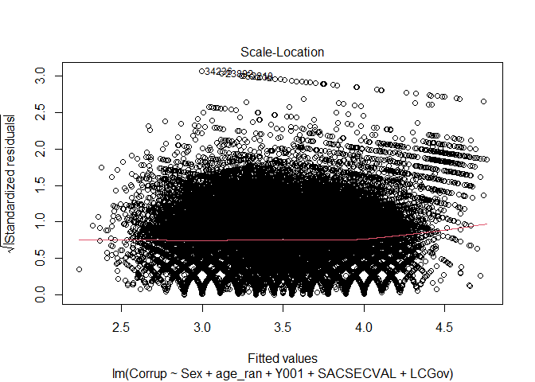<!-- -->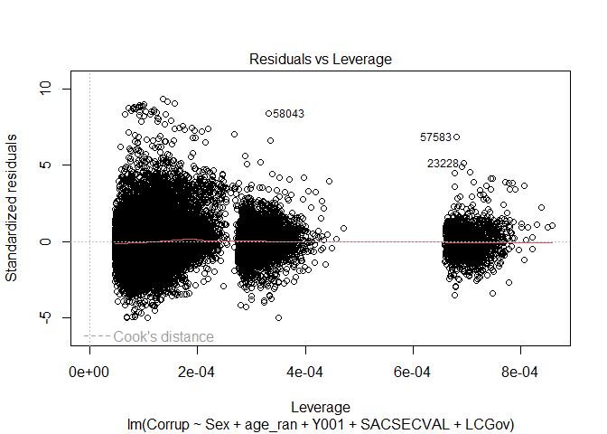<!-- -->

From the first, and third plots we see that there is a slight deviation
from the red *loess* line with the *expected* grey dotted line.
Indicating there might be small deviation from the linearity assumption
at the tails. This could be added into the model by adding the quadratic
effect of a predictor for example. But this still looks like small
deviation that would not lead me to consider it a meaningful violation.

The other plots lead to no indication of violations of the homogeneity
of variance assumption, or outliers. And as the other models, we see the
assumption of normally distributed residuals violated in the tails of
the distribution.

## Effect size

For the overall model effect size we can look at the $R^2$, and
$R^2_{adj}$ in the summary output

``` r
summary(mod3)
```

    ## 
    ## Call:
    ## lm(formula = Corrup ~ Sex + age_ran + Y001 + SACSECVAL + LCGov, 
    ##     data = dat2)
    ## 
    ## Residuals:
    ##     Min      1Q  Median      3Q     Max 
    ## -3.7281 -0.4490 -0.0286  0.4113  7.0043 
    ## 
    ## Coefficients:
    ##                  Estimate Std. Error t value Pr(>|t|)    
    ## (Intercept)      2.913334   0.022202 131.222  < 2e-16 ***
    ## SexFemale       -0.035892   0.005605  -6.404 1.52e-10 ***
    ## age_ran(18,30]   0.021358   0.019805   1.078    0.281    
    ## age_ran(30,50]  -0.017024   0.019542  -0.871    0.384    
    ## age_ran(50,70]  -0.117998   0.019780  -5.965 2.45e-09 ***
    ## age_ran(70,103] -0.289010   0.022564 -12.809  < 2e-16 ***
    ## Y001            -0.065113   0.002349 -27.718  < 2e-16 ***
    ## SACSECVAL       -1.074095   0.017122 -62.732  < 2e-16 ***
    ## LCGov            0.455979   0.004044 112.761  < 2e-16 ***
    ## ---
    ## Signif. codes:  0 '***' 0.001 '**' 0.01 '*' 0.05 '.' 0.1 ' ' 1
    ## 
    ## Residual standard error: 0.749 on 71624 degrees of freedom
    ## Multiple R-squared:  0.175,  Adjusted R-squared:  0.1749 
    ## F-statistic:  1899 on 8 and 71624 DF,  p-value: < 2.2e-16

Here we see that the overall model explains 17.5% of the variance in
*Perception of corruption*. But this only presents the overall model
effect, it does not account for the predictive effect of each predictor.

We can identiy each predictor’s predictive effect with the full $\eta^2$
and $\omega^2$. Notice to estimate the *full* version of these metrics
we need to specify `partial=F`, so it does not estimate the partial
version.

These can be interpreted as the **proportion of variance in the outcome
that es explained uniquely by each predictor**

When we have more than 1 predictor we need to change type of sum of
squares used to calculate the ffect sizes, We can do that with `Anova()`
function from the `car` package. this way we change it to `type=2` sum
of squares.

Notice that I am putting all this call insie the `print()` function so I
can define the number of decimals to present (`digits=4`)

``` r
print(eta_squared(Anova(mod3,type=2), partial=F), digits=4)
```

    ## # Effect Size for ANOVA (Type II)
    ## 
    ## Parameter |   Eta2 |           95% CI
    ## -------------------------------------
    ## Sex       | 0.0005 | [0.0002, 1.0000]
    ## age_ran   | 0.0086 | [0.0075, 1.0000]
    ## Y001      | 0.0085 | [0.0075, 1.0000]
    ## SACSECVAL | 0.0438 | [0.0414, 1.0000]
    ## LCGov     | 0.1415 | [0.1377, 1.0000]
    ## 
    ## - One-sided CIs: upper bound fixed at [1.0000].

``` r
print(omega_squared(Anova(mod3,type=2), partial=F), digits=4)
```

    ## # Effect Size for ANOVA (Type II)
    ## 
    ## Parameter | Omega2 |           95% CI
    ## -------------------------------------
    ## Sex       | 0.0004 | [0.0002, 1.0000]
    ## age_ran   | 0.0086 | [0.0074, 1.0000]
    ## Y001      | 0.0085 | [0.0075, 1.0000]
    ## SACSECVAL | 0.0438 | [0.0414, 1.0000]
    ## LCGov     | 0.1415 | [0.1377, 1.0000]
    ## 
    ## - One-sided CIs: upper bound fixed at [1.0000].

We can also estimate the partial version of these metrics $\eta^2_p$ and
$\omega^2_p$. Which are interpreted as the **proportion of variance in
the outcome that uniquely explained by each predictor, that is not
explained by any other predictor**.

``` r
eta_squared(Anova(mod3,type=2), partial=T)
```

    ## # Effect Size for ANOVA (Type II)
    ## 
    ## Parameter | Eta2 (partial) |       95% CI
    ## -----------------------------------------
    ## Sex       |       5.72e-04 | [0.00, 1.00]
    ## age_ran   |           0.01 | [0.01, 1.00]
    ## Y001      |           0.01 | [0.01, 1.00]
    ## SACSECVAL |           0.05 | [0.05, 1.00]
    ## LCGov     |           0.15 | [0.15, 1.00]
    ## 
    ## - One-sided CIs: upper bound fixed at [1.00].

``` r
omega_squared(Anova(mod3,type=2), partial=T)
```

    ## # Effect Size for ANOVA (Type II)
    ## 
    ## Parameter | Omega2 (partial) |       95% CI
    ## -------------------------------------------
    ## Sex       |         5.58e-04 | [0.00, 1.00]
    ## age_ran   |             0.01 | [0.01, 1.00]
    ## Y001      |             0.01 | [0.01, 1.00]
    ## SACSECVAL |             0.05 | [0.05, 1.00]
    ## LCGov     |             0.15 | [0.15, 1.00]
    ## 
    ## - One-sided CIs: upper bound fixed at [1.00].

Here we recommend the use of the *full* version of these metrics as it
presents a more direct interpretation, but the partial versions might be
commonly found in publications as they are default in other software.

$\eta^2$ can bee seen as the equivalent to the $R^2$, and $\omega^2$ as
the equivalent to $R^2_{adj}$. But for the individual predictor’s
effects

## Conditional Slope plots

For plotting the regression slopes, when we had a single predictor the
regression slope was equivalent to the scatter-plot. Now that we have
multiple predictors, the plots present the regression line when all the
other predictors are held constant, the conditional slopes. We can plot
these with the `plot_predictions()` function, and specify which
predictor to plot with the `condition` argument

``` r
plot_predictions(mod3, condition = "Sex")
```

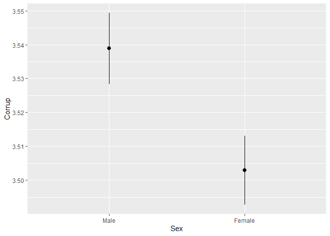<!-- -->

``` r
plot_predictions(mod3, condition = "age_ran")
```

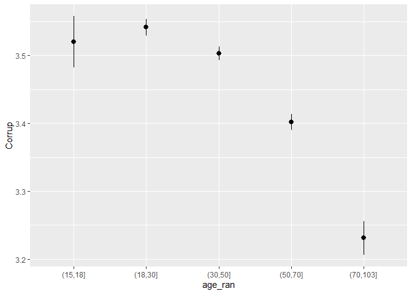<!-- -->

``` r
plot_predictions(mod3, condition = "Y001")
```

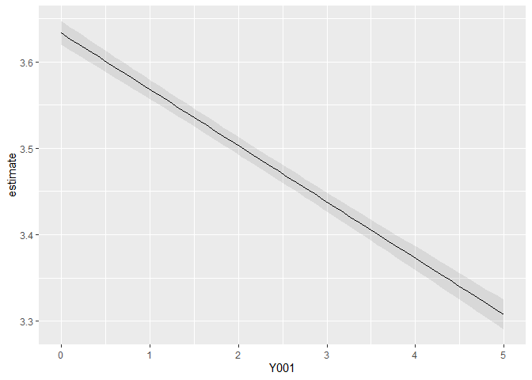<!-- -->

``` r
plot_predictions(mod3, condition = "SACSECVAL")
```

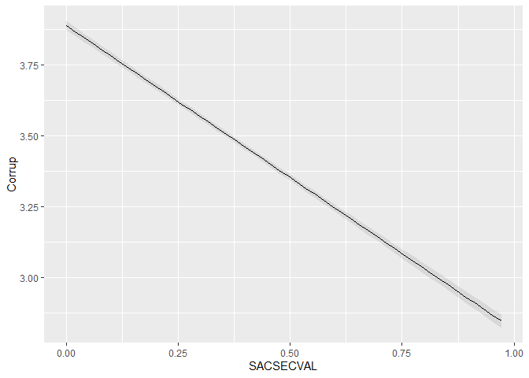<!-- -->

``` r
plot_predictions(mod3, condition = "LCGov")
```

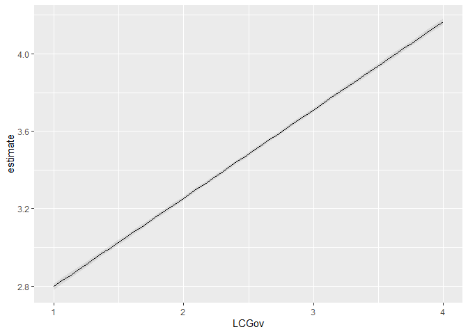<!-- -->

If we want to export all the plots together we can use the functionality
from the package `patchwork`. So that when it is loaded
(`library(patchwork)`) we can simple add `+` between plots and they will
be presented together

``` r
plot_predictions(mod3, condition = "Sex")+
  plot_predictions(mod3, condition = "age_ran")+
  plot_predictions(mod3, condition = "Y001")+
  plot_predictions(mod3, condition = "SACSECVAL")+
  plot_predictions(mod3, condition = "LCGov")
```

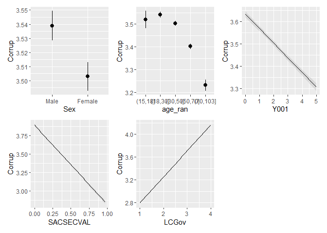<!-- -->

## Interpretation of the results

Now, there are a lot more pieces to add to the interpretation. Lets
start with the overall model null hypothesis test, from the
`summary(mod3)`

- We reject the null hypothesis that the overall model is equivalent to
  the mean model at predicting *Perception of corruption*,
  $F(8, 71624) = 1899, p < .001$. With the overall model explaining
  17.5% ($R^2 = 0.175$) of the variance in the outcome

Then we can continue to explain the effect of each predictor, by adding
information from the `parameters()`, `standardize_parameters()`, and
`eta_squared()` functions

- The expected average score of *Perception of corruption* for *Males*,
  *Age* between 15 and 18, and with 0 scores in all predictors is 2.91
  ($b_0 = 2.91, SE = 0.02, p < .001$), and we reject the null hypothesis
  of this expected score being equal to 0.
- We find that *Female* have in average a *Perception of corruption*
  0.04 points lower than *Male* ($b_1 = -0.035, SE = 0.005, p < .001$),
  while holding all other predictors constant. We reject the null
  hypothesis of this mean difference being equal to 0. We see that *Sex*
  uniquely explains 0.05% ($\eta^2 = 0.0005$) of the variance of the
  outcome.
- Holding all other predictors constant, we reject the null hypothesis
  pair means being equal for all pairwise comparisons except for 2. For
  the ones that we fail to reject are *(18,30\] - (15,18\]* and
  *(30,50\] - (15,18\]*. Indicating that the mean differences are
  smaller at the first agre groups. And we reject the null hypothesis as
  age ranges increase. This trend has a slight parabolic shape (as seen
  in the plot). We see that *Age* uniquely explains 0.86%
  ($\eta^2 = 0.0086$) of the variance of the outcome.
- As *Post-materialism* increases by 1 unit, *Perception of corruption*
  decreases by 0.065 points in
  average($b_3 = -0.065, SE = 0.002, p < .001$), while holding all other
  predictors constant. We reject the null hypothesis of this slope being
  equal to 0. We see that *Post-materialism* uniquely explains 0.85%
  ($\eta^2 = 0.008$) of the variance of the outcome.
- As *Secular values* increases by 1 unit, *Perception of corruption*
  decreases by 1.07 points in
  average($b_4 = -1.07, SE = 0.017, p < .001$), while holding all other
  predictors constant. We reject the null hypothesis of this slope being
  equal to 0. We see that *Secular values* uniquely explains 4.38%
  ($\eta^2 = 0.04$) of the variance of the outcome.
- As *Lack of Confidence in the Government* increases by 1 unit,
  *Perception of corruption* increases by 0.455 points in
  average($b_5 = 0.456, SE = 0.004, p < .001$), while holding all other
  predictors constant. We reject the null hypothesis of this slope being
  equal to 0. We see that *Lack of Confidence in the Government*
  uniquely explains 14.15% ($\eta^2 = 0.14$) of the variance of the
  outcome.
- Based on the relative effect measure of $\eta^2$ we can conclude that
  *Lack of Confidence in the Government* presents the stronger
  predictive effect, while *Sex* presents the lowest predictive effect.
  After controlling for the other predictors.
